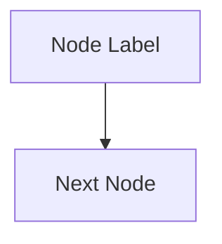

# Convert LaTeX Chapter to Markdown

Faithful word-for-word conversion of a LaTeX chapter into GitHub-flavored markdown. Every sentence, equation, citation, and table is preserved exactly. TikZ diagrams are recreated as Mermaid (or described in prose for plots). Intended for LLM consumption on restricted machines.

## Arguments

The skill expects these details (ask if not provided):

- **Source file:** path to the `.tex` chapter (e.g., `vol-learning-guide/chapters/06-har-model.tex`)
- **Output file:** path for the `.md` file (e.g., `vol-learning-guide/markdown/ch06-har-model.md`)
- **Preamble:** path to the guide's `preamble.tex` (needed for custom macro expansion)
- **Omissions:** any content to skip (e.g., worked examples, specific subsections)

## Conversion Rules

### Box Types

All `tcolorbox` environments become blockquotes with bold type labels. Multi-paragraph content uses `>` continuation on every line, including `$$` blocks inside boxes.

| LaTeX Environment | Markdown Rendering |
|---|---|
| `\begin{prereq}[Title]` | `> **Prereq: Title**` |
| `\begin{intuition}[Title]` | `> **Intuition: Title**` |
| `\begin{keyidea}[Title]` | `> **Key Idea: Title**` |
| `\begin{keyresult}[Title]` | `> **Key Result: Title**` |
| `\begin{definition}[Title]` | `> **Definition: Title**` |
| `\begin{warning}[Title]` | `> **Warning: Title**` |
| `\begin{projectconnection}[Title]` | `> **Project Connection: Title**` |
| `\begin{application}[Title]` | `> **Application: Title**` |
| `\begin{workedexample}{Title}` | **Omit entirely** (unless user says otherwise) |

If the guide defines additional box types not listed here, follow the same pattern: `> **Type Name: Title**`.

### Mathematical Content

- **Inline:** `$...$` preserved exactly
- **Display:** `$$...$$` blocks
- **Equation labels:** omit `\label{}`/`\ref{}` -- use descriptive text instead
- **All LaTeX math commands** (`\operatorname{}`, `\text{}`, `\mathbb{}`, `\boldsymbol{}`, `\bm{}`) preserved as-is

### Custom Macro Expansion

Read the guide's `preamble.tex` and expand all `\newcommand` macros. Common ones:

| Macro | Expansion |
|---|---|
| `\RV` | `\operatorname{RV}` |
| `\BPV` | `\operatorname{BPV}` |
| `\HAR` | `\operatorname{HAR}` |
| `\QLIKE` | `\operatorname{QLIKE}` |
| `\IVol` | `\operatorname{IV}` |
| `\VRP` | `\operatorname{VRP}` |
| `\E` | `\mathbb{E}` |
| `\R` | `\mathbb{R}` |
| `\N` | `\mathcal{N}` |
| `\loss` | `\mathcal{L}` |
| `\bX` | `\mathbf{X}` |
| `\by` | `\mathbf{y}` |
| `\bbeta` | `\bm{\beta}` |
| `\btheta` | `\bm{\theta}` |
| `\SHAP` | `\operatorname{SHAP}` |

Always check the actual preamble -- macros vary by guide.

### Citations

- `\citet{Key2009}` becomes `Author (Year)`, e.g., `Corsi (2009)`
- `\citep{Key2009}` becomes `(Author, Year)`, e.g., `(Bollerslev et al., 2016)`
- Look up author names from the guide's `references.bib`

### Cross-References

- **Same chapter:** descriptive text, e.g., "Section 6.2 above"
- **Other chapter:** relative markdown link, e.g., `[Chapter 5](ch05-garch-family.md)`
- **Equations:** descriptive text, e.g., "the HAR equation" or "Equation 6.1"
- **Figures:** descriptive text, e.g., "the diagram above"

To resolve `\ref{ch:label}` to the correct markdown filename, read the guide's `main.tex` to find the `\input{}` order and `\label{}` assignments. Map each label to the corresponding chapter file. If an INDEX.md already exists in the output directory, use it as the authoritative filename reference.

### Tables

GitHub-flavored markdown with `|` delimiters. Use `booktabs`-style alignment (no vertical rules, clean headers). Preserve all data exactly.

### Formatting

- No em dashes (use commas, semicolons, or parentheses instead)
- Bold on first use of defined terms (matching the LaTeX `\textbf{}`)
- `\emph{}` becomes `*italic*`
- `\texttt{}` becomes `` `code` ``
- Itemize/enumerate become markdown lists
- `\footnote{}` content folded inline or appended as parenthetical

## Diagram Conversion

### Flowcharts, conceptual, architecture, decision, comparison diagrams

Recreate as Mermaid fenced code blocks:

````markdown

````

Conventions:
- `flowchart LR` for pipelines, `flowchart TD` for hierarchies
- Blue for data/inputs, green for computation, orange for models/outputs (use `style` or `classDef`)
- Subgraphs for related component groups
- Dashed lines (`-.->`) for optional/feedback paths
- Thick arrows (`==>`) for primary flows, thin (`-->`) for secondary

Follow each diagram with an italicized caption paragraph matching the LaTeX `\caption{}`.

### pgfplots (scatter, histogram, ACF, distribution curves)

Cannot be recreated as Mermaid. Describe in an italicized prose paragraph with key numerical values:

```markdown
*[Figure: ACF of daily realized variance for S&P 500 (2012--2023).
Autocorrelation at lag 1: 0.62. Decays hyperbolically, still significant at lag 100.
This slow decay is the signature of long memory.]*
```

## Per-Chapter Pipeline

### Step 1: Read Source

Read the full `.tex` file and the guide's `preamble.tex` (for macro definitions).

### Step 2: Convert

- Convert all prose word-for-word
- Render boxes as blockquotes (skip any omitted types)
- Convert tables to GFM markdown
- Preserve all math, expanding custom macros
- Convert citations to inline text
- Convert cross-references to links or descriptive text

### Step 3: Recreate Diagrams

For each `\begin{tikzpicture}` block:
1. Classify: flowchart / conceptual / architecture / decision / comparison / plot
2. Flowcharts and conceptual diagrams: recreate as Mermaid
3. pgfplots: describe in italicized prose

### Step 4: Verify

- [ ] No content dropped (except specified omissions)
- [ ] No mangled math (check `$` pairing, `$$` blocks)
- [ ] All boxes converted with correct type labels
- [ ] Mermaid syntax valid (no unclosed subgraphs, no unescaped special chars)
- [ ] Cross-references resolve (links use correct filenames)
- [ ] No em dashes
- [ ] No worked examples (unless user requested otherwise)

### Step 5: Write and Commit

Write the `.md` file. If converting multiple chapters, commit in batches by part.

## Batch Conversion

All chapters in a guide are independent. For bulk conversion, dispatch parallel subagents (one per chapter or per part), **each dispatched with `model: 'opus'`** (the `opus` alias = Opus 4.8) so no sub-agent runs on a cheaper model. Each subagent gets:
- This skill's rules
- The source `.tex` file path
- The output `.md` file path
- The preamble path
- The omission list
