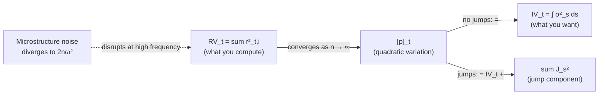

# Realized Volatility

> **Application: Why This Chapter**
>
> Realized volatility is the target variable for every project direction in this guide.
> [Chapter 3](ch03-microstructure-noise.md) and [Chapter 4](ch04-jumps-continuous-variation.md) refine the estimator (handling noise and jumps), [Chapter 6](ch06-har-model.md) builds the HAR forecasting model around it, and [Chapter 10](ch10-feature-engineering.md) uses RV-derived features.
> You need to understand RV at an intuitive level (what it measures, how it is constructed, why 5-minute sampling) before any of that.

[Chapter 1](ch01-returns-variance-volatility.md) introduced variance as a measure of how spread out returns are.
That chapter computed variance from daily returns over weeks or months, producing a single number for the whole sample: unconditional volatility.
This chapter moves to a different question: how volatile was the market *today*?
Answering that requires looking inside the trading day at high-frequency (intraday) returns.

## The Theoretical Target: Integrated Variance

Before building an estimator, you need to know what you are estimating.
The theoretical quantity is called *integrated variance*.

> **Prereq: Integrals as Accumulated Area**
>
> If $f(x)$ is a non-negative function, the integral $\int_a^b f(x)\,dx$ equals the area under the curve $f$ between $a$ and $b$.
> When $f$ varies over time, the integral accumulates all of those local values into a single total.
> You can think of $\int_a^b f(x)\,dx$ as "add up all the tiny contributions of $f$ across the interval $[a,b]$."

> **Prereq: Price Processes (Informal)**
>
> In continuous-time finance, the log price $p_t = \ln P_t$ evolves according to
> $$dp_t = \mu_t\,dt + \sigma_t\,dW_t$$
> You do not need stochastic calculus to follow this chapter.
> Here is what the equation says in plain English: over any tiny time interval, the change in the log price is made up of two pieces:
>
> - $\mu_t\,dt$: a small predictable nudge (the drift, or expected return per unit time). At intraday horizons this is negligibly small and we ignore it.
> - $\sigma_t\,dW_t$: a random shock whose size is controlled by $\sigma_t$ (the instantaneous volatility). $W_t$ is a Wiener process (continuous random walk), so $dW_t$ is a tiny random push that is equally likely to be positive or negative.
>
> The key takeaway: $\sigma_t$ is the quantity that controls how much the price wiggles at each instant, and it can change from moment to moment within the day.

> **Prereq: Time Notation Convention**
>
> Throughout this guide, $t$ is an integer day counter.
> Day $t$ runs from the market close on day $t-1$ to the market close on day $t$.
> Inside day $t$, we use $s$ (in integrals) or $i$ (in sums) to index moments or sub-intervals within that day.
> So $\sigma_s$ is the instantaneous volatility at some moment $s$ during the day, while $r_{t,i}$ is the return over the $i$-th intraday interval on day $t$.

At every instant during the trading day, there is a local volatility level $\sigma_t$ describing how rapidly the price fluctuates.
This level is not constant; it changes as news arrives, liquidity shifts, and traders adjust positions.
*Integrated variance* adds up all of these instantaneous variance levels across the day to produce a single summary of total price variation.

Think of it by analogy: if you drive a car at varying speeds throughout the day, the total distance driven is the integral of your speed over time.
Integrated variance is the "total distance" of price fluctuation.

> **Definition: Integrated Variance**
>
> For a log-price process $p_t$ with instantaneous variance $\sigma^2_t$, the integrated variance over day $t$ (from the close of day $t-1$ to the close of day $t$) is:
> $$\operatorname{IV}_t = \int_{t-1}^{t} \sigma^2_s \, ds$$
>
> - $\operatorname{IV}_t$: integrated variance over day $t$
> - $\sigma^2_s$: instantaneous variance at time $s$ within the day
> - $ds$: an infinitesimal increment of time
> - The integral sums the instantaneous variances from the previous close ($t-1$) to today's close ($t$)

Integrated variance is a *latent* quantity: you never observe $\sigma^2_s$ directly.
The entire point of this chapter is to estimate $\operatorname{IV}_t$ from observable intraday price data.

## Realized Variance as an Estimator

You now know the target: integrated variance $\operatorname{IV}_t$.
The question is how to estimate it from data you can actually observe.
The answer, developed by Andersen, Bollerslev, Diebold, and Labys (2001) and Barndorff-Nielsen and Shephard (2002), is simple: sum up squared intraday returns.

### Construction

Divide the trading day into $n$ equal intervals.
At the end of each interval, record the price.
Compute the log return over each interval.
Square each return and sum.

> **Definition: Realized Variance**
>
> Given $n$ intraday log returns $r_{t,1}, r_{t,2}, \ldots, r_{t,n}$ within day $t$, the realized variance is:
> $$\operatorname{RV}_t = \sum_{i=1}^{n} r^2_{t,i}$$
>
> - $\operatorname{RV}_t$: realized variance for day $t$
> - $r_{t,i}$: the $i$-th intraday log return on day $t$; that is, $r_{t,i} = p_{t,i} - p_{t,i-1}$, where $p_{t,i}$ is the log price at the end of the $i$-th interval
> - $n$: the number of intraday intervals (e.g., $n = 78$ for 5-minute intervals over a 6.5-hour U.S. equity trading day)
> - No mean subtraction: the sample mean of intraday returns is so close to zero that omitting it improves finite-sample performance (Andersen, Bollerslev, Diebold, and Labys, 2003)

> **Intuition: Why Squaring Works (Deeper)**
>
> From the price process equation above ($dp_t = \mu_t\,dt + \sigma_t\,dW_t$), each small intraday return is approximately the local volatility times a random draw: $r_{t,i} \approx \sigma_{t,i}\,\epsilon_i$, where $\sigma_{t,i}$ is the volatility during interval $i$ and $\epsilon_i$ is a random variable with mean zero and variance one (coming from the Wiener process increments).
> Squaring gives $r^2_{t,i} \approx \sigma^2_{t,i}\,\epsilon^2_i$.
> Since $\epsilon_i$ has variance 1 and mean 0, $\mathbb{E}[\epsilon^2_i] = \operatorname{Var}(\epsilon_i) + (\mathbb{E}[\epsilon_i])^2 = 1 + 0 = 1$.
> So on average, each squared return equals the local variance: $\mathbb{E}[r^2_{t,i}] \approx \sigma^2_{t,i}$.
> Summing across the day accumulates these local variance snapshots.
> As intervals shrink ($n \to \infty$), the random fluctuations in each $\epsilon^2_i$ average out, and the sum converges to the integrated variance.

### Why It Works: Convergence to Quadratic Variation

Why should summing squared (rather than absolute or cubed) returns give us anything meaningful?
The answer comes from a deep result in probability theory: for processes like stock prices, the sum of squared increments converges to a specific quantity called the **quadratic variation**, and this quantity equals the integrated variance we're trying to measure.
This subsection explains that result.

> **Prereq: Quadratic Variation (Informal)**
>
> For a continuous-time stochastic process $X_t$, the quadratic variation $[X]_t$ measures the cumulative squared increments of the path up to time $t$.
> It is defined as the limit of the sum of squared increments as the partition becomes infinitely fine:
> $$[X]_t = \lim_{n \to \infty} \sum_{i=1}^{n} (X_{t_i} - X_{t_{i-1}})^2$$
> For a process with continuous paths (no jumps), the quadratic variation equals the integrated variance: $[X]_t = \int_0^t \sigma^2_s\,ds$.
> If the process has jumps, the quadratic variation also captures the sum of squared jumps.
>
> The chain to remember: RV (what you compute from data) $\to$ QV (the limit as sampling gets infinitely fine) $=$ IV (the true volatility you want, if there are no jumps).
> Quadratic variation is the theoretical bridge connecting your finite-sample computation to the true quantity of interest.

The central result is this: as you sample more frequently (as $n \to \infty$ and the length of each interval $\Delta \to 0$), the sum of squared returns converges to the quadratic variation of the log-price process (Andersen, Bollerslev, Diebold, and Labys, 2001; Barndorff-Nielsen and Shephard, 2002):

$$\operatorname{RV}_t \xrightarrow{p} [p]_t \quad \text{as } \Delta \to 0$$

- $\xrightarrow{p}$: convergence in probability (meaning the estimate gets arbitrarily close to the true value as sampling gets finer)
- $[p]_t$: quadratic variation of the log-price process on day $t$
- $\Delta = 1/n$: the length of each sampling interval (as a fraction of the trading day)

> **Intuition: In Plain English**
>
> Think of it like measuring the total wobble of a drunk person's walk: the more finely you measure their steps, the more zigzags you capture.
> As your measurement gets infinitely fine, you converge on the *true* total wobble.
> That true total wobble is the quadratic variation $[p]_t$.

Now, what exactly is this quadratic variation equal to?
That depends on whether the price path had any sudden jumps during the day.

If the price path is continuous (no jumps), then the quadratic variation equals the integrated variance, exactly:
$$[p]_t = \operatorname{IV}_t \qquad (\text{no jumps})$$

If the price path has jumps (sudden discontinuous moves, like a price gap after an earnings announcement), the quadratic variation picks up an extra component:
$$[p]_t = \operatorname{IV}_t + \sum_{s \leq t} (J_s)^2 \qquad (\text{with jumps})$$

- $J_s$: the jump in log price at time $s$ (zero if no jump occurs at $s$). Some papers write this as $\Delta p_s$; we use $J_s$ here to avoid confusion with $\Delta$ (sampling interval length) used elsewhere.
- The sum looks like it runs over infinitely many times, but in practice there are only a few jumps per day (or none), so the sum has at most a handful of nonzero terms.
- Separating jumps from continuous variation is the subject of [Chapter 4](ch04-jumps-continuous-variation.md).

> **Project Connection: Why This Matters**
>
> In practice, jumps are relatively rare but can be large.
> Including jump variation in your forecasting target adds noise: jumps are hard to predict (they're often driven by surprise events), so your model gets a noisier signal.
> Many of the best forecasting models (HAR-CJ, SHAR) separate the jump and continuous components and model them separately, because the continuous part is far more persistent and predictable.

> **Key Result: Andersen, Bollerslev, Diebold, and Labys (2001), Barndorff-Nielsen and Shephard (2002): RV Consistency**
>
> Under mild regularity conditions, realized variance $\operatorname{RV}_t$ is a consistent estimator of quadratic variation $[p]_t$.
> In the absence of jumps, $\operatorname{RV}_t$ consistently estimates integrated variance $\operatorname{IV}_t$.
> This result holds regardless of the specific form of $\sigma_t$; the volatility process can be stochastic, path-dependent, or driven by latent factors.

The diagram below summarizes the full chain of relationships between the quantities introduced so far.

*The conceptual chain connecting the three key quantities. **RV** (what you compute from data) converges to **QV** (a mathematical limit) as sampling gets finer. Without jumps, QV equals **IV** (the true volatility you want). With jumps, QV includes both IV and a jump component ([Chapter 4](ch04-jumps-continuous-variation.md) separates them). Microstructure noise disrupts the convergence at high sampling frequencies ([Chapter 3](ch03-microstructure-noise.md) fixes this).*

The next figure illustrates the convergence idea: as you chop the day into more intervals, the sum of squared returns gets closer to the true integrated variance.

*Convergence of RV to integrated variance (scatter plot). The horizontal axis is the number of intraday intervals $n$ (marked at 6, 13, 26, 52, 78, 100); the vertical axis is the realized variance estimate. A dashed blue line marks the true $\operatorname{IV}_t$ at 1.1. Each red dot is an RV estimate from a different simulated day. With only 6 intervals (hourly sampling), estimates are scattered widely (roughly 0.62 to 2.15) around the truth; with 78 intervals (5-minute sampling) they cluster tightly (roughly 1.05 to 1.15); by 100 intervals they sit within about 1.06 to 1.13. This is the convergence result $\operatorname{RV}_t \xrightarrow{p} [p]_t$ in action. (In practice, microstructure noise prevents going much beyond 78 intervals.)*

### Diagram: Building RV from a Price Path

The figure below shows how RV is constructed from a single day's price data.

*Constructing realized variance from a price path (price-vs-time plot). The horizontal axis is time of day from 9:30 to 4:00; the vertical axis is price in dollars (ranging roughly 100.00 to 100.85). A gray curve traces the continuous intraday price. Blue dots mark prices sampled at half-hourly intervals ($n = 13$ intervals), connected by straight blue segments. Each interval produces a log return $r_{t,i}$ (the first few, $r_{t,1}, r_{t,2}, r_{t,3}$, are annotated). RV is the sum of all squared returns, shown in a callout as $\operatorname{RV}_t = r_{t,1}^2 + r_{t,2}^2 + \cdots + r_{t,13}^2$. Sampling more frequently (e.g., every 5 minutes instead of 30) produces more terms in the sum and a more precise estimate.*

## How Frequently to Sample

You now have an estimator ($\operatorname{RV}_t$) and a convergence result (it approaches $[p]_t$ as $n \to \infty$).
The obvious next step is to sample as frequently as possible: every second, every tick, every trade.
In theory, this is optimal.
In practice, it fails.

### The Theory: More Is Better

The convergence result above says that RV becomes a better estimator as $\Delta$ shrinks.
The convergence result tells you RV approaches $\operatorname{IV}_t$ as you sample more frequently, but how *fast*? How precise is your estimate with, say, 78 five-minute intervals versus 390 one-minute intervals? Barndorff-Nielsen and Shephard (2002) showed the estimation error follows a central limit theorem:

$$\sqrt{n}\,(\operatorname{RV}_t - \operatorname{IV}_t) \xrightarrow{d} \mathcal{N}\!\left(0,\; 2\int_{t-1}^{t}\sigma^4_s\,ds\right)$$

- $\xrightarrow{d}$: convergence in distribution (the error becomes approximately normally distributed)
- $\sqrt{n}$: the estimation error shrinks at rate $1/\sqrt{n}$
- $\operatorname{RV}_t - \operatorname{IV}_t$: the gap between your estimate and the truth
- $2\int_{t-1}^{t}\sigma^4_s\,ds$: the asymptotic variance of the error (it depends on the "quarticity," the integral of $\sigma^4$, which measures how variable the volatility itself was during the day)

> **Intuition: In Plain English**
>
> This equation says: "the error in your RV estimate is approximately bell-shaped, centered on zero, and shrinks as $1/\sqrt{n}$."
> Doubling the number of intervals (going from 5-minute to 2.5-minute sampling) cuts your standard error by a factor of $\sqrt{2} \approx 1.41$.
>
> Why does $\sigma^4$ appear?
> Each squared return $r^2_{t,i}$ estimates the local variance $\sigma^2_{t,i}$, but with some error.
> The variance of that estimation error is proportional to $\sigma^4_{t,i}$ (because computing the variance of a squared quantity involves squaring something that is already squared).
> Summing these error variances across the day gives $\int \sigma^4_s\,ds$, called the "quarticity."
> On days when volatility was itself highly variable within the day, quarticity is large, and your RV estimate is less precise.

> **Project Connection: Why This Matters**
>
> The HARQ model ([Chapter 6](ch06-har-model.md)) explicitly accounts for this: it estimates each day's RV precision from the CLT and downweights noisy observations.
> Days with few intraday observations (holiday-shortened sessions) or wildly variable intraday vol have noisier RV, and a smart model adjusts for this.

So with perfect data, you would sample every millisecond and get an essentially noise-free estimate of integrated variance.

### The Practice: Microstructure Noise

Real transaction prices are not clean readings of a frictionless price process.
They are contaminated by *microstructure noise*: the cumulative effect of bid-ask bounce, discrete price grids, order-processing delays, and other trading frictions.

> **Prereq: Bid-Ask Bounce**
>
> When you buy a stock, you pay the *ask* price (slightly above the "true" value).
> When you sell, you receive the *bid* price (slightly below).
> The difference between bid and ask is the *spread*.
> Even if the true value is perfectly constant, alternating buys and sells cause the transaction price to bounce between bid and ask.
> This artificial oscillation creates spurious volatility in very high-frequency returns.

The standard model for microstructure noise (Andersen, Bollerslev, Diebold, and Labys, 2001; Barndorff-Nielsen and Shephard, 2002) captures this with a simple additive structure:
the price you actually observe is the "true" price plus some random noise from trading frictions.
$$p^*_{t,i} = p_{t,i} + \varepsilon_{t,i}$$

- $p^*_{t,i}$: observed (noisy) log price
- $p_{t,i}$: true (latent) efficient log price
- $\varepsilon_{t,i}$: microstructure noise, typically assumed i.i.d. with $\mathbb{E}[\varepsilon_{t,i}] = 0$ and $\operatorname{Var}(\varepsilon_{t,i}) = \omega^2$

> **Intuition: In Plain English**
>
> The noise variance $\omega^2$ is a property of the market: liquid stocks with tight bid-ask spreads have small $\omega^2$; illiquid stocks have larger $\omega^2$.

> **Project Connection: Why This Matters**
>
> When you download high-frequency price data for your project, you are downloading $p^*_{t,i}$, not $p_{t,i}$.
> This noise is baked into your data and cannot be removed by cleaning alone.
> The entire next chapter ([Chapter 3](ch03-microstructure-noise.md)) is about building RV estimators that work correctly despite this contamination.

When you compute returns from noisy prices, each observed return picks up the noise:
$r^*_{t,i} = r_{t,i} + (\varepsilon_{t,i} - \varepsilon_{t,i-1})$.
The noise part $(\varepsilon_{t,i} - \varepsilon_{t,i-1})$ has variance $\operatorname{Var}(\varepsilon_{t,i}) + \operatorname{Var}(\varepsilon_{t,i-1}) = 2\omega^2$ (since the two noise terms are independent).
When you sample very frequently, the true returns $r_{t,i}$ become tiny (the price barely moves in a millisecond), but each noise contribution is still $2\omega^2$ regardless of the interval length.
So the noise dominates, and RV diverges:
$$\operatorname{RV}_t^{(\text{noisy})} \to 2n\omega^2 \quad \text{as } n \to \infty$$

> **Intuition: In Plain English**
>
> Each noisy return contributes roughly $2\omega^2$ of garbage on average (from the noise term bouncing back and forth), and you're summing $n$ of these.
> As $n$ grows, the garbage accumulates linearly while the true signal grows more slowly, so the noise wins.
> This is why sampling every tick or every second gives you a wildly inflated RV.

> **Warning: Sampling Too Fast Destroys the Estimate**
>
> With tick-by-tick or second-by-second data, the bid-ask bounce inflates realized variance far above the true integrated variance.
> Sampling more frequently makes the estimate *worse*, not better.

### The Bias-Variance Tradeoff

The result is a tradeoff:

- **Sample too infrequently** (e.g., hourly): few observations, high estimation variance, but little noise contamination.
- **Sample too frequently** (e.g., every second): many observations, low estimation variance in theory, but massive upward bias from microstructure noise.

There is an optimal sampling frequency that balances these two forces.
The concept is often visualized with a *volatility signature plot*.

### The Volatility Signature Plot

> **Definition: Volatility Signature Plot**
>
> A volatility signature plot displays the average realized variance (or realized volatility), computed across many days, as a function of the sampling frequency.
> The $x$-axis shows the return interval (e.g., 1 second, 1 minute, 5 minutes, ...), and the $y$-axis shows the resulting average $\operatorname{RV}_t$.

The figure below shows the typical shape.

*Schematic volatility signature plot. The horizontal axis is the sampling interval (1s, 5s, 15s, 30s, 1m, 5m, 15m, 30m, 1h, 2h); the vertical axis is average realized variance ($\times 10^{-4}$). At very high frequencies (left, red), microstructure noise inflates realized variance sharply (from about 4.2 at 1s down toward 1.35 at 1m). In the intermediate region (center, green, roughly 1 to 15 minutes), RV flattens near the true integrated variance (a dashed blue line at 1.1), the "sweet spot." At very low frequencies (right, orange), too few observations make the estimate imprecise and biased downward (drifting to about 0.75 at 2h). [Chapter 3](ch03-microstructure-noise.md) develops noise-robust estimators that work at higher frequencies.*

The plot has three regions:

1. **High-frequency region** (left): RV rises sharply, contaminated by bid-ask bounce and microstructure effects.
2. **Intermediate region** (center): RV flattens near the true integrated variance. This is the practical sweet spot.
3. **Low-frequency region** (right): RV drifts downward and becomes noisy. The downward bias occurs because with fewer sample points, you miss many intraday price wiggles. Returns computed over long intervals smooth out the zigzags between your sparse sample points, producing smaller squared returns and hence a lower RV estimate.

> **Key Idea: The Fundamental Tradeoff**
>
> In theory, sample as fast as possible.
> In practice, noise wins beyond about 1-minute returns for most liquid assets.
> The volatility signature plot is a diagnostic tool: if average RV is still rising as you increase frequency, you are in the noise-contaminated region and need to back off (or use a noise-robust estimator from [Chapter 3](ch03-microstructure-noise.md)).

## 5-Minute RV: The Practical Workhorse

Given the tradeoff from the previous section, what sampling frequency should you use in practice?
The answer, for most applications, is 5 minutes.

This number is an empirical finding rather than a derivation from first principles (the optimal frequency depends on the noise-to-signal ratio, which varies by asset and time period), and it has proved remarkably robust.

> **Key Result: Liu, Patton, and Sheppard (2015): Does Anything Beat 5-Minute RV?**
>
> Liu, Patton, and Sheppard (2015) conducted a large-scale comparison of approximately 400 realized volatility estimators (including subsampled, kernel-based, pre-averaged, and multi-scale estimators) applied to 31 assets across 5 asset classes (equities, equity indices, exchange rates, bonds, and commodities).
> Their conclusion: for the purpose of *forecasting* future volatility, "it is difficult to significantly outperform" the simple 5-minute realized variance.
> More sophisticated estimators sometimes produce marginally more accurate daily estimates, but these gains do not reliably translate into better forecasts.

Why 5 minutes?
Two practical reasons:

1. For liquid assets (major equity indices, G10 FX pairs, actively traded stocks), the volatility signature plot typically flattens by the 5-minute mark. At this frequency, microstructure noise is small relative to genuine price variation.
2. 5-minute sampling produces 78 intraday observations per day for U.S. equities (6.5 hours $\times$ 12 intervals per hour), which provides enough observations for the central limit theorem above to give a reasonable approximation.

> **Warning: 5 Minutes Is Not Universal**
>
> For illiquid assets (small-cap stocks, emerging-market currencies, less-traded commodities), the noise-contaminated region can extend to 15 or even 30 minutes.
> Always check the volatility signature plot for your specific asset before committing to a sampling frequency.

## Realized Volatility vs. Realized Variance

This chapter has used "realized variance" for $\operatorname{RV}_t = \sum r^2_{t,i}$ and "realized volatility" for $\sqrt{\operatorname{RV}_t}$.
Not every paper follows this convention.

> **Warning: Variance vs. Volatility: A Factor-of-10 Error**
>
> The S&P 500's typical daily realized variance is around $1 \times 10^{-4}$.
> Its typical daily realized volatility is $\sqrt{1 \times 10^{-4}} = 0.01$ (1%).
> Confusing the two is a factor-of-100 error in the daily number, which becomes roughly a factor of 10 when annualized ($0.01 \times \sqrt{252} \approx 0.16$ vs. $0.0001 \times \sqrt{252} \approx 0.0016$).
> Whenever you read a paper, check whether the authors report $\operatorname{RV}_t$ or $\sqrt{\operatorname{RV}_t}$, and note the units (decimal, percent, or basis points).

> **Definition: Conventions in This Guide**
>
> Throughout this guide:
>
> - $\operatorname{RV}_t$ (and "RV") always refers to *realized variance*: $\operatorname{RV}_t = \sum_{i=1}^{n} r^2_{t,i}$
> - Realized *volatility* refers to $\sqrt{\operatorname{RV}_t}$, the square root of realized variance
> - When annualizing, multiply $\sqrt{\operatorname{RV}_t}$ by $\sqrt{252}$ (as in the annualizing section of [Chapter 1](ch01-returns-variance-volatility.md))
>
> These conventions follow Andersen, Bollerslev, Diebold, and Labys (2003) and Barndorff-Nielsen and Shephard (2002).

Some papers (particularly in the HAR literature, [Chapter 6](ch06-har-model.md)) work with the natural logarithm of realized variance, $\ln(\operatorname{RV}_t)$.
The log transform has two practical benefits:

1. $\operatorname{RV}_t$ is right-skewed and bounded below by zero; $\ln(\operatorname{RV}_t)$ is approximately Gaussian (Andersen, Bollerslev, Diebold, and Labys, 2001; Andersen, Bollerslev, Diebold, and Labys, 2003), making standard regression assumptions more plausible.
2. Forecasting $\ln(\operatorname{RV}_t)$ automatically ensures that predictions of the variance level are positive (since $e^x > 0$ for all $x$).

When you encounter $\ln(\operatorname{RV}_t)$ in later chapters, this is why.

## Summary

- **Integrated variance** $\operatorname{IV}_t = \int_{t-1}^{t} \sigma^2_s\,ds$ is the theoretical target: the total variance accumulated within a single day.

- **Realized variance** $\operatorname{RV}_t = \sum_{i=1}^{n} r^2_{t,i}$ is a model-free estimator of integrated variance, constructed by summing squared intraday returns.

- **Convergence**: as the sampling frequency increases ($n \to \infty$), RV converges in probability to the quadratic variation of the log-price process (Andersen, Bollerslev, Diebold, and Labys, 2001; Barndorff-Nielsen and Shephard, 2002).

- In the **absence of jumps**, quadratic variation equals integrated variance, so RV consistently estimates $\operatorname{IV}_t$.

- With **jumps**, quadratic variation equals integrated variance plus the sum of squared jumps. [Chapter 4](ch04-jumps-continuous-variation.md) addresses separating the two components.

- **Microstructure noise** (bid-ask bounce, discrete prices) corrupts very high-frequency returns, causing RV to diverge as sampling frequency increases.

- The **volatility signature plot** (average RV vs. sampling interval) visualizes the bias-variance tradeoff: too fast means noise contamination, too slow means imprecise estimates.

- **5-minute RV** is the standard benchmark. Liu, Patton, and Sheppard (2015) showed it is hard to beat for forecasting across 31 assets and ${\sim}400$ competing estimators.

- For **illiquid assets**, 5 minutes may still be in the noise-contaminated region; always check the volatility signature plot.

- **Convention**: this guide uses $\operatorname{RV}_t$ for realized variance and $\sqrt{\operatorname{RV}_t}$ for realized volatility. Confusing the two is roughly a factor-of-10 annualized error.

- The **log transform** $\ln(\operatorname{RV}_t)$ is approximately Gaussian and guarantees positive forecasts, which is why it appears frequently in later chapters.

- [Chapter 3](ch03-microstructure-noise.md) develops noise-robust estimators that can safely use higher frequencies; [Chapter 4](ch04-jumps-continuous-variation.md) separates continuous and jump variation.

### Key results referenced in this chapter

| Paper | Result | Relevance |
|-------|--------|-----------|
| Andersen, Bollerslev, Diebold, and Labys (2001) | Realized variance converges to quadratic variation as sampling frequency increases; the distribution of $\ln(\operatorname{RV}_t)$ is approximately Gaussian. | Foundational result establishing RV as a consistent, model-free volatility estimator. |
| Andersen, Bollerslev, Diebold, and Labys (2003) | Formal econometric theory for realized variance: consistency, asymptotic distribution, practical implementation with 5-minute FX returns, and the result that mean subtraction is unnecessary. | Provided the CLT for RV and demonstrated that dropping the intraday mean improves finite-sample accuracy. |
| Barndorff-Nielsen and Shephard (2002) | Parallel asymptotic theory for realized variance: consistency, CLT, and the additive noise model for microstructure contamination. | Second foundational contribution; BPV (introduced in later BNS papers) is the basis for jump detection in [Chapter 4](ch04-jumps-continuous-variation.md). |
| Liu, Patton, and Sheppard (2015) | Compared ${\sim}400$ realized estimators across 31 assets in 5 asset classes; simple 5-minute RV is very hard to beat for volatility forecasting. | Justifies 5-minute RV as the default benchmark for all forecasting models in this guide. |
