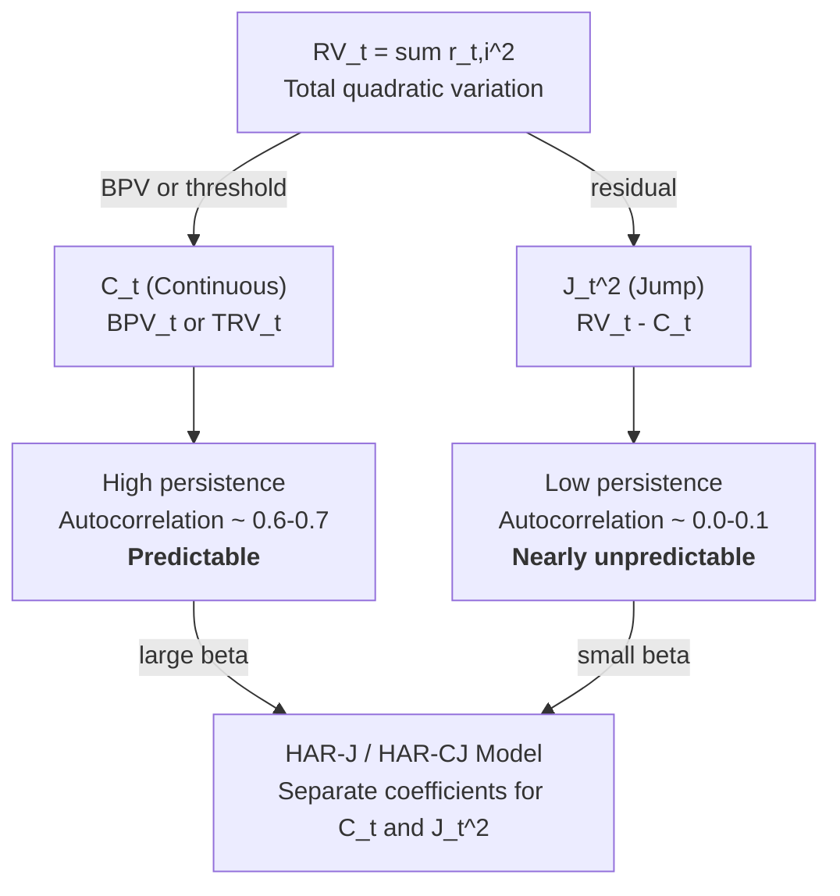

# Chapter 4: Jumps and Continuous Variation

> **Application: Why This Chapter**
>
> Separating jump variation from continuous variation is critical for forecasting.
> The HAR-J and HAR-CJ extensions ([Chapter 6](ch06-har-model.md)) split the RV signal into components with different persistence and predictability.
> Signed jump features appear in [Chapter 10](ch10-feature-engineering.md).
> Projects 1 and 4 use jump-decomposed features.

[Chapter 2](ch02-realized-volatility.md) showed that realized variance $\operatorname{RV}_t$ converges to the quadratic variation of the log-price process.
When the price path is continuous (no jumps), quadratic variation equals integrated variance, and $\operatorname{RV}_t$ is a clean estimator of $\operatorname{IV}_t$.
But prices do jump.
Earnings surprises, central bank announcements, and flash crashes all produce sudden, large price moves that do not come from the smooth diffusion process.
When jumps are present, $\operatorname{RV}_t$ picks up *both* continuous and jump variation (the quadratic-variation-with-jumps decomposition in [Chapter 2](ch02-realized-volatility.md)).
This chapter develops the tools to separate them.

## Why Prices Jump

Prices move for two fundamentally different reasons.
Most of the time, they drift and fluctuate continuously as traders gradually digest information, adjust positions, and provide liquidity.
This smooth fluctuation is the *diffusion* component.
Occasionally, a piece of news is so large or so sudden that the price discontinuously leaps to a new level.
This is a *jump*.

Concrete examples of jump triggers:

- **Earnings announcements:** A company reports revenue 15% above consensus after the close. The stock gaps up 8% at the next open.
- **Macro releases:** Non-farm payrolls (NFP) come in at $+350$k vs. a $+180$k forecast. Treasury yields spike 15 basis points in seconds.
- **Central bank decisions:** The Fed surprises with a 50bp rate cut when 25bp was priced. Equity indices jump 2% in one tick.
- **Flash crashes:** The May 6, 2010 flash crash sent the Dow down nearly 1,000 points (roughly 9%) in minutes before recovering.
- **Geopolitical shocks:** The Swiss National Bank abandoned its EUR/CHF floor on January 15, 2015. EUR/CHF dropped roughly 30% in seconds.

> **Prereq: The Jump-Diffusion Price Process**
>
> [Chapter 2](ch02-realized-volatility.md) introduced the pure-diffusion log-price process: $dp_t = \mu_t\,dt + \sigma_t\,dW_t$.
> Adding jumps extends this to:
> $$
>   dp_t = \mu_t\,dt + \sigma_t\,dW_t + J_t\,dN_t
> $$
> where $N_t$ is a counting process (it increases by 1 each time a jump occurs) and $J_t$ is the jump size (a random variable, possibly negative).
> You do not need to work with this process directly.
> The key takeaway: the price path now has two sources of variation, and the quadratic variation captures both:
> $$
>   [p]_t = \underbrace{\int_{t-1}^{t}\sigma^2_s\,ds}_{\text{continuous}} + \underbrace{\sum_{s\in(t-1,t]} J^2_s}_{\text{jumps}}
> $$
> This chapter is about estimating each piece separately.

### Diagram: Continuous vs. Jump Price Paths

Two price paths over the same day are shown below.
The left path evolves smoothly (pure diffusion).
The right path is identical except for a single large jump at 2:15pm.

*Two price paths over the same trading day, plotted as price (in dollars) against time of day (9:30 to 4:00). Left panel ("Pure Diffusion (No Jumps)"): a continuous, smooth blue path drifting gently from about \$100.00 at the open to roughly \$100.85 by the close, fluctuating within a narrow band. Right panel ("Diffusion + Jump"): an identical diffusion path up to about 1:30pm (rising from \$100.00 to roughly \$100.65), then a single red dashed vertical jump of about +2.4% from \$100.65 to \$103.10 (open circle marks the pre-jump price, filled circle the post-jump price), after which the blue diffusion path continues fluctuating around \$103.10 to the close. Both paths have similar diffusion volatility, but the right path has much higher quadratic variation due to the jump.*

## Bipower Variation

You now know that $\operatorname{RV}_t$ captures both continuous and jump variation.
The next step is to build an estimator that captures *only* the continuous part.
The key idea, due to Barndorff-Nielsen and Shephard (2004), is bipower variation.

> **Intuition: Why Multiplying Neighbors Kills Jumps**
>
> $\operatorname{RV}_t$ squares each return, so a single jump return of $+2\%$ contributes $(0.02)^2 = 4 \times 10^{-4}$ to the sum.
> Bipower variation instead multiplies each return's absolute value by its neighbor's absolute value.
> A jump return of $+2\%$ is large, but its neighbor (one interval before or after) is typically a normal-sized diffusion return, say $0.05\%$.
> The product $|0.02| \times |0.0005| = 1 \times 10^{-5}$ is far smaller than the squared jump $4 \times 10^{-4}$.
> The jump's contribution is "diluted" by the normal-sized neighbor.
> This is the core mechanism: jumps are isolated events, so a product of consecutive returns dampens them.

> **Definition: Bipower Variation**
>
> $$
>   \operatorname{BPV}_t = \frac{\pi}{2}\sum_{i=2}^{n}|r_{t,i}|\,|r_{t,i-1}|
> $$
>
> - $\operatorname{BPV}_t$: bipower variation for day $t$
> - $|r_{t,i}|$: absolute value of the $i$-th intraday log return
> - $|r_{t,i-1}|$: absolute value of the adjacent (previous) intraday log return
> - The sum runs from $i=2$ to $n$ (you need pairs of consecutive returns, so you lose one observation)
> - $\frac{\pi}{2} \approx 1.5708$: a scaling constant that corrects for the fact that $\mathbb{E}[|Z|] = \sqrt{2/\pi}$ when $Z \sim \mathcal{N}(0,1)$

### Why the $\pi/2$ Scaling Factor

> **Prereq: Mean Absolute Value of a Standard Normal**
>
> If $Z \sim \mathcal{N}(0,1)$, then $\mathbb{E}[|Z|] = \sqrt{2/\pi} \approx 0.7979$.
> This follows from integrating the folded normal density.
> The important consequence: $\mathbb{E}[|Z|]^2 = 2/\pi$, which is *not* equal to $\mathbb{E}[Z^2] = 1$.
> Taking absolute values and then multiplying introduces a bias relative to squaring, and the scaling factor corrects for it.

Consider two consecutive diffusion returns with no jumps.
Each return is approximately $r_{t,i} \approx \sigma_{t,i}\,\epsilon_i$, where $\epsilon_i$ is standard normal.
The product of absolute values is:
$$
  |r_{t,i}|\,|r_{t,i-1}| \approx \sigma_{t,i}\,\sigma_{t,i-1}\,|\epsilon_i|\,|\epsilon_{i-1}|
$$

Taking expectations:
$$
  \mathbb{E}\bigl[|r_{t,i}|\,|r_{t,i-1}|\bigr] \approx \sigma_{t,i}\,\sigma_{t,i-1}\,\bigl(\mathbb{E}[|\epsilon|]\bigr)^2 = \sigma_{t,i}\,\sigma_{t,i-1}\cdot\frac{2}{\pi}
$$

To make the sum converge to $\int \sigma^2_s\,ds$ (integrated variance), you need to undo the $2/\pi$ factor.
Multiplying by $\pi/2$ does exactly that.

> **Key Result: Barndorff-Nielsen and Shephard (2004): BPV Consistency**
>
> Under mild regularity conditions, bipower variation converges in probability to integrated variance even in the presence of finite-activity jumps:
> $$
>   \operatorname{BPV}_t \xrightarrow{p} \operatorname{IV}_t = \int_{t-1}^{t}\sigma^2_s\,ds \quad \text{as } n \to \infty
> $$
> This result holds regardless of whether jumps occurred during day $t$.
> In contrast, $\operatorname{RV}_t$ converges to integrated variance *plus* the sum of squared jumps.

### Diagram: How RV and BPV Respond to a Jump

The key mechanism is shown below.
A sequence of six 5-minute returns includes one jump return ($r_4$).
The left panel shows each return's contribution to $\operatorname{RV}_t$ (its squared value).
The right panel shows each return's contribution to $\operatorname{BPV}_t$ (its absolute value times the previous absolute value, scaled by $\pi/2$).

*Two bar charts (contributions in units of $\times 10^{-4}$) showing how a jump affects $\operatorname{RV}$ versus $\operatorname{BPV}$. Left panel ("$\operatorname{RV}$ contributions: $r_i^2$"): six bars for returns $r_1$ through $r_6$. The five normal returns contribute tiny amounts (about 0.006, 0.003, 0.004, 0.002, 0.005), while the jump return $r_4$ (red, labeled "Jump") contributes $3.24 \times 10^{-4}$, dominating all other terms. Right panel ("$\operatorname{BPV}$ contributions: $\frac{\pi}{2}|r_i|\,|r_{i-1}|$"): five bars for consecutive return pairs. The three pairs of normal returns contribute about 0.006, 0.005, and 0.004, while the two pairs involving the jump, $(r_3,r_4)$ and $(r_4,r_5)$ (orange, labeled "Jump $\times$ neighbor"), contribute only 0.17 and 0.11 respectively, roughly 50 times smaller than the squared jump. $\operatorname{BPV}$ "sees through" the jump and recovers the continuous variation.*

## The BNS Jump Test

$\operatorname{BPV}_t$ gives you an estimate of continuous variation, and $\operatorname{RV}_t - \operatorname{BPV}_t$ gives you an estimate of jump variation.
But both are estimates, subject to sampling noise.
On any given day, $\operatorname{RV}_t - \operatorname{BPV}_t$ is slightly positive even with no jump, due to estimation error.
You need a formal statistical test to determine whether the difference is large enough to declare a jump day.

Barndorff-Nielsen and Shephard (2006) proposed the following test.

> **Definition: BNS Jump Test Statistic**
>
> $$
>   Z_{\text{BNS},t} = \frac{\operatorname{RV}_t - \operatorname{BPV}_t}{\sqrt{\vartheta\,\max\!\left(\frac{1}{n}\,\operatorname{RQ}_t,\; 10^{-10}\right)}}
> $$
>
> - $Z_{\text{BNS},t}$: the test statistic for day $t$
> - $\operatorname{RV}_t - \operatorname{BPV}_t$: the estimated jump component (the difference between realized variance and bipower variation)
> - $\vartheta = (\pi^2/4) + \pi - 5 \approx 0.6090$: a constant from the asymptotic theory
> - $\operatorname{RQ}_t = \frac{n}{3}\sum_{i=1}^{n}r_{t,i}^4$: realized quarticity, a consistent estimator of integrated quarticity $\int\sigma^4_s\,ds$ under the null of no jumps, needed to scale the variance of the numerator. A jump-robust alternative is the tripower quarticity $\operatorname{TPQ}_t = n\,\mu_{4/3}^{-3}\sum_{i=3}^{n}|r_{t,i}|^{4/3}\,|r_{t,i-1}|^{4/3}\,|r_{t,i-2}|^{4/3}$, where $\mu_{4/3} = \mathbb{E}[|Z|^{4/3}]$; in practice either estimator is used
> - $n$: number of intraday returns
> - $\max(\cdot,\;10^{-10})$: a numerical safeguard to prevent division by zero
> - Under the null hypothesis of no jumps, $Z_{\text{BNS},t} \xrightarrow{d} \mathcal{N}(0,1)$ as $n \to \infty$
>
> > **Intuition: In Plain English**
> >
> > This is a signal-to-noise ratio.
> > The numerator measures how much jump variation you think occurred (the gap between $\operatorname{RV}$ and $\operatorname{BPV}$).
> > The denominator measures how noisy that estimate is (derived from realized quarticity, which captures the variability of the variability).
> > If the ratio exceeds a standard normal critical value, the jump is real, not a statistical artifact.

> **Project Connection: Why This Matters**
>
> The BNS test gives you a daily binary jump indicator: did a statistically significant jump occur on day $t$?
> In your HAR-J model, this indicator determines whether you include the jump component $J_t^2 = \max(\operatorname{RV}_t - \operatorname{BPV}_t, 0)$ as a separate regressor.
> Days without significant jumps get $J_t^2 = 0$, keeping the jump feature clean and preventing estimation noise from leaking in.

> **Key Idea: How to Use the BNS Test**
>
> Compare $Z_{\text{BNS},t}$ to standard normal critical values.
> At the 5% level (one-sided), declare a jump day if $Z_{\text{BNS},t} > 1.645$.
> At the 1% level, use 2.326.
> If $Z_{\text{BNS},t} \leq 1.645$, you cannot reject the null of no jumps, so you treat $\operatorname{RV}_t$ as pure continuous variation for that day.

> **Prereq: Quarticity**
>
> Just as variance is the integral of $\sigma^2$, *quarticity* is the integral of $\sigma^4$:
> $$
>   \int_{t-1}^{t}\sigma^4_s\,ds
> $$
> This quantity controls the variance of the $\operatorname{RV}_t - \operatorname{BPV}_t$ difference.
> You never need to compute it by hand.
> The realized quarticity estimator $\operatorname{RQ}_t = \frac{n}{3}\sum r_{t,i}^4$ does it for you using fourth powers of returns. A jump-robust alternative (tripower quarticity) uses products of three consecutive absolute returns raised to the $4/3$ power, analogous to how $\operatorname{BPV}$ uses products of two absolute returns.

> **Warning: BNS Test Size Distortion in Finite Samples**
>
> The BNS test has known size distortions in finite samples: with 78 returns per day, it can over-reject the null (detect jumps that are not there) or under-reject (miss small jumps).
> Huang and Tauchen (2005) documented these problems and proposed a ratio form of the test statistic that has better finite-sample properties.
> For production use, consider the ratio variant or the corrected versions in Barndorff-Nielsen and Shephard (2006).

## Lee-Mykland: Detecting Individual Jumps

The BNS test answers: "Did a jump occur at any point during day $t$?"
It does not tell you *when* the jump happened or how large it was.
If you want intraday jump timing and sizes, you need the Lee and Mykland (2008) test.

> **Intuition: From Daily to Intraday Jump Detection**
>
> The BNS test is like checking whether a patient had a fever at some point during the day.
> The Lee-Mykland test is like checking the patient's temperature every hour and flagging the specific times when fever occurred.
> It tests each individual return against a local volatility estimate to see if that return is "too large" to be diffusion.

The Lee-Mykland test works as follows.
For each intraday return $r_{t,i}$, compute a local volatility estimate from a window of recent returns (excluding the return being tested).
Then standardize the return by this local volatility.
If the standardized return exceeds a threshold derived from extreme-value theory, flag it as a jump.

> **Definition: Lee-Mykland Test Statistic**
>
> $$
>   \mathcal{L}_{t,i} = \frac{|r_{t,i}|}{\hat{\sigma}_{t,i}}
> $$
>
> - $\mathcal{L}_{t,i}$: the test statistic for the $i$-th return on day $t$
> - $|r_{t,i}|$: absolute value of the return being tested
> - $\hat{\sigma}_{t,i}$: local volatility estimate from a window of $K$ returns centered around (but excluding) return $i$, typically computed as $\hat{\sigma}_{t,i} = \sqrt{\operatorname{BPV}_K / K}$, where $\operatorname{BPV}_K$ is the bipower variation over the $K$-return window
>
> A return is classified as a jump if the statistic exceeds a critical value from the Gumbel distribution (extreme-value theory), after centering and scaling by $C_n$ and $S_n$ (constants that depend on the number of observations $n$):
> $$
>   \frac{\mathcal{L}_{t,i} - C_n}{S_n} > \beta_\alpha
> $$
> where $\beta_\alpha$ is the $(1-\alpha)$ quantile of the standard Gumbel distribution.
>
> > **Intuition: In Plain English**
> >
> > The Lee-Mykland statistic asks: "How many local standard deviations is this return?"
> > A normal diffusion return might be 1 or 2 local standard deviations.
> > A jump will be 5, 10, or more.
> > The Gumbel critical value accounts for the fact that with many returns per day, even under pure diffusion you expect a few moderately large ones by chance.
> > Only returns that exceed this multiple-testing-adjusted threshold are flagged as jumps.

> **Project Connection: Why This Matters**
>
> Lee-Mykland gives you jump *times and sizes*, whereas the BNS test gives only a daily indicator.
> This is the basis for signed jump features: you can separately measure "bad jumps" (large negative returns) and "good jumps" (large positive returns) within the day.
> Signed jump variation feeds directly into the SHAR model and the asymmetric jump features in [Chapter 10](ch10-feature-engineering.md), where negative jumps predict higher future volatility than positive jumps of the same magnitude.

### Diagram: Intraday Jump Detection

An intraday return path with detected jump returns highlighted is shown below.

*A bar chart of 5-minute returns (in percent) against time of day (9:30 to 4:00), titled "Intraday Returns with Lee-Mykland Jump Detection." The majority of bars are small blue diffusion returns, oscillating randomly within roughly $\pm 0.1\%$. Two bars are highlighted in red as detected jumps: Jump 1 at about 12:15pm of $+1.80\%$ (which might correspond to a macro release) and Jump 2 at about 2:00pm of $-2.10\%$ (a large negative jump). Green dashed horizontal lines mark the local $\pm 3\hat{\sigma}$ band (about $\pm 0.35\%$); both red jumps far exceed this band while all blue diffusion returns stay inside it. The Lee-Mykland test identifies both the times and sizes of jumps, information that the BNS test (which only flags the day) cannot provide.*

> **Key Idea: BNS vs. Lee-Mykland: When to Use Which**
>
> Use the BNS test when you need a daily-level binary indicator: "did a jump occur today?"
> This is sufficient for most forecasting applications (e.g., HAR-J in [Chapter 6](ch06-har-model.md)).
> Use Lee-Mykland when you need intraday jump timing (e.g., studying how volatility behaves in the minutes after a jump) or when you want to construct signed jump features ([Chapter 10](ch10-feature-engineering.md)).

## Aït-Sahalia-Jacod Test

Both the BNS test and the Lee-Mykland test assume that microstructure noise is negligible at the sampling frequency you use.
As [Chapter 2](ch02-realized-volatility.md) discussed, this is a reasonable assumption at 5-minute frequency for liquid assets, but it fails at higher frequencies.
Aït-Sahalia and Jacod (2009) proposed an alternative that is robust to microstructure noise.

> **Intuition: Power Variation at Two Scales**
>
> The idea is to compare realized power variation computed at two different sampling frequencies.
> If no jumps are present, the ratio of these two quantities converges to a known constant (that depends only on the power used, not on the volatility level).
> If jumps are present, the ratio shifts.
> The test detects this shift.

> **Definition: Power Variation**
>
> Instead of always squaring returns, we can raise absolute returns to any power $p$.
> This single parameter $p$ controls whether the estimator "listens to" jumps or ignores them.
>
> $$
>   V_t^{(p)} = \sum_{i=1}^{n} |r_{t,i}|^p
> $$
>
> - $p = 2$: this reduces to $\operatorname{RV}_t$ (realized variance)
> - $p = 1$: sum of absolute returns
> - The key property: for $p < 2$, the power variation is dominated by diffusion (jumps contribute negligibly). For $p = 2$, jumps contribute fully. For $p > 2$, jumps dominate.
>
> > **Intuition: In Plain English**
> >
> > Think of the power $p$ as a volume knob for jump sensitivity.
> > Small returns (diffusion) and large returns (jumps) are both present in the data.
> > When $p$ is low (say $p = 1$), raising everything to $p$ compresses the big returns more than the small ones, so jumps fade into the background.
> > When $p$ is high (say $p = 4$), the large returns get amplified disproportionately, so jumps scream.
> > At $p = 2$ (standard $\operatorname{RV}$), you get an honest count of both.

The Aït-Sahalia and Jacod (2009) test statistic compares $V_t^{(p)}$ computed at two sampling frequencies, $\Delta$ and $k\Delta$ (e.g., 5-minute and 15-minute).
Under the null of no jumps, the ratio converges to a constant $k^{p/2-1}$.
Under the alternative (jumps present), the ratio is different.

> **Key Result: Aït-Sahalia and Jacod (2009): Power-Variation-Ratio Test**
>
> The test statistic
> $$
>   S_t = \frac{V_t^{(p)}(\Delta)}{V_t^{(p)}(k\Delta)}
> $$
> converges to $k^{p/2-1}$ under the null of no jumps.
> Significant deviation from this value indicates jump activity.
> Because the test uses ratios of power variations at different frequencies, microstructure noise affects numerator and denominator similarly, making the test more robust than BNS in noisy settings.

The practical advantage of this test is that you can apply it at higher sampling frequencies (1-minute or even 30-second) without the noise distortions that affect BNS.
The cost is additional complexity and the need to choose $k$ and $p$.
For a first pass, the BNS test at 5-minute frequency is usually sufficient.

## Threshold and Truncation Methods

The BNS approach estimates continuous variation indirectly: compute $\operatorname{BPV}_t$, and the jump component is the residual $\operatorname{RV}_t - \operatorname{BPV}_t$.
Threshold methods take the opposite approach: directly classify each return as either a jump or a diffusion return, then compute realized variance using only the diffusion returns.

> **Definition: Threshold Realized Variance**
>
> Instead of dampening jumps implicitly (as BPV does), we can remove them explicitly: classify each return as "jump" or "not jump" based on a size cutoff, then sum squared returns only for the non-jump returns.
>
> $$
>   \operatorname{TRV}_t = \sum_{i=1}^{n} r_{t,i}^2 \cdot \mathbf{1}\!\left\{|r_{t,i}| \leq \vartheta_i\right\}
> $$
>
> - $\operatorname{TRV}_t$: threshold realized variance for day $t$
> - $r_{t,i}^2$: squared $i$-th intraday return
> - $\mathbf{1}\{\cdot\}$: indicator function (equals 1 if the condition is true, 0 otherwise)
> - $\vartheta_i$: threshold for return $i$, typically set as $\vartheta_i = c\,\hat{\sigma}_i\,\Delta^{\varpi}$, where $c$ is a constant (e.g., $c = 3$), $\hat{\sigma}_i$ is a local volatility estimate, and $\varpi \in (0, 1/2)$ controls how the threshold scales with sampling frequency

> **Project Connection: Why This Matters**
>
> The threshold approach is the basis of the HAR-CJ model (Corsi, Pirino, and Renò, 2010), one of the strongest baselines for your vol forecasting project.
> HAR-CJ enters $C_t = \operatorname{TRV}_t$ and $J_t = \operatorname{RV}_t - \operatorname{TRV}_t$ as separate features, letting the model learn that continuous variation is persistent (high coefficient) while jump variation is transient (low coefficient).
> If your ML model cannot beat HAR-CJ, the decomposition itself is doing most of the heavy lifting.

Mancini (2009) established the theoretical foundation for threshold estimators.
Corsi, Pirino, and Renò (2010) combined the threshold approach with the HAR forecasting model to produce the HAR-CJ decomposition.
Their key contribution was showing that the threshold-based continuous and jump components improve forecasting performance when entered separately into the HAR model, because they have different persistence.

> **Key Result: Corsi, Pirino, and Renò (2010): Threshold HAR-CJ**
>
> Splitting $\operatorname{RV}_t$ into a continuous component ($C_t = \operatorname{TRV}_t$) and a jump component ($J_t = \operatorname{RV}_t - \operatorname{TRV}_t$) using the threshold approach, and entering them separately into the HAR model, produces significantly better volatility forecasts than the baseline HAR.
> The improvement comes from allowing the model to assign different persistence parameters to continuous and jump variation.

## Why the Decomposition Matters for Forecasting

You have now seen four ways to separate jumps from continuous variation: bipower variation, the BNS test, Lee-Mykland, and threshold truncation.
Why does this separation matter?
The answer is forecasting: continuous and jump variation behave very differently over time.

> **Intuition: Different Persistence**
>
> Continuous volatility is highly persistent.
> If a stock had high diffusion volatility today, it will very likely have high diffusion volatility tomorrow, and next week, and even next month.
> This is the long-memory property that the HAR model ([Chapter 6](ch06-har-model.md)) exploits.
>
> Jump variation is the opposite.
> A jump today tells you almost nothing about whether a jump will occur tomorrow.
> Earnings announcements, FOMC decisions, and geopolitical shocks do not cluster in the same way that diffusion volatility does.
> The jump component is nearly unpredictable.

This difference has a direct implication for forecasting models.
If you feed raw $\operatorname{RV}_t$ into a model, you are mixing a highly persistent signal (continuous variation) with transient noise (jump variation).
The model has to learn a single set of persistence parameters that compromises between the two.
Separating them lets the model learn different dynamics for each component.

### Diagram: The Decomposition Pipeline

The full decomposition pipeline, from raw intraday returns to the separated components that feed into forecasting models, is summarized below.

*The decomposition pipeline. $\operatorname{RV}_t$ is split into a continuous component $C_t$ (estimated via BPV or threshold truncation) and a jump component $J_t^2$ (the residual). The continuous component is highly persistent and drives forecasting accuracy. The jump component is nearly unpredictable but still included to prevent it from contaminating the continuous signal. In the HAR-J and HAR-CJ models, each component receives its own coefficient, letting the model exploit the different persistence.*

There is an additional asymmetry.
Bollerslev, Kretschmer, Pigorsch, and Tauchen (2009) and Patton and Sheppard (2015) found that "bad jumps" (large negative returns) are more informative for future volatility than "good jumps" (large positive returns).
A 5% daily drop signals higher volatility going forward; a 5% daily rally does not, to the same degree.
This connects to the signed volatility decompositions (SHAR) covered in [Chapter 6](ch06-har-model.md) and the signed jump features in [Chapter 10](ch10-feature-engineering.md).

> **Warning: Do Not Treat Jump and Continuous Components as Interchangeable**
>
> The continuous and jump components of $\operatorname{RV}_t$ have different statistical properties: different persistence, different distributional shapes, and different predictive content.
> Lumping them together (as raw $\operatorname{RV}_t$ does) throws away information.
> Treating the jump component as if it were as persistent as continuous variation will lead to overstated volatility forecasts after jump days.
> Always decompose before forecasting.

## Summary

- **Jumps** are sudden, large price moves caused by discrete news events (earnings, macro releases, geopolitical shocks). They are distinct from the smooth diffusion that drives normal price variation.

- **Quadratic variation** equals integrated variance plus the sum of squared jumps: $[p]_t = \operatorname{IV}_t + \sum J_s^2$. Standard $\operatorname{RV}_t$ captures both; this chapter develops tools to separate them.

- **Bipower variation** $\operatorname{BPV}_t = \frac{\pi}{2}\sum_{i=2}^{n}|r_{t,i}|\,|r_{t,i-1}|$ multiplies consecutive absolute returns, dampening the contribution of isolated jumps (Barndorff-Nielsen and Shephard, 2004).

- **BPV consistency**: $\operatorname{BPV}_t$ converges to $\operatorname{IV}_t$ even in the presence of finite-activity jumps. $\operatorname{RV}_t - \operatorname{BPV}_t$ consistently estimates the jump component.

- The $\frac{\pi}{2}$ scaling factor corrects for the fact that $\mathbb{E}[|Z|]^2 = 2/\pi$ when $Z \sim \mathcal{N}(0,1)$.

- The **BNS jump test** formalizes this: $Z_{\text{BNS},t} = (\operatorname{RV}_t - \operatorname{BPV}_t)/\sqrt{\vartheta \cdot \operatorname{RQ}_t/n}$ is asymptotically standard normal under the null of no jumps (Barndorff-Nielsen and Shephard, 2006). Compare to 1.645 (5%) or 2.326 (1%).

- The BNS test has **finite-sample size distortions** (it can over-reject). The ratio variant or Huang-Tauchen correction improves performance (Huang and Tauchen, 2005).

- The **Lee-Mykland test** detects individual jumps within the day, providing jump timing and sizes rather than only a daily binary indicator (Lee and Mykland, 2008).

- The **Aït-Sahalia-Jacod test** uses power-variation ratios at two frequencies and is more robust to microstructure noise than the BNS test (Aït-Sahalia and Jacod, 2009).

- **Threshold methods** classify each return as jump or diffusion based on a size cutoff. Threshold realized variance sums squared returns only for below-threshold returns (Mancini, 2009; Corsi, Pirino, and Renò, 2010).

- **Continuous variation is persistent**; jump variation is transient. Separating them improves forecasting by allowing models to assign different persistence to each component.

- **Bad jumps** (negative) are more informative for future volatility than good jumps (positive), motivating signed jump features in [Chapter 10](ch10-feature-engineering.md) (Bollerslev, Kretschmer, Pigorsch, and Tauchen, 2009; Patton and Sheppard, 2015).

- The HAR-J and HAR-CJ models ([Chapter 6](ch06-har-model.md)) exploit this decomposition directly; Projects 1 and 4 use jump-decomposed features.

## Key Results Referenced in This Chapter

| Paper | Result | Relevance |
|---|---|---|
| Barndorff-Nielsen and Shephard (2004) | Bipower variation $\operatorname{BPV}_t$ converges to integrated variance $\operatorname{IV}_t$ even in the presence of finite-activity jumps. | Foundational estimator for separating continuous and jump variation. |
| Barndorff-Nielsen and Shephard (2006) | BNS jump test: $Z_{\text{BNS},t}$ is asymptotically $\mathcal{N}(0,1)$ under no jumps; formal test for jump days. | Standard daily jump test used in HAR-J models. |
| Lee and Mykland (2008) | Intraday jump detection: identifies individual jump times and sizes using local volatility and extreme-value theory. | Enables signed jump features and intraday jump analysis. |
| Aït-Sahalia and Jacod (2009) | Power-variation-ratio test for jump activity, robust to microstructure noise. | Alternative to BNS for noisy high-frequency data. |
| Corsi, Pirino, and Renò (2010) | Threshold-based HAR-CJ decomposition improves volatility forecasts by separating persistent continuous and transient jump components. | Direct input to HAR-CJ forecasting model ([Chapter 6](ch06-har-model.md)). |
| Andersen, Bollerslev, and Diebold (2007) | Jump component of $\operatorname{RV}$ has near-zero persistence; forecasting improves when continuous and jump components are modeled separately. | Motivates the jump-continuous decomposition for all forecasting in this guide. |
