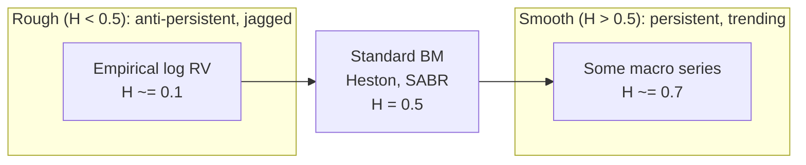

# Rough Volatility

> **Application: Why This Chapter**
> Rough volatility provides an alternative explanation for the slow decay in volatility autocorrelation that HAR ([Chapter 6](ch06-har-model.md)) captures with three components and FIGARCH ([Chapter 5](ch05-garch-family.md)) captures with fractional integration.
> The RFSV model is a parsimonious forecaster competitive with HAR and LSTM.
> The Cont-Das counterargument warns against taking roughness as ground truth.
> Project 4 (rough vol vs. deep learning) directly tests RFSV against universal LSTM.

[Chapter 6](ch06-har-model.md) showed that HAR's three-component structure (daily, weekly, monthly) approximates the slow power-law decay of volatility autocorrelations.
[Chapter 5](ch05-garch-family.md) showed that FIGARCH (the FIGARCH section) captures the same slow decay with a fractional differencing parameter $d$.
Both approaches are empirically motivated heuristics: they match the shape of the autocorrelation function, but neither explains *why* the decay is so slow.

This chapter presents a different starting point.
Instead of asking "how should I model the autocorrelation structure?" it asks: "what kind of stochastic process would *generate* the autocorrelation structure we observe?"
The answer, proposed by Gatheral, Jaisson, and Rosenbaum (2018), is that the log of realized volatility behaves like a *fractional Brownian motion* with a very low Hurst exponent, around $H \approx 0.1$.
This makes the volatility path much rougher (more jagged) than standard Brownian motion ($H = 0.5$).

## Why Path Shape Matters: A Hedging Motivation

Consider a practical puzzle that motivates the chapter.

An options trader buys a 30-day ATM straddle and delta-hedges daily.
Over the month, realized vol comes in at exactly 20%.
But the trader's P&L depends on *when* the moves happened, not just their aggregate size.

> **Intuition: Two Paths, Same RV, Different P&L**
> Path A: the stock drifts quietly for 25 days then has 5 days of extreme moves.
> Path B: moves are spread evenly across all 30 days.
> Both paths have identical 30-day RV = 20%.
> But the trader's cumulative gamma P&L (the gamma P&L section) differs because:
> - Gamma varies with moneyness: it is highest when the stock is near the strike.
> - On Path A, most of the vol occurs after the stock has moved away from the strike (gamma is low), so the trader captures less.
> - On Path B, moves happen while gamma is still high, so the trader captures more.
>
> The conclusion: forecasting *average* realized vol is necessary but not sufficient.
> The **path texture**, how vol is distributed across time and price levels, also determines economic outcomes.

This is exactly what rough volatility ($H \ll 0.5$) captures: rough paths have more fine-grained variation at short time scales, meaning the vol arrives in frequent small bursts rather than rare large moves.
For a delta-hedger, rough paths produce more predictable P&L (the vol arrives continuously rather than in lumps).
Rosenbaum and Zhang (2022) showed that both the universal LSTM and the parametric rough-vol model converge on this same characterization of the volatility process: one from data, one from theory.

## What Is Roughness?

The central concept is the *Hurst exponent*, a single number that describes how jagged or smooth a random path looks.

> **Prereq: Brownian Motion (Standard)**
> A standard Brownian motion $W_t$ is the canonical "random walk in continuous time" (continuous paths, Gaussian independent increments of variance $h$, nowhere differentiable).
> Its key property here is *self-similarity* with scaling factor $H = 1/2$: rescaling time by a factor $c$ rescales the path by $c^{1/2}$, so a zoomed-in portion looks statistically identical to the original.

> **Prereq: Fractional Brownian Motion (fBM)**
> *Fractional Brownian motion* $B^H_t$, introduced by Mandelbrot and Van Ness (1968), generalizes standard Brownian motion by allowing the self-similarity exponent $H$ to take any value in $(0, 1)$.
> Its key properties:
> - $B^H_0 = 0$, and increments are Gaussian with mean zero.
> - $\operatorname{Var}(B^H_{t+h} - B^H_t) = h^{2H}$.
> - The path is self-similar with exponent $H$: rescaling time by $c$ rescales the path by $c^H$.
> - When $H = 1/2$, fBM reduces to standard Brownian motion.
> - When $H \neq 1/2$, increments are *not* independent. They are negatively correlated if $H < 1/2$ and positively correlated if $H > 1/2$.
>
> The parameter $H$ is called the *Hurst exponent* (after the hydrologist Harold Edwin Hurst, who studied long-range dependence in Nile river levels).

The Hurst exponent controls two things simultaneously: the roughness of the path and the correlation structure of increments.

> **Definition: Hurst Exponent and Path Regularity**
> For a fractional Brownian motion $B^H_t$ with Hurst exponent $H \in (0,1)$:
>
> $$\operatorname{Var}(B^H_{t+h} - B^H_t) = h^{2H}$$
>
> - $H$: the Hurst exponent, controlling both path roughness and increment correlation
> - $h$: the time lag
> - $h^{2H}$: the variance of the increment over a window of length $h$

The figure below shows sample paths at four values of $H$.

*Sample paths of fractional Brownian motion at four values of the Hurst exponent $H$, shown in a 2x2 panel. Top left ($H = 0.1$, red): extremely rough, rapidly oscillating, reversing direction nearly every step within a band of roughly +/-0.6. Top right ($H = 0.3$, orange): rough but with visible short-range structure, drifting upward toward about 0.5 with frequent local reversals. Bottom left ($H = 0.5$, blue): standard Brownian motion, the familiar random walk, trending gradually up to about 1.1-1.4. Bottom right ($H = 0.7$, green): smooth, trending trajectory rising to a peak near 1.6 and easing back toward 1.5. Empirically, $\log \operatorname{RV}$ behaves like the top-left panel.*

The number-line figure below provides a compact reference for how different $H$ values map to path behavior and real-world examples.

*The Hurst exponent number line. Empirical log-volatility sits at $H \approx 0.1$, deep in the rough regime. Standard stochastic volatility models (Heston, SABR) assume $H = 0.5$. The gap between 0.1 and 0.5 is the motivation for the entire rough volatility program.*

## Volatility Is Rough

The central empirical claim of the rough volatility literature can now be stated precisely.

Gatheral, Jaisson, and Rosenbaum (2018) studied the time series of $\log \operatorname{RV}_t$ (5-minute realized variance, as defined in [Chapter 2](ch02-realized-volatility.md)) across a range of equity indices and bond futures, including the DAX, Bund, S&P 500, and NASDAQ, as well as roughly twenty other indices from the Oxford-Man realized library.
For each asset, they estimated the Hurst exponent $H$ of the $\log \operatorname{RV}$ series.

> **Key Result: Gatheral et al. (2018): Volatility Is Rough**
> Across equity indices and bond futures, the Hurst exponent of $\log \operatorname{RV}_t$ is consistently around $H \approx 0.1$ (ranging from roughly $0.06$ to $0.2$ depending on the asset), far below the $H = 0.5$ of standard Brownian motion.
> This means that log-volatility paths are much rougher (more jagged, more rapidly oscillating) than any standard diffusion model would predict.

To put $H = 0.1$ in context: standard stochastic volatility models (Heston, SABR) assume that the volatility process is driven by a standard Brownian motion, which has $H = 0.5$.
An $H$ of $0.1$ means the volatility path is far more jagged than a standard diffusion: it reverses direction much more frequently, creating the rapidly oscillating pattern visible in the top-left panel of the Hurst sample-paths figure above.

### How to Estimate $H$: The Variogram Method

The estimation approach in Gatheral, Jaisson, and Rosenbaum (2018) uses the fBM variance scaling relationship $\operatorname{Var}(B^H_{t+h} - B^H_t) = h^{2H}$.
If $X_t$ is an fBM with exponent $H$, then the variance of its increments scales as $h^{2H}$.
In log-log coordinates, this becomes a straight line.

> **Definition: Variogram Estimator of $H$**
> For a time series $X_1, X_2, \ldots, X_T$, define the empirical $q$-th moment of increments at lag $h$:
>
> $$m(q, h) = \frac{1}{T - h} \sum_{t=1}^{T-h} |X_{t+h} - X_t|^q$$
>
> - $X_t$: the time series (here, $\log \operatorname{RV}_t$)
> - $h$: the lag (number of days)
> - $q$: the moment order (typically $q = 2$ for the variance, or $q = 1$ for the mean absolute increment)
> - $T$: the number of observations
>
> If $X_t$ behaves like fBM with exponent $H$, then $m(q, h) \propto h^{qH}$.
> Taking logs: $\log m(q, h) = qH \cdot \log h + \text{const}$.
> Regressing $\log m(q, h)$ on $\log h$ across multiple lags gives a slope of $qH$, from which $H$ is recovered.

> **Intuition: In Plain English**
> The variogram asks how fast the change in log-volatility grows as you widen the time window.
> For a standard random walk, doubling the window roughly doubles the variance of the change.
> For rough volatility, doubling the window barely increases the variance at all, because the anti-persistent path keeps reversing direction and staying near its starting point.

> **Project Connection: Why This Matters**
> The variogram is your primary diagnostic tool for checking whether your realized volatility series exhibits the rough-vol property.
> Before fitting any model (HAR, RFSV, or LSTM), estimating $H$ from the data tells you whether the long-memory structure that these models exploit is actually present in your specific asset.
> If $\hat{H}$ comes back near 0.1, you have confirmation that multi-scale models like HAR are appropriate; if it comes back near 0.5, simpler AR(1)-type models may suffice.

The variogram log-log figure below shows the variogram in log-log coordinates, illustrating how the slope distinguishes rough from smooth processes.

*Variogram in log-log coordinates for three Hurst exponent values, plotting $\log_{10} m(2, h)$ against $\log_{10} h$. The red line and data points ($H = 0.1$) show the flat slope characteristic of rough volatility (slope $= 0.2$): variance of increments grows very slowly with lag, rising from about $-1.30$ at $\log_{10} h = 0$ to about $-0.98$ at $\log_{10} h = 1.3$. The blue dashed line ($H = 0.5$, standard Brownian motion) has a steep slope of 1.0. The green dotted line ($H = 0.7$, smooth) has slope 1.4. The widening gap between the rough-vol line and the standard-BM line quantifies why standard diffusion models miss long memory: they underestimate the persistence of volatility.*

> **Key Result: Bennedsen et al. (2022): Cross-Asset Universality**
> Bennedsen, Lunde, and Pakkanen (2022) extend the analysis of Gatheral, Jaisson, and Rosenbaum (2018) to a broad cross-section of asset classes (equities, equity indices, FX, fixed income, commodities) and confirm that $H \approx 0.1$ is universal.
> The Hurst exponent does not vary meaningfully across asset classes, geographies, or time periods.
> This universality suggests that $H \approx 0.1$ reflects a deep structural property of volatility dynamics, not a peculiarity of any particular market.

## The RFSV Forecasting Formula

The observation that $\log \operatorname{RV}$ behaves like fBM with $H \approx 0.1$ has a direct forecasting payoff.
If you know the process is fBM, the optimal linear forecast is known in closed form.
This gives a volatility forecasting model called RFSV (Rough Fractional Stochastic Volatility).

The intuition is simple.
For fBM, the best forecast of the future value is a weighted average of all past observations, where the weights are determined by $H$.
When $H$ is small (rough regime), the weights decay slowly, meaning distant past observations still carry information.
This slow weight decay is what produces the long-memory behavior that HAR approximates with three components.

> **Definition: RFSV Forecast**
> Model $\log \operatorname{RV}_t$ as fractional Brownian motion with Hurst exponent $H$ and a constant mean $\mu$:
>
> $$\log \operatorname{RV}_t = \mu + \sigma_v \, B^H_t$$
>
> - $\log \operatorname{RV}_t$: the natural logarithm of day $t$'s realized variance
> - $\mu$: the unconditional mean of log-volatility
> - $\sigma_v$: the volatility-of-volatility (a scaling constant)
> - $B^H_t$: fractional Brownian motion with exponent $H$
>
> The optimal one-step-ahead forecast, given observations through day $T$, is:
>
> $$\widehat{\log \operatorname{RV}}_{T+1} = \sum_{k=0}^{T-1} w_k \, \log \operatorname{RV}_{T-k}$$
>
> - $w_k$: the weight on the observation $k$ days in the past
> - The weights $\{w_k\}$ are determined by the covariance structure of fBM (i.e., by $H$)
> - They sum to 1 and decay as a power law: $w_k \propto k^{H - 3/2}$ for large $k$
> - When $H = 0.1$, the decay is $k^{-1.4}$, which is slow enough that observations from weeks ago still contribute meaningfully

> **Key Idea: One Parameter Does the Work of Three**
> RFSV achieves HAR-level forecasting accuracy with essentially one free parameter ($H$), because the Hurst exponent $H \approx 0.1$ encodes the entire autocorrelation structure.
> HAR uses three coefficients ($\beta_d$, $\beta_w$, $\beta_m$) to approximate the same slow decay.
> RFSV derives the weights from first principles given $H$.
> The fact that both approaches perform similarly is evidence that the slow power-law decay really is the dominant structure in volatility dynamics.

> **Intuition: Why RFSV Weights Decay Slowly**
> Consider two forecasting extremes.
> If $H = 0.5$ (standard BM), increments are independent and only the most recent observation matters; the weights drop to zero immediately.
> If $H = 0.01$ (extremely rough), the process is so anti-persistent that every past reversal carries information about the current level; the weights decay very slowly.
> At $H = 0.1$, you are close to the second extreme.
> The unnormalized weight on an observation from 22 days ago is $22^{-1.4} \approx 1.3\%$ of the weight on yesterday's observation, but because the weights are normalized to sum to one and lag 1 dominates, the lag-22 group (lags 6-22) collectively receives roughly a quarter of the total weight.
> This is why HAR's monthly component ($\operatorname{RV}^{(m)}$) carries a large coefficient in [Chapter 6](ch06-har-model.md): it is picking up the long tail of the RFSV weight function.

> **Project Connection: Why This Matters**
> RFSV is both a benchmark and a diagnostic for your vol forecasting project.
> As a benchmark, it tells you what a single-parameter model can achieve: if your ML model (LSTM, transformer) cannot beat RFSV out of sample, the added complexity is not justified.
> As a diagnostic, the RFSV weight function shows you exactly which lags carry information.
> If your ML model's learned attention pattern or feature importances do not roughly match the $k^{-1.4}$ decay shape, either the model has found genuinely new structure or it is overfitting.

## Rough Volatility for Pricing

This guide focuses on realized volatility estimation and forecasting, not on derivatives pricing.
But the rough volatility framework has had its greatest quantitative-finance impact in the pricing domain, briefly summarized here.

> **Prereq: The Volatility Smile Problem**
> Standard stochastic volatility models (e.g., Heston) cannot simultaneously fit the steep short-maturity smile in S&P 500 options and the VIX implied volatility ("VVIX") smile.

Bayer, Friz, and Gatheral (2016) introduced the *rough Bergomi* model, the first pricing model built on rough volatility.
In the rough Bergomi model, the variance process is driven by fractional Brownian motion with $H \approx 0.07$, rather than the standard Brownian motion used in models like Heston.

Two key results from the pricing literature:

1. **Rough Bergomi** (Bayer et al., 2016): the short-maturity behavior of the implied volatility smile is controlled by the Hurst exponent $H$. With $H \approx 0.07$, the model generates steep short-dated smiles that match market data far better than Heston. Simulation is required for pricing (no closed-form solution), but the model is parsimonious.

2. **Quadratic rough Heston**: a tractable variant that jointly fits SPX option smiles and VIX option smiles, a combination that no standard model can achieve. The roughness parameter is again $H \approx 0.05$--$0.1$.

## Fact or Artefact?

The rough volatility paradigm rests on an empirical observation: $\log \operatorname{RV}_t$ has $H \approx 0.1$.
But $\operatorname{RV}_t$ is not the true spot volatility $\sigma^2_t$.
It is a noisy estimate of it, contaminated by the microstructure noise discussed in [Chapter 3](ch03-microstructure-noise.md) (the sampling-frequency section).
Could the apparent roughness be an artefact of this noise?

Cont and Das (2024) argue that the answer is yes, at least in part.

> **Key Result: Cont and Das (2024): Roughness as a Noise Artefact**
> Observed roughness of realized volatility estimates is partly a microstructure-noise artefact.
> When i.i.d. noise contaminates the high-frequency returns used to compute $\operatorname{RV}$, the resulting $\operatorname{RV}$ series appears rougher than the true spot volatility process.
> Even if the true $\sigma^2_t$ follows a standard semimartingale with $H = 0.5$, the estimated $\log \operatorname{RV}_t$ can exhibit $H \approx 0.1$ due to the noise channel.

The mechanism is illustrated in the figure below.

*How microstructure noise creates apparent roughness, shown as two stacked panels over 100 trading days. Top: the true spot volatility $\sigma^2_t$ is a smooth process ($H = 0.5$), drifting gently between about 1.0 and 1.6. Bottom: the estimated $\operatorname{RV}_t$ (red) adds i.i.d. estimation noise around the true level (dashed green), producing a jagged, rapidly oscillating series that bounces between roughly 0.8 and 1.7 from day to day. The noisy $\operatorname{RV}_t$ series looks rough (anti-persistent, rapidly oscillating) even though the underlying process is smooth. Applying the variogram estimator to the red series yields $\hat{H} \approx 0.1$, but this reflects noise contamination, not true roughness of $\sigma^2_t$.*

The Cont and Das (2024) argument proceeds in three steps:

1. **Noise adds estimation errors.** Each day's $\operatorname{RV}_t$ differs from the true $\operatorname{IV}_t$ by an estimation error $\eta_t$ ([Chapter 2](ch02-realized-volatility.md), the realized-variance CLT). Under certain models (e.g., the Ornstein-Uhlenbeck stochastic volatility model), these log-estimation errors are approximately i.i.d. Gaussian across days.

2. **Independent errors create anti-persistence.** If you add i.i.d. noise to a smooth signal, the increments of the noisy series are negatively autocorrelated. An unusually high noise draw today will be followed (on average) by a smaller one tomorrow, creating artificial "reversals" in the series.

3. **Anti-persistence lowers $\hat{H}$.** The variogram estimator interprets these reversals as roughness and produces $\hat{H} \ll 0.5$.

> **Warning: Do Not Equate $\hat{H} = 0.1$ with True Roughness**
> The observed $H \approx 0.1$ from $\log \operatorname{RV}_t$ data does not establish that the true spot volatility process $\sigma^2_t$ is rough.
> The noise channel documented by Cont and Das (2024) is a plausible alternative explanation.
> The truth may lie in between: some genuine roughness in $\sigma^2_t$, amplified by estimation noise in $\operatorname{RV}_t$.
> For forecasting, this distinction does not matter much (see the universal LSTM section below).
> For model calibration and theoretical claims about the nature of volatility, it matters a great deal.

> **Intuition: The Coin-Flip Analogy**
> Suppose you flip a fair coin 100 times and record the running total of heads minus tails.
> The resulting path is a standard random walk ($H = 0.5$).
> Now suppose someone records your totals but makes small random errors (e.g., occasionally miscounting by $\pm 1$).
> If you estimate $H$ from their error-contaminated records, you will get $\hat{H} < 0.5$, because the errors introduce artificial reversals.
> The path *looks* rougher than it is.
> Cont-Das argue that $\operatorname{RV}_t$ is the error-contaminated record and $\sigma^2_t$ is the true total.

## The Universal LSTM Connection

Rosenbaum and Zhang (2022) train a single LSTM (Long Short-Term Memory neural network) on hundreds of individual stocks simultaneously.
The trained network, which they call the "universal LSTM," consistently outperforms asset-specific RFSV models.
However, a combined RFSV + Quadratic Rough Heston parametric forecaster with fixed (non-asset-specific) parameters matches the LSTM's performance, suggesting both capture the same underlying regularity.

This convergence is suggestive.
Two very different approaches (a parametric fBM model with one parameter and a nonparametric neural network with thousands of parameters) arrive at the same forecast.
The natural interpretation is that both are learning the same underlying statistical regularity in $\operatorname{RV}$ data.

> **Project Connection: Why This Matters**
> The universal LSTM result sets a clear success criterion for your project.
> To justify an LSTM or transformer, you need to demonstrate statistically significant improvement via Diebold-Mariano tests, not just lower in-sample QLIKE.
> The universality property also suggests that training on a broad cross-section of assets (rather than a single stock) may improve generalization.

Rosenbaum and Zhang (2022) also document a "universality" property: the LSTM trained on US equities transfers well to European equities it has never seen, without degradation in performance.
This is consistent with the cross-asset universality of $H \approx 0.1$ documented by Bennedsen, Lunde, and Pakkanen (2022).

> **Key Result: Rosenbaum and Zhang (2022): Universal LSTM**
> A single LSTM trained on hundreds of stocks consistently outperforms asset-specific RFSV models.
> A combined RFSV + QRH parametric forecaster with fixed parameters matches the LSTM, and both outperform HAR.
> The universal LSTM also transfers from US equities to European equities without degradation, suggesting that the learned kernel is market-independent.

The connection to the rest of this guide is direct.
[Chapter 12b](ch12b-deep-learning-vol.md) develops LSTM and transformer-based forecasting models in full detail.
When you reach that chapter, the key question will be: does your deep learning model learn something *beyond* the rough-vol kernel, or is it just a complicated way to recover the same $H \approx 0.1$ decay structure?
If the latter, RFSV with one parameter is preferable on parsimony grounds.
If the former, you need to demonstrate the improvement with a proper out-of-sample test ([Chapter 16](ch16-forecast-evaluation.md)).

## Summary

- The **Hurst exponent** $H$ of a fractional Brownian motion controls path roughness. $H = 0.5$ is standard Brownian motion; $H < 0.5$ is rougher (more jagged); $H > 0.5$ is smoother.

- **Fractional Brownian motion** (fBM) generalizes standard BM by allowing correlated increments: negatively correlated when $H < 0.5$ (anti-persistent), positively correlated when $H > 0.5$ (persistent).

- Gatheral, Jaisson, and Rosenbaum (2018) showed that $\log \operatorname{RV}_t$ behaves like fBM with $H \approx 0.1$ across equity indices and bond futures. This is the "volatility is rough" result.

- $H$ can be estimated from data using the **variogram method**: regress $\log m(q,h)$ on $\log h$ and divide the slope by $q$.

- Bennedsen, Lunde, and Pakkanen (2022) confirmed the **cross-asset universality** of $H \approx 0.1$ across equities, FX, fixed income, and commodities.

- The **RFSV model** forecasts $\log \operatorname{RV}_{t+1}$ as a weighted average of past $\log \operatorname{RV}$ values, with weights derived from the fBM covariance structure. It achieves HAR-level accuracy with essentially one parameter ($H$).

- RFSV weights decay as $k^{H - 3/2}$. At $H = 0.1$, the decay is slow ($k^{-1.4}$), explaining why HAR's monthly component carries a large coefficient.

- **Rough Bergomi** (Bayer et al., 2016) and quadratic rough Heston use $H \approx 0.07$--$0.1$ for option pricing. They fit short-maturity smiles and VIX smiles better than standard models. This guide focuses on forecasting, not pricing.

- Cont and Das (2024) argue that observed roughness ($H \approx 0.1$) is **partly a microstructure-noise artefact**. Estimation noise in $\operatorname{RV}_t$ creates artificial anti-persistence that the variogram interprets as roughness.

- The practical implication: $H \approx 0.1$ from $\log \operatorname{RV}_t$ is a useful forecasting input but does not prove that the true spot volatility $\sigma^2_t$ is rough.

- Rosenbaum and Zhang (2022) show that a **universal LSTM** trained on hundreds of stocks outperforms asset-specific RFSV models and transfers to unseen equities in other markets. A combined RFSV + QRH parametric forecaster matches the LSTM, suggesting both capture the same statistical kernel.

- Whether spot vol is truly rough or the roughness is a noise artefact, the **forecasting value is identical**. The distinction matters for pricing-model calibration and theory, not for forecasting accuracy.

- RFSV connects to FIGARCH ([Chapter 5](ch05-garch-family.md), the FIGARCH section) and HAR ([Chapter 6](ch06-har-model.md)) as three different parameterizations of the same long-memory phenomenon. It connects forward to deep learning ([Chapter 12b](ch12b-deep-learning-vol.md)) as a benchmark that any LSTM must beat to justify its complexity.

## Key Results

| Result | Source | Finding |
|---|---|---|
| Volatility is rough | Gatheral et al. (2018) | $\log \operatorname{RV}_t$ behaves like fBM with $H \approx 0.1$ across equity indices and bond futures; far below $H = 0.5$ of standard models |
| Cross-asset universality | Bennedsen et al. (2022) | $H \approx 0.1$ is universal across asset classes, geographies, and time periods |
| Rough Bergomi pricing | Bayer et al. (2016) | First rough-vol pricing model; $H \approx 0.07$ generates steep short-maturity implied volatility smiles |
| Roughness as artefact | Cont and Das (2024) | Microstructure noise in $\operatorname{RV}$ estimates creates apparent roughness; $\hat{H} \approx 0.1$ may not reflect true spot-vol dynamics |
| Universal LSTM | Rosenbaum and Zhang (2022) | Single LSTM trained on hundreds of stocks outperforms RFSV; RFSV + QRH parametric combination matches LSTM performance |
