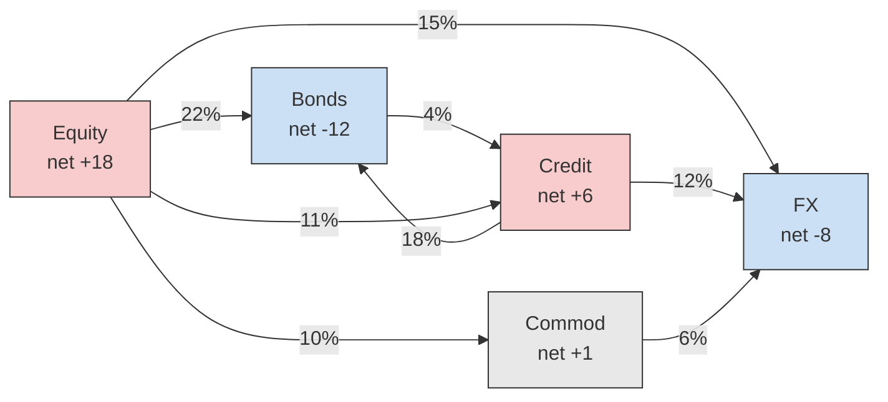
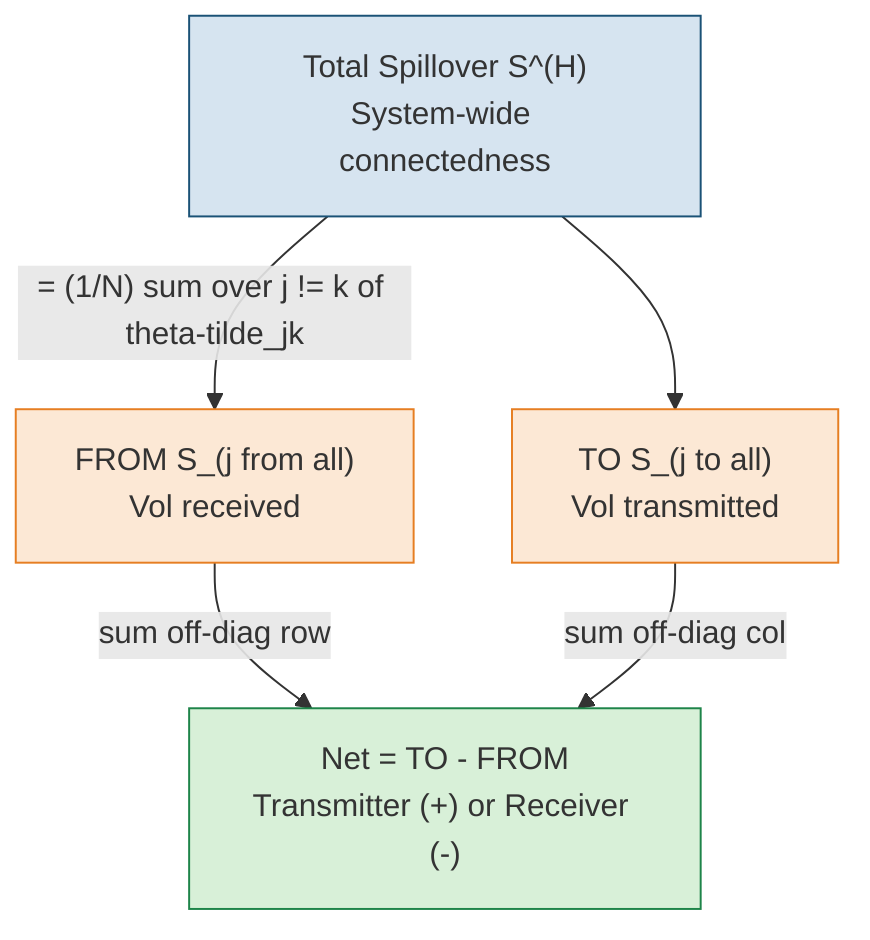
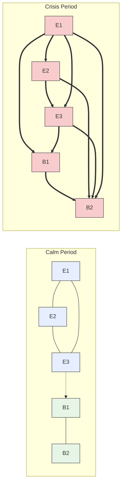

# Chapter 15. Volatility Spillovers and Connectedness

> **Application**
>
> [Chapter 14](ch14-multivariate-volatility.md) built tools for forecasting the full covariance matrix. This chapter focuses on a specific question: how does volatility transmit from one asset (or market) to another? Spillover indices and connectedness measures are both diagnostic tools (understanding contagion) and predictive features ([Chapter 10](ch10-feature-engineering.md)). Project 3 relies heavily on this framework.

## Diebold-Yilmaz Spillover Indices

In [Chapter 14](ch14-multivariate-volatility.md) you learned to model the joint dynamics of multiple assets. Now we zoom in on a sharper question: when one asset's volatility jumps, how much of that shock spills over into other assets?

> **Intuition: Volatility as a contagious shock**
>
> Think of volatility shocks as ripples in a pond. A stone dropped on the equity side sends waves that reach bonds, commodities, and currencies. The Diebold-Yilmaz (DY) framework measures the size and direction of those ripples using standard vector autoregression (VAR) machinery.

### Setup: VAR on Realized Volatilities

Stack the realized volatilities of $N$ assets into a vector $\mathbf{y}_t = (\operatorname{RV}_{1,t}, \ldots, \operatorname{RV}_{N,t})'$ and fit a VAR($p$):

$$
  \mathbf{y}_t = \bm{c} + \sum_{\ell=1}^{p} \bm{A}_\ell \, \mathbf{y}_{t-\ell} + \bm{u}_t,
  \qquad \bm{u}_t \sim (0, \bm{\Sigma}),
$$

where:

- $\mathbf{y}_t \in \mathbb{R}^N$: vector of realized volatilities on day $t$,
- $\bm{c} \in \mathbb{R}^N$: intercept vector,
- $\bm{A}_\ell \in \mathbb{R}^{N \times N}$: coefficient matrix at lag $\ell$,
- $\bm{u}_t$: reduced-form innovation vector with covariance $\bm{\Sigma}$.

The key output is the *moving-average representation* obtained by inverting the VAR:

$$
  \mathbf{y}_t = \bm{\mu} + \sum_{h=0}^{\infty} \bm{\Phi}_h \, \bm{u}_{t-h},
$$

> **Intuition: In Plain English**
>
> The matrix $\bm{\Phi}_h$ is the "memory kernel": entry $(j,k)$ tells you how much a surprise in asset $k$'s vol $h$ days ago still echoes in asset $j$'s vol today. It is the multivariate impulse-response function.

where the $N \times N$ matrices $\bm{\Phi}_h$ are the impulse-response coefficients at horizon $h$. Entry $(\bm{\Phi}_h)_{jk}$ tells you how a unit shock to asset $k$ today affects asset $j$ at horizon $h$.

### Generalized Forecast Error Variance Decomposition

The next step decomposes the $H$-step forecast error variance of each asset into contributions from every shock. The generalized variant (GFEVD), introduced by Pesaran and Shin (1998) and adopted by Diebold and Yilmaz (2012), does not depend on variable ordering (unlike Cholesky decompositions).

> **Definition: Generalized Forecast Error Variance Decomposition**
>
> The fraction of asset $j$'s $H$-step forecast-error variance attributable to shocks originating in asset $k$ is:
>
> $$
>   \theta_{jk}^{(H)}
>   = \frac{
>       \sigma_{kk}^{-1} \sum_{h=0}^{H-1}
>         \bigl(\bm{e}_j' \, \bm{\Phi}_h \, \bm{\Sigma} \, \bm{e}_k \bigr)^2
>     }{
>       \sum_{h=0}^{H-1}
>         \bm{e}_j' \, \bm{\Phi}_h \, \bm{\Sigma} \, \bm{\Phi}_h' \, \bm{e}_j
>     },
> $$
>
> where:
>
> - $\sigma_{kk}$: the $(k,k)$ entry of $\bm{\Sigma}$ (variance of shock $k$),
> - $\bm{e}_j$: the $j$-th column of the $N \times N$ identity matrix,
> - $\bm{\Phi}_h$: the impulse-response matrix at horizon $h$ from the moving-average representation above,
> - $H$: forecast horizon (typically 10 days).

> **Intuition: In Plain English**
>
> This formula answers a simple question: of all the uncertainty in asset $j$'s volatility forecast $H$ days ahead, what fraction was caused by a shock to asset $k$? The numerator isolates the contribution of shock $k$ (scaled by its own variance), and the denominator is the total forecast uncertainty for asset $j$. When $j = k$, you get the "own" contribution; when $j \neq k$, you get the spillover from $k$ to $j$.

Because GFEVD rows do not sum to one in general, normalize each row:

$$
  \widetilde{\theta}_{jk}^{(H)}
  = \frac{\theta_{jk}^{(H)}}{\sum_{k=1}^{N} \theta_{jk}^{(H)}},
  \qquad \text{so that } \sum_{k=1}^{N} \widetilde{\theta}_{jk}^{(H)} = 1.
$$

> **Intuition: In Plain English**
>
> The raw GFEVD fractions for a given asset do not necessarily add up to 100% because the generalized approach allows shocks to be correlated. After normalization, you can read each entry as a percentage: "$X$% of asset $j$'s vol forecast error is attributable to shocks from asset $k$."

### Spillover Measures

From the normalized decomposition table $\widetilde{\bm{\Theta}}^{(H)}$, three spillover measures follow immediately.

> **Key Idea: Diebold-Yilmaz Spillover Decomposition**
>
> **Total spillover index.** The fraction of total forecast-error variance due to cross-asset shocks:
>
> $$
>   S^{(H)} = \frac{1}{N} \sum_{\substack{j,k=1 \\ j \neq k}}^{N}
>     \widetilde{\theta}_{jk}^{(H)} \times 100.
> $$
>
> **Directional FROM.** How much volatility asset $j$ *receives* from all others:
>
> $$
>   S_{j \leftarrow \bullet}^{(H)}
>   = \frac{1}{N} \sum_{\substack{k=1 \\ k \neq j}}^{N}
>     \widetilde{\theta}_{jk}^{(H)} \times 100.
> $$
>
> **Directional TO.** How much volatility asset $j$ *transmits* to all others:
>
> $$
>   S_{j \rightarrow \bullet}^{(H)}
>   = \frac{1}{N} \sum_{\substack{k=1 \\ k \neq j}}^{N}
>     \widetilde{\theta}_{kj}^{(H)} \times 100.
> $$
>
> **Net spillover.** Transmitters minus receivers:
>
> $$
>   S_j^{\text{net},(H)}
>   = S_{j \rightarrow \bullet}^{(H)} - S_{j \leftarrow \bullet}^{(H)}.
> $$
>
> A positive net spillover means asset $j$ is a *net transmitter* of volatility; negative means *net receiver*.

> **Project Connection: Why This Matters**
>
> Their value is concentrated in regime transitions, precisely the forecasts where single-asset features alone break down.

The framework evolved across three papers: Diebold and Yilmaz (2009) introduced the total index using a Cholesky decomposition, Diebold and Yilmaz (2012) added directional measures and switched to GFEVD, and Diebold and Yilmaz (2014) refined the generalized VAR approach and applied it to a broader set of markets.

### Spillover Network Diagram

The variance decomposition table maps directly onto a weighted directed graph: each asset is a node, and the edge from $k$ to $j$ carries weight $\widetilde{\theta}_{jk}^{(H)}$.

*Spillover network for five asset classes. Edge labels show the percentage of $j$'s forecast-error variance explained by shocks from $k$. Node color indicates net transmitter (red) vs. net receiver (blue). Data are illustrative.*

*Decomposition of the Diebold-Yilmaz spillover measures. The total index summarizes system-wide connectedness. Directional FROM and TO break it down per asset, and the net spillover identifies transmitters vs. receivers.*

## Time-Varying Spillovers

The static spillover table in the previous section gives you a single snapshot. In practice, connectedness changes dramatically over time: calm markets have low spillovers, crises have high ones. This section covers two methods to capture the dynamics.

### Rolling-Window Approach

The simplest method: re-estimate the VAR and GFEVD on a rolling window of $w$ days (typically $w = 200$) and plot $S^{(H)}_t$ over time.

> **Key Idea: Rolling-Window Spillover**
>
> For each day $t$, estimate the VAR on $\{t - w + 1, \ldots, t\}$, compute the GFEVD, and record $S^{(H)}_t$. The resulting time series reveals spillover regimes:
>
> - Calm periods: $S^{(H)}_t \approx 30$--$40\%$,
> - Crises (2008 GFC, 2020 COVID): $S^{(H)}_t$ spikes to 70--$85\%$.

> **Warning: Window-length sensitivity**
>
> The rolling-window approach introduces a hyperparameter $w$ that affects both level and smoothness. Too short ($w < 100$): noisy, unstable VAR estimates. Too long ($w > 300$): sluggish, crises get averaged out. Always report results for at least two window lengths to check robustness (Diebold and Yilmaz, 2012).

*Figure (stylized time-series plot): the total spillover index (200-day rolling window, $H = 10$) across five major asset classes, plotted over 2005--2024 on a 20--90% scale. The index sits around 33--42% in calm years, then spikes to roughly 83% during the 2008 financial crisis (Lehman, Sep 2008), climbs to around 62% during the 2011 euro debt crisis, and jumps to about 82% in the March 2020 COVID-19 selloff before reverting toward the mid-30s%. Vertical dashed markers annotate Lehman (Sep 2008), the Euro debt crisis, and COVID-19 (Mar 2020). The index spikes sharply during the 2008 financial crisis and the March 2020 COVID selloff, reflecting contagion across markets.*

### TVP-VAR Connectedness

Antonakakis, Chatziantoniou, and Gabauer (2020) replace the rolling-window VAR with a *time-varying parameter VAR* (TVP-VAR) estimated via the Kalman filter. This eliminates the window-length hyperparameter entirely.

The TVP-VAR model allows coefficients to drift:

$$
  \mathbf{y}_t = \bm{c}_t + \sum_{\ell=1}^{p} \bm{A}_{\ell,t} \, \mathbf{y}_{t-\ell}
          + \bm{u}_t,
  \qquad
  \operatorname{vec}(\bm{A}_t) = \operatorname{vec}(\bm{A}_{t-1}) + \bm{\eta}_t,
$$

> **Intuition: In Plain English**
>
> The Kalman filter estimates the evolving coefficients without needing a rolling window, so the spillover index updates smoothly each day rather than jumping when observations enter or leave a fixed window.

where:

- $\bm{A}_{\ell,t}$: time-varying coefficient matrix at lag $\ell$ and time $t$,
- $\bm{\eta}_t \sim (0, \bm{Q})$: state innovation with covariance $\bm{Q}$ governing the speed of parameter drift.

At each $t$, the Kalman filter produces updated coefficient estimates, and you compute the GFEVD exactly as before to get $S^{(H)}_t$.

> **Key Result: TVP-VAR vs. Rolling Window**
>
> Antonakakis, Chatziantoniou, and Gabauer (2020) show that TVP-VAR connectedness is smoother than rolling-window estimates, avoids the abrupt "entry/exit" artifacts when extreme observations enter or leave the window, and responds faster to genuine structural breaks. Both methods agree on the broad pattern: spillovers spike during crises and monetary-policy surprises, but the TVP-VAR resolves timing more sharply.

## Network Visualization and Interpretation

The GFEVD table is a matrix of numbers. Networks make that matrix readable at a glance. This section covers the visual conventions and the patterns you should look for.

### Visual Encoding

Four encoding rules produce an interpretable graph:

1. **Node size** proportional to total connectedness ($S_{j \rightarrow \bullet} + S_{j \leftarrow \bullet}$). Large nodes are "systemically important" regardless of sign.
2. **Edge thickness** proportional to pairwise spillover $\widetilde{\theta}_{jk}^{(H)}$. Only draw edges above a threshold (e.g., 5%) to avoid clutter.
3. **Edge direction** from shock source $k$ to shock recipient $j$ (arrow points toward the asset whose variance is explained).
4. **Node color** by net spillover sign: red for net transmitters, blue for net receivers. Alternatively, color by sector or asset class.

### Calm vs. Crisis Networks

The most striking pattern in spillover networks is the structural shift between tranquil and stressed markets (Demirer, Diebold, Liu, and Yilmaz, 2018).

*Spillover networks during calm (left) and crisis (right) periods. In calm markets, connectedness is largely within-sector (equity-to-equity, bond-to-bond), with sparse cross-sector links. During crises, cross-sector edges thicken and multiply: everything becomes connected to everything. After Demirer, Diebold, Liu, and Yilmaz (2018).*

> **Key Idea: Calm-Crisis Network Transition**
>
> Three stylized facts from the DY network literature:
>
> 1. **Calm periods**: within-sector connectedness dominates. Equity shocks stay in equities; bond shocks stay in bonds. Total spillover index is low (30--40%).
> 2. **Crises**: cross-sector connectedness surges. The network topology shifts from clustered to nearly fully connected. Total spillover jumps to 70--85%.
> 3. **Net transmitter identity shifts**: in calm markets, commodity shocks are often isolated; during crises, equity and credit become dominant transmitters (Diebold and Yilmaz, 2014).

## Cross-Asset Universality

The high cross-sector connectedness during crises suggests volatility dynamics may be not merely correlated but *similar* across asset classes. Two recent papers make this case precisely.

Sirignano and Cont (2019) train a single deep network (LSTM layers followed by a fully-connected layer) to predict the direction of the next price move by pooling high-frequency data across hundreds of US equities. The pooled ("universal") model outperforms individual asset-specific models, implying that the features driving price formation are largely shared.

> **Key Result: Universal Price Formation Features**
>
> Sirignano and Cont (2019) show that a model trained on pooled equity data generalizes to out-of-sample stocks not seen during training. This "universality" holds for features based on order-flow history (queue imbalances, trade arrivals). The implication: spillover networks may reflect common factor exposures rather than direct causal transmission.

Rosenbaum and Zhang (2022) push universality further by training a universal LSTM on pooled data from hundreds of liquid stocks to forecast daily realized volatility. Their key finding: the LSTM's predictions are matched by a parsimonious rough volatility model with $H \approx 0.1$, consistent with the rough volatility theory from [Chapter 7](ch07-rough-volatility.md).

> **Intuition: Why universality matters for spillovers**
>
> If volatility dynamics really are "universal" (same roughness, same feature importance across assets), then the strong cross-asset connectedness you see during crises may not require a contagion story. Instead, a single common factor (e.g., dealer risk capacity, funding liquidity) could drive all assets simultaneously. This does not diminish the usefulness of spillover indices as diagnostic tools, but it changes how you interpret them: high spillover may reflect common-factor exposure rather than sequential transmission from one asset to the next.

### Pooled Panel Forecasting Across Instruments

Universality has a direct architectural implication: if vol dynamics are truly shared across assets, you can train a single model on pooled data rather than fitting $N$ separate models, which raises a concrete question: how do you feed RV histories for all $34$ instruments in your project into a single HAR regression or a single LightGBM, without (a) drowning the few liquid index futures under the $30$ mega-cap equities, (b) letting the model confuse a structurally high-vol name with a structurally low-vol one, or (c) leaking information across instruments on a crisis day? This subsection answers those questions for the two model classes you actually use as baselines, pooled linear/HAR and pooled trees.

> **Prereq: Panel Data**
>
> Until now this guide has treated each instrument as its own time series: one column of $\operatorname{RV}_t$, fit a HAR, repeat $34$ times. A **panel** (or **longitudinal**) data set instead tracks multiple **entities** $i = 1, \ldots, N$ over multiple time periods $t = 1, \ldots, T$, with each observation indexed by the pair $(i,t)$. Here the entities are the $N = 34$ instruments (the $30$ mega-cap equities plus $4$ sector/index ETFs and the E-mini S&P 500 future from [Chapter 10](ch10-feature-engineering.md)), the time index $t$ runs over trading days, and the target $y_{it}$ is next-day (or $h$-day) realized volatility for instrument $i$. When every instrument is observed on every date the panel is **balanced**; when some $(i,t)$ cells are missing it is **unbalanced** (treated at the end of this subsection).

Fitting $34$ separate HARs throws away an obvious resource: the instruments share dynamics. [Chapter 7](ch07-rough-volatility.md) and the universality results above (Sirignano and Cont, 2019; Rosenbaum and Zhang, 2022) argue that the *shape* of volatility dynamics, HAR decay structure, jump sensitivity, the leverage tilt, is broadly common across liquid assets. If that is even approximately true, then stacking the $34$ instruments into one $(i,t)$ panel lets a single set of coefficients borrow strength from every series at once.

> **Intuition: Why stacking grows the sample**
>
> A single instrument with five years of daily data gives you $T \approx 1{,}250$ rows, a thin sample for a flexible model. Stack $N = 34$ instruments and the pooled panel has up to $N \times T \approx 42{,}500$ rows. You have not invented new information about any one stock, but you *have* given the model $34$ independent realizations of the same volatility-formation process to estimate the *shared* parameters from. That is exactly the lever a univariate HAR cannot pull.

#### A pooled HAR baseline, and why naive pooling fails

The naive move is to stack every instrument's HAR **design matrix**, just the table of feature values, one row per $(\text{instrument},\text{day})$ and one column per feature, and run one OLS (**ordinary least squares**, the standard best-fit-line procedure). Stacking means literally laying each instrument's feature table on top of the next into one tall table. The problem is **instrument-specific heterogeneity**: a high-beta growth name lives at a structurally higher average $\operatorname{RV}$ than a defensive utility, and a single common **intercept** (the baseline level the line starts from) cannot represent both. Forcing one intercept makes the pooled fit chase the cross-instrument *level* differences instead of the volatility *dynamics* you actually want to learn. The fix is an **entity fixed effect**: one intercept per instrument. Because each instrument carries many features rather than one, the single slope $m$ of a straight line $y=mx+b$ becomes a **slope vector** $\bm{\beta}$ with one slope per feature.

The entity fixed-effects model gives each instrument its own baseline volatility level while sharing one common slope vector across all of them:

$$
  y_{it} = \underbrace{\alpha_i}_{\text{instrument level}}
           + \mathbf{x}_{it}'\bm{\beta} + \varepsilon_{it},
$$

The notation $\mathbf{x}_{it}'\bm{\beta}$ (read "$x$-transpose-$\bm{\beta}$"; the raised tick mark $'$ is the *transpose*, which here just turns the column of features into a row so the next step is a sum) is shorthand for multiplying each of the $K$ features by its matching coefficient in $\bm{\beta}$ and adding them into a single predicted number, the same $\beta_1\,\text{feature}_1 + \beta_2\,\text{feature}_2 + \cdots$ you saw in the HAR regression of [Chapter 10](ch10-feature-engineering.md).

- $y_{it}$: the forecast target for instrument $i$ on day $t$ (next-day $\operatorname{RV}_{i,t+1}$, or a log/$\sqrt{}$ transform of it as in [Chapter 10](ch10-feature-engineering.md)),
- $\alpha_i$: the *instrument-specific intercept*, absorbing every time-invariant difference across instruments (a name's average vol level, its sector's baseline turbulence),
- $\mathbf{x}_{it}$: the $K\times1$ vector (a single column of the $K$ HAR-type features, where $K$ is simply however many predictors you stacked) for instrument $i$ on day $t$, the same HAR-type features defined in [Chapter 10](ch10-feature-engineering.md): daily, weekly, and monthly lagged $\operatorname{RV}$, the jump and semivariance splits, $\operatorname{VRP}$, and so on,
- $\bm{\beta}$: the $K\times1$ slope vector, *common across all instruments* (one HAR decay structure for the whole panel),
- $\varepsilon_{it}$: the idiosyncratic error, the leftover the model cannot explain, assumed to average to zero, $\mathbb{E}[\varepsilon_{it}\mid\alpha_i,\mathbf{x}_{it}] = 0$. That statement reads: averaging ($\mathbb{E}[\cdot]$) over everything, given ($\mid$) the instrument and its feature values, the leftover error is zero no matter which instrument we look at or what its features are, i.e. the model is unbiased.

> **Intuition: In Plain English**
>
> The entity fixed-effects equation above says: "Let every instrument sit at its own resting volatility level $\alpha_i$, but make them all obey the *same* rule for how yesterday's, last week's, and last month's vol map into tomorrow's."

> **Project Connection: Why This Matters**
>
> This is the pooled-HAR baseline your project should beat before reaching for trees or nets. It is the panel analogue of the single-instrument HAR of Corsi (2009): identical features, but the slope $\bm{\beta}$ is now estimated from $34\times$ the data, which sharply tightens the $\operatorname{QLIKE}$ (the volatility forecast-accuracy score from [Chapter 16](ch16-forecast-evaluation.md); lower is better) on short-history names that could never support a stable HAR on their own. Report its out-of-sample $\operatorname{QLIKE}$ against the per-instrument HARs; the pooled fit usually wins on the thin-history instruments and roughly ties on the data-rich index lines.

You do not have to literally add $34$ dummy columns. The algebraically identical **within estimator** subtracts each instrument's own time-series mean from both sides, cancelling $\alpha_i$.

Demeaning each instrument's series removes its fixed effect, leaving a clean regression for $\bm{\beta}$:

$$
  \underbrace{(y_{it} - \bar{y}_i)}_{\text{demeaned target}}
  = (\mathbf{x}_{it} - \bar{\mathbf{x}}_i)'\bm{\beta} + (\varepsilon_{it} - \bar{\varepsilon}_i),
  \qquad
  \bar{y}_i = \frac{1}{T_i}\sum_{t} y_{it},
$$

where:

- $\bar{y}_i,\ \bar{\mathbf{x}}_i$ (read "$y$-bar-$i$", "$x$-bar-$i$"): the time-series *averages* of the target and the features *within instrument $i$*, simply instrument $i$'s own average vol and average features over its $T_i$ observed days, where $T_i$ is the number of trading days instrument $i$ is observed,
- the entity effect $\alpha_i$ cancels because it is constant over $t$ for each $i$, so demeaning subtracts it from itself,
- running OLS (the standard best-fit-line procedure) on the demeaned data yields what panel-data texts call the **within** estimate of $\bm{\beta}$, so named because it uses only the variation *within* each instrument over time (Wooldridge, 2010).

> **Intuition: In Plain English**
>
> Demeaning re-expresses every variable as a *deviation from that instrument's own average*. Instead of asking "is this stock's vol high?" (a level question contaminated by which stock it is), the regression now asks "is this stock's vol high *relative to its own normal*, given that its lagged vol is high relative to its own normal?" That deviation-based question has the same answer for every instrument, which is exactly why one shared $\bm{\beta}$ is legitimate.

> **Project Connection: Why This Matters**
>
> Demeaning is the panel version of the per-instrument $z$-scoring already in the [Chapter 10](ch10-feature-engineering.md) pipeline (subtracting each instrument's mean and dividing by its standard deviation so all names sit on a comparable scale): if your features are already $z$-scored within instrument, the entity fixed effect is largely redundant for the *features*, but keep it (or a demeaned target) so the *intercept* does not chase level differences.

> **Warning: Within estimation discards cross-instrument level information**
>
> The within estimator uses only *within-instrument* variation over time; it throws away the *between-instrument* variation in average levels entirely. That is deliberate, the level differences are the heterogeneity you wanted to control for, but it has a consequence: you cannot identify the effect of any *instrument-constant* feature (sector label, "is-an-index" flag) inside a fixed-effects regression, because such a feature has zero within variation and is indistinguishable from $\alpha_i$, the instrument's intercept already captures anything that never changes for that instrument, so a sector label adds no new information the regression can separate out. If you need those level effects, carry them as separate dummy features in the tree model below rather than the FE regression.

#### Time fixed effects: absorbing market-wide crisis days

The time-varying spillovers section above showed that on crisis days, Lehman, the euro crisis, the March 2020 COVID selloff, *every* instrument's vol spikes at once. In a pooled panel those common-shock days act like $34$ correlated duplicate observations of the same event, and they can dominate the fit. A **time fixed effect** $\delta_t$ absorbs whatever is common to all instruments on a given day.

Adding a per-day intercept on top of the per-instrument intercept strips out market-wide volatility shocks:

$$
  y_{it} = \alpha_i
           + \underbrace{\delta_t}_{\text{market-wide day shock}}
           + \mathbf{x}_{it}'\bm{\beta} + \varepsilon_{it},
$$

where:

- $\delta_t$: the *time-specific intercept*, common to all $N$ instruments on day $t$, absorbing aggregate vol spikes, macro releases, and the contagion days quantified by the total-spillover index $S^{(H)}_t$ from the Diebold-Yilmaz section above (a single number near $30$--$40\%$ in calm markets and $70$--$85\%$ in crises that tracks how much of the market is moving together),
- all other symbols are as in the entity fixed-effects equation above; with both $\alpha_i$ and $\delta_t$ present this is a **two-way fixed-effects** model.

> **Intuition: In Plain English**
>
> The entity effect $\alpha_i$ asks "which instrument is this?" and removes it. The time effect $\delta_t$ asks "what was the whole market doing today?" and removes that too. What survives is the *relative* signal: on a day when market vol is elevated, which names are even *more* elevated than the average, and is that excess predictable from their own lagged-vol features?

> **Project Connection: Why This Matters**
>
> There is a real trade-off here for an RV forecaster. If your deliverable is the *absolute* level of each instrument's vol (the input to a vol-targeting strategy, one that scales position size up when forecast vol is low and down when it is high, so it needs the absolute level), do *not* include time effects: $\delta_t$ absorbs the common vol signal that is precisely what such a strategy needs to size positions. Include time effects only when you care about the *cross-sectional* question, which names will be relatively more volatile, e.g. for a dispersion or relative-value trade, which only bets on which names are *more* volatile than others and so needs the cross-sectional ranking rather than the absolute level. A practical compromise that keeps the absolute signal is to drop $\delta_t$ but add the spillover features (see the spillover-features section below) as columns, letting the model condition on the regime rather than differencing it away.

#### Encoding instrument identity for a pooled LightGBM

A tree model does not demean. To pool $34$ instruments in LightGBM you instead give the tree the instrument identity *as a feature* and let it split on it. With only $N = 34$ instruments, identity is **low-cardinality**, there are only $34$ distinct values, a small number of categories. You encode it with **one-hot dummy** columns: one yes/no ($1$/$0$) column per instrument that equals $1$ only on that instrument's rows (drop one to avoid redundancy; see the `is_AAPL` example below). These are cheap and LightGBM handles them natively (Ke et al., 2017).

> **Key Idea: Instrument dummies recover instrument-specific dynamics for free**
>
> When the tree splits on `is_AAPL = 1` and then splits on the weekly-$\operatorname{RV}$ feature beneath that branch, it has effectively estimated a *different* HAR slope for that instrument, a feature$\times$instrument *interaction* (a rule that lets the slope on a feature differ by instrument), and via a first split on identity alone it also reproduces the per-instrument level $\alpha_i$, which the single shared $\bm{\beta}$ of the entity fixed-effects equation can only get through explicit interaction terms. Pooling in a tree therefore gives you the sample-size benefit of the panel *and* per-instrument flexibility, without fitting $34$ separate models.

> **Warning: Never target-encode the instrument ID, it leaks the future**
>
> The tempting shortcut is **target encoding**: replace the instrument ID with that instrument's mean target (its average $\operatorname{RV}$). In a panel time series this is a temporal-leakage trap. The instrument mean computed over the *whole* sample includes future days, so encoding instrument $i$ on day $t$ with a mean that already "knows" $\operatorname{RV}_{i,t+5}$ smuggles the answer into the feature. The damage is silent: cross-validation scores look excellent and live performance collapses. With only $34$ low-cardinality instruments there is *no reason* to target-encode, plain one-hot dummies carry the same information with zero leakage. Reserve any encoding-by-statistic for genuinely high-cardinality categoricals, and even then compute the statistic only on data strictly prior to $t$.

> **Project Connection: Why This Matters**
>
> This leakage is the cross-sectional cousin of the standard look-ahead bias from [Chapter 16](ch16-forecast-evaluation.md). The same panel structure that grows your sample also multiplies the ways the future can leak into the past, and the most dangerous one is at the *fold* level: a random $K$-fold split scatters rows from the same date across train and test, so the model sees other instruments' day-$t$ behaviour while predicting instrument $i$ on day $t$. Use the time-blocked purged CV (the purged-CV section of [Chapter 16](ch16-forecast-evaluation.md)), and follow the cross-sectional leakage rule (the cross-sectional-leakage section of [Chapter 16](ch16-forecast-evaluation.md)): entire *dates* go to train or test as a block, never split across folds.

#### Unbalanced panels and short-history instruments

Your panel will almost certainly be **unbalanced**: a name added to the index two years ago has half the history of the index future, and a recent IPO has a few hundred days at most. Both the within estimator and a tree handle this without special pleading, demeaning in the within equation above uses whatever $T_i$ days exist for instrument $i$, and a tree simply sees fewer rows for that name, but two cautions apply specifically to RV forecasting.

> **Warning: Short histories distort a pooled fit two ways**
>
> First, a short-history instrument whose entire window happens to sit inside a calm (or a crisis) regime contributes a biased view of the shared dynamics; check that your pooled $\bm{\beta}$ and $\operatorname{QLIKE}$ are not driven by the longest series alone by re-fitting on the balanced sub-panel of full-history instruments. Second, in a *dynamic* pooled panel where the target depends on its own lag (as HAR does), demeaning a very short series induces a small finite-sample bias that shrinks as the history $T_i$ grows (Nickell, 1981). Intuitively, because the lagged target is part of what you averaged away, the demeaned lag and the demeaned error end up slightly linked, nudging the estimated persistence a touch too low, the Nickell bias. At $T_i \approx 1{,}000$ daily observations this bias is negligible, but it becomes material if you aggregate to weekly or monthly targets on a name with only a year or two of data.

The practical recipe for the pooled RV panel:

1. Stack the $34$ instruments into an $(i,t)$ panel; $z$-score every feature *within instrument* using a trailing window ([Chapter 10](ch10-feature-engineering.md)).
2. For the linear baseline, use entity fixed effects (the entity fixed-effects equation above); add time effects only if the target is cross-sectional rather than absolute.
3. For the tree, add $N-1$ one-hot instrument dummies; *never* target-encode the ID.
4. Validate with date-blocked purged CV (the purged-CV and cross-sectional-leakage sections of [Chapter 16](ch16-forecast-evaluation.md)), so whole dates, not random rows, define the folds.
5. Sanity-check robustness by re-fitting on the balanced full-history sub-panel; report $\operatorname{QLIKE}$ for both.

## Spillover Indices as Predictive Features

The previous sections treated spillover indices as descriptive diagnostics. This section flips the lens: can you use them as *inputs* to the forecasting models from [Chapter 11](ch11-tree-methods-vol.md) through [Chapter 13](ch13-hybrid-ensemble.md)?

### Three Feature Families

> **Key Idea: Spillover-Based Features for ML**
>
> 1. **Total spillover as regime indicator.** High $S^{(H)}_t$ signals "crisis mode" where correlations are elevated and volatility persistence is stronger. Use it as a conditioning variable: for example, a LightGBM model can split on $S^{(H)}_t > 60$ to activate crisis-specific trees.
> 2. **Directional FROM as vulnerability measure.** An asset with a high and rising $S_{j \leftarrow \bullet}$ is absorbing shocks from many sources. This predicts higher future volatility for asset $j$, especially in the 5--20 day horizon. See [Chapter 10](ch10-feature-engineering.md) for how to z-score and lag these features.
> 3. **Net spillover as contrarian signal.** Extreme net receivers ($S_j^{\text{net}} \ll 0$) tend to mean-revert: assets that have absorbed large cross-market shocks often see volatility revert to lower levels once the contagion subsides. This generates a medium-horizon (1--3 month) signal for volatility forecasting.

### Practical Considerations

> **Warning: Spillover features are slow-moving**
>
> Spillover indices computed from a 200-day rolling window update slowly. For short-horizon forecasts (1--5 days), they may add little predictive power beyond the VIX or a simple HAR model. Their value is highest for medium-to-long horizons (1 week to 3 months) and for regime-conditional models.

A practical recipe for incorporating spillover features:

1. Compute the DY spillover index and directional measures using a 200-day rolling window (or TVP-VAR).
2. Construct three features per asset: total spillover $S^{(H)}_t$, directional FROM $S_{j \leftarrow \bullet}^{(H)}$, and net spillover $S_j^{\text{net},(H)}$.
3. Z-score each feature using a 252-day trailing window.
4. Include as additional columns in the feature matrix from [Chapter 10](ch10-feature-engineering.md), alongside HAR lags, VRP, and other predictors.
5. Check $\operatorname{SHAP}$ importance: if spillover features rank below the top 10 in a LightGBM model, they likely add noise rather than signal for your target horizon.

## Summary

- The Diebold-Yilmaz framework measures volatility spillovers using a VAR on realized volatilities and generalized forecast error variance decomposition (GFEVD).
- The **total spillover index** $S^{(H)}$ captures the fraction of forecast-error variance explained by cross-asset shocks; typical values are 30--40% in calm markets, 70--85% during crises.
- **Directional spillovers** (FROM, TO, net) identify which assets transmit and which receive volatility shocks; equity and credit tend to be net transmitters during stress.
- Rolling-window estimation (200-day window) is simple but introduces a window-length hyperparameter; the TVP-VAR approach of Antonakakis, Chatziantoniou, and Gabauer (2020) eliminates this choice.
- Network visualization reveals that calm-period connectedness is within-sector (clustered), while crisis-period connectedness is cross-sector (dense, nearly fully connected).
- Demirer, Diebold, Liu, and Yilmaz (2018) applied the DY framework to a global network of banks and sovereigns, confirming the calm-to-crisis structural shift at institution level.
- Sirignano and Cont (2019) demonstrate "universal" price formation features: a pooled deep learning model trained across US equities outperforms asset-specific models, suggesting common underlying dynamics.
- Rosenbaum and Zhang (2022) train a universal LSTM on pooled equity data whose predictions are matched by a rough volatility model with $H \approx 0.1$, connecting spillover phenomena to rough volatility theory ([Chapter 7](ch07-rough-volatility.md)).
- Spillover indices are useful as ML features for medium-horizon forecasting: total spillover as a regime indicator, directional FROM as a vulnerability measure, and net spillover as a contrarian signal.
- Spillover features are slow-moving (200-day window) and may add limited value for short-horizon forecasts; always verify with $\operatorname{SHAP}$ importance analysis.
- The GFEVD approach generalizes the Cholesky decomposition and does not depend on variable ordering, making it suitable for large cross-sections.
- High cross-asset spillovers during crises may reflect common-factor exposure (funding liquidity, dealer balance sheets) rather than sequential causal contagion.

| Concept | Key Result |
|---|---|
| Total spillover index | 30--40% calm, 70--85% crisis; captures system-wide connectedness |
| Directional (FROM/TO/net) | Identifies transmitters (equity, credit) vs. receivers (bonds, FX) |
| Rolling window vs. TVP-VAR | TVP-VAR avoids window-length choice; sharper crisis timing |
| Network topology shift | Within-sector $\to$ cross-sector during stress |
| Universality | Common features and $H \approx 0.1$ across asset classes |
| Spillover as ML feature | Best for medium horizon; z-score and verify with SHAP |
