# Chapter 17. Graph Neural Networks for Volatility

> **Application: Where This Chapter Fits**
>
> This is the deep treatment that three earlier passages promised: the graph-transformer preview in the transformer section of [Chapter 12b](ch12b-deep-learning-vol.md), the two-page survey in the Graph-Based Methods section of [Chapter 14](ch14-multivariate-volatility.md), and the hand-crafted spillover features that closed [Chapter 15](ch15-spillovers-connectedness.md). The first half teaches graph neural networks from zero, following the celebrated Distill tutorial of Sanchez-Lengeling et al. (2021); the second half covers everything the 2022-2026 literature knows about GNNs for realized volatility, ending with a build order for the project.

> **Prereq: What You Need**
>
> - Neural network basics: layers, activations, backpropagation, and the attention mechanism of the transformer section of [Chapter 12b](ch12b-deep-learning-vol.md) (the scaled dot-product attention equation).
> - The HAR model and its lag structure ([Chapter 6](ch06-har-model.md)).
> - Realized covariance and HAR-DRD ([Chapter 14](ch14-multivariate-volatility.md)).
> - Diebold-Yilmaz spillover matrices (the Diebold-Yilmaz section of [Chapter 15](ch15-spillovers-connectedness.md)).
> - $\operatorname{QLIKE}$, Diebold-Mariano tests, and the Model Confidence Set (referenced throughout; full treatment in the evaluation chapter).

## The Market as a Graph

Suppose crude oil crashed 8% yesterday and bank credit spreads gapped wider, while the S&P 500 itself barely moved. Your HAR model, which sees only SPX's own history, forecasts a quiet week. Should you believe it?

Every model in this book so far answers that question with some version of "look harder at SPX's own past." [Chapter 15](ch15-spillovers-connectedness.md) gave the first structured alternative: volatility *travels* between markets, and the Diebold-Yilmaz decomposition measures how much. But measuring a network and *learning on* a network are different things. The DY spillover index compresses the whole web of cross-asset linkages into a handful of summary numbers, then hands those numbers to a model that still treats each asset in isolation. This chapter takes the last step: we keep the network intact and give the forecasting model direct access to it.

The data structure that holds "entities plus their linkages" is a **graph**. A graph $G$ consists of a set of **nodes** (also called vertices), a set of **edges** connecting pairs of nodes, and, in the general form we adopt from Battaglia et al. (2018), a **global attribute** describing the graph as a whole. Each piece can carry information:

- **Node attributes**: a feature vector attached to each node. For us: each asset's daily, weekly, and monthly $\operatorname{RV}$ lags, its implied volatility, its jump measures, everything [Chapter 10](ch10-feature-engineering.md) built per asset.
- **Edge attributes**: a scalar or vector attached to each connection. For us: the strength of the spillover channel between two assets, a realized correlation, or a DY directional share.
- **Global attributes**: one vector for the whole graph. For us: market-wide state such as the VIX level or aggregate realized volatility.

Edges may be **directed** (information flows from a *sender* node to a *receiver* node) or **undirected** (flows both ways). The distinction matters for volatility: [Chapter 15](ch15-spillovers-connectedness.md) showed that spillovers are asymmetric, with equities transmitting more than they receive during stress. An undirected edge is just a pair of directed edges, one in each direction, so directed graphs are the general case (Sanchez-Lengeling et al., 2021).

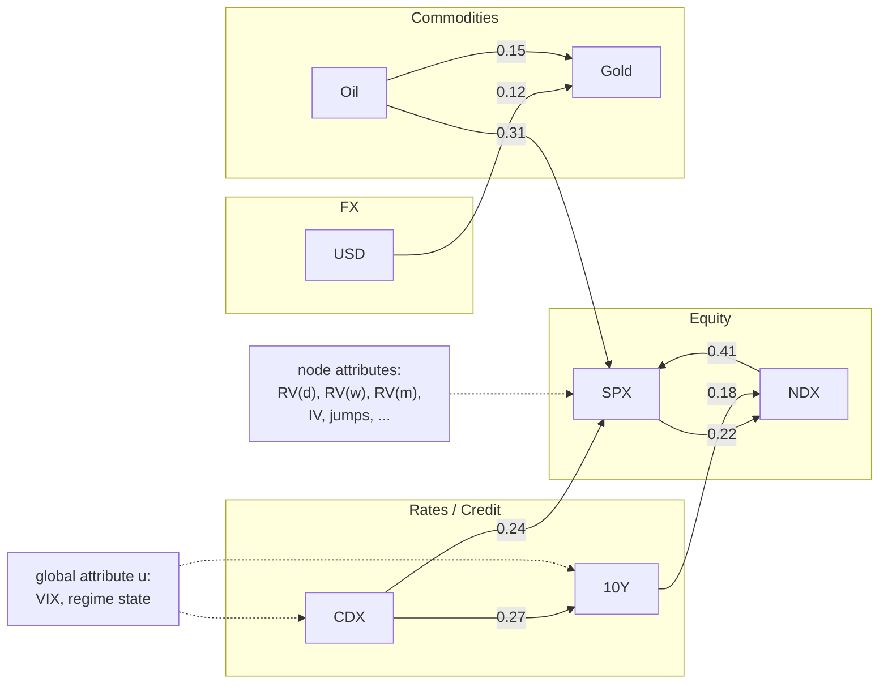

*A slice of the project's cross-asset universe as a directed, attributed graph. Nodes are assets grouped by class (equity, rates/credit, commodities, FX), each carrying a feature vector of volatility measures; directed edges carry spillover strengths (illustrative numbers); a global attribute holds market-wide state shared by every node. Forecasting SPX's next-day $\operatorname{RV}$ is a prediction about one node of this graph.*

The figure above draws a slice of the project's universe this way. Nothing about the picture is new: [Chapter 14](ch14-multivariate-volatility.md) drew asset graphs from correlations and [Chapter 15](ch15-spillovers-connectedness.md) visualized DY networks. What is new is the question we now ask: *can a neural network consume this entire object, attributes and wiring together, and produce a better forecast for each node?*

### You Already Know Three Graph Models

Before graphs feel exotic, notice that every architecture from [Chapter 12b](ch12b-deep-learning-vol.md) is secretly a graph model with the wiring frozen in advance (Sanchez-Lengeling et al., 2021):

- **Images as graphs.** Each pixel is a node connected to its eight neighbors. A convolution aggregates a node's neighborhood, which is exactly what a graph layer does; the only difference is that an image's neighborhood structure is identical everywhere, so the network never needs to be told the wiring.
- **Text as graphs.** A token sequence is a directed chain graph: each token connects to the token that follows it. An RNN walks this chain.
- **Transformers as graphs.** Self-attention lets every token attend to every other token, which is a *fully-connected* graph over tokens where the model learns how much each connection matters. We will make this precise in the Attention on Graphs section below.

Battaglia et al. (2018) organize this observation into a taxonomy of **relational inductive biases**: the assumptions about entity-to-entity structure that each architecture hard-codes (their Table 1, p. 6). The last column lists each architecture's **invariance**, the transformation of the input that provably does not change what the model computes: shift an image and a CNN's features shift with it; relabel a graph's nodes and a graph network's outputs relabel identically, a property we will define precisely in the Representing Graphs section below and lean on for the rest of the chapter.

| Component | Entities | Relations | Invariance |
|---|---|---|---|
| Fully connected | units | all-to-all | none |
| Convolutional | grid elements | local | spatial translation |
| Recurrent | timesteps | sequential | time translation |
| Graph network | nodes | edges | node, edge permutations |

> **Intuition: In Plain English**
>
> A CNN assumes "nearby pixels matter"; an RNN assumes "yesterday matters"; both bake the relationship structure into the architecture. A graph network makes the structure an *input*: you hand it the wiring diagram along with the data. That is precisely what we want for markets, where the wiring (which asset moves which) is not a grid, not a sequence, and not the same in calm and crisis.

> **Project Connection**
>
> The last row of the table is the pitch for this chapter. A pooled LSTM over 34 stacked asset series ([Chapter 12b](ch12b-deep-learning-vol.md)) imposes an arbitrary ordering of assets and learns nothing about which pairs interact. A graph network is **permutation invariant** over assets, so the forecast for SPX cannot depend on whether oil is column 7 or column 23 of the feature matrix, and the estimated spillover structure from [Chapter 15](ch15-spillovers-connectedness.md) becomes a first-class model input rather than a hand-crafted feature.

## Three Prediction Tasks on Graphs

Graph prediction problems come in three granularities, distinguished by *where the label lives* (Sanchez-Lengeling et al., 2021). Keeping them apart matters because the same network body supports all three; only the prediction head changes.

- **Node-level tasks** predict a property for each node. The canonical machine-learning example is Zachary's karate club, a 34-member social network split by a feud, where the task is to predict each member's allegiance. In our world: *predict next-day $\operatorname{RV}$ for every asset in the universe*. This is the project's task, and, in a pleasant coincidence, our universe has the same number of nodes as the karate club.
- **Edge-level tasks** predict a property of each connection: does asset $i$ spill volatility into asset $j$, and how strongly? Formally this is what GLASSO or transfer-entropy estimation does when it builds the graph (the Graph Construction section below); a GNN can also learn it end to end.
- **Graph-level tasks** predict one property of the whole graph. The classic example is molecular property prediction (does this molecule smell pungent?). In our world: is the market in a calm or turbulent regime, or what will *aggregate* market volatility be tomorrow?

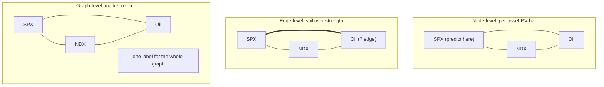

*One market graph, three prediction granularities. The project's estimator is a node-level regression (left); estimating who spills into whom is edge-level (middle); regime detection is graph-level (right). The same GNN body serves all three, with different heads.*

> **Project Connection**
>
> The project needs two of the three levels at once: the vol estimator is a *node-level regression* (SPX's node output is the deliverable), while a regime detector is a *graph-level* prediction. The global attribute $\mathbf{u}$ from the Market as a Graph section is where a graph-level regime signal naturally lives, which is exactly how we will wire regime information into the model in the Hybrids section below.

## Representing Graphs for Neural Networks

A graph carries up to four kinds of information: node attributes, edge attributes, the global attribute, and the **connectivity** (which nodes are wired to which). The first three are easy to hand to a neural network: stack the node vectors into a matrix, the edge vectors into another, and keep one global vector. Connectivity is the awkward one (Sanchez-Lengeling et al., 2021).

### The Adjacency Matrix and Its Two Problems

The textbook encoding of connectivity is the **adjacency matrix** $\mathbf{A} \in \mathbb{R}^{N \times N}$ for $N$ nodes: entry $A_{ij} \neq 0$ records an edge from node $j$ to node $i$, with the value carrying the edge weight. [Chapter 14](ch14-multivariate-volatility.md) used exactly this object (there written $W$) for its correlation graphs; from here on we reserve $\mathbf{W}$ for learnable weight matrices and always write the adjacency as $\mathbf{A}$.

The adjacency matrix has two problems as a neural-network input. First, **sparsity**: for a large graph, $N^2$ entries mostly record the absence of edges, which wastes memory and computation. Real systems store an **adjacency list**, the set of (sender, receiver) index pairs, which costs only as much as there are edges. At our scale ($N \approx 34$) this hardly matters, but it explains the data structures you will meet in every GNN library.

Second, and fatally for a naive approach: **permutation dependence**. Node order is arbitrary. Relabel the assets and you get a different matrix describing the *same* market. The figure below shows a four-node graph and two of its adjacency matrices; there are up to $N!$ of them, and nothing distinguishes one as canonical.

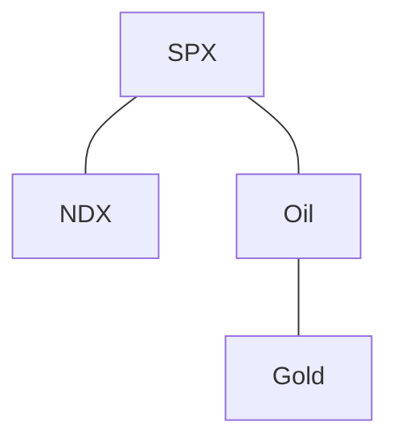

*Permutation dependence of the adjacency matrix. One graph (edges SPX-NDX, SPX-Oil, Oil-Gold), two of its adjacency matrices. Reordering the four assets produces a different matrix for the same graph. Any model whose output changes under such reorderings is fitting an accident of data layout.*

Ordering SPX, NDX, Oil, Gold gives one matrix; ordering Gold, Oil, NDX, SPX gives another, for the same market:

$$
\text{order: SPX, NDX, Oil, Gold} \quad
\begin{pmatrix} 0&1&1&0\\ 1&0&0&0\\ 1&0&0&1\\ 0&0&1&0 \end{pmatrix},
\qquad
\text{order: Gold, Oil, NDX, SPX} \quad
\begin{pmatrix} 0&1&0&0\\ 1&0&0&1\\ 0&0&0&1\\ 0&1&1&0 \end{pmatrix}.
$$

Why not just flatten $\mathbf{A}$ and the features into one long vector and use an MLP? Because the MLP's output would change under relabeling: it would be free to learn "column 7 predicts column 1," which is a statement about our spreadsheet, not about oil and SPX. A usable graph model must be **permutation invariant**: reorder the nodes at the input and the per-node outputs reorder the same way, nothing else changes. This single requirement drives essentially all GNN design (Sanchez-Lengeling et al., 2021; Battaglia et al., 2018).

### Matrix Multiplication Is Already Message Passing

Here is the observation that makes everything that follows concrete. We want a single operation that, for every asset at once, collects the features of that asset's neighbors. Take the node feature matrix $\mathbf{X} \in \mathbb{R}^{N \times d}$ (one row per asset, one column per feature) and simply multiply:

$$
\mathbf{B} \;=\; \mathbf{A}\,\mathbf{X},
\qquad
B_{i\cdot} \;=\; \sum_{j:\,A_{ij}\neq 0} A_{ij}\, X_{j\cdot}.
$$

where:

- $\mathbf{A} \in \mathbb{R}^{N \times N}$: the adjacency matrix (weighted or binary).
- $\mathbf{X} \in \mathbb{R}^{N \times d}$: node features; row $X_{j\cdot}$ is asset $j$'s feature vector.
- $\mathbf{B} \in \mathbb{R}^{N \times d}$: row $i$ is the *weighted sum of asset $i$'s neighbors' features*.

> **Intuition: In Plain English**
>
> One matrix multiplication by the adjacency makes every asset "listen" to its neighbors simultaneously: each row of the result is that asset's neighborhood, added up with edge weights. No loops, no per-asset code, and the result respects the graph because only wired pairs contribute.

Two consequences follow immediately. First, powers of the adjacency reach further (Sanchez-Lengeling et al., 2021): $(\mathbf{A}^2)_{ij}$ counts (weighted) walks of length two from $j$ to $i$, so $\mathbf{A}^2\mathbf{X}$ gathers neighbors-of-neighbors, and $\mathbf{A}^k\mathbf{X}$ gathers the $k$-hop neighborhood. Stacking graph layers will do exactly this. Second, the operation is permutation *equivariant*, the sibling of invariance: an *invariant* output (say, a whole-market forecast) does not change at all when assets are relabeled, while an *equivariant* output (per-asset forecasts) relabels in exactly the same way as the input, so that each asset still gets its own answer. Relabel the assets and the rows of $\mathbf{B}$ relabel identically; the graph, not the ordering, determines the answer.

> **Project Connection**
>
> The $\mathbf{A}\mathbf{X}$ equation above is not a toy: the GHAR model that anchors the GHAR and GNNHAR section augments each HAR regression with exactly the terms $(\mathbf{A}\,\operatorname{RV}_t)_i$, a linear one-hop neighborhood aggregate. When we say "one graph layer," at bottom we mean this multiplication, possibly wrapped in learned weights and a nonlinearity. If you understand the $\mathbf{A}\mathbf{X}$ equation, the rest of the chapter is variations.

## Building a GNN: From Per-Node MLPs to Message Passing

We now assemble a graph neural network the way Sanchez-Lengeling et al. (2021) do: start with the simplest thing that deserves the name, notice what it cannot do, and add one capability at a time. By the end of the section you will have every ingredient the volatility literature uses.

A **graph neural network (GNN)** is an optimizable transformation on all attributes of a graph (nodes, edges, global) that preserves the graph's symmetries, i.e. permutation invariance. GNNs are *graph-in, graph-out*: the input is a graph with feature vectors loaded into its parts; the output is the same graph, same wiring, with *updated* feature vectors, now called **embeddings**. Prediction heads read the final embeddings.

### The Simplest GNN Layer

The minimal GNN layer applies a separate small MLP to each kind of attribute: one network transforms every node vector, another every edge vector, a third the global vector. Connectivity is not used at all inside the layer.

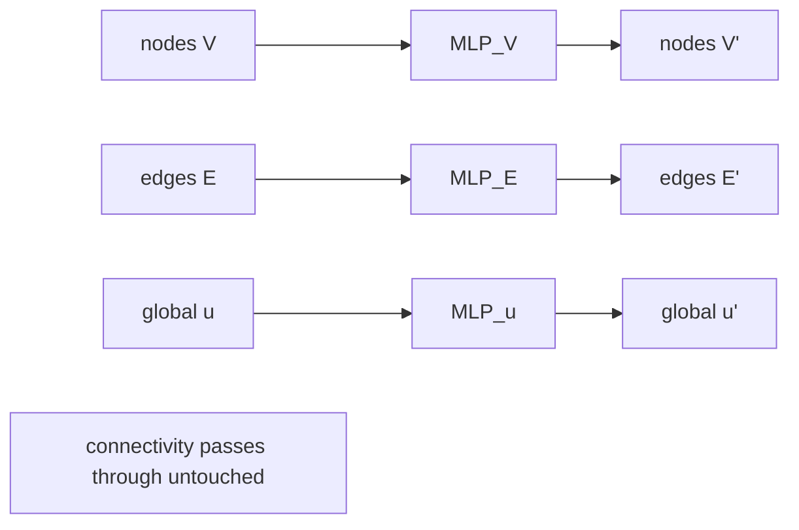

*The simplest GNN layer: independent MLPs update node, edge, and global attributes; the wiring is carried through unchanged. Each lane's MLP is shared across all items in that lane, which is what preserves permutation invariance.*

Two details carry all the weight. The MLPs are *shared*: every node passes through the same $\text{MLP}_V$, so relabeling nodes relabels outputs and nothing more. And because the layer returns a graph, layers stack, just like any other deep network. What this layer lacks is communication: each asset is transformed in isolation, so it is really a per-asset MLP wearing a graph costume. Useful as a baseline; not yet a network model.

### Pooling: Moving Information Between Parts

Prediction often needs information to move between attribute types. If you want a *graph-level* regime label but only have node embeddings, you must collect the nodes into one vector. The operation is **pooling**: gather the relevant embeddings, then reduce them with an order-insensitive **aggregation** such as a sum or mean (Sanchez-Lengeling et al., 2021). Order-insensitivity is not cosmetic: it is what keeps the whole pipeline permutation invariant (the Aggregation section below returns to the choice of aggregator, which turns out to matter).

The same trick routes information anywhere: edges to nodes, nodes to global, global to nodes. This flexibility is why missing attributes are never fatal in a GNN: if your dataset has edge weights but no node features, pool the incident edges to manufacture node inputs.

### Message Passing

The decisive upgrade lets the *layer itself* use connectivity, so that embeddings become neighborhood-aware. **Message passing** works in three steps for every node, simultaneously (Sanchez-Lengeling et al., 2021): gather each neighbor's embedding (the *messages*), aggregate them with an order-insensitive reduction, and pass the result through a learned **update function** to produce the node's new embedding. That is the $\mathbf{A}\mathbf{X}$ equation plus learnable pieces.

Gilmer et al. (2017) showed that essentially every GNN in the literature is a choice of three functions in one template, the **message passing neural network (MPNN)**. We reproduce it exactly because it is the chapter's Rosetta stone: every architecture below is an entry in this template.

The framework formalizes "gather, aggregate, update, then read out a prediction" over $T$ rounds:

$$
\begin{aligned}
  m_v^{t+1} &= \sum_{w \in \mathcal{N}(v)} M_t\!\left(\mathbf{h}_v^t,\, \mathbf{h}_w^t,\, \mathbf{e}_{vw}\right)\\
  \mathbf{h}_v^{t+1} &= U_t\!\left(\mathbf{h}_v^t,\, m_v^{t+1}\right)\\
  \hat{y} &= R\!\left(\{\, \mathbf{h}_v^T \mid v \in G \,\}\right)
\end{aligned}
$$

where (Gilmer et al., 2017, eqs. 1-3, p. 3):

- $\mathbf{h}_v^t$: node $v$'s embedding after $t$ rounds, initialized to its raw features.
- $\mathcal{N}(v)$: the neighbors of $v$ in the graph; $\mathbf{e}_{vw}$: the edge features between $v$ and $w$.
- $M_t$: the **message function**, which decides what information a neighbor sends (it may use both endpoints' states and the edge attributes).
- $U_t$: the **update function**, which merges the aggregated messages into the node's state.
- $R$: the **readout**, which turns final embeddings into the prediction; it must be permutation invariant for the whole model to be.
- $M_t$, $U_t$, $R$ are all learned, differentiable functions; $T$ is the number of message-passing rounds.

> **Intuition: In Plain English**
>
> Each round of message passing is a rumor mill with learned manners: every asset composes a message for each neighbor ("here is my state, adjusted for our relationship"), every asset adds up what it hears, and then rewrites its own state in light of the gossip. After one round each asset knows its neighbors; after $T$ rounds it has heard, indirectly, from everything within $T$ hops.

> **Project Connection**
>
> The choice of $(M_t, U_t, R)$ is where volatility modeling decisions live, and every named model later in this chapter is a row in that design table. To preview three you will meet shortly: GHAR (the GHAR section) takes $M$ linear and $U$ trivial (a regression on the aggregate); GNNHAR (the GNNHAR section) makes $U$ a one-hidden-layer nonlinearity; GAT (the Attention on Graphs section) makes $M$ attention-weighted. The readout $R$ for our node-level task is simply a per-node regression head with $\operatorname{QLIKE}$ loss. When you read any vol-GNN paper, your first move should be to identify its $(M, U, R)$; return to this box after the GNNHAR section and the sentence will read as a summary rather than a preview.

### The GCN Layer

The most widely used concrete message-passing layer is the **graph convolutional network (GCN)** of Kipf and Welling (2017). It fixes the message function to a degree-normalized copy of the neighbor's state and the update to a single learned linear map plus nonlinearity, all expressible in one matrix equation.

We want a layer that averages each node's neighborhood (including itself), transforms the result with learned weights, and stays numerically stable when stacked:

$$
\mathbf{H}^{(l+1)} \;=\; \sigma\!\left( \tilde{\mathbf{D}}^{-\frac{1}{2}}\, \tilde{\mathbf{A}}\, \tilde{\mathbf{D}}^{-\frac{1}{2}}\, \mathbf{H}^{(l)}\, \mathbf{W}^{(l)} \right)
$$

where (Kipf and Welling, 2017, eq. 2, p. 2):

- $\mathbf{H}^{(l)} \in \mathbb{R}^{N \times d_l}$: the matrix of node embeddings at layer $l$, with $\mathbf{H}^{(0)} = \mathbf{X}$.
- $\tilde{\mathbf{A}} = \mathbf{A} + \mathbf{I}_N$: the adjacency with **self-loops** added, so each node's own state joins the average.
- $\tilde{\mathbf{D}}$: the diagonal degree matrix of $\tilde{\mathbf{A}}$, $\tilde{D}_{ii} = \sum_j \tilde{A}_{ij}$; the symmetric sandwich $\tilde{\mathbf{D}}^{-1/2}\tilde{\mathbf{A}}\tilde{\mathbf{D}}^{-1/2}$ turns the raw sum of the $\mathbf{A}\mathbf{X}$ equation into a degree-normalized average.
- $\mathbf{W}^{(l)}$: the layer's learned weight matrix; $\sigma$: an activation such as $\operatorname{ReLU}$.

> **Intuition: In Plain English**
>
> A GCN layer is the $\mathbf{A}\mathbf{X}$ equation made trainable and polite: every asset averages its neighborhood (itself included, thanks to the self-loops), with popular, high-degree nodes damped so they do not shout over everyone; then a shared linear layer re-describes the average and a nonlinearity lets layers compose into something richer than one big average.

Three remarks anchor this equation to things you already know; none is needed to follow the rest of the chapter, so skim on first read. *Why the self-loops and the normalization?* Repeatedly multiplying by a fixed matrix scales activations by that matrix's **eigenvalues**, the factors by which the operation stretches or shrinks along its natural directions; the un-normalized operator has eigenvalues up to 2, so stacked layers can double activations each time (or crush them toward zero), and the **renormalization trick** $\tilde{\mathbf{D}}^{-1/2}\tilde{\mathbf{A}}\tilde{\mathbf{D}}^{-1/2}$ exists precisely to tame this instability (Kipf and Welling, 2017, p. 3). *Where does the name "convolutional" come from?* The GCN equation is the endpoint of a derivation that defines convolutions in a graph's frequency (Fourier) domain, built on the **graph Laplacian**, a matrix derived from the adjacency that measures how bumpy a signal is across edges, and then truncates them to their cheapest approximation (Kipf and Welling, 2017, eqs. 3-8). We will meet this spectral view concretely in GSP-HAR (the GSP-HAR section below). *And as an MPNN?* The GCN is the template with message $M(\mathbf{h}_v, \mathbf{h}_w) = (\deg(v)\deg(w))^{-1/2} A_{vw}\, \mathbf{h}_w$ and update $U(\cdot) = \operatorname{ReLU}(\mathbf{W}\, m_v)$ (Gilmer et al., 2017, p. 4): fixed structural weights, no learned per-pair importance. That last limitation is what attention will remove.

### GraphSAGE: Sampling and the Inductive Setting

One more classical layer earns a short stop. **GraphSAGE** (Hamilton et al., 2017) modifies the GCN recipe in two ways: it *concatenates* the node's own previous state with the neighborhood aggregate before the learned transform, a **skip connection**, meaning the layer keeps an untouched copy of its input alongside the transformed version instead of blending them away, which empirically "leads to significant gains" over averaging self and neighbors together (Hamilton et al., 2017, p. 5); and it *samples* a fixed-size subset of neighbors rather than using them all, so that web-scale graphs fit in memory. It also names an important distinction: a **transductive** model (like spectral methods tied to one graph's Laplacian eigenbasis) only works on the graph it was trained on, while an **inductive** model like GraphSAGE learns aggregator *functions* that transfer to unseen nodes and graphs.

> **Project Connection**
>
> Read GraphSAGE with our scale in mind. Neighborhood sampling is machinery for graphs with millions of nodes; at $N \approx 34$, full neighborhoods are free and sampling adds noise for nothing. The two ideas that do transfer: the concatenation skip (keep the asset's own history distinct from its neighborhood summary rather than blending them) and the inductive framing (an aggregator trained on one estimation window applies when the graph is re-estimated next month, or when a ticker enters the universe).

### Edge and Global Updates: The Full Graph Networks Block

Everything so far updates node embeddings only. The general layer, the **graph networks (GN) block** of Battaglia et al. (2018), updates all three attribute types in one pass, each conditioned on the others. This is the framework the Distill article's diagrams are drawn in, and the natural home for our global market-state vector.

One block performs three updates ($\phi$, learned) interleaved with three aggregations ($\rho$, fixed and permutation invariant):

$$
\begin{aligned}
  \mathbf{e}'_k &= \phi^e\!\left(\mathbf{e}_k,\, \mathbf{v}_{r_k},\, \mathbf{v}_{s_k},\, \mathbf{u}\right),
  &\qquad \bar{\mathbf{e}}'_i &= \rho^{e \rightarrow v}\!\left(E'_i\right),\\
  \mathbf{v}'_i &= \phi^v\!\left(\bar{\mathbf{e}}'_i,\, \mathbf{v}_i,\, \mathbf{u}\right),
  &\qquad \bar{\mathbf{e}}' &= \rho^{e \rightarrow u}\!\left(E'\right),\\
  \mathbf{u}' &= \phi^u\!\left(\bar{\mathbf{e}}',\, \bar{\mathbf{v}}',\, \mathbf{u}\right),
  &\qquad \bar{\mathbf{v}}' &= \rho^{v \rightarrow u}\!\left(V'\right),
\end{aligned}
$$

where (Battaglia et al., 2018, eq. 1, p. 12):

- $\mathbf{e}_k$: the $k$-th edge's attribute, with $s_k$ and $r_k$ the indices of its **sender** and **receiver** nodes; $\mathbf{v}_i$: node $i$'s attribute; $\mathbf{u}$: the global attribute.
- $\phi^e$, the **edge update**, refreshes each edge from its endpoints and the global state; $\phi^v$, the **node update**, refreshes each node from its aggregated incoming edges $\bar{\mathbf{e}}'_i$; $\phi^u$, the **global update**, refreshes $\mathbf{u}$ from everything. In practice each $\phi$ is an MLP on the concatenated inputs (Battaglia et al., 2018, eq. 2, p. 15).
- Watch the primes: $E'_i$ is only the updated edges arriving at node $i$; $E'$ is *every* updated edge in the graph; $V'$ is every updated node. The $\rho$ functions (sums, means, maxima) collapse these variable-size sets into fixed-size vectors and must be permutation invariant.

> **Intuition: In Plain English**
>
> One GN block runs the market meeting in a fixed order: first every *relationship* updates (each spillover channel looks at the two assets it connects and the market mood), then every *asset* updates (digesting its refreshed incoming channels), then the *market mood* itself updates (digesting all assets and channels). Edges, nodes, and the global state take turns being speaker and audience.

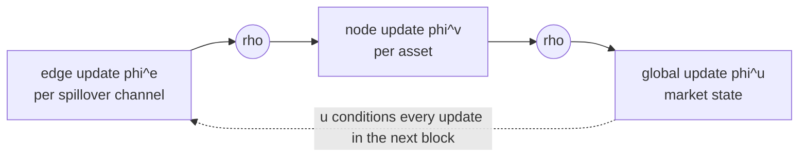

*One graph networks block (Battaglia et al., 2018): edges update first, aggregate into their receiver nodes, nodes update, everything aggregates into the global attribute, which updates last and conditions all updates in the next block. The $\rho$ aggregations (sum/mean/max) are the permutation-invariant joints of the machine.*

> **Project Connection**
>
> The GN block is the most general wiring we will need, and each specialization has a project meaning. Drop $\phi^e$ and $\phi^u$ and fix $\rho$ to a degree-normalized sum: you recover the GCN. Keep edge attributes as inputs but never update them: that is SpotV2Net's use of vol-of-vol edge features (the frontiers section below). The global lane $\mathbf{u}$ is where a regime probability or VIX state naturally enters so that *every* asset's update is regime-conditioned; we exploit this in the Hybrids section below.

## Attention on Graphs

The GCN treats all neighbors alike up to degree normalization: oil's message to SPX gets the same structural weight on a calm Tuesday as mid-crash. But you already own the fix. The transformer section of [Chapter 12b](ch12b-deep-learning-vol.md) introduced attention as a learned, input-dependent weighting over positions; the **graph attention network (GAT)** of Veličković et al. (2018) is that same mechanism restricted, or *masked*, to each node's graph neighborhood.

We want each receiving asset to score how relevant each neighbor is right now, normalize the scores into weights, and average neighbor states with those weights. GAT does this in three steps:

$$
\begin{aligned}
  e_{ij} &= \operatorname{LeakyReLU}\!\left(\mathbf{a}^\top \left[\mathbf{W}\mathbf{h}_i \,\Vert\, \mathbf{W}\mathbf{h}_j\right]\right)\\
  \alpha_{ij} &= \frac{\exp(e_{ij})}{\sum_{k \in \mathcal{N}(i)} \exp(e_{ik})}\\
  \mathbf{h}'_i &= \sigma\!\Bigl(\sum_{j \in \mathcal{N}(i)} \alpha_{ij}\, \mathbf{W} \mathbf{h}_j\Bigr)
\end{aligned}
$$

where (Veličković et al., 2018, eqs. 1-4, pp. 3-4):

- $\mathbf{h}_i \in \mathbb{R}^{F}$: node $i$'s current embedding; $\mathbf{W} \in \mathbb{R}^{F' \times F}$: a shared linear map applied to every node before scoring.
- $e_{ij}$: the **attention score**, the "importance of node $j$'s features to node $i$," computed by a tiny one-layer network: concatenate ($\Vert$) the transformed pair, project onto a learned vector $\mathbf{a} \in \mathbb{R}^{2F'}$, apply a LeakyReLU.
- $\alpha_{ij}$: the normalized **attention coefficient**; the softmax runs only over $i$'s neighborhood $\mathcal{N}(i)$ (which includes $i$ itself), so the weights on each node's inbox sum to one. This restriction is the **masked attention** that injects the graph structure.
- $\mathbf{h}'_i$: the new embedding, an attention-weighted average of transformed neighbors passed through a nonlinearity $\sigma$.

In practice $K$ independent attention heads run in parallel and their outputs are concatenated in hidden layers and averaged at the output layer (Veličković et al., 2018, eqs. 5-6, p. 4), exactly the multi-head pattern of the transformer section of [Chapter 12b](ch12b-deep-learning-vol.md).

> **Intuition: In Plain English**
>
> A GCN gives every neighbor a fixed microphone volume set by the wiring; a GAT lets the listener adjust each volume knob based on what is being said. When oil is quiet, SPX can turn oil down; when oil is crashing, the same trained mechanism turns it up. The weights $\alpha_{ij}$ are recomputed from the current features every day, so the *effective* graph changes with the state of the market even when the wiring is static.

### Transformers Are Fully-Connected GATs

Now the bridge promised in the Market as a Graph section can be stated exactly: a transformer is a GNN with an attention mechanism on a fully-connected graph; a GAT is a transformer whose attention is masked by the adjacency matrix (Sanchez-Lengeling et al., 2021). The difference is the assumed connectivity, sparse versus complete, and that is a modeling choice, not a law. The graph-transformer approach previewed in the transformer section of [Chapter 12b](ch12b-deep-learning-vol.md) (Chen and Robert, 2022) sits at this junction: transformer-style attention run over a sparse, precomputed multi-relation graph rather than the complete one (details in the frontiers section below). Two practical GAT properties matter for us: it supports *directed* graphs (simply omit $\alpha_{ij}$ when the edge $j \to i$ is absent), and its per-layer cost is on par with a GCN (Veličković et al., 2018, pp. 4-5).

> **Key Idea: Attention Weights as a Learned Spillover Matrix**
>
> Collect the coefficients $\alpha_{ij}$ into a matrix and you have a row-normalized, state-dependent, learned analogue of the Diebold-Yilmaz spillover table from [Chapter 15](ch15-spillovers-connectedness.md). This is the interpretability hook of graph attention: Gong et al. (2025) report (in a study of 18 markets) that attention-based interrelations differ systematically between tranquil and turbulent periods, and SpotV2Net reads its trained attention weights as time-varying co-movement importances (the frontiers section below). Treat the idea with care: attention weights are trained parameters that co-move with regimes, not identified causal spillovers, and the Gong et al. (2025) evidence is qualitative here because the paper's numbers sit behind a paywall.

> **Project Connection**
>
> For the project, GAT is the natural upgrade path once a GCN-style layer works: same inputs, same one-hop structure, but state-dependent weights that can, in principle, deliver regime-varying spillovers without an explicit regime model. The honest caveat comes from the evidence discipline of the Skeptic's Checklist section: no vol paper has yet shown, under $\operatorname{QLIKE}$ with significance tests, that the attention upgrade beats fixed weights. It is a hypothesis our data can test, not a settled result.

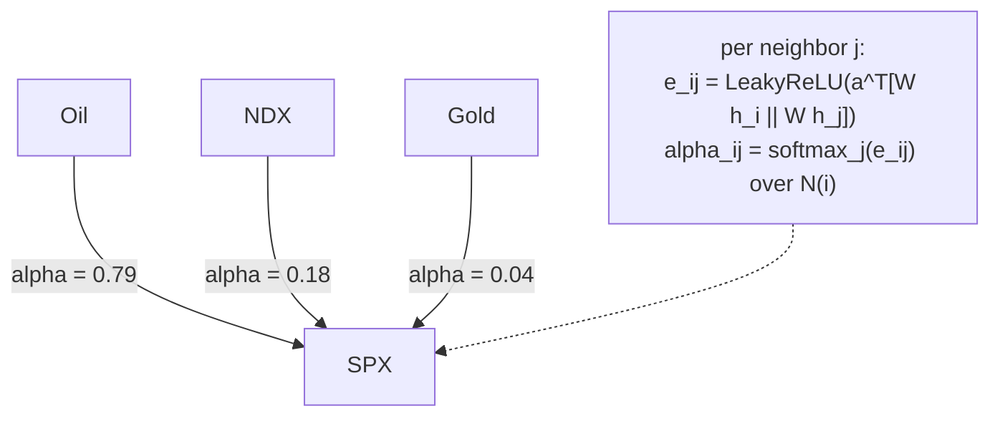

*One GAT aggregation at the SPX node, using the worked example's numbers. Each incoming neighbor is scored against SPX's own state, scores are softmax-normalized over the neighborhood, and SPX's new embedding is the weighted average (arrow thickness equals attention weight). Compare the market-graph figure: the wiring is the same; the weights are now learned and state-dependent.*

## Design Lessons: Depth, Aggregation, and Tiny Graphs

You now hold every architectural ingredient. Before the volatility literature, three design questions need answers, because the defaults from mainstream GNN practice are calibrated to graphs a million times larger than ours: how deep, which aggregator, and what actually drives performance.

### What the Empirical Design Space Says

Sanchez-Lengeling et al. (2021) sweep architectures on a molecular benchmark and distill (their word) lessons that hold up remarkably well across the GNN literature. More parameters do correlate with better performance, but strong models already exist at very small sizes (a few thousand parameters): GNNs are parameter-efficient. Mean performance rises with embedding dimension and with depth, *but* the best individual models are often small and shallow; in their sweep the top performers have two layers, not three or four, and the performance floor drops as depth grows. The clearest trend is not architectural at all: the more attribute types that exchange information (nodes, edges, global), the better the average model. Wiring beats size.

### Aggregation Is Not a Detail

Sum, mean, or max over the neighborhood messages? No aggregation is uniformly best: mean suits highly variable neighborhood sizes, max highlights single salient neighbors, sum preserves "how many" (Sanchez-Lengeling et al., 2021). But there is a sharp theoretical ranking, and it needs three terms. A **multiset** is a collection where repeats count (three stressed neighbors is a different multiset from one, even if the values are identical); a function is **injective** if different inputs never produce the same output, so nothing gets squashed together; and the **Weisfeiler-Lehman (WL) test** is a classic pencil-and-paper procedure for telling two graphs apart by repeatedly relabeling nodes with summaries of their neighborhoods. Xu et al. (2019) prove that message-passing GNNs are at most as powerful as the WL test at distinguishing structures (their Lemma 2), that this ceiling is reached when aggregation and update are injective on the multiset of neighbor states (Theorem 3), and that among the standard choices only the **sum** is injective: mean recovers only the *distribution* of neighbor states, forgetting how many there were (their Corollary 8), and max only the *set* of distinct values, forgetting repeats entirely (Corollary 9). Their expressiveness ranking, sum $>$ mean $>$ max (their Fig. 2), comes with a constructive layer that attains the ceiling, the **graph isomorphism network (GIN)**:

$$
\mathbf{h}_v^{(k)} \;=\; \operatorname{MLP}^{(k)}\!\Bigl( \bigl(1 + \epsilon^{(k)}\bigr)\, \mathbf{h}_v^{(k-1)} \;+\; \sum_{u \in \mathcal{N}(v)} \mathbf{h}_u^{(k-1)} \Bigr)
$$

where (Xu et al., 2019, eq. 4.1, p. 5):

- the plain (unnormalized) sum over neighbors preserves the full multiset of neighbor states;
- $\epsilon^{(k)}$ is a small learned or fixed scalar keeping the node's own state distinguishable from its neighborhood;
- the MLP (not a single linear-plus-ReLU layer, which Lemma 7 of the paper shows is insufficient) makes the update injective.

> **Intuition: In Plain English**
>
> If three of your neighbors are stressed, a sum knows it is three; a mean only knows "stressed on average"; a max only knows "at least one." For contagion-flavored questions, the count is information. GIN is the layer built so that no two genuinely different neighborhoods ever produce the same message.

> **Project Connection**
>
> For volatility the ranking is a prior, not a rule: when a crisis hits, the *number* of stressed neighbors plausibly matters (sum), but degree-normalized means (GCN) have carried every published vol-GNN result so far, including GNNHAR. The practical lesson is cheaper: aggregation is a one-line hyperparameter, so ablate sum against mean on our data rather than assuming either.

### Over-Smoothing: Why Depth Backfires

In most of deep learning, depth buys expressiveness. In GNNs it buys a specific failure. Li et al. (2018) show that the GCN's propagation step is a form of **Laplacian smoothing**: each layer replaces every node's features with a (degree-weighted) average over its neighborhood, which is why one or two layers *help*, since nodes in the same cluster become similar and easier to model jointly. Their Theorem 1 gives the limit: on a connected, non-bipartite graph (and adding self-loops guarantees non-bipartite), repeatedly applying the smoothing operator drives *all* node features to a common value, up to degree scaling; with $k$ connected components, features converge within each component. Stack enough graph layers and every asset's embedding becomes the same market-wide average. The differences between assets, which are the entire point of a cross-sectional model, are smoothed away. This is **over-smoothing**.

*[Figure: Over-smoothing. Five assets' embeddings, shown as distinct colors, are tracked down four layers. At layer 0 the five nodes are strongly distinct (blue, red, gold, green, purple); at layer 1 the colors fade; at layer 2 they fade further; by layer 3 all five nodes are near-identical gray. Message passing is Laplacian smoothing (Li et al., 2018): each layer pulls every node's embedding toward its neighborhood average, so with depth all nodes in a connected component converge to a common (degree-scaled) value. On small, well-connected asset graphs the collapse arrives within a handful of layers, and the cross-sectional differences that carry the forecast signal are gone.]*

| Layer | Node 1 | Node 2 | Node 3 | Node 4 | Node 5 |
|---|---|---|---|---|---|
| 0 | blue (strong) | red (strong) | gold (strong) | green (strong) | purple (strong) |
| 1 | blue (faded) | red (faded) | gold (faded) | green (faded) | purple (faded) |
| 2 | blue (weak) | red (weak) | gold (weak) | green (weak) | purple (weak) |
| 3 | gray | gray | gray | gray | gray |

How fast is "enough"? On small graphs, very fast. Li et al. (2018) demonstrate the collapse on Zachary's karate club, 34 vertices, the same $N$ as our universe (the Three Prediction Tasks section), where node embeddings become indistinguishable by four to five layers (their Fig. 2). Estimated financial graphs are also dense, with diameters of 3 to 5 (GNNHAR reports diameter 3 for its 27-stock DJIA graph; the GHAR and GNNHAR section): two hops already connect nearly everything to nearly everything, and a third mostly recirculates the same information.

> **Key Idea: Your Graph Is Tiny, and That Changes the Defaults**
>
> Mainstream GNN engineering (neighbor sampling, minibatch subgraph partitioning, 64-256-dimensional embeddings, 4+ layers) is calibrated to graphs with $10^5$-$10^8$ nodes. Financial vol graphs have $10$-$500$. Consequences: full-batch training is free, sampling is unnecessary noise, parameter budgets must be small because the cross-section supplies only $N \times T$ observations, over-smoothing arrives at depth 2-3 rather than 10, and a single fully-connected layer is not obviously worse than a clever sparse one (the Graph Construction section shows this is an empirical fight). When you read GNN advice, first ask what $N$ it was written for.

For completeness: the Distill article's remaining topics, sampling and batching schemes, hypergraphs and multigraphs, graph duals, and generative graph models, are useful elsewhere but have no volatility payoff at our scale; Sanchez-Lengeling et al. (2021) covers them well if you are curious. The rest of the chapter is what happens when this machinery meets real markets, honest baselines, and $\operatorname{QLIKE}$.

## GHAR and GNNHAR: The Canonical Volatility Result

[Chapter 15](ch15-spillovers-connectedness.md) closed by compressing the volatility network into a handful of hand-crafted features. The alternative this chapter has been building toward, learning on the network directly, has exactly one lineage in the literature that plays by this book's evaluation rules ($\operatorname{QLIKE}$, Diebold-Mariano, Model Confidence Set): the GHAR/GNNHAR work of Zhang, Pu, Cucuringu, and Dong (Zhang et al., 2023, 2024). We give it a full treatment, both because it is the strongest evidence graphs help volatility forecasting, and because its headline is a useful vaccine: the best rigorously evaluated GNN improves on a rolling OLS-HAR by about 13% in MSE and *4% in $\operatorname{QLIKE}$* at the daily horizon, more at weekly, nothing by monthly. Real, repeatable, and modest. Calibrate here before reading any braver claim in the frontiers section.

Throughout this section the setting is 27 DJIA stocks (those trading continuously July 2007-June 2021), 5-minute subsampled $\operatorname{RV}$, all models re-estimated monthly on a rolling 1000-day window, with a 10-year out-of-sample span (July 2011-June 2021) (Zhang et al., 2023, pp. 13-14). Note one convention before the equations: this paper's HAR uses *non-overlapping* lag components, the weekly term averaging lags 2-5 and the monthly term lags 6-22, so the three regressors partition the past rather than nesting as in Corsi's original ([Chapter 6](ch06-har-model.md)).

### GHAR: The Linear Graph Baseline

Stack the cross-section into vectors: $\boldsymbol{RV}_t \in \mathbb{R}^N$ holds all $N$ assets' realized variances on day $t$, and $\mathbf{V}_{:t-1} = [\boldsymbol{RV}_{t-1},\, \boldsymbol{RV}_{t-5:t-2},\, \boldsymbol{RV}_{t-22:t-6}] \in \mathbb{R}^{N \times 3}$ collects the three HAR lag components for every asset. GHAR asks the smallest possible graph question: what if each asset's regression also sees its *neighbors'* HAR lags, averaged over the graph?

$$
\boldsymbol{RV}_t \;=\; \boldsymbol{\alpha}
\;+\; \underbrace{\mathbf{V}_{:t-1}\,\bm{\beta}}_{\text{own lags (HAR)}}
\;+\; \underbrace{\mathbf{W}\,\mathbf{V}_{:t-1}\,\bm{\gamma}}_{\text{neighbors' lags}}
\;+\; \boldsymbol{u}_t,
\qquad
\mathbf{W} = \mathbf{O}^{-\frac{1}{2}} \mathbf{A}\, \mathbf{O}^{-\frac{1}{2}}
$$

where (Zhang et al., 2023, eq. 6, p. 8):

- $\mathbf{A}$: a binary, undirected adjacency matrix with zero diagonal (no self-loops); $\mathbf{O} = \operatorname{diag}(n_1,\dots,n_N)$ its degree matrix, so $\mathbf{W}$ is the degree-normalized adjacency and $\mathbf{W}\mathbf{V}_{:t-1}$ is the $\mathbf{A}\mathbf{X}$ equation applied to the HAR lags: each row is the average of that asset's neighbors' daily, weekly, and monthly components.
- $\bm{\beta}, \bm{\gamma} \in \mathbb{R}^3$: *pooled* coefficients, shared by every asset; only the intercept $\boldsymbol{\alpha} \in \mathbb{R}^N$ is asset-specific. Six pooled slopes total, whether $N$ is 27 or 500, the same weight-sharing that makes graph convolutions tractable, executed in OLS.
- Setting $\mathbf{A} = \mathbf{0}$ recovers plain HAR; setting $\mathbf{A}$ to the complete graph makes the graph term the cross-sectional average, the "market volatility" regressor of earlier panel-HAR work.

> **Intuition: In Plain English**
>
> GHAR gives every asset's HAR regression three extra columns: what my neighbors' vol did yesterday, last week, last month, averaged over whoever the graph says my neighbors are. It is one step of message passing with no neural network attached, estimable by OLS in milliseconds.

> **Project Connection**
>
> GHAR is the project's mandatory cheap baseline, and the Project Blueprint section builds its first experiment around it. If three OLS coefficients on neighborhood averages capture most of the spillover value on our universe, no GNN that fails to beat GHAR deserves GPU time. In the univariate special case, this is simply three extra SPX regressors: graph-weighted averages of the other 33 symbols' lagged $\operatorname{RV}$s.

### The Graph: GLASSO Conditional-Independence Networks

Where does $\mathbf{A}$ come from? The lineage's answer is the **graphical LASSO (GLASSO)**: estimate which asset pairs are *conditionally* dependent, and wire an edge exactly there.

The estimator penalizes the inverse covariance so that weak conditional links are pushed to exact zero:

$$
\hat{\bm{\Theta}} \;=\; \operatorname*{argmin}_{\bm{\Theta} \succeq 0}\;
\Bigl( \operatorname{tr}(\mathbf{S}\bm{\Theta}) \;-\; \log\det(\bm{\Theta}) \;+\; \lambda \sum_{j \neq k} \lvert \Theta_{jk} \rvert \Bigr),
\qquad
A_{ij} = \mathbb{1}\{\hat{\Theta}_{ij} \neq 0\}
$$

where (Zhang et al., 2024, p. 8):

- $\mathbf{S}$: the sample covariance of (de-meaned) returns over the estimation window; $\bm{\Theta} = \bm{\Sigma}^{-1}$ is the **precision matrix**, whose zero entries mark pairs that are conditionally independent given all other assets.
- $\lambda$: the sparsity penalty, chosen by five-fold cross-validation on the training window; larger $\lambda$, sparser graph.
- The adjacency keeps only the *support* of $\hat{\bm{\Theta}}$: binary, undirected, no self-loops.
- Operationally, the first two terms are the (negative log-) likelihood of the data under a Gaussian model, so minimizing them finds the dependence structure that best explains the returns, and the $\lambda$ penalty charges rent for every nonzero entry, so weak links are evicted. You never need to solve this by hand: read it as "best-fit network, made as sparse as the data allows."

> **Intuition: In Plain English**
>
> Raw correlation connects nearly everything to everything, because all risk assets share the market factor. The precision matrix asks a sharper question: after accounting for every other asset, do these two still move together? An edge survives GLASSO only if the pair has a *direct* relationship that the rest of the universe cannot explain away, which is much closer to what "spillover channel" should mean.

Crucially, the graph is *re-estimated inside each rolling window*, monthly, from historical returns only (Zhang et al., 2023, pp. 9, 14). No future data touches the adjacency. This point-in-time discipline looks pedantic until the Graph Construction section, where we meet papers that cannot demonstrate it.

### GNNHAR: One Nonlinear Hop

GNNHAR upgrades GHAR's linear neighborhood average to a learned, nonlinear graph layer, while deliberately keeping the asset's *own* lags in the linear HAR channel. The graph models only the spillovers.

The layer is a GCN-style propagation without self-loops, and the model reads the final layer out through pooled coefficients:

$$
\begin{aligned}
  \mathbf{H}^{(l+1)} &= \operatorname{ReLU}\!\left( \mathbf{O}^{-\frac{1}{2}} \mathbf{A}\, \mathbf{O}^{-\frac{1}{2}}\, \mathbf{H}^{(l)}\, \bm{\Theta}^{(l)} \right),
  \qquad \mathbf{H}^{(0)} = \mathbf{V}_{:t-1}\\[2pt]
  \text{GNNHAR1L:}\quad \boldsymbol{RV}_t &= \boldsymbol{\alpha} + \mathbf{V}_{:t-1}\,\bm{\beta} + \mathbf{H}^{(1)}\bm{\gamma} + \boldsymbol{u}_t
\end{aligned}
$$

where (Zhang et al., 2023, eqs. 7-8, pp. 9-10):

- $\mathbf{H}^{(l)} \in \mathbb{R}^{N \times D^{(l)}}$: node embeddings; the input is each asset's three HAR lags; $\bm{\Theta}^{(l)}$: the layer's trainable weights (their notation for our $\mathbf{W}^{(l)}$; not the GLASSO precision matrix, an unfortunate but standard clash).
- Unlike the GCN of the GCN equation, the diagonal of $\mathbf{A}$ stays *zero*: the layer aggregates neighbors only, because the own-lag channel already enters linearly and the authors found nonlinearity in the own channel unhelpful (Zhang et al., 2023, footnote 8, p. 10).
- GNNHAR2L and 3L stack a second and third layer (the graph-layer equation applied again) before the same readout. Since GNNHAR1L differs from GHAR only by the ReLU layer, the 1L-vs-GHAR gap isolates *nonlinearity*; the 2L-vs-1L gap isolates *multi-hop reach*.
- Practical scale, worth internalizing: the tuned hidden dimension is $D^{(l)} = 9$, the optimizer plain Adam with early stopping, and outputs are averaged over several random seeds (Zhang et al., 2023, p. 14, App. B p. 34). This "GNN" is thousands of parameters, not millions, exactly as the Design Lessons section predicted for $N = 27$.

> **Intuition: In Plain English**
>
> GNNHAR is HAR plus a small trained gadget that looks at your neighbors' recent volatility profile and reports a nonlinear summary of it. One hop means the gadget hears only direct neighbors; two hops, neighbors of neighbors. The architecture is arranged so you can bill each ingredient separately: how much did the graph buy, how much the nonlinearity, how much the extra hops.

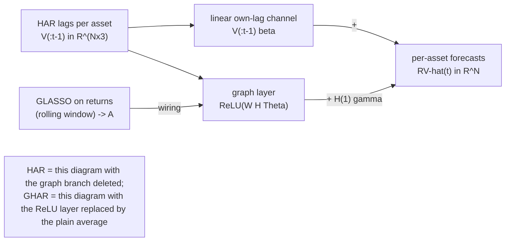

*GNNHAR's architecture (Zhang et al., 2023). Each asset's own HAR lags pass through an untouched linear channel; the same lags, aggregated over the GLASSO graph, pass through one small nonlinear graph layer; the forecast sums the two. The nesting (HAR in GHAR in GNNHAR1L in 2L) is what makes the results attributable ingredient by ingredient.*

### The Loss Function Is a Model Choice

Here is the paper's most transferable idea, and it has nothing to do with graphs. Every model, including plain HAR, is trained twice: once minimizing MSE and once minimizing $\operatorname{QLIKE}$,

$$
\mathcal{L}_{\operatorname{QLIKE}} \;=\; \frac{1}{N}\sum_{i=1}^{N} \frac{1}{\#\mathcal{T}}\sum_{t \in \mathcal{T}}
\left[ \frac{\operatorname{RV}_{i,t}}{\widehat{\operatorname{RV}}_{i,t}} \;-\; \log\!\frac{\operatorname{RV}_{i,t}}{\widehat{\operatorname{RV}}_{i,t}} \;-\; 1 \right]
$$

where (Zhang et al., 2023, eq. 12, p. 12) the sum runs over training days $\mathcal{T}$ and assets, and $\widehat{\operatorname{RV}}_{i,t}$ is the model's fitted value. This is the same $\operatorname{QLIKE}$ the guide uses for *evaluation*, now driving *estimation*: for neural models the gradient descends on it directly, and even "HAR trained by $\operatorname{QLIKE}$" is a distinct model from OLS-HAR (no closed form; fitted by Adam too).

> **Intuition: In Plain English**
>
> MSE punishes a forecast miss the same whether you over- or under-shot. $\operatorname{QLIKE}$ is asymmetric: under-predicting volatility, being caught short in a spike, hurts far more than over-predicting by the same distance. Training on $\operatorname{QLIKE}$ therefore teaches every coefficient to fear the crash days, which is precisely the fear the evaluation metric will later test for.

The effect is large and systematic: $\operatorname{QLIKE}$-trained twins beat MSE-trained twins on out-of-sample $\operatorname{QLIKE}$ almost everywhere (the sole reversal is the three-layer model at the monthly horizon), and even on *MSE*, uniformly at the daily horizon and for all but that same three-layer model at the weekly one; on turbulent days (top-decile market $\operatorname{RV}$) GNNHAR1L$_Q$ has roughly 13% lower MSE and 2% lower $\operatorname{QLIKE}$ than GNNHAR1L$_M$ (Zhang et al., 2023, Tables 1-2, pp. 15-17). Mechanically, MSE-trained HAR coefficients lurch when crises enter the estimation window, while $\operatorname{QLIKE}$-trained ones adapt earlier and more smoothly (Zhang et al., 2023, Fig. 6, p. 20).

> **Warning: "Always Train With QLIKE" Has a Scope**
>
> At the monthly horizon the advice inverts on the other metric: $\operatorname{QLIKE}$-trained models pay 44-53% *worse MSE* than their MSE twins (GNNHAR2L: 1.736 vs. 1.134; 3L: 1.502 vs. 1.046, Table 1), while mostly still winning on $\operatorname{QLIKE}$. The clean rule is alignment: train on the loss you will be judged by, at the horizon you will be judged at. For this project, judged on $\operatorname{QLIKE}$ at $h \in \{1,5,22\}$, $\operatorname{QLIKE}$ training is right; but quote the scope, not the slogan.

### The Result Grid

*Table: Out-of-sample loss ratios relative to OLS-HAR (HAR$_M = 1.000$; lower is better), 27 DJIA stocks, July 2011-June 2021. Subscript $M$/$Q$ marks the training loss. An asterisk ($^{*}$) marks the column's lowest ratio; a dagger ($^{\dagger}$) marks membership of the 5% Model Confidence Set. Source: Zhang et al. (2023, Table 1, p. 15).*

| Model | 1-day MSE | 1-day QLIKE | 1-week MSE | 1-week QLIKE | 1-month MSE | 1-month QLIKE |
|---|---|---|---|---|---|---|
| HAR$_M$ | 1.000 | 1.000 | 1.000 | 1.000 | 1.000 | 1.000 |
| GHAR$_M$ | 0.927 | 0.983 | 0.904 | 0.987 | 0.975$^{*}$ | 1.036 |
| GNNHAR1L$_M$ | 0.907 | 0.979 | 0.940 | 0.943 | 1.021 | 0.968 |
| GNNHAR2L$_M$ | 0.967 | 0.977 | 1.034 | 0.953 | 1.134 | 1.032 |
| GNNHAR3L$_M$ | 1.210 | 0.982 | 1.014 | 0.961 | 1.046 | 0.958 |
| HAR$_Q$ | 0.927 | 0.981 | 0.939 | 0.945 | 1.069 | 0.986 |
| GHAR$_Q$ | 0.886 | 0.983 | 0.842$^{*}$ | 0.936 | 1.151 | 0.954$^{\dagger}$ |
| GNNHAR1L$_Q$ | 0.867$^{*}$ | 0.961$^{\dagger}$ | 0.855 | 0.913$^{*}$ | 1.179 | 0.965 |
| GNNHAR2L$_Q$ | 0.879 | 0.959$^{*}$ | 0.873 | 0.920 | 1.736 | 0.947$^{*}$ |
| GNNHAR3L$_Q$ | 0.894 | 0.963 | 1.185 | 0.942 | 1.502 | 0.971 |

The table above repays slow reading; five findings do the work of the whole lineage.

> **Key Result: What the Canonical Grid Says**
>
> 1. **The graph helps at short horizons.** GHAR$_M$ vs. HAR$_M$: 7.3% MSE and 1.7% QLIKE at 1 day, before any neural network; a linear neighborhood average earns roughly half the total gain.
> 2. **Nonlinearity adds a real but smaller slice.** GNNHAR1L$_Q$ reaches 0.867 MSE / 0.961 QLIKE at 1 day and the lineage's best weekly QLIKE, 0.913.
> 3. **Training loss moves the needle as much as architecture.** Read down any column: the $_Q$ block dominates the $_M$ block almost everywhere; even HAR$_Q$ beats HAR$_M$ by 7.3% MSE at 1 day.
> 4. **Depth hurts.** GNNHAR3L$_M$ is 21% *worse* than plain HAR on daily MSE; the monthly MSE column is a graveyard (up to 1.736).
> 5. **Gains die at the monthly horizon.** Every *neural* graph model's monthly MSE ratio sits above 1 (linear GHAR$_M$, at 0.975, is the one exception, and its monthly QLIKE is unfavorable at 1.036); only the QLIKE-trained models' QLIKE ratios stay slightly favorable. Spillover information diffuses into prices within days, a finding the covariance paper repeats.

Two follow-up analyses turn findings 4 and 5 into mechanisms. On *depth*: a Diebold-Mariano test of GNNHAR2L against 1L rejects equality for exactly one stock in 27 (AXP), with cross-sectional $p$-values around 0.40-0.75, so two-hop information is statistically indistinguishable from noise once own and one-hop channels are in (Zhang et al., 2023, Fig. 7, pp. 22-23); a linear two-hop GHAR variant agrees, its second-hop coefficients decaying to about an eighth of the first-hop ones (Zhang et al., 2023, App. C, pp. 35-37). And the three-layer failure is the Over-Smoothing section made empirical: the authors compute the mean average cosine distance (MAD) between connected nodes' final-layer embeddings and find it falls monotonically with depth, with the 3-layer embeddings "too similar to provide any node specific predictive information" (Zhang et al., 2023, Fig. 8, p. 24). The DJIA GLASSO graph has diameter 3 (their S&P 100 graph, diameter 5), so by three hops the receptive field is the whole graph and smoothing is all that is left (Zhang et al., 2023, Table A.2, p. 34).

> **Warning: What This Evidence Does *Not* Say**
>
> The comparison set is HAR, GHAR, and GNNHAR variants only: no HARQ or SHAR, no LSTM, no gradient-boosted trees, so "beats HAR by 13% MSE" is not "beats the best non-graph model." There is no economic-value test. The universe is 27 surviving mega-caps, one asset class. And the turbulent/calm diagnostic split uses a full-sample quantile, fine as a diagnostic, but not a real-time regime signal. The result is a careful, narrow win, which is exactly why it is credible.

### The Covariance Extension: Graphs Where They Pay Most

The same authors' *Journal of Financial Econometrics* paper applies the GHAR idea to full realized covariance matrices (Zhang et al., 2024), and the repo's standing verdict comes from it: graphs currently earn their clearest, MCS-backed keep on the *covariance* problem. The model rides on the HAR-DRD decomposition from [Chapter 14](ch14-multivariate-volatility.md) ($\mathbf{H}_t = \mathbf{D}_t \mathbf{R}_t \mathbf{D}_t$, volatilities and correlations forecast separately): the volatility equations get the GHAR graph term of the GHAR equation, and the correlation equations get a graph of their own, built by a trick worth knowing. Correlations are *pairs*, so the paper forms the **line graph**: every correlation pair becomes a node, and two pairs are connected exactly when they share an asset (Zhang et al., 2024, Def. 3.3, pp. 8-9). The pair (JPM, GS) neighbors every other pair containing JPM or GS; news about one bank relationship propagates to all relationships that bank participates in.

The headline: GHAR with a GLASSO volatility graph and a line correlation graph beats HAR-DRD by 2.5% (Euclidean), 2.5% (Frobenius), and 1.8% (multivariate QLIKE) at one day, ranks first under the Euclidean and QLIKE losses with MCS $p = 1.000$ (a rounding-margin second under Frobenius, $p = 0.768$), and stays in the MCS best set under all three while HAR-DRD itself is ejected ($p \le 0.003$) (Zhang et al., 2024, Table 4, p. 15). The gain survives a HARQ-style measurement-error correction (GHARQ, ratios $\approx 0.983$ against an HARQ-DRD baseline), so it is not an artifact of attenuation (Zhang et al., 2024, Table 8, p. 24), and it converts into economics: global-minimum-variance portfolios built from the graph forecasts have the lowest out-of-sample variance in the comparison (9.799 vs. 9.918 annualized for HAR-DRD) (Zhang et al., 2024, Table 5, p. 20).

Two fine-print items sharpen the picture. Under QLIKE, the gain comes from the *correlation line graph*, not the volatility graph: variants with only a volatility graph land at QLIKE ratio 1.001, no better than the baseline (Zhang et al., 2024, Table 4). And at the one-month horizon the flagship's QLIKE slips to 1.001, the paper's own honestly-reported single loss (Zhang et al., 2024, Table 6, pp. 20-21): the short-horizon-only nature of graph information, again.

> **Project Connection**
>
> Strategic fork for the project, flagged since the 2026-05-31 research sweep: if the deliverable stays univariate SPX $\operatorname{RV}$, graphs offer the modest, single-digit QLIKE gains of the result grid above; if the problem is ever recast as covariance forecasting (portfolio risk), graphs have MCS-grade evidence and a ready GMVP test. Either way, the public GNNHAR codebase (`github.com/chaozhang-ox/GNNHAR`, with QLIKE training and MCS evaluation built in; the covariance code at `chaozhang-ox/Graph-based-HAR`) is the harness to port rather than rebuild.

## Graph Construction: The Contested Design Choice

Here is the uncomfortable secret of the field: the architecture debates of the Building a GNN and Attention on Graphs sections are largely settled for volatility (one hop, shallow, small), while the question that actually moves results, *where does the adjacency matrix come from?*, is genuinely contested. Different papers, on different universes, reach opposite conclusions with straight faces. This section lays out the menu, then the contradiction, then the one discipline everyone should agree on.

### The Menu

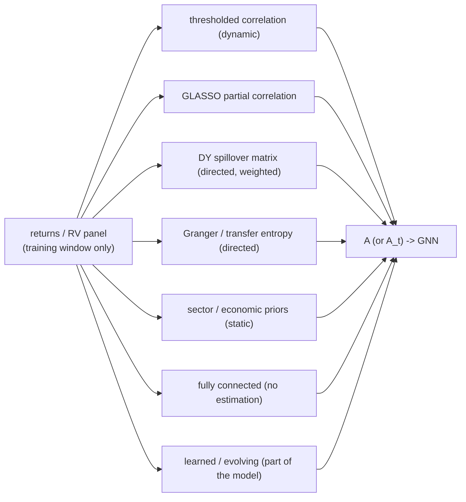

*Seven routes from data to adjacency. The routes differ in directedness, sparsity, stability, and how much estimation error they inject; every route except "fully connected" and "sector" is an estimation step with its own error, instability, and look-ahead rules. The literature disagrees about which is best, and the disagreement is informative (the Contradiction subsection below).*

- **Thresholded correlation.** Edge iff $|\rho_{ij}| \ge \theta$ over a rolling window; cheap, dynamic, undirected. Its failure mode is instructive: at a fixed threshold the graph's density is violently regime-dependent. In the 465-stock study of Wade (2026), $|\rho| \ge 0.3$ gives density 0.092 in a calm 2018 week and **0.933** in the COVID week of March 2020, mean degree 433 of a possible 464 (Wade, 2026, Table 2, p. 4): in a crisis the "graph" becomes the market average, and aggregation compresses the cross-section exactly when differentiation matters most.
- **GLASSO partial correlation.** The GLASSO subsection above. Sparse, undirected, conditional-independence semantics; the GNNHAR lineage's choice.
- **Diebold-Yilmaz spillover matrix.** Recycle [Chapter 15](ch15-spillovers-connectedness.md): the GFEVD share $d_{j \leftarrow i}(h)$ is a directed, weighted edge from $i$ to $j$. Boetti and Nunes (2026) operationalize it cleanly: build the connectedness table at horizon $h = 22$, drop edges below 0.05, re-estimate every rolling window. Their linear GNHAR on this graph is the best model in their comparison, and weighted DY graphs beat binary Granger graphs at long horizons (Boetti and Nunes, 2026, Tables 2-3, pp. 14-15). DCRNN-HAR (the frontiers section below) uses the same object made day-by-day dynamic.
- **Granger causality / transfer entropy.** Directed edges from pairwise predictability tests (with multiple-testing correction) or from information-theoretic transfer entropy (the H-ETE-GNN of the Hybrids section). Honest but noisy: at the 5% level over all ordered pairs, Granger graphs come out so dense they approach fully connected (Boetti and Nunes, 2026, Fig. 1, p. 11), and a Granger graph estimated once and frozen *underperformed HAR* in Wade (2026).
- **Sector and economic priors.** GICS membership, supply chains, listed competitors. Free, static, interpretable; in the covariance study the sector graph lost to GLASSO (Zhang et al., 2024, Table 4), and in Wade (2026) the static sector graph beat HAR only after macro features were added.
- **Fully connected.** No estimation at all; with uniform weights the neighborhood aggregate collapses to the cross-sectional average of everyone else, a "market factor" regressor. Deliberately dumb, surprisingly strong (next subsection).
- **Learned and evolving.** Let the model treat $\mathbf{A}$ as parameters: MTGNN learns one static adjacency end to end; EMGNN (Zhou et al., 2025) learns an evolving *sequence* of them (the EMGNN section below).
- **Factor-residual (idiosyncratic) networks.** The 2026 frontier idea from Cartea et al. (2026): strip the common factor first (factor regressions on returns), estimate sparse dependency networks on the *residuals*, and let jump measures spill over that idiosyncratic graph. Per the abstract, this cuts one-day-ahead MSE by around 30% versus HAR on S&P 100 names, "while jump models on raw or market-based networks deliver little benefit." The full text sits behind a paywall, so treat the number as unverified and adopt only the design idea: *edges should encode relationships the market factor cannot explain*, which is also GLASSO's logic taken one step further.

### The Contradiction

Now the fight. Three credible studies, three winners:

- **GLASSO beats no-graph** on 27 DJIA stocks: GHAR(GLASSO) at 0.927 MSE / 0.983 QLIKE vs. HAR (the result grid above), and GLASSO was the best of the graph types tried in the covariance companion (Zhang et al., 2023, 2024).
- **Fully connected beats GLASSO** on 10 international indices: in the GNAR-HARX study the top of the pooled-QLIKE ranking is occupied entirely by fully-connected configurations, and each GLASSO configuration ranks below its like-for-like FC counterpart (best FC $-8.5891$ vs. best GL $-8.5867$, with HARX+IV at $-8.5831$ and plain HAR at $-8.5785$); GL sits 1.02-1.03 on relative MSE (Ó Nualláin, 2025, Table 4, p. 22). The diagnosis is estimation instability: GLASSO edge counts lurch after 2016 and the Jaccard similarity of consecutive monthly graphs (the fraction of edges the two graphs share) dips below 0.8, so the model keeps being handed a different network (Ó Nualláin, 2025, Section 5.5, pp. 28-31). Two honesty flags: this is an MSc thesis with *no* DM or MCS testing, and its QLIKE gaps sit in the third decimal.
- **Learned-evolving beats learned-static** on Bitcoin futures RV: EMGNN's relative MSFE 0.6527 vs. MTGNN's 0.7809 against an AR benchmark, and EMGNN is the only model with MCS $p = 1.000$ across settings (Zhou et al., 2025, Table 5, p. 23), with a significance caveat unpacked in the EMGNN section below.

Can these coexist? Plausibly, yes. Sparsification pays when the universe is large and heterogeneous enough that conditional-independence structure is real and estimable (27-100 single names); it costs when the universe is 10 highly integrated aggregate indices whose true network is close to complete, so GLASSO's estimation error buys nothing, and a fully-connected average, which at $N = 10$ with uniform weights is just the cross-sectional mean, is unbeatable for robustness. Learned adjacency sits at the far end of the flexibility spectrum and shines where relationships genuinely rewire (crypto). But this reconciliation is a hypothesis, not a finding. No published study runs the ablation on a mid-sized cross-*asset-class* universe like ours.

> **Key Idea: The Cheapest High-Value Experiment in This Chapter**
>
> Because GHAR is linear and OLS-estimable, the contested question costs almost nothing to answer on our own data: run GHAR with identity (no graph), fully-connected, GLASSO, and rolling-DY adjacency on the 34-symbol universe, at $h \in \{1, 5, 22\}$, under $\operatorname{QLIKE}$ with DM tests against rolling HAR and an MCS over the four graphs. One afternoon of compute resolves, for our universe, what the literature cannot resolve in general. This is Step 1 of the blueprint in the Project Blueprint section.

### Leakage Rules for Graphs

Every estimated graph is a fitted object, so it inherits the look-ahead rules of any feature. The clean template is GNNHAR's: estimate the graph on the rolling training window, freeze it, forecast the next month, slide, re-estimate (Zhang et al., 2023, p. 14). The figure below draws the timeline.

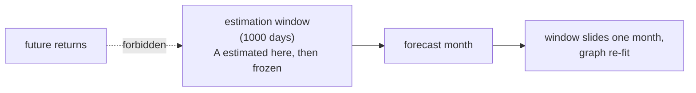

*Point-in-time graph estimation. The graph $\mathbf{A}$ is estimated on the estimation window then frozen for the forecast month; at the next re-estimation the window slides one month and the graph is re-fit. Estimating a single graph on the full sample quietly hands the model future correlation structure (a forbidden path from future returns into today's graph).*

How bad is it if you slip? Usefully, someone measured. The one-switch leakage benchmark of Zhang et al. (2026) toggles individual evaluation conventions while holding everything else fixed, and finds leakage is *selective*. Centered temporal features and same-day-open execution produce enormous, stable inflation (Sharpe increases of roughly 4 to 26 for the trainable models), while **future-informed graph structure is a weak leak in most settings**, moving Sharpe by only about $-0.2$ to $+0.4$ across model-market cells and averaging near $+0.1$ (Zhang et al., 2026, Table 1, p. 6). The reading for us: keep graphs point-in-time (the cost of doing so is trivial), but spend your paranoia budget where the benchmark says the money is, on temporal feature construction and execution timing. A subtler grade of sin appears even in good papers: the covariance paper tunes GLASSO's $\lambda$ by standard five-fold cross-validation *inside* the training window (Zhang et al., 2024, p. 8), unordered folds on time-series data. That is harmless for the graph's support in practice, but not the purged protocol this book recommends for anything closer to the forecast target.

> **Project Connection**
>
> Our universe adds a leak the equity-panel papers never face: 34 symbols across asset classes close at different times, so a "daily" correlation or DY graph built on naively aligned closes can encode same-day information flow that was not observable at any single decision time. Estimate graphs on synchronized (refresh-time or lagged) data, cross-reference the asynchronicity treatment in [Chapter 14](ch14-multivariate-volatility.md), and when in doubt, lag the foreign legs by one day. This costs a little signal and buys causal defensibility.

## Dynamic, Spectral, and Intraday Frontiers

Beyond the GNNHAR lineage, the 2022-2026 literature has pushed in four directions: adjacency that changes daily, graphs entering through their spectrum instead of message passing, attention at intraday frequency, and graph transformers at full index scale. The architecture ideas are genuinely useful. The evidence discipline mostly is not: as you read, keep one question running, *would this survive $\operatorname{QLIKE}$ with a Diebold-Mariano test?*, because with one partial exception none of these papers asks it. The section-closing audit table keeps score.

### DCRNN-HAR: Dynamic Spillover Graphs

Chi et al. (2026) make the Diebold-Yilmaz bridge fully dynamic. For every 22-day look-back window they re-estimate the DY variance-decomposition table, row-standardize it, and transpose it into a directed, weighted adjacency, so $A_{ij}$ measures the spillover transmitted from market $i$ to $j$, refreshed daily as the window slides. A second, cheaper device handles the fact that their 8 global equity indices trade on different calendars: a per-day **graph mask** zeroes the outgoing edges of any market closed that day ($\tilde{\mathbf{A}}_t = \mathbf{E}^{A_t} \odot \mathbf{A}$), so closed markets can receive state updates but cannot transmit, and a masked loss keeps inactive days out of the gradient (Chi et al., 2026, Sections 3.2-3.3). The forecasting body is a DCRNN: a GRU whose matrix multiplications are replaced by **diffusion convolutions** over the directed graph, $\sum_{k=0}^{K-1} \zeta_k (\mathbf{D}^{-1}\mathbf{A})^k \mathbf{X}$. Read this against the $\mathbf{A}\mathbf{X}$ equation: each power $(\mathbf{D}^{-1}\mathbf{A})^k$ spreads every asset's information $k$ hops along the directed spillover edges, like a rumor passed on $k$ times, and the learned weights $\zeta_k$ decide how much each distance matters. And, in the paper's best design decision, a plain HAR regression rides along as a jointly-trained *skip connection*, its forecast added to the network output at every step (Chi et al., 2026, eq. 25).

The results sweep: lowest MSE and MAE in every market at every horizon, and membership of the 75% Model Confidence Set in 48 of 48 cells, against 17 for the best baseline (a static-GLASSO GNN-HAR). For SPX at $h=1$, MSE falls from 0.144 (HAR) and 0.136 (GNN-HAR) to 0.125; at $h=22$, from 0.428 to 0.195 (Chi et al., 2026, Tables 2-8). Now the discount rate: no $\operatorname{QLIKE}$, no DM tests, a permissive 75% MCS, a single fixed 70/30 split with no retraining across a test window that contains COVID, and, most frustratingly, *no ablation*: the dynamic graph, the union calendar, the HAR skip, and the architecture all change together, so we cannot say which ingredient earns the win over the static-graph baseline that shares its backbone.

### GSP-HAR: The Spectral Route

The same authors' GSP-HAR (Chi et al., 2024) takes the road not taken in the GCN subsection: instead of truncating spectral convolutions into local message passing, keep the spectrum. The obstacle is that spillover graphs are *directed*, and spectral analysis needs a symmetric (here, Hermitian) operator. The fix is elegant:

For a directed weighted graph, we want a Laplacian that keeps the direction information but still has an orthonormal eigenbasis and real, non-negative frequencies:

$$
\mathbf{L}^{(q)}_{m} \;=\; \mathbf{I} \;-\; \Bigl( (\mathbf{D}^{s})^{-\frac{1}{2}}\, \mathbf{W}^{s}\, (\mathbf{D}^{s})^{-\frac{1}{2}} \Bigr) \odot \exp\!\bigl( \mathrm{i}\, 2\pi q\, (\mathbf{W} - \mathbf{W}^{\top}) \bigr)
$$

where (Chi et al., 2024, eqs. 6-9, pp. 11-12):

- $\mathbf{W}$: the directed DY spillover weight matrix; $\mathbf{W}^{s} = \tfrac{1}{2}(\mathbf{W} + \mathbf{W}^{\top})$ its symmetric part, with degree matrix $\mathbf{D}^{s}$.
- The magnitude of each entry comes from the symmetrized graph; the *direction* is stored as a complex phase via the element-wise $\exp(\mathrm{i}\,\cdot)$, with $q \ge 0$ a tuning knob ($q = 0$ throws the direction away).
- This **magnetic Laplacian** is Hermitian and positive semi-definite (the complex-matrix analogues of "symmetric" and "never negative"), which is exactly what guarantees it decomposes into a well-behaved frequency basis with real, non-negative eigenvalues: graph frequencies for a directed graph. You do not need to compute any of this; the takeaway is that the construction lets direction-aware graphs use the same frequency-analysis machinery as undirected ones.

> **Intuition: In Plain English**
>
> You cannot diagonalize an asymmetric matrix into a clean frequency basis, so the magnetic Laplacian splits the job: how *strongly* two markets are coupled goes into the magnitude, and *who leads whom* goes into a complex phase, like encoding wind speed and wind direction as one complex number. The result behaves like an ordinary Laplacian for all the spectral machinery while quietly remembering the arrows.

GSP-HAR then graph-Fourier-transforms the cross-section of HAR features, fits HAR-style linear filters on the real and imaginary spectral parts, transforms back, and merges with a small network. Two exports matter beyond the model. First, the paper's **graph signal energy** diagnostic, $E(\mathbf{x}) = \mathbf{x}^\top \mathbf{L}\, \mathbf{x}$, measures how *rough* the RV cross-section is over a candidate graph: the quadratic form sums the squared RV differences across every edge, so if connected assets have similar volatility, $E$ is small (smooth), and if neighbors disagree violently, $E$ is large (rough). An informative spillover network should show energy spiking in crises and quiet in calm markets, and the DY-magnetic construction passes this test where Pearson-correlation graphs fail (Chi et al., 2024, Figs. 1-2, Section 3.1). Diagnose the graph before you model on it: this costs one matrix multiplication. Second, calibration: for SPX at $h=1$ the MSE gain over plain HAR is 0.113 to 0.110, under 3%, with MCS at a lenient 25% level, no $\operatorname{QLIKE}$, no DM, reimplemented baselines, and a graph-estimation window the paper never pins down (Chi et al., 2024, Tables 1-3, pp. 18-19).

### EMGNN: Learned, Evolving Adjacency

The evolving multiscale GNN applied by Zhou et al. (2025) to Bitcoin futures RV abandons pre-specified graphs entirely: the adjacency is a *state*, updated recursively from the previous adjacency and current node features ($\mathbf{A}^{(m,t)} = \mathcal{H}_s(\mathbf{A}^{(m,t-1)}, \psi^{(m,t)})$, with $\mathcal{H}_s$ a learned update network and $\psi^{(m,t)}$ the current node representations) and held piecewise-constant over short intervals. In plain terms: the graph itself has memory, yesterday's wiring nudged by what just happened in the market. The distinctive touch: the graph is learned *separately at five time scales* (intervals of 31, 21, 14, 5, and 1 days), so the slow dependence structure and the fast one need not agree (Zhou et al., 2025, eqs. 10-14, pp. 17-18, 20). The node set will look familiar: seven futures RVs (Bitcoin, S&P 500, dollar, T-bonds, gold, oil, gas) plus four uncertainty indices (EPU, GPR, VIX, OVX), a miniature of our own cross-asset universe. Against nine baselines, EMGNN posts relative MSFE 0.6527 versus the static-learned MTGNN's 0.7809 and is the only model with MCS $p = 1.000$ under both losses (Zhou et al., 2025, Table 5, p. 23). Three discounts: the pairwise DM test against MTGNN is *insignificant* at $h=1$ (DM $= 1.0076$) on a $\sim$200-observation test set, so "sole MCS survivor" should not be read as "proven better than the runner-up"; the setting is crypto with a single chronological split and unpurged cross-validation; and the paper's "QLIKE" robustness metric squares the whole Gaussian quasi-likelihood term, a nonstandard definition whose numbers cannot be compared with anything else in this book. Check loss formulas before comparing papers; it is not pedantry.

### SpotV2Net: Attention Intraday, and Features as the Model

SpotV2Net (Brini and Toscano, 2024) is the GAT of the Attention on Graphs section deployed at 30-minute frequency on the 30 DJIA names, and its real lesson is that *the graph topology can be trivial when the features are rich*. The graph is fully connected and static. Everything interesting sits on the attributes: node features are Fourier-estimator spot volatilities plus co-volatilities with every other stock (42 lags), and **edge features** are the two endpoints' *volatilities-of-volatility* and their co-vol-of-vol, second-order quantities that inform the attention scores through the edge-feature extension of GAT. On the fixed test split it beats panel ARFIMA, XGBoost, and an LSTM on MSE (4.885e-08 vs. 5.487e-08 for ARFIMA, an 11% gap), but its QLIKE is within rounding of the baselines (0.999 vs. 1.000) and nothing is significance-tested; notably, there is *no HAR baseline at all*, and no ablation isolating whether the headline vol-of-vol edge features actually earn their name (Brini and Toscano, 2024, Table 2, p. 16). One finding deserves retelling: interpreting the trained model with GNNExplainer, the three most influential nodes are AMGN, CRM, and HON, precisely the three stocks that *joined the DJIA* near the start of the training sample (Brini and Toscano, 2024, Section 7.3). GNN interpretability output reflects the training period's idiosyncrasies, index recomposition and pandemic sector dynamics here, not timeless economic structure.

### GTN-VF: The Graph Transformer at Index Scale

Finally, the paper [Chapter 12b](ch12b-deep-learning-vol.md) previewed. Chen and Robert (2022) forecast 10-30-minute realized volatility for 494 S&P 500 stocks with a graph transformer (the UniMP operator: essentially the GAT of the Attention on Graphs section with scaled dot-product attention scores plus a linear self-term that lets each node weigh its own previous state directly). Its construction generalizes everything in this chapter: each *(stock, timestamp)* pair is a node, so the graph spans the panel in both dimensions, and edges come from four relation sources at once, top-$K$ feature-similarity edges across time ("days that looked like today"), across stocks, shared GICS industry, and Factset supplier-customer links. Two findings transfer directly. First, **relational information, not deep-learning machinery, earns the win**: the relation-free "Vanilla" variant of the same architecture *loses to HAR* at the two longer horizons (test RMSPE 0.2251 vs. HAR's 0.2061 at 20 minutes; 0.2160 vs. 0.1939 at 30), and only the graph-equipped variants pull ahead (Chen and Robert, 2022, Table 4, p. 9). Second, **edge quality beats edge quantity**: 8.4M carefully-selected top-2 similarity edges contribute a 1.2% RMSPE gain while 47.9M dense same-sector edges contribute 0.7% (Chen and Robert, 2022, Section 5.4, Table 3). The caveats are by now a familiar chorus: RMSPE is both training loss and sole metric, no $\operatorname{QLIKE}$/DM/MCS, a single split whose validation year is 2020, and the similarity-edge construction is never explicitly restricted to the training window, so graph look-ahead cannot be ruled out from the text.

### The Audit Table and the Horizon Conflict

> **Key Result: Does It Survive QLIKE? The Frontier, Audited**
>
> | Model | Universe | Losses used | DM? | MCS? | QLIKE verdict |
> |---|---|---|---|---|---|
> | GNNHAR$_Q$ | 27 DJIA stocks | MSE, QLIKE | yes | 5% | $-4\%$ at $h{=}1$, real |
> | GHAR (cov.) | 27 DJIA stocks | $\mathcal{L}^E$, $\mathcal{L}^F$, QLIKE | no | yes | $-1.8\%$, MCS-backed |
> | DCRNN-HAR | 8 global indices | MSE, MAE | no | 75% | unknown |
> | GSP-HAR | 24 global indices | MSE, MAE | no | 25% | unknown |
> | EMGNN | BTC + cross-asset | MSFE, MAFE | yes$^{a}$ | 90% | nonstandard defn. |
> | SpotV2Net | 30 DJIA, intraday | MSE, QLIKE$^{b}$ | no | no | within rounding |
> | GTN-VF | 494 S&P stocks | RMSPE | no | no | unknown |
> | GNHAR | 10 indices | MAFE, MSFE (log) | yes | 20% | unknown |
>
> $^{a}$ DM vs. runner-up insignificant at $h=1$. $^{b}$ Reported but untested; gap within rounding.
>
> The pattern: the further a paper's headline gain is from the GNNHAR lineage's careful single digits, the thinner its evaluation. Default prior for any new graph-vol paper: halve the headline, then ask for the DM test.

The audit also surfaces an open conflict worth watching. GNNHAR's gains *fade* with horizon (gone by $h=22$, the result grid above); DCRNN-HAR's MSE gains *grow* with horizon ($-13\%$ at $h=1$ to $-54\%$ at $h=22$ for SPX); and the linear GNHAR's long-horizon MAFE gains are its largest (Boetti and Nunes, 2026). Different universes (single names versus country indices), different targets, different metric discipline; no clean adjudication exists. The cheapest arbiter is to regenerate the open-source DCRNN-HAR and GSP-HAR forecasts and re-score them under Patton-robust $\operatorname{QLIKE}$ with DM tests, which is precisely the kind of afternoon experiment the project can run (the Project Blueprint section).

## Hybrids and the Regime Frontier

Nothing in this book suggests a GNN should *replace* the models that already work: rolling HAR, gradient-boosted trees ([Chapter 11](ch11-tree-methods-vol.md)), the ensembles of [Chapter 13](ch13-hybrid-ensemble.md). The practical question is how to *wire* a graph component into that stack, and, one level up, whether market regimes should condition the graph. On the first question the literature offers three wirings with sharply different evidence; on the second it offers, so far, a cautionary museum.

### Three Wirings

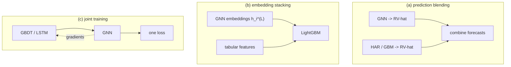

*Three ways to couple a GNN with the models the project already trusts. Blending combines finished forecasts; stacking feeds the GNN's learned node embeddings to a tree model as features; joint training lets gradients flow between the stages (in BGNN's case, by fitting new trees to the GNN's gradient signal, the dashed arrow).*

**(a) Prediction blending** treats the GNN as one more forecaster whose output joins an ensemble, exactly the machinery of the ensemble section of [Chapter 13](ch13-hybrid-ensemble.md). It needs no new theory, adds one column to the combiner, and every leakage property is inherited from components you already control. Keep this as the default; the burden of proof lies on anything fancier.

**(b) Embedding stacking** extracts the GNN's final-layer node embeddings and hands them to a gradient-boosted tree as extra features. It sounds strictly stronger than blending (the trees see the GNN's internal representation, not just its scalar opinion), but the published finance evidence is a negative exemplar. Choi and Kim (2024) build information-theoretic graphs over nine sector ETFs (normalized mutual information and transfer-entropy edges, permutation-tested), extract centralities plus 1024-dimensional node embeddings compressed to 32 dimensions (via Role2vec, FEATHER, and UMAP, off-the-shelf techniques for turning graph structure into feature vectors; the details do not matter for the argument), and feed XGBoost/LightGBM/CatBoost. Accuracy on direction-of-return classification moves from roughly 0.52 to 0.55 (e.g., XLE 0.5238 to 0.5651), with enormous $t$-statistics, but the $t$-tests are over 100 random seeds of the same split (simulation noise, not forecast superiority), Cohen's kappa barely exceeds 0.12, and, decisively for us, *the paper never states that the networks, embeddings, or UMAP were fitted on training data only* (Choi and Kim, 2024, Table 8; Sections 3-4). Every step of a graph-feature pipeline is a model-fitting step; silence about its estimation window is a defect, not a detail. Note also what this paper is not: there is no message passing, no learned graph model, just hand-extracted graph features, the cheap first road from graphs to forecasts.

**(c) Joint training** is where the strongest non-finance evidence lives. The obstacle is that gradient-boosted trees are not differentiable, so you cannot simply backpropagate a GNN's loss into them. BGNN (Ivanov and Prokhorenkova, 2021) dissolves the obstacle with one idea worth memorizing:

We want the tree ensemble to improve in the direction the GNN's loss says its *inputs* should move. After each epoch's GNN update, the change in the GNN's input features (for one gradient step) is exactly the negative feature-gradient, and new trees are fitted to *that* as a regression target:

$$
\mathbf{X}'_{\text{new}} \;=\; \mathbf{X}' \;-\; \eta\, \frac{\partial\, \mathcal{L}_{\text{GNN}}\bigl(g_\theta(G, \mathbf{X}'),\, Y\bigr)}{\partial\, \mathbf{X}'},
\qquad
\text{next trees fit } \mathbf{X}'_{\text{new}} - \mathbf{X}'.
$$

where (Ivanov and Prokhorenkova, 2021, Alg. 1, Section 3, pp. 3-4):

- $\mathbf{X}' = f(\mathbf{X})$: the current GBDT ensemble's outputs, used as the GNN's input node features; $g_\theta$: the GNN; $\eta$: a learning rate.
- The GNN optimizes both its parameters $\theta$ *and* its inputs $\mathbf{X}'$; the induced input change becomes the boosting target, so the error signal from the graph reaches the trees without differentiating a single tree.
- Interpretations: the GBDT is a learned embedding layer for the GNN, or the GNN is a topology-aware loss function for the GBDT.

> **Intuition: In Plain English**
>
> The trees cannot hear the GNN's gradient directly, so the GNN writes it down as homework: "here is how I wish your outputs had been different." Each round, fresh trees are grown to produce exactly that wished-for adjustment. Boosting already works by fitting residuals; BGNN merely redefines the residual as "what the graph model wants," which is why the trick costs nothing structurally.

The payoff: on four node-regression datasets with heterogeneous tabular features, end-to-end BGNN cuts RMSE by 8, 14, 4, and 4% versus the strongest GNN baseline (GAT), and consistently beats the two-stage variant (Res-GNN, a pretrained GBDT feeding a GNN) (Ivanov and Prokhorenkova, 2021, Table 2, p. 6). How the stages are coupled matters as much as which stages you pick. Three sharp caveats travel with the result: it is entirely non-financial (census blocks, elections, social networks), it evaporates when node features are homogeneous (on bag-of-words and embedding features the GBDT stage *hurts*), and its evaluation is RMSE on random node splits, a protocol that would be leakage in any time-series panel. A vol panel of raw $\operatorname{RV}$ lags is fairly homogeneous; BGNN's edge would need the project's genuinely mixed feature set (IV, quarticity, calendar, asset-class dummies) to plausibly appear.

A fourth wiring, really the simplest form of (c), is **parallel fusion**: run an LSTM on the target's own history and a GCN on the cross-asset graph, concatenate the two embeddings, and regress through dense layers, trained jointly (Sonani et al., 2025). On 10 large-cap US stocks it trims MSE 10.6% versus a standalone LSTM (0.00144 vs. 0.00161), but the target is next-day *price*, the test window is 50 days, there is no significance testing and no HAR or even random-walk baseline, the paper's own per-stock heatmap contradicts its "improves all stocks" claim, and the correlation graph's estimation window is never stated (Sonani et al., 2025, Sections 4.5-4.6, Figs. 4-6). Keep the wiring diagram; discount the evidence to near zero.

> **Project Connection: The Standing Verdict**
>
> No finance paper demonstrates embedding stacking or joint training beating simple prediction blending for volatility under honest evaluation; Choi-Kim brackets the stacking road from below and BGNN brackets joint training from outside finance. The project's standing verdict (unchanged since the 2026-05 research sweeps) is therefore: *blend forecasts by default; test stacking as an experiment, not a plan* (arm A vs. arm B in the Project Blueprint section); attempt joint training only if stacking shows signs of life and the feature set is heterogeneous.

### The Regime Frontier: An Honest Museum

[Chapter 13](ch13-hybrid-ensemble.md) taught regime identification; the graph networks block subsection showed the global attribute $\mathbf{u}$ as the natural port for regime information. So it is striking that the published intersection of regime detection and graph learning, as of mid-2026, consists of exactly two exhibits, and neither survives inspection.

**Exhibit one: the label without the mechanism.** Kumar et al. (2024) run a GCN-plus-GAT stack ("Temporal GAT") over 8 global indices with Diebold-Yilmaz spillover adjacency, and its one solid finding is useful: the directed spillover graph beats the symmetric correlation graph on nearly every index (Kumar et al., 2024, Table 2, p. 15). But the graphs are estimated *once per train/validation/test split* and frozen, so the "dynamic" machinery is three static graphs, with no detector, no gating, and, worse, the test-period graph is estimated from the whole test window, a plain look-ahead. There is no HAR or standalone GARCH baseline, no $\operatorname{QLIKE}$, no significance test, and the volatility target is built from daily closes despite the paper defining intraday RV (Kumar et al., 2024, pp. 10-13). (A later journal version of this paper exists under a "regime-dependent" title; we could not verify its numbers and cite only the preprint on disk.) The lesson is the reading skill: when a title says dynamic or regime-dependent, ask *what updates, when, using which data*.

**Exhibit two: the honest failure.** H-ETE-GNN (Lee and Cho, 2025) is causally clean and still instructive in defeat. Edges come from **effective transfer entropy**: raw transfer entropy minus its mean over shuffled surrogates, keeping only edges with $Z > 1.96$, a clean recipe for sparse, directed, nonlinearity-aware graphs (their Eqs. 4-5). The regime layer monitors a 250-day rolling **Hurst exponent** of world-equity returns, a statistic measuring whether a series is trending (above 0.5: moves tend to continue) or mean-reverting (below 0.5: moves tend to reverse); when it crosses 0.5 persistently, the model declares a regime change, rebuilds the graph, and fine-tunes the GNN. Over 19 calm-tilted years this beats fixed-schedule retraining on average, but in the two crises the trigger barely fires (two regime changes across 2007-08, one across 2021-23, of 47 total), the stale graph stays in place, and the Hurst-triggered model loses to *naive periodic retraining* by 32% RMSE in 2008 (0.5287 vs. 0.4000) and 40% in 2020 (0.3291 vs. 0.2356) (Lee and Cho, 2025, Table 10, p. 22; Section 3.1, p. 18). Add the familiar deflators, a smooth 20-day rolling-std target (not intraday RV), no HAR or persistence baseline, seed-level $t$-tests instead of DM, and the exhibit is complete: an event-triggered graph adaptation is only as good as its trigger's hit rate *in turbulence*, and this trigger is quietest exactly then.

> **Key Idea: What the Empty Frontier Means for the Project**
>
> Regime-conditioning the *graph* is the least-supported component in this entire chapter: one impostor, one honest failure, no credible incumbent. Meanwhile the best-evidenced way to inject regime information into a vol forecaster is far cheaper: a filtered (real-time) regime probability from a Markov-switching model added as a *feature*, which improved HARQ's $\operatorname{QLIKE}$ by about 5% on CSI 300 intraday RV with DM significance in the cleanest 2026 exemplar (Fang and Ślepaczuk, 2026, Tables 2-4). The evidence-ranked order is: regime probability as a HAR feature first, regime-gated ensembles second, regime-conditioned graphs a distant third. Inverting that order is how projects burn a summer. The flip side: because the fusion layer has no incumbent, a *careful* regime$\times$graph experiment, run after the boring layers work, is genuine thesis material rather than replication.

## The Skeptic's Checklist

Before the blueprint, the case for the prosecution. Everything below is published evidence that graphs buy *less* than this chapter's enthusiasm might suggest, and each item converts into a concrete check the project must pass before believing its own GNN results.

**Deflation 1: node embeddings can buy what graphs buy.** The most unsettling result comes from outside finance. STID (Shao et al., 2022) takes the standard spatio-temporal benchmarks that motivated a generation of graph architectures (traffic sensors, electricity meters) and beats essentially all of them, DCRNN, Graph WaveNet, MTGNN, GMAN, with *no graph at all*: a per-node trainable **identity embedding**, two calendar embeddings, and a three-layer MLP, roughly 2-4% better average MAE than the best graph model at 5-20$\times$ less training cost per epoch (Shao et al., 2022, Tables 2-3). The mechanism diagnosis is the valuable part: what graph convolutions mostly fix is **sample indistinguishability**, two nodes with near-identical input windows needing different forecasts, and a free learned per-node vector breaks that tie just as well. Their ablation makes the point quantitatively: removing the spatial identity costs about 18% MAE, dwarfing everything else (Shao et al., 2022, Fig. 3). In our world: does SPX need messages from oil, or does a pooled model simply need to know which asset it is looking at? That is an empirical question with a cheap answer, and no vol-GNN paper has run it.

**Deflation 2: linear network models set the bar, and it is high.** GHAR already claims roughly half of GNNHAR's gain (the result grid above). The GNAR lineage pushes further: Boetti and Nunes (2026)'s GNHAR, a purely *linear* HAR whose coefficient matrices are "diagonal plus $\beta\,\mathbf{W}$" on a Diebold-Yilmaz connectedness graph, beats univariate HAR at every horizon on 10 indices, with the largest gains at long horizons ($\sim$40% MAFE at $h=44$). Read its headline adversarially, though: the advertised "38% at $h=1$" is against JC-HAR, the *weaker* of its two benchmarks; against plain HAR the one-day gain is about 14% (0.432 vs. 0.504), and all of it is MAFE on log-RV with no $\operatorname{QLIKE}$ (Boetti and Nunes, 2026, Table 2, p. 14). Two durable lessons ride along: pooled (global) coefficients beat node-specific ones so decisively that the node-specific variants are ejected from every MCS, parsimony over flexibility at small $N$; and a model with five interpretable coefficients gives you a rolling contagion dashboard (its daily spillover coefficient spikes at Volmageddon and COVID) that no GNN can match.

**Deflation 3: cross-asset terms can be worth exactly zero.** Mallory (2026) models six futures markets (grains, oil, equities, Treasuries) with a clever two-step: OLS for each market's own HAR lags, then ElasticNet only on the *cross*-market terms, protecting the 0.99 own-persistence that naive shrinkage destroys (a pilot with ElasticNet on everything collapsed persistence to 0.08-0.18; remember that failure mode before you regularize any HAR system). The result: 7 of 90 cross-market coefficients survive, and out-of-sample RMSE is *identical to four decimals* to univariate HAR for every asset (Mallory, 2026, Table 3, p. 17; Fig. 3, p. 20). Before generalizing the null, read the target: the "volatility" is a 30-day rolling Yang-Zhang estimate, so consecutive observations share 29 days of data, and one-step forecasting of that object is almost pure persistence (plain HAR gets 1.5% MAPE). Cross-asset signal lives in daily innovations and is diluted 30-to-1 in such a target. The transferable lesson is not "spillovers never help" but *read what a paper's RV actually is before importing its conclusion*, and expect own-lags to do most of the work everywhere.

**Deflation 4: accuracy, ranking, and money are three different contests.** In the 465-stock GraphSAGE study of Wade (2026), the best point-forecast model (dynamic-correlation GNN with macro features), the best cross-sectional ranker (the GNN ensemble), and the best portfolio (sector GNN with macro, minimum-variance Sharpe 0.984 vs. HAR's 0.635) are *three different models*, while the MSE gap between the graph models and HAR is a few percent and untested (Wade, 2026, Tables 3-5, Section 5.5). Nothing about a $\operatorname{QLIKE}$ ranking guarantees the economic ranking. The project's evaluation plan (statistical loss *plus* economic-value test) exists precisely because of this decoupling.

**Deflation 5: the QLIKE survival question.** The audit table of the frontiers section carries this one. The additional prior it licenses: history in this exact literature says MSE-flavored wins shrink, sometimes to zero, when re-scored under $\operatorname{QLIKE}$ against a properly re-estimated HAR.

> **Key Idea: The Checklist**
>
> Before believing any graph-model result, ours included, demand:
> 1. **The HAR bar**: compared against a rolling, re-estimated HAR (and GHAR), not a stale or per-asset-only one.
> 2. **The STID control**: per-asset identity embeddings + MLP in the same harness; the graph must beat the embedding.
> 3. **The loss**: Patton-robust $\operatorname{QLIKE}$ computed and reported, with DM tests and an MCS at a conventional level; MSE-only wins are provisional.
> 4. **The target**: an unsmoothed intraday-based RV, not rolling-window standard deviations or squared daily returns.
> 5. **The graph's information set**: adjacency, embeddings, scalers all estimated on training windows only, stated explicitly.
> 6. **The economics**: if a portfolio claim is made, a cost-aware rule plus the accuracy/economics decoupling check.
>
> This list doubles as a referee report for any paper and as the acceptance gate for the project's own experiments.

## Project Blueprint: What to Actually Build

Everything above compresses into a build order, sequenced so that each step is cheap, answers one question, and gates the next. The ordering is the evidence ranking of the 2026-07 research sweeps: linear graphs before neural ones, blending before stacking, regime features before regime graphs.

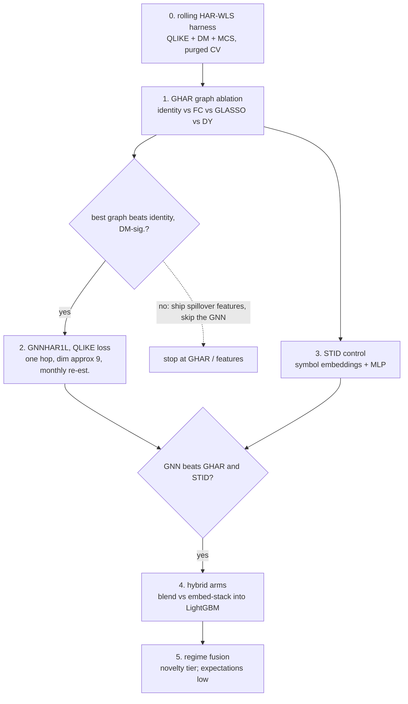

*The build order, with go/no-go gates. The dashed exit is a legitimate outcome: if linear graph aggregation captures everything, the deliverable is three extra HAR regressors, not a neural network.*

- **Step 0: the harness.** Rolling HAR-WLS baseline re-estimated walk-forward, $\operatorname{QLIKE}$ primary with DM tests and MCS, purged CV for any tuned component. Nothing else starts until this exists, because every later number is a ratio to it. The GNNHAR repository's evaluation code (QLIKE training loop, MCS testing) is worth porting wholesale.
- **Step 1: the graph ablation (the chapter's single best experiment).** The four-adjacency GHAR run specified in the Contradiction subsection's key-idea box. Beyond settling the graph question, it yields the spillover features that are useful regardless of what happens next. Expected outcome, from the result grid above after the audit-table discount: one to two percent $\operatorname{QLIKE}$ at $h=1$ if graphs help at all.
- **Step 2: one nonlinear hop.** Only if a graph beat identity with DM significance: GNNHAR1L trained under $\operatorname{QLIKE}$, hidden dimension near 9, seed-ensembled, monthly re-estimation, per the GNNHAR subsection. Do not stack a second layer until a DM test asks for it; our universe's graphs will have diameters like GNNHAR's.
- **Step 3: the STID control.** Per-symbol identity embeddings plus a small MLP in the same harness. If it matches the GNN, the graph is not earning its complexity, and the honest conclusion is "pooling plus asset identity," which is still a publishable internal finding.
- **Step 4: the hybrid arms.** Arm A: LightGBM on the [Chapter 10](ch10-feature-engineering.md) feature set plus the GNN's scalar forecast (blending). Arm B: the same plus 8/16/32-dimensional final-layer node embeddings (stacking). Purged $k$-fold with embargo, $\operatorname{QLIKE}$, DM. Prior from the Three Wirings subsection: A $\approx$ B at far lower complexity; arm B must win clearly to displace the blending default.
- **Step 5: regime fusion (novelty tier).** Filtered regime probability entering as a global attribute or node feature versus regime-blended graphs, attempted last, with H-ETE-GNN's crisis failure as the cautionary prior and a periodic-retrain fallback always in the comparison set.

> **Key Result: Honest Expected Gains**
>
> | Step | Realistic win (vs. rolling HAR, $\operatorname{QLIKE}$, $h{=}1$) | Source of the prior |
> |---|---|---|
> | QLIKE-trained HAR | $\sim$1-2% | HAR$_Q$ row, the result grid above |
> | GHAR spillover terms | $\sim$1-2% | GHAR rows, the result grid above |
> | GNNHAR1L$_Q$ | $\sim$3-4% total | Zhang et al. (2023) |
> | Hybrid stacking over blending | $\approx$0 until proven | the Three Wirings subsection |
> | Regime-conditioned graphs | unknown; incumbent-free | the Regime Frontier subsection |
>
> Single digits, concentrated at short horizons, larger in turbulence. If a run of ours shows 20%, the first hypothesis is a bug or a leak, not brilliance.

Two project-specific warnings close the section. First, **asynchronicity**: none of the papers in this chapter faces a universe whose nodes close at different times of day; our cross-asset book does, and the Leakage Rules subsection's synchronization discipline is not optional. Second, **sample size**: 34 nodes and a few thousand days is tiny for anything with parameters; every design choice in this chapter that pointed small (one hop, dimension 9, pooled coefficients, sum-versus-mean as a one-line ablation) points smaller still on our data.

## Summary

- A graph is nodes, edges, and a global attribute, each carrying features; CNNs, RNNs, and transformers are GNNs with frozen wiring, and the market is a graph whose wiring we must estimate (the Market as a Graph section).
- The project's task is node-level regression; regime detection is graph-level; the same GNN body serves both with different heads (the Three Prediction Tasks section).
- Permutation invariance is the defining constraint, and $\mathbf{A}\mathbf{X}$ is already message passing: one matrix multiply aggregates every asset's neighborhood, $\mathbf{A}^k$ reaches $k$ hops (the Representing Graphs section).
- All architectures are choices of message, update, and readout functions (MPNN); the GCN fixes them to a normalized neighborhood average, GraphSAGE adds a concatenation skip, the GN block adds edge and global lanes (the Building a GNN section).
- GAT is [Chapter 12b](ch12b-deep-learning-vol.md)'s attention masked to the graph; a transformer is a GAT on a complete graph; attention weights form a learned, state-dependent spillover matrix, interpretable but not causal (the Attention on Graphs section).
- Sum aggregation is maximally expressive (GIN); depth backfires via over-smoothing, provably and fast on small dense graphs; vol graphs are tiny, so almost all web-scale GNN engineering advice does not apply (the Design Lessons section).
- The canonical result: GHAR's three linear spillover terms earn roughly half the total gain; one QLIKE-trained nonlinear hop earns the rest, about 13% MSE and 4% $\operatorname{QLIKE}$ over rolling HAR at one day, fading by one month; multi-hop is dead weight; training loss matters as much as architecture (the GHAR and GNNHAR section).
- Graph construction is the contested choice: GLASSO wins on 27 stocks, fully-connected wins on 10 indices, learned-evolving wins on crypto; the resolution for our universe is a cheap OLS ablation, and graphs must always be estimated point-in-time, though graph look-ahead is a measurably second-order sin (the Graph Construction section).
- The frontier offers dynamic DY graphs (DCRNN-HAR), spectral filtering on directed graphs via the magnetic Laplacian (GSP-HAR), learned evolving adjacency (EMGNN), vol-of-vol-informed intraday attention (SpotV2Net), and multi-relation graph transformers (GTN-VF), almost all evaluated without $\operatorname{QLIKE}$ or significance tests (the frontiers section).
- Wire GNNs into the existing stack by blending forecasts first; embedding stacking has only a negative finance exemplar; joint GBDT-GNN training (BGNN) is the strongest idea but non-financial; regime-conditioned graphs have no credible incumbent, which makes them last to build and interesting to try (the Hybrids section).
- The skeptic's checklist, HAR bar, STID control, QLIKE with DM/MCS, honest target, point-in-time graph, economics check, is the acceptance gate for every experiment; expected gains are single digits, and that is fine, because the harness that proves them is the deliverable (the Skeptic's Checklist and Project Blueprint sections).
