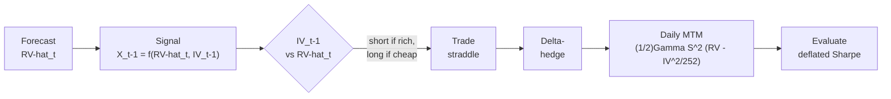

# Chapter 18: From Forecast to P&L: A Realistic, Evaluable IV-RV Straddle

Suppose your machine-learning model forecasts tomorrow's realized variance more accurately than the HAR benchmark. A desk head will not be impressed by a lower QLIKE; they will ask a blunt question: *does the better forecast make money, and how do you know it is not a fluke of the backtest?* Answering honestly is harder than it looks. The natural way to monetise a volatility view is to trade an option and hedge away its directional exposure, but the moment you do this you inherit a thicket of frictions: the option's bid-ask spread, the cost of rebalancing the hedge, the random error the discrete hedge injects, and the statistical trap of having tried many strategy variants before reporting the best one. This chapter assembles the **most realistic version** of that trade, component by component, and shows exactly where each standard shortcut is sound, where it is flawed, and what it quietly leaves out.

> **Prereq: Background**
>
> This chapter is the synthesis of four earlier strands, and it leans on each rather than repeating them:
>
> - **Options and Greeks** (see [Chapter 8](ch08-options-vol-surface.md)): the Black-Scholes price, delta, gamma, vega; and variance swaps with their log-contract replication (see [Chapter 9](ch09-variance-risk-premium.md)).
> - **The variance risk premium** (see [Chapter 9](ch09-variance-risk-premium.md)) and the **gamma P&L identity** (see [Chapter 9](ch09-variance-risk-premium.md)): why a delta-hedged option pays off on realized-minus-implied variance.
> - **Forecast evaluation** (see [Chapter 16](ch16-forecast-evaluation.md)): QLIKE, the Diebold-Mariano test, and the deflated Sharpe ratio.
> - **Economic-value testing** (see [Chapter 17](ch17-applications-projects.md)): transaction costs, turnover, and the Sharpe drag.
>
> You do not need to re-read these; cross-references point back to the exact equation when it is used.

## The Strategy in One Picture

The strategy trades a single, sharp idea: **a delta-hedged straddle is a bet on realized variance against the variance the market has priced in.** If our forecast says realized volatility will come in *below* what the option's implied volatility charges, the option is expensive, so we sell it; if our forecast says realized will come in *above* the implied charge, the option is cheap, so we buy it. Everything else in this chapter is the machinery that makes this bet measurable and honest.

Two building blocks make the idea precise. A **straddle** is a package of one call and one put on the same underlying, struck at the same price $K$ and expiring on the same date. Bought together, the pair has almost no directional view at inception (the call's positive **delta**, an option's price sensitivity to the underlying expressed as an equivalent number of shares, roughly cancels the put's negative delta; see [Chapter 8](ch08-options-vol-surface.md)) but a large sensitivity to how much the underlying *moves*: any large move, up or down, pushes one leg deep into the money. **Delta hedging** is the act of repeatedly trading the underlying to cancel whatever directional exposure remains, so that what is left is a near-pure exposure to *variance* rather than to direction. We hold the delta-hedged straddle for one period, collect its profit or loss, and repeat.

> **Intuition: In Plain English**
>
> Selling a delta-hedged straddle is like selling insurance against large price moves. You collect a premium set by the market's implied volatility, then pay out whenever the underlying actually moves a lot (high realized volatility). You profit when the premium you charged exceeds the claims you pay, that is, when implied volatility was higher than the realized volatility that followed. Our forecast $\widehat{\operatorname{RV}}_t$ is the actuary: it tells us, before we write the policy, whether the premium on offer looks rich or cheap.

The signal that decides which way to trade is the gap between the implied volatility the market is charging at the close of the prior day, $\operatorname{IV}_{t-1}$, and our model's forecast of the realized volatility that will actually occur, $\widehat{\operatorname{RV}}_t$. This gap is the **variance risk premium** viewed through a tradeable lens (see [Chapter 9](ch09-variance-risk-premium.md)).

> **Key Idea: The IV-RV Gap Trading Rule**
>
> On each day $t$, compare lagged implied volatility to the forecast of realized volatility:
>
> - if $\operatorname{IV}_{t-1} > \widehat{\operatorname{RV}}_t$ (implied rich), **short** the delta-hedged straddle;
> - if $\operatorname{IV}_{t-1} < \widehat{\operatorname{RV}}_t$ (implied cheap), **long** the delta-hedged straddle.
>
> The size of the bet can scale with the size of the gap. The quality of the forecast $\widehat{\operatorname{RV}}_t$ is the only proprietary ingredient; everything downstream is execution and accounting.

The pipeline diagram below traces the whole pipeline, from forecast to a judged Sharpe ratio. The rest of the chapter walks through each stage, adding one layer of realism at a time: the signal and its timing (the signal section), the P&L engine and where it breaks (the gamma-identity and clean-identity-breaks sections), the two kinds of transaction cost (the option-costs and Leland sections), the variance the discrete hedge injects (the hedging-error section), the kurtosis input it needs (the kurtosis section), the assembled algorithm (the backtest section), and finally the evaluation that ties it all back to forecast accuracy (the evaluation section).

*The IV-RV straddle pipeline. A realized-volatility forecast feeds a variance-risk-premium signal, which decides the direction of a delta-hedged straddle; the position is hedged intraday, marked to market daily through the gamma P&L identity, and the resulting return stream is judged with a deflated Sharpe ratio. Each stage adds a layer of realism developed in this chapter; every symbol shown in the boxes is defined in the sections that follow.*

## The Signal and the Anti-Lookahead Protocol

The trade needs a single number, computed before we commit capital, that decides whether to be short or long the straddle. We have two raw ingredients: our model's forecast of the realized volatility that will occur over day $t$, written $\widehat{\operatorname{RV}}_t$, and the implied volatility the option market was charging at the close of the previous day, $\operatorname{IV}_{t-1}$. The signal is some function of their gap, following Pollok (2025).

$$
X_{t-1} = f\!\left(\widehat{\operatorname{RV}}_t,\ \operatorname{IV}_{t-1}\right),
\qquad
f \in \Big\{\, \underbrace{x - y}_{\text{difference}},\ \ \underbrace{x/y}_{\text{ratio}},\ \ \underbrace{\ln(x/y)}_{\text{log-ratio}} \,\Big\}.
$$

- $X_{t-1}$: the trading signal known at the close of day $t-1$, before day $t$'s position is taken.
- $\widehat{\operatorname{RV}}_t$: the model's forecast (made with data through $t-1$) of day $t$'s realized volatility, the "$x$" argument.
- $\operatorname{IV}_{t-1}$: the option-implied volatility observed at the close of $t-1$, the "$y$" argument.
- $f$: the gap functional. The difference is the most direct; the ratio and log-ratio are scale-free and behave better when volatility levels swing widely.

> **Project Connection: Why This Matters**
>
> This equation is the only place the forecast enters the strategy. Every later section is execution and accounting that is identical no matter whose forecast you plug in. This is the precise mechanism by which a lower QLIKE is supposed to become higher P&L, and the evaluation section tests whether it actually does.

Before differencing, the two numbers must live in the same units. Implied volatility is quoted annualized; realized volatility forecasts are usually expressed per day. Because volatility scales with the square root of time, we convert the implied quote to daily units by dividing by the square root of the number of trading days in a year,

$$
\operatorname{IV}^{\text{daily}}_{t-1} = \frac{\operatorname{IV}_{t-1}}{\sqrt{252}},
$$

so that the difference $\widehat{\operatorname{RV}}_t - \operatorname{IV}^{\text{daily}}_{t-1}$ compares like with like. (Some studies use $\sqrt{250}$ rather than $\sqrt{252}$; the choice is a convention and shifts the gap by a constant scale factor, not its sign.)

**Lookahead** is the cardinal sin of any backtest: using information at time $t$ that would not actually have been available when the position was taken. For this strategy the danger is acute, because the predictor (which needs the day's data to update the forecast) and the trade (which must happen while the market is open) both want to live at the same instant. Pollok (2025) fixes a clean protocol that keeps them safely ordered.

> **Key Idea: The Lookahead-Safe Timing Protocol**
>
> For each trading day $t$:
>
> 1. Update the realized-volatility model and form the signal $X_{t-1}$ using only information available up to **3:55 pm ET** on day $t$.
> 2. **Execute** the straddle (and its initial hedge) before the **4:00 pm** close on day $t$.
> 3. **Realize** the position's return over day $t+1$.
>
> The five-minute gap between measuring the predictor and trading guarantees the signal uses no information from the moment of execution onward.

Finally, how big should the bet be? The crude choice is binary: a fixed-size short whenever the gap is positive, a fixed-size long whenever it is negative. A better choice scales the position with confidence in the signal.

> **Key Idea: Graded Sizing Beats a Binary Switch**
>
> Li and Wu (2026) find that a *moderate*, confidence-scaled position size delivers higher Sharpe ratios than either a binary on/off rule or maximally aggressive scaling. The intuition is risk budgeting: press hardest when the edge is largest and the forecast most confident, but never so hard that a single adverse day dominates the P&L.

> **Warning: Cite This Result Narrowly**
>
> Li and Wu (2026) study a *directional* machine-learning hedging rule on a single ETF, not an IV-RV straddle. It supports the qualitative claim "moderate scaling beats a binary switch" and nothing more; do not borrow any of its magnitudes for this strategy.

## The P&L Engine: The Gamma Identity

Why should a delta-hedged option pay off on realized-minus-implied variance at all? The answer is a single identity, and it is the engine under the whole strategy. Suppose we hold an option and continuously rebalance the stock hedge using the delta computed at the option's *implied* volatility. Where an *unhedged* option's daily P&L would be dominated by a large random term in the direction the stock moved, Ahmad and Wilmott (2005) show that hedging at implied volatility cancels that randomness, leaving a one-day mark-to-market profit (the change in the position's value at current prices) that is completely deterministic:

$$
d\Pi_t = \tfrac{1}{2}\big(\sigma^2 - \tilde{\sigma}^2\big)\,S^2\,\Gamma^{i}\,dt .
$$

- $\sigma$: the **actual** (realized) volatility that the underlying delivers over the step.
- $\tilde{\sigma}$: the **implied** volatility baked into the option's price and into the hedge ratio.
- $S$: the underlying price; $\Gamma^{i}$: the option's **gamma** computed with the implied volatility (the curvature of its value in $S$).
- $S^2\Gamma^{i}$: the **dollar gamma**, the weight that converts a variance gap into money.
- $dt$: the length of the step.

> **Intuition: In Plain English**
>
> Hedging at the implied volatility makes each day's profit a clean, sign-definite bet: you earn the gap between the variance that actually happened ($\sigma^2$) and the variance the market charged for ($\tilde{\sigma}^2$), scaled by how much curvature (dollar gamma) the position carries that day. Remarkably there is no random $dX$ term: once you fix the hedge at implied vol, the daily P&L stops depending on the direction the stock moved and depends only on how *much* it moved. The position has been turned into a pure variance meter.

Summing the discounted daily increments over the life of the trade gives the total profit from hedging at implied volatility,

$$
\Pi = \tfrac{1}{2}\big(\sigma^2 - \tilde{\sigma}^2\big)\int_{t_0}^{T} e^{-r(t-t_0)}\, S^2\,\Gamma^{i}\,dt ,
$$

where $t_0$ is the trade date, $T$ the expiry, $r$ the interest rate, and $e^{-r(t-t_0)}$ the discount factor that converts each future day's profit into today's dollars. Ahmad and Wilmott (2005) describe this total as "always positive, but highly path dependent": positive because (for a correct view) every daily increment has the same sign, yet path dependent because the dollar-gamma weight $S^2\Gamma^{i}$ depends on where the stock wanders relative to the strike. (Carr (2005) and Henrard (2003), as presented by Ahmad and Wilmott, 2005, give the more general result for hedging at *any* volatility rather than implied; we need only the implied-vol case here.)

In a daily backtest we do not integrate; we sum one increment per day. The unobservable instantaneous variance $\sigma^2\,dt$ accumulated over a day is precisely what our realized-variance estimator measures, so we substitute the measured $\operatorname{RV}_t$ for it (this is the whole reason the guide built an RV estimator in the first place); the annualized implied variance $\operatorname{IV}^2$ is sliced into one trading day's share by dividing by the $252$ trading days in a year:

$$
\text{PnL}_t \approx \tfrac{1}{2}\,\Gamma_t\,S_t^2\,\Big(\underbrace{\operatorname{RV}_t}_{\text{realized var, day }t} - \underbrace{\tfrac{\operatorname{IV}^2}{252}}_{\text{daily implied var}}\Big).
$$

- $\operatorname{RV}_t$: the realized *variance* over day $t$ (e.g. the sum of squared 5-minute returns).
- $\operatorname{IV}^2/252$: the implied variance apportioned to a single trading day.
- $\Gamma_t S_t^2$: the dollar gamma at the start of day $t$, treated as fixed across the day.

> **Warning: Notation: Variance Form vs. Volatility Form**
>
> [Chapter 9](ch09-variance-risk-premium.md) wrote this identity as $\tfrac12\Gamma S^2(\operatorname{RV}^2 - \operatorname{IV}^2)T$, where there $\operatorname{RV}$ denotes realized *volatility*, so $\operatorname{RV}^2$ is a variance. Here $\operatorname{RV}_t$ denotes realized *variance* directly, so the bracket is $(\operatorname{RV}_t - \operatorname{IV}^2/252)$ with no square. The two are the same object; only the symbol's meaning differs, and we use the variance form throughout this chapter.

The dollar-gamma weight $S_t^2\Gamma_t$ is not constant: it is largest when the stock sits near the strike and falls away as the stock drifts into either wing (see the dollar-gamma figure below). This is the source of the path dependence: the same average variance gap earns very different money depending on whether the stock spent the period parked at the strike (high weight) or trending away from it (low weight). A single straddle cannot escape this path dependence, which is why the next section examines where its clean variance interpretation frays.

*Figure (plot): The dollar-gamma weight $S^2\Gamma$ as a function of the underlying price, for a fixed strike $K$. The curve is a bell shape centred at the strike: it peaks at-the-money (near $S = K = 100$) and decays toward zero in both wings (as $S$ moves toward $60$ or $150$). The weight that converts a variance gap into P&L is concentrated near the money and decays as the stock drifts into either wing. This is why a single delta-hedged straddle is a path-dependent variance bet: the same realized-minus-implied gap earns more money on days the stock loiters near the strike than on days it trends away.*

## Where the Clean Identity Breaks

The gamma identity of the daily-discrete P&L equation rests on four assumptions: that we hold a single, near-the-money option; that the underlying follows a continuous, jump-free diffusion; that volatility itself does not move while we trade; and that we rebalance the hedge continuously. Real life violates all four. This section names each crack and the Greek or theorem that measures it, so that the hedging-error section can put a number on the most important one.

The first two cracks are **higher-order Greeks**: sensitivities of the position to things the simple identity treats as frozen. **Vanna** measures how the option's delta drifts as volatility moves:

$$
\operatorname{Vanna} = \frac{\partial^2 V}{\partial S\,\partial \sigma} = \frac{\partial\, \operatorname{\mathcal{V}}}{\partial S} = -\,e^{-q\tau}\,N'(d_1)\,\frac{d_2}{\sigma},
$$

- $V$: the option value; $\operatorname{\mathcal{V}} = \partial V/\partial\sigma$ its sensitivity to volatility.
- $N'(\cdot)$: the standard normal density; $d_1, d_2$: the usual Black-Scholes arguments (see [Chapter 8](ch08-options-vol-surface.md)).
- $q$: the dividend yield; $\tau = T-t$: time to expiry; $\sigma$: volatility.

> **Intuition: In Plain English**
>
> Vanna is the cross-talk between price and volatility. It says: when volatility ticks up, my delta is no longer where I left it, so my "delta-neutral" hedge has quietly become directional. A position with large vanna leaks P&L whenever spot and volatility move together, which is exactly what happens in an equity sell-off (price down, vol up).

**Volga** (also called vomma) measures the position's convexity in volatility itself:

$$
\operatorname{Volga} = \frac{\partial^2 V}{\partial \sigma^2} = \operatorname{\mathcal{V}}\,\frac{d_1 d_2}{\sigma}.
$$

- $\operatorname{Volga}$: curvature of the option value as a function of volatility (the "gamma of vega").
- $\operatorname{\mathcal{V}}, d_1, d_2, \sigma$: as above.

> **Intuition: In Plain English**
>
> Gamma is convexity in the stock price; volga is convexity in volatility. A position with positive volga gains more from a large volatility swing than it loses from a small one, so it is implicitly long vol-of-vol. For a straddle the legs carry volga away from the money, which is why a straddle held through a volatility regime change behaves differently from a textbook variance bet.

The third crack is **jumps**. The gamma identity is a statement about quadratic variation accumulated smoothly; a gap (an earnings move, a macro shock) is not captured by $\tfrac12\Gamma S^2 \,\operatorname{RV}$ because gamma is not constant across a large jump. Carr and Lee (2009) show that for the variance-swap replication the leading error from discreteness and jumps is *third order* in the daily return, so it is small for ordinary days and bites only on the rare large move, precisely when it hurts most.

The fourth crack is **discreteness of the hedge**, and it is the one we will quantify. Because we rebalance a finite number of times per day rather than continuously, the realized hedge never perfectly cancels the directional exposure, leaving a residual tracking error. Bertsimas, Kogan, and Lo (2000) characterise its size.

> **Key Idea: The Discrete-Hedging Error Shrinks as $1/\sqrt{N}$**
>
> With $N$ equally spaced rebalances, the typical size of the tracking error (its root-mean-square, RMSE) shrinks with the square root of the rebalancing count:
>
> $$
> \text{RMSE} = \frac{g}{\sqrt{N}} + O\!\left(\frac{1}{N}\right),
> $$
>
> where the "granularity" constant $g$ and the smaller $O(1/N)$ correction are spelled out in Bertsimas, Kogan, and Lo (2000, Thm. 1c, Eqs. 2.13, 2.18); the practical takeaway is the rate itself, $1/\sqrt{N}$. One technical point matters for us: a straddle's payoff has a kink at the strike, so the governing result is their Theorem 2 (for piecewise-linear payoffs), not Theorem 1, which needs a smooth payoff.

> **Warning: A Single Straddle Is Not a Clean Variance Bet**
>
> Off the money, the dollar-gamma weight collapses (see the dollar-gamma figure) and vanna and volga take over, so the straddle's payoff drifts away from "realized minus implied variance." The instrument that *is* a clean variance bet is the variance swap, whose $1/K^2$ strip of options (see [Chapter 9](ch09-variance-risk-premium.md)) holds its variance exposure constant regardless of where spot goes. We trade the straddle anyway, because it is far more liquid, but we must account honestly for the gap, and the next sections do.

## Option Transaction Costs

So far every P&L number has been gross. The single most dangerous shortcut in a volatility-strategy backtest is to ignore, or badly under-model, the cost of the options themselves. We pay this cost as the option's bid-ask spread, and the honest way to charge it is in volatility points converted to dollars through vega, only at the moments we actually trade: when we open the position, when we flip from short to long (or back), and when we close.

$$
c_{\text{opt}} = \operatorname{\mathcal{V}} \cdot \tfrac{1}{2}\big(\sigma_{\text{ask}} - \sigma_{\text{bid}}\big),
$$

- $c_{\text{opt}}$: the dollar cost charged to the position at a single entry, flip, or exit event.
- $\operatorname{\mathcal{V}}$: the straddle's vega, dollars of value per volatility point (see [Chapter 8](ch08-options-vol-surface.md)).
- $\sigma_{\text{ask}} - \sigma_{\text{bid}}$: the bid-ask spread quoted *in implied-volatility points*; the half-spread is what we cross.

> **Project Connection: Why This Matters**
>
> Modelling $c_{\text{opt}}$ event-by-event, rather than as a flat daily haircut, is what lets the backtest reward a forecast that trades patiently and punish one that churns.

How large is the spread in practice, and does event-driven costing match reality? Two findings anchor the answer. First, Muravyev and Pearson (2020) show that the cost actually paid depends enormously on execution: for the most liquid US equity options the average quoted spread is roughly $8.1$ cents, the conventional "effective" spread about $6.2$ cents, but a timing-aware execution that waits for favourable quotes pays only about $1.3$ cents, roughly a fifth of the effective and a sixth of the quoted figure. The strategy-level consequence is stark: they document that a long-short straddle portfolio sorted on implied-minus-realized volatility earns about $22.7\%$ per month gross but collapses to about $3.9\%$ per month once the full quoted spread is charged. *The sign of the conclusion flips with the cost assumption.*

> **Warning: Charge a Cost *Band*, Not a Point Estimate**
>
> Because a plausible execution cost ranges from the full quoted half-spread (pessimistic) down to roughly a third of it (timing-aware), a single cost number is meaningless. Report the strategy's Sharpe across the whole band (see the cost-band figure). A strategy is only credible if it survives the pessimistic end, or at the very least the empirically grounded middle.

Second, the spread is not one number but a schedule that widens sharply as expiry approaches. Doshi, Pari, and Shamsuddin (2025) measure the effective option spread by maturity for liquid index options:

| Maturity bucket | Effective spread (% of premium) |
|---|---|
| 21-48 days to expiry | $\approx 2\%$ |
| 7-13 days to expiry | $\approx 3.5\%$ |
| 0 days to expiry (0DTE) | $\approx 9\%$ |

*Effective option bid-ask spread as a fraction of premium, by maturity, for liquid at-the-money index options (Doshi, Pari, and Shamsuddin, 2025). The very short maturities are far more expensive to trade.*

Doshi, Pari, and Shamsuddin (2025) also document a spread spike on the third-Friday monthly expiry (the standard roll date), and note that routing across the sixteen US options exchanges materially narrows spreads for single names but not for products such as SPX that trade only on one venue. Practitioner backtests reflect this event-driven reality directly: Wysocki and Ślepaczuk (2024) fill every execution at the midpoint plus half the quoted bid-ask on both the option and the hedge leg, and François et al. (2025) charge a percentage cost $\kappa_2 \in \{0.5, 1, 1.5, 2\}\%$ on every option position change against a far smaller $\kappa_1 = 0.05\%$ on the underlying. The lesson across all of them is the same: cost is incurred per transaction, scales with how rich the spread is at that maturity, and dominates the economics of any strategy that trades options frequently. The mechanics of turning costs into a Sharpe drag, turnover and breakeven cost, were developed for the underlying in [Chapter 17](ch17-applications-projects.md); here they apply to the option leg through the vega-cost equation.

*Figure (plot): Schematic bar chart of pooled Sharpe (illustrative) under four option-cost assumptions, ordered from least to most conservative: Gross ($\approx 1.40$), Timing-aware ($\approx 1.00$, about one-third of quoted), Effective ($\approx 0.55$, from the maturity-resolved spread schedule), and Quoted ($\approx 0.10$, the full quoted half-spread). A dashed "credibility floor" sits at Sharpe $= 0.5$. The numbers are illustrative; the shape is the point. A strategy whose Sharpe sinks below a sensible floor under the quoted assumption is living on execution optimism, not edge (Muravyev and Pearson, 2020).*

## The Hedge Also Costs: Leland and Its Critique

The option-costs section charged the spread on the option. But every time we rebalance the delta hedge we also trade the underlying, and that trade crosses a spread too. The classic way to fold this cost into the pricing, due to Leland (1985) (restated in this notation by Zhao and Ziemba, 2003), is a sleight of hand: pretend you are hedging at a slightly *higher* volatility, chosen so that the extra option premium exactly funds the expected hedging costs.

$$
\hat{\sigma}^2 = \sigma^2\left(1 + \sqrt{\frac{2}{\pi}}\,\frac{k}{\sigma\sqrt{\delta t}}\right).
$$

- $\hat{\sigma}$: the **Leland-modified volatility** to use in the hedge (and in pricing) instead of the true $\sigma$.
- $k$: the round-trip (buy-then-sell) proportional transaction cost of trading the underlying, a fraction such as $0.001 = 0.1\%$ (e.g. the relative bid-ask spread).
- $\delta t$: the time between hedge rebalances, the same role $dt$ played in the Ahmad-Wilmott daily identity but now a finite interval rather than infinitesimal; more frequent hedging (smaller $\delta t$) inflates the adjustment more.
- $\sqrt{2/\pi} \approx 0.798$: the mean of the half-normal distribution, that is, $\mathbb{E}|u|$ for $u \sim \mathcal{N}(0,1)$.

> **Intuition: In Plain English**
>
> Each rebalance trades an amount of stock proportional to how much delta moved, and the expected size of that move is governed by the half-normal mean $\sqrt{2/\pi}$. Leland's insight is that you can bake the resulting expected cost into a single fudge to volatility: hedge as if the world were slightly more volatile, and the fatter option premium pays your transaction bill. The $1/\sqrt{\delta t}$ factor warns that hedging twice as often does not halve costs, it raises the volatility adjustment.

The catch is that the Leland-volatility equation is a heuristic, not an optimal policy, and modern work has mapped its limits precisely. Kabanov and Safarian (1997) prove that if transaction costs are held *constant* as the rebalancing frequency grows, the Leland-hedged portfolio does *not* converge to the option payoff: a nonzero, negative limiting error remains, meaning the strategy systematically under-hedges. The error only vanishes if costs shrink with frequency: Lépinette and Kabanov (2010) show that with costs scaling as $k_n = k_0\,n^{-1/2}$, the mean-square hedging error converges to zero at rate $n^{-1}$ (root-mean-square at $n^{-1/2}$) for *convex* payoffs, and a straddle is convex. Beyond these results, the current frontier treats hedging as a control problem rather than a volatility fudge: Arzel and Lehdili (2026) use a no-transaction band of width $h_{WW} = \big(3\lambda\delta S\,\Gamma^2/(2\gamma)\big)^{1/3}$ (the Whalley-Wilmott band) inside which one simply does not trade, and Brugière and Turinici (2025) show a neural-network hedger beating Leland at realistic cost levels.

> **Warning: Leland Is a Cost-Line Inflator, Not the Optimal Trade**
>
> Use the Leland-modified volatility as a transparent, deterministic way to charge hedging costs in the backtest, exactly as [Chapter 17](ch17-applications-projects.md) charged turnover costs for the underlying. Do not present it as the best possible hedging policy: under constant costs it under-hedges (Kabanov and Safarian, 1997), and band or learned policies dominate it (Arzel and Lehdili, 2026; Brugière and Turinici, 2025). For our purposes it is a baseline cost model, and a good one.

## The Variance the Hedge Injects

Here is the subtlest cost of all, and the one most often mis-handled. Even with a perfect volatility forecast and zero transaction costs, hedging at discrete moments leaves a *random* replication error every period. Its mean is zero, so it does not bias the P&L, but its *variance* is real risk that must inflate the denominator of any Sharpe ratio. The goal of this section is a closed form for that variance, attributed to exactly the right source.

Start with one rebalancing interval. Applying the Black-Scholes PDE and dropping higher-order terms, the hedging error accrued over a single step is

$$
H_i = \tfrac{1}{2}\,\Gamma\, S^2\, \sigma^2\, \delta t \,\big(1 - u_i^2\big), \qquad u_i \sim \mathcal{N}(0,1),
$$

so that the total error at expiry is $HE(T) = \sum_{i=1}^{N} H_i$.

- $H_i$: the replication error contributed by the $i$-th rebalancing interval.
- $\Gamma S^2$: the dollar gamma; $\sigma^2\,\delta t$: the variance accrued over the step of length $\delta t$.
- $u_i \sim \mathcal{N}(0,1)$: the standardized return over the step, so $u_i^2 \sim \chi^2_1$ is a (skewed, fat-tailed) chi-squared with one degree of freedom.
- $1 - u_i^2$: a mean-zero shock (mean zero because $\mathbb{E}[u_i^2] = 1$); positive when the realized squared return undershoots its expectation, negative when it overshoots.

This is the discrete-hedging error of Boyle and Emanuel (1980), here in the convenient decomposition of Anagnou and Hodges (2007) (their Eqs. 5 and 7). Note the per-step shock $1-u_i^2$ is *not* Gaussian; it is a shifted chi-squared, skewed and leptokurtic. Only after summing many independent steps does a central-limit effect make the aggregate roughly normal.

> **Intuition: In Plain English**
>
> Between hedge adjustments the stock moves, and your frozen delta is wrong by a little. The gamma term tells you how badly: each interval you book half the dollar gamma times the gap between the variance you expected ($\sigma^2\delta t$) and the variance that actually happened ($\sigma^2\delta t\,u_i^2$). On average this gap is zero, so you neither make nor lose money from it systematically, but it jitters your P&L, and that jitter is pure noise added on top of the variance bet you actually wanted.

Because the steps are independent and $\operatorname{Var}(u_i^2) = 2$ for a Gaussian return, the aggregate error variance is a sum of $N$ equal pieces. With $\delta t = T/N$,

$$
\operatorname{Var}\!\big(HE(T)\big) = \sum_{i=1}^{N}\Big(\tfrac{1}{2}\Gamma S^2\sigma^2\,\delta t\Big)^2 \operatorname{Var}(u_i^2)
= \big(\tfrac{1}{2}\Gamma S^2\sigma^2\big)^2 T^2\,\frac{2}{N},
$$

where the middle-to-right step uses that the $N$ terms are identical: each contributes $(\tfrac12\Gamma S^2\sigma^2\cdot T/N)^2\cdot 2$, and summing $N$ of them turns the $(T/N)^2$ into $T^2/N$. So the hedging-error standard deviation scales as $1/\sqrt{N}$: hedge four times as often and you roughly halve the noise. This is the Boyle and Emanuel (1980) result that the replication error is inversely related to the rebalancing frequency.

Now the refinement that matters for intraday data. Anagnou and Hodges (2007) observe that finer sampling raises the excess kurtosis of returns under non-Gaussian processes, which enlarges the replication error, but they keep $\operatorname{Var}(u_i^2) = 2$ in their closed form. We make that dependence explicit. For a standardized shock with kurtosis $\kappa = \mathbb{E}[u_i^4]$, the variance of the squared shock is $\operatorname{Var}(u_i^2) = \mathbb{E}[u_i^4] - (\mathbb{E}[u_i^2])^2 = \kappa - 1$ (the Gaussian case $\kappa = 3$ recovers $2$). Substituting into the Gaussian hedging-error variance gives the leptokurtic hedging-error variance.

> **Key Result: Kurtosis-Inflated Hedging-Error Variance**
>
> For a standardized per-step return with kurtosis $\kappa$,
>
> $$
> \operatorname{Var}\!\big(HE(T)\big) = \big(\tfrac{1}{2}\Gamma S^2\sigma^2\big)^2\, T^2\,\frac{\kappa - 1}{N}
> \;\propto\; \frac{\sigma^4\,(\kappa - 1)}{N}.
> $$
>
> The symbol $\propto$ means "proportional to": dropping the fixed factors ($\Gamma$, $S$, $T$, the $\tfrac12$) leaves what actually drives the noise, namely volatility to the fourth power and the fat-tail factor $\kappa-1$, divided by the rebalancing count $N$. **Provenance, stated honestly:** the $1/N$ scaling and the per-step form are Boyle and Emanuel (1980) (via Anagnou and Hodges, 2007, Eq. 7). The explicit $(\kappa-1)$ substitution is *our own leptokurtic extension*; it does not appear in Boyle-Emanuel, in Anagnou-Hodges (who fix $\operatorname{Var}(u_i^2)=2$), or in Ahmad-Wilmott. Re-derive it, do not cite it to those sources.

> **Warning: Do Not Attribute This to Ahmad-Wilmott**
>
> It is tempting to credit the $1/N$-and-kurtosis hedging-error variance to Ahmad and Wilmott (2005), because they give a closed-form variance for delta-hedged P&L. They do not. Their "Result 2" (their §4.2, Eq. 3, p. 70) is the variance of *continuous* hedging at implied volatility, a $G(S_0,t_0) - F(S_0,t_0)^2$ expression that arises from the path-dependence of the gamma profit under the real drift; it contains *no* $1/N$ term and *no* kurtosis term, because it is not about discrete rebalancing at all. The discrete-rebalancing variance is Boyle-Emanuel; the kurtosis inflation is the extension above.

Practitioners often package the same idea in vega form: the hedging-error standard deviation of a delta-hedged option is sometimes written $\sigma_{\text{P\&L}} = \operatorname{\mathcal{V}}\,\sigma\sqrt{\pi/(4N)}$ (Bennett, 2014, context only). Beware a coefficient ambiguity here: $\sqrt{\pi/4} \approx 0.886$ follows the half-normal mean-absolute convention, whereas the root-variance (L2) convention gives $1/\sqrt{2} \approx 0.707$; which is "correct" depends on whether you are reporting a mean-absolute error or a standard deviation. Match the convention to the quantity you put in the Sharpe denominator.

Finally, a caution about the limit. The clean $1/N$ decay assumes a continuous diffusion. Brodén and Tankov (2010) show that under jumps (an exponential Lévy model) the rescaled tracking error does *not* vanish at the $1/N$ rate: $\lim_{n} n\,\mathbb{E}[\varepsilon_T^2]$ is strictly positive and can even be infinite, so for a jumpy underlying the analytic variance is a *lower bound*, not the truth. For vanilla calls and puts the $1/N$ rate survives but with a jump-inflated constant; for digital or barrier payoffs the rate is strictly slower than $1/\sqrt{N}$. The figure below contrasts the two regimes.

*Figure (plot): Discrete-hedging error standard deviation versus rebalances per day $N$ (ranging from $1$ to $40$). Under a pure diffusion the error falls as $1/\sqrt{N}$ and can in principle be driven to zero (blue curve, labelled "diffusion $\to 0$"). Once the underlying can jump, the rescaled error no longer vanishes: it asymptotes to a positive floor (red curve, $\sqrt{0.09 + 1/N}$, with a dashed "jump floor" near std $= 0.3$; Brodén and Tankov, 2010), so the analytic $1/N$ variance of the kurtosis-inflated formula is a lower bound on the true intraday hedging noise.*

## Calibrating the Kurtosis $\kappa$ from 5-Minute Data

The kurtosis-inflated variance equation needs one number we have not yet pinned down: the kurtosis $\kappa$ of the per-step return. We can estimate it directly from intraday data using **realized kurtosis**, the high-frequency analogue of realized variance (Amaya et al., 2015):

$$
RK_t = \frac{n\sum_{i=1}^{n} r_{t,i}^4}{\Big(\sum_{i=1}^{n} r_{t,i}^2\Big)^2},
$$

- $RK_t$: the realized kurtosis estimate for day $t$.
- $r_{t,i}$: the $i$-th intraday (e.g. 5-minute) return on day $t$; $n$: the number of such returns per day.
- the numerator is the realized fourth moment scaled by the count $n$ (this normalization makes a perfectly Gaussian day score $3$); the denominator is realized variance squared.

> **Intuition: In Plain English**
>
> Realized kurtosis asks how much of the day's variance came from a few big five-minute jumps versus many small wiggles. If a handful of intervals dominate the sum of fourth powers, $RK_t$ is large and the return distribution is fat-tailed; if the moves are evenly sized, it sits near the Gaussian value of $3$. It is the empirical answer to "how leptokurtic are my returns?", which is exactly the $\kappa$ that the kurtosis-inflated variance equation demands.

> **Project Connection: Why This Matters**
>
> The kurtosis feeds straight into the hedging-error variance and therefore into the Sharpe denominator. A reassuring fact from Amaya et al. (2015) is that realized kurtosis is far more robust to microstructure noise than realized *variance*: the noise-sensitive moment is RV, not the fourth-moment ratio, so we can trust $RK_t$ even where we would worry about $\operatorname{RV}_t$ (see [Chapter 3](ch03-microstructure-noise.md)).

Two cautions keep this honest. First, realized higher moments are **interval-variant**: Ahadzie and Jeyasreedharan (2020) show they do not converge to the sample skewness and kurtosis of daily returns and depend on both the sampling interval and the holding interval. Aggregating 5-minute estimates up to a 15-minute horizon via a central-limit argument is therefore a *stated convention*, not a free lunch; the number you report is tied to the frequency you chose. Second, $\kappa$ is not one constant across names: realized kurtosis is systematically higher for small-cap, high book-to-market, and low-beta stocks (Amaya et al., 2015), so imposing a single conservative value such as $\kappa = 4.0$ across a single-name universe is a simplification, defensible as a baseline but worth stress-testing.

> **Warning: $\kappa = 4.0$ Is a Convention, Not a Measurement**
>
> A flat $\kappa = 4.0$ is a reasonable, mildly conservative default (it sits above the Gaussian $3$), but it is a placeholder for a per-symbol estimate. Estimate $RK_t$ for each name from its own 5-minute returns where you can, and always report how the deflated Sharpe of the evaluation section moves as $\kappa$ ranges over, say, $\{3, 4, 6\}$. If the conclusion flips within that range, the strategy's edge is inside the hedging noise, not above it.

## Assembling the Backtest

We now have every piece. The strategy is the loop below, run over every (symbol, day) pair in the sample. Each numbered step points back to the section that justified it, so the algorithm is just the chapter in executable order.

> **Key Idea: The IV-RV Straddle Backtest, One (Symbol, Day) at a Time**
>
> For each symbol and each trading day $t$:
>
> 1. **Signal.** Before 3:55 pm, compute the forecast $\widehat{\operatorname{RV}}_t$ and read the lagged implied volatility $\operatorname{IV}_{t-1}$; form the signal $X_{t-1}$ of the signal equation (units aligned via the de-annualization equation); decide short / long / flat and a graded size (see the signal section).
> 2. **Enter.** Trade the straddle before the 4 pm close, charging the option cost $c_{\text{opt}}$ of the vega-cost equation on entry, on any flip, and on exit (see the option-costs section).
> 3. **Hedge.** Over day $t+1$, delta-hedge $N$ times, charging the underlying's trading cost through the Leland-modified volatility (see the Leland section).
> 4. **Mark.** At the close, book the day's gamma P&L from the daily-discrete identity using realized variance $\operatorname{RV}_{t+1}$.
> 5. **Risk.** Attach the hedging-error variance of the kurtosis-inflated formula, using a $\kappa$ calibrated per the kurtosis section, to the day's risk (not its mean).
> 6. **Accumulate.** Append the net P&L to the (symbol, day) panel for evaluation in the evaluation section.

The P&L attribution figure below shows where the gross gamma P&L goes. The two transaction costs (option spread, hedge spread) bite the *mean*; the discrete-hedging error does not move the mean (it is zero-mean) but widens the *risk*, shown as the band on the net bar. Keeping these two effects separate, mean drag versus risk inflation, is the single most common bookkeeping error in volatility-strategy backtests, and it is exactly what the evaluation section must respect when it forms the Sharpe ratio.

*Figure (plot): P&L attribution waterfall for the delta-hedged straddle (bar heights illustrative). Starting from the gross gamma P&L (height $\approx 4.0$), an option transaction cost (the option-costs section) is subtracted (a $\approx 0.9$ red step down to $\approx 3.1$), then the delta-hedge transaction cost (the Leland section) is subtracted (a $\approx 0.6$ red step down to $\approx 2.5$), leaving the net mean P&L ($\approx 2.5$). The discrete-hedging error (the hedging-error section) is zero-mean, so it does not appear as a bar; instead it widens the risk around the net, shown as a blue error band ($\pm$ hedging error, scaling as $1/\sqrt{N}$) on the net bar.*

## Evaluation: From QLIKE to a Deflated Sharpe

We now have a panel of net daily P&L, one number per symbol per day, and a risk term to go with it. The final task is to turn this panel into a verdict that is honest about both the cross-section and the multiple-testing trap, and to connect it back to the forecast accuracy we started from.

The first decision is how to pool. We could compute one Sharpe ratio per symbol and average them, or pool all (symbol, day) observations into a single Sharpe. The two answers differ, and the difference is informative rather than cosmetic. Pooling inflates the effective sample size and quietly assumes observations are independent, but on a common-volatility day every symbol's straddle tends to win or lose together, so the cross-sectional correlation is large; pooling that day's hundreds of observations as if independent overstates significance. Averaging per-symbol Sharpes respects that each name is one bet but discards information about how the strategy behaves across the cross-section.

> **Key Idea: Report Both, and Bootstrap by Day**
>
> Compute the pooled (symbol, day) Sharpe *and* the average per-symbol Sharpe. For significance, **block-bootstrap by day**, not by observation: resample whole trading days (all symbols together) so the resampling preserves the cross-sectional dependence that pooling would otherwise ignore. If the two Sharpes disagree sharply, the strategy's apparent edge is concentrated in a few common-vol days, which is itself a finding.

Whichever Sharpe we report, it must be *deflated* for the number of strategy variants we tried before settling on this one. The deflated Sharpe ratio was built in [Chapter 16](ch16-forecast-evaluation.md); we restate it only to flag the traps specific to this application. From the deflated-Sharpe definition,

$$
\operatorname{DSR} = \Phi\!\left(\frac{(\widehat{\operatorname{SR}} - \operatorname{SR}_0)\sqrt{T-1}}{\sqrt{\,1 - \gamma_3\,\widehat{\operatorname{SR}} + \tfrac{\gamma_4 - 1}{4}\,\widehat{\operatorname{SR}}^2\,}}\right),
\qquad
\operatorname{SR}_0 = \sqrt{\operatorname{Var}[\widehat{\operatorname{SR}}_n]}\,\Big[(1-\gamma_{\!E})\,Z^{-1}\!\big(1 - \tfrac1N\big) + \gamma_{\!E}\,Z^{-1}\!\big(1 - \tfrac1{Ne}\big)\Big],
$$

- $\widehat{\operatorname{SR}}$: the observed Sharpe of the chosen strategy; $T$: the number of return observations.
- $\gamma_3, \gamma_4$: the skewness and *kurtosis* of the strategy's returns (note: distinct from the hedging-error $\kappa$).
- $\operatorname{SR}_0$: the expected maximum Sharpe under the null that none of the $N$ trials has skill; $Z^{-1}$ is the inverse standard normal CDF.
- $\gamma_{\!E} \approx 0.5772$: the Euler-Mascheroni constant (distinct from $\gamma_3, \gamma_4$); $N$: the number of strategy configurations tried.

> **Intuition: In Plain English**
>
> The deflated Sharpe answers a single question: what is the probability that this strategy's Sharpe is *real*, rather than the luckiest of the many variants we tried? It returns a number between $0$ and $1$; close to $1$ means "probably real." Read the numerator as the observed Sharpe minus the bar $\operatorname{SR}_0$ that the best of $N$ purely-lucky strategies would be expected to clear, scaled up by how much data $T$ we have; the denominator deflates that confidence when the returns are skewed ($\gamma_3$) or fat-tailed ($\gamma_4$). Here $\Phi$ is the standard normal CDF and $Z^{-1} = \Phi^{-1}$ its inverse; $\operatorname{SR}_0$ is built from how far into the tail the *maximum* of $N$ lucky draws is expected to reach, which is exactly why trying more strategies raises the bar. A fully worked numerical example is in [Chapter 16](ch16-forecast-evaluation.md).

> **Warning: Three Traps in Applying the Deflated Sharpe Here**
>
> (1) The *denominator* of the deflated-Sharpe equation uses the *observed* $\widehat{\operatorname{SR}}$, not $\operatorname{SR}_0$; a well-known web summary places $\operatorname{SR}_0$ there and is wrong. (2) Feed *non-annualized* inputs at the native frequency, with $T$ the raw observation count; annualizing first double-counts. (3) Be honest about $N$: if you tried $20$ forecast or sizing variants, the simple approximation gives $\operatorname{SR}_0 \approx \sqrt{2\ln 20} = 2.45$ (the expected-maximum-Sharpe approximation), a high bar your reported Sharpe must clear. And do not confuse the Euler-Mascheroni $\gamma_{\!E}$ with the return-kurtosis $\gamma_4$ sharing the symbol family.

Finally, the thread back to forecasting. Does a better QLIKE actually produce a better strategy? Pollok (2025) provides the most direct published evidence for this exact pipeline: marginal improvements in standard forecast-error measures can translate into economically significant gains in a delta-hedged straddle portfolio, even though it is hard to beat the benchmark on QLIKE alone, so the economic test separates models that the statistical loss cannot. Pollok's statistical toolkit, however, is MSE/MAE/QLIKE and Mincer-Zarnowitz $R^2$; it does *not* include a Diebold-Mariano test or a Model Confidence Set. So there is no published theorem guaranteeing that a DM-significant or MCS-surviving QLIKE gain (see [Chapter 16](ch16-forecast-evaluation.md)) maps to a guaranteed P&L gain. That bridge is ours to build and test (see the experiments section).

> **Application: The Whole Point, in One Line**
>
> The economic foundation underneath all of this is the negative variance risk premium: Bakshi and Kapadia (2003) show the mean delta-hedged gain on equity options is negative, larger in magnitude in high-volatility regimes, and robust to jump controls, which is why a disciplined short-vol strategy is paid on average (see [Chapter 9](ch09-variance-risk-premium.md)). Our forecast's job is to time *when* that premium is rich enough to harvest and when it is a trap. The deflated Sharpe is the judge of whether the forecast does that job better than chance.

## What to Compute on Our Data

The literature cited in this chapter is almost entirely daily-frequency and drawn from 1993-2023; none of it validates the intraday, 5-minute mechanics we have assembled. The following four experiments are the ones that would turn this chapter from a design into a result on our own data, each with an explicit pass criterion.

> **Project Connection: Four Experiments, Four Verdicts**
>
> 1. **Hedging-error floor.** Run a full path-dependent, bar-by-bar 5-minute hedging simulation for a near-ATM index straddle at $N \in \{1, 2, \dots, 26\}$ rebalances; fit $\operatorname{Var}(\text{error}) = a/N + b$. *Pass:* if the floor $b$ is materially positive (the jump regime of the hedging-error figure), report the *simulated* variance in the Sharpe denominator, not the analytic kurtosis-inflated formula. Resolve $\kappa$ first from the realized-kurtosis estimator, and check that the deflated Sharpe is stable across $\kappa \in \{3,4,6\}$.
> 2. **Cost-band Sharpe.** Recompute the pooled Sharpe under (a) the full quoted half-spread, (b) the maturity-resolved effective spread of the cost schedule table, and (c) a timing-aware cost of roughly one-third the quoted. *Pass:* the strategy survives at least (b), and ideally (a).
> 3. **Statistical-to-economic link.** Regress per-(symbol, day) P&L on the realized gap $(\operatorname{RV} - \operatorname{IV}^2/252)$ and on the forecast error $(\operatorname{RV} - \widehat{\operatorname{RV}})$. *Pass:* the QLIKE-better model's residual edge is Diebold-Mariano significant *and* that DM statistic predicts the cross-sectional Sharpe, the bridge Pollok gestures at but does not prove.
> 4. **Sharpe definition and deflation.** Report pooled and per-symbol Sharpe, block-bootstrapped by day, with the deflated Sharpe computed for the honest number $N$ of configurations tried. *Pass:* the deflated Sharpe clears $\operatorname{SR}_0$ for the true $N$, not for $N=1$.

## Summary

> **Key Result: What to Carry Forward**
>
> - The strategy trades the IV-RV gap through a delta-hedged straddle; the signal $X_{t-1} = f(\widehat{\operatorname{RV}}_t, \operatorname{IV}_{t-1})$ is the only place the forecast enters (the signal equation), measured before 3:55 pm to avoid lookahead.
> - Its engine is the gamma identity $\text{PnL}_t \approx \tfrac12\Gamma_t S_t^2(\operatorname{RV}_t - \operatorname{IV}^2/252)$ (the daily-discrete identity); it is exact only for a near-ATM, jump-free, continuously hedged diffusion, and frays through vanna, volga, and jumps (the clean-identity-breaks section).
> - Charge the option spread per event in vega terms (the vega-cost equation) as a cost *band*; charge the hedge spread through Leland's modified volatility (the Leland-volatility equation), a baseline, not the optimal policy.
> - The discrete hedge injects a zero-mean, $1/N$-scaling variance, Boyle-Emanuel plus our kurtosis extension $\operatorname{Var}(HE) \propto \sigma^4(\kappa-1)/N$ (the kurtosis-inflated formula), *not* Ahmad-Wilmott's continuous-hedging variance; under jumps it is a lower bound.
> - Judge the panel with a deflated Sharpe (the deflated-Sharpe equation) computed honestly (observed $\widehat{\operatorname{SR}}$ in the denominator, non-annualized inputs, true $N$), and tie it back to QLIKE through the experiments of the experiments section.

> **Warning: The One Caveat That Dominates the Rest**
>
> Every economic-value result cited in this chapter is daily-frequency and from the 1993-2023 era. The intraday, 5-minute hedging-error and cost mechanics that make our version "realistic" are precisely the parts no cited paper validates. Treat the closed forms here as scaffolding to be confirmed by our own bar-by-bar simulation, not as borrowed truth. The chapter's value is that it tells you exactly which numbers you still have to earn.
