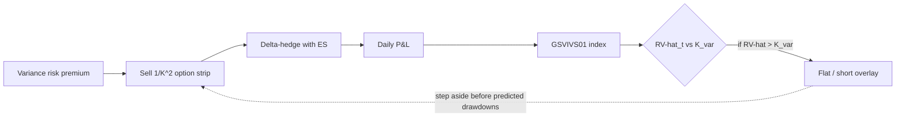
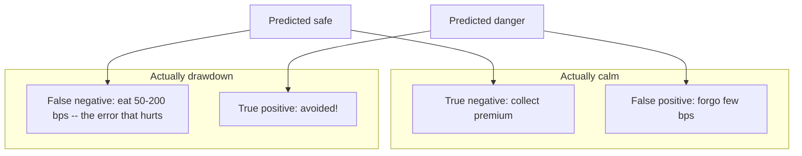

# Chapter 19. Predicting Drawdowns of a Daily Variance-Swap Seller: The GSVIVS01 Index

> **Application: Why This Chapter**
>
> On 1 June 2022 the GSVIVS01 index fell $27.69$ basis points in a single day. That morning the strategy had sold a strip of options whose price embedded a known, observable estimate of how much the S&P 500 would move; the market then moved more than that estimate priced in, and the short paid for the difference. The question this chapter is built to answer is blunt: *the strike the strategy sold was sitting in plain sight that morning, so could a realized-volatility forecast have flagged the day in advance and told us to step aside?*
>
> This is the capstone application of the whole guide for one specific, real strategy. [Chapter 18](ch18-ivrv-straddle.md) traded the gap between implied and realized volatility through a delta-hedged straddle, and it ended on a confession: a single straddle is *not* a clean variance bet, because its exposure collapses once the underlying drifts away from the strike; the instrument that *is* a clean variance bet is the variance swap, and we traded the straddle only because the swap's option strip is less liquid. **GSVIVS01 is that clean instrument, made tradeable.** It sells the full variance-swap strip every day, on zero-days-to-expiry S&P 500 options. This chapter does two things: first it explains, from first principles, what GSVIVS01 sells and how (Act 1); then it builds the project's deliverable, a model that predicts the strategy's drawdowns and times an overlay on the index (Act 2). The economic value of that overlay is the evaluation metric the entire forecasting effort is ultimately judged by.

> **Prereq: Background**
>
> This chapter stands on five earlier strands and one external document:
>
> - **The volatility surface** (the Greeks section, the VIX-index section, and the variance-swap section of [Chapter 8](ch08-options-vol-surface.md)): Black-Scholes Greeks, the model-free implied variance integral, the VIX construction, and the variance-swap payoff. We *re-derive* the swap mathematics here so the chapter is self-contained, then go beyond [Chapter 8](ch08-options-vol-surface.md) to the real product.
> - **The variance risk premium** (the VRP-definition section of [Chapter 9](ch09-variance-risk-premium.md)) and the **gamma P&L identity** (the gamma-P&L section of [Chapter 9](ch09-variance-risk-premium.md)): why selling variance is paid on average.
> - **Jumps and continuous variation** ([Chapter 4](ch04-jumps-continuous-variation.md)): the decomposition of realized variance into a smooth part and a jump part is exactly what sharpens the drawdown signal in Act 2.
> - **The IV-RV straddle** ([Chapter 18](ch18-ivrv-straddle.md)): the signal timing, the gamma engine, and the deflated-Sharpe evaluation are reused wholesale.
> - **The forecast** ([Chapter 6](ch06-har-model.md), [Chapter 10](ch10-feature-engineering.md), [Chapter 16](ch16-forecast-evaluation.md)): the realized-volatility model whose prediction drives the whole overlay. Throughout, a hat denotes a model forecast, so $\widehat{\operatorname{RV}}_t$ is the *forecast* of day $t$'s realized variance and $\operatorname{RV}_t$ is its realized value.
> - **The strategy specification** `GSVIVS01.md`: the source for every real number in this chapter (trades, strikes, index levels).

## The Strategy in One Picture

GSVIVS01 runs a single idea on a daily clock: **sell the market's price of future variance, then pocket the difference when the market turns out calmer than that price implied.** A **variance swap** is a contract that pays its holder the gap between the variance the underlying actually delivers and a fixed strike agreed up front; the party who is *short* the swap, which is GSVIVS01's position, profits whenever realized variance lands below the strike. Rather than sign such a contract over the counter, the strategy **replicates** it: each afternoon it sells a weighted strip of out-of-the-money S&P 500 options expiring that same day (**zero days to expiry**, abbreviated **0DTE**), with the weights chosen so the package behaves exactly like a short variance swap, and it neutralizes the leftover directional exposure by trading E-mini S&P 500 futures (ticker ES). By the close the options have expired or settled, and the strategy is flat, ready to do it again tomorrow.

The pipeline diagram below traces the daily loop and previews where Act 2 plugs in. The premium the strategy harvests is the **variance risk premium**: the systematic tendency of options to price in more variance than subsequently occurs (the VRP-definition section of [Chapter 9](ch09-variance-risk-premium.md)). The price of that harvest is the position's risk shape, which we will make precise in the risk-profile section below: GSVIVS01 is structurally **short gamma** (it loses when the underlying moves a lot), **short vega** (it loses when implied volatility rises), and **long theta** (it earns the passage of quiet time).

*The GSVIVS01 pipeline. Act 1 (top row) is the real product: harvest the variance risk premium by selling a $1/K^2$ strip of 0DTE options, delta-hedge with E-mini futures, and compound the daily profit and loss into an index. Act 2 (bottom row, this project) compares a realized-volatility forecast $\widehat{\operatorname{RV}}_t$ against the variance-swap strike $K_{\mathrm{var}}$ the strip is selling, and overlays a flat-or-short position to side-step the index's drawdowns.*

> **Intuition: In Plain English**
>
> GSVIVS01 is an insurance company that writes one-day policies against large market moves, every single day, and collects a premium set by the options market. On calm days the policies expire worthless and the premium is pure profit; on a stormy day it pays a large claim. It stays in business because, on average, the premium it charges (implied variance) exceeds the claims it pays (realized variance). Act 2's forecast is the underwriter who, before each day's policies are written, whispers whether tomorrow looks calm enough to be worth insuring.

## What a Variance Swap Pays

To understand what GSVIVS01 sells we need the contract it imitates. A variance swap is the simplest possible instrument for taking a view on how much an asset will move: it has no Greeks to manage day to day, just a single payment at expiry that depends on realized variance. We want to write down that payment and see who wins under what conditions.

The payoff to the holder (the **long** side) of a variance swap at expiry is the realized variance over the contract's life minus a fixed strike, scaled by a notional:

$$\text{Payoff}_{\text{long}} = N_{\text{var}}\big(\sigma^2_{\text{realized}} - K_{\mathrm{var}}^2\big).$$

- $N_{\text{var}}$: the **variance notional**, the dollar value of one unit (one "variance point") of the realized-minus-strike gap.
- $\sigma^2_{\text{realized}}$: the **annualized realized variance** actually delivered by the underlying over the contract period.
- $K_{\mathrm{var}}$: the **variance-swap strike**, quoted as a volatility so that $K_{\mathrm{var}}^2$ is the strike in variance units; it is the "fair" level of variance agreed at inception (see the fair-strike section below).

The **short** side, which is GSVIVS01, receives the negative of the payoff above, and therefore profits exactly when realized variance comes in below the strike, $\sigma^2_{\text{realized}} < K_{\mathrm{var}}^2$.

The reason the contract is written on *variance* rather than *volatility* is not cosmetic. Variance is additive across time: the variance of a two-day period is the sum of the two daily variances, so a variance swap can be hedged by accumulating squared returns and, as the next section shows, replicated by a fixed portfolio of options. Volatility, the square root, has no such additivity and cannot be replicated by a static option position.

## The Fair Strike: Model-Free Implied Variance

What number should the strike $K_{\mathrm{var}}$ be? If the strategy is going to sell variance every day, it needs a fair value for variance that the options market agrees on, and a recipe for capturing exactly that value with traded instruments. The remarkable result of Demeterfi, Derman, Kamal and Zou (1999), the original Goldman Sachs note that GSVIVS01 descends from, is that the fair strike is the price of a specific, static portfolio of options, with no model of volatility required. We re-derive it here.

### Step 1: realized variance is a log contract

Assume for now that the underlying moves continuously (no jumps); we relax this in the drawdown-mechanism section below. Applying Ito's lemma (the calculus rule for a function of a randomly moving price) to $\log S_t$ and subtracting it from the price's own return increment $dS_t/S_t$ cancels the drift (the average trend) and leaves the instantaneous variance. Summing over the life of the contract gives an exact identity (Demeterfi, Derman, Kamal and Zou, 1999, Eq. 20, p. 17):

$$V \;=\; \frac{1}{T}\int_0^T \sigma^2(t)\,dt \;=\; \frac{2}{T}\left[\int_0^T \frac{dS_t}{S_t} \;-\; \log\frac{S_T}{S_0}\right].$$

- $V$: the realized variance over $[0,T]$, the quantity the swap settles on.
- $\int_0^T dS_t/S_t$: the profit of **continuously rebalancing** a stock position to stay worth a fixed dollar amount (instantaneously long $1/S_t$ shares).
- $\log(S_T/S_0)$: the payoff of a **log contract**, a static claim paying the log of the total return.
- $T$: the time to expiry in years.

Read as a whole, the left side is the variance we want and cannot trade directly, while the right side is twice the difference of two payoffs we *can* trade (the continuously rebalanced stock minus the log contract). The equation is therefore a recipe for manufacturing realized variance out of tradeable pieces.

> **Intuition: In Plain English**
>
> This identity is the whole trick. It says realized variance, an abstract statistical quantity, equals something you can actually trade: keep rebalancing a stock position to hold one dollar of exposure, and hold a static short log contract. Do both, and the combination mechanically accumulates exactly the variance the stock realizes, no matter which path it takes, as long as it never jumps. Demeterfi, Derman, Kamal and Zou (1999) stress the phrase "no expectations or averages have been taken": this is an identity, not a forecast.

### Step 2: the log contract is a $1/K^2$ strip of options

The rebalanced stock position is easy; the log contract is not traded, so it must be built from options. Demeterfi, Derman, Kamal and Zou (1999) decompose the log payoff (measured from an arbitrary reference price $S_*$) into a forward and a continuum of out-of-the-money options, the spanning result of Carr and Madan (2002) specialized to the log contract (Demeterfi, Derman, Kamal and Zou, 1999, Eq. 25, p. 18):

$$-\log\frac{S_T}{S_*}
= \underbrace{-\frac{S_T - S_*}{S_*}}_{\text{forward}}
+ \underbrace{\int_0^{S_*}\frac{1}{K^2}\max(K - S_T,0)\,dK}_{\text{puts, strikes }K<S_*}
+ \underbrace{\int_{S_*}^{\infty}\frac{1}{K^2}\max(S_T - K,0)\,dK}_{\text{calls, strikes }K>S_*}.$$

- $S_*$: an arbitrary boundary splitting puts (below) from calls (above), in practice the **forward** $F$ (the price agreed today for delivery at expiry).
- $1/K^2$: the weight on the option of strike $K$, the load-bearing feature of the whole construction.
- $\max(K-S_T,0)$, $\max(S_T-K,0)$: the expiry payoffs of a put and a call struck at $K$.

In words: one log contract can be reproduced by a forward plus a basket holding a sliver of every out-of-the-money option, each weighted by $1/K^2$; the $\int\!\cdots dK$ is that basket summed over all strikes, not a calculus problem to evaluate by hand. Taking the risk-neutral expectation (the average under the pricing measure that makes discounted traded prices fair) of the log-contract identity after substituting the strip decomposition, and using that a one-dollar rebalanced stock position grows at the risk-free rate, yields the closed-form strike (Demeterfi, Derman, Kamal and Zou, 1999, Eq. 26, p. 19):

$$K_{\mathrm{var}}^2 = \frac{2}{T}\left[ rT - \left(\frac{S_0}{S_*}e^{rT} - 1\right) - \log\frac{S_*}{S_0} + e^{rT}\!\int_0^{S_*}\frac{P(K)}{K^2}\,dK + e^{rT}\!\int_{S_*}^{\infty}\frac{C(K)}{K^2}\,dK \right],$$

where $P(K)$ and $C(K)$ are the current prices of the put and call struck at $K$ and $r$ is the risk-free rate. The first three terms ($rT$, the bracket, and the $\log$) are interest-rate and reference-price corrections; with $S_* = F$ (the forward) they vanish, and this reduces to the symmetric form quoted in the strategy spec, $K_{\mathrm{var}}^2 = \frac{2e^{rT}}{T}\big[\int_0^F P(K)/K^2\,dK + \int_F^\infty C(K)/K^2\,dK\big]$, which is the **model-free implied variance** of [Chapter 8](ch08-options-vol-surface.md).

> **Intuition: In Plain English**
>
> The fair strike is not a model output; it is a shopping bill. Buy every out-of-the-money option, weight each by one over its strike squared, and the total cost is the fair price of future variance. "Model-free" means the option prices themselves, whatever produced them, already encode the price of variance, with no assumption about the shape of volatility (no Black-Scholes, no Heston).

### Step 3: why $1/K^2$, and why the strike beats at-the-money implied vol

The $1/K^2$ weight is not a guess. Demeterfi, Derman, Kamal and Zou (1999, App. A, Eq. A3, p. 38) show it is forced by demanding that the strip's sensitivity to variance be *independent of the spot price*: writing the portfolio's variance-vega and requiring $\partial(\text{vega})/\partial S = 0$ gives the ordinary differential equation $2\rho + K\,d\rho/dK = 0$, whose only solution is $\rho(K) = \text{const}/K^2$. Any other weighting would let the strip's variance exposure drift as the underlying moved, defeating the purpose.

The consequence that matters for Act 2 is that this weighting puts disproportionate weight on low-strike, out-of-the-money puts, exactly where the equity volatility skew lives. So the variance-swap strike sits *above* at-the-money implied volatility. Demeterfi, Derman, Kamal and Zou (1999) quantify it for a skew that is linear in strike, $\sigma(K) = \sigma_0 - b\,(K - S_F)/S_F$ (Demeterfi, Derman, Kamal and Zou, 1999, Eq. 30, p. 23), giving the approximate strike (Demeterfi, Derman, Kamal and Zou, 1999, Eq. 31, p. 23):

$$K_{\mathrm{var}}^2 \approx \sigma_0^2\big(1 + 3\,T\,b^2 + \cdots\big),$$

where $\sigma_0$ is at-the-money-forward implied volatility and $b$ is the skew slope. The strike exceeds the at-the-money level, and the excess grows with maturity and with the square of the skew.

*The figure here plots the $1/K^2$ replication weight as a function of strike $K$ (expressed as a percentage of the forward, from 60% to 140%, with the forward $F$ at 100%). The weight is a smooth decreasing convex curve: low strikes (out-of-the-money puts, e.g. 70%) carry far more weight than high strikes (out-of-the-money calls, e.g. 130%), which fade toward zero. Because the strip loads up on exactly the options where the equity skew makes implied volatility highest, the variance-swap strike $K_{\mathrm{var}}$ exceeds at-the-money implied volatility, which is the skew premium of the approximate-strike equation above.*

> **Warning: Use the Variance-Swap Strike, Not At-the-Money IV**
>
> This is the single most important point for the signal in the signal section below. GSVIVS01 sells the *whole strip*, so what it collects is $K_{\mathrm{var}}$, not at-the-money implied volatility $\sigma_0$. The two differ by the skew premium of the approximate-strike equation above, typically one to three volatility points for index options. The empirical ordering is firm: realized variance sits below the volatility-swap rate (which at-the-money implied volatility approximates), which sits below the variance-swap strike (Carr and Wu, 2009). A signal that compares the forecast against at-the-money IV therefore systematically *understates* what GSVIVS01 actually sells, compressing the apparent premium and mistiming the exit. Benchmark against $K_{\mathrm{var}}$.

## From Integral to Traded Strip: The CBOE Discrete Formula

The closed-form strike above is an integral over a continuum of strikes, but only a discrete grid of strikes trades. We need the finite-sum version that a trading desk, and the CBOE's VIX, actually compute. This is the formula GSVIVS01 uses to price what it sells.

Replacing the integrals in the closed-form strike by a sum over traded strikes gives the discrete strike (as in the VIX construction, Carr and Lee, 2009), identical to the VIX equation of [Chapter 8](ch08-options-vol-surface.md):

$$\sigma^2 = \frac{2}{T}\sum_i \frac{\Delta K_i}{K_i^2}\,e^{rT}\,Q(K_i) \;-\; \frac{1}{T}\left(\frac{F}{K_0} - 1\right)^2 ,
\qquad K_{\mathrm{var}} = 100\sqrt{\sigma^2}.$$

- $\Delta K_i = (K_{i+1} - K_{i-1})/2$: half the distance between the neighbouring strikes (a single-sided difference at the two endpoints, which halves their weight).
- $Q(K_i)$: the midpoint price of the out-of-the-money option at strike $K_i$ (a put if $K_i < F$, a call if $K_i > F$, the average of the two at $K_i = F$).
- $K_0$: the first strike at or below the forward $F$.
- the final term: a small correction for the nearest listed strike $K_0$ not sitting exactly at the forward; negligible at the 0DTE horizon where $T$ is tiny.
- the factor $100$ in $K_{\mathrm{var}} = 100\sqrt{\sigma^2}$: it expresses the strike in percentage volatility points (e.g. $20$, not $0.20$).

> **Project Connection: Why This Matters**
>
> This is not just background: the CBOE discrete formula above is the data feed for Act 2. The strategy's data source (`EDRVS_EXPIRY`) publishes the fair variance by listed expiry, and when it is missing we reconstruct $K_{\mathrm{var}}$ from the option grid using exactly this formula. The $K_{\mathrm{var}}$ that enters the signal in the signal section below is the output of the CBOE discrete formula.

Two honest caveats bound the accuracy of the discrete strip, both of which bite harder at the 0DTE horizon. First, the strip prices *continuous* variance; once the underlying can jump, it becomes a biased estimate of the true quadratic variation (the sum of squared moves that realized variance estimates), and the bias is material only when jumps make up a large share of variance, roughly above seventy percent (Du and Kapadia, 2012). The 0DTE horizon is precisely that high-jump-share regime, so we should remember that GSVIVS01's strike is a smooth-path object being sold against a jump-prone realization, a tension we cash out in the drawdown-mechanism section below. Second, the strip is truncated to a finite range of strikes, which turns it into a "corridor" swap and *underprices* variance, more so the wider the underlying can roam: Demeterfi, Derman, Kamal and Zou (1999, Table 4, p. 28) show a strike range of $75\%$ to $125\%$ of spot recovers $(24.9)^2$ against the full $(25.0)^2$ for a three-month swap, but only $(23.0)^2$ for a one-year swap. GSVIVS01's strip is narrow (the example below spans roughly $\pm 2.7\%$ of spot), so this corridor approximation is real and worth one line in any honest accounting.

## How GSVIVS01 Trades It: 0DTE Replication

We now leave theory for the real product. The abstract strip of the fair-strike section becomes a concrete list of orders: roughly twenty-five 0DTE options, in quantities set by the $1/K^2$ rule, sold on a fixed intraday schedule. This section uses the strategy's actual trades from 26 May 2022.

Translating the $1/K^2$ weight into an order size, the quantity sold at strike $K_i$ is

$$q_i = \frac{w}{K_i^2}\,\Delta K_i,
\qquad\text{so that}\qquad |q_i|\,K_i^2 \approx w\,\Delta K_i \approx \text{constant},$$

where $w$ is a single scaling constant (the variance notional) and $\Delta K_i$ is the strike spacing of the CBOE discrete formula. The product $|q_i|\,K_i^2$ is therefore the same for every interior strike, which is the discrete fingerprint of constant dollar exposure to variance. (The piecewise-linear procedure that sets these weights exactly so the strip's payoff always matches or exceeds the log contract is Demeterfi, Derman, Kamal and Zou, 1999, App. A, Eqs. A5-A8; the quantity equation is its leading form.)

*Selected trades from the real GSVIVS01 strip of 26 May 2022 (source: `GSVIVS01.md`, `output.json`). Interior strikes hold $|q_i|\,K_i^2$ constant at about $86{,}700$; the edge strikes carry half-weight (single-sided $\Delta K$) and the forward strike is split between a put and a call.*

| Strike $K_i$ | Type | Quantity $q_i$ | $\lvert q_i \rvert\,K_i^2$ |
|---:|:---|---:|---:|
| 3875 | Put | $-0.00289$ | $43{,}360$ (edge) |
| 3880 | Put | $-0.00576$ | $86{,}718$ |
| 3890 | Put | $-0.00573$ | $86{,}716$ |
| 4000 | Put $+$ Call | $-0.00271$ each | $43{,}346$ (forward split) |
| 4060 | Call | $-0.00526$ | $86{,}678$ |
| 4090 | Call | $-0.00518$ | $86{,}672$ |
| 4095 | Call | $-0.00258$ | $43{,}336$ (edge) |

The dollar-variance-exposure figure plots $|q_i|\,K_i^2$ across the real strikes. The flat plateau is the entire point of the construction, and it is the visual opposite of [Chapter 18](ch18-ivrv-straddle.md)'s single straddle, whose dollar-gamma weight peaks at one strike and collapses into the wings. Where the straddle is a variance bet only near the money, the strip is a variance bet *everywhere*.

*The figure here is a bar chart of dollar variance exposure $|q_i|\,K_i^2$ across the real 26 May 2022 strikes, from 3875 to 4095 in 10-point steps. The interior strikes form a flat plateau at the relative value $1$ (constant variance exposure regardless of where spot goes); the two edge bars (3875 and 4095) are half-height at $\tfrac12$ because their strike spacing is single-sided. A dashed horizontal line at the plateau level marks the constant variance exposure. Compare [Chapter 18](ch18-ivrv-straddle.md)'s single delta-hedged straddle, whose exposure spikes at one strike and decays in the wings. The flat plateau is what makes GSVIVS01 the clean variance instrument the straddle could not be.*

The strip is executed on a fixed daily schedule, summarized in the schedule table below. The fixed signal-generation time is not a detail: it is what hands Act 2 a clean, lookahead-safe boundary for the forecast (the signal section below).

*The GSVIVS01 daily schedule (Eastern Time), from `GSVIVS01.md`. The 13:10 signal-generation time defines the information cutoff for any forecast that drives the strategy.*

| Time (ET) | Activity |
|:---|:---|
| 13:10 | Signal computed, orders generated |
| 13:30-14:00 | Option strip executed via TWAP |
| 14:00-14:15$+$ | Delta hedge via E-mini futures (5-minute TWAP) |
| End of day | 0DTE options expire or settle; position flat |

## Delta Hedging and the Index

We want GSVIVS01 to bet only on *how much* the market moves, not on *which way*. But selling the option strip leaves a residual directional exposure (a leftover sensitivity to the direction of the move, the position's **delta**), because the strip is not perfectly delta-neutral as spot drifts intraday. GSVIVS01 cancels it the same way [Chapter 18](ch18-ivrv-straddle.md) hedged its straddle: by trading the underlying, here E-mini S&P 500 futures, on a rolling schedule. The strategy books roughly twenty-five hedge trades per day in 5-minute TWAP (time-weighted average price) intervals, each nudging the portfolio delta back toward zero.

The day's profit and loss is then the premium collected on the short strip, less the cost of running the delta hedge, less transaction costs:

$$\text{P\&L}_t = \underbrace{\sum_i q_i\,(\text{premium})_i}_{\text{option premium collected}} \;-\; \underbrace{\sum_j \Delta_j\,(S_{\text{close}} - S_{\text{exec},j})}_{\text{delta-hedge cost}} \;-\; \text{transaction costs}.$$

- $q_i$: the (negative) quantity sold at strike $K_i$, from the quantity equation above.
- $\Delta_j$: the size of the $j$-th futures hedge trade, executed at price $S_{\text{exec},j}$.
- $S_{\text{close}}$: the underlying's settlement price, against which the hedge is marked.

The **GSVIVS01 index** compounds these daily increments from a base of $100$. The first-week table below shows the strategy's real first week. Four quiet days drip in single-digit to twenty-something basis points; then 1 June erases nearly all of it in one move. That shape, many small gains punctuated by a sharp loss, is the short-variance signature we formalize next and learn to predict in Act 2.

*The real GSVIVS01 index over its first week (source: `GSVIVS01.md`, `output.json`). The $-27.69$ bps drawdown on 1 June nearly wipes out the four preceding gains, the canonical short-variance pattern.*

| Date | Index value | Daily return (bps) |
|:---|---:|---:|
| 2022-05-25 | 100.0000 | --- (inception) |
| 2022-05-26 | 100.2675 | $+26.75$ |
| 2022-05-27 | 100.3723 | $+10.46$ |
| 2022-05-31 | 100.3517 | $-2.05$ |
| 2022-06-01 | 100.0738 | $-27.69$ |

> **Project Connection: Why This Matters**
>
> The index in the first-week table is the object Act 2 predicts and trades. Its level comes from the strategy's `output.json`, whose fields (the index value, the per-strike trades, the per-position Greeks, the execution windows) are the project's data contract. When we speak of "avoiding the drawdown on 1 June", we mean turning that $-27.69$ into a flat or positive day by stepping aside, and the metric in the evaluation section below is exactly the improvement in this index path.

## The Risk Profile: Short Gamma, Short Vega, Long Theta

Why does the index drip and then crash, rather than move smoothly? The answer is in the Greeks of the position, and naming them precisely tells us exactly which days are dangerous. Because GSVIVS01 has sold the whole option strip, it inherits the negatives of the strip's Greeks. The log contract the strip replicates has a clean set of sensitivities (Demeterfi, Derman, Kamal and Zou, 1999, Eqs. 9-12, p. 12): its variance exposure is constant, its gamma is $\Gamma = (2/T)(1/S^2)$, and its time decay and gamma satisfy the Black-Scholes balance $\theta + \tfrac12\sigma^2 S^2 \Gamma = 0$. Being short it, GSVIVS01 is:

- **short gamma**: its delta worsens as the underlying moves, so large moves in either direction cost money; this is the core risk.
- **short vega**: it loses if implied volatility rises while the position is open.
- **long theta**: it earns the passage of quiet time, which is the income.

The balance $\theta + \tfrac12\sigma^2 S^2\Gamma = 0$ says these are two sides of one coin: the positive theta the short collects each calm day is exactly offset, on average, by the negative gamma it pays when the underlying moves. The strategy makes money precisely when realized variance undershoots the implied variance baked into theta.

> **Intuition: In Plain English**
>
> Short gamma is the mathematics of "picking up pennies in front of a steamroller." Every quiet day, theta hands the strategy a few pennies. The steamroller is gamma: on the rare day the market lurches, the short delta is on the wrong side and the loss is large and convex in the size of the move. The strategy is not broken when it has a bad day; a bad day is the price it pays for all the good ones. The job of Act 2 is to see the steamroller coming.

*The figure here is a line plot of the short-variance signature of the GSVIVS01 index (stylized, matching the real first-week shape of the first-week table). The index level (green line) rises in a long run of small daily gains from positive theta, climbing from about 100.0 to roughly 100.67 over fourteen days, then is interrupted by a sharp drawdown (red segment) down to about 100.18 on the one day realized variance overshoots the strike, before resuming its drip upward. The calm run is labelled "steady premium drip" and the loss day is labelled an "$\operatorname{RV}>K_{\mathrm{var}}$ day". Act 2 aims to flatten the position across the drawdown day while staying invested through the green run.*

## The Drawdown Mechanism: When Realized Variance Beats the Strike

Act 1 established *that* GSVIVS01 draws down when realized variance exceeds the strike. Act 2 turns that into a prediction problem, and to do so well we need to understand not just the condition but its shape: which days produce the worst losses, and why they are asymmetric. The answer points the forecast at exactly the features that matter.

Write the drawdown condition in the daily units the forecast uses. A drawdown day is one on which the realized variance over the day, $\operatorname{RV}_t$, exceeds the daily slice of the strike:

$$\text{drawdown on day } t \iff \operatorname{RV}_t > \frac{(K_{\mathrm{var}}/100)^2}{252} \iff \text{VRP Gap}_t < 0,$$

where $252$ is the number of trading days in a year (it converts the annualized strike variance into one day's share). The third form uses "VRP Gap," the signal defined in the VRP-gap equation below; for now read it simply as "the forecast variance exceeds the strike's daily variance."

> **Key Idea: One Number Is Known, One Is Forecast**
>
> The power of the drawdown condition is that $K_{\mathrm{var}}$ is *observable at trade time*: it is the model-free implied variance the strip sells, computed from the morning's option prices by the CBOE discrete formula. Only $\operatorname{RV}_t$ is unknown. So predicting a drawdown is not a vague "will the strategy lose money" question; it is the sharp, quantitative question "will today's realized variance exceed a number I can already read off the screen?" This is cleaner than the straddle of [Chapter 18](ch18-ivrv-straddle.md), where the implied side was a single noisy option quote; here the benchmark is a firm, market-wide strike.

### Why the losses are asymmetric: the down-jump cubic

The drawdowns are not symmetric in the direction of the move, and the reason is structural, not behavioural. Suppose a single jump of size $J$ hits an otherwise calm day, where $J>0$ denotes a downward jump (the price falls from $S$ to $S(1-J)$) and $J<0$ an upward one. That jump contributes $J^2/T$ to realized variance (Demeterfi, Derman, Kamal and Zou, 1999, Eq. 38, p. 30), but the amount the short option strip actually pays out on the jump is the variance it fails to capture cleanly (Demeterfi, Derman, Kamal and Zou, 1999, Eq. 39, p. 30):

$$\text{loss to the short from the jump} = \frac{2}{T}\big[-J - \log(1 - J)\big].$$

Expanding the logarithm as a series (Demeterfi, Derman, Kamal and Zou, 1999, Eq. 41, p. 30), $-\log(1-J) = J + \tfrac12 J^2 + \tfrac13 J^3 + \cdots$, the $-J$ outside and the $+J$ from the series cancel inside the bracket, leaving $\tfrac{2}{T}\big[\tfrac12 J^2 + \tfrac13 J^3 + \cdots\big]$, that is

$$\text{loss to the short} = \frac{J^2}{T} + \frac{2}{3}\frac{J^3}{T} + \cdots,$$

so beyond the symmetric $J^2/T$ piece there is a **cubic** term that is *positive for downward jumps and negative for upward ones* (Demeterfi, Derman, Kamal and Zou, 1999, Eq. 42, p. 31).

- $J^2/T$: the expected, direction-blind contribution of the jump to variance, the same for an up-gap and a down-gap of equal size.
- $\tfrac23 J^3/T$: the asymmetry. For a down-gap ($J>0$) it *adds* to the short's loss; for an up-move it subtracts.

A note on sign conventions, since the cubic-loss equation is easy to misread against the source. Demeterfi, Derman, Kamal and Zou (1999, Eq. 42, Table 5) present the cubic term for a *hedged* book that is short the swap *and* long the replication, where a down-gap is a net *profit* because the long replication over-captures variance. GSVIVS01 holds only the short strip, so for us the same cubic term is an added *loss* on a down-gap. The size of the cubic and the fact that it depends on the jump's direction are the same calculation in both books; what flips is only whether it lands as a profit or a loss, because GSVIVS01 carries the short strip without the offsetting long-replication leg.

> **Intuition: In Plain English**
>
> A crash and a melt-up of the same percentage do not cost the variance seller the same. The squared-return part of variance treats them identically, but a third-order correction tilts the scales: a downward gap inflicts a bigger loss than an upward move of equal size. Since equity crashes are gaps down, the short variance position's worst days are concentrated on the downside. Carr and Lee (2009) make the same point in peer-reviewed form: the leading replication error is third order in the daily return and signed by the average of cubed returns, so a market that gaps down underprices the variance the seller must pay.

*The figure here plots the down-jump asymmetry of a short variance position (the $1/T$ scaling dropped for clarity), with jump size $J$ on the horizontal axis from $-20\%$ to $+20\%$ (positive meaning downward). The symmetric $J^2$ parabola (grey dashed) is what a direction-blind view of variance predicts; the actual loss $J^2 + \tfrac23 J^3$ (red) lies *above* it for downward jumps and below for upward ones. A $15\%$ down-gap costs the short more than a $15\%$ up-move, which is why GSVIVS01's worst days are crashes (Demeterfi, Derman, Kamal and Zou, 1999, Table 5, p. 32).*

> **Warning: The Strike Is a Smooth-Path Object**
>
> The cubic-loss equation and the jump bias of the CBOE-discrete-formula section together carry a caution. The strike $K_{\mathrm{var}}$ prices *continuous* variance, but the 0DTE realization it is sold against is jump-laden (Du and Kapadia, 2012). On a down-gap day the short can therefore lose more than the strike anticipated, by the cubic term. Whether the net effect leaves the strike structurally too low on drawdown days is an empirical question for our data, not a settled fact; the experiments section below makes it a test. It also suggests the signal may need to condition on the *jump share* of variance, not only on its level.

## The Signal: A Variance-Risk-Premium Gap on the Forecast

We now build the number that decides each day's position. We have two ingredients: the strike $K_{\mathrm{var}}$ the strip is selling, known by 13:10, and our model's forecast $\widehat{\operatorname{RV}}_t$ of the variance the day will realize. The signal is their gap, the variance risk premium viewed through the strategy's own instrument.

$$\text{VRP Gap}_t = \underbrace{\left(\frac{K_{\mathrm{var}}}{100}\right)^2}_{\text{implied variance (annualized)}} - \underbrace{252\,\widehat{\operatorname{RV}}_t}_{\text{forecast variance (annualized)}}.$$

- $K_{\mathrm{var}}$: the 0DTE variance-swap strike in volatility points (the field `iv_vs_0dte`), from the CBOE discrete formula.
- $\widehat{\operatorname{RV}}_t$: our model's forecast of day $t$'s realized *variance*, in daily units.
- the factor $252$: annualizes the daily forecast so the two terms share units.

The position follows from the sign and size of the gap, with thresholds that can be asymmetric (it should take more conviction to fade the premium than to collect it):

$$\text{Signal}_t =
\begin{cases}
+1 \quad \text{(stay short variance)} & \text{if VRP Gap}_t > \tau, \\
-1 \quad \text{(go flat or counter-trade)} & \text{if VRP Gap}_t < -\tau_{\text{short}}, \\
\phantom{+}0 \quad \text{(no position)} & \text{otherwise.}
\end{cases}$$

The strategy reads the gap through three channels: **compression** (the gap drifting toward zero as the edge thins), **inversion** (the gap turning negative, the strong drawdown warning), and a **contrarian spike** (a sudden jump in the gap after a vol event, often signalling the market has overshot and it is safe to re-enter).

> **Application: Why Conditional Timing Is the Whole Game**
>
> The recent literature settles a question that justifies this project's existence. Running GSVIVS01 *unconditionally* is not a free lunch: Vilkov (2024) finds the same-day 0DTE variance risk premium is small and hard to monetize after realistic frictions, with profit and loss "dominated by tail risk rather than stable mean carry," and that disciplined *conditional* timing is what delivers net performance. The premium is genuinely there, richer per unit of time than the familiar one-month premium (Almeida, Freire and Hizmeri, 2024), but harvesting it safely requires sizing the short on a signal. The closest published analogue to our overlay, Yang (2024), conditions a short-variance position on a volatility forecast and improves risk-adjusted returns (the measured figures are in the evaluation section below). In other words, the state of the art says: do not run the short flat-out; time it. That is precisely what the signal rule does.

> **Warning: The VRP Gap May Not Be the Only Conditioning Variable**
>
> The gap of the VRP-gap equation is the natural signal, but it may not be the most predictable one. Bandi, Fusari and Reno (2024) find that the genuinely forecastable object at the 0DTE horizon is the instantaneous vol-of-vol and leverage premium, not the realized-minus-strike gap directly. Combined with the down-jump mechanism of the drawdown-mechanism section, this suggests the signal may benefit from conditioning on vol-of-vol and jump-share alongside the VRP gap. We treat the choice as an open design question resolved by the experiments, not a settled recipe.

## Drawdown Prediction as Cost-Sensitive Classification

The signal of the signal section is a continuous gap, but the decision it serves is binary: is today one of the rare bad days, or not? Framing the problem as **classification** (predict the drawdown days) rather than pure regression sharpens both the modelling target and the way we judge it, and it forces an honest reckoning with the lopsided economics of the two kinds of error.

The target is rare. GSVIVS01 is safely short on roughly $85$ to $88\%$ of days; the remaining $12$ to $15\%$ are drawdown days, and within them a handful (the $5$ to $10$ worst per year) carry most of the loss. This **class imbalance** is the central difficulty: a model that predicts "safe" every single day is right almost ninety percent of the time, which is exactly why accuracy is the wrong score. We care about **precision** (of the days we flagged, how many were truly drawdowns) and **recall** (of the true drawdowns, how many we caught), especially recall on the very worst days.

The two errors are not equally costly, and the asymmetry must be built into the objective.

- A **false negative** (we said "safe", it crashed) means eating a full drawdown, $50$ to $200$ basis points in a day.
- A **false positive** (we said "danger", it was calm) means forgoing a single day's premium, a few basis points at most.

A false negative can cost twenty to a hundred times a false positive, so the decision threshold should be tuned to that cost ratio, not to balanced accuracy. The cost-matrix figure sketches the cost-weighted trade-off.

*The cost-sensitive structure of drawdown classification. The four outcomes carry wildly different payoffs: a false negative (predicting safety into a crash) costs a full drawdown, while a false positive (a needless flat day) costs only one day's forgone premium. With drawdowns at roughly $12$-$15\%$ of days and this cost ratio, the decision threshold must be tuned to minimize expected cost, not classification error.*

The features that feed the classifier are organized in layers, in the feature-layers table, each tying back to an earlier chapter. Given the down-jump mechanism of the drawdown-mechanism section, the jump and downside features (Layer 1) and a vol-of-vol or leverage term are *a priori* the most informative for this specific target, and should not be treated as interchangeable with the smooth HAR core.

*Feature layers for the drawdown classifier (source: `GSVIVS01.md` Section 4.6), each cross-referenced to its home chapter. The jump and leverage layers are highlighted because the drawdown mechanism of the drawdown-mechanism section is specifically down-jump driven.*

| Layer | Key inputs | Home |
|:---|:---|:---|
| 0  HAR core | log $\operatorname{RV}$ daily/weekly/monthly, realized quarticity | [Chapter 6](ch06-har-model.md) |
| 1  Asymmetric | semivariance, bipower variation, **jumps**, leverage | [Chapter 4](ch04-jumps-continuous-variation.md) |
| 2  Options-implied | $K_{\mathrm{var}}$ (`iv_vs_0dte`), VRP, skew, term slope, VVIX | [Chapter 8](ch08-options-vol-surface.md) |
| 3  Microstructure | E-mini order flow, VPIN, depth ratio | [Chapter 10](ch10-feature-engineering.md) |
| 4  Cross-asset | Treasury slope, FX vol, commodity vol | [Chapter 10](ch10-feature-engineering.md) |
| 5  Calendar | FOMC, NFP, OpEx, earnings proximity | [Chapter 10](ch10-feature-engineering.md) |

## From Prediction to Position: The Overlay

The classifier's verdict becomes a position on the index. The overlay scales a base notional by the signal:

$$\text{Position}_t = \text{Signal}_t \times \text{Base Notional},$$

so that a $+1$ signal holds the full GSVIVS01 exposure (collect the premium), a $0$ signal goes flat (side-step the predicted drawdown), and a $-1$ signal *shorts* the index (a counter-trade that profits if the drawdown materializes, used only on the highest-conviction days). Buy-and-hold GSVIVS01 is the special case Signal $\equiv +1$; the project's overlay is the modulation of that baseline by the forecast.

> **Warning: Graded Sizing Beats a Binary Switch**
>
> A hard on/off rule is rarely optimal. Li and Wu (2026) find that a moderate, confidence-scaled position size delivers a higher Sharpe ratio than either a binary switch or maximally aggressive scaling. As flagged in [Chapter 18](ch18-ivrv-straddle.md), that result is a directional single-asset study, so borrow only its qualitative lesson: scale the overlay with conviction in the signal, and never press so hard that one adverse day dominates. The $-1$ short in particular should be reserved for strong, corroborated drawdown signals, because shorting a short-variance index means buying convexity at a cost.

## Evaluation: The Project's Metric

The deliverable is not a lower QLIKE; it is a *better-behaved GSVIVS01 index*, and the evaluation must measure that honestly, tie it back to forecast accuracy, and survive the multiple-testing and small-sample traps that make backtests lie.

The headline metric is the overlaid index path against buy-and-hold. We judge it on three axes:

- **Risk-adjusted return**: the **deflated Sharpe ratio** (the restated deflated-Sharpe equation, from the evaluation section of [Chapter 18](ch18-ivrv-straddle.md) and the deflated-Sharpe section of [Chapter 16](ch16-forecast-evaluation.md)), which discounts the observed Sharpe for the number of strategy variants tried.
- **Drawdown control**: the reduction in maximum drawdown, and the Calmar ratio (return over maximum drawdown), since avoiding the worst days is the whole point.
- **Coverage**: the performance target of staying invested on the $85$-$88\%$ of safe days while side-stepping the $5$ to $10$ worst drawdowns per year, each worth $50$ to $200$ bps.

> **Application: The Benchmark to Match, and Its Caveat**
>
> The closest measured precedent is Yang (2024): a volatility-forecast-conditioned short-variance overlay that raised the Sharpe ratio from $1.54$ to $1.76$ on variance swaps while cutting maximum drawdown, skewness, and kurtosis, cutting exposure only in high-volatility regimes. Treat this as the directional target our overlay should reach or beat. But its setting is one-month variance swaps with monthly rebalancing, not 0DTE, so the *magnitude* does not transfer: it is a hypothesis to test on our data (the experiments section below), not a number to claim.

> **Warning: The Honest Accounting**
>
> Three traps must be respected or the metric lies. First, **costs**: trading the overlay is not free; entering and exiting the index, and especially the $-1$ short leg, incur the option and hedge costs of the option-costs section of [Chapter 18](ch18-ivrv-straddle.md), charged as a band, not a point estimate. Second, **multiple testing**: deflate the Sharpe for the honest number of signal, threshold, and feature variants tried, not for one. Third, **small samples and tails**: the 0DTE short's profit and loss is "dominated by tail risk rather than stable mean carry" (Vilkov, 2024), GSVIVS01 has few drawdown events on a short history, and the drawdowns cluster in time, so evaluate under **purged or combinatorial cross-validation** ([Chapter 16](ch16-forecast-evaluation.md)) and report wide error bars. Do not let an apparent edge that rests on two or three historical crashes masquerade as skill.

Finally, the thread back to forecasting. The economic foundation is the negative variance risk premium: the mean gain to selling variance is positive on average (Bakshi and Kapadia, 2003), which is why GSVIVS01 is paid at all, and confirmed from the buyer side by the documented losses of 0DTE option buyers (Beckmeyer, Branger and Gayda, 2023). Our forecast's job is to time *when* that premium is rich enough to harvest and when it is a trap, and the deflated Sharpe of the overlay is the judge of whether the forecast does that job better than chance. Whether a lower QLIKE actually produces a better overlay is not a theorem; it is the central experiment.

*The figure here shows the evaluation metric schematically, plotting index level against trading day for two paths. Buy-and-hold GSVIVS01 (grey) drips upward and then surrenders the gains on each of two drawdown days, ending near 100.75; the forecast overlay (green) stays invested through the calm runs but goes flat on the days the model predicts $\operatorname{RV}>K_{\mathrm{var}}$ (both drawdown days are labelled "avoided"), compounding a higher, smoother path that ends near 102.35. The metric is the difference between the two: deflated Sharpe, maximum-drawdown reduction, and Calmar. Shape is illustrative; the magnitude is what the experiments section must establish on real data.*

## What to Compute on Our Data

The literature in this chapter is suggestive, but none of it is GSVIVS01 itself. The following experiments, each with an explicit pass criterion, are what would turn this chapter from a design into a result on our own index.

> **Project Connection: Eight Experiments, Eight Verdicts**
>
> 1. **Strike versus at-the-money IV.** Build the signal of the VRP-gap equation with the variance-swap strike $K_{\mathrm{var}}$ and, separately, with at-the-money 0DTE IV. *Pass:* the strike-based signal classifies drawdowns and times the overlay meaningfully better, validating the fair-strike section, or we learn it does not.
> 2. **ML forecast versus HAR.** Drive the overlay with the machine-learning ensemble and with a plain HAR forecast. *Pass:* the lower-QLIKE model yields a higher deflated overlay Sharpe and a larger drawdown reduction, the QLIKE-to-P&L bridge of [Chapter 18](ch18-ivrv-straddle.md) retested on the real index.
> 3. **Cost-sensitive threshold.** Tune the decision threshold on the asymmetric cost matrix of the cost-matrix figure; report precision and recall on the worst $N$ days. *Pass:* the chosen threshold beats both always-invested and a naive VIX-level rule in expected basis points.
> 4. **Deflated, purged Sharpe.** Report the overlay Sharpe block-bootstrapped over drawdown-clustered blocks, deflated for the honest number of variants tried, under purged or combinatorial cross-validation. *Pass:* it clears the expected-maximum bar $\operatorname{SR}_0$ for the true variant count, not for one.
> 5. **Channel robustness.** Test the contrarian re-entry channel and asymmetric thresholds. *Pass:* re-entry adds value beyond flat-only, or it is dropped.
> 6. **Conditional versus unconditional.** Backtest buy-and-hold against the VRP-gap-conditioned overlay. *Pass:* the conditioned book's deflated Sharpe dominates *and* the driving forecast beats a no-skill $\mathbb{E}[\operatorname{RV}]=K_{\mathrm{var}}$ benchmark by a Diebold-Mariano-significant QLIKE margin. If timing adds Sharpe but QLIKE is flat, the edge is seasonality, not skill (the tension between Vilkov, 2024 and Almeida, Freire and Hizmeri, 2024).
> 7. **Horizon transfer.** Estimate the conditional *next-day* 0DTE-VRP response to a same-day volatility shock. *Pass:* a same-day spike predicts a lower next-day VRP (so the Yang (2024) mechanism transfers); if not, switch the conditioning variable to vol-of-vol or leverage (Bandi, Fusari and Reno, 2024).
> 8. **Jump-share decomposition.** Decompose realized 0DTE quadratic variation into continuous (bipower) and jump parts and compute the realized third moment ([Chapter 4](ch04-jumps-continuous-variation.md)). *Pass:* if negative third moments dominate on drawdown days, quantify the basis-point gap between the booked strike and a jump-corrected strike (Du and Kapadia, 2012) and test whether conditioning on jump share beats conditioning on the VRP level alone.

## Summary

> **Key Result: What to Carry Forward**
>
> - GSVIVS01 sells a daily variance swap on the S&P 500, replicated as a $1/K^2$ strip of 0DTE options (the quantity equation) delta-hedged with E-mini futures; it is the clean variance instrument [Chapter 18](ch18-ivrv-straddle.md) could not trade, structurally short gamma, short vega, long theta.
> - The fair strike is the model-free implied variance, the cost of the $1/K^2$ strip (the closed-form strike); the $1/K^2$ weight is forced by constant variance exposure, and the skew makes $K_{\mathrm{var}}$ exceed at-the-money IV (the approximate-strike equation), so the signal must benchmark against $K_{\mathrm{var}}$.
> - A drawdown is exactly an $\operatorname{RV} > K_{\mathrm{var}}$ day (the drawdown condition); the losses are down-jump driven, with a cubic asymmetry that makes crashes cost more than equal rallies (the cubic-loss equation), pointing the forecast at jump and leverage features.
> - The project's signal is the VRP gap on the forecast (the VRP-gap equation); drawdown prediction is cost-sensitive classification (the cost-matrix figure), traded as a flat-or-short overlay (the position equation) and judged by the deflated Sharpe and drawdown reduction of the overlaid index.
> - The harvesting state of the art is *conditional*: the unconditional 0DTE short is tail-dominated (Vilkov, 2024), and a forecast-timed overlay is what lifts risk-adjusted returns (Yang, 2024). That is the project's thesis.

> **Warning: The Caveat That Dominates the Rest**
>
> Every economic number in this chapter is a directional analogue, not a transferable estimate: the $1.54\to1.76$ Sharpe, the "four times" richer 0DTE premium, the cost schedules, all come from related instruments and samples, never from GSVIVS01 itself. GSVIVS01 has few drawdowns on a short, 0DTE-era history, and its losses are tail-dominated, so the overlay's deflated Sharpe will carry wide error bars. The chapter's value is that it specifies exactly which numbers must still be earned on our own data (the experiments section); treat the closed forms and the cited magnitudes as scaffolding to be confirmed, not as borrowed truth.
