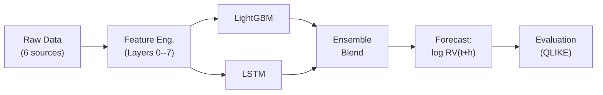

# Chapter 1: What We're Forecasting

Realized variance on day $t$ is $\operatorname{RV}_t = \sum_{i=1}^{M} r_{t,i}^2$, the sum of $M$ squared intraday returns sampled at 5-minute frequency (Andersen et al., 2003).
Our target is $\log \operatorname{RV}_{t+h}$ for horizons $h \in \{1, 5, 22\}$ trading days, where multi-day targets aggregate: $\operatorname{RV}_{t+1:t+h} = h^{-1}\sum_{j=1}^{h} \operatorname{RV}_{t+j}$.

## The Universe

The model is trained and evaluated on 35 instruments over 11.3 years of history (Jan 2012 to Mar 2023).

**Forecast universe: 35 instruments.**

| Category | Count | Examples |
|---|---|---|
| Mega-cap US equities | 30 | AAPL, MSFT, JPM, JNJ, XOM, AMZN |
| Broad-market ETFs | 4 | SPY, QQQ, IWM, DIA |
| Equity index futures | 1 | E-mini S&P 500 (ES) |
| **Total** | **35** | |

All RV series are computed from 5-minute returns using the realized kernel estimator of Barndorff-Nielsen et al. (2008), which corrects for microstructure noise.
Models are fit per-asset (no pooling across names).

## Success Criteria

The primary metric is QLIKE, a quasi-likelihood loss that penalizes relative forecast errors and is robust to noisy volatility proxies (Patton, 2011).
The formal definition appears in Chapter 13.

**Evaluation criteria.**

| Priority | Metric | Requirement |
|---|---|---|
| Primary | QLIKE | 30--80 bps improvement over HARQ baseline (Bollerslev et al., 2016), averaged across universe |
| Secondary | MSE, MAE | Reported alongside QLIKE for robustness |
| Secondary | Diebold-Mariano test | Statistically significant improvement ($p < 0.05$) vs. each baseline (Diebold & Mariano, 1995) |
| Tertiary | Economic value | Out-of-sample utility gain in a volatility-targeting portfolio (Moreira & Muir, 2017) |

## The High-Level Pipeline

The six raw data sources are: (i) tick-level trade prices, (ii) daily OHLCV, (iii) E-mini S&P 500 Level 2 order book, (iv) SPX implied volatility surface, (v) cross-asset prices (VIX, bonds, gold, oil, FX), and (vi) earnings and macro event calendars.

> **Key Idea: Features Over Models**
>
> The feature set matters more than the model.
> Layers 0--2 (approximately 20 features covering HAR components, jump decomposition, and signed volatility) achieve 85% of the forecasting accuracy attainable with the full 120-feature set.
