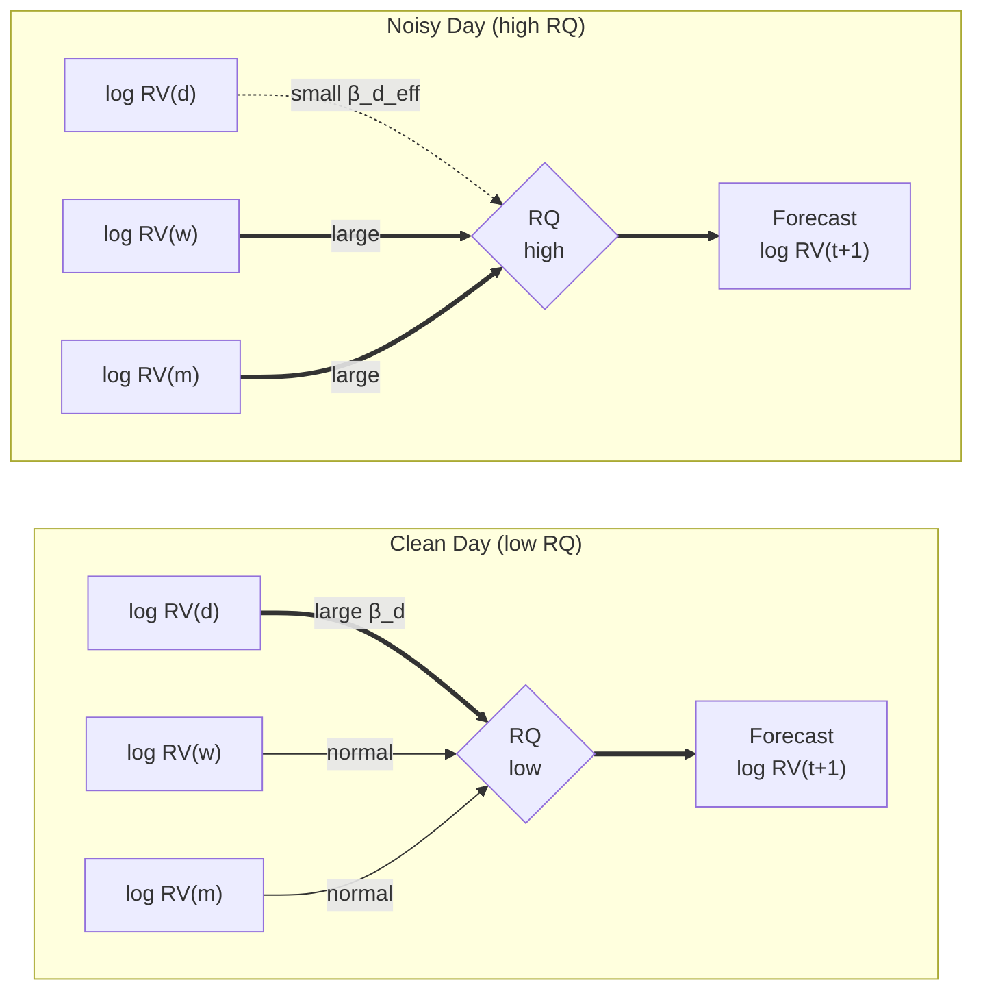

# Chapter 3: HAR Core and Measurement Quality

The HAR baseline and its noise-aware extension HARQ form Layer 0 of the feature pipeline.
Five features, three horizons, one interaction term.

## The Five Foundation Features

**Layer 0 feature set: the five foundation features.**

| Feature | Definition | Role in Forecast |
|---|---|---|
| $\log \operatorname{RV}_t^{(d)}$ | $\log \operatorname{RV}_t$ | Strongest single predictor; log transform gaussianizes the distribution |
| $\log \operatorname{RV}_t^{(w)}$ | $\log\!\bigl(\tfrac{1}{5}\sum_{i=0}^{4} \operatorname{RV}_{t-i}\bigr)$ | Medium-memory component; smooths daily noise |
| $\log \operatorname{RV}_t^{(m)}$ | $\log\!\bigl(\tfrac{1}{22}\sum_{i=0}^{21} \operatorname{RV}_{t-i}\bigr)$ | Long-memory regime anchor |
| $\operatorname{RQ}_t$ | $\dfrac{M}{3}\sum_{i=1}^{M} r_{t,i}^4$ | Measures how noisy today's $\operatorname{RV}$ estimate is |
| $\sqrt{\operatorname{RQ}_t} \cdot \operatorname{RV}_t^{(d)}$ | RQ interaction | Shrinks daily weight on noisy days; highest-impact HAR extension |

The baseline HAR model (Corsi, 2009) regresses future log-RV on three horizons:

$$
\log \operatorname{RV}_{t+1} = \beta_0
  + \beta_d \log \operatorname{RV}_t^{(d)}
  + \beta_w \log \operatorname{RV}_t^{(w)}
  + \beta_m \log \operatorname{RV}_t^{(m)}
  + \varepsilon_{t+1}.
$$

HARQ (Bollerslev et al., 2016) adds the RQ interaction to make the daily coefficient state-dependent:

$$
\log \operatorname{RV}_{t+1} = \beta_0
  + \bigl(\beta_d + \beta_{dQ}\sqrt{\operatorname{RQ}_t}\bigr)\log \operatorname{RV}_t^{(d)}
  + \beta_w \log \operatorname{RV}_t^{(w)}
  + \beta_m \log \operatorname{RV}_t^{(m)}
  + \varepsilon_{t+1}.
$$

The estimated $\hat{\beta}_{dQ}$ is consistently negative: on noisy days ($\operatorname{RQ}$ high), the effective daily coefficient $\beta_d + \beta_{dQ}\sqrt{\operatorname{RQ}_t}$ shrinks toward zero, shifting forecast weight to the weekly and monthly averages.

## The HARQ Shrinkage Mechanism

On clean days the daily reading dominates (thick arrow, left). On noisy days the RQ interaction shrinks the daily coefficient, shifting weight to weekly and monthly averages (thick arrows, right).

HARQ with five features consistently beats ML models that use dozens of features without noise-awareness (Bollerslev et al., 2016).
The mechanism is simple: when the daily RV estimate is unreliable, the model automatically falls back to longer-horizon averages that average out the noise.
This is the single most robust finding in the HAR literature, replicated across asset classes and sample periods.

## Baseline Performance

These five features alone explain 40--60% of next-day log-RV variation across typical equity and index series.
$\operatorname{RQ}$ requires tick-level returns; we have them for all 34 symbols in the universe (see Chapter 1 universe table).
This is the non-negotiable core of the feature pipeline.
Everything in Chapters 4--7 provides marginal improvement on top of this foundation.

**Expected QLIKE improvement from cumulative feature additions (indicative, based on literature benchmarks).**

| Layer | Feature Group | Cumulative QLIKE Gain |
|---|---|---|
| 0 | HAR (3 horizons) | Baseline |
| 0 | + RQ interaction (HARQ) | 5--15% |
| 1 | + Signed RV, jumps | 8--20% |
| 2 | + VRP, IV skew | 12--25% |
| 3 | + Microstructure (OBI) | 15--30% |

> **Warning: Work in Log-RV Space**
>
> Raw RV is right-skewed with heavy tails; log-RV is approximately Gaussian (Andersen et al., 2001).
> This affects loss functions, residual diagnostics, and model comparison.
> All features in this guide use log-RV unless stated otherwise.
> When computing QLIKE, convert back to levels: $\widehat{\operatorname{RV}}_{t+1} = \exp\!\bigl(\widehat{\log \operatorname{RV}}_{t+1} + \hat{\sigma}^2/2\bigr)$, where $\hat{\sigma}^2$ is the residual variance (bias correction for the log-normal retransformation).

> **Key Idea: RQ Interaction -- The Single Most Important HAR Extension**
>
> Adding the RQ interaction term to baseline HAR yields 5--15% QLIKE improvement from a single feature (Bollerslev et al., 2016).
> It is the highest-impact extension before adding any external data.
> Any ML model that does not account for measurement noise in daily RV leaves this gain on the table.
