# Chapter 5: Options-Implied Features

Layer 2 adds nine features extracted from the SPX implied volatility surface.
These are the first forward-looking inputs in the pipeline: they embed market expectations about future variance that backward-looking RV measures cannot capture.

## Features

**Layer 2 feature set: options-implied features from the SPX surface.**

| Feature | What It Is | Horizon Impact |
|---------|-----------|----------------|
| ATM IV (30-day) | Average of 50-delta put and call IVs from Marquee ERDVOL surface: $\operatorname{IV}_t^{\mathrm{ATM}} = \tfrac{1}{2}\bigl(\sigma_{50\Delta P} + \sigma_{50\Delta C}\bigr)$ | All horizons (Gu et al., 2020) |
| VRP | $\operatorname{VRP}_t = (\operatorname{IV}_t^{\mathrm{ATM}})^2 - \mathbb{E}_t[\operatorname{RV}_{t+1:t+22}]$, estimated using HAR forecast as the RV expectation | 1w--1m strongest (Bollerslev et al., 2009) |
| 25-Delta Risk Reversal | $\mathrm{RR}_t = \sigma_{25\Delta C} - \sigma_{25\Delta P}$; measures skew demand for downside protection | 1--5d |
| Term Structure Slope | $\mathrm{TS}_t = \operatorname{IV}_t^{3\mathrm{m}} - \operatorname{IV}_t^{1\mathrm{m}}$; positive in calm markets, inverts pre-crisis | 1w--1m |
| Butterfly | $\mathrm{BF}_t = \sigma_{25\Delta P} + \sigma_{25\Delta C} - 2\,\operatorname{IV}_t^{\mathrm{ATM}}$; measures tail thickness beyond skew | Crisis detection |
| VVIX | $\operatorname{VVIX}_t$: implied volatility of VIX options; vol-of-vol signal | 1--5d |
| VIX Term Structure | $\mathrm{VTS}_t = F_t^{3\mathrm{m}} / \mathrm{VIX}_t$; ratio $> 1$ = contango (calm), $< 1$ = backwardation (stress) | Regime signal |
| IV--RV Gap | $\mathrm{Gap}_t = \operatorname{IV}_t^{\mathrm{ATM}} - \sqrt{\operatorname{RV}_t^{(m)} \times 252}$; residual risk premium beyond VRP | 1--5d |
| Event-Implied Vol | Extracted from the surface around known event dates (FOMC, earnings); isolates the vol the market attributes to the event | Pre-event only |

## Horizon Dependence

Options-implied features contribute almost nothing at $h = 1$ but become the dominant source of marginal improvement at weekly and monthly horizons.

```mermaid
xychart-beta
    title "QLIKE Improvement from Layer 2 Options Features (%)"
    x-axis ["h=1", "h=5", "h=22"]
    y-axis "QLIKE improvement (%)" 0 --> 12
    bar [1.5, 6.5, 7.5]
    bar [3.0, 8.0, 10.0]
```

| Horizon | Options-implied gain | Upper bound | Range |
|---------|---------------------|-------------|-------|
| h=1 | 1.5% | 3.0% | 1--3% |
| h=5 | 6.5% | 8.0% | 5--8% |
| h=22 | 7.5% | 10.0% | 5--10% |

The mechanism is straightforward.
At $h = 1$, yesterday's RV is an excellent predictor of tomorrow's RV because volatility is persistent; options add little incremental information.
At $h = 5$ and $h = 22$, the daily signal decays, and the forward-looking content of options prices fills the gap.
Options embed expectations about scheduled events (FOMC, earnings, CPI) that backward-looking RV cannot see.

## What We Compute

The full SPX IV surface is sourced from Marquee `ERDVOL_PERCENT_STANDARD`.
This provides a complete tenor x delta grid from which all nine features are extracted.

The surface covers SPX only.
For individual equities, the options-implied features serve as market-wide regime signals (shared across all names in the universe), not stock-specific predictors.
This is consistent with the constraint noted in Chapter 2: no single-name IV surfaces are available.

## Cumulative Performance

With Layers 0--2 complete (HAR core, asymmetry/jumps, options-implied), the feature set contains approximately 20 features and captures roughly 85% of the forecasting accuracy achievable with the full 120-feature pipeline.
The remaining layers (microstructure, cross-asset, engineered interactions) provide diminishing marginal gains.

> **Key Idea: ML Advantage Grows with Horizon**
>
> At $h = 1$, HAR ties ML on $\operatorname{QLIKE}$.
> At $h = 5$ and $h = 22$, ML models with options-implied features deliver 10--20% $\operatorname{QLIKE}$ improvement over the best linear baseline.
> The advantage comes from nonlinear interactions between VRP, skew, and term structure that linear models cannot capture (Christensen et al., 2023).

> **Warning: VRP Requires a Realized Variance Forecast**
>
> The VRP is defined as $(\operatorname{IV})^2 - \mathbb{E}[\operatorname{RV}]$.
> The second term is itself a model output (typically HAR).
> Using VRP as an input feature creates a recursive dependency: the VRP feature quality depends on the baseline forecast quality.
> Use a simple, fixed HAR estimate for the RV expectation term, not the model being trained.
