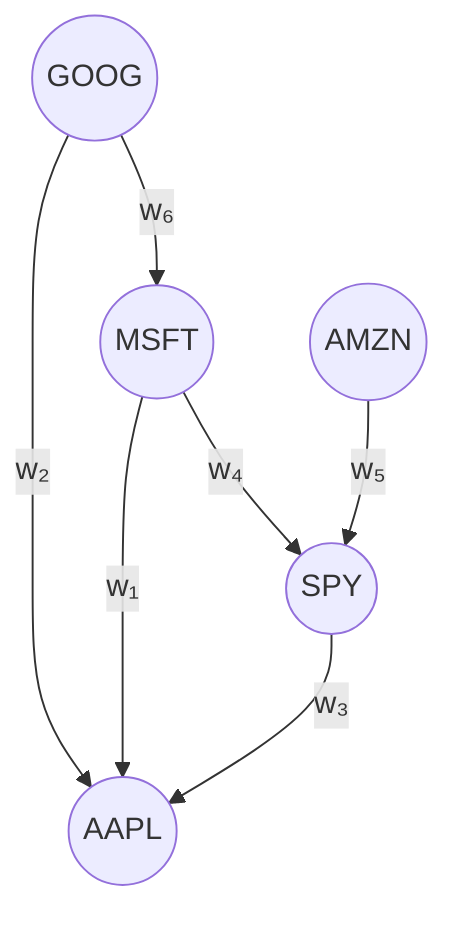

# Chapter 7: Cross-Asset Spillovers

Cross-asset features form Layer 4 of the feature pipeline.
They capture vol transmission across asset classes, adding 1--5% QLIKE improvement concentrated in regime transitions.

## Features

**Layer 4 feature set: cross-asset spillover signals.**

| Feature | What It Is | Mechanism |
|---------|-----------|-----------|
| Treasury slope change | $\Delta(\text{10y} - \text{2y yield})$ | Rate curve inversion precedes equity vol spikes by days |
| Credit spread momentum | $\Delta$ IG/HY spread or TY futures vol | Credit stress leads equity vol |
| FX vol (USD/JPY) | $\operatorname{RV}$ of USD/JPY | Yen carry unwind = global risk-off = equity vol spike |
| Commodity vol (CL, GC) | $\operatorname{RV}$ of crude oil + gold | Oil = macro uncertainty; gold = flight-to-safety intensity |
| DY Spillover Index | VAR(5) variance decomposition on 34-asset $\operatorname{RV}$ panel | Fraction of vol driven by cross-asset contagion; spikes in crises (Diebold and Yilmaz, 2012) |
| Sector-mean $\operatorname{RV}$ | Average $\operatorname{RV}$ across same-sector names | Filters idiosyncratic noise |
| VIX-equity corr. regime | Rolling 20-day $\operatorname{corr}(\Delta\text{VIX}, \text{SPX returns})$ | Near $-1$ normally; breaks during regime shifts |
| Cross-asset $\operatorname{RV}$ rank | Each asset's $\operatorname{RV}$ percentile relative to peers | Detects outlier dispersion regimes |

## Impact

Cross-asset features contribute 1--5% QLIKE improvement on average, but the gains concentrate in regime transitions where forecasts are most valuable and hardest to get right.
The improvement is small in calm markets and large in the tails: exactly when single-asset models break down, cross-asset signals provide early warning.

## Graph-HAR

Graph-HAR extends the standard HAR by adding a neighbor-weighted $\operatorname{RV}$ term:

$$
\log \operatorname{RV}_{i,t+1} = \beta_0 + \beta_d \log \operatorname{RV}_{i,t}^{(d)} + \beta_w \log \operatorname{RV}_{i,t}^{(w)} + \beta_m \log \operatorname{RV}_{i,t}^{(m)} + \gamma \sum_{k \neq i} W_{ik} \log \operatorname{RV}_{k,t} + \varepsilon_{i,t+1}.
$$

The term $\gamma \sum_k W_{ik} \log \operatorname{RV}_{k,t}$ captures how asset $i$'s vol tomorrow depends partly on its neighbors' vol today.
For example, AAPL's forecast improves by incorporating MSFT's realized vol when the two are tightly connected.
The weight matrix $W$ can be correlation-based (simple, static) or learned via a graph neural network (Zhang, Cucuringu, and Dong, 2023).

Each node is an asset; directed edges carry weights $w_k$ determining how much neighbor $\operatorname{RV}$ feeds into a given asset's forecast. Weights can be fixed (correlation) or learned (GNN).

> **Key Idea: DY Spillover Index as a Regime Detector**
>
> The Diebold and Yilmaz (2012) total spillover index measures the fraction of forecast-error variance attributable to cross-asset shocks.
> It runs at 30--40% in calm markets and spikes above 70% in crises (2008, 2020).
> As a feature, its level signals contagion intensity; its rate of change signals regime entry/exit.

> **Warning: Nonsynchronous Trading Across Asset Classes**
>
> Bonds, FX, and commodities trade on different schedules than equities.
> Naive daily alignment introduces stale-price bias that inflates apparent lead-lag relationships.
> Use overlap-window $\operatorname{RV}$ (common trading hours only) or the Hayashi-Yoshida estimator for cross-asset covariance.

## GS Advantage

Synchronized tick data across asset classes (equities, futures, FX, treasuries) enables intraday lead-lag detection at minute-level granularity.
Academic papers rely on daily closes, making sub-day cross-asset transmission invisible and leaving the strongest spillover signals unexploited.
