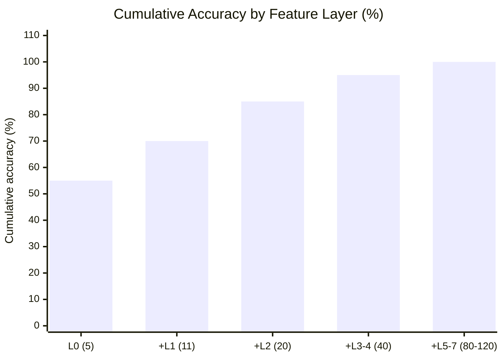

# Chapter 8: Feature Composition and Selection

This chapter synthesizes Layers 0--4 (Chapters 3--7), adds the remaining layers (calendar, memory, sentiment), and provides the decision framework for which features to use at each forecast horizon.

## Calendar, Memory, and Sentiment (Layers 5--7)

Layers 5--7 are individually weak but collectively additive.
They are the last 5% of achievable accuracy.

### Layer 5: Calendar Features

**Calendar features and when they matter.**

| Feature | When It Matters |
|---------|----------------|
| FOMC indicator ($-1, 0, +1, +2$ days) | Vol compression before announcement, expansion after |
| NFP/CPI indicator | Macro release effect on intraday and next-day vol |
| Options expiry (monthly/quarterly) | Pinning and gamma unwind |
| Quarter-end rebalancing | Last 3 days of quarter; forced portfolio flows |
| Earnings proximity | Days to next earnings release (single names only) |
| Time-of-day | U-shape: open and close have highest vol |
| Day-of-week | Weakening over time but still detectable |

### Layer 6: Memory Features

**Memory features capturing long-range dependence and regime state.**

| Feature | What It Is |
|---------|-----------|
| Fractionally differenced $\operatorname{RV}$ | $(1-L)^d \operatorname{RV}$ with $d \approx 0.35$--$0.45$; preserves long memory while stationary (Lopez de Prado, 2018) |
| Rolling Hurst exponent | $H < 0.15$ = rough/fast mean-reversion; $H > 0.3$ = trending (Gatheral, Jaisson, and Rosenbaum, 2018) |
| Vol-of-vol | $\operatorname{std}(\operatorname{RV})$ over last 22 days; measures instability of the vol process |
| Regime duration | Days since last $2\sigma$ $\operatorname{RV}$ spike; acts as a mean-reversion clock |

### Layer 7: Sentiment

FinBERT news sentiment and negative news count provide 1--3% $\operatorname{QLIKE}$ improvement, concentrated in crisis periods (Audrino, Sigrist, and Ballinari, 2020).
Include these features only if the data pipeline effort is justified by the target asset class.
For index-level forecasts (SPX, SPY), sentiment adds less value than for single names with idiosyncratic news flow.

## The Diminishing Returns Curve

The dashed line at 85% marks the threshold achievable with Layers 0--2 and a Ridge regression. The first 20 features (Layers 0--2) achieve 85% of attainable accuracy; the remaining 60--100 features add 15%.

## Feature Priority by Forecast Horizon

**Dominant features and ML value-add by forecast horizon.**

| Horizon | Dominant Features | Where ML Adds Value |
|---------|-------------------|---------------------|
| Intraday (10min--1hr) | Microstructure (L3): price acceleration, OBI, spread | Trees with 600+ features |
| 1 day | HAR core (L0) + RQ + asymmetry (L1) | HARQ nearly optimal; ML adds ~5% |
| 1 week | Options (L2) + cross-asset (L4) | VRP + skew: 5--10% over pure RV models |
| 1 month | VRP (L2) + macro (L4) + Hurst (L6) | Options have max informational advantage |

> **Warning: The 1-Day Horizon Is the Hardest to Beat**
>
> At the 1-day horizon, HARQ with 5 features is nearly optimal.
> ML models gain ~5% $\operatorname{QLIKE}$ improvement at best, and much of that comes from the RQ interaction that HARQ already captures.
> The largest ML gains are at intraday and weekly+ horizons where linear models lack the capacity to exploit high-dimensional feature sets.

## Feature Engineering Principles

- **Triple expansion.** For each base quantity, compute {level, change, $z$-score} systematically. This triples the feature count and captures state, direction, and unusualness in a single pass.

- **Horizon-dependent selection.** Drop microstructure features at the monthly horizon (noise at that scale). Drop calendar features at intraday (FOMC day is already known by 9:30am). Match the feature set to the prediction target.

- **Trees handle redundancy naturally.** Correlated features split across nodes without the multicollinearity problems that plague linear models. No need to pre-decorrelate or drop correlated pairs before training a gradient-boosted ensemble.

- **Feature importance from a single model is unstable.** When features are redundant, a single LightGBM run produces noisy importance rankings that shift across random seeds. Rashomon analysis (Chapter 12) addresses this by examining the set of near-optimal models rather than one point estimate.
