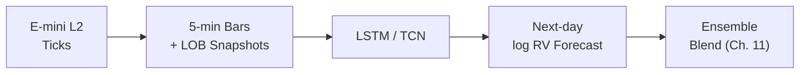

# Chapter 10: LSTM for Intraday Sequences

The second model branch operates on sequential intraday data rather than daily tabular features.
E-mini S&P 500 Level 2 tick data (~4M ticks/day) is compressed into 5-minute (or 1-minute) return bars, each augmented with a limit-order-book snapshot.
One training sample is one full trading day's bar sequence.
The model's sole task is to produce an independent next-day $\log \operatorname{RV}$ forecast from this intraday structure.

## Architecture

1. A small LSTM (or TCN) consumes the intraday E-mini sequence for each trading day.
2. Input per time step: 5-min log-return plus LOB snapshot features (bid-ask spread, depth imbalance, trade imbalance, mid-price change).
3. Output: a single scalar, the next-day $\log \operatorname{RV}$ forecast, produced from the final hidden state via a linear head.
4. This forecast is blended with LightGBM's forecast at the prediction level (Chapter 11).

**Baseline sequence model specifications.**

| Component | LSTM variant | TCN variant |
|---|---|---|
| Layers | 2 | 4 dilated causal conv blocks |
| Hidden dim | 64--128 | 64 channels |
| Sequence length | 78 bars (5-min, full day) | 78 bars |
| Dropout | 0.2 | 0.2 (spatial) |
| Loss | QLIKE on $\log \operatorname{RV}$ | QLIKE on $\log \operatorname{RV}$ |
| Optimizer | AdamW, cosine LR | AdamW, cosine LR |

## Embedding Alternative

Instead of producing an independent forecast, the LSTM can export its last-layer hidden state as a fixed-length embedding vector and feed it into LightGBM as additional tabular features (feature-level stacking).
Competition evidence from Optiver (Optiver, 2021) favors prediction-level blending over feature-level stacking, but both approaches should be compared on our data.
The embedding path also risks gradient isolation: LightGBM cannot back-propagate into the LSTM, so the embedding is not trained end-to-end for the tabular objective.

## Why Deep Learning Here

Four million ticks per day is too rich for hand-engineered aggregations alone to capture fully.
Temporal order within the day carries signal: acceleration patterns in returns, depth shifts preceding volatility spikes, and intraday momentum reversals are sequential phenomena that trees cannot exploit from summary statistics.
This is the one place in the pipeline where deep learning genuinely adds value over gradient-boosted trees.
Optiver competitors worked with 10-minute windows (short sequences where hand-crafted features captured most of the information); our full-day sequences are substantially richer and harder to summarize manually.

> **Warning: Diminishing Returns**
>
> The LSTM branch will almost certainly contribute less marginal accuracy than the top 20 tabular features in LightGBM.
> Its value is in capturing residual sequential patterns that tabular aggregations miss, not in replacing the tabular model.
> Invest proportional effort: get the tabular pipeline right first.

> **Key Idea: DL for Sequences, Trees for Tables**
>
> The LSTM operates on sequential intraday data where temporal order matters.
> LightGBM operates on tabular daily features.
> Each model gets the data format it handles best.
> They combine at the prediction level (Chapter 11).
