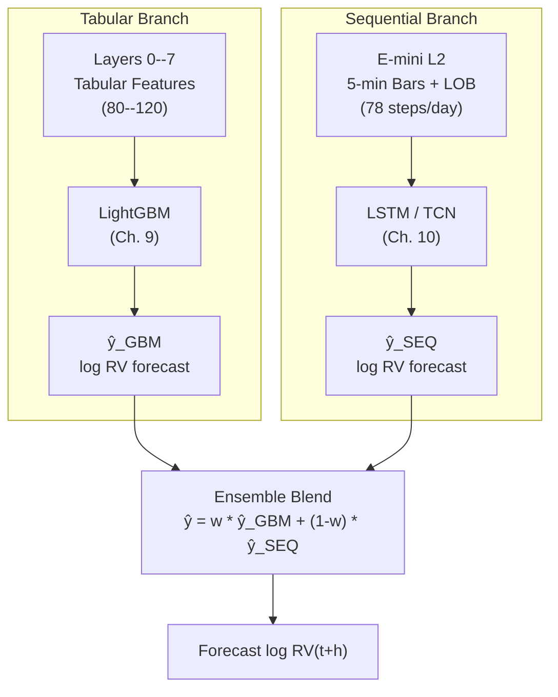

# Chapter 11: The Ensemble

The pipeline has two model branches: LightGBM (Chapter 9) consuming 80--120 tabular features from Layers 0--7, and an LSTM/TCN (Chapter 10) consuming intraday E-mini L2 sequences.
Each branch produces an independent $\log \operatorname{RV}_{t+h}$ forecast.
These forecasts are combined at the prediction level into a single blended output.

## Architecture

## Prediction-Level Blending

We blend model *outputs*, not internal representations.
Feature-level stacking (feeding LSTM embeddings as LightGBM inputs) breaks gradient isolation and couples model debugging; top-performing Optiver and AmEx Kaggle solutions consistently found that blending independent predictions outperforms feature-level fusion (Optiver, 2021).
Blend weights can be static (equal weighting, or a fixed ratio tuned to minimize $\operatorname{QLIKE}$ on the validation set) or dynamic (regime-dependent, shifting weight toward the sequential branch during high-microstructure-activity periods).
Start with simple validation-tuned static weights; add regime conditioning only if it improves out-of-sample $\operatorname{QLIKE}$.

> **Warning: Do Not Stack Features**
>
> Feeding the LSTM's hidden-state embedding into LightGBM as extra columns is tempting but counterproductive.
> LightGBM cannot back-propagate into the LSTM, so the embedding is never optimized for the tabular objective.
> Debugging also becomes harder: a degradation in the blend could originate in either model or in the coupling layer.
> Keep the branches independent.

## Why Two Branches

LightGBM dominates tabular volatility benchmarks (Chapters 3--8 features).
LSTM/TCN captures sequential intraday microstructure that tabular summary statistics cannot represent.
Giving each model the data format it handles best, then combining, extracts more signal than forcing either model to do both jobs.

> **Key Idea: Blend Predictions, Not Features**
>
> Each model gets the data format it handles best: trees for tabular, recurrent/convolutional networks for sequences.
> Combining their independent forecasts at the prediction level outperforms feeding one model's internals into the other.
