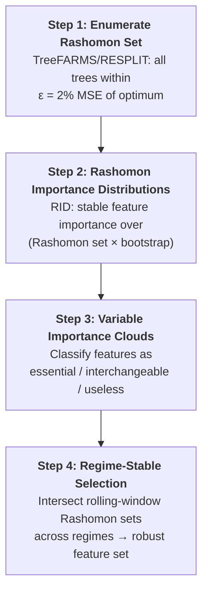

# Chapter 12: Interpretable Trees and Rashomon Analysis

LightGBM is a black box.
For the GS presentation, we need an interpretable model that can be inspected and defended.
Optimal decision trees provide this, and Rashomon analysis reveals which features are genuinely important across the set of near-optimal models.

## Optimal Decision Trees

We train a `STreeDPiecewiseLinearRegressor` from `pystreed` on the same Layers 0--7 features used by LightGBM (Chapter 9).

**Optimal decision tree configuration.**

| **Parameter** | **Value** | **Notes** |
|---|---|---|
| Solver | STreeD | DP with elastic-net leaves |
| Max depth | 4--5 | Tuned via purged blocked $k$-fold CV |
| Leaf count | 8--32 | Cost-complexity regularization controls this |
| Leaf model | Elastic net | Ridge + lasso per leaf partition |
| Cost-complexity | CV-tuned | Penalizes $|\text{leaves}(T)|$ |
| Features | Layers 0--7 | Same panel as LightGBM |
| Target | $\log \operatorname{RV}_{t+h}$ | $h \in \{1, 5, 22\}$ |

Each leaf fits a local elastic-net regression on the features routed to it, so the tree is piecewise-linear rather than piecewise-constant.
This gives better accuracy than a constant-leaf tree while remaining fully inspectable: every prediction traces to one root-to-leaf path plus a short linear formula.

Expected accuracy relative to benchmarks:

- ~2--5% higher MSE than tuned LightGBM (acceptable for interpretability).
- ~10% lower MSE than $\operatorname{HAR}$ baseline.
- Comfortably inside the Model Confidence Set when evaluated by $\operatorname{QLIKE}$.

> **Warning: Binarization Trap**
>
> GOSDT and the original TreeFARMS require binary features.
> Binarizing continuous vol features (e.g., 50 threshold candidates per feature $\times$ 40 features $= 2{,}000$ binary columns) destroys information and inflates runtime exponentially.
> Use `STreeDPiecewiseLinearRegressor`, which splits on continuous features natively.

## Rashomon Analysis Pipeline

The Rashomon set is the collection of all models whose loss is within $\epsilon$ of the optimum.
For decision trees, this set can be enumerated exactly (Xin et al., 2022).

**Step 1.**
TreeFARMS (Xin et al., 2022) enumerates every sparse decision tree within $\epsilon = 2\%$ MSE of the optimal tree.
For the vol feature panel (~40 base features, ~5,000 rows, depth 4--5), expect $10^3$--$10^5$ trees in the Rashomon set.
RESPLIT (or SPLIT) provides a faster alternative if enumeration is slow.

**Step 2.**
RID (Donnelly et al., 2023) computes a stable importance distribution for each feature across the entire Rashomon set, bootstrapped for confidence intervals.
Unlike single-model $\operatorname{SHAP}$ or permutation importance, RID has consistency theorems and finite-sample error rates.

**Step 3.**
Variable Importance Clouds (Dong and Rudin, 2020) map each feature to its $[\min, \max]$ importance range across the Rashomon set.
Non-overlapping clouds indicate robustly distinct features; overlapping clouds indicate substitutes.

**Step 4.**
Train Rashomon sets on rolling windows (e.g., 5-year training, 1-year step).
Intersect the sets across windows: features appearing in *every* regime's Rashomon set are regime-stable; features appearing in only one regime are fragile.

## What This Tells Us

- **Genuine importance vs. accidental selection.**
  Single-model importance (gain, permutation, $\operatorname{SHAP}$) is unstable when features are near-substitutes.
  RID and VIC identify which features are robustly important across all defensible models.

- **Feature substitution structure.**
  VIX, $\operatorname{VVIX}$, ATM IV, and the IV--RV spread are near-collinear proxies for the same latent factor.
  Rashomon analysis reveals which are essential (appear in every near-optimal tree), which are interchangeable (substitutable without accuracy loss), and which are useless (in no near-optimal tree).

- **Prediction multiplicity.**
  For any input, the range of forecasts across all Rashomon-set trees quantifies prediction uncertainty due to model choice alone.
  Report the $[5\text{th}, 95\text{th}]$ percentile forecast range alongside the point forecast for risk reporting.

- **Post-hoc constraint satisfaction.**
  Filter the Rashomon set for trees that satisfy additional constraints (monotone in VIX, exclude flagged features, $\leq 12$ leaves) without retraining.
  If a compliant tree exists in the set, use it directly.

## Evaluation

**Evaluation protocol for interpretable trees and Rashomon analysis.**

| **Component** | **Protocol** |
|---|---|
| Accuracy metrics | Walk-forward MSE, $\operatorname{QLIKE}$, MAE on $\log \operatorname{RV}_{t+1}$ |
| Baselines | $\operatorname{HAR}$, HARQ, LightGBM (Chapter 9) |
| Statistical tests | Diebold--Mariano (Diebold and Mariano, 1995) pairwise tests; Model Confidence Set |
| Acceptable gap | Optimal tree within 5% MSE of LightGBM; must beat $\operatorname{HAR}$ by $\geq$8% |
| Regime stress test | Rashomon prediction range during Mar 2020, Volmageddon (Feb 2018); report $[5, 95]$ percentile spread |
| Multiplicity audit | Fraction of test days where Rashomon-set forecast range spans $>$1 $\operatorname{QLIKE}$ unit |
| Feature stability | Jaccard similarity of top-10 RID features across rolling windows |

The interpretable tree's accuracy trade-off is acceptable if:
(1) it remains in the Model Confidence Set alongside LightGBM, and
(2) the Rashomon prediction range narrows after regime-stable feature selection, confirming that the selected features reduce model ambiguity.

## Novelty

No published paper has applied Rashomon methods to any financial time-series problem.
The closest applications are cross-sectional credit risk (FICO HELOC dataset) and criminal justice (COMPAS recidivism).
Applying Rashomon-set enumeration, RID, and Variable Importance Clouds to realized volatility forecasting is the novel research contribution of this project.

> **Key Idea: The Novel Contribution**
>
> Rashomon analysis answers: are my features robustly important, or did my model just pick one out of several interchangeable options?
> This is the novel research contribution.
