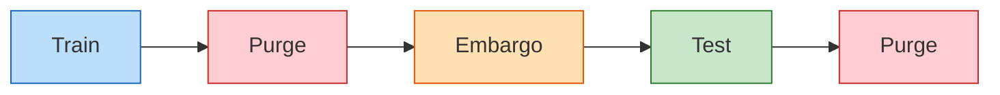
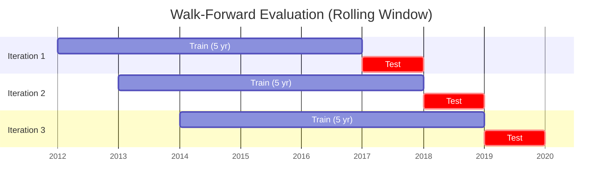
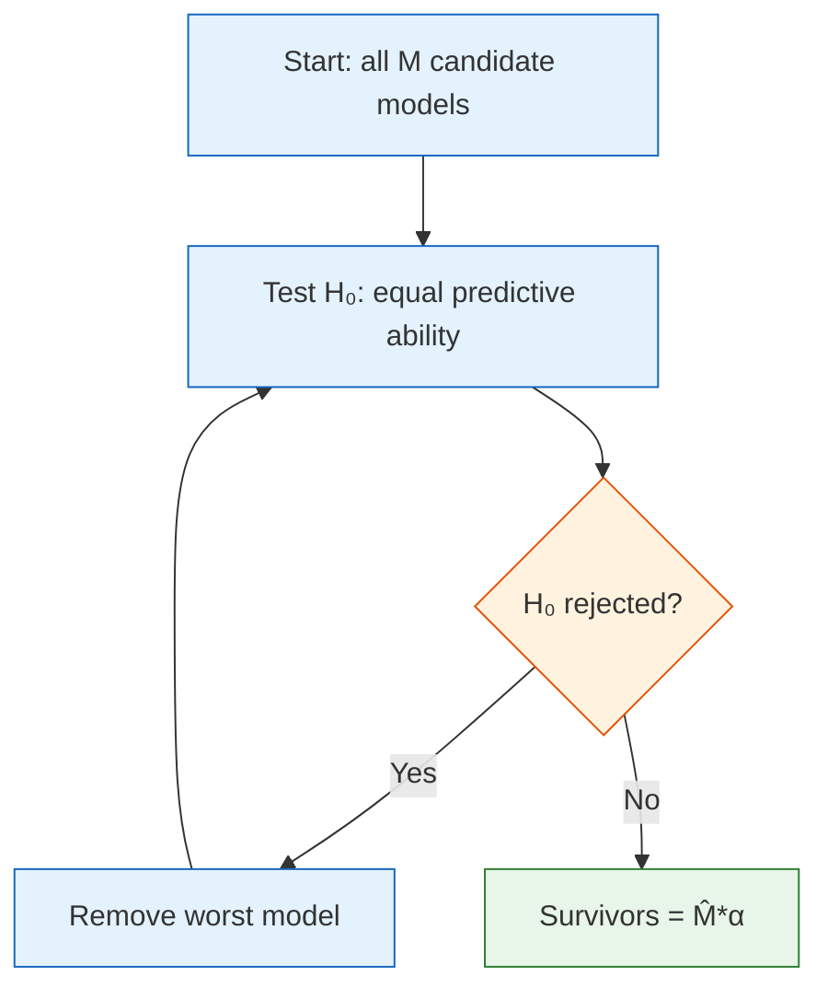
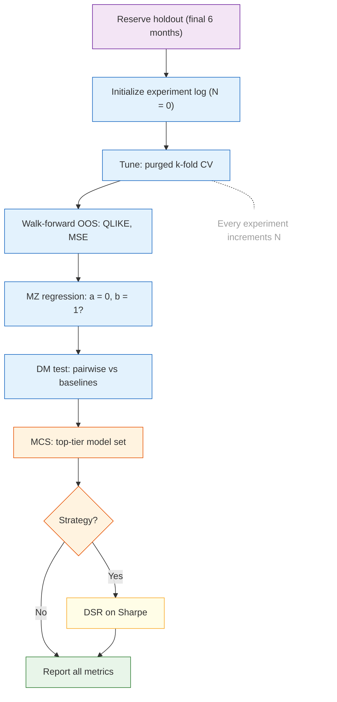

# Chapter 13: Evaluation

This chapter defines how forecasts are scored, how models are compared, and what "better" means quantitatively.

## 13.1 Metrics

**Table 13.1: Forecast evaluation metrics.**

| Metric | What It Measures | Role |
|--------|-----------------|------|
| $\operatorname{QLIKE}$ | Quasi-likelihood loss; penalizes relative forecast errors | Primary |
| MSE | Mean squared error on $\log$-$\operatorname{RV}$ | Secondary |
| MAE | Mean absolute error on $\log$-$\operatorname{RV}$ | Robustness check |
| Diebold--Mariano test | Statistical significance of pairwise forecast differences | "Is model A better than B?" |
| Model Confidence Set | Set of models not significantly worse than the best | "Which models are top tier?" |

The primary loss function is $\operatorname{QLIKE}$:

$$
\operatorname{QLIKE} = \frac{1}{T} \sum_{t=1}^{T} \left( \frac{\hat{\sigma}_t^2}{\sigma_t^2} - \log \frac{\hat{\sigma}_t^2}{\sigma_t^2} - 1 \right)
$$

$\operatorname{QLIKE}$ penalizes relative errors, not absolute ones.
It ranks forecasters consistently even when $\operatorname{RV}$ is measured with noise, because it belongs to the class of loss functions that are robust to imperfect volatility proxies (Patton, 2011).

> **Key Idea: $\operatorname{QLIKE}$ Is the Only Loss That Matters for Ranking**
>
> $\operatorname{QLIKE}$ is the primary metric for all model selection and comparison decisions.
> MSE and MAE serve only as secondary diagnostics.
> The Diebold--Mariano test (Diebold and Mariano, 1995) confirms whether a $\operatorname{QLIKE}$ difference is statistically significant; the Model Confidence Set (Hansen, Lunde, and Nason, 2011) identifies which models belong to the top tier.

## 13.2 Validation Protocol

### 13.2.1 Purged k-Fold CV with Embargo

Standard cross-validation leaks information in time series because observations near fold boundaries share overlapping feature windows.
Purged CV removes observations within the purge window on both sides of the train/test boundary.
An embargo adds a further gap after each test fold to prevent label leakage from multi-day targets (Lopez de Prado, 2018).

*Purge and Embargo zones between Train and Test contain no data used. The sequence flows left to right along a time axis.*

We use purged 5-fold CV for hyperparameter tuning.
Purge window: equal to the longest feature lookback (22 trading days for the monthly HAR component).
Embargo window: equal to the forecast horizon (1 or 5 days).

### 13.2.2 Walk-Forward Evaluation

Walk-forward is the primary out-of-sample evaluation method.
Train on a rolling 5-year window, forecast the next period, step forward by one period, and repeat.
All reported $\operatorname{QLIKE}$ numbers come from this procedure, never from in-sample or CV scores.

## 13.3 Success Target

Three criteria define success:

1. **$\operatorname{QLIKE}$ improvement:** 30--80 bps over the HARQ baseline (Bollerslev, Patton, and Quaedvlieg, 2016), averaged across the 35-instrument universe.
2. **Statistical significance:** Diebold--Mariano $p < 0.05$ vs. each baseline (HAR, HARQ, SHAR, Realized GARCH).
3. **Economic value:** Positive out-of-sample utility gain in a volatility-targeting portfolio (Moreira and Muir, 2017).

> **Warning: Train with $\operatorname{QLIKE}$, Not MSE**
>
> MSE is dominated by extreme volatility days.
> A single crisis observation can flip MSE rankings.
> $\operatorname{QLIKE}$ penalizes relative forecast errors and ranks models consistently regardless of the volatility regime (Patton, 2011).
>
> LightGBM does not provide a built-in $\operatorname{QLIKE}$ loss.
> Training requires a custom objective that returns both the gradient and Hessian of the $\operatorname{QLIKE}$ loss with respect to the predicted value (see [Chapter 9](ch09-lightgbm.md), Section 9.3).
> If you train with MSE and evaluate with $\operatorname{QLIKE}$, the model optimizes the wrong surface and rankings will not transfer.

## 13.4 Retransformation Bias

Models forecast in $\log$-$\operatorname{RV}$ space, but $\operatorname{QLIKE}$ and downstream applications require level-space forecasts.

Naive exponentiation is biased low by Jensen's inequality because $\mathbb{E}[\exp(X)] > \exp(\mathbb{E}[X])$ for any non-degenerate random variable.
The correction is:

$$
\widehat{\operatorname{RV}}_{t+1} = \exp\!\left(\widehat{\log \operatorname{RV}}_{t+1} + \hat{\sigma}^2_\varepsilon / 2\right)
$$

where $\hat{\sigma}^2_\varepsilon$ is the variance of log-space forecast errors, estimated from a rolling 60-day OOS window.

**Table 13.2: Approximate retransformation bias by forecast horizon.**

| Horizon | Bias (without correction) |
|---------|--------------------------|
| $h = 1$ | ~4% |
| $h = 5$ | ~10% |
| $h = 22$ | ~19% |

> **Key Idea: Apply Before Level-Space $\operatorname{QLIKE}$**
>
> Apply the correction before computing level-space $\operatorname{QLIKE}$.
> Without it, every forecast is systematically low, the bias grows with horizon, and the MZ regression (Section 13.5) will show $a > 0$.

## 13.5 Mincer--Zarnowitz Regression

$\operatorname{QLIKE}$ tells you which model wins; the MZ regression tells you *why* a forecast is bad.

$$
\sigma^2_t = a + b \cdot h_t + \varepsilon_t
$$

where $\sigma^2_t$ is realized variance and $h_t$ is the forecast.
An efficient forecast satisfies $a = 0$, $b = 1$.

**Table 13.3: MZ regression diagnostics.**

| Pattern | Diagnosis | Fix |
|---------|-----------|-----|
| $a > 0,\; b \approx 1$ | Systematic under-prediction | Check retransformation bias |
| $a \approx 0,\; b < 1$ | Forecast too smooth | Increase reactivity to recent $\operatorname{RV}$ |
| $a \approx 0,\; b > 1$ | Forecast too volatile | Regularize or increase shrinkage |
| $a = 0,\; b = 1$ | Efficient forecast | Report $R^2$ |

Test the joint hypothesis $H_0\colon a = 0,\; b = 1$ with an $F$-test.

> **Warning: Use HAC Standard Errors**
>
> Use Newey--West (HAC) standard errors.
> Vol forecast errors are serially correlated; OLS standard errors are too small and reject $H_0$ too often.

## 13.6 Diebold--Mariano Test

A $\operatorname{QLIKE}$ improvement means nothing without a $p$-value.

Define the loss differential:

$$
d_t = L(\sigma^2_t,\, h^A_t) - L(\sigma^2_t,\, h^B_t)
$$

The test statistic is:

$$
\mathrm{DM} = \frac{\bar{d}}{\sqrt{\widehat{\mathrm{Var}}(\bar{d})}}
$$

with Newey--West HAC variance estimator, bandwidth $\ell = \lfloor T^{1/3} \rfloor$.
Under $H_0$ of equal predictive ability, $\mathrm{DM} \xrightarrow{d} \mathcal{N}(0,1)$.
Reject if $|\mathrm{DM}| > 1.96$ at 5%.

> **Key Idea: Every $\operatorname{QLIKE}$ Comparison Needs a DM $p$-Value**
>
> Run pairwise: ML vs HAR, ML vs HARQ, ML vs SHAR, ML vs Realized GARCH.
> If $p > 0.05$, the improvement is not credible.

> **Warning: Small-Sample Correction**
>
> With $T < 100$, use the Harvey--Leybourne--Newbold correction (Harvey, Leybourne, and Newbold, 1997): replace $\mathcal{N}(0,1)$ with $t_{T-1}$ and apply the finite-sample correction factor.

## 13.7 Model Confidence Set

The DM test compares two models.
The MCS compares all of them simultaneously without inflating the false-positive rate.

**Procedure:**

1. Start with the full model set $\mathcal{M}_0$.
2. Test $H_0$: all models in the current set have equal expected loss.
3. If rejected, remove the worst model (highest average loss).
4. Repeat until $H_0$ is not rejected; survivors form $\widehat{\mathcal{M}}^*_\alpha$.

The MCS $p$-value for each model is the smallest $\alpha$ at which the model is excluded.
Report it for every model.

**Table 13.4: MCS reporting template.**

| Model | $\operatorname{QLIKE}$ | DM vs HARQ | MCS $p$ | In MCS$_{90\%}$? |
|-------|----------|------------|---------|-------------------|
| LightGBM (L0--2) | --- | --- | --- | --- |
| HARQ | --- | baseline | 1.000 | Yes |
| HAR | --- | --- | --- | --- |
| SHAR | --- | --- | --- | --- |
| Realized GARCH | --- | --- | --- | --- |

> **Key Idea: The Credibility Test**
>
> The MCS is the credibility test for the presentation.
> If LightGBM and plain HAR both survive in the 90% MCS, you cannot claim ML superiority.
> If HAR is excluded and LightGBM survives, that is defensible.
> Use `arch.bootstrap.MCS` in Python.

*Figure 13.1: MCS elimination procedure.*

## 13.8 Deflated Sharpe Ratio

If the forecast feeds a trading strategy, the backtest Sharpe must survive correction for the number of configurations tested.

Testing $N$ strategies inflates the expected best Sharpe.
Under pure luck, $\mathbb{E}[\max_i \operatorname{SR}_i] \approx \sqrt{2 \ln N}$; for $N = 20$ this is $\approx 2.45$.

$$
\operatorname{DSR} = \Phi\!\left(\frac{(\widehat{\operatorname{SR}} - \operatorname{SR}_0)\sqrt{T-1}}{\sqrt{1 - \hat{\gamma}_3 \widehat{\operatorname{SR}} + \frac{\hat{\gamma}_4 - 1}{4}\widehat{\operatorname{SR}}^2}}\right)
$$

where $\widehat{\operatorname{SR}}$ is the observed annualized Sharpe, $\operatorname{SR}_0 = \sqrt{2\ln N}$ is the luck threshold, $T$ is the number of return observations, $\hat{\gamma}_3$ is skewness, and $\hat{\gamma}_4$ is kurtosis.

Decision: $\operatorname{DSR} > 0.95$ is credible.

> **Warning: Every Experiment Counts**
>
> Every experiment counts as a trial.
> Every hyperparameter grid point, every feature set, every quick look increments $N$.
> Log experiments from day one.

## 13.9 Evaluation Pitfalls

Six errors that invalidate results.

> **Warning: What Invalidates Your Results**
>
> 1. **Random $k$-fold on time series.** Trains on the future. Always purged CV or walk-forward.
> 2. **$\operatorname{QLIKE}$ improvement without DM test.** A 3% gain with $p = 0.12$ is noise.
> 3. **Sharpe without DSR.** A Sharpe of 1.5 from 20 experiments is below the luck threshold.
> 4. **Training on one regime, testing on another.** 2015--2019 train, 2020 test is a stress test, not general evaluation.
> 5. **Lookahead in features.** Day-$t$ VIX close for day-$t$ $\operatorname{RV}$ is look-ahead. All features must precede the forecast cutoff ([Chapter 15](ch15-pipeline.md)).
> 6. **Tiny improvements without economic significance.** 0.5% $\operatorname{QLIKE}$ gain is statistically real but economically meaningless after costs.

## 13.10 Evaluation Workflow

Every forecasting experiment follows this pipeline.

> **Key Idea: No Guarantees, Only Evidence**
>
> This workflow does not guarantee a good forecast.
> It guarantees that if you find one, the evidence survives review.

*Figure 13.2: Evaluation workflow. Every forecasting experiment follows this pipeline end to end.*

**Table 13.5: Evaluation toolkit summary.**

| Tool | Question It Answers | Reference |
|------|-------------------|-----------|
| $\operatorname{QLIKE}$ | Which forecast has lower loss? | Patton (2011) |
| Retransformation | Is my level-space forecast biased? | Patton (2011) |
| Mincer--Zarnowitz | Is the forecast calibrated? | Mincer and Zarnowitz (1969) |
| Diebold--Mariano | Is the improvement significant? | Diebold and Mariano (1995) |
| Model Confidence Set | Which models are top tier? | Hansen, Lunde, and Nason (2011) |
| Purged $k$-fold CV | Am I leaking future info? | Lopez de Prado (2018) |
| Deflated Sharpe | Is the backtest Sharpe real? | Bailey and Lopez de Prado (2014) |
