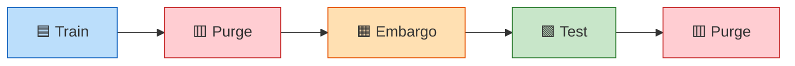
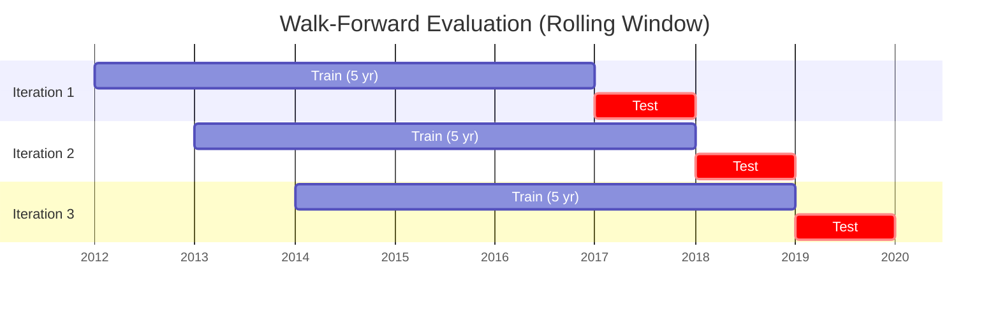

# Chapter 13: Evaluation

This chapter defines how forecasts are scored, how models are compared, and what "better" means quantitatively.

## Metrics

**Forecast evaluation metrics.**

| Metric | What It Measures | Role |
|--------|-----------------|------|
| $\operatorname{QLIKE}$ | Quasi-likelihood loss; penalizes relative forecast errors | Primary |
| MSE | Mean squared error on $\log$-$\operatorname{RV}$ | Secondary |
| MAE | Mean absolute error on $\log$-$\operatorname{RV}$ | Robustness check |
| Diebold--Mariano test | Statistical significance of pairwise forecast differences | "Is model A better than B?" |
| Model Confidence Set | Set of models not significantly worse than the best | "Which models are top tier?" |

The primary loss function is $\operatorname{QLIKE}$:

$$
\operatorname{QLIKE} = \frac{1}{T} \sum_{t=1}^{T} \left( \frac{\hat{\sigma}_t^2}{\sigma_t^2} - \log \frac{\hat{\sigma}_t^2}{\sigma_t^2} - 1 \right)
$$

$\operatorname{QLIKE}$ penalizes relative errors, not absolute ones.
It ranks forecasters consistently even when $\operatorname{RV}$ is measured with noise, because it belongs to the class of loss functions that are robust to imperfect volatility proxies (Patton, 2011).

> **Key Idea: $\operatorname{QLIKE}$ Is the Only Loss That Matters for Ranking**
>
> $\operatorname{QLIKE}$ is the primary metric for all model selection and comparison decisions.
> MSE and MAE serve only as secondary diagnostics.
> The Diebold--Mariano test (Diebold and Mariano, 1995) confirms whether a $\operatorname{QLIKE}$ difference is statistically significant; the Model Confidence Set (Hansen, Lunde, and Nason, 2011) identifies which models belong to the top tier.

## Validation Protocol

### Purged k-Fold CV with Embargo

Standard cross-validation leaks information in time series because observations near fold boundaries share overlapping feature windows.
Purged CV removes observations within the purge window on both sides of the train/test boundary.
An embargo adds a further gap after each test fold to prevent label leakage from multi-day targets (Lopez de Prado, 2018).

Purge and Embargo zones between Train and Test contain no data used. The sequence flows left to right along a time axis.

We use purged 5-fold CV for hyperparameter tuning.
Purge window: equal to the longest feature lookback (22 trading days for the monthly HAR component).
Embargo window: equal to the forecast horizon (1 or 5 days).

### Walk-Forward Evaluation

Walk-forward is the primary out-of-sample evaluation method.
Train on a rolling 5-year window, forecast the next period, step forward by one period, and repeat.
All reported $\operatorname{QLIKE}$ numbers come from this procedure, never from in-sample or CV scores.

## Success Target

Three criteria define success:

1. **$\operatorname{QLIKE}$ improvement:** 30--80 bps over the HARQ baseline (Bollerslev, Patton, and Quaedvlieg, 2016), averaged across the 35-instrument universe.
2. **Statistical significance:** Diebold--Mariano $p < 0.05$ vs. each baseline (HAR, HARQ, SHAR, Realized GARCH).
3. **Economic value:** Positive out-of-sample utility gain in a volatility-targeting portfolio (Moreira and Muir, 2017).

> **Warning: Train with $\operatorname{QLIKE}$, Not MSE**
>
> MSE is dominated by extreme volatility days.
> A single crisis observation can flip MSE rankings.
> $\operatorname{QLIKE}$ penalizes relative forecast errors and ranks models consistently regardless of the volatility regime (Patton, 2011).
>
> LightGBM does not provide a built-in $\operatorname{QLIKE}$ loss.
> Training requires a custom objective that returns both the gradient and Hessian of the $\operatorname{QLIKE}$ loss with respect to the predicted value (see Chapter 9, Section 9.x).
> If you train with MSE and evaluate with $\operatorname{QLIKE}$, the model optimizes the wrong surface and rankings will not transfer.
