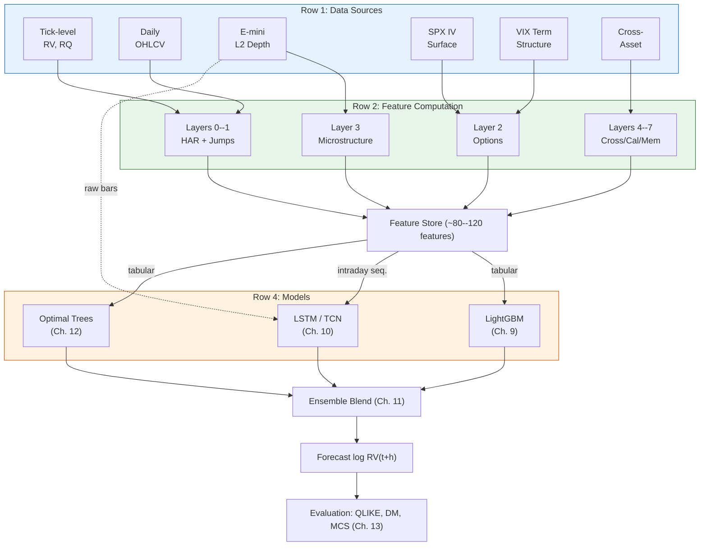

# Chapter 14: The Complete Pipeline

This chapter assembles the data sources (Chapter 3), feature layers (Chapters 4--12), models (Chapters 9--11), and evaluation framework (Chapter 13) into the end-to-end system and defines the implementation roadmap.

## End-to-End System Diagram

Blue: data sources. Green: feature computation and storage. Orange: models and blending. Red: evaluation.
Dashed arrow indicates the LSTM also receives raw intraday bar sequences directly.

## Implementation Order

Each step produces a standalone, reportable result.
No step depends on a later step being complete.

**Implementation roadmap. Each step is independently reportable.**

| Step | What | Features | Model | Deliverable |
|------|------|----------|-------|-------------|
| 1 | HARQ + SHAR baseline | Layers 0--1 (11 features) | OLS / Ridge | Walk-forward $\operatorname{QLIKE}$; baseline table |
| 2 | Add options layer | Layer 2 (~20 total) | LightGBM | $\operatorname{QLIKE}$ lift vs. Step 1; $\operatorname{SHAP}$ summary |
| 3 | Cross-asset + spillover | Layer 4 (~30 total) | LightGBM | Spillover contribution analysis |
| 4 | E-mini microstructure | Layer 3 (separate) | LSTM / TCN | Standalone intraday forecast |
| 5 | Full feature set | Layers 5--7 (~80--120) | Ensemble | Final $\operatorname{QLIKE}$; DM tests; MCS |
| 6 | Rashomon analysis | Same as Step 5 | Optimal Trees | Variable importance stability report |

> **Key Idea: Steps 1--2 Are the Critical Path**
>
> If Step 1 (HARQ/SHAR baseline) is weak, every subsequent $\operatorname{QLIKE}$ comparison is misleading (HAR'd to Beat, 2024).
> Step 2 (adding options features via LightGBM) produces the first genuine ML-vs-baseline comparison.
> Getting these two steps right matters more than reaching Step 5.

## Re-training and Monitoring

Retrain all models weekly on a rolling 5-year window.
After each retrain, compute the Rashomon set and record the Jaccard similarity of the top-10 features compared to the previous window; a drop below 0.6 signals feature-importance drift and warrants investigation.
Monitor out-of-sample $\operatorname{QLIKE}$ on a trailing 20-day basis; alert if it degrades more than 10% relative to the trailing 60-day average.
Log every retrain's feature ranking and $\operatorname{QLIKE}$ for post-hoc regime analysis.

## Lookahead Bias Checklist

The four primary sources of lookahead bias in volatility forecasting systems:

**Lookahead bias sources and prevention rules.**

| Source | Pitfall | Rule |
|--------|---------|------|
| Realized measures | Intraday returns from the target day leak into features | Features for $\operatorname{RV}_{t+1}$ use only information $\leq t$ |
| Microstructure | Full-day LOB features include the close | Truncate intraday sequences at $t-\epsilon$; align timestamps strictly |
| Options surface | Intraday surface changes reflect information about the target day | Use end-of-day surface from day $t$ for the day-$t{+}1$ prediction |
| Cross-asset | Mixed frequencies across asset classes | Synchronize all inputs to the same end-of-day cutoff |

> **Warning: Lookahead Bias**
>
> The single most common error in financial ML research.
> Every feature must be computable strictly before the forecast target period begins.
> When in doubt, add a one-day lag.
> A lookahead-contaminated model will show excellent in-sample $\operatorname{QLIKE}$ that vanishes out of sample, wasting weeks of development time before the bug is identified.
