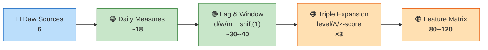

# Chapter 15: The Data-to-Feature Pipeline

Every feature in the model traces back to one of the six raw data sources in Chapter 3.
This chapter maps that lineage: source to measure to feature.
For measure formulas, see Chapters 4--8.
For selection rationale, see Chapter 12.

## Data Lineage

The diagram below shows how data narrows and expands through the pipeline.
Six raw sources produce approximately 18 daily scalar measures.
These measures pass through lagging, rolling-window aggregation, and triple expansion to produce the final 80--120 feature matrix.

## Complete Feature Matrix

The table below lists every feature in the planned feature set.
Read across any row to trace a feature from its source measure through to its final form.
Features with d/w/m variants share the same derivation pattern and are collapsed into one row.

**Complete feature matrix with source lineage. Features marked d/w/m apply the same derivation at daily, weekly (5d), and monthly (22d) horizons.**

### Layer 0: HAR Core

| Feature | Source Measure | Derivation | Expansion |
|---------|---------------|------------|-----------|
| `log_rv_d/w/m` | rv | $\log$ [+ rolling mean 5d/22d], shift(1) | -- |
| `sqrt_rq_d` | rq | $\sqrt{\cdot}$, shift(1) | -- |
| `rq_rv_interaction` | rq, rv | $\sqrt{\text{rq}} \cdot \log(\text{rv})$, shift(1) | -- |
| `overnight_return` | open, close (TSDB) | $\log(\text{open}_t / \text{close}_{t-1})$, shift(1) | -- |

### Layer 1: Asymmetry & Jumps

| Feature | Source Measure | Derivation | Expansion |
|---------|---------------|------------|-----------|
| `log_rs_positive_d/w/m` | rs_positive | $\log$ [+ rolling mean 5d/22d], shift(1) | -- |
| `log_rs_negative_d/w/m` | rs_negative | $\log$ [+ rolling mean 5d/22d], shift(1) | -- |
| `log_bpv_d/w` | bpv | $\log$ [+ rolling mean 5d], shift(1) | -- |
| `log_jump_variation_d` | jump_variation | $\log$, shift(1) | -- |
| `log_continuous_var_d/w` | continuous_variation | $\log$ [+ rolling mean 5d], shift(1) | -- |
| `signed_return_d` | close (TSDB) | $\log(\text{close}_t / \text{close}_{t-1})$, shift(1) | -- |

### Noise-Robust Estimators (NR)

| Feature | Source Measure | Derivation | Expansion |
|---------|---------------|------------|-----------|
| `log_rk_d/w` | rk (tick prices) | $\log$ [+ rolling mean 5d], shift(1) | -- |
| `noise_gap_d/w` | noise_gap | [rolling mean 5d], shift(1) | -- |

### Layer 2: Options-Implied

| Feature | Source Measure | Derivation | Expansion |
|---------|---------------|------------|-----------|
| `atm_iv_1m`, `_3m` | atm_iv (Marquee) | shift(1) | lev/$\Delta$/$z$ |
| `vrp` | atm_iv, rv | $\text{IV}^2 - \operatorname{RV}$, shift(1) | lev/$\Delta$/$z$ |
| `skew_1m` | skew (Marquee) | shift(1) | lev/$\Delta$/$z$ |
| `term_slope` | atm_iv (3m, 1m) | ATM$_{3m}$ $-$ ATM$_{1m}$, shift(1) | lev/$\Delta$/$z$ |
| `butterfly_1m` | skew, atm_iv | $0.5(\text{IV}_{25\delta P} {+} \text{IV}_{25\delta C}) {-} \text{IV}_{\text{ATM}}$, shift(1) | lev/$\Delta$/$z$ |
| `vvix` | VVIX (TSDB) | shift(1) | lev/$\Delta$/$z$ |
| `iv_rv_gap` | atm_iv, rv | $\text{IV} - \sqrt{\operatorname{RV} \times 252}$, shift(1) | lev/$\Delta$/$z$ |
| `stock_atm_iv` | EDRVOL (Marquee) | shift(1) | lev/$\Delta$/$z$ |
| `stock_vrp` | stock_atm_iv, rv | stock $\text{IV}^2 - \operatorname{RV}$, shift(1) | lev/$\Delta$/$z$ |

### Layer 3: Microstructure

| Feature | Source Measure | Derivation | Expansion |
|---------|---------------|------------|-----------|
| `price_acceleration` | E-mini mid-price | 2nd derivative (win=50), daily agg, shift(1) | lev/$\Delta$/$z$ |
| `obi` | E-mini L2 bid/ask | $(\Sigma\text{bid} {-} \Sigma\text{ask})/(\Sigma\text{bid} {+} \Sigma\text{ask})$, daily agg, shift(1) | lev/$\Delta$/$z$ |
| `depth_ratio` | E-mini L2 depth | $\log(\text{bid depth}/\text{ask depth})$, daily agg, shift(1) | lev/$\Delta$/$z$ |
| `spread_mean/std` | E-mini bid/ask | mean/std spread (bps), shift(1) | lev/$\Delta$/$z$ |
| `vpin` | E-mini trades | VPIN algorithm, shift(1) | lev/$\Delta$/$z$ |
| `kyle_lambda` | E-mini trades | regress($\Delta$mid, signed vol), shift(1) | lev/$\Delta$/$z$ |

### Layer 4: Cross-Asset

| Feature | Source Measure | Derivation | Expansion |
|---------|---------------|------------|-----------|
| `treasury_slope` | 10y, 2y note prices | 10y $-$ 2y price proxy, shift(1) | lev/$\Delta$/$z$ |
| `fx_vol` | USD/JPY, EUR/USD | annualized rolling RV (22d), shift(1) | lev/$\Delta$/$z$ |
| `commodity_vol` | CL, GC (TSDB) | annualized rolling RV (22d), shift(1) | lev/$\Delta$/$z$ |
| `vix_level` | VIX close (TSDB) | shift(1) | lev/$\Delta$/$z$ |
| `vix_futures_slope` | VX1, VX2 (TSDB) | VX2 $-$ VX1, shift(1) | lev/$\Delta$/$z$ |
| `dy_spillover` | panel of RVs (34) | DY FEVD ($h{=}10$, $p{=}4$), shift(1) | lev/$\Delta$/$z$ |

### Layer 5: Calendar

| Feature | Source Measure | Derivation | Expansion |
|---------|---------------|------------|-----------|
| `fomc_proximity` | FOMC calendar | days to next FOMC, shift(1) | -- |
| `nfp_proximity` | NFP calendar | days to next NFP, shift(1) | -- |
| `opex_proximity` | calendar math | days to next monthly OpEx, shift(1) | -- |
| `earnings_proximity` | earnings calendar | days to next earnings, shift(1) | -- |
| `day_of_week` | date | categorical encoding | -- |
| `month` | date | categorical encoding | -- |

### Layer 6: Memory

| Feature | Source Measure | Derivation | Expansion |
|---------|---------------|------------|-----------|
| `frac_diff_rv` | rv | $(1-L)^d$, $d \approx 0.35$--$0.45$, shift(1) | lev/$\Delta$/$z$ |
| `hurst_exponent` | rv | rolling Hurst (22d), shift(1) | lev/$\Delta$/$z$ |
| `vol_of_vol` | rv | std($\operatorname{RV}$) over 22d, shift(1) | lev/$\Delta$/$z$ |
| `regime_duration` | rv | days since last $2\sigma$ spike, shift(1) | -- |

### Layer 7: Sentiment

| Feature | Source Measure | Derivation | Expansion |
|---------|---------------|------------|-----------|
| `finbert_sentiment` | news text | daily FinBERT score, shift(1) | lev/$\Delta$/$z$ |
| `negative_news_count` | news text | count of negative articles, shift(1) | -- |

**Notes.**
"NR" = noise-robust estimators computed from tick-level log prices, not 5-min bars.
"Expansion" shows which features receive the {level, change, $z$-score} triple expansion for LightGBM (Chapter 12).
Features marked "--" are used as-is.
Rolling means compute the average in variance space first, then take log (Corsi, 2009).
`noise_gap` is a ratio, not log-transformed.
Treasury slope uses note prices (US10YT=RR, US2YT=RR) as a proxy; true yield tickers are not available in TSDB.
EUR/USD is sourced from Marquee FXIVOL, not TSDB.
CL and GC require manual front-month contract roll (e.g. CLM26, GCM26); generic continuous contracts are not in TSDB.
Deferred features (event-implied vol, sector-mean RV, cross-asset RV rank, WAP log returns, signed volume flow) can be added in later iterations.
Every derivation must include shift(1) or equivalent; any feature whose derivation omits an explicit lag uses information from the forecast target period.
The most subtle violations come from rolling windows that include day $t$ when predicting day $t{+}1$.
For layer-level summaries and feature counts per model family, see Chapter 9, Table 9.1.

> **Key Idea: Every Row Traces Back to Source**
>
> The feature matrix is the blueprint.
> To understand any feature, read across: the source measure tells you where the data comes from (Chapter 3), the derivation tells you the transformation chain, and the expansion column tells you what LightGBM sees.
