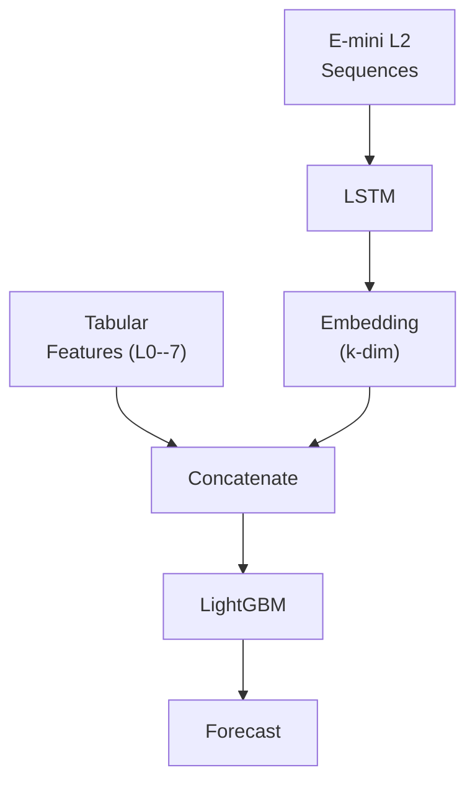
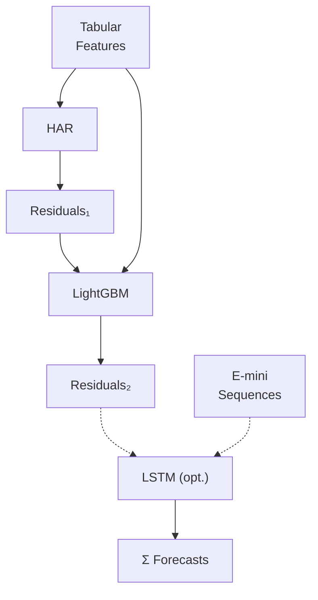
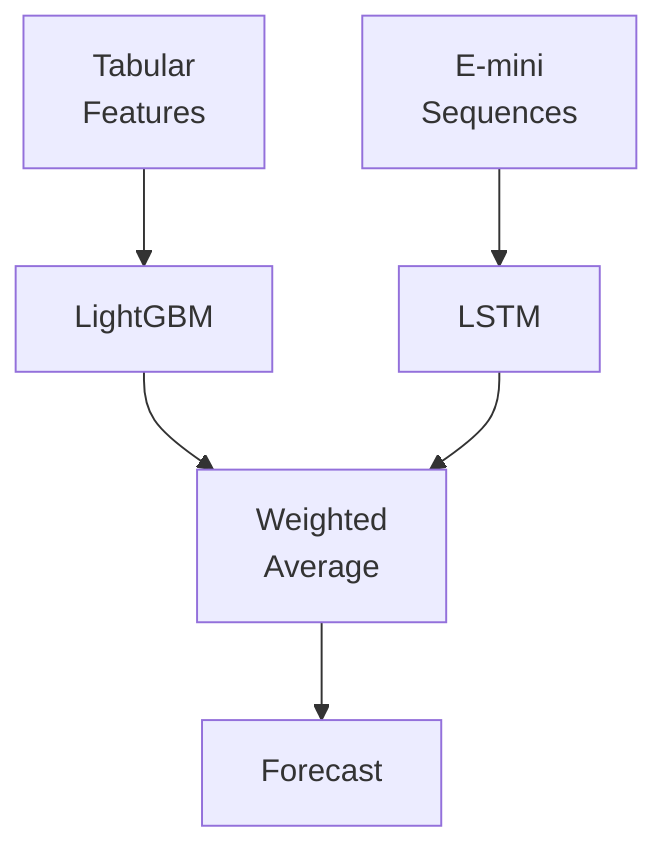

# Chapter 16: System Architecture

Chapter 15 presents prediction blending: two independent model branches combined at the forecast level.
This chapter presents two alternative ensemble architectures, feature stacking and residual stacking, and compares all three.

## Three Architectures

**Three ensemble architectures:**

**(A) Feature Stacking:**

**(B) Residual Stacking:**

**(C) Prediction Blending (Ch. 11):**

## Feature Stacking

The LSTM processes E-mini L2 5-min bars and LOB features (78 time steps per day) and produces a $k$-dimensional embedding vector (default $k=32$, or $k=1$ for a scalar forecast).
This embedding is concatenated with the ~80--120 tabular features from Layers 0--7 to form a single expanded feature set.
LightGBM then trains on the combined input.

The approach has one fundamental problem: LightGBM cannot back-propagate gradients through the LSTM, so the embedding is never optimized for the tree's $\operatorname{QLIKE}$ objective.
The LSTM learns representations that minimize its own loss, which may not be what the tree needs.

**Feature stacking: pros and cons.**

| | |
|---|---|
| **Pros** | Single training pass; LSTM learns representations the tree can exploit |
| **Cons** | Gradient isolation (tree cannot backprop into LSTM); embedding not optimized for tree objective; debugging harder; no RV literature demonstrates this beating alternatives |

## Residual Stacking

Stage 1: HAR baseline (OLS) produces a forecast and residuals.
Stage 2: LightGBM trains on Stage 1 residuals with the full tabular feature set.
Stage 3 (optional): LSTM trains on Stage 2 residuals from E-mini sequences.
The final forecast is the sum of all stage forecasts.

Each model specializes by construction.
HAR captures the multi-scale autoregressive structure that dominates at all horizons.
LightGBM captures nonlinear patterns the HAR misses (regime interactions, jump-asymmetry effects).
The LSTM, if used, captures whatever sequential dynamics remain in the residuals.

**Residual stacking: pros and cons.**

| | |
|---|---|
| **Pros** | Each model has a distinct role; no gradient isolation; clean residual targets; aligns with HARQ-X direction; supported by recent RV literature |
| **Cons** | Sequential training (each stage depends on prior); residual signal may be weak at later stages |

## Comparison

**Three-way architecture comparison.**

| Dimension | Feature Stacking | Residual Stacking | Pred. Blending (Ch. 15) |
|---|---|---|---|
| Complexity | High (joint training) | Moderate (sequential) | Low (independent) |
| Gradient flow | Broken (tree cannot backprop into LSTM) | Clean (residual targets) | N/A (independent) |
| Literature | Weak (no RV paper) | Strong (HARQ-X, recent lit.) | Strong (Optiver, 2021; Bucci, 2020) |
| Fallback | Must retrain tree without embedding | Drop Stage 3; keep HAR + LightGBM | Drop one model; keep the other |
| Interpretability | Opaque (embedding) | Clear (stage contributions) | Clear (individual forecasts) |

> **Key Idea: Residual Stacking Gives Each Model a Distinct Role**
>
> HAR captures multi-scale $\operatorname{RV}$ persistence.
> LightGBM captures nonlinear patterns the HAR misses.
> LSTM (if used) captures whatever regime dynamics remain.
> Each model trains on residuals from the prior stage, so roles are distinct by construction.
