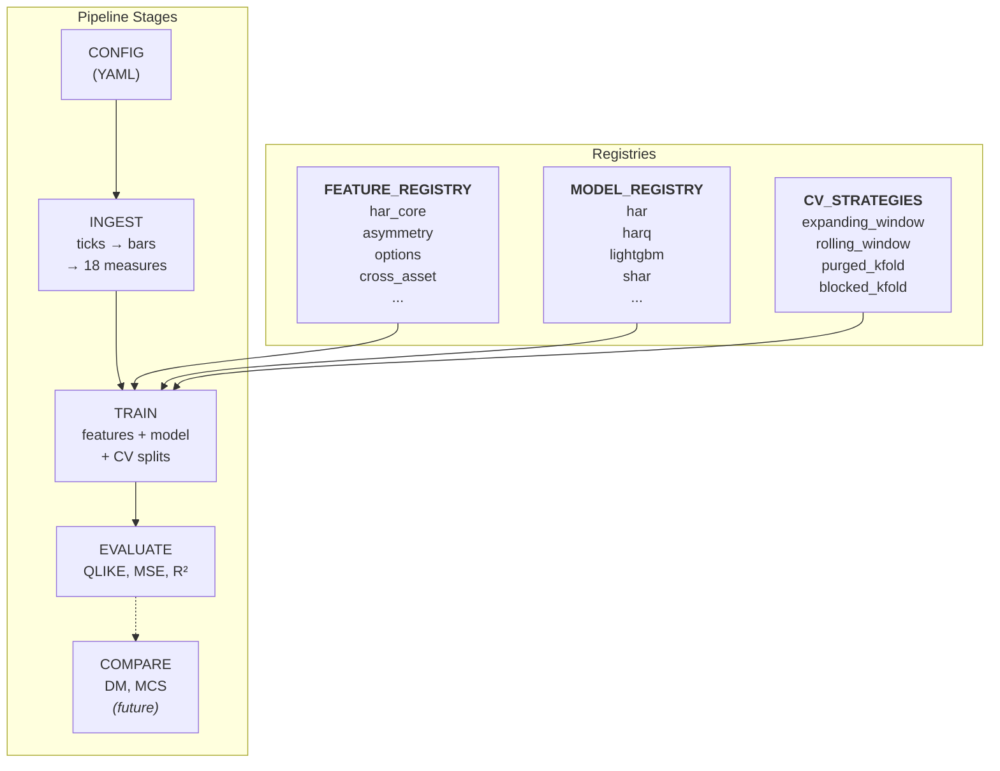

# Chapter 17: Modular Pipeline Design

Chapter 14 gives the logical pipeline order.
Chapter 16 describes the ensemble model architecture.
This chapter describes the software design: config-driven, registry-based, every experiment defined by one YAML file.

## Pipeline Architecture



CONFIG parameterizes all stages. TRAIN resolves features, models, and CV strategies from registries at runtime. COMPARE (dashed) is not yet implemented.

## Plug Points

### Feature Layers

The `feature_layers` list in the config names the layers to compose.
The pipeline iterates the list, resolves each name from FEATURE_REGISTRY, and calls `.compute()`.
See the feature matrix table for the full feature inventory.

### Models

The `model.name` field selects the model class from MODEL_REGISTRY.
All models satisfy the same `VolModel` protocol: `.fit(X, y)` and `.predict(X)`.
Model-specific hyperparameters go in `model.params`.
See Chapter 11 for LightGBM configuration.

### Cross-Validation

The `cv.method` field selects the splitter: expanding window, rolling window, purged k-fold, or blocked k-fold.
Purge gap is set via `cv.purge_gap`.
See Chapter 13 for evaluation methodology.

## Configuration

Two experiment configs side by side: a HAR baseline and a full LightGBM run.

**HAR baseline**

```yaml
name: baseline_har
universe: [SPY]
horizons: [1, 5, 22]
feature_layers: [har_core]
model:
  name: har
cv:
  method: expanding_window
  purge_gap: 5
```

**LightGBM with options features**

```yaml
name: lgbm_full
universe: [SPY, AAPL, MSFT, NVDA]
horizons: [1, 5, 22]
feature_layers:
  - har_core
  - asymmetry
  - options
  - cross_asset
model:
  name: lightgbm
  params: {num_leaves: 31}
cv:
  method: purged_kfold
  purge_gap: 22
```

Two experiments, same pipeline.
Left: HAR baseline with one feature layer.
Right: LightGBM with four feature layers and stricter cross-validation.

> **Key Idea: One YAML, One Experiment**
>
> The entire experiment -- universe, horizons, features, model, CV strategy -- is defined by a single config file.
> No code changes needed to run a different experiment.

> **Warning: Registries Require Import**
>
> Feature layers and models register via decorators at import time.
> A new layer or model that is never imported will not appear in the registry.
> The package `__init__.py` triggers all registration imports.
