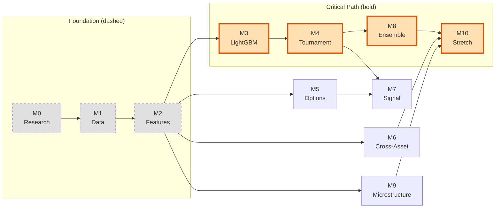

# Chapter 18: The Development Plan

Chapter 14 gives the logical order for layering features and models.
This chapter gives the actual build order: what to implement first given project priorities and foundation work that must happen before anything else.
Priority ordering: trading signal > academic rigor > model novelty.

## Milestones

The table below defines eleven milestones with acceptance criteria and dependencies.
M0--M2 cover foundation work already underway; M3--M7 form the minimum viable deliverable; M8--M10 are upside.

**Development milestones. M3--M7 form the minimum viable deliverable.**

*Foundation*

| Milestone | Acceptance Criteria | Key Tasks | Deps |
|---|---|---|---|
| **M0** Research & Scoping | Literature survey (80+ papers); scope defined; feature taxonomy (L0--L5) designed; $\operatorname{QLIKE}$ chosen; LightGBM selected; universe (34 symbols) defined | Paper review, scope definition, metric/model selection | -- |
| **M1** Data Infrastructure | Tick data via Chunk Store for 34 symbols; daily data from TSDB; IV surface from Marquee; resampling produces 78 bars/day; RV panel outputs 18 measures with parquet caching | Package scaffold, data integrations, resampling, RV panel builder, config system | M0 |
| **M2** Feature Engine & Baselines | Layer 0--1 features with no look-ahead; 7 HAR models fit and predict; $\operatorname{QLIKE}$ evaluation operational; purge gap $\geq h$ enforced; $\operatorname{QLIKE}$ sign matches Patton (2011); end-to-end pipeline runs; 390+ tests pass | HAR/asymmetry/noise-robust features, HAR family, metrics, CV splitters, CLI pipeline, purge gap fix, $\operatorname{QLIKE}$ sign fix | M1 |

*MVP*

| Milestone | Acceptance Criteria | Key Tasks | Deps |
|---|---|---|---|
| **M3** LightGBM | Custom $\operatorname{QLIKE}$ objective converges; Optuna finds improved params; walk-forward OOS predictions for 3 horizons | $\operatorname{QLIKE}$ gradient/hessian, model class, Optuna, walk-forward | M2 |
| **M4** Tournament | 8 models x 3 horizons table with DM $p$-values and Mincer--Zarnowitz efficiency tests on dev universe | Run baselines, DM test, MZ regression, tournament table | M3 |
| **M5** Layer 2 Options | Options features produce daily values with no look-ahead; $\operatorname{QLIKE}$ lift documented | OptionsLayer, IV surface wiring, validation | M2 |
| **M6** Layers 4--5 | Cross-asset and calendar features produce daily values; DY spillover index computed; FOMC/NFP/OPEX proximity indicators operational | Treasury slope, FX/commodity vol, DY spillover, event calendars | M2 |
| **M7** Signal | IV--RV gap signal; equity curve; positive OOS Sharpe | Signal logic, P&L backtest, performance metrics | M4, M5 |

*Upside*

| Milestone | Acceptance Criteria | Key Tasks | Deps |
|---|---|---|---|
| **M8** Ensemble | Residual stacking and prediction blending tested; 10-model tournament table | Residual stacking, inverse-$\operatorname{QLIKE}$ blending | M4 |
| **M9** Microstructure & Sequences | Layer 3 E-mini features (OBI, VPIN, depth); LSTM/TCN on intraday bars; scalar forecast as LightGBM feature evaluated | Microstructure layer, LSTM architecture, sequence pipeline | M2 |
| **M10** Stretch | Ordered by impact: regime $\operatorname{QLIKE}$, MCS, Rashomon (TreeFARMS + RID + VIC), STreeD, Layer 6--7 (memory/sentiment), reporting/visualization, full universe, figures | Each task independent | M4--M9 |

## Critical Path

Dashed nodes (M0--M2): foundation work. Bold path: critical path (M3--M4--M8--M10). M5, M6, and M9 branch from M2 and run in parallel. M7 requires both M4 (forecasts) and M5 (options features). M10 waits on all prior milestones.

The critical path is M3 -> M4 -> M8 -> M10.
M5, M6, and M9 branch from M2 and run in parallel with the critical path.
M7 requires both M4 (forecasts) and M5 (options features).

> **Key Idea: M3--M7 Is the Minimum Viable Deliverable**
>
> A $\operatorname{QLIKE}$ tournament (7 HAR variants + LightGBM, DM tests) plus cross-asset features and a tradeable IV--RV signal with P&L backtest is a presentable result.
> Everything in M8--M10 is upside.
> If time runs out after M7, the project has a defensible outcome.

> **Warning: M2 Must Be Complete Before M3**
>
> The purge gap bug causes silent data leakage for $h=22$.
> The $\operatorname{QLIKE}$ sign convention determines whether the loss function penalizes over-prediction or under-prediction correctly.
> All results produced before M2 is complete are potentially invalid.
> Do not skip ahead.
