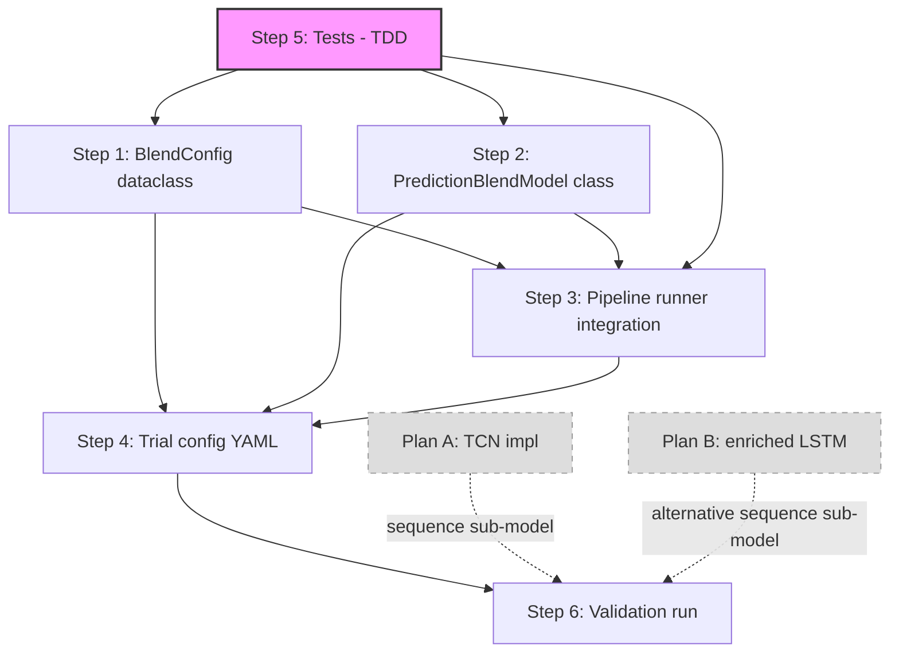

# Plan C: Prediction Blending (LSTM/TCN + XGBoost)

**Date:** 2026-07-01
**Status:** READY FOR EXECUTION
**Depends on:** Plan A (TCN implementation) or Plan B (enriched LSTM) for the sequence sub-model; Steps 1–5 can proceed independently
**Scope:** New `BlendConfig` dataclass, `PredictionBlendModel` class, pipeline runner integration, weight calibration methods, trial config

---

## Problem Statement

All LSTM integration attempts via feature stacking (trial-054 family) and residual stacking (trial-052 family) failed:

- **Feature stacking** failed due to gradient isolation — the tree cannot backprop into the LSTM embedding, so the LSTM signal degrades into a noisy scalar that the tree treats as just another feature among 128+.
- **Residual stacking** failed because tree residuals are near-white-noise — the LSTM cannot learn structure from the tree's residual.

The learning guide (ch13) and competition evidence (Optiver 2021 top solutions) strongly favor **prediction blending**: train each model independently on data suited to its architecture, then combine predictions with a weighted average. This avoids gradient isolation entirely — each model optimizes its own loss on its own data representation.

### Why blending works where stacking failed

| Approach | XGBoost sees | LSTM sees | Failure mode |
|----------|-------------|-----------|-------------|
| Feature stacking | LSTM embedding as extra column | Its own sequences | Tree can't propagate gradients into LSTM → LSTM signal decays |
| Residual stacking | Full features | Tree residuals | Tree residuals ≈ white noise → LSTM can't learn |
| **Prediction blending** | **Full features (tabular)** | **Full sequences (intraday)** | **None — models are independent** |

### Target architecture

$$\hat{y} = w \cdot \hat{y}_{\text{XGB}} + (1-w) \cdot \hat{y}_{\text{seq}}$$

Weight $w$ calibrated on expanding-window OOS predictions. Optional regime-dependent weights: high-vol → more weight to XGBoost, low-vol → more weight to sequence model.

---

## Codebase Audit

### Existing infrastructure (reusable)

| Component | Location | Status |
|-----------|----------|--------|
| XGBoost model | `src/volforecast/models/xgboost.py` | Champion at h=1, QLIKE 0.1292 |
| LSTM model | `src/volforecast/models/lstm.py:432` (`LSTMVolModel`) | Fully implemented, `requires_sequences=True` |
| TCN stub | `src/volforecast/models/lstm.py:1421` (`TCNVolModel`) | `NotImplementedError` — Plan A will implement |
| Pipeline runner | `src/volforecast/pipeline/runner.py:445` (`Pipeline`) | Dispatches tabular vs sequence, expanding-window CV |
| Model registry | `src/volforecast/registry.py` | `@register_model()` decorator |
| `ExperimentConfig` | `src/volforecast/config.py:309` | Has `model`, `feature_layers`, `sequences`, `cv`, `feature_stack`, `base_model` fields |
| `FeatureStackConfig` | `src/volforecast/config.py:275` | Feature stacking (NOT prediction blending) — different concept |
| Ensemble stubs | `src/volforecast/models/ensemble.py` | `SimpleAverageEnsemble`, `InverseQLIKEEnsemble`, `LinearBlendEnsemble`, `StackingEnsemble` — all `NotImplementedError` |
| `RegimeBlendModel` | `src/volforecast/models/regime_blend.py` | HAR+LightGBM only, `@register_model("regime_blend")`, hardcoded to two specific model types |
| `StackingHARLightGBM` | `src/volforecast/models/stacking.py` | HAR+LightGBM Ridge stacking, hardcoded model types |
| `LightGBMBaggedSeeds` | `src/volforecast/models/ensemble.py:37` | K-seed bagging, `@register_model("lightgbm_bagged")` |
| `_BaseModel` | `src/volforecast/models/_base.py` | `requires_sequences`, `save/load`, `summary` interface |
| Champion config | `workspace/configs/trial_063_xgboost_champion.yaml` | XGBoost with `har_iv_0dte` init, 128 tabular features |
| Test ensemble | `src/tests/unit/test_ensemble.py` | Tests for stub ensembles (all assert `NotImplementedError`) |

### What does NOT exist (must build)

| Component | Description |
|-----------|-------------|
| `BlendConfig` | Dataclass for blend specification (sub-models, weight method, regime settings) |
| `PredictionBlendModel` | Registered model that trains sub-models independently, calibrates weights on OOS predictions |
| Pipeline blend dispatch | Runner logic to detect `blend` config and dispatch to `PredictionBlendModel` |
| Weight calibration | Inverse-QLIKE, Ridge meta-learner, regime-dependent implementations |
| YAML parsing for `blend` | `from_yaml()` / `to_yaml()` support for the new `blend` field |

### Key design decisions

1. **New file vs extending `ensemble.py`**: Create `src/volforecast/models/blend.py` as a new file. `ensemble.py` already has the `LightGBMBaggedSeeds` model (production) and four stub classes. The blend model has fundamentally different semantics (orchestrates sub-models with different data paths) and would clutter `ensemble.py`. The stubs in `ensemble.py` can remain and be implemented later as lightweight prediction combiners that operate on pre-existing predictions (post-hoc), distinct from the training-time `PredictionBlendModel`.

2. **`blend` as ExperimentConfig field vs `model.name: "blend"`**: Use `model.name: "blend"` with sub-model configs in `model.params`. This avoids adding a top-level `blend` field and keeps the config system's routing logic unchanged (runner already dispatches on `model.name`). The `BlendConfig` is parsed from within `model.params`.

3. **Sub-model dispatch**: The blend model must handle both tabular (XGBoost) and sequence (LSTM/TCN) sub-models in a single `fit()`. This requires the blend model to receive both the tabular panel AND sequence tensors. The runner must pass both data types.

4. **Weight calibration timing**: Calibrate weights per outer CV fold on that fold's OOS predictions. This prevents lookahead bias — weights are never calibrated on data that includes future observations.

---

## Dependency Graph



**Parallelism:** Steps 1 and 2 can proceed in parallel after Step 5 (TDD) writes the failing tests. Step 3 depends on both. Step 4 depends on Steps 1–3. Step 6 depends on Step 4 AND Plan A or B.

**Independence from Plans A/B:** Steps 1–5 are fully independent of Plans A/B. They can be built and tested with mock sub-models. Only Step 6 (validation run) requires a working sequence model.

---

## Step 0: Pre-flight Exploration (inline)

**Tag:** `inline`
**Complexity:** Low (read-only)
**Duration:** Context gathering only

Before writing any code, verify:
1. Confirm no existing `blend` field in `ExperimentConfig` (`config.py`)
2. Confirm `from_yaml()` does NOT parse a `blend` key (line 482+)
3. Read `ensemble.py` stub classes to confirm they are truly `NotImplementedError`
4. Check if `runner.py` has any blend/ensemble dispatch logic already
5. Read existing plan files for format reference

**Result:** All confirmed in the codebase audit above. No blend infrastructure exists. The ensemble stubs are all `NotImplementedError`. The runner has no blend dispatch.

---

## Step 1: BlendConfig Dataclass

**Tag:** `subagent`
**Complexity:** Medium
**Files touched:** `src/volforecast/config.py`
**Test file:** `src/tests/unit/test_config.py` (extend existing)

### Context Packet

```yaml
goal: |
  Add BlendConfig dataclass and _parse_blend() helper to config.py.
  Add 'blend: BlendConfig | None = None' field to ExperimentConfig.
  Wire into from_yaml() and to_yaml().

file_scope:
  read:
    - src/volforecast/config.py  # full file
    - src/tests/unit/test_config.py  # existing config tests for pattern
  write:
    - src/volforecast/config.py
    - src/tests/unit/test_config.py

acceptance_criteria:
  - BlendConfig dataclass exists with fields: models, weight_method, fixed_weights, regime_indicator, regime_threshold, val_fraction, val_purge_gap
  - ExperimentConfig.blend field exists, defaults to None
  - from_yaml() parses 'blend' key into BlendConfig when present
  - to_yaml() serializes BlendConfig when present
  - Test: BlendConfig round-trips through YAML
  - Test: ExperimentConfig.blend is None when not specified
  - Test: ExperimentConfig.blend is populated when specified in YAML
  - ./vol test -x -q -k test_config passes
```

### Design

```python
@dataclass
class BlendSubModelConfig:
    """Configuration for one sub-model in a prediction blend."""
    name: str                         # registry key: "xgboost", "lstm", "tcn"
    feature_layers: list[str] = field(default_factory=list)
    params: dict[str, Any] = field(default_factory=dict)
    sequences: SequenceConfig | None = None  # for sequence-first models
    base_model: BaseModelConfig | None = None  # for har_iv init etc.

@dataclass
class BlendConfig:
    """Configuration for prediction-level blending of multiple models."""
    models: list[BlendSubModelConfig]  # 2+ sub-models to blend
    weight_method: str = "inverse_qlike"
    # Valid: "fixed", "inverse_qlike", "ridge_meta", "regime_dependent"
    fixed_weights: list[float] | None = None  # for weight_method="fixed"
    regime_indicator: str | None = None       # e.g. "log_rv_w" for regime_dependent
    regime_threshold: float | None = None     # percentile or absolute
    regime_threshold_type: str = "percentile" # "percentile" | "absolute"
    val_fraction: float = 0.20                # holdout for weight calibration
    val_purge_gap: int = 10                   # gap between train and val
    ridge_alpha: float = 1.0                  # for ridge_meta
```

### Parsing logic

```python
def _parse_blend(raw: Any) -> BlendConfig | None:
    if raw is None:
        return None
    models = []
    for m in raw["models"]:
        seq = SequenceConfig(**m["sequences"]) if m.get("sequences") else None
        base = None
        if m.get("base_model"):
            base = BaseModelConfig(
                name=m["base_model"]["name"],
                feature_layers=m["base_model"].get("feature_layers", []),
                params=m["base_model"].get("params", {}),
            )
        models.append(BlendSubModelConfig(
            name=m["name"],
            feature_layers=m.get("feature_layers", []),
            params=m.get("params", {}),
            sequences=seq,
            base_model=base,
        ))
    return BlendConfig(
        models=models,
        weight_method=raw.get("weight_method", "inverse_qlike"),
        fixed_weights=raw.get("fixed_weights"),
        regime_indicator=raw.get("regime_indicator"),
        regime_threshold=raw.get("regime_threshold"),
        regime_threshold_type=raw.get("regime_threshold_type", "percentile"),
        val_fraction=float(raw.get("val_fraction", 0.20)),
        val_purge_gap=int(raw.get("val_purge_gap", 10)),
        ridge_alpha=float(raw.get("ridge_alpha", 1.0)),
    )
```

### Validation rules (in `__post_init__` or `_parse_blend`)

- `len(models) >= 2` — blending requires at least 2 sub-models
- `weight_method` in `{"fixed", "inverse_qlike", "ridge_meta", "regime_dependent"}`
- If `weight_method == "fixed"`: `fixed_weights` must have same length as `models` and sum to 1.0
- If `weight_method == "regime_dependent"`: `regime_indicator` must be set
- Each sub-model `name` must be a valid registry key (validated at runtime, not parse time)

---

## Step 2: PredictionBlendModel Class

**Tag:** `subagent`
**Complexity:** High
**Files touched:** `src/volforecast/models/blend.py` (new), `src/volforecast/registry.py`
**Test file:** `src/tests/unit/test_blend_model.py` (new)

### Context Packet

```yaml
goal: |
  Create PredictionBlendModel registered as "blend" in the model registry.
  Implement fit() that trains each sub-model independently, generates OOS
  predictions, and calibrates blend weights. Implement predict() that runs
  each sub-model and combines with calibrated weights.
  Implement 4 weight calibration methods: fixed, inverse_qlike, ridge_meta, regime_dependent.

file_scope:
  read:
    - src/volforecast/models/_base.py          # _BaseModel interface
    - src/volforecast/models/ensemble.py       # existing ensemble patterns
    - src/volforecast/models/regime_blend.py   # regime-dependent weight reference
    - src/volforecast/models/stacking.py       # stacking/meta-learner reference
    - src/volforecast/models/xgboost.py        # tabular model interface (fit/predict)
    - src/volforecast/models/lstm.py:432-550   # sequence model interface
    - src/volforecast/registry.py              # registration pattern
    - src/volforecast/config.py                # BlendConfig (from Step 1)
    - src/volforecast/evaluation/metrics.py    # qlike() function
  write:
    - src/volforecast/models/blend.py          # NEW
    - src/volforecast/registry.py              # add import
    - src/tests/unit/test_blend_model.py       # NEW

acceptance_criteria:
  - PredictionBlendModel registered as "blend" in MODEL_REGISTRY
  - fit(tabular_X, y, sequence_data) trains each sub-model independently
  - fit() generates OOS predictions via temporal holdout for weight calibration
  - predict(tabular_X, sequence_data) combines sub-model predictions with calibrated weights
  - Weight calibration methods all implemented and tested:
    - fixed: uses user-specified weights
    - inverse_qlike: w_k = QLIKE_k^{-1} / sum(QLIKE_j^{-1})
    - ridge_meta: Ridge regression on OOS predictions
    - regime_dependent: different weights for high/low vol regimes
  - Handles mixed model types (tabular + sequence) in single blend
  - Returns summary with per-model weights and QLIKE scores
  - Unit tests pass with mock sub-models (no real XGBoost/LSTM dependency)
  - ./vol test -x -q -k test_blend_model passes
```

### Design

```python
@register_model("blend")
class PredictionBlendModel(_BaseModel):
    """Prediction-level ensemble: train sub-models independently, blend forecasts.

    Unlike feature stacking (which injects one model's output as features
    into another), prediction blending trains each model on its own optimal
    data representation and combines their forecasts post-hoc. This avoids
    gradient isolation — each model's loss surface is independent.
    """

    REQUIRED_LAYERS: list[str] = []  # sub-models declare their own
    name = "blend"
    supports_tuning = False
    requires_sequences = False  # runner handles data dispatch specially

    def __init__(self, blend_config: BlendConfig, **kwargs):
        self._config = blend_config
        self._sub_models: list[_BaseModel] = []
        self._weights: np.ndarray | None = None
        self._regime_weights: dict[str, np.ndarray] | None = None
        self._regime_threshold: float | None = None
        self._weight_meta_model = None  # Ridge for ridge_meta
        self._per_model_qlike: list[float] = []

    def fit(
        self,
        tabular_X: pd.DataFrame,
        y: pd.Series,
        *,
        sequence_data: dict | None = None,  # {model_idx: SequenceTensor}
        panel_data: dict[str, pd.DataFrame] | None = None,
        on_progress: Any = None,
    ) -> PredictionBlendModel:
        """Train each sub-model independently, then calibrate blend weights.

        Phase 1: Split data into base-train and weight-calibration holdout
        Phase 2: Fit each sub-model on base-train
        Phase 3: Generate OOS predictions on holdout
        Phase 4: Calibrate blend weights on holdout
        Phase 5: Refit all sub-models on FULL training data
        """
        ...

    def predict(
        self,
        tabular_X: pd.DataFrame,
        *,
        sequence_data: dict | None = None,
    ) -> np.ndarray:
        """Generate blended prediction from all sub-models."""
        ...

    def _calibrate_fixed(self, ...):
        """Use user-specified weights directly."""
        ...

    def _calibrate_inverse_qlike(self, oos_preds: dict, y_val: np.ndarray):
        """Weight each model inversely by its QLIKE on holdout.

        w_k = QLIKE_k^{-1} / sum(QLIKE_j^{-1})

        Intuition: models with lower QLIKE (better fit) get higher weight.
        Guard: clip minimum QLIKE to 1e-8 to avoid division by zero.
        """
        ...

    def _calibrate_ridge_meta(self, oos_preds: dict, y_val: np.ndarray):
        """Fit Ridge regression on OOS predictions to learn optimal combination.

        Meta-features: [pred_model_1, pred_model_2, ...]
        Target: y_val (log-RV)
        Constraint: Ridge alpha from config (default 1.0)

        The Ridge can learn non-equal weights AND an intercept, which
        corrects for systematic bias differences between models.
        """
        ...

    def _calibrate_regime(self, oos_preds: dict, y_val: np.ndarray, X_val: pd.DataFrame):
        """Calibrate separate weights for high-vol and low-vol regimes.

        1. Compute regime threshold from X_val[regime_indicator]
        2. Split holdout into high-vol and low-vol subsets
        3. Calibrate weights separately (inverse_qlike within each regime)
        4. Store regime_threshold and per-regime weights
        """
        ...
```

### Sub-model dispatch logic

The key complexity is that sub-models have different data requirements:
- **Tabular models** (XGBoost, LightGBM, HAR): receive `pd.DataFrame` for `fit(X, y)` and `predict(X)`
- **Sequence models** (LSTM, TCN): receive `SequenceTensor` for `fit(seq, y)` and `predict(seq)`

The `PredictionBlendModel.fit()` must handle both:

```python
for i, sub_cfg in enumerate(self._config.models):
    model_cls = MODEL_REGISTRY[sub_cfg.name]
    model = model_cls(**sub_cfg.params)

    if getattr(model_cls, "requires_sequences", False):
        # Sequence model: use sequence_data
        seq = sequence_data[i]
        model.fit(seq, y_train, base_preds=base_preds)
    else:
        # Tabular model: use tabular_X with model-specific feature layers
        X_sub = self._build_features(tabular_X, sub_cfg.feature_layers)
        model.fit(X_sub, y_train)
```

### Weight calibration flow (per CV fold)

```
Full training data
  ├── base-train (first 80%)
  │     ├── Fit XGBoost on tabular features
  │     └── Fit LSTM on sequence tensors
  └── weight-calibration holdout (last 20%, with purge gap)
        ├── XGBoost OOS predictions
        ├── LSTM OOS predictions
        └── Calibrate w = f(OOS_preds, y_true)

Refit all models on FULL training data (with calibrated weights frozen)
```

### Edge cases

- **NaN handling**: Some OOS predictions may be NaN (e.g. sequence model has no data for certain dates). Use `np.nanmean` weighted blend, with NaN-aware weight renormalization.
- **Holdout too small**: If `val_fraction × n_train < 30`, fall back to equal weights with a warning.
- **Single sub-model valid**: If only one sub-model produces valid predictions for a sample, use that model's prediction directly (weight=1).

---

## Step 3: Pipeline Runner Integration

**Tag:** `subagent`
**Complexity:** High
**Files touched:** `src/volforecast/pipeline/runner.py`
**Test file:** `src/tests/unit/test_runner_blend.py` (new) or extend `src/tests/unit/test_runner_sequences.py`

### Context Packet

```yaml
goal: |
  Modify Pipeline.run_pooled() to detect blend config and dispatch to a
  blend-specific execution path that:
  1. Builds features for each tabular sub-model
  2. Loads sequence tensors for each sequence sub-model
  3. Passes both to PredictionBlendModel.fit()
  4. Handles expanding-window CV with per-fold weight calibration
  5. Collects predictions and metrics

file_scope:
  read:
    - src/volforecast/pipeline/runner.py           # full file (large — focus on run_pooled, _run_horizon)
    - src/volforecast/config.py                    # BlendConfig
    - src/volforecast/models/blend.py              # PredictionBlendModel interface
    - src/volforecast/data/sequence_cache.py       # SequenceTensor loading
    - src/volforecast/pipeline/fold_cache.py       # fold caching pattern
  write:
    - src/volforecast/pipeline/runner.py
    - src/tests/unit/test_runner_blend.py          # NEW (or extend existing)

acceptance_criteria:
  - Pipeline.run_pooled() detects model.name == "blend" and dispatches to _run_pooled_blend()
  - _run_pooled_blend() builds features for tabular sub-models using their respective feature_layers
  - _run_pooled_blend() loads sequence tensors for sequence sub-models
  - Expanding-window CV works with blend model (per-fold weight calibration)
  - OOS predictions are collected and aligned by date across sub-models
  - Progress callbacks (on_fold_complete, on_horizon_start) are wired
  - QLIKE, MSE, R² metrics computed on blended predictions
  - No regression in existing tabular or sequence paths
  - ./vol test -x -q -k "test_runner" passes
```

### Design

The runner already has three dispatch paths in `run_pooled()`:
1. `requires_sequences=True` → `_run_pooled_sequences()` (LSTM/TCN)
2. `feature_stack is not None` → tabular with stacked features
3. Default → tabular CV

Add a fourth path at the top (before the existing dispatches):

```python
def run_pooled(self, panel_data, ...):
    ...
    model_cls = MODEL_REGISTRY[model_name]

    # NEW: Blend dispatch — before sequence/tabular dispatch
    if self.config.blend is not None:
        return self._run_pooled_blend(
            panel_data, on_fold_complete=on_fold_complete,
            on_horizon_start=on_horizon_start, ...
        )

    # Existing: sequence dispatch
    if getattr(model_cls, "requires_sequences", False):
        return self._run_pooled_sequences(...)
    ...
```

### `_run_pooled_blend()` flow

```python
def _run_pooled_blend(self, panel_data, ...):
    """Execute prediction blending across all horizons.

    For each horizon:
    1. Build tabular features for tabular sub-models (union of all feature_layers)
    2. Load sequence tensors for sequence sub-models
    3. Expanding-window CV:
       a. Per fold: split into train/test
       b. Instantiate PredictionBlendModel with BlendConfig
       c. Pass tabular_X_train, y_train, sequence_data_train
       d. model.fit() handles:
          - Internal temporal holdout for weight calibration
          - Training each sub-model
          - Calibrating blend weights
       e. model.predict(tabular_X_test, sequence_data_test)
       f. Collect OOS predictions
    4. Compute metrics on collected OOS predictions
    """
```

### Feature layer resolution

Each sub-model may have different `feature_layers`. The runner must:
1. Compute the **union** of all sub-models' `feature_layers`
2. Build features for the union set
3. When passing to each sub-model, select only that model's required columns

```python
all_layers = set()
for sub_cfg in blend_config.models:
    all_layers.update(sub_cfg.feature_layers)

# Build panel with union of all layers
union_panel = self._build_panel(panel_data, list(all_layers))

# Per sub-model: select columns from required layers
# (The blend model handles this internally via BlendSubModelConfig.feature_layers)
```

### Sequence data alignment

For sequence sub-models in the blend, the runner must load sequence tensors with the same date alignment as the tabular panel. The existing `_load_sequences()` / `SequenceTensor` infrastructure handles this — just needs to be called for each sequence sub-model with its own `SequenceConfig`.

The critical constraint: **sequence tensor indices must align with tabular panel indices** so that predictions can be combined sample-by-sample.

---

## Step 4: Trial Config YAML

**Tag:** `inline`
**Complexity:** Low
**File:** `workspace/configs/trial_072_blend_xgb_lstm_h1.yaml` (new)

### Design

```yaml
# Trial-072: Prediction blending — XGBoost champion + LSTM
#
# Hypothesis: Blending XGBoost tabular predictions with LSTM sequence
# predictions via inverse-QLIKE weighting produces lower QLIKE than
# either model alone at h=1. The two models capture complementary
# information — XGBoost from cross-sectional tabular features, LSTM
# from intraday temporal patterns.
#
# Architecture:
#   - Sub-model 1: XGBoost (trial-063 champion spec, har_iv_0dte init)
#   - Sub-model 2: LSTM (intraday 5-min sequences)
#   - Blend: inverse_qlike weighting calibrated on 20% temporal holdout
#
# Baseline: trial_063_xgboost_champion (QLIKE 0.1292 at h=1)
# Depends: Plan A (TCN) or Plan B (enriched LSTM) for sequence model quality

name: trial_072_blend_xgb_lstm_h1
universe: [SPY]
date_range: ["2015-01-02", "2026-05-30"]
horizons: [1]

# Union of all sub-model feature layers (runner builds superset)
feature_layers: [iv_surface, har_core, asymmetry, noise_robust, options, calendar, tree_expansion]

model:
  name: blend

blend:
  weight_method: inverse_qlike
  val_fraction: 0.20
  val_purge_gap: 10

  models:
    - name: xgboost
      feature_layers: [iv_surface, har_core, asymmetry, noise_robust, options, calendar, tree_expansion]
      base_model:
        name: har_iv_0dte
      params:
        n_estimators: 5000
        early_stopping_rounds: 150
        learning_rate: 0.01
        max_leaves: 16
        max_depth: 4
        min_child_weight: 150
        colsample_bytree: 0.8
        subsample: 0.8
        reg_lambda: 5.0
        reg_alpha: 0.1
        val_fraction: 0.15
        val_purge_gap: 10
        device: "cuda"

    - name: lstm
      sequences:
        features: [log_ret, vol_share, buy_ratio, log_n_trades, abs_ret]
        max_bars: 2340
        source: parquet
      params:
        input_dim: 5
        hidden_dim: 64
        n_layers: 2
        dropout: 0.1
        learning_rate: 0.001
        max_epochs: 50
        batch_size: 64
        loss: qlike
        device: auto

cv:
  method: expanding_window
  purge_gap: 10
  train_size: 504
  test_size: 126

tournament:
  gsvivs_enabled: true
  gsvivs_short_threshold: 0
  dh_enabled: false
  vt_enabled: false
  parallel_models: 1
```

### Follow-up configs (after initial validation)

- `trial_073_blend_regime_xgb_lstm_h1.yaml` — same but `weight_method: regime_dependent`, `regime_indicator: log_rv_w`
- `trial_074_blend_xgb_tcn_h1.yaml` — swap LSTM for TCN (depends on Plan A)
- `trial_075_blend_multi_horizon.yaml` — test h=1,5,22 with per-horizon weight calibration

---

## Step 5: Tests (TDD)

**Tag:** `subagent` (split into two sub-steps: 5a config tests, 5b model tests)
**Complexity:** Medium
**Files:** `src/tests/unit/test_config.py` (extend), `src/tests/unit/test_blend_model.py` (new), `src/tests/unit/test_runner_blend.py` (new)

### IMPORTANT: TDD order

Per project rules, failing tests are written BEFORE implementation. The execution order is:

1. **Step 5a**: Write failing tests for `BlendConfig` parsing → then execute Step 1
2. **Step 5b**: Write failing tests for `PredictionBlendModel` → then execute Step 2
3. **Step 5c**: Write failing tests for runner blend dispatch → then execute Step 3

### Step 5a: BlendConfig Tests

**Context packet:**

```yaml
goal: |
  Write tests for BlendConfig parsing, validation, and YAML round-trip.
  Tests MUST fail initially (TDD — no implementation exists yet).

file_scope:
  read:
    - src/tests/unit/test_config.py  # existing patterns
    - src/volforecast/config.py      # current config structure
  write:
    - src/tests/unit/test_config.py  # extend with BlendConfig tests

acceptance_criteria:
  - Test class TestBlendConfig with:
    - test_blend_config_none_by_default
    - test_blend_config_from_yaml_inverse_qlike
    - test_blend_config_from_yaml_fixed_weights
    - test_blend_config_from_yaml_regime_dependent
    - test_blend_config_validation_min_models
    - test_blend_config_validation_fixed_weights_sum
    - test_blend_config_validation_invalid_method
    - test_blend_config_round_trip_yaml
    - test_blend_sub_model_with_sequences
    - test_blend_sub_model_with_base_model
  - All tests fail with ImportError or AttributeError (BlendConfig doesn't exist yet)
```

### Step 5b: PredictionBlendModel Tests

**Context packet:**

```yaml
goal: |
  Write tests for PredictionBlendModel with mock sub-models.
  Mock models avoid dependency on real XGBoost/LSTM.
  Tests MUST fail initially (TDD — blend.py doesn't exist yet).

file_scope:
  read:
    - src/tests/unit/test_ensemble.py         # existing ensemble test patterns
    - src/tests/unit/test_feature_stack.py     # mock model patterns
    - src/volforecast/models/_base.py          # _BaseModel interface
    - src/volforecast/evaluation/metrics.py    # qlike function
  write:
    - src/tests/unit/test_blend_model.py       # NEW

acceptance_criteria:
  - MockTabularModel and MockSequenceModel fixtures
  - Test class TestPredictionBlendModel:
    - test_registered_as_blend
    - test_fit_trains_all_sub_models
    - test_predict_returns_blended_predictions
    - test_fixed_weights
    - test_inverse_qlike_weighting
    - test_ridge_meta_learner
    - test_regime_dependent_weights
    - test_nan_handling_in_predictions
    - test_fallback_equal_weights_small_holdout
    - test_summary_includes_weights
  - Test class TestWeightCalibration:
    - test_inverse_qlike_better_model_gets_higher_weight
    - test_fixed_weights_sum_to_one
    - test_ridge_learns_intercept
    - test_regime_splits_correctly
  - All tests fail with ImportError (blend.py doesn't exist yet)
```

### Step 5c: Runner Blend Tests

```yaml
goal: |
  Write integration-level tests for Pipeline blend dispatch.
  Use mock panel data and mock models.
  Tests MUST fail initially (runner blend path doesn't exist yet).

file_scope:
  read:
    - src/tests/unit/test_runner_sequences.py  # existing runner test patterns
    - src/tests/unit/test_feature_stack.py     # pipeline mock patterns
    - src/volforecast/pipeline/runner.py       # current runner structure
  write:
    - src/tests/unit/test_runner_blend.py      # NEW

acceptance_criteria:
  - test_runner_detects_blend_config
  - test_runner_dispatches_to_blend_path
  - test_runner_builds_union_feature_layers
  - test_runner_blend_expanding_window_cv
  - test_runner_blend_metrics_computed
  - All tests fail initially
```

---

## Step 6: Validation Run

**Tag:** `inline` (manual execution + analysis)
**Complexity:** Medium
**Depends on:** Steps 1–5 complete AND Plan A or B complete (working sequence model)
**Files:** `workspace/tmp/trial_072_results/` (output)

### Execution

```bash
./vol exec python -m volforecast.cli run workspace/configs/trial_072_blend_xgb_lstm_h1.yaml
```

### Validation criteria

| Metric | Target | Comparison |
|--------|--------|-----------|
| Blend QLIKE (h=1) | < 0.1292 | vs XGBoost-only champion |
| Blend QLIKE (h=1) | < LSTM-only QLIKE | vs LSTM-only |
| XGBoost weight | > 0.5 | expected: XGBoost dominates at h=1 |
| Weight stability | CV < 0.3 across folds | weights shouldn't swing wildly |
| Prediction correlation | > 0.95 with XGBoost-only | blend should be close to XGBoost |

### Analysis checklist

- [ ] Print calibrated weights per fold
- [ ] Plot blend QLIKE vs XGBoost-only vs LSTM-only across folds
- [ ] Scatter plot: blend predictions vs actuals
- [ ] Check if LSTM adds marginal value or just adds noise
- [ ] If LSTM weight → 0: sequence model is not contributing, investigate
- [ ] If blend QLIKE worse than XGBoost-only: blending is harmful, weights are miscalibrated

### Follow-up experiments

1. **Regime-dependent weights** (trial-073): test if giving LSTM more weight in low-vol regimes helps
2. **TCN swap** (trial-074): replace LSTM with TCN once Plan A completes
3. **Multi-horizon** (trial-075): test if blend helps more at h=5 or h=22 where XGBoost advantage shrinks
4. **3-model blend**: XGBoost + LSTM + HAR-IV (HAR as calibration anchor)

---

## Execution Order (TDD-compliant)

| Phase | Step | Tag | Depends on | Description |
|-------|------|-----|-----------|-------------|
| 1 | 5a | subagent | — | Write failing BlendConfig tests |
| 2 | 1 | subagent | 5a | Implement BlendConfig → tests pass |
| 3 | 5b | subagent | 1 | Write failing PredictionBlendModel tests |
| 4 | 2 | subagent | 5b | Implement PredictionBlendModel → tests pass |
| 5 | 5c | subagent | 1, 2 | Write failing runner blend tests |
| 6 | 3 | subagent | 5c | Implement runner blend dispatch → tests pass |
| 7 | 4 | inline | 1, 2, 3 | Write trial config YAML |
| 8 | 6 | inline | 4 + Plan A/B | Validation run and analysis |

---

## Complexity Estimates

| Step | Lines of code (est.) | Risk | Notes |
|------|---------------------|------|-------|
| 1 (BlendConfig) | ~80 config + ~40 parsing | Low | Follows existing FeatureStackConfig pattern |
| 2 (BlendModel) | ~250–350 | Medium | Weight calibration logic is the core complexity |
| 3 (Runner) | ~150–200 | High | Must handle mixed tabular+sequence data paths without breaking existing paths |
| 4 (Trial config) | ~60 | Low | YAML only |
| 5 (Tests) | ~300–400 total | Medium | Mock infrastructure needs care |
| 6 (Validation) | — | Low | Execution + analysis |
| **Total** | **~850–1100** | | |

---

## Risk Analysis

| Risk | Likelihood | Impact | Mitigation |
|------|-----------|--------|-----------|
| LSTM adds no marginal value over XGBoost at h=1 | High | Medium | Expected — XGBoost dominates h=1. Blend may still help at h=5/22. Regime-dependent weights can down-weight LSTM. |
| Weight calibration overfits on small holdout | Medium | Medium | Use temporal holdout (not random), purge gap, and Ridge regularization. Monitor weight stability across folds. |
| Sequence tensor date alignment breaks | Medium | High | Careful index alignment in runner. Test with mock data first. |
| Runner changes break existing paths | Low | High | No changes to existing tabular/sequence dispatch — blend is a new branch at the top. Regression tests. |
| `from_yaml()` changes break existing configs | Low | High | `blend` field defaults to `None`. No change in parsing when `blend` absent. |

---

## Open Questions

1. **Should blend weights be calibrated per fold or across all folds?**
   - Per fold (recommended): weights adapt to the expanding training window. More robust.
   - Across folds: single weight set, simpler but may not adapt to regime changes.
   - Decision: **per fold** — matches expanding-window philosophy.

2. **Should the blend model support GPU-parallel sub-model training?**
   - XGBoost and LSTM can train on different GPUs simultaneously.
   - Complexity: need to coordinate GPU allocation across sub-models within a single fold.
   - Decision: **defer** — train sub-models sequentially within each fold for v1. Optimize later if runtime is a bottleneck.

3. **Duan correction for blended predictions?**
   - Each sub-model applies its own Duan correction internally.
   - The blend operates on corrected predictions — no double correction.
   - Decision: **no additional Duan on the blend**. Each model handles its own bias correction.

4. **How to handle the sequence model needing `base_preds` from a tabular model?**
   - In residual-stacking mode, the LSTM receives `base_preds` from HAR-IV.
   - In prediction blending, the LSTM trains independently — no `base_preds`.
   - Decision: **no base_preds for sequence sub-models in blend mode**. Each model is fully independent. If an LSTM sub-model wants HAR-IV residual learning, configure it with its own `base_model` in the blend sub-model config.
