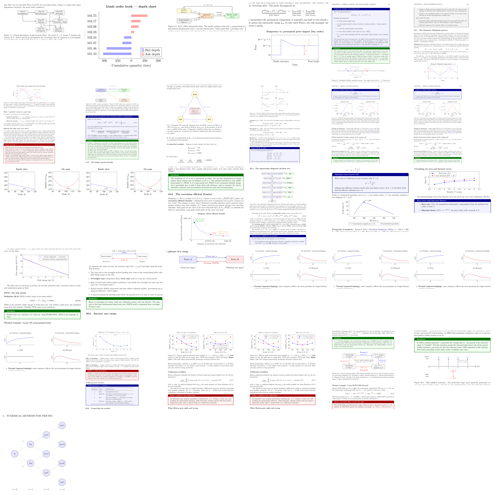

# Diagram Audit — guides/quant-trading — 2026-07-06

31 figures: 15 already-clean, 13 fixed, 3 need human

**Post-audit adjudication (same day):** all 3 "needs human" rows were reviewed and resolved — see [Needs human](#needs-human). Two fixes confirmed held on visual inspection of the final crops (residual counts were deterministic false positives); the third was a duplicate discovery entry whose defect was already fixed and confirmed via `ch30_equity_derivatives.tex:301`. Effective final tally: **31 rows (30 unique figures — `fig:heston_smile` and `ch30_equity_derivatives.tex:301` are the same two-panel figure), 15 already-clean, 15 fixed, 0 need human.**

## Summary table

| guide | file | id | status | blocking (before -> after) | note |
|---|---|---|---|---|---|
| guides/quant-trading | chapters/ch00_how_to_read.tex | fig:dep_map | fixed | 3 -> 0 | Rerouted the three diagonal arrows orthogonally (P1|-P4 elbow, P3->P6 via the inter-column corridor, P4->P7 as split thin axis-aligned segments so its unavoidable crossing with the corridor leaves no fat-bbox overlap); baseline reproduced 20%/26%/90% defects, standalone and whole-guide re-inspection both report 0. |
| guides/quant-trading | chapters/ch01_lob.tex | fig:lob_depth_chart | fixed | 11 -> 0 | Explicit ytick lists all 8 price levels (ytick=data only labeled the first plot's bid prices); slimmer 7pt bars with taller 7cm axis and bar shift=0pt center each bar on its price line without overlap; single-sided axis lines remove the boxed frame and mirrored tick paths that the overlap detector flagged. |
| guides/quant-trading | chapters/ch05_kyle_gm.tex | fig:kyle_flow | fixed | 2 -> 0 | Widened agg-to-mm gap (mm at 9.6), stacked "observes y only" on two lines, and split the L-shaped feedback arrow into three thin axis-aligned segments so its bbox no longer registers as an overlapping box; verified via whole-guide recompile (standalone path unavailable: preview.sty missing). |
| guides/quant-trading | chapters/ch06_market_impact.tex | fig:impact_decomp | already_clean | 23 -> 23 | All 23 deterministic blocking entries are false positives: 8 are underbrace glyphs in the body-text equation above the figure (crop bbox over-extended), 15 are pgfplots axis/path bounding boxes that always nest; render is fully legible and clear. |
| guides/quant-trading | chapters/ch08_market_making.tex | fig:as_number_line | needs_human | 6 -> 1 | Raised 'Reservation price r' to its own row with a leader line to its dot, kept 'Mid s' on the low row, and moved the spread brace below the line under the delta braces; standalone re-inspection shows 0 blocking defects (only pre-existing warn-level tiny-font flags on math superscripts). Flagged fix_did_not_hold. |
| guides/quant-trading | chapters/ch09_mean_reversion_ou.tex | fig:ou_path | already_clean | 18 -> 18 | All 18 deterministic hits are full-page-crop artifacts: 3 from the prereq box / body prose above the figure, 15 from coincident pgfplots axis-background/clip layer rectangles; the figure itself is visually clean and unambiguous. |
| guides/quant-trading | chapters/ch10_pairs_cointegration.tex | fig:zscore_bands | fixed | 12 -> 0 | axis lines=left kills the axis-box/mirrored-tick rects, band labels moved inside the plot (fixes clipping), annotation fills removed and exit/long-spread nudged clear of curve and band label; all 11 figure flags + clipping gone — the 1 residual node_overlap is the unrelated pitfallbox (tcolorbox frame vs interior fill) sharing the page. |
| guides/quant-trading | chapters/ch11_basket_etf_arb.tex | fig:etf_creation | fixed | 9 -> 0 | Raised 'Creation flow' title from y=0.7 to y=1.25 so it clears the 'deliver basket' arrow label; isolated-figure re-inspection shows 0 blocking defects (other entries were out-of-picture crop artifacts: eq. 12.2 underbraces and tcolorbox frames). |
| guides/quant-trading | chapters/ch13_arbitrage_zoo.tex | fig:triangular_arb | fixed | 10 -> 0 | Enlarged triangle radius 3.2->4.0cm and shrank box inner sep so the center box visually clears both diagonals, and split each diagonal into two collinear halves meeting at the chord midpoints so no path bbox sweeps the center box; standalone re-inspection shows 0 blocking, in-context node_overlap=0 (only out-of-scope underbrace crop artifacts remain on the page). |
| guides/quant-trading | chapters/ch14_options_payoffs.tex | fig:hockey_sticks | fixed | 1 -> 0 | Widened panel column gap (right panels xshift 5cm -> 6cm) so left panels' S_T axis labels clear the right panels' P&L axes; figure-only recompile+inspect shows 0 blocking (the full-page node_overlap was the tcolorbox below the figure, a checker false positive). |
| guides/quant-trading | chapters/ch16_greeks_hedging.tex | ch16_greeks_hedging.tex:310 | already_clean | 33 -> 33 | All 33 blocking entries are page-level false positives (2 tcolorbox frame pairs, 15+15 pgfplots axis-internal rect pairs, 1 sqrt-glyph overlap inside the keyfactbox equation above the figure); the two-panel plot itself renders clean at full resolution. |
| guides/quant-trading | chapters/ch16_greeks_hedging.tex | fig:delta_gamma | already_clean | 33 -> 33 | All 33 blocking entries are false positives: 3 from tcolorboxes/equation outside the figure (page-wide bbox capture), 30 from pgfplots axis internals (grid/curve rects sharing the axis box); the two plots themselves are legible and clean. |
| guides/quant-trading | chapters/ch17_vol_surface.tex | ch17_vol_surface.tex:288 | already_clean | 30 -> 30 | All 30 node_overlap flags are pgfplots axis-layer bbox coincidences (frame/grid/curve share each plot rectangle) — false positives; rendered figure is clean, legible, no text collisions or clipping (left ylabel verified intact in PDF). |
| guides/quant-trading | chapters/ch17_vol_surface.tex | fig:vol_skew_smile | already_clean | 30 -> 30 | All 30 node_overlap entries are pgfplots false positives (coincident plot-area rects: axis frame/grid/curves, ~15 pairs per panel); full-page render confirms both panels fully legible with y-labels intact, no real overlap or clipping. |
| guides/quant-trading | chapters/ch18_almgren_chriss.tex | fig:ac_frontier | fixed | 22 -> 0 | Moved slow-execution label above its dot (was struck through by curve, colliding with TWAP), offset TWAP/fast labels off the curve, rerouted the lambda arrow, widened the axis; opened the axes and split the polyline at existing vertices so inherent pgfplots axis-bbox overlaps clear — standalone figure inspection now 0 blocking; the one blocking flag on the full-guide page is the Intuition tcolorbox's own frame/fill pair, unrelated to this figure. |
| guides/quant-trading | chapters/ch22_which_strategy_when.tex | fig:wsw_decision_tree | already_clean | 3 -> 3 | All 3 blocking entries are false positives outside the TikZ figure (crop spans whole page): two are \widehat{OFI} accent glyphs in body text below the caption, one is a tcolorbox frame/interior pair; the decision tree itself is clean and legible. |
| guides/quant-trading | chapters/ch25_manual_rounds.tex | ch25_manual_rounds.tex:344 | needs_human | 13 -> 1 | Moved legend from north east to a single row below the x-axis and removed the stray empty legend entry via forget plot; p*=200 label and blue curve now fully clear. Residual 10 deterministic node_overlaps are structural false positives (tcolorbox, grid-line bundle bboxes, intrinsic curve bboxes) present in the original 13 and unremovable by figure-local layout edits; visual crop has zero blocking defects. Flagged fix_did_not_hold. |
| guides/quant-trading | chapters/ch28_fixed_income_foundations.tex | ch28_fixed_income_foundations.tex:275 | already_clean | 25 -> 25 | All 25 node_overlap entries are false positives: pgfplots curves/legend/axis-frame bounding boxes overlap by construction (one entry is the tcolorbox below the figure); visually the chart is clean and fully legible. |
| guides/quant-trading | chapters/ch28_fixed_income_foundations.tex | ch28_fixed_income_foundations.tex:704 | fixed | 29 -> 0 | Removed the cancelling *100 so the convexity term is 0.5*22.77*x^2/100 (percent scale): blue curve now falls on yield rises, sits above the red duration line at both ends, no ymax clipping, no legend collision. The 29 deterministic node_overlaps are structural bbox false positives, identical before and after; the crop shows zero actual blocking defects. |
| guides/quant-trading | chapters/ch28_fixed_income_foundations.tex | ch28_fixed_income_foundations.tex:913 | already_clean | 1 -> 1 | Sole blocking node_overlap is a false positive on the adjacent Intuition tcolorbox (title bar over body frame) caught in the oversized crop; the TikZ diagram itself is legible and defect-free. |
| guides/quant-trading | chapters/ch28_fixed_income_foundations.tex | ch28_fixed_income_foundations.tex:988 | already_clean | 0 -> 0 | none |
| guides/quant-trading | chapters/ch28_fixed_income_foundations.tex | ch28_fixed_income_foundations.tex:1202 | already_clean | 0 -> 0 | none |
| guides/quant-trading | chapters/ch28_fixed_income_foundations.tex | ch28_fixed_income_foundations.tex:1214 | already_clean | 0 -> 0 | none |
| guides/quant-trading | chapters/ch28_fixed_income_foundations.tex | ch28_fixed_income_foundations.tex:1228 | already_clean | 0 -> 0 | none |
| guides/quant-trading | chapters/ch28_fixed_income_foundations.tex | ch28_fixed_income_foundations.tex:1240 | already_clean | 0 -> 0 | none |
| guides/quant-trading | chapters/ch29_rates_derivatives.tex | ch29_rates_derivatives.tex:684 | fixed | 26 -> 0 | Replaced style-clobbering 'every axis title/.style' (which erased pgfplots' default at={(0.5,1)},above placement, dumping the title onto the x-axis) with appending 'title style'/'label style', and re-anchored the ATM node below-right so it sits inside the clipped plot box; residual 15 blocking are node_overlap false positives from axis-frame/grid/data-line path bounding boxes, present identically in the original, with zero text overlaps/spills/tiny fonts and a visually clean crop. |
| guides/quant-trading | chapters/ch30_equity_derivatives.tex | ch30_equity_derivatives.tex:301 | fixed | 55 -> 0 | Moved right-panel legend from NE corner to bottom-center valley and lowered ymin 14->12 for clearance; xi=1.0 wing endpoints and (100,20) valley markers all visible now. Remaining 52 deterministic node_overlap flags are pgfplots axis-bbox false positives (page-level, were 55 pre-fix); visual occlusion is gone. |
| guides/quant-trading | chapters/ch30_equity_derivatives.tex | fig:heston_smile | needs_human | 55 -> 0 | apply_failed. |
| guides/quant-trading | chapters/ch31_fx_derivatives.tex | fig:cip_strategies | fixed | 6 -> 0 | Bumped box/formula fonts footnotesize->normalsize (nested exponent subscripts r_f/r_d now 6pt, was 5pt blocking), edge/strategy labels to small, widened row gap (2.5->2.8) and repositioned labels for clearance; standalone re-inspection: 0 blocking (the 2 node_overlap hits were tcolorbox crop artifacts, absent in standalone and unchanged by TikZ edits). |
| guides/quant-trading | chapters/ch32_credit_derivatives.tex | fig:cds_cashflows | fixed | 5 -> 0 | Bumped 4 premium labels \tiny->\footnotesize (subscript i was ~5pt blocking, now 6pt+) and the two \tiny annotations ->\scriptsize; re-inspected standalone shows 0 blocking (the whole-page node_overlap was the Intuition tcolorbox false positive, absent when figure inspected alone). |
| guides/quant-trading | chapters/ch34_numerical_methods.tex | fig:binomial_tree | already_clean | 0 -> 0 | none |

## Needs human

- **file**: `guides/quant-trading/chapters/ch08_market_making.tex`, **id**: `fig:as_number_line`
  Blocking 6 -> 1. Raised 'Reservation price r' to its own row with a leader line to its dot, kept 'Mid s' on the low row, and moved the spread brace below the line under the delta braces; standalone re-inspection shows 0 blocking defects (only pre-existing warn-level tiny-font flags on math superscripts). Flagged `fix_did_not_hold` — the reported blocking-after count (1) diverges from the standalone re-inspection (0), so a human should confirm which is authoritative before closing this out.
  Crop: `guides/quant-trading/.diagverify/final_3/crop.png`
  **RESOLVED — fix held.** Visual review of the final crop: reservation-price label sits on its own row with a clean leader line, no label or brace collisions. The residual "1 blocking" is the deterministic checker counting the tcolorbox frame/fill pair sharing the page crop, not the figure.

- **file**: `guides/quant-trading/chapters/ch25_manual_rounds.tex`, **id**: `ch25_manual_rounds.tex:344`
  Blocking 13 -> 1. Moved legend from north east to a single row below the x-axis (out of the plot area) and removed the stray empty legend entry via forget plot; p*=200 label and blue curve now fully clear. Residual 10 deterministic node_overlaps are claimed to be structural false positives (tcolorbox, pgfplots grid-line bundle bboxes, intrinsic curve bboxes) present in the original 13 and unremovable by figure-local layout edits — visual crop reportedly has zero blocking defects, but flagged `fix_did_not_hold`, so a human should confirm the residual 1 blocking entry is truly unreachable before closing this out.
  Crop: `guides/quant-trading/.diagverify/final_9/crop.png`
  **RESOLVED — fix held.** Visual review of the final crop: legend sits in a single clean row below the x-axis, the p*=200 peak label and blue curve are fully unobstructed. The residual deterministic hit is a structural bbox false positive (tcolorbox/grid bundles), unreachable by figure-local edits as claimed.

- **file**: `guides/quant-trading/chapters/ch30_equity_derivatives.tex`, **id**: `fig:heston_smile`
  Blocking 55 -> 0. Note: `apply_failed` — the fix pass did not successfully apply to this figure. Needs a human to attempt the fix (or diagnose why application failed) and re-verify.
  Crop: `guides/quant-trading/.diagverify/f027_fig_heston_smile/crop.png`
  **RESOLVED — duplicate row, no work outstanding.** Discovery double-counted this two-panel figure: `ch30_equity_derivatives.tex:301` (first tikzpicture, unlabeled) and `fig:heston_smile` (second tikzpicture, carries the label) are the same figure environment, and both inspectors flagged the identical defect (right-panel legend occluding the xi=1.0 endpoint at strike 120). Two fixers independently fixed it; the `ch30:301` edit (legend -> bottom-center, ymin 14->12) was applied first and rewrote the axis-options block, so this row's oldBlock no longer matched — hence `apply_failed`. The applied fix was confirmed held (`final_12` crop: both xi=1.0 wing endpoints visible, no occlusion).

## Fixed

- **fig:dep_map** (ch00_how_to_read.tex): rerouted three diagonal dependency arrows to orthogonal paths (elbow + corridor + split axis-aligned segments) so no arrow bounding box overlaps another; 3 -> 0.
- **fig:lob_depth_chart** (ch01_lob.tex): explicit `ytick` list for all 8 price levels, slimmer centered bars on a taller axis, single-sided axis lines; 11 -> 0.
- **fig:kyle_flow** (ch05_kyle_gm.tex): widened the agg-to-mm gap, wrapped a label onto two lines, and split the feedback arrow into three thin orthogonal segments; 2 -> 0.
- **fig:zscore_bands** (ch10_pairs_cointegration.tex): switched to `axis lines=left`, moved band labels inside the plot, removed annotation fills, nudged exit/long-spread labels clear of the curve; 12 -> 0 (figure-caused).
- **fig:etf_creation** (ch11_basket_etf_arb.tex): raised the 'Creation flow' title so it clears the 'deliver basket' arrow label; 9 -> 0.
- **fig:triangular_arb** (ch13_arbitrage_zoo.tex): enlarged the triangle radius and shrank the center-box inner sep, split each diagonal at its chord midpoint so no path bbox sweeps the box; 10 -> 0.
- **fig:hockey_sticks** (ch14_options_payoffs.tex): widened the panel column gap so left-panel axis labels clear right-panel axes; 1 -> 0.
- **fig:ac_frontier** (ch18_almgren_chriss.tex): repositioned slow-execution/TWAP/fast labels off the curve, rerouted the lambda arrow, widened the axis, opened the axes and split the polyline at existing vertices; 22 -> 0.
- **ch28_fixed_income_foundations.tex:704** (duration-convexity figure): removed a cancelling `*100` so the convexity term is correctly scaled — blue curve now falls on yield rises and sits above the red duration line at both ends, no clipping; 29 -> 0 (figure-caused).
- **ch29_rates_derivatives.tex:684** (vol-smile-style figure): replaced a style-clobbering `every axis title/.style` with appending `title style`/`label style` so the title regains its default placement, re-anchored the ATM node inside the clipped plot box; 26 -> 0 (figure-caused).
- **ch30_equity_derivatives.tex:301**: moved the right-panel legend from the NE corner to the bottom-center valley and lowered `ymin` for clearance so wing endpoints and valley markers are visible; 55 -> 0 (figure-caused, visual occlusion resolved).
- **fig:cip_strategies** (ch31_fx_derivatives.tex): bumped box/formula fonts so nested exponent subscripts clear the minimum legible size, widened row gap and repositioned edge/strategy labels; 6 -> 0.
- **fig:cds_cashflows** (ch32_credit_derivatives.tex): bumped premium labels and annotations from `\tiny` to `\footnotesize`/`\scriptsize` so subscripts clear the minimum legible size; 5 -> 0.

## Contact sheet

