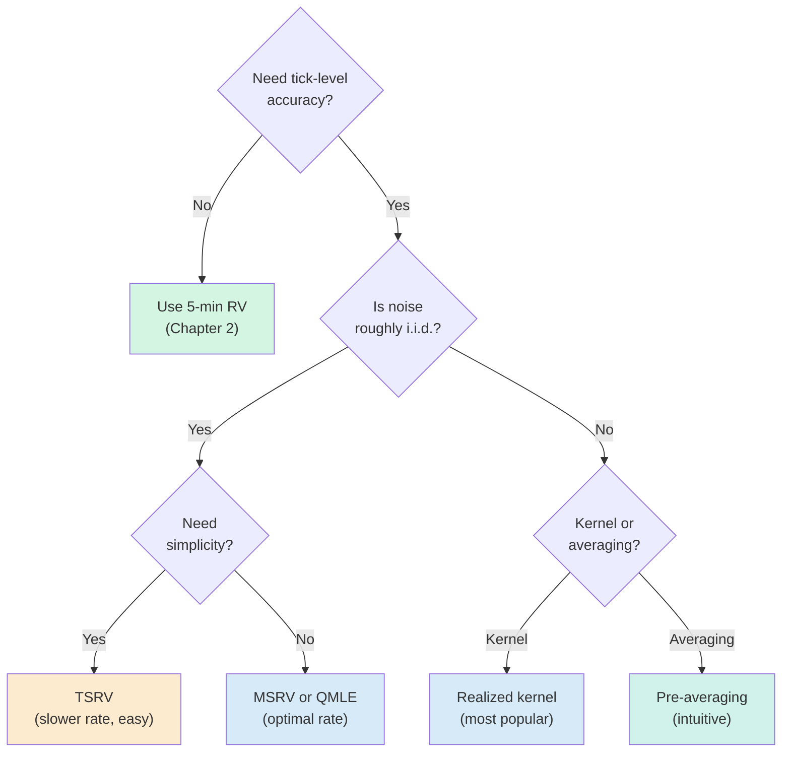

# Chapter 3: Microstructure Noise and Robust Estimators

> **Application: Why This Chapter**
> Microstructure noise is the reason you cannot simply sample tick-by-tick and compute realized variance.
> This chapter teaches when noise matters, how it biases RV, and the family of robust estimators that correct for it.
> [Chapter 10](ch10-feature-engineering.md) uses these estimators as features.
> Project 2 (LOB-based intraday) works directly in the high-frequency regime where noise is most severe.

[Chapter 2](ch02-realized-volatility.md) ended with a paradox.
The theory says "sample as fast as possible": more intraday returns means a more precise estimate of integrated variance.
But the volatility signature plot showed that sampling faster than about 5 minutes makes the estimate *worse*, not better, because microstructure noise inflates the sum of squared returns.
This chapter explains exactly where that noise comes from, quantifies the damage it does, and develops four estimators that fix the problem: TSRV, MSRV, the realized kernel, and pre-averaging.

## The Microstructure Noise Problem

[Chapter 2](ch02-realized-volatility.md) introduced the noise model $p^*_{t,i} = p_{t,i} + \varepsilon_{t,i}$ (the noise model equation) and showed that noise causes RV to diverge.
This section digs into *where* the noise comes from, because understanding the source tells you when it matters and when it does not.

> **Prereq: Bid, Ask, Mid, and Spread**
> At any moment, a stock has two prices: the *bid* (the highest price a buyer will pay) and the *ask* (the lowest price a seller will accept).
> The *mid price* is the average, $(P_{\text{bid}} + P_{\text{ask}})/2$.
> The *spread* is $P_{\text{ask}} - P_{\text{bid}}$.
> Transaction prices alternate between bid and ask depending on who initiates the trade (a market buy hits the ask; a market sell hits the bid).

> **Prereq: Sampling Frequency Terminology**
> "Sampling at 1-second frequency" means computing one return per second.
> A 6.5-hour U.S. equity trading day has $6.5 \times 3{,}600 = 23{,}400$ one-second intervals.
> "Tick-by-tick" means using every single trade as a price observation; for liquid stocks, this can mean thousands of observations per minute.

There are three main sources of microstructure noise.

**Source 1: Bid-ask bounce.**
Even if the true value of a stock is perfectly constant at \$50.00, alternating buys and sells produce transaction prices that bounce between \$49.99 (bid) and \$50.01 (ask).
Computing returns from these prices generates a sequence of $+0.02$, $-0.02$, $+0.02$, $\ldots$ that has nothing to do with actual volatility.
Squaring and summing these fake returns inflates RV.
Bid-ask bounce is the dominant source of noise for most liquid assets (Hansen and Lunde, 2006).

The figure below illustrates how bid-ask bounce creates spurious volatility even when the true price is constant.

*[Figure: Bid-ask bounce with constant true value. The true efficient price (blue dashed) is constant at \$50.00, while transaction prices (black markers) bounce between the bid level (\$49.99, red dashed) and the ask level (\$50.01, green dashed) across 20 trades. Each trade generates a return of $\pm 0.04\%$ (e.g., $r = -0.04\%$ moving from ask to bid, $r = +0.04\%$ moving from bid to ask) that is pure noise. Squaring and summing these fake returns inflates RV far above zero.]*

**Source 2: Discrete tick sizes.**
Prices on exchanges are quoted in discrete increments (one cent for U.S. equities).
When the true efficient price is \$50.003, the observed price must round to either \$50.00 or \$50.01.
This rounding adds a small, mean-zero error to every observation.
At very high frequencies, these rounding errors accumulate into a non-trivial noise term.

**Source 3: Price staleness.**
Illiquid stocks may not trade every second.
If you sample the "last trade price" at regular intervals, you often repeat the same stale price.
The resulting return is zero, which underestimates true volatility.
When a new trade finally arrives, the return is artificially large.
This creates spurious autocorrelation in returns (Aït-Sahalia, Mykland, and Zhang, 2005).

> **Intuition: Why Noise Kills High-Frequency RV**
> At very high frequencies, observed prices alternate between bid and ask.
> Squaring these back-and-forth moves inflates the sum far beyond the true volatility.
> The signal (real price moves) scales with the time interval $\Delta$, but the noise (bid-ask bounce) has a roughly constant variance $\omega^2$ per observation.
> As you shrink $\Delta$, the noise-to-signal ratio explodes: each return is mostly noise, and you are summing $n = 1/\Delta$ of them.

**Source 4: Adverse selection (information asymmetry).**
Beyond mechanical noise, spreads reflect a deeper economic force.
Glosten and Milgrom (1985) showed that market makers widen spreads because some counterparties possess private information.
The **bid-ask spread** must compensate for losses to informed traders:
$$
  s_t \;\propto\; \alpha \cdot \sigma_v
$$
where $\alpha$ is the probability the counterparty is informed and $\sigma_v$ is the volatility of the information signal.
When volatility is high, information asymmetry increases (there is more to know), so spreads widen mechanically.
This creates a feedback loop: high vol leads to wider spreads, which creates more noise in transaction prices, which creates more biased RV estimates.

This means microstructure noise is not merely a nuisance to filter; it carries information about market quality and **informed-trading intensity** that can itself predict future volatility ([Chapter 10](ch10-feature-engineering.md)).

A related insight from Roll (1984) (Roll, R. (1984). A simple implicit measure of the effective bid-ask spread in an efficient market. *The Journal of Finance*, 39(4), 1127-1139): the first-order autocovariance of price changes satisfies $\operatorname{Cov}(\Delta p_t, \Delta p_{t+1}) = -s^2/4$.
This connects the noise-robust estimators developed later in this chapter (which exploit autocovariance structure) to a liquidity interpretation.

### Quantifying the Bias

The standard noise model assumes the observed log price is the true (efficient) price plus i.i.d. noise:
$$
  p^*_{t,i} = p_{t,i} + \varepsilon_{t,i}, \qquad \varepsilon_{t,i} \overset{\text{iid}}{\sim} (0, \omega^2)
$$

The fundamental question is: if you compute RV from noisy prices, how far off is the answer?
Hansen and Lunde (2006) and Aït-Sahalia, Mykland, and Zhang (2005) showed that, under this model, the expected value of noisy RV decomposes into signal plus a noise term that scales with the number of observations:

$$
  \mathbb{E}[\operatorname{RV}_t^{(\text{noisy})}] = \operatorname{IV}_t + 2n\omega^2
$$

- $\operatorname{RV}_t^{(\text{noisy})}$: realized variance computed from observed (noisy) prices
- $\operatorname{IV}_t$: true integrated variance (the target)
- $n$: number of intraday returns
- $\omega^2$: variance of the microstructure noise per observation
- $2n\omega^2$: the noise-induced bias, linear in $n$

> **Intuition: In Plain English**
> On average, noisy RV equals the true volatility plus a junk term that grows in proportion to how many returns you use.
> Every return you add contributes a little bit of noise variance ($2\omega^2$), so using more returns makes the contamination worse, not better.
> This is the opposite of what you would expect from classical statistics, where more data means more precision.

> **Project Connection: Why This Matters**
> This equation is the reason your vol forecasting project uses 5-minute returns instead of tick-by-tick data.
> At 5-minute frequency ($n \approx 78$ for U.S. equities), the bias $2n\omega^2$ is small enough to ignore for most liquid stocks.
> If you ever move to higher-frequency data, you will need the noise-robust estimators developed later in this chapter.

The bias $2n\omega^2$ grows linearly with the number of observations.
As $n \to \infty$ (tick-by-tick), the bias term dominates and $\operatorname{RV}_t^{(\text{noisy})} \to \infty$.
The $\operatorname{IV}_t$ term becomes a negligible fraction of the total.

> **Warning: The Bias Is Not Just Upward**
> The i.i.d. noise model predicts a purely upward bias.
> In practice, noise can also be negatively autocorrelated (alternating buys and sells) or positively autocorrelated (momentum in order flow), which can shift the bias in either direction.
> Hansen and Lunde (2006) found that the simple i.i.d. model is a useful first approximation for liquid stocks, but the actual noise structure is more complex.
> Always inspect the volatility signature plot for your specific asset.

## The Volatility Signature Plot

[Chapter 2](ch02-realized-volatility.md) introduced the volatility signature plot.
This section explains it as a *diagnostic tool*: the first thing you should plot before choosing an estimator or sampling frequency.

> **Definition: Volatility Signature Plot (Formal)**
> The volatility signature plot displays $\bar{\operatorname{RV}}(\Delta)$, the average realized variance computed across $T$ days, as a function of the sampling interval $\Delta$:
> $$
>   \bar{\operatorname{RV}}(\Delta) = \frac{1}{T} \sum_{t=1}^{T} \operatorname{RV}_t(\Delta)
> $$
> - $\Delta$: sampling interval (e.g., 1 second, 1 minute, 5 minutes, $\ldots$)
> - $\operatorname{RV}_t(\Delta)$: realized variance for day $t$ computed at interval $\Delta$
> - $T$: number of trading days in the sample
>
> The $x$-axis shows $\Delta$ (often on a log scale), and the $y$-axis shows $\bar{\operatorname{RV}}(\Delta)$.

The figure below illustrates the three regimes.

*[Figure: Volatility signature plot with three regimes, plotting average realized variance $\bar{\operatorname{RV}}(\Delta)$ against sampling interval $\Delta$ (1s, 5s, 15s, 30s, 1m, 5m, 15m, 30m, 1h, 2h, 1d). Left (red), noise-dominated: RV is inflated by $2n\omega^2$, falling from about 4.8 at 1s to 1.45 at 1m, following $\mathbb{E}[\operatorname{RV}] \approx \operatorname{IV} + 2n\omega^2$. Center (green), the sweet spot: RV is close to true $\operatorname{IV}_t$, around 1.10-1.18 from 5m to 30m. Right (orange), inefficient: too few observations cause high estimation variance, with RV falling away from true IV toward 0.55 by 1d. The dashed blue line marks the true integrated variance at $\operatorname{IV}_t \approx 1.10$. The curve flattens around 1-15 minutes for liquid U.S. equities.]*

> **Key Idea: The Volatility Signature Plot Is a Diagnostic, Not a Conclusion**
> The shape of the volatility signature plot tells you where noise begins to bite for your specific asset.
> Before computing RV for any analysis, plot $\bar{\operatorname{RV}}(\Delta)$ for a range of frequencies.
> If the curve is still rising at your chosen frequency, you are in the noise-contaminated region and must either reduce frequency or use a noise-robust estimator from this chapter.

> **Warning: The Sweet Spot Varies by Asset**
> The 5-minute rule of thumb holds for liquid large-cap equities and major FX pairs.
> For less liquid instruments (small-cap stocks, emerging-market currencies, corporate bonds), the noise-contaminated region can extend to 15 or even 30 minutes (Hansen and Lunde, 2006).
> For extremely liquid futures (e.g., E-mini S&P 500), the curve may flatten by 1 minute.
> Always check empirically.

## Two-Scales Realized Volatility (TSRV)

The volatility signature plot shows that standard RV is badly biased at high frequencies.
One approach ([Chapter 2](ch02-realized-volatility.md)) is to avoid the problem by sampling at 5 minutes.
A better approach is to *correct* for the noise and use all the high-frequency data.
The Two-Scales Realized Volatility (TSRV) estimator, developed by Zhang, Mykland, and Aït-Sahalia (2005), is the simplest noise-robust estimator.

> **Intuition: The Two-Scales Idea**
> Compute RV at two different frequencies: a "fast" scale (e.g., every 1 minute) and a "slow" scale (e.g., every 30 minutes).
> The fast-scale RV picks up both signal and noise: $\operatorname{RV}^{(\text{fast})} \approx \operatorname{IV}_t + 2n_{\text{fast}}\omega^2$.
> The slow-scale RV also picks up signal and noise, but with far fewer observations: $\operatorname{RV}^{(\text{slow})} \approx \operatorname{IV}_t + 2n_{\text{slow}}\omega^2$.
> However, the key insight is that the *noise per observation* is the same at both scales.
> By taking a specific weighted difference of the two, you can cancel the noise term and isolate the signal.

### Construction

TSRV works with subsampled realized variances.
Instead of computing a single RV on a non-overlapping grid, you average over all possible starting points.

> **Prereq: Subsampling**
> A "subsampled" RV at scale $K$ takes the original $n$ tick prices and computes $K$ separate realized variances, each on a non-overlapping grid offset by one tick.
> For example, with $K = 3$, you compute RV using ticks $\{1, 4, 7, \ldots\}$, then $\{2, 5, 8, \ldots\}$, then $\{3, 6, 9, \ldots\}$, and average the three.
> This "average RV" uses all the data while spacing returns $K$ ticks apart.

Denote the subsampled (averaged) RV at scale $K$ as $\operatorname{RV}^{(\text{avg}, K)}_t$.
TSRV uses a fast scale $K = 1$ (every tick) and a slow scale $K = K_{\text{slow}}$ (spaced-out returns):

> **Definition: Two-Scales Realized Volatility (TSRV)**
> $$
>   \widehat{\operatorname{IV}}_t^{\text{TSRV}} = \operatorname{RV}^{(\text{avg}, K_{\text{slow}})}_t - \frac{\bar{n}_{K_\text{slow}}}{n}\, \operatorname{RV}^{(\text{all})}_t
> $$
> - $\operatorname{RV}^{(\text{avg}, K_{\text{slow}})}_t$: the subsampled (averaged) RV computed with returns spaced $K_{\text{slow}}$ ticks apart
> - $\operatorname{RV}^{(\text{all})}_t$: realized variance computed from all $n$ tick-by-tick returns (the "fast scale")
> - $\bar{n}_{K_\text{slow}} = (n - K_{\text{slow}} + 1)/K_{\text{slow}}$: the average number of returns per subsample at the slow scale
> - $n$: total number of tick-level returns
> - The ratio $\bar{n}_{K_\text{slow}} / n$ is a small number; the second term removes the noise bias from the first

> **Intuition: Why the Subtraction Works**
> Both $\operatorname{RV}^{(\text{avg}, K_{\text{slow}})}_t$ and $\operatorname{RV}^{(\text{all})}_t$ contain a noise bias proportional to $2 \omega^2 \times (\text{number of returns})$.
> The subsampled slow-scale RV has bias $\approx 2\bar{n}_{K_\text{slow}}\omega^2$.
> The all-tick RV has bias $\approx 2n\omega^2$.
> Subtracting $(\bar{n}_{K_\text{slow}} / n) \times \operatorname{RV}^{(\text{all})}_t$ removes exactly $2\bar{n}_{K_\text{slow}}\omega^2$ from the slow-scale estimate, canceling the noise.

> **Project Connection: Why This Matters**
> TSRV is the conceptual foundation for all noise-robust estimators.
> Even if you use 5-minute RV for your HAR model, understanding TSRV tells you exactly what you are giving up: the ability to use all available tick data.
> If you extend the project to intraday forecasting or LOB-based features, TSRV is the simplest estimator to implement as a first noise-robust baseline.

The figure below illustrates the two scales on the same price path.

*[Figure: TSRV uses two scales on the same price path of 24 ticks of noisy log prices. Red: fast scale (every tick, marked with x), picks up both signal and noise, with returns $r^{\text{fast}}_1, r^{\text{fast}}_2, \ldots$ spanning one tick each. Blue: slow scale (every 6 ticks, marked with filled circles at ticks 0, 6, 12, 18, 24), picks up signal with less noise but fewer observations, with returns $r^{\text{slow}}_1, r^{\text{slow}}_2, \ldots$ spanning six ticks each. TSRV subtracts a noise correction derived from the fast scale to debias the slow-scale estimate.]*

### Convergence Rate

> **Key Result: Zhang, Mykland, and Aït-Sahalia (2005): TSRV Convergence**
> Under the i.i.d. noise model, the optimal choice of $K_{\text{slow}}$ yields a convergence rate of $n^{-1/6}$ for the TSRV estimator:
> $$
>   \widehat{\operatorname{IV}}_t^{\text{TSRV}} - \operatorname{IV}_t = O_p(n^{-1/6})
> $$
> For comparison, the standard 5-minute RV (without noise correction) converges at rate $n^{-1/2}$ but only *if you ignore noise*.
> With noise, standard RV does not converge at all.
> TSRV is the first estimator that is consistent in the presence of noise.

The $n^{-1/6}$ rate is slower than the noise-free $n^{-1/2}$.
This is the price you pay for not knowing the noise level $\omega^2$ a priori.
Subsequent estimators (MSRV, realized kernel) improve this rate.

## Multi-Scale Realized Volatility (MSRV)

TSRV uses two scales.
A natural extension is to use *many* scales simultaneously.
Zhang (2006) developed the Multi-Scale Realized Volatility (MSRV) estimator, which combines information from multiple time scales to achieve a faster convergence rate.

> **Intuition: From Two Scales to Many**
> Think of TSRV as using a single pair of binoculars: one lens zoomed in (fast scale) and one zoomed out (slow scale).
> MSRV uses an entire array of zoom levels, weighting each one optimally.
> More zoom levels means more information about how the noise distorts each scale, which means a more precise correction.

> **Definition: Multi-Scale Realized Volatility (MSRV)**
> MSRV takes a weighted combination of subsampled RVs at $J$ different scales $K_1 < K_2 < \cdots < K_J$:
> $$
>   \widehat{\operatorname{IV}}_t^{\text{MSRV}} = \sum_{j=1}^{J} a_j \, \operatorname{RV}^{(\text{avg}, K_j)}_t
> $$
> - $\operatorname{RV}^{(\text{avg}, K_j)}_t$: subsampled RV at scale $K_j$ (same construction as in TSRV)
> - $a_j$: weights chosen to (i) cancel the noise bias and (ii) minimize variance
> - $J$: number of scales; Zhang (2006) showed that the optimal $J$ grows with $n$
> - The weights satisfy $\sum_j a_j = 1$ (so the estimator targets $\operatorname{IV}_t$) and a second constraint that cancels the $\omega^2$ bias

> **Intuition: In Plain English**
> MSRV says: instead of looking at the data through just two zoom levels (fast and slow), look through many zoom levels and combine them with carefully chosen weights.
> The weights are picked so that all the noise cancels out, while squeezing as much precision as possible from each scale.
> It is a weighted average of the same subsampled RVs that TSRV uses, but with more of them and smarter weights.

> **Project Connection: Why This Matters**
> MSRV proves that the $n^{-1/4}$ rate is achievable and establishes the theoretical efficiency frontier for noise-robust estimation.
> In practice, the realized kernel (next section) is easier to tune and achieves the same rate, so MSRV is more important as a theoretical benchmark than as a tool you would implement for your vol forecasting pipeline.

> **Key Result: Zhang (2006): MSRV Achieves the Optimal Rate**
> The MSRV estimator achieves the convergence rate $n^{-1/4}$:
> $$
>   \widehat{\operatorname{IV}}_t^{\text{MSRV}} - \operatorname{IV}_t = O_p(n^{-1/4})
> $$
> This is the best possible rate for any estimator under the i.i.d. noise model without knowing $\omega^2$.
> For context: with $n = 23{,}400$ one-second observations, $n^{-1/4} \approx 0.081$, compared to $n^{-1/6} \approx 0.188$ for TSRV.
> MSRV is roughly 2.3 times more precise than TSRV for the same data.

In practice, MSRV is straightforward to implement (it is a weighted sum of subsampled RVs), but the optimal weight selection requires choosing $J$ and the scale grid $\{K_j\}$.
Zhang (2006) provides explicit formulas.
For most applied work, the realized kernel (next section) is preferred because it achieves the same $n^{-1/4}$ rate with a simpler tuning procedure.

## The Realized Kernel

The realized kernel, developed by Barndorff-Nielsen, Hansen, Lunde, and Shephard (2008), is the most widely used noise-robust estimator in the volatility literature.
It achieves the optimal $n^{-1/4}$ convergence rate (same as MSRV) with a clean, intuitive construction.

> **Intuition: Noise as Spurious Autocorrelation**
> Under the i.i.d. noise model, the *observed* returns $r^*_{t,i}$ have negative first-order autocorrelation: if the noise pushes the price up this tick, the next return is more likely to be negative (reverting the noise).
> This spurious autocorrelation shows up in the autocovariances of returns.
> The realized kernel idea: compute the autocovariance function of observed returns and use a kernel weighting to remove the noise-induced autocorrelation while keeping the genuine signal.

> **Prereq: Autocovariance**
> The autocovariance at lag $h$ of a sequence $\{x_1, \ldots, x_n\}$ measures the linear association between observations $h$ steps apart:
> $$
>   \hat{\gamma}_h = \frac{1}{n} \sum_{i=1}^{n-h} (x_i - \bar{x})(x_{i+h} - \bar{x})
> $$
> For returns, lag 0 autocovariance is the variance.
> Lag 1 autocovariance measures whether today's return predicts tomorrow's (or this tick's return predicts the next).

> **Prereq: Kernel Functions**
> A kernel function $k(x)$ is a smooth weighting function satisfying $k(0) = 1$ and $k(x) \to 0$ as $|x| \to \infty$.
> It assigns full weight to the center (lag 0) and smoothly downweights observations further away.
> Common examples: the Bartlett kernel $k(x) = 1 - |x|$ for $|x| \leq 1$ (a triangle), and the Parzen kernel (a piecewise cubic that is smoother at the boundary).

### Construction

The realized kernel takes the autocovariances of observed returns and weights them with a kernel function.

> **Definition: Realized Kernel**
> $$
>   \widehat{K}_t = \sum_{h=-H}^{H} k\!\left(\frac{h}{H+1}\right) \hat{\gamma}_h
> $$
> - $\hat{\gamma}_h = \sum_{i=1}^{n-|h|} r^*_{t,i}\, r^*_{t,i+|h|}$: the $h$-th sample autocovariance of observed (noisy) returns; note $\hat{\gamma}_0 = \operatorname{RV}_t^{(\text{noisy})}$
> - $k(\cdot)$: a kernel function with $k(0) = 1$, typically the Parzen kernel
> - $H$: bandwidth (number of lags included); controls the bias-variance tradeoff
> - The sum runs from $-H$ to $H$, so both positive and negative lags are included
> - $k(h/(H+1))$: the weight assigned to autocovariance at lag $h$; lags near zero get high weight, distant lags get low weight

> **Intuition: In Plain English**
> The realized kernel starts with the naive RV (the lag-0 autocovariance) and then adds in weighted autocovariances at nearby lags.
> The negative autocovariances at lag $\pm 1$, caused by bid-ask bounce, partially cancel the noise that inflated the lag-0 term.
> The kernel function smoothly tapers the weights so that distant lags (which are mostly estimation noise) contribute very little.
> The result is an estimate that keeps the true volatility signal while subtracting out the spurious noise component.

> **Project Connection: Why This Matters**
> The realized kernel is the default noise-robust estimator in empirical finance and the one you are most likely to encounter in published vol forecasting papers.
> If you extend your project beyond 5-minute RV (for example, to compute more accurate daily IV estimates or to work with tick-level LOB data), the realized kernel from the `highfrequency` R package is the standard tool.
> Using it as a feature alongside 5-minute RV in your HAR model could capture information about intraday noise intensity.

The "flat-top" property is important: Barndorff-Nielsen, Hansen, Lunde, and Shephard (2008) require $k'(0) = 0$ (the kernel is flat at the origin), which ensures that the noise bias is removed at the correct rate.
The Parzen kernel satisfies this.

The figure below shows how the Parzen kernel assigns weights to different lags.

*[Figure: Parzen kernel weight function $k(x)$ plotted against the normalized lag $x = h/(H+1)$ over the range $[-1.2, 1.2]$. The kernel peaks at $k(0) = 1$ and is piecewise: $k(x) = 1 - 6x^2 + 6|x|^3$ for $|x| \leq 0.5$, $k(x) = 2(1 - |x|)^3$ for $0.5 < |x| \leq 1$, and $k(x) = 0$ for $|x| > 1$. The function shows smooth decay from the center, assigning full weight to the zero-lag autocovariance (which is just RV) and smoothly downweighting higher lags; lags beyond $H$ receive zero weight. The flat top ($k'(0) = 0$) ensures correct noise removal.]*

### Why It Works

The logic is:

1. **Lag 0**: The zero-lag autocovariance $\hat{\gamma}_0 = \operatorname{RV}_t^{(\text{noisy})}$ contains the signal plus noise bias.
2. **Lags 1, 2, $\ldots$**: The noise-induced autocorrelation appears at lag $\pm 1$ (and possibly a few more lags for dependent noise). These autocovariances are negative on average, reflecting the bid-ask bounce reversal.
3. **Kernel weighting**: By including these negative autocovariances with appropriate weights, their sum partially cancels the positive noise bias in $\hat{\gamma}_0$.
4. **Higher lags**: Beyond a few lags, the noise-induced autocorrelation dies out, and genuine autocorrelation (if any) is captured.

> **Key Idea: The Realized Kernel in Practice**
> The realized kernel is the most widely used noise-robust estimator in empirical finance.
> It achieves the optimal convergence rate ($n^{-1/4}$), handles moderately dependent noise (not just i.i.d.), has well-understood asymptotic theory, and is implemented in standard packages (`highfrequency` in R, `realized` in MATLAB).
> If you need a noise-robust daily RV estimate, the realized kernel is the default choice.

### Bandwidth Selection

The bandwidth $H$ controls how many autocovariance lags are included.

- **Too small $H$**: not enough lags to fully remove the noise bias; the estimator is biased upward.
- **Too large $H$**: too many noisy autocovariance estimates are included; the estimator has high variance.

Barndorff-Nielsen, Hansen, Lunde, and Shephard (2008) showed that the optimal bandwidth scales as $H^* \propto n^{3/5}$.
For $n = 23{,}400$ one-second observations, this gives $H^* \approx 23{,}400^{3/5} \approx 418$.
Data-driven bandwidth selection methods (analogous to those used in spectral density estimation) are available and recommended for applied work.

## Pre-Averaging

Pre-averaging, developed by Jacod, Li, Mykland, Podolskij, and Vetter (2009), takes a different approach to the noise problem.
Instead of correcting the autocovariance structure (as the realized kernel does), it smooths the noise out of the price path *before* computing squared returns.

> **Intuition: Smoothing Out the Bounce**
> If bid-ask bounce makes individual prices noisy, averaging a few adjacent prices should cancel some of the noise (positive and negative noise terms offset).
> Pre-averaging does exactly this: replace each price $p^*_{t,i}$ with a local average of nearby prices, then compute returns and sum their squares.
> The local averaging shrinks the noise while preserving the signal.

### Construction

> **Definition: Pre-Averaged Realized Variance**
> Choose a block length $L$ and a weight function $g:[0,1] \to \mathbb{R}$ (typically $g(x) = \min(x, 1-x)$).
> Define the pre-averaged price:
> $$
>   \bar{p}^*_{t,i} = \sum_{j=1}^{L-1} g\!\left(\frac{j}{L}\right) \Delta p^*_{t,i+j}
> $$
> where $\Delta p^*_{t,i+j} = p^*_{t,i+j} - p^*_{t,i+j-1}$ is the tick-by-tick return.
> The pre-averaged realized variance is:
> $$
>   \widehat{\operatorname{IV}}_t^{\text{PA}} = \frac{1}{L \psi_2} \sum_{i=0}^{n - L} (\bar{p}^*_{t,i})^2 - \frac{\psi_1}{2 L \psi_2}\, \operatorname{RV}^{(\text{all})}_t
> $$
> - $\bar{p}^*_{t,i}$: the pre-averaged return at position $i$ (a weighted sum of $L-1$ tick returns)
> - $g(j/L)$: weight function; the standard choice $g(x) = \min(x, 1-x)$ gives a triangular shape that ramps up then ramps down
> - $\psi_1 = \int_0^1 [g'(x)]^2\,dx$ and $\psi_2 = \int_0^1 [g(x)]^2\,dx$: constants determined by the weight function
> - $\operatorname{RV}^{(\text{all})}_t$: tick-by-tick RV (used for a small bias correction, analogous to the TSRV correction)
> - $L$: block length; the optimal choice is $L \propto n^{1/2}$

> **Intuition: In Plain English**
> Pre-averaging works in two steps.
> First, it replaces each noisy price with a local moving average of nearby prices (the pre-averaged price equation), which smooths out the bid-ask bounce in the same way that averaging poll results smooths out sampling error.
> Second, it computes a sum of squared "pre-averaged returns" (the pre-averaged realized variance equation), with a small bias correction subtracted (the second term), playing the same debiasing role as the fast-scale correction in TSRV.

> **Project Connection: Why This Matters**
> Pre-averaging is particularly relevant if your project uses tick-level order book data, because it provides a natural way to construct "clean" returns from noisy transaction prices before feeding them into ML features.
> The block length $L$ is the single tuning parameter, and its optimal value $L \propto n^{1/2}$ means you can set it automatically from the number of ticks in a day.

The figure below compares raw and pre-averaged returns.

*[Figure: Two-panel comparison of raw tick returns versus pre-averaged returns. Left panel (red): raw tick returns over 40 ticks, showing large alternating moves between roughly $+0.0035$ and $-0.003$ around the zero line (bid-ask bounce). Right panel (green): pre-averaged returns with block length $L = 5$ over 10 blocks, showing much smaller, more stable values between roughly $+0.0008$ and $-0.0004$. Pre-averaging smooths out the noise, producing smaller, more stable returns that better reflect true price variation.]*

> **Key Result: Jacod, Li, Mykland, Podolskij, and Vetter (2009): Pre-Averaging Convergence**
> With the optimal block length $L \propto n^{1/2}$, the pre-averaged estimator achieves the optimal convergence rate $n^{-1/4}$, the same as MSRV and the realized kernel.
> The pre-averaging approach also provides a feasible central limit theorem, enabling confidence intervals for integrated variance.

## Other Estimators

The four estimators above (TSRV, MSRV, realized kernel, pre-averaging) are the most cited.
Several other approaches exist and are worth brief mention.

**Subsampled/Averaged RV.**
Before TSRV was developed, practitioners used averaged RV (computing multiple RVs on offset grids and averaging them) to reduce noise.
This is the slow-scale component of TSRV without the bias correction.
It reduces noise variance but does not eliminate the bias.
It remains a useful quick fix when the noise level is low.

**Fourier Estimator.**
Malliavin and Mancino (2002), Malliavin and Mancino (2009) proposed estimating integrated variance via the Fourier coefficients of the price process.
The idea: the variance is related to the squared magnitude of low-frequency Fourier coefficients, while noise concentrates at high frequencies.
By truncating high-frequency components, you filter out the noise.
The Fourier estimator is less widely used in practice but has elegant theoretical properties and does not require equally spaced observations.

**Quasi-Maximum Likelihood Estimator (QMLE).**
Xiu (2010) proposed treating the noisy price observations as a state-space model: the true price is the latent state, and the observed price adds Gaussian noise.
Applying the Kalman filter produces a quasi-maximum likelihood estimate of integrated variance and the noise variance $\omega^2$ jointly.
The QMLE achieves the optimal $n^{-1/4}$ rate and provides a natural estimate of $\omega^2$ as a byproduct.

> **Key Idea: All Roads Lead to $n^{-1/4}$**
> Under the standard i.i.d. noise model, the best possible convergence rate is $n^{-1/4}$.
> All of the modern estimators (MSRV, realized kernel, pre-averaging, QMLE) achieve this rate.
> They differ in implementation details, robustness to dependent noise, and ease of tuning, but their asymptotic efficiency is the same.

## Which Estimator to Use

You now have a menu of noise-robust estimators.
The practical question is: which one should you use?
The answer depends on your goal.

The figure below shows how the different estimators behave on the volatility signature plot.
The key visual takeaway: noise-robust estimators produce a flat line across frequencies, while naive RV diverges.

*[Figure: Volatility signature plot comparing estimators, plotting estimated variance against sampling interval (1s through 1d). The dashed black line marks true $\operatorname{IV}_t \approx 1.10$. Naive RV (red) diverges at high frequencies, falling from about 4.8 at 1s toward true IV near 5m-30m, then dropping to 0.55 at 1d. TSRV (orange, $n^{-1/6}$) is consistent but has a slower convergence rate, sitting around 1.35 at 1s and tapering with slight upward bias at the highest frequencies. The realized kernel (blue, $n^{-1/4}$) and pre-averaging (green, $n^{-1/4}$) achieve the optimal rate and remain close to the true $\operatorname{IV}_t$ (around 1.11-1.16) across all frequencies. At very low frequencies (right side), all estimators lose precision due to too few observations, dropping toward 0.55-0.60 by 1d. The noise-robust estimators stay near true $\operatorname{IV}_t$ over the high-frequency range while naive RV diverges.]*

### Comparison Table

The table below summarizes the key properties.

| Estimator | Rate | Noise assumption | Practical notes |
|---|---|---|---|
| 5-min RV | $n^{-1/2}$ (no noise) | Avoids noise | Simple; hard to beat for forecasting (Liu, Patton, and Sheppard, 2015) |
| TSRV | $n^{-1/6}$ | i.i.d. | First consistent estimator with noise; easy to implement |
| MSRV | $n^{-1/4}$ | i.i.d. | Optimal rate; weight selection requires tuning |
| Realized kernel | $n^{-1/4}$ | Dependent OK | Most widely used; Parzen kernel standard; bandwidth data-driven |
| Pre-averaging | $n^{-1/4}$ | Dependent OK | Intuitive; provides feasible CLT; block length $L \propto n^{1/2}$ |
| QMLE | $n^{-1/4}$ | Gaussian noise | Joint estimate of $\operatorname{IV}$ and $\omega^2$; state-space framework |

*Comparison of noise-robust realized variance estimators.*

### Decision Flowchart

The diagram below provides a practical decision tree.

*Decision tree for choosing a noise-robust estimator. For daily volatility forecasting, 5-min RV is the starting point. For intraday analysis or when estimation accuracy matters, use the realized kernel (default) or pre-averaging. TSRV is the simplest noise-robust estimator and a good starting point for learning.*

> **Key Idea: Practical Guidance**
> For daily RV forecasting ([Chapter 6](ch06-har-model.md) and [Chapter 10](ch10-feature-engineering.md)), simple 5-minute RV suffices.
> Liu, Patton, and Sheppard (2015) showed that noise-robust estimators rarely produce better *forecasts* of future volatility, even though they produce more accurate *estimates* of today's integrated variance.
> For estimation accuracy, intraday analysis, or when working with tick data in Project 2, use the realized kernel as the default.

> **Project Connection: Why This Matters**
> For your HAR-based vol forecasting project, the practical takeaway from this chapter is threefold.
> First, 5-minute RV is your primary target variable, and it works well precisely because it sidesteps the noise problem.
> Second, the *difference* between noise-robust RV (e.g., realized kernel) and 5-minute RV on the same day is itself a signal: it measures how much microstructure noise is present, which proxies for liquidity and can be used as an ML feature.
> Third, if you extend the project to higher-frequency forecasting or LOB data, you now know exactly which estimators to reach for and why.

## Summary

- **Three noise sources**: bid-ask bounce (dominant for liquid assets), discrete tick sizes, and price staleness each corrupt high-frequency prices.

- **Noise model**: observed log price $p^* = p + \varepsilon$, where $\varepsilon$ is mean-zero noise with variance $\omega^2$. Under this model, noisy RV has bias $2n\omega^2$, which diverges as $n \to \infty$.

- **Volatility signature plot**: plot average RV vs. sampling frequency. If the curve is still rising at your chosen frequency, you are in the noise-contaminated region. Always check this diagnostic before computing RV.

- **TSRV** (Zhang, Mykland, and Aït-Sahalia, 2005): combines a fast-scale and slow-scale RV to cancel noise. First consistent estimator with noise. Convergence rate $n^{-1/6}$.

- **MSRV** (Zhang, 2006): extends TSRV to multiple scales, achieving the optimal convergence rate $n^{-1/4}$.

- **Realized kernel** (Barndorff-Nielsen, Hansen, Lunde, and Shephard, 2008): weights the autocovariances of observed returns with a flat-top kernel (e.g., Parzen). Handles dependent noise. Rate $n^{-1/4}$. The most widely used noise-robust estimator.

- **Pre-averaging** (Jacod, Li, Mykland, Podolskij, and Vetter, 2009): smooths prices over local blocks before computing squared returns. Rate $n^{-1/4}$. Provides a feasible CLT for inference.

- **Other approaches**: subsampled/averaged RV (simple but biased), Fourier estimator (Malliavin and Mancino, 2002), QMLE (Xiu, 2010).

- **All optimal estimators converge at $n^{-1/4}$** under i.i.d. noise. They differ in robustness to dependent noise, implementation complexity, and tuning requirements.

- **For forecasting**, 5-minute RV is hard to beat (Liu, Patton, and Sheppard, 2015). Noise-robust estimators improve *estimation* accuracy but these gains rarely translate into forecast improvements.

- **For estimation and intraday work**, the realized kernel is the default choice. Pre-averaging is a close second.

- [Chapter 4](ch04-jumps-continuous-variation.md) addresses a separate contamination: jump variation mixed into the continuous component.

- [Chapter 10](ch10-feature-engineering.md) uses both 5-minute RV and noise-robust estimators as ML features.

### Key Results Referenced in This Chapter

| Paper | Result | Relevance |
|---|---|---|
| Hansen and Lunde (2006) | Characterized the effect of microstructure noise on realized variance; showed noise causes divergence as sampling frequency increases; documented that the i.i.d. noise model is a useful first approximation. | Foundational empirical analysis of the noise problem; motivates all robust estimators. |
| Aït-Sahalia, Mykland, and Zhang (2005) | Showed that optimal sampling frequency balances bias (from noise) and variance (from fewer observations); derived the optimal $\Delta^*$ under the i.i.d. noise model. | Theoretical foundation for the volatility signature plot and the bias-variance tradeoff. |
| Zhang, Mykland, and Aït-Sahalia (2005) | Introduced TSRV: first estimator consistent for integrated variance in the presence of noise. Convergence rate $n^{-1/6}$. | The simplest noise-robust estimator; foundational for MSRV and other extensions. |
| Zhang (2006) | Extended TSRV to multiple scales (MSRV), achieving the optimal convergence rate $n^{-1/4}$. | Proved the $n^{-1/4}$ efficiency bound for noise-contaminated estimation. |
| Barndorff-Nielsen, Hansen, Lunde, and Shephard (2008) | Developed the realized kernel: flat-top kernel weighting of autocovariances. Rate $n^{-1/4}$, handles dependent noise. | The most widely used noise-robust estimator in practice. |
| Jacod, Li, Mykland, Podolskij, and Vetter (2009) | Introduced pre-averaging: smooth prices locally before computing RV. Rate $n^{-1/4}$, feasible CLT. | Intuitive alternative to the realized kernel. |
| Xiu (2010) | Proposed QMLE via Kalman filter on a state-space model. Rate $n^{-1/4}$, jointly estimates $\operatorname{IV}$ and $\omega^2$. | Useful when you also need a noise variance estimate. |
| Liu, Patton, and Sheppard (2015) | Compared ${\sim}400$ estimators across 31 assets: noise-robust estimators rarely improve *forecasts* over 5-min RV. | Key practical finding: estimation accuracy $\neq$ forecast accuracy. |

*Key results referenced in this chapter.*
