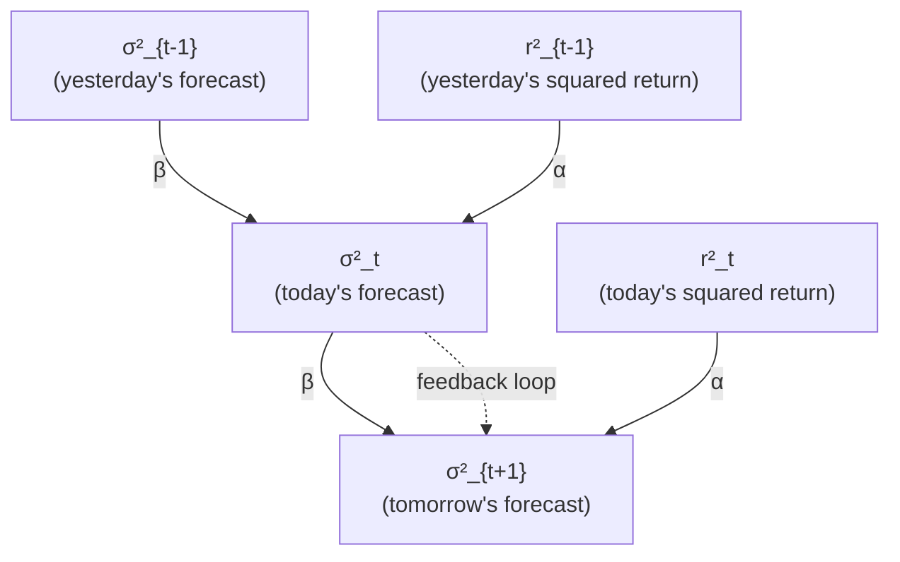
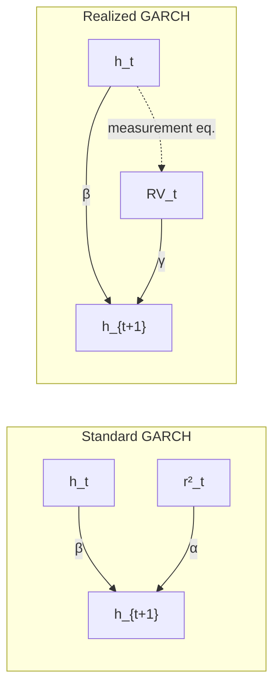

# The GARCH Family

> **Application: Why This Chapter?**
> GARCH models forecast volatility using only daily returns, without intraday data.
> They are the historical workhorse of volatility modeling and remain widely used in
> risk management systems. Understanding GARCH is necessary background for
> appreciating why the HAR model ([Chapter 6](ch06-har-model.md)), which uses realized
> volatility from intraday data, represents a significant improvement. Realized GARCH
> and the HEAVY model bridge these two worlds. Project 1 (HARQ-X) uses GARCH as a
> comparison baseline.

[Chapters 2--4](ch02-realized-volatility.md) built volatility estimators from intraday
data. This chapter steps back in time: before high-frequency data was widely
available, how did people forecast volatility? The answer is the GARCH family, a set
of models that extract volatility dynamics entirely from daily returns.

## The ARCH Model

We start with the simplest idea: yesterday's return tells you something about
today's volatility.

> **Prereq: Conditional vs. Unconditional Variance**
> The *unconditional* variance of a return series is a single number computed
> over the full sample: $\operatorname{Var}(r_t)$. The *conditional* variance
> $\sigma^2_t = \operatorname{Var}(r_t \mid \mathcal{F}_{t-1})$ is the variance you
> would forecast for period $t$, given everything you know up through period $t-1$
> (the information set $\mathcal{F}_{t-1}$). GARCH-family models are models for this
> conditional variance.

*[Figure: Volatility clustering over 100 trading days. Days 1--30 show calm periods with returns in the range $\pm 0.5\%$. Days 31--65 show a turbulent period with returns swinging between $-3.8\%$ and $+3.4\%$. Days 66--100 return to calm. Key values: calm returns $\approx \pm 0.5\%$; turbulent returns up to $\pm 3.8\%$.]*

> **Intuition: Why Squared Returns?**
> If a stock fell 3% yesterday, you expect higher volatility today. If it barely
> moved (0.1%), you expect calm. Squaring the return strips away the sign and gives a
> rough measure of how "big" the move was. ARCH formalizes this: the conditional
> variance is a weighted sum of past squared returns.

Engle (1982) proposed the ARCH($q$) model. In its simplest form, ARCH(1):

$$
\sigma^2_t = \omega + \alpha_1 \, r^2_{t-1}
$$

- $\sigma^2_t$: conditional variance for period $t$ (the quantity we forecast)
- $\omega > 0$: baseline variance level, ensuring $\sigma^2_t$ stays positive
  even when $r_{t-1} = 0$
- $\alpha_1 \geq 0$: sensitivity to the most recent squared return
- $r^2_{t-1}$: squared return from the previous period, a noisy proxy for
  realized variance

> **Intuition: In Plain English**
> Tomorrow's variance equals a floor level plus a correction based on how big today's
> move was. If the market barely moved, the forecast stays near the floor. If it moved
> a lot, the forecast jumps. This is the simplest possible "volatility responds to
> recent news" model.

> **Project Connection: Why This Matters**
> ARCH is the conceptual ancestor of every conditional variance model you will compare
> against. Its core idea (past squared returns predict future variance) reappears in
> the HAR model, which replaces squared returns with realized variance at multiple
> horizons.

The general ARCH($q$) model adds more lags:

$$
\sigma^2_t = \omega + \sum_{i=1}^{q} \alpha_i \, r^2_{t-i}
$$

- $q$: number of lags included
- $\alpha_i \geq 0$: weight on the squared return from $i$ days ago

> **Intuition: In Plain English**
> ARCH($q$) generalizes the same idea: instead of looking only at yesterday, you look
> at the last $q$ days of squared returns and take a weighted average. More lags let
> the model capture longer memory in volatility, but each lag adds a free parameter.

> **Warning: ARCH's Parameter Problem**
> Volatility is persistent: a shock today still affects volatility weeks later.
> Capturing this with ARCH requires many lags ($q = 10$ or more), each with its own
> parameter. This makes estimation fragile and overfitting likely. GARCH solves this.

## GARCH(1,1): The Workhorse Model

ARCH needs many parameters to capture persistence. The key insight of GARCH is
to add a single feedback term: let yesterday's *conditional variance* help
predict today's.

> **Intuition: GARCH as Exponential Smoothing**
> Think of a weather forecast. Tomorrow's temperature forecast depends on two things:
> (1) what actually happened today (the "news"), and (2) what you predicted
> yesterday. GARCH works the same way: the new volatility forecast blends today's
> squared return (news) with yesterday's forecast (memory). A single memory term
> replaces an infinite history of squared returns.

The following diagram shows how information flows in GARCH(1,1). Today's variance
forecast feeds into tomorrow's, creating a self-reinforcing loop that captures
persistence.

Bollerslev (1986) introduced the GARCH(1,1) model:

$$
\sigma^2_t = \omega + \alpha \, r^2_{t-1} + \beta \, \sigma^2_{t-1}
$$

- $\sigma^2_t$: conditional variance for period $t$
- $\omega > 0$: intercept, related to the long-run average variance
- $\alpha \geq 0$: reaction coefficient; how strongly the model reacts to
  new information (yesterday's squared return)
- $\beta \geq 0$: persistence coefficient; how much of yesterday's variance
  forecast carries forward
- $r^2_{t-1}$: yesterday's squared return (the "shock" or "news")
- $\sigma^2_{t-1}$: yesterday's conditional variance forecast (the "memory")

> **Intuition: In Plain English**
> Tomorrow's variance is a weighted average of three things: the long-run average
> variance ($\omega$), how big today's surprise was ($\alpha \, r^2_{t-1}$), and what
> you already thought variance was ($\beta \, \sigma^2_{t-1}$). The memory term
> $\beta \, \sigma^2_{t-1}$ is the key innovation over ARCH: it lets one parameter do
> the work of many lagged squared returns, because yesterday's forecast already
> encodes the entire history.

> **Project Connection: Why This Matters**
> GARCH(1,1) is your simplest conditional-variance baseline. In a model horse race,
> any ML model or HAR variant that cannot beat GARCH(1,1) out of sample is not worth
> the added complexity. Typical $\alpha + \beta \approx 0.98$ for equity indices,
> meaning volatility shocks are extremely persistent, the same stylized fact that HAR
> captures with its weekly and monthly RV components.

> **Definition: Stationarity Condition for GARCH(1,1)**
> The process is covariance-stationary if and only if
> $\alpha + \beta < 1$. When this holds, the unconditional (long-run) variance is:
>
> $$\bar{\sigma}^2 = \frac{\omega}{1 - \alpha - \beta}$$
>
> - $\bar{\sigma}^2$: the unconditional variance, i.e., the level to which
>   $\sigma^2_t$ mean-reverts over time
> - $\alpha + \beta$: total persistence; values close to 1 mean slow
>   mean-reversion (volatility shocks are long-lived)
>
> If $\alpha + \beta = 1$, the model becomes IGARCH (Integrated GARCH): shocks
> never decay, and the unconditional variance is undefined (Engle and Bollerslev, 1986).

> **Intuition: In Plain English**
> The unconditional variance is the "gravity" level that the conditional variance
> always pulls toward. When $\alpha + \beta$ is close to 1, the pull is very weak:
> after a volatility spike, it takes weeks or months for the forecast to drift back to
> normal. This is mean reversion in volatility, and the speed of that reversion is
> $1 - \alpha - \beta$.

> **Project Connection: Why This Matters**
> When you forecast RV at the 22-day horizon, mean-reversion speed matters enormously.
> A GARCH model with $\alpha + \beta = 0.98$ will still forecast elevated volatility
> three weeks after a shock, while HAR's monthly component captures the same
> persistence more flexibly. Comparing the implied half-lives of GARCH versus HAR
> forecasts is a simple diagnostic for your project.

> **Key Idea: GARCH(1,1) Is Usually Enough**
> Hansen and Lunde (2005) compared 330 GARCH-type models on exchange rate and
> equity data. For exchange rates, no model significantly outperformed GARCH(1,1). For
> equities, models with a leverage effect (Section on the Leverage Effect below) did better, but
> higher-order specifications like GARCH(2,1) or GARCH(1,2) provided negligible
> improvement. In practice, GARCH(1,1) captures the bulk of conditional variance
> dynamics. The gains from asymmetric extensions come from modeling leverage, not from
> adding lags.

## The Leverage Effect

GARCH(1,1) treats positive and negative returns symmetrically: a $+3\%$ return and
a $-3\%$ return produce the same $r^2_{t-1} = 0.0009$ and thus the same volatility
forecast. In real equity markets, this is wrong.

> **Intuition: Why Negative Returns Increase Volatility More**
> Black (1976) documented this asymmetry and proposed an explanation. When a
> stock drops, the firm's equity value falls while its debt stays fixed. The firm
> becomes more leveraged (higher debt-to-equity ratio), making its equity riskier, so
> volatility rises. A positive return has the opposite effect but to a smaller degree.
> This "leverage effect" is one of the most robust stylized facts in equity markets.

The following diagram illustrates the asymmetry. For the same magnitude of return,
negative returns produce a larger volatility response than positive returns.

*[Figure: News impact curves for symmetric GARCH and asymmetric GJR-GARCH. Horizontal axis: return $r_{t-1}$ from $-6\%$ to $+6\%$. Vertical axis: volatility response. The symmetric GARCH curve is a U-shape centered at zero. The GJR curve matches GARCH for positive returns but rises more steeply for negative returns, with the asymmetry most visible at returns of $-4\%$ to $-6\%$ where the GJR response is notably higher. Parameters: $\omega = 0.00001$, $\alpha = 0.08$, $\beta = 0.90$, $\sigma^2_{t-1} = 0.0004$; GJR adds $\gamma = 0.10$ for negative returns.]*

Standard GARCH(1,1) cannot capture this asymmetry because it depends on $r^2_{t-1}$,
which discards the sign of the return. The next two sections present models that fix
this.

## GJR-GARCH: A Simple Asymmetric Extension

The most direct way to capture leverage is to add an indicator function that
activates only for negative returns.

Glosten, Jagannathan, and Runkle (1993) proposed:

$$
\sigma^2_t = \omega + \alpha \, r^2_{t-1}
  + \gamma \, \mathbf{1}_{\{r_{t-1} < 0\}} \, r^2_{t-1}
  + \beta \, \sigma^2_{t-1}
$$

- $\omega, \alpha, \beta$: same roles as in GARCH(1,1)
- $\gamma \geq 0$: the asymmetry (leverage) parameter
- $\mathbf{1}_{\{r_{t-1} < 0\}}$: indicator function equal to 1 when
  $r_{t-1} < 0$, and 0 otherwise

The effect is straightforward:
- After a *positive* return: the effective coefficient on $r^2_{t-1}$ is
  just $\alpha$.
- After a *negative* return: the effective coefficient is
  $\alpha + \gamma$, giving a stronger volatility response.

> **Intuition: In Plain English**
> GJR-GARCH is just GARCH(1,1) with a bonus penalty for bad news. After a positive
> return, the equation is identical to standard GARCH. After a negative return, the
> indicator switches on and adds extra sensitivity ($\gamma$) to the squared return.
> The model has two "gears": a calm gear for up days and a reactive gear for down
> days.

> **Project Connection: Why This Matters**
> The leverage effect is one of the strongest predictable patterns in equity volatility.
> Adding an asymmetry term (whether in GJR-GARCH or as a signed-return feature in your
> ML model) typically improves QLIKE by 5--15%. If your HAR baseline does not include
> a negative-return indicator, GJR-GARCH shows exactly why it should.

> **Key Idea: When GJR Matters**
> GJR-GARCH is most useful for equities, where the leverage effect is strong. For
> exchange rates, the effect is weaker and often statistically insignificant;
> symmetric GARCH(1,1) is typically adequate (Hansen and Lunde, 2005).

## EGARCH: Log-Variance and Guaranteed Positivity

GJR-GARCH has a practical annoyance: you need parameter constraints
($\omega > 0$, $\alpha \geq 0$, $\alpha + \gamma \geq 0$, $\beta \geq 0$) to
ensure $\sigma^2_t > 0$. Unconstrained optimization sometimes produces estimates
that violate these bounds.

Nelson (1991) proposed EGARCH, which models the *log* of variance. Since
$\exp(\cdot)$ is always positive, the variance is automatically positive regardless
of parameter signs.

$$
\ln \sigma^2_t
  = \omega
  + \beta \ln \sigma^2_{t-1}
  + \alpha \left( \frac{|r_{t-1}|}{\sigma_{t-1}} - \sqrt{\frac{2}{\pi}} \right)
  + \gamma \, \frac{r_{t-1}}{\sigma_{t-1}}
$$

- $\ln \sigma^2_t$: log conditional variance (the model's target)
- $\omega$: intercept on the log-variance scale (can be any real number)
- $\beta$: persistence of log-variance; $|\beta| < 1$ for stationarity
- $|r_{t-1}|/\sigma_{t-1}$: the absolute value of the standardized return,
  measuring shock magnitude
- $\sqrt{2/\pi}$: the expected value of $|z|$ when $z \sim \mathcal{N}(0,1)$;
  subtracting it centers the magnitude term at zero
- $\alpha$: the size effect; controls how strongly large shocks (of either
  sign) increase variance
- $r_{t-1}/\sigma_{t-1}$: the signed standardized return
- $\gamma$: the sign effect (asymmetry parameter); $\gamma < 0$ means
  negative returns increase log-variance

> **Intuition: How the Sign Effect Works**
> The $\gamma$ term adds $\gamma \cdot z_{t-1}$ to log-variance, where
> $z_{t-1} = r_{t-1}/\sigma_{t-1}$ is the standardized return. If $\gamma = -0.10$
> and the standardized return is $z = -2$ (a two-standard-deviation loss), the
> contribution is $(-0.10)(-2) = +0.20$: log-variance rises. If $z = +2$ (a
> two-standard-deviation gain), the contribution is $(-0.10)(+2) = -0.20$:
> log-variance falls. The same shock magnitude produces opposite effects depending on
> sign.

> **Project Connection: Why This Matters**
> EGARCH's log-variance formulation has a practical benefit for your project: working
> in logs stabilizes estimation and makes the variance automatically positive. Many ML
> models for realized volatility also work in log space ($\log \operatorname{RV}_t$) for the same
> reason. If you include EGARCH as a baseline, its sign-effect coefficient $\gamma$
> gives you a direct comparison point for how well your ML model captures asymmetry.

> **Warning: EGARCH Forecasting Complication**
> Multi-step forecasts from EGARCH require computing $\mathbb{E}[\exp(\cdot)]$, which does
> not simplify as cleanly as for linear GARCH. In practice, simulation-based forecasts
> are used for horizons beyond one step.

## Long Memory in Volatility: FIGARCH

Volatility autocorrelations in financial data decay very slowly. If you compute the
autocorrelation of daily squared returns (or absolute returns) at lags 1, 5, 20,
100, you find that the autocorrelation is still positive even at lag 100. Standard
GARCH(1,1) implies *exponential* decay of autocorrelations, which is too fast.

> **Prereq: Long Memory and Fractional Integration**
> A time series has *long memory* if its autocorrelations decay at a hyperbolic
> (power-law) rate rather than an exponential rate. In the context of ARIMA, a
> non-integer differencing parameter $d \in (0, 0.5)$ produces this behavior: the
> series is neither stationary ($d = 0$) nor unit-root ($d = 1$), but something in
> between. The same idea can be applied to the variance equation of a GARCH model.

Baillie, Bollerslev, and Mikkelsen (1996) introduced FIGARCH, which replaces the integer-differencing
implicit in GARCH with fractional differencing.

> **Definition: FIGARCH Differencing Parameter**
> The FIGARCH model introduces a parameter $d \in (0, 1)$ governing the rate at which
> past shocks influence current variance:
>
> - $d = 0$: equivalent to GARCH; shock impact decays exponentially (short memory)
> - $d = 1$: equivalent to IGARCH; shock impact never decays (unit root in variance)
> - $0 < d < 1$: shock impact decays hyperbolically (long memory); past shocks
>   matter, but their influence eventually fades

The full FIGARCH(1,$d$,1) specification is written using the lag operator $L$:

$$
(1 - \beta L)\sigma^2_t
  = \omega + \bigl[1 - \beta L - (1 - \phi L)(1 - L)^d\bigr] r^2_t
$$

- $L$: lag operator ($L \, x_t = x_{t-1}$)
- $(1-L)^d$: fractional differencing operator with parameter $d$
- $\phi$: an additional ARCH-side parameter
- $\beta$: persistence parameter, same role as in GARCH

The key point is not the algebra but the implication: FIGARCH matches the slow decay
of volatility autocorrelations far better than GARCH.

> **Intuition: In Plain English**
> Standard GARCH forgets shocks exponentially: a volatility spike from two months ago
> has almost no influence on today's forecast. FIGARCH forgets shocks more slowly,
> following a power law. The parameter $d$ controls how slowly: $d = 0$ is normal GARCH
> (fast forgetting), and $d$ closer to 1 means shocks linger almost indefinitely. This
> matches what we see empirically, where volatility autocorrelations are still
> detectable at lags of 100 days or more.

> **Project Connection: Why This Matters**
> Long memory in volatility is precisely why HAR works: its weekly and monthly
> components act as a discrete approximation to the slow-decaying memory that FIGARCH
> models continuously. If your ML residual model finds that long-lag features improve
> forecasts, FIGARCH's $d$ parameter gives you a theoretical explanation for why.

> **Key Idea: FIGARCH vs. Rough Volatility**
> Both FIGARCH and rough volatility models ([Chapter 7](ch07-rough-volatility.md)) address the same
> empirical fact: volatility has long memory. FIGARCH does so within the discrete-time
> GARCH framework by adding the parameter $d$. Rough volatility uses continuous-time
> fractional Brownian motion with Hurst parameter $H \approx 0.1$. The two approaches
> are complementary views of the same phenomenon.

## Realized GARCH: Bringing Intraday Data into GARCH

Standard GARCH uses only daily returns to infer volatility. But if you have access
to intraday data, you can compute realized volatility ($\operatorname{RV}_t$, as defined in
[Chapter 2](ch02-realized-volatility.md)), a far more precise measure of what actually happened. Realized
GARCH incorporates $\operatorname{RV}_t$ directly into the GARCH framework.

> **Intuition: The Measurement Problem**
> In GARCH, the conditional variance $\sigma^2_t$ is a latent (unobserved) variable.
> The model infers it from the noisy signal $r^2_t$ (the squared daily return). But
> $r^2_t$ is an extremely noisy estimator of daily variance: on average, the
> noise-to-signal ratio exceeds 5. Realized volatility $\operatorname{RV}_t$ is computed from many
> intraday returns and is orders of magnitude more precise. Realized GARCH exploits
> this better signal.

The following diagram shows how information flows in Realized GARCH versus standard
GARCH. The key addition is the measurement equation linking $\operatorname{RV}_t$ to the latent
conditional variance $h_t$.

Hansen and Lunde (2012) specify three equations. The return equation
is standard:

$$
r_t = \sqrt{h_t}\; z_t, \qquad z_t \sim \mathcal{N}(0,1)
$$

- $r_t$: daily return
- $h_t$: conditional variance (the latent variable we model)
- $z_t$: standardized innovation, assumed i.i.d. standard normal

This is the standard return-generating process: the daily return is volatility times
a random shock. It is shared with standard GARCH and is not where Realized GARCH
innovates.

The measurement equation links the observed $\operatorname{RV}_t$ to the latent $h_t$:

$$
\log \operatorname{RV}_t = \xi + \delta \log h_t + \tau(z_t) + u_t
$$

- $\log \operatorname{RV}_t$: log realized volatility (observed from intraday data)
- $\xi$: intercept allowing for a level difference between $\operatorname{RV}_t$ and $h_t$
- $\delta$: loading of $\log h_t$ on $\log \operatorname{RV}_t$; typically close to 1
- $\tau(z_t)$: a leverage function of the standardized return, capturing the
  asymmetry between positive and negative returns (often specified as
  $\tau_1 z_t + \tau_2(z_t^2 - 1)$)
- $u_t$: measurement noise, independent of $z_t$

The GARCH equation uses $\operatorname{RV}_t$ instead of $r^2_t$:

$$
\log h_{t+1} = \omega + \beta \log h_t + \gamma \log \operatorname{RV}_t
$$

- $\omega$: intercept on the log-variance scale
- $\beta$: persistence of the conditional variance
- $\gamma$: sensitivity to the realized measure; this is where intraday
  information enters the model

> **Intuition: In Plain English**
> Realized GARCH is a three-part system. (1) Returns are driven by latent variance, as
> usual. (2) The measurement equation says "realized volatility is a noisy, possibly
> biased reading of that latent variance, with an asymmetry correction." (3) The
> GARCH equation says "tomorrow's latent variance depends on today's latent variance
> (persistence) plus today's realized volatility (new information)." The key upgrade
> over standard GARCH is in step (3): instead of feeding in the noisy squared return
> $r^2_t$, you feed in $\operatorname{RV}_t$, which is orders of magnitude more precise.

> **Project Connection: Why This Matters**
> Realized GARCH is the bridge between the GARCH world and the RV world your project
> lives in. It uses $\operatorname{RV}_t$ directly as an input, just as your HAR and ML models do.
> Including Realized GARCH as a baseline lets you ask: "Does my ML model add value
> beyond what a well-specified parametric model can extract from the same $\operatorname{RV}_t$
> data?" If your ML model only matches Realized GARCH, the complexity may not be
> justified.

> **Key Result: Realized GARCH Outperforms Standard GARCH**
> Hansen and Lunde (2012) find that Realized GARCH with log-linear specification
> substantially outperforms standard GARCH(1,1) in both in-sample fit and
> out-of-sample forecasting on Dow Jones Industrial Average stocks. Squared returns
> become statistically insignificant once a realized measure is included. The leverage
> function $\tau(z_t)$ is highly significant, confirming the importance of asymmetry.

## The HEAVY Model

Realized GARCH is not the only way to combine daily and intraday information.
Shephard and Sheppard (2010) proposed the HEAVY (High-frEquency-bAsed VolatilitY)
model, which takes a different but related approach: instead of treating $\operatorname{RV}_t$ as
a noisy measurement of a latent $h_t$, HEAVY models both the conditional variance of
returns and the conditional expectation of $\operatorname{RV}_t$ as a joint system.

The HEAVY system has two equations. The first governs the conditional variance of
daily returns:

$$
\sigma^2_{R,t} = \omega_R + \alpha_R \, \operatorname{RV}_{t-1} + \beta_R \, \sigma^2_{R,t-1}
$$

- $\sigma^2_{R,t}$: conditional variance of daily returns
- $\operatorname{RV}_{t-1}$: yesterday's realized variance (replaces $r^2_{t-1}$ from GARCH)
- $\alpha_R$: sensitivity to the realized measure
- $\beta_R$: persistence of the return variance

The second governs the conditional expectation of realized variance:

$$
\mu_{M,t} = \omega_M + \alpha_M \, \operatorname{RV}_{t-1} + \beta_M \, \mu_{M,t-1}
$$

- $\mu_{M,t}$: conditional expectation of $\operatorname{RV}_t$ (what you expect today's
  realized variance to be)
- $\alpha_M, \beta_M$: analogous to GARCH parameters but for the realized
  measure

> **Intuition: In Plain English**
> HEAVY runs two GARCH-like equations side by side. The first forecasts the variance of
> daily returns, and the second forecasts realized variance itself. Both use
> yesterday's $\operatorname{RV}$ as input instead of $r^2$. Think of it as two parallel trackers:
> one for "what will the daily return variance be?" and one for "what will intraday
> volatility look like?" Because $\operatorname{RV}$ reacts to intraday information immediately, the
> HEAVY model adjusts to regime changes (like a volatility spike) much faster than
> standard GARCH, which must wait for large daily returns to accumulate.

> **Project Connection: Why This Matters**
> The second HEAVY equation is essentially forecasting
> $\operatorname{RV}_t$ using an AR(1) in $\operatorname{RV}$ with GARCH-style persistence, making it a
> close relative of the HAR model's daily component. Comparing HEAVY's $\mu_{M,t}$
> forecasts against your HAR forecasts at the one-day horizon reveals how much the
> multi-horizon structure of HAR adds beyond a simple autoregressive specification.

> **Key Result: HEAVY Model Performance**
> Shephard and Sheppard (2010) find that the HEAVY model outperforms GARCH both in-sample
> and out-of-sample across a range of asset classes. Forecast gains are most pronounced
> at short horizons (one to five days). The model adjusts quickly to structural breaks
> in the volatility level because $\operatorname{RV}_{t-1}$ responds immediately to intraday price
> variation, while GARCH must wait for the slow accumulation of squared daily returns.

## Comparison: GARCH vs. Realized GARCH vs. HEAVY

The table below summarizes the three approaches. The key distinction is the data
input: standard GARCH uses only daily returns, while Realized GARCH and HEAVY
incorporate intraday information through $\operatorname{RV}_t$.

|  | **GARCH(1,1)** | **Realized GARCH** | **HEAVY** |
|---|---|---|---|
| **Data input** | Daily returns only | Daily returns + $\operatorname{RV}_t$ | Daily returns + $\operatorname{RV}_t$ |
| **Volatility driver** | $r^2_{t-1}$ | $\log \operatorname{RV}_t$ | $\operatorname{RV}_{t-1}$ |
| **Latent variance** | Yes ($\sigma^2_t$) | Yes ($h_t$), linked to $\operatorname{RV}_t$ via measurement eq. | Two: $\sigma^2_{R,t}$ (returns) and $\mu_{M,t}$ (RV) |
| **Leverage effect** | Not in basic form; needs GJR or EGARCH | Built in via $\tau(z_t)$ | Not in basic form; extensions exist |
| **Structural breaks** | Slow adjustment | Faster (uses $\operatorname{RV}_t$) | Fastest (direct $\operatorname{RV}$ input) |
| **Estimation** | MLE on daily returns | Joint MLE | Equation-by-equation or joint MLE |
| **Use when** | No intraday data available | Intraday data available; want a single integrated framework | Intraday data available; want fast response to regime changes |

> **Warning: GARCH Is Not a Straw Man**
> When intraday data is unavailable (many asset classes, historical periods, or
> emerging markets), GARCH remains the best option. Even with intraday data, GARCH
> serves as a useful baseline: any more complex model should demonstrably outperform
> it. Andersen and Bollerslev (1998) showed that GARCH forecasts appear poor only when evaluated
> against noisy proxies like $r^2_t$; evaluated against $\operatorname{RV}_t$, they perform
> respectably.

## Summary

- ARCH (Engle, 1982) models conditional variance as a function of past
  squared returns but requires many lags to capture persistence.

- GARCH(1,1) (Bollerslev, 1986) adds a single feedback term
  ($\beta \sigma^2_{t-1}$), capturing persistence with just three parameters
  ($\omega, \alpha, \beta$).

- The stationarity condition is $\alpha + \beta < 1$; the unconditional
  variance is $\omega / (1 - \alpha - \beta)$.

- Higher-order GARCH($p,q$) rarely improves on GARCH(1,1) in practice
  (Hansen and Lunde, 2005).

- The leverage effect (Black, 1976): negative returns increase volatility
  more than positive returns of the same magnitude.

- GJR-GARCH (Glosten, Jagannathan, and Runkle, 1993) adds an indicator term
  $\gamma \, \mathbf{1}_{\{r<0\}} \, r^2_{t-1}$ to capture leverage simply.

- EGARCH (Nelson, 1991) models log-variance, guaranteeing positivity
  without parameter constraints and capturing both sign and size effects.

- FIGARCH (Baillie, Bollerslev, and Mikkelsen, 1996) introduces fractional integration ($d \in (0,1)$)
  to match the slow, hyperbolic decay of volatility autocorrelations.

- Realized GARCH (Hansen and Lunde, 2012) links $\operatorname{RV}_t$ to the latent
  conditional variance via a measurement equation, substantially outperforming
  standard GARCH.

- The HEAVY model (Shephard and Sheppard, 2010) builds a joint system for daily
  return variance and $\operatorname{RV}_t$, adjusting quickly to structural breaks.

- GARCH remains the right baseline when intraday data is unavailable.

- The HAR model ([Chapter 6](ch06-har-model.md)) offers a simpler, non-parametric
  alternative for RV forecasting that often matches or beats Realized GARCH.

## Key Results

| **Result** | **Source** | **Finding** |
|---|---|---|
| ARCH model | Engle (1982) | Conditional variance depends on past squared returns; Nobel Prize-winning framework |
| GARCH(1,1) | Bollerslev (1986) | Single memory term replaces many ARCH lags; three parameters capture the bulk of variance dynamics |
| Leverage effect | Black (1976) | Negative returns increase volatility more than positive returns of the same magnitude |
| GJR-GARCH | Glosten, Jagannathan, and Runkle (1993) | Indicator-based asymmetry; effective coefficient on negative shocks is $\alpha + \gamma$ |
| EGARCH | Nelson (1991) | Log-variance specification; no positivity constraints; separates sign and size effects |
| GARCH(1,1) benchmark | Hansen and Lunde (2005) | Among 330 models, no significant improvement from higher-order lags; leverage matters for equities |
| FIGARCH | Baillie, Bollerslev, and Mikkelsen (1996) | Fractional integration parameter $d$ captures hyperbolic decay of volatility autocorrelations |
| Realized GARCH | Hansen and Lunde (2012) | Incorporating $\operatorname{RV}_t$ via measurement equation substantially outperforms daily-return-only GARCH |
| HEAVY model | Shephard and Sheppard (2010) | Joint return/RV system; fast adjustment to regime changes; strongest gains at short horizons |
