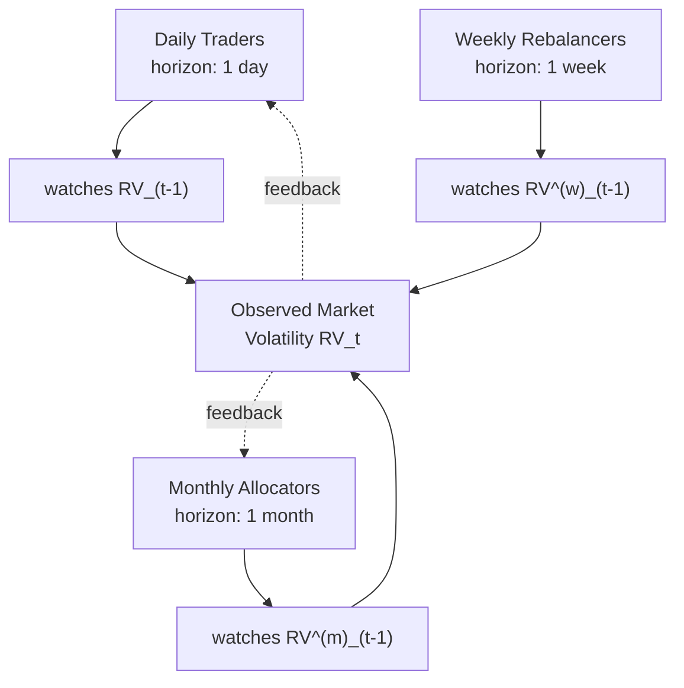
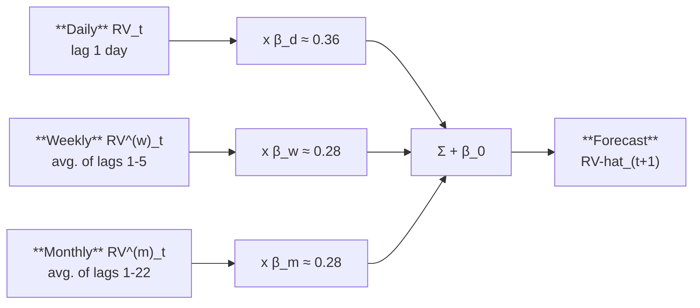
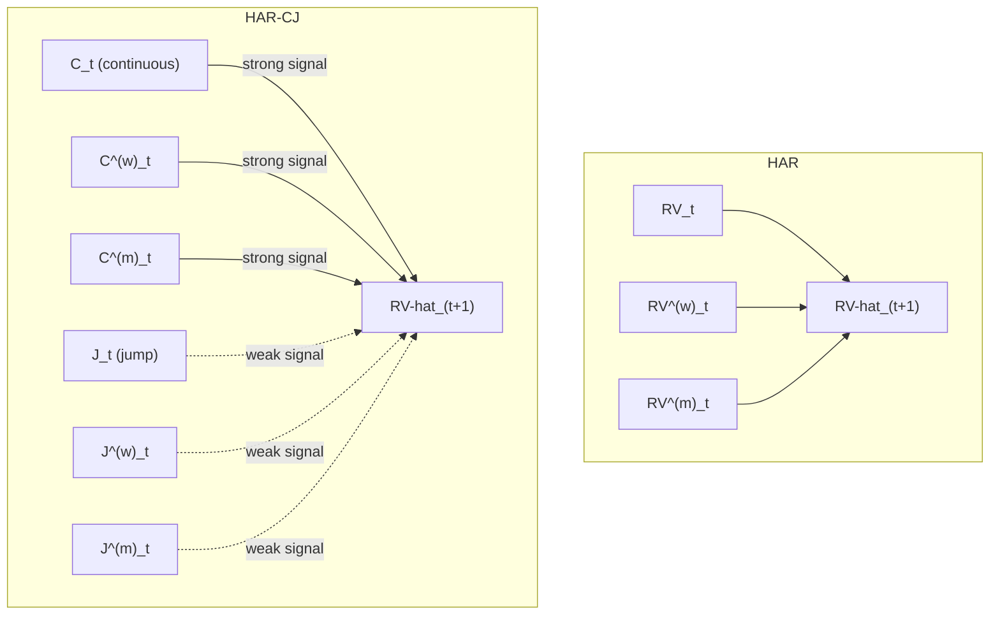

# The HAR Model and Its Extensions

> **Application: Why This Chapter**
> HAR is THE benchmark for volatility forecasting.
> Every ML model in Chapters [11](ch11-tree-methods-vol.md)--[13](ch13-hybrid-ensemble.md) must beat HAR to justify its complexity.
> This chapter must be crystal clear because every subsequent forecasting chapter references it.
> Projects 1, 4, and 5 all use HAR variants as their primary baseline.

[Chapter 5](ch05-garch-family.md) forecast volatility using only daily returns.
That approach works when intraday data is unavailable, but it uses a noisy proxy ($r^2_t$) for what actually happened during the day.
[Chapter 2](ch02-realized-volatility.md) showed that realized variance $\operatorname{RV}_t = \sum r^2_{t,i}$, computed from intraday returns, is a far more precise measure of daily volatility.
The natural next question: can you forecast tomorrow's $\operatorname{RV}$ directly from past $\operatorname{RV}$ values, without the latent-variable machinery of GARCH?

The answer is yes, and the model that does it is remarkably simple: three OLS coefficients.

## The Heterogeneous Market Hypothesis

> **Prereq: Mean Reversion**
> A quantity *mean-reverts* if it tends to return to a long-run average after being pushed away.
> If today's value is unusually high, mean reversion says tomorrow's value is more likely to be lower (and vice versa).
> The speed of mean reversion determines how long departures persist.

Start with an observation about who trades in financial markets.
Not everyone operates at the same frequency.
Day traders react to what happened in the last few hours.
Portfolio managers at mutual funds or pension funds rebalance weekly.
Large institutional allocators (sovereign wealth funds, endowments) adjust positions monthly or quarterly.

Each type of participant pays attention to volatility at their own characteristic horizon.
A day trader cares about yesterday's realized volatility.
A weekly rebalancer looks at the average volatility over the past week.
A monthly allocator responds to the volatility level over the past month.

Muller et al. (1993) formalized this as the *Heterogeneous Market Hypothesis* (HMH): the market is a superposition of participants operating at different time scales, and these participants interact.
When monthly allocators adjust positions, it creates volatility that daily traders react to, and vice versa.

> **Intuition: Three Clocks Running Simultaneously**
> Imagine three clocks ticking at different speeds.
> Clock 1 (daily) ticks every day and captures fast-moving volatility reactions: earnings surprises, Fed announcements, flash crashes.
> Clock 2 (weekly) ticks every week and captures medium-term dynamics: multi-day volatility clusters, the weekly options expiration cycle.
> Clock 3 (monthly) ticks every month and captures the slow-moving background volatility level: business-cycle shifts, prolonged risk-on/risk-off regimes.
> Observed volatility is a mixture of all three clocks.
> The HAR model puts one predictor per clock.

Figure 1 below illustrates how the three participant types feed into observed market volatility.

*Figure 1: The Heterogeneous Market Hypothesis. Three types of market participants operate at different horizons, each responding to volatility averaged over their characteristic time scale. Their collective actions produce the observed realized volatility. Dashed arrows indicate feedback: today's volatility feeds back into each participant's future decisions.*

> **Key Idea: Why This Matters for Forecasting**
> If the market were homogeneous (all participants on the same clock), a simple AR(1) model would suffice.
> The heterogeneity means that volatility dynamics involve multiple time scales simultaneously.
> You need a model that captures daily, weekly, and monthly persistence in a single equation.
> That model is HAR.

## The HAR Model

> **Prereq: OLS Regression**
> Ordinary Least Squares (OLS) fits a linear equation $y = \beta_0 + \beta_1 x_1 + \cdots + \beta_k x_k + \varepsilon$ by choosing $\beta_0, \ldots, \beta_k$ to minimize the sum of squared residuals $\sum \varepsilon^2_t$.
> The resulting coefficients are the best linear unbiased estimators under standard assumptions (Gauss--Markov theorem).
> If you can set up a forecasting problem as a linear regression, OLS gives you the answer.

The insight from the previous section suggests three predictors: yesterday's $\operatorname{RV}$, the average $\operatorname{RV}$ over the past week, and the average $\operatorname{RV}$ over the past month.
Corsi (2009) turned this directly into a regression.
The key move is defining the weekly and monthly averages.

> **Definition: Weekly and Monthly Realized Variance**
> The weekly average realized variance on day $t$ is:
> $$\operatorname{RV}^{(w)}_{t} = \frac{1}{5}\sum_{i=0}^{4}\operatorname{RV}_{t-i}$$
> The monthly average realized variance on day $t$ is:
> $$\operatorname{RV}^{(m)}_{t} = \frac{1}{22}\sum_{i=0}^{21}\operatorname{RV}_{t-i}$$
> - $\operatorname{RV}^{(w)}_{t}$: the arithmetic mean of the five most recent daily realized variances (including today)
> - $\operatorname{RV}^{(m)}_{t}$: the arithmetic mean of the 22 most recent daily realized variances (including today)
> - 5 trading days = 1 week; 22 trading days $\approx$ 1 month
> - These are backward-looking averages, not forecasts

> **Intuition: In Plain English**
> These are just moving averages of past volatility over two different windows.
> $\operatorname{RV}^{(w)}$ smooths out the last five days to give a "medium-term" volatility reading, and $\operatorname{RV}^{(m)}$ smooths over the last 22 days to give a "long-term" reading.
> The daily value captures what happened yesterday; the averages capture what has been happening recently and over the past month.

> **Project Connection: Why This Matters**
> When you build your feature matrix for any ML model, you will always include these three inputs: daily, weekly average, and monthly average RV.
> They are the core HAR features, and every extension in this chapter simply adds to them.

Now the model.
The idea is as simple as it sounds: regress tomorrow's realized variance on yesterday's daily, weekly, and monthly values.

> **Definition: The HAR-RV Model (Corsi, 2009)**
> $$\operatorname{RV}_{t+1} = \beta_0 + \beta_d \, \operatorname{RV}_{t} + \beta_w \, \operatorname{RV}^{(w)}_{t} + \beta_m \, \operatorname{RV}^{(m)}_{t} + \varepsilon_{t+1}$$
> - $\operatorname{RV}_{t+1}$: tomorrow's realized variance (the target you are forecasting)
> - $\beta_0$: intercept, related to the long-run average level of $\operatorname{RV}$
> - $\beta_d$: coefficient on yesterday's daily $\operatorname{RV}$; captures the short-term reaction
> - $\operatorname{RV}_t$: yesterday's realized variance
> - $\beta_w$: coefficient on the weekly average; captures medium-term persistence
> - $\operatorname{RV}^{(w)}_{t}$: average of the five most recent daily $\operatorname{RV}$ values
> - $\beta_m$: coefficient on the monthly average; captures long-term persistence
> - $\operatorname{RV}^{(m)}_{t}$: average of the 22 most recent daily $\operatorname{RV}$ values
> - $\varepsilon_{t+1}$: forecast error
>
> Estimation: OLS.
> No maximum likelihood, no iterative optimization, no latent variables.

> **Intuition: HAR Mimics Long Memory with Three Coefficients**
> Volatility autocorrelations decay slowly ([Chapter 5](ch05-garch-family.md), FIGARCH section).
> A pure AR model would need many lags to capture this.
> HAR achieves the same effect with a trick: the weekly average $\operatorname{RV}^{(w)}$ implicitly includes lags 1 through 5, and the monthly average $\operatorname{RV}^{(m)}$ implicitly includes lags 1 through 22.
> Three coefficients, but through the averages, information from 22 past days enters the forecast.
> The result is autocorrelation decay that closely approximates a long-memory process, with none of the estimation complexity of FIGARCH (Corsi, 2009).

> **Project Connection: Why This Matters**
> HAR is YOUR primary baseline.
> Every ML model you build must beat HAR to be worth anything.
> It predicts tomorrow's vol from a weighted combination of yesterday's vol, last week's average vol, and last month's average vol.
> When you report results, your first table column is always HAR.

> **Warning: Log or Level?**
> Many papers estimate HAR on $\ln(\operatorname{RV})$ rather than $\operatorname{RV}$ in levels.
> As noted in [Chapter 2](ch02-realized-volatility.md), $\ln(\operatorname{RV}_t)$ is approximately Gaussian, which makes OLS residuals better behaved and guarantees positive forecasts (since $e^x > 0$).
> The log specification generally forecasts better.
> Throughout this chapter, all equations are written in levels for clarity; in practice, use logs unless you have a specific reason not to.

### Typical Coefficient Values

What do the coefficients look like on real data?
Corsi (2009) calibrates the HAR simulation with $\beta_d = 0.36$, $\beta_w = 0.28$, $\beta_m = 0.28$, values chosen to produce realistic dynamics; the empirical estimates on S&P 500 futures (1990--2007) are $\beta_d \approx 0.37$, $\beta_w \approx 0.34$, $\beta_m \approx 0.22$.
All three components contribute meaningfully.
The monthly term's coefficient is similar to the daily term's, confirming that long-horizon persistence matters.

The in-sample $R^2$ is typically 0.40--0.60 for daily-horizon forecasts on equity index $\operatorname{RV}$.
This is high for a financial time series, and it comes from just three predictors.

Figure 2 below summarizes the HAR cascade: how the three components at different time scales feed into a single forecast.

*Figure 2: The HAR cascade. Three components at daily, weekly, and monthly time scales are weighted by OLS coefficients and summed to produce the forecast. Through the weekly and monthly averages, information from 22 past days enters the model with only three coefficients, approximating long-memory decay. Typical coefficient values are from Corsi (2009) on S&P 500 data.*

## HAR-J and HAR-CJ: Adding Jumps

The basic HAR uses total realized variance $\operatorname{RV}_t$ as the predictor.
But as discussed in [Chapter 2](ch02-realized-volatility.md), $\operatorname{RV}$ captures both the continuous component of price variation and any jumps that occurred during the day.
A natural question: do jumps and continuous variation have different forecasting power?

> **Prereq: Bipower Variation**
> *Bipower variation* (BPV) is an estimator of integrated variance that is robust to jumps.
> It is defined as:
> $$\operatorname{BPV}_t = \frac{\pi}{2} \sum_{i=2}^{n} |r_{t,i}|\,|r_{t,i-1}|$$
> - $|r_{t,i}|$: absolute value of the $i$-th intraday return
> - The product of consecutive absolute returns averages out jump contributions because it is unlikely that two consecutive intervals both contain a jump
> - $\pi/2$: a scaling constant that ensures $\operatorname{BPV}_t$ converges to integrated variance $\operatorname{IV}_t$ (not quadratic variation) as sampling frequency increases
>
> The key property: $\operatorname{BPV}_t \to \operatorname{IV}_t$ even when jumps are present, whereas $\operatorname{RV}_t \to \operatorname{IV}_t + \sum(\text{jumps})^2$.
> The difference $\operatorname{RV}_t - \operatorname{BPV}_t$ therefore isolates the jump component.
> BPV was introduced by Barndorff-Nielsen and Shephard (2004) and is covered in detail in [Chapter 4](ch04-jumps-continuous-variation.md).

> **Intuition: In Plain English**
> BPV estimates the "smooth" part of volatility by multiplying consecutive absolute returns together.
> The idea is that a genuine jump is a one-off spike that is unlikely to hit two adjacent intervals, so the product of neighbors filters jumps out while keeping the continuous volatility signal.

> **Project Connection: Why This Matters**
> BPV is the tool you use to separate continuous volatility from jumps when constructing features for HAR-J and HAR-CJ.
> If your data source provides intraday returns, computing BPV alongside RV gives you a richer feature set at zero additional model complexity.

### HAR-J

Andersen, Bollerslev, and Diebold (2007) proposed the HAR-J model, which adds a jump component as an additional predictor:

$$\operatorname{RV}_{t+1} = \beta_0 + \beta_d \, \operatorname{RV}_{t} + \beta_w \, \operatorname{RV}^{(w)}_{t} + \beta_m \, \operatorname{RV}^{(m)}_{t} + \beta_J \, J_t + \varepsilon_{t+1}$$

- $J_t = \max(\operatorname{RV}_t - \operatorname{BPV}_t, 0)$: the estimated jump component on day $t$; the $\max$ ensures non-negativity, since measurement error can make $\operatorname{RV}_t - \operatorname{BPV}_t$ slightly negative even on jumpless days
- $\beta_J$: coefficient on jumps; typically estimated as negative and small, meaning jumps have a weak or transient effect on future volatility
- All other terms are the same as in the HAR-RV equation

> **Intuition: In Plain English**
> HAR-J takes the standard HAR and adds one extra input: how much of yesterday's volatility came from jumps (sudden price spikes) rather than normal trading.
> If yesterday had a big jump, the model can treat that spike differently from steady high volatility, because jumps tend not to repeat.

> **Project Connection: Why This Matters**
> HAR-J adds the jump component as a separate feature.
> The continuous component is more persistent and predictable than jumps, so letting the model see them separately improves forecasts.
> In your ML pipeline, $J_t = \max(\operatorname{RV}_t - \operatorname{BPV}_t, 0)$ is a feature you should always compute when you have intraday data.

> **Key Result: Andersen, Bollerslev, and Diebold (2007) -- Jumps Matter Less Than You Expect**
> Andersen, Bollerslev, and Diebold (2007) find that the jump component $J_t$ is statistically significant but economically small in forecasting next-day $\operatorname{RV}$.
> Most of the predictive power comes from the continuous component.
> Jumps are largely transient: a jump on day $t$ does not meaningfully raise volatility on day $t+1$.

### HAR-CJ

Corsi, Pirino, and Reno (2010) take the separation further with the HAR-CJ model, which replaces total $\operatorname{RV}$ with the continuous and jump components at all three horizons:

$$\operatorname{RV}_{t+1} = \beta_0 + \beta^C_d C_t + \beta^C_w C^{(w)}_t + \beta^C_m C^{(m)}_t + \beta^J_d J_t + \beta^J_w J^{(w)}_t + \beta^J_m J^{(m)}_t + \varepsilon_{t+1}$$

- $C_t = \operatorname{BPV}_t$: the continuous component of day $t$'s variation
- $J_t = \max(\operatorname{RV}_t - \operatorname{BPV}_t, 0)$: the jump component of day $t$
- $C^{(w)}_t, C^{(m)}_t$: weekly and monthly averages of the continuous component, constructed like $\operatorname{RV}^{(w)}$ and $\operatorname{RV}^{(m)}$
- $J^{(w)}_t, J^{(m)}_t$: weekly and monthly averages of the jump component

The HAR-CJ model has six slope coefficients instead of three.
The empirical finding is consistent with HAR-J: continuous coefficients ($\beta^C$) are large and significant; jump coefficients ($\beta^J$) are small and often insignificant at weekly and monthly horizons (Corsi, Pirino, and Reno, 2010).

> **Intuition: In Plain English**
> HAR-CJ goes further than HAR-J by building separate daily, weekly, and monthly averages for the continuous part and the jump part.
> Instead of asking "how volatile was the market?" at each horizon, it asks two questions: "how volatile was the smooth trading activity?" and "how big were the jumps?"
> The consistent finding is that only the continuous answers matter for forecasting; the jump answers contribute almost nothing beyond the daily horizon.

> **Project Connection: Why This Matters**
> HAR-CJ gives you six features instead of three: $C_t, C^{(w)}_t, C^{(m)}_t, J_t, J^{(w)}_t, J^{(m)}_t$.
> When you feed these to an ML model, the model can learn that continuous components carry the forecasting signal and jumps are noise, rather than you having to hard-code that decision.

> **Key Idea: Jumps Are Noise for Forecasting**
> A large jump (e.g., from a surprise rate cut) spikes today's $\operatorname{RV}$ but typically does not persist into tomorrow.
> The continuous component, which reflects the background level of trading activity and uncertainty, is far more persistent and forecastable.
> This is why separating $C$ from $J$ can help: it prevents a one-day spike from inflating the forecast.

Figure 3 below shows how HAR-CJ decomposes realized variance before forecasting, compared to the standard HAR approach.

*Figure 3: HAR vs. HAR-CJ. HAR feeds total RV at three horizons into the forecast (left). HAR-CJ first decomposes RV into continuous and jump components at each horizon (right). Thick arrows indicate strong forecasting power from continuous components; dashed arrows indicate the weak contribution of jumps.*

## SHAR: Good Volatility, Bad Volatility

HAR and its jump extensions treat all returns symmetrically: a large up move and a large down move both increase $\operatorname{RV}$ by the same amount (both $r^2$ terms are positive).
But [Chapter 5](ch05-garch-family.md) documented the leverage effect: negative returns increase volatility more than positive returns of the same magnitude.
Can you bring this asymmetry into the HAR framework?

> **Prereq: Realized Semivariance**
> *Realized semivariance* decomposes realized variance into contributions from positive and negative intraday returns:
> $$RS^+_t = \sum_{i=1}^{n} r^2_{t,i} \, \mathbf{1}_{\{r_{t,i} > 0\}}, \qquad RS^-_t = \sum_{i=1}^{n} r^2_{t,i} \, \mathbf{1}_{\{r_{t,i} < 0\}}$$
> - $RS^+_t$: positive semivariance, the sum of squared positive intraday returns
> - $RS^-_t$: negative semivariance, the sum of squared negative intraday returns
> - $\mathbf{1}_{\{r_{t,i} > 0\}}$: indicator function, equal to 1 if $r_{t,i} > 0$
> - $RS^+_t + RS^-_t = \operatorname{RV}_t$: the two halves sum to total realized variance

> **Intuition: In Plain English**
> Realized semivariance splits total volatility into "upside choppiness" and "downside choppiness."
> $RS^+$ measures how much the price bounced around on the way up during the day, while $RS^-$ measures how much it bounced around on the way down.
> Together they add up to total RV, but they carry different information about what comes next.

> **Key Result: Patton and Sheppard (2015) -- Bad Volatility Is More Persistent**
> Decomposing realized variance into positive semivariance $RS^+$ and negative semivariance $RS^-$ substantially improves forecasts.
> Bad volatility ($RS^-$, from downward price moves) is significantly more persistent than good volatility ($RS^+$, from upward moves).

The SHAR (Semivariance HAR) model replaces the daily $\operatorname{RV}$ term with $RS^+$ and $RS^-$:

$$\operatorname{RV}_{t+1} = \beta_0 + \beta^+_d \, RS^+_t + \beta^-_d \, RS^-_t + \beta_w \, \operatorname{RV}^{(w)}_t + \beta_m \, \operatorname{RV}^{(m)}_t + \varepsilon_{t+1}$$

- $RS^+_t$: yesterday's positive semivariance ("good" volatility)
- $RS^-_t$: yesterday's negative semivariance ("bad" volatility)
- $\beta^-_d > \beta^+_d$ is the typical finding: negative semivariance has a larger coefficient, meaning bad volatility predicts more future volatility
- The weekly and monthly components remain as total $\operatorname{RV}$ averages

> **Intuition: Why Downward Moves Are More Informative**
> Consider two days with identical $\operatorname{RV} = 2 \times 10^{-4}$.
> On Day A, most of the variation came from upward moves ($RS^+ = 1.6$, $RS^- = 0.4$): a rally day with choppy upward movement.
> On Day B, most came from downward moves ($RS^+ = 0.4$, $RS^- = 1.6$): a selloff with persistent downward pressure.
>
> Day B predicts higher future volatility.
> Why?
> Selloffs trigger margin calls, portfolio insurance rebalancing, stop-loss orders, and panic selling, all of which generate additional volatility.
> Rallies of the same magnitude do not create the same cascading effects.
> This asymmetry is the leverage effect operating at the intraday level.

> **Project Connection: Why This Matters**
> SHAR treats positive and negative semivariance differently, capturing the leverage effect within the HAR framework.
> For your project, $RS^+_t$ and $RS^-_t$ are two features that replace the single $\operatorname{RV}_t$ feature, and an ML model can learn the asymmetry automatically.
> SHAR is a strong baseline when forecasting equity index volatility, where the leverage effect is most pronounced.

Patton and Sheppard (2015) show that SHAR improves forecast accuracy relative to HAR across multiple asset classes, with the largest gains on equity indices where the leverage effect is strongest.

## HARQ: Handling Measurement Error

All the models so far treat every day's $\operatorname{RV}_t$ as equally reliable.
But it is not.
[Chapter 2](ch02-realized-volatility.md) showed that $\operatorname{RV}$ is an *estimate* of integrated variance, subject to estimation error that depends on how volatile volatility was during the day.

> **Prereq: Realized Quarticity**
> The precision of realized variance as an estimator of integrated variance depends on the *integrated quarticity*, the integral of $\sigma^4_s$ over the day (see the RV CLT in [Chapter 2](ch02-realized-volatility.md)).
> Realized quarticity ($RQ_t$) is a consistent estimator of this quantity:
> $$RQ_t = \frac{n}{3} \sum_{i=1}^{n} r^4_{t,i}$$
> - $r^4_{t,i}$: the fourth power of the $i$-th intraday return
> - $n/3$: a scaling constant that ensures consistency
> - High $RQ_t$ means that volatility itself was volatile during the day, making $\operatorname{RV}_t$ a noisy estimate of $\operatorname{IV}_t$
> - Low $RQ_t$ means volatility was stable, making $\operatorname{RV}_t$ precise

> **Intuition: In Plain English**
> Realized quarticity measures how much volatility itself jumped around during the day.
> If intraday volatility was steady, fourth powers of returns are small and $RQ$ is low, meaning your RV estimate is trustworthy.
> If intraday volatility spiked wildly (e.g., a flash crash followed by a recovery), $RQ$ is high, meaning your RV number is noisy and should be taken with a grain of salt.

> **Project Connection: Why This Matters**
> $RQ_t$ is the key ingredient that separates HARQ from plain HAR.
> When you compute your daily features, always compute $\sqrt{RQ_t}$ alongside $\operatorname{RV}_t$.
> It tells your model how much to trust yesterday's volatility reading, which is the core insight behind the HARQ paper your project builds on (Bollerslev, Patton, and Quaedvlieg, 2016).

The idea behind HARQ is simple: when yesterday's $\operatorname{RV}$ is noisy (high $RQ$), the model should rely less on it.
When it is precise (low $RQ$), the model should rely more on it.

> **Key Result: Bollerslev, Patton, and Quaedvlieg (2016) -- HARQ Adjusts for Measurement Error**
> Bollerslev, Patton, and Quaedvlieg (2016) allow the daily coefficient in the HAR model to vary with realized quarticity $RQ_t$.
> On noisy days (high $RQ$), the daily $\operatorname{RV}$ coefficient shrinks toward zero, down-weighting the unreliable estimate.
> On precise days (low $RQ$), the coefficient is large, fully exploiting the signal.
> This simple modification produces statistically significant forecast improvements.

$$\operatorname{RV}_{t+1} = \beta_0 + \bigl(\beta_d + \beta_{dQ}\sqrt{RQ_t}\bigr)\,\operatorname{RV}_t + \beta_w \, \operatorname{RV}^{(w)}_t + \beta_m \, \operatorname{RV}^{(m)}_t + \varepsilon_{t+1}$$

- $\beta_d$: baseline daily coefficient (the coefficient when $RQ_t = 0$, i.e., the hypothetical noise-free case)
- $\beta_{dQ}$: the adjustment coefficient; typically estimated as negative
- $\sqrt{RQ_t}$: square root of realized quarticity, a measure of how noisy $\operatorname{RV}_t$ is as an estimate
- $\beta_d + \beta_{dQ}\sqrt{RQ_t}$: the effective daily coefficient, which varies from day to day
- When $RQ_t$ is large (noisy day), $\beta_{dQ}\sqrt{RQ_t}$ is a large negative number, shrinking the effective coefficient toward zero
- When $RQ_t$ is small (precise day), the adjustment is negligible and the coefficient stays near $\beta_d$

> **Intuition: In Plain English**
> HARQ adds estimation uncertainty as a feature.
> On days when yesterday's RV estimate is noisy (high $RQ$), the model automatically relies less on it and shifts weight to the more stable weekly and monthly averages.
> On days when yesterday's RV is precise (low $RQ$), the model trusts it fully.
> It is a "confidence-weighted" version of HAR.

> **Project Connection: Why This Matters**
> HARQ is THE paper your project builds on.
> The idea that measurement quality should modulate how much weight the model gives to each input is exactly the kind of structure an ML model can generalize.
> Your project explores whether tree ensembles or neural networks can learn this adaptive weighting from data, potentially extending it to weekly and monthly coefficients or to other noise proxies beyond $RQ$.

The following diagram shows how the effective daily coefficient changes with measurement noise.

*[Figure: HARQ adaptive coefficient. The effective daily coefficient $\beta_d + \beta_{dQ}\sqrt{RQ_t}$ is plotted against $\sqrt{RQ_t}$ (measurement noise) over the range 0 to 5. The line starts near 0.40 when $\sqrt{RQ_t} = 0$ (precise day: rely on $\operatorname{RV}_t$) and decreases linearly to near 0 as noise increases (noisy day: down-weight $\operatorname{RV}_t$). A green dot marks an example precise day at approximately (0.5, 0.355) and a red dot marks an example noisy day at approximately (4.0, 0.04). Using $\beta_d = 0.40$, $\beta_{dQ} = -0.09$.]*

> **Key Idea: HARQ Is the Strongest Univariate RV Forecast**
> Among models that use only past RV and its measurement-error statistics, HARQ is the strongest in the literature (Bollerslev, Patton, and Quaedvlieg, 2016).
> It is the bar that any ML model must clear.
> If your tree ensemble or neural network cannot beat HARQ on out-of-sample $\operatorname{QLIKE}$ ([Chapter 16](ch16-forecast-evaluation.md)), you have not learned useful nonlinear structure; you have likely overfit.

> **Warning: HARQ Needs Realized Quarticity**
> HARQ requires computing $RQ_t$ from intraday returns.
> If your data source provides only daily $\operatorname{RV}$ without the underlying intraday returns, you cannot construct $RQ_t$ and HARQ is not available.
> In that case, fall back to SHAR or plain HAR as your benchmark.

## HAR-X and Beyond: Adding Exogenous Predictors

All HAR variants so far use only past $\operatorname{RV}$ (and its decompositions) as predictors.
But other variables contain information about future volatility: the VIX, lagged signed returns, macroeconomic indicators, trading volume, options-implied information.
The HAR-X framework adds these as extra regressors.

> **Definition: HAR-X**
> $$\operatorname{RV}_{t+1} = \beta_0 + \beta_d \, \operatorname{RV}_t + \beta_w \, \operatorname{RV}^{(w)}_t + \beta_m \, \operatorname{RV}^{(m)}_t + \sum_{j=1}^{p} \gamma_j \, X_{j,t} + \varepsilon_{t+1}$$
> - $X_{j,t}$: the $j$-th exogenous predictor observed on day $t$
> - $\gamma_j$: coefficient on the $j$-th predictor
> - $p$: number of exogenous predictors
> - Common choices for $X_{j,t}$: VIX level, VIX innovations ($\Delta$VIX), lagged daily return $r_t$ (signed, to capture leverage), overnight return, trading volume, implied--realized volatility spread

> **Intuition: In Plain English**
> HAR-X is just HAR with extra columns in the regression.
> The three core RV inputs stay, and you bolt on whatever other predictors you think contain information about future volatility: the VIX, yesterday's stock return, trading volume, macro surprises, and so on.
> Each additional predictor gets its own coefficient, so OLS tells you whether it helps after controlling for the core HAR terms.

> **Project Connection: Why This Matters**
> HAR-X is the linear version of what your ML model will do.
> Any feature you feed to a random forest or neural network, you should first test in a HAR-X regression to see whether it helps linearly.
> If it does, the ML question becomes: does the feature interact nonlinearly with other inputs?
> If it does not help even linearly, adding it to an ML model is unlikely to help and may cause overfitting.

Bollerslev et al. (2018) take this to a large scale in their "Risk Everywhere" paper, constructing a large cross-section of HAR-X type models with many macro and market predictors.

When $p$ is large, you face a classic overfitting problem: many predictors, limited data.
Audrino and Knaus (2016) propose the "Lassoing the HAR" approach, applying the Lasso (L1 regularization) to the HAR-X framework:

$$\min_{\beta, \gamma} \sum_{t} \left(\operatorname{RV}_{t+1} - \beta_0 - \beta_d \operatorname{RV}_t - \beta_w \operatorname{RV}^{(w)}_t - \beta_m \operatorname{RV}^{(m)}_t - \sum_j \gamma_j X_{j,t}\right)^2 + \lambda \sum_j |\gamma_j|$$

- $\lambda$: regularization penalty; larger $\lambda$ shrinks more coefficients to exactly zero
- The penalty applies to the exogenous coefficients $\gamma_j$, not the core HAR terms
- The Lasso selects which exogenous variables matter while keeping the core HAR structure intact

> **Intuition: In Plain English**
> When you have many candidate predictors, Lasso-HAR asks: "which of these extra variables actually help, and which are just adding noise?"
> It does this by penalizing the model for using too many variables.
> The penalty forces weak predictors' coefficients to exactly zero, automatically dropping them from the forecast, while keeping the core daily/weekly/monthly HAR terms intact.

> **Project Connection: Why This Matters**
> Lasso-HAR is the simplest regularized model in your toolbox and a natural stepping stone between plain HAR and full ML.
> If Lasso-HAR with 20 features beats HAR, you know the extra features carry signal.
> The next question, which your project addresses, is whether nonlinear models (trees, neural nets) can extract even more from those same features.

> **Prereq: Lasso Regularization**
> The Lasso (Least Absolute Shrinkage and Selection Operator) adds an L1 penalty ($\lambda \sum |\gamma_j|$) to the OLS objective.
> This has two effects: (1) it shrinks coefficients toward zero, reducing overfitting; (2) it sets some coefficients to exactly zero, performing automatic variable selection.
> The tuning parameter $\lambda$ controls the strength of the penalty and is chosen by cross-validation.

> **Key Idea: HAR-X Is the Bridge to ML**
> HAR-X with many predictors is effectively a linear ML model.
> Adding Lasso regularization makes it a penalized linear model with variable selection.
> [Chapters 11](ch11-tree-methods-vol.md)--[13](ch13-hybrid-ensemble.md) ask the next question: can *nonlinear* models (tree ensembles, neural networks) improve on this, or does the extra flexibility just lead to overfitting?
> The answer depends critically on the feature set and forecast horizon.

## Ridge and Elastic-Net HAR: Shrinking Collinear Components

> **Prereq: The Collinearity Problem**
> Two predictors are **collinear** when one is nearly a linear function of the other, so the data carry little independent information about their separate coefficients.
> The HAR design matrix is a textbook case: the weekly average $\operatorname{RV}^{(w)}_t$ contains $\operatorname{RV}_t$ as one of its five terms, and the monthly average $\operatorname{RV}^{(m)}_t$ contains both as part of its 22 terms (Definition of Weekly and Monthly Realized Variance, above).
> When columns of the design matrix $\mathbf{X}$ are nearly linearly dependent, the Gram matrix $\mathbf{X}^\top\mathbf{X}$ (a summary grid of how the predictors overlap) has a near-zero **eigenvalue** (a single number that here signals a direction in the data carrying almost no information), OLS coefficients swing wildly from sample to sample, and adding even one exogenous predictor can flip a sign.

> **Intuition: A Note on the Matrix Notation Ahead**
> This section leans on a few pieces of linear-algebra shorthand; here they are in plain words, once, so the equations read smoothly.
> **Bold letters** ($\mathbf{y}$, $\mathbf{X}$, $\bm{\beta}$) are whole lists or grids of numbers, not single values.
> A **matrix** is just a grid of numbers; the notation $\mathbf{y} \in \mathbb{R}^n$ means "$\mathbf{y}$ is a list of $n$ numbers," and $\mathbf{X} \in \mathbb{R}^{n\times p}$ means "$\mathbf{X}$ is a table with $n$ rows (one per training day) and $p$ columns (one per feature)."
> The double bars $\lVert\mathbf{v}\rVert_2^2$ are a **norm**: square every number in the list $\mathbf{v}$ and add them up.
> The superscript $\top$ means **transpose**: flip a grid on its side so rows become columns, the bookkeeping that lets two grids multiply.
> The superscript $-1$ means **matrix inverse**, the grid-version of dividing (it undoes a multiplication).
> And $\arg\min_{\bm{\beta}}$ reads "the coefficient list $\bm{\beta}$ that makes everything to its right as small as possible."
> You will meet each of these again in context below.

The Lasso of the HAR-X section answers "which extra predictors matter?" by zeroing out the weak ones.
But zeroing is exactly the wrong move for the *core* HAR terms.
When $\operatorname{RV}_t$, $\operatorname{RV}^{(w)}_t$, and $\operatorname{RV}^{(m)}_t$ are strongly correlated (pairwise correlations routinely exceed $0.8$ on equity index data), the Lasso keeps one and drops the rest essentially at random, a disaster for a model whose entire premise (the Heterogeneous Market Hypothesis section) is that all three horizons carry signal.

The principled fix is **ridge regression**, which adds an $L_2$ penalty instead of an $L_1$ penalty.
Ridge shrinks correlated coefficients *together* rather than forcing a choice between them, so the daily, weekly, and monthly components all survive in damped form.
**Elastic net** then blends the two penalties to get sparsity over the exogenous predictors *and* ridge-style grouping over the collinear HAR core.

### The Ridge Objective

Start from the penalized least-squares problem.
Write the HAR-X regression of the HAR-X equation in matrix form, stacking the daily, weekly, monthly, and any exogenous columns into a single design matrix $\mathbf{X}$ with coefficient vector $\bm{\beta}$.
Ridge regression (Hoerl and Kennard, 1970) adds a squared-coefficient penalty to the residual sum of squares:

$$\hat{\bm{\beta}}_{\mathrm{ridge}} = \arg\min_{\bm{\beta}}\; \underbrace{\lVert \mathbf{y} - \mathbf{X}\bm{\beta} \rVert_2^2}_{\text{fit to past }\operatorname{RV}} + \underbrace{\lambda\,\lVert \bm{\beta} \rVert_2^2}_{\text{shrinkage penalty}}$$

Reading it left to right: $\arg\min_{\bm{\beta}}$ means "find the particular coefficient list $\bm{\beta}$ that makes everything to its right as small as possible," and the double bars $\lVert\mathbf{v}\rVert_2^2$ are shorthand for "take every number in the list $\mathbf{v}$, square it, and add them all up."
So the first term $\lVert\mathbf{y} - \mathbf{X}\bm{\beta}\rVert_2^2$ is just the total squared forecast error written compactly, and the second term penalizes the total squared coefficient size.

- $\mathbf{y} \in \mathbb{R}^n$: the vector of realized-variance targets $\operatorname{RV}_{t+1}$ across the $n$ training days
- $\mathbf{X} \in \mathbb{R}^{n \times p}$: the design matrix whose columns are $\operatorname{RV}_t$, $\operatorname{RV}^{(w)}_t$, $\operatorname{RV}^{(m)}_t$, and any exogenous predictors $X_{j,t}$
- $\bm{\beta} \in \mathbb{R}^p$: the HAR coefficient vector ($\beta_d, \beta_w, \beta_m, \gamma_1, \ldots$)
- $\lVert \mathbf{y} - \mathbf{X}\bm{\beta} \rVert_2^2 = \sum_t (\operatorname{RV}_{t+1} - \mathbf{x}_t^\top\bm{\beta})^2$: the ordinary HAR sum of squared forecast errors; here $\mathbf{x}_t$ is the one row of $\mathbf{X}$ for day $t$ (that day's feature values), and $\mathbf{x}_t^\top\bm{\beta}$ multiplies each feature by its coefficient and adds them up, i.e. it is the model's forecast for day $t$
- $\lVert \bm{\beta} \rVert_2^2 = \sum_j \beta_j^2$: the squared $L_2$ norm of the coefficients; penalizes large coefficients
- $\lambda \geq 0$: the regularization strength. At $\lambda = 0$ this is plain OLS-HAR; as $\lambda \to \infty$ all coefficients shrink toward zero

> **Intuition: In Plain English**
> Ridge-HAR fits the same daily/weekly/monthly regression as ordinary HAR, but it charges a fee for every unit of coefficient size.
> Because the fee is on the *squared* size, it punishes one big swollen coefficient far more than two moderate ones that add up to the same forecast.
> So when the daily and weekly terms are nearly interchangeable, ridge prefers to split the weight between them rather than dump it all on one.
> The result is a HAR whose three components stay sensible even when the data cannot cleanly tell them apart.

> **Project Connection: Why This Matters**
> Ridge-HAR is the regularized baseline your project reports next to HARQ.
> When you eventually feed the same daily/weekly/monthly features to a tree ensemble or neural network, ridge-HAR is the linear bar to clear: if LightGBM cannot beat ridge-HAR on out-of-sample $\operatorname{QLIKE}$ using identical features, the nonlinearity bought you nothing and you have likely overfit (the litmus test of the "Why HAR Is Hard to Beat" section).

### Closed-Form Solution

Unlike the Lasso, ridge has a closed form.
Expand the ridge objective and set the gradient to zero:

$$\begin{aligned} \mathcal{L}(\bm{\beta}) &= (\mathbf{y} - \mathbf{X}\bm{\beta})^\top(\mathbf{y} - \mathbf{X}\bm{\beta}) + \lambda\,\bm{\beta}^\top\bm{\beta} \\ \nabla_{\bm{\beta}}\mathcal{L} &= -2\mathbf{X}^\top(\mathbf{y} - \mathbf{X}\bm{\beta}) + 2\lambda\bm{\beta} = \mathbf{0} \end{aligned}$$

This step is algebra you can take on faith; the next equation is what you actually use.
In words: the triangle symbol $\nabla$ ("nabla") means the slope of the error surface, and at the bottom of a valley the slope is flat (zero), so setting $\nabla_{\bm{\beta}}\mathcal{L} = \mathbf{0}$ locates the best $\bm{\beta}$.
The superscript $\top$ is the transpose, flipping a grid so its rows become columns, which is the bookkeeping that lets these grids multiply together.

Solving for $\bm{\beta}$ gives the ridge estimator:

$$\hat{\bm{\beta}}_{\mathrm{ridge}} = \bigl(\mathbf{X}^\top\mathbf{X} + \lambda\mathbf{I}\bigr)^{-1}\mathbf{X}^\top\mathbf{y}$$

- $\mathbf{X}^\top\mathbf{X} \in \mathbb{R}^{p\times p}$: the Gram matrix; its eigenvalues (each a single number measuring how strongly the data vary along one direction) measure how much the data spread along each direction. For collinear HAR columns, the smallest eigenvalue is near zero, meaning the data barely move that way, exactly the collinear case
- $\mathbf{I}$: the identity matrix, the grid-version of the number $1$ (ones down the diagonal, zeros elsewhere), so $\lambda\mathbf{I}$ just means "add the amount $\lambda$ along the diagonal"; this adds $\lambda$ to every eigenvalue of $\mathbf{X}^\top\mathbf{X}$, lifting the smallest one away from zero and guaranteeing the inverse exists
- the superscript $-1$ on $(\mathbf{X}^\top\mathbf{X} + \lambda\mathbf{I})$ is the matrix inverse, the grid-version of dividing, which undoes a multiplication
- $\mathbf{X}^\top\mathbf{y} \in \mathbb{R}^p$: the cross-covariance between each lagged $\operatorname{RV}$ feature and tomorrow's $\operatorname{RV}$
- Setting $\lambda = 0$ recovers the OLS-HAR estimator $(\mathbf{X}^\top\mathbf{X})^{-1}\mathbf{X}^\top\mathbf{y}$ behind the HAR-RV equation

> **Intuition: In Plain English**
> OLS-HAR has to invert $\mathbf{X}^\top\mathbf{X}$, and when the daily/weekly/monthly columns nearly overlap that matrix is almost singular, so the inversion magnifies tiny data wiggles into huge coefficient swings.
> Ridge slides $\lambda$ down the diagonal first, which is like propping up the near-flat direction so the inversion no longer blows up.
> The bigger $\lambda$ is, the more the wobbly directions get held in place, and the more stable the three HAR coefficients become from one sample to the next.

> **Project Connection: Why This Matters**
> The closed form is why ridge-HAR is essentially free to run: there is no iterative optimizer, no convergence to babysit, just one matrix inversion per candidate $\lambda$.
> You can sweep an entire grid of $\lambda$ values and refit ridge-HAR in milliseconds, which makes it a cheap, robust default to anchor every forecasting table in the project.

### Why Ridge Damps the Noisy Collinear Directions

To see *which* part of the HAR signal ridge shrinks, look through the singular value decomposition (SVD).
Write $\mathbf{X} = \mathbf{U}\mathbf{D}\mathbf{V}^\top$ with singular values $d_1 \geq d_2 \geq \cdots \geq d_p$.
You can think of a **singular value** $d_j$ as a single number measuring how much the data stretch along one underlying direction: a big $d_j$ means lots of variation (trustworthy), a tiny $d_j$ means the data barely move that way (the fragile, collinear direction).
The decomposition $\mathbf{X} = \mathbf{U}\mathbf{D}\mathbf{V}^\top$ is just the standard recipe that extracts those directions ($\mathbf{U}$ and $\mathbf{V}$ hold the direction grids, $\mathbf{D}$ holds the $d_j$); you do not need its details to follow the argument.
The squared singular values $d_j^2$ are exactly the eigenvalues of the Gram matrix $\mathbf{X}^\top\mathbf{X}$ from the previous subsection, which is the link the worked example below relies on.
The directions with large $d_j$ are well-determined (the data move a lot along them); the directions with small $d_j$ are the noisy, near-collinear combinations of $\operatorname{RV}_t$, $\operatorname{RV}^{(w)}_t$, $\operatorname{RV}^{(m)}_t$ where the data barely move.
Along each SVD direction, ridge replaces the OLS amplification factor $d_j^{-1}$ with a damped factor:

$$\underbrace{\frac{1}{d_j}}_{\text{OLS amplifies}} \;\longrightarrow\; \underbrace{\frac{d_j}{d_j^2 + \lambda}}_{\text{ridge damps}}$$

- $d_j$: the $j$-th singular value of $\mathbf{X}$; large for well-determined directions, small for collinear ones
- $d_j^{-1}$: the OLS weight along direction $j$, which explodes when $d_j$ is tiny
- $d_j/(d_j^2+\lambda)$: the ridge weight, which $\to d_j^{-1}$ when $d_j^2 \gg \lambda$ (well-determined directions untouched) and $\to 0$ when $d_j^2 \ll \lambda$ (noisy directions damped out)

> **Intuition: In Plain English**
> OLS-HAR puts the most faith in exactly the directions where it has the least evidence: when the three $\operatorname{RV}$ averages nearly coincide, the leftover direction that distinguishes them has almost no variation, so OLS multiplies it by a giant number and reads pure noise as signal.
> Ridge does the opposite: it leaves the strong, well-measured directions alone and quietly turns down the volume on the weak, collinear ones.
> That is the entire point of ridge-HAR: it does not shrink the three coefficients equally; it selectively mutes the unreliable combination of them.

> **Project Connection: Why This Matters**
> The noisy collinear direction in a HAR regression is precisely where measurement error in $\operatorname{RV}$ does the most damage to coefficients (the same theme HARQ tackles in the HARQ section).
> Ridge's selective damping is a model-free cousin of HARQ's $RQ$-weighting: instead of down-weighting noisy *days*, ridge down-weights the noisy *direction* in coefficient space.
> Both push forecasts away from over-trusting fragile information.

### Bias, Variance, and the Hoerl--Kennard Guarantee

Why accept any shrinkage at all, given that ridge biases the coefficients?
First, three terms in plain English: **bias** means the forecast is systematically off-target on average; **variance** means it jumps around wildly from one data sample to the next; **mean squared error** (MSE) bundles both into a single score, bias-squared plus variance.
As $\lambda$ grows from zero, the squared bias of $\hat{\bm{\beta}}_{\mathrm{ridge}}$ rises smoothly from zero (the OLS estimator is unbiased) while the estimator variance falls.
The mean squared error is their sum, and it traces a U-shape in $\lambda$ (see the bias-variance figure below): a wrong-but-stable estimate beats a right-on-average-but-wild one.
The foundational result makes this precise.

*[Figure: The bias-variance trade-off behind ridge. Three curves are plotted against shrinkage strength $\lambda$ (from 0 to 5). The variance curve (green) starts high near 2.2 at $\lambda = 0$ and falls monotonically as $\lambda$ rises. The squared-bias curve (red) starts at 0 at $\lambda = 0$ and rises smoothly. Their sum, the MSE curve (blue, $= $ bias$^2 +$ variance), traces a U-shape with its minimum at a strictly positive $\lambda$ (marked "best $\lambda$" at approximately $\lambda \approx 1.05$, error $\approx 1.51$), so some shrinkage always beats OLS.]*

> **Key Result: Hoerl--Kennard Theorem (Hoerl and Kennard, 1970)**
> This is the formal statement; if the notation is unfamiliar, skip to the plain-English box below.
> A quick legend: $\bm{\varepsilon}$ is the random noise in volatility (the error term); $\mathbb{E}[\cdots]$ means "on average"; $\sigma^2$ is the size of that noise; and $d_j^{-2}$ means $1$ divided by the singular value squared, which is what explodes when a direction is collinear.
> For any linear model $\mathbf{y} = \mathbf{X}\bm{\beta} + \bm{\varepsilon}$ with $\mathbb{E}[\bm{\varepsilon}] = \mathbf{0}$ (the noise is zero on average) and $\operatorname{Cov}(\bm{\varepsilon}) = \sigma^2\mathbf{I}$ (every day's noise has the same size $\sigma^2$ and is uncorrelated across days), there *always* exists a $\lambda > 0$ for which the ridge estimator has strictly lower mean squared error than OLS:
> $$\mathrm{MSE}\bigl(\hat{\bm{\beta}}_{\mathrm{ridge}}\bigr) < \mathrm{MSE}\bigl(\hat{\bm{\beta}}_{\mathrm{OLS}}\bigr).$$
> The intuition: OLS variance is proportional to $\sigma^2\sum_j d_j^{-2}$ (recall the eigenvalues of $\mathbf{X}^\top\mathbf{X}$ are $\lambda_j = d_j^2$), which becomes enormous when any singular value $d_j$ is small, exactly the collinear HAR case.
> A small dose of bias buys a large variance reduction.
> The MSE-optimal $\lambda$ depends on the unknown $\bm{\beta}$ and $\sigma^2$, so in practice it is chosen by cross-validation.

> **Intuition: In Plain English**
> The theorem says there is *always* some amount of shrinkage that makes HAR forecasts better, not just sometimes.
> For collinear HAR features the "always" is especially generous: the noisier the distinction between daily, weekly, and monthly $\operatorname{RV}$, the more there is to gain.
> The only catch is that the best $\lambda$ depends on quantities you do not know, which is why you tune it on held-out data rather than guess.

> **Project Connection: Why This Matters**
> Hoerl--Kennard is the formal license for using ridge-HAR as a default: on the collinear daily/weekly/monthly design, some positive $\lambda$ is guaranteed to forecast $\operatorname{RV}$ better in MSE than OLS-HAR.
> The practical question is never "should I regularize?" but "how much?", and that is a tuning problem you solve with purged cross-validation (below), reported in out-of-sample $\operatorname{QLIKE}$ in [Chapter 16](ch16-forecast-evaluation.md).

### Ridge vs. Lasso on Correlated HAR Features

The two penalties behave very differently precisely where it matters for HAR: correlated predictors.
The table below summarizes the contrast.
The correlated-features row is the decisive one: the daily, weekly, and monthly $\operatorname{RV}$ terms are strongly collinear by construction, so the Lasso's tendency to keep one and drop the rest is a liability, while ridge's group shrinkage preserves all three time scales.

| **Property** | **Ridge ($L_2$)** | **Lasso ($L_1$)** |
|---|---|---|
| Penalty | $\lambda\sum_j \beta_j^2$ | $\lambda\sum_j |\beta_j|$ |
| Sparsity | No (all $\beta_j \neq 0$) | Yes (many $\beta_j = 0$) |
| Closed form | Yes (ridge closed-form equation) | No (coordinate descent) |
| Correlated HAR terms | Shrinks $\operatorname{RV}_d,\operatorname{RV}_w,\operatorname{RV}_m$ together | Keeps one, zeros the others (arbitrary) |
| Constraint geometry | Ball (circle) | Diamond |
| Variable selection | None | Built in |
| Best when | Many correlated, all useful | Few strong, mostly irrelevant |

> **Warning: Do Not Lasso the Core HAR Terms**
> The Lasso is the right tool for selecting among the *exogenous* HAR-X predictors (the HAR-X section), where most candidates are genuinely irrelevant.
> It is the wrong tool for the three core $\operatorname{RV}$ components.
> Because $\operatorname{RV}^{(w)}_t$ and $\operatorname{RV}^{(m)}_t$ are built from $\operatorname{RV}_t$, they are mechanically collinear, and the Lasso will drop one whole time scale to satisfy its sparsity preference, choosing essentially at random which one survives across resamples.
> That destroys the multi-horizon structure that is the entire reason HAR works (the Heterogeneous Market Hypothesis section).
> Keep the core HAR terms unpenalized or ridge-penalized; reserve $L_1$ for the exogenous block.

### Why $L_1$ Produces Sparsity but $L_2$ Does Not

The difference in the table above comes down to geometry.
Both penalties can be written as a constraint: minimize the HAR sum of squared errors subject to a budget $t$ on the total coefficient size, $\lVert\bm{\beta}\rVert_2^2 \leq t$ (ridge) or $\lVert\bm{\beta}\rVert_1 \leq t$ (Lasso).
The OLS-HAR loss has elliptical *contours*, like the rings on a contour map: each ring marks a level of equal forecast error, and the centre is the best (lowest-error) point.
These rings are elongated and tilted because the daily and weekly terms are correlated.
The regularized solution is where the smallest such ellipse first touches the constraint region.
The figure below shows why the shape of that region decides whether a coefficient lands on exactly zero.

*[Figure: Why $L_1$ produces sparsity and $L_2$ does not. Two side-by-side panels plot the coefficient plane with axes $\beta_d$ (horizontal) and $\beta_w$ (vertical). In both panels, the same tilted orange ellipses are contours of the HAR sum-of-squares loss (the tilt, about 35 degrees, reflects the strong correlation between $\operatorname{RV}_d$ and $\operatorname{RV}_w$), with the unconstrained OLS solution $\hat{\bm{\beta}}_{\mathrm{OLS}}$ marked in red off in the upper-right. The regularized estimate is where the loss contour first meets the constraint region. **Left (ridge):** the constraint is a round $L_2$ ball $\lVert\bm{\beta}\rVert_2^2 \le t$ centred at the origin; because it is round, the tangency point ($\hat{\bm{\beta}}_{\mathrm{ridge}}$, green, at roughly $(0.62, 0.91)$) is generically off-axis, leaving both $\beta_d$ and $\beta_w$ nonzero, shrunk together. **Right (Lasso):** the constraint is an $L_1$ diamond $\lVert\bm{\beta}\rVert_1 \le t$ with sharp corners on the axes, and an elongated ellipse almost always touches a corner first, here the corner on the $\beta_w$ axis at $(0,1.1)$, setting $\beta_d = 0$. For collinear HAR components, that corner means dropping a whole time scale.]*

> **Intuition: In Plain English**
> Picture inflating the blue constraint region until it just kisses the orange loss contours.
> A round ball gets kissed on its smooth side, so both coefficients keep some value.
> A diamond gets kissed on a pointy corner, and the corners sit exactly on the axes where one coefficient is zero.
> The kink in the $L_1$ penalty is what makes those corners, and the corners are what produce sparsity.
> Ridge has no kink, no corners, and so no exact zeros.

### Elastic Net: Sparsity with Grouping

Ridge keeps every coefficient; the Lasso zeros many but mishandles correlated groups.
The **elastic net** (Zou and Hastie, 2005) combines both penalties so you can select among exogenous HAR-X predictors *and* keep correlated terms grouped:

$$\hat{\bm{\beta}}_{\mathrm{enet}} = \arg\min_{\bm{\beta}}\; \lVert \mathbf{y} - \mathbf{X}\bm{\beta} \rVert_2^2 + \lambda\Bigl[\underbrace{\alpha\,\lVert\bm{\beta}\rVert_1}_{\text{selection}} + \underbrace{\tfrac{1-\alpha}{2}\,\lVert\bm{\beta}\rVert_2^2}_{\text{grouping}}\Bigr]$$

- $\alpha \in [0,1]$: the mixing parameter. At $\alpha = 1$ elastic net is pure Lasso; at $\alpha = 0$ it is pure ridge
- $\lambda \geq 0$: the overall regularization strength, as in the ridge objective
- $\alpha\,\lVert\bm{\beta}\rVert_1$: the $L_1$ component that zeros out weak exogenous predictors. The $L_1$ norm $\lVert\bm{\beta}\rVert_1 = \sum_j|\beta_j|$ adds up the absolute sizes of the coefficients (ignoring sign), whereas the $L_2$ norm $\lVert\bm{\beta}\rVert_2^2$ adds up their squares, the squaring is what makes $L_2$ punish one big coefficient far more
- $\tfrac{1-\alpha}{2}\,\lVert\bm{\beta}\rVert_2^2$: the $L_2$ component that shrinks correlated coefficients toward each other; the factor $\tfrac{1}{2}$ is a conventional scaling that keeps the algebra tidy and does not change the behaviour

> **Intuition: In Plain English**
> Elastic net is a dial between the two behaviours.
> The $L_1$ part still hunts down and switches off predictors that do not earn their keep, but the $L_2$ part insists that if two features are nearly the same, they should be kept or dropped *as a pair* with similar coefficients, instead of one randomly winning.
> For HAR, that means you can let the model prune a long list of exogenous candidates while it refuses to break up the tightly correlated daily/weekly/monthly core.

> **Key Idea: The Grouping Effect**
> Zou and Hastie (2005) prove the **grouping effect**: if two features are highly correlated, elastic net assigns them nearly equal coefficients, rather than the Lasso's all-or-nothing pick.
> The strength of the grouping is controlled by the $L_2$ weight $(1-\alpha)$: more $L_2$ means tighter grouping.
> For HAR this is exactly right: the daily, weekly, and monthly $\operatorname{RV}$ terms form a natural correlated group that elastic net keeps intact while pruning useless exogenous regressors, the principled middle ground between ridge-HAR (no selection) and Lasso-HAR (group-blind selection).

> **Project Connection: Why This Matters**
> Elastic-net-HAR is the natural model when your HAR-X feature set mixes a small correlated core (the $\operatorname{RV}$ components, plus perhaps $RS^+,RS^-,C,J$ from the HAR-J and SHAR sections) with a long tail of speculative exogenous predictors (VIX innovations, macro surprises, cross-asset vol).
> It prunes the tail while protecting the correlated core, giving you a sparse, interpretable linear forecaster that is still a fair baseline for the nonlinear models of [Chapter 11](ch11-tree-methods-vol.md).

### Tuning and Diagnostics

Ridge, Lasso, and elastic net all leave you with a tuning parameter $\lambda$ (and, for elastic net, the mix $\alpha$).
The single most consequential decision in this whole section is *how* you choose them, because the wrong validation scheme silently leaks future volatility into the past.

> **Warning: Tune $\lambda$ with Purged CV, Not i.i.d. K-Fold**
> Standard $K$-fold CV assumes independent observations; realized variance violates this badly, it is highly persistent (the Heterogeneous Market Hypothesis section), and the HAR features $\operatorname{RV}^{(w)}_t,\operatorname{RV}^{(m)}_t$ are overlapping moving averages, so adjacent days share information by construction.
> If day $t$ is in the training fold and day $t+1$ in the validation fold, the model has effectively already seen the answer, and the chosen $\lambda$ will be far too small (too little shrinkage), inflating in-sample fit and collapsing out-of-sample.
> Tune $\lambda$ (and $\alpha$) with **purged $K$-fold CV with embargo** ([Chapter 16](ch16-forecast-evaluation.md), purged CV section), and size the embargo to cover the 22-day reach of the monthly average.
> Generalized cross-validation (GCV) gives ridge a fast leave-one-out shortcut, but it inherits the i.i.d. assumption, so treat it only as a rough first pass and confirm with purged CV before trusting any reported improvement.

> **Key Idea: Practical $\lambda$ Selection and Path Diagnostics**
> Four habits make regularized HAR robust:
> 1. **Log-spaced $\lambda$ grid.** Search $\lambda$ on a geometric grid. Log-spaced means the candidate $\lambda$ values grow by a constant multiple ($\ldots, 0.01, 0.1, 1, 10, \ldots$) rather than by constant steps, because $\lambda$ matters on a multiplicative scale; `np.logspace(-4, 4, 50)` is just "50 values from $0.0001$ to $10000$" in code. Refine around the minimum, and extend the grid if the optimum hits a boundary.
> 2. **The one-standard-error rule.** Instead of the $\lambda$ that minimizes purged-CV error, pick the *largest* $\lambda$ whose CV error is within one standard error of the minimum. This yields a more heavily shrunk, simpler HAR that forecasts about as well and is far less prone to overfitting the validation noise.
> 3. **The regularization path as a feature-importance diagnostic.** Plotting each coefficient as $\lambda$ increases from $0$ to $\infty$ shows which HAR features persist longest (most informative) and which shrink to zero first (noise). For Lasso/elastic-net-HAR the order in which exogenous predictors drop out is a free importance ranking.
> 4. **Effective degrees of freedom.** Report model complexity as a continuous quantity, $\mathrm{df}(\lambda) = \sum_{j=1}^{p} d_j^2/(d_j^2 + \lambda)$ (the big $\sum$ means "add the following up across all $p$ directions"), which runs from $p$ at $\lambda = 0$ (full OLS-HAR) down to $0$ as $\lambda \to \infty$. Notice this is just the sum of the per-direction shrinkage factors $d_j^2/(d_j^2+\lambda)$ from the ridge SVD-shrinkage equation: each well-measured direction contributes nearly a whole knob, each damped collinear direction only a fraction, and adding them up gives the effective knob-count. It is the regularized analog of "number of parameters" and lets you compare HAR variants on equal footing.

> **Intuition: In Plain English**
> Think of $\mathrm{df}(\lambda)$ as "how many real knobs the model is still turning."
> With no penalty, ridge-HAR uses all $p$ knobs; crank $\lambda$ up and the noisy collinear directions stop responding, so the *effective* number of knobs falls below $p$ even though the coefficient vector still has $p$ entries.
> This is how you say "my regularized HAR is really only as complex as $2.3$ free parameters" and compare it fairly to a sparser model.

> **Key Idea: Implementation Checklist for Ridge/Elastic-Net HAR**
> 1. **Standardize before penalizing.** The $L_2$ and $L_1$ penalties are scale-dependent: a feature in raw $\operatorname{RV}$ units and one in percentage points are penalized unequally. Standardize every column to zero mean and unit variance *inside each training fold* (never on the full sample) before fitting.
> 2. **Leave the intercept unpenalized.** You do not want to shrink the long-run mean of $\operatorname{RV}$ toward zero. Fit $\beta_0$ without penalty; standard libraries do this by default.
> 3. **Use the CV wrappers, but supply your own splits.** `RidgeCV`, `LassoCV`, and `ElasticNetCV` automate the $\lambda$ (and $\alpha$) search, but their default i.i.d. folds are wrong for $\operatorname{RV}$. Pass a purged-CV splitter ([Chapter 16](ch16-forecast-evaluation.md)) so the tuning respects the time ordering.
> 4. **Fit in logs.** As in the HAR Model section, estimating on $\ln\operatorname{RV}$ keeps residuals near-Gaussian and forecasts positive; the penalty and standardization arguments are unchanged.

> **Project Connection: Why This Matters**
> Ridge-HAR and elastic-net-HAR are the "Ridge/Lasso-HAR" baselines your project specification calls for, sitting between plain OLS-HAR and the tree/neural models of Chapters [11](ch11-tree-methods-vol.md)--[13](ch13-hybrid-ensemble.md).
> Build them once, tune them with purged CV, and report them on every forecasting chart alongside HAR and HARQ.
> If a nonlinear model cannot beat a properly tuned ridge-HAR on identical features and the same horizon, you have not found nonlinear structure; you have found a more expensive way to overfit.

## Why HAR Is Hard to Beat

If HAR is so simple (three coefficients, OLS), why is it the benchmark rather than a stepping stone that ML quickly surpasses?
Three reasons.

**Reason 1: Volatility is highly persistent and approximately linear.**
The autocorrelation function of $\operatorname{RV}_t$ decays slowly and smoothly.
A model that captures the right decay rate with the right mixture of time scales gets most of the forecastable variation.
HAR does exactly this.
The residual nonlinearity is real but small relative to the linear component.

**Reason 2: The signal-to-noise ratio is low.**
Even though volatility is more predictable than returns, the day-to-day fluctuations in $\operatorname{RV}$ are large.
A model that tries to fit these fluctuations more precisely (e.g., by adding interaction terms, polynomial features, or deep layers) tends to fit noise rather than signal, especially with the relatively short samples typical in finance (10--20 years of daily data is 2,500--5,000 observations).

**Reason 3: Daily horizon, RV-only features.**
When you restrict the feature set to past RV values and forecast one day ahead, there is little nonlinear structure for ML to exploit.
The gains from ML come from two sources that HAR cannot access:

1. **Richer features**: options-implied volatility, cross-asset information, order flow, macroeconomic data, text/news sentiment ([Chapter 10](ch10-feature-engineering.md)).
2. **Longer horizons**: at weekly or monthly forecast horizons, nonlinear regime dynamics and mean-reversion patterns become more pronounced, giving tree-based models and neural networks more to work with.

> **Key Idea: The HAR Litmus Test**
> If your ML model does not beat HAR on the same features (past RV only) and the same forecast horizon (one day), you have not learned nonlinear structure; you have overfit noise.
> Always report HAR alongside your ML results.
> If you beat HAR, the follow-up question is: does the improvement come from richer features (good) or from fitting noise in RV (bad)?
> The answer determines whether the ML model has real economic value.

> **Project Connection: Why This Matters**
> This table is your strategic roadmap.
> If you use RV-only features at the daily horizon, HAR will probably tie or beat your ML model, and that is expected.
> Your project should aim for the bottom-right cell: richer features (e.g., VIX, signed returns, cross-asset vol) at weekly or monthly horizons, where both the feature advantage and the nonlinear structure advantage compound.
> Design your experiments accordingly.

The following table summarizes where ML has and has not consistently beaten HAR in the literature.

| **Setting** | **HAR vs. ML** | **Why** |
|---|---|---|
| Daily horizon, RV-only features | HAR wins or ties | Little nonlinear signal |
| Daily horizon, rich features | ML often wins | Extra features carry new info |
| Weekly/monthly horizon, RV-only | ML sometimes wins | Nonlinear regime effects |
| Weekly/monthly horizon, rich features | ML usually wins | Both advantages compound |

> **Warning: Publication Bias**
> Papers that fail to beat HAR are less likely to be published.
> The literature therefore overstates the frequency with which ML improves on HAR.
> Be skeptical of reported improvements below 5--10% in out-of-sample $\operatorname{QLIKE}$, and always check whether the improvement is statistically significant via a Diebold--Mariano test ([Chapter 16](ch16-forecast-evaluation.md)).

## Summary

- The **Heterogeneous Market Hypothesis** (Muller et al., 1993) posits that markets are driven by participants operating at daily, weekly, and monthly horizons, whose interactions produce the observed volatility dynamics.

- The **HAR model** (Corsi, 2009) translates this directly into a regression: $\operatorname{RV}_{t+1} = \beta_0 + \beta_d \operatorname{RV}_t + \beta_w \operatorname{RV}^{(w)}_t + \beta_m \operatorname{RV}^{(m)}_t + \varepsilon_{t+1}$, estimated by OLS.

- HAR **mimics long memory** with only three coefficients by embedding lags 1--22 through the weekly and monthly averages.

- **Typical $R^2$** for daily-horizon HAR on equity index RV: 0.40--0.60.

- **HAR-J** (Andersen, Bollerslev, and Diebold, 2007) adds a jump component $J_t = \max(\operatorname{RV}_t - \operatorname{BPV}_t, 0)$. Jumps are statistically significant but economically small predictors.

- **HAR-CJ** (Corsi, Pirino, and Reno, 2010) separates continuous and jump components at all three horizons. Continuous variation dominates the forecast; jumps are largely transient.

- **SHAR** (Patton and Sheppard, 2015) decomposes daily RV into positive ($RS^+$) and negative ($RS^-$) semivariance. Bad volatility ($RS^-$) is significantly more persistent, reflecting the leverage effect at the intraday level.

- **HARQ** (Bollerslev, Patton, and Quaedvlieg, 2016) allows the daily coefficient to vary with realized quarticity $RQ_t$, down-weighting $\operatorname{RV}_t$ on noisy days. It is the strongest univariate RV forecast in the literature.

- **HAR-X** adds exogenous predictors (VIX, returns, macro). With many predictors, Lasso regularization (Audrino and Knaus, 2016) prevents overfitting while preserving the core HAR structure.

- HAR is **extremely competitive** at the daily horizon with RV-only features. ML gains come from richer feature sets and longer horizons.

- The **HAR litmus test**: if your ML model cannot beat HAR on the same features and horizon, it has overfit noise, not learned nonlinear structure.

- All HAR variants are estimated by **OLS** (or penalized OLS), require no iterative optimization, and produce interpretable coefficients. This simplicity is a feature, not a limitation.

- Throughout this guide, HAR (or HARQ) is the **mandatory baseline** for every forecasting model.

## Key Results

| **Result** | **Source** | **Finding** |
|---|---|---|
| Heterogeneous Market Hypothesis | Muller et al. (1993) | Markets are driven by participants at multiple horizons; volatility dynamics are a superposition of time scales |
| HAR model | Corsi (2009) | Three OLS coefficients (daily, weekly, monthly RV) approximate long-memory dynamics; $R^2 \approx 0.40$--$0.60$ for daily equity index forecasts |
| HAR-J (jumps) | Andersen, Bollerslev, and Diebold (2007) | Adding jump component improves fit marginally; jumps are largely transient and do not persist into future volatility |
| HAR-CJ | Corsi, Pirino, and Reno (2010) | Full continuous/jump decomposition at all horizons; continuous variation dominates forecasting power |
| SHAR (semivariance) | Patton and Sheppard (2015) | Negative semivariance is more persistent than positive; capturing the leverage effect improves forecasts |
| HARQ (measurement error) | Bollerslev, Patton, and Quaedvlieg (2016) | Varying the daily coefficient with $\sqrt{RQ_t}$ down-weights noisy estimates; strongest univariate RV forecast |
| Lassoing the HAR | Audrino and Knaus (2016) | Lasso selects relevant exogenous predictors while preserving core HAR structure; prevents overfitting with many regressors |
| Risk Everywhere | Bollerslev et al. (2018) | Large-scale HAR-X with macro/market predictors; confirms predictability from multiple exogenous sources |
