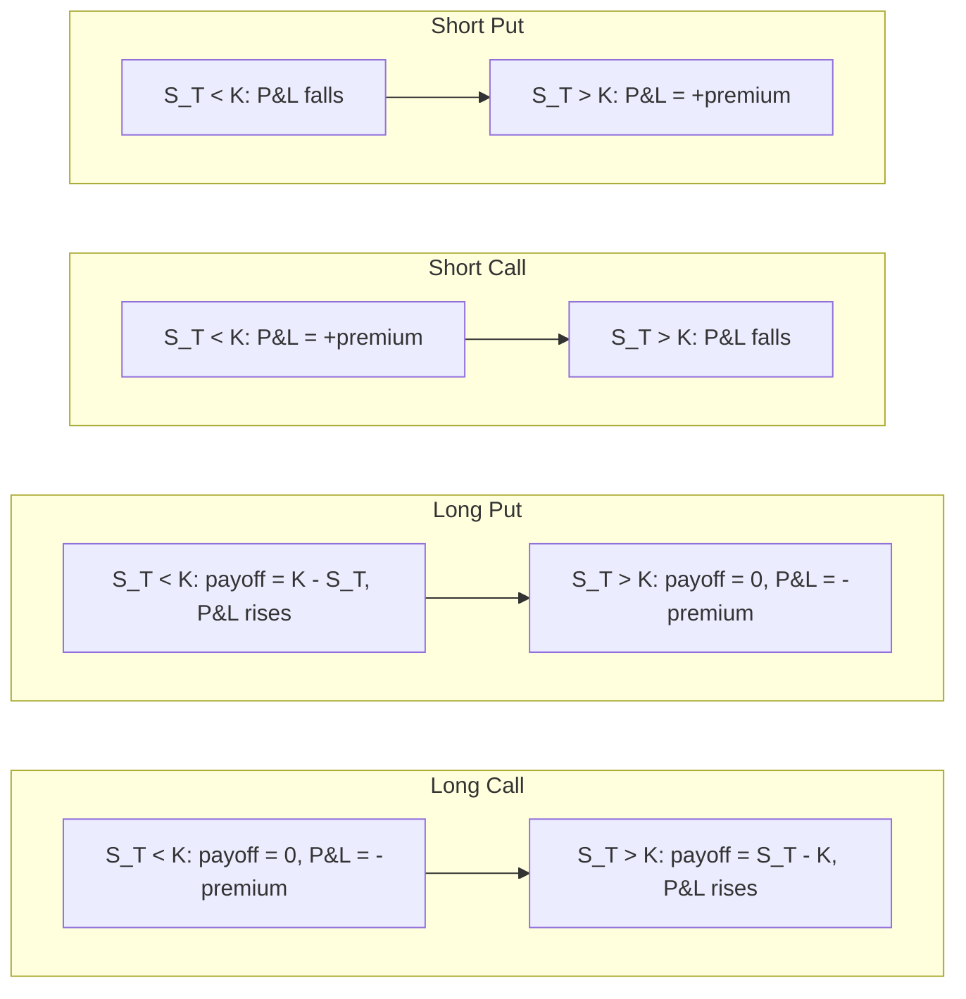

# Options Basics and the Volatility Surface

> **Application:**
> Options-implied information is a rich source of features for volatility forecasting ([Chapter 13](ch13-feature-engineering.md)).
> The variance risk premium ([Chapter 10](ch10-variance-risk-premium.md)) is defined as the gap between implied and realized volatility, both of which you need this chapter to understand.
> Project 5 (VRP ML trader) directly trades that gap.
> Even for non-options projects, understanding the volatility surface is necessary because VIX and IV-derived features appear in virtually every competitive feature set for realized volatility forecasting (Gu et al., 2020).

This chapter introduces options from scratch, builds up to the Black-Scholes formula (just enough to define implied volatility), and then shows how the entire volatility surface encodes the market's fears and expectations.
You will finish with the model-free VIX, which connects options prices directly to expected future variance.

## What Is an Option?

This section defines what an option contract is and what it pays at expiry.

> **Prereq: Background for This Chapter**
> You need comfort with:
> - Expected values and probability distributions (any intro probability course).
> - The standard normal CDF, $\Phi(z) = P(Z \leq z)$ for $Z \sim \mathcal{N}(0,1)$.
> - Logarithms, exponentials, and basic calculus (derivatives, integrals).
> - The concept of variance and standard deviation from [Chapter 1](ch01-returns-variance-volatility.md).
>
> No prior knowledge of options, derivatives, or financial markets is assumed.

> **Definition: Option Contract**
> An **option** is a contract that gives the holder the *right, but not the obligation*, to buy or sell an **underlying asset** (the stock, index, or commodity the option is written on) at a pre-agreed price.
> Two parameters define any option:
> - **Strike price** $K$: the pre-agreed transaction price.
> - **Expiry date** $T$: the deadline by which the right must be exercised.

There are two types:
- A **call option** gives the right to *buy* the underlying at price $K$ by time $T$.
- A **put option** gives the right to *sell* the underlying at price $K$ by time $T$.

The buyer pays an upfront price (the **premium**) for this right.
The seller ("writer") collects the premium but takes on the obligation.

### Payoff at Expiry

At expiry, the option is worth exactly what you would gain by exercising it (or zero if exercising would lose money).
Let $S_T$ denote the price of the underlying asset at expiry.

> **Definition: Option Payoffs at Expiry**
> $$\text{Call payoff} = \max(S_T - K,\; 0)$$
> $$\text{Put payoff} = \max(K - S_T,\; 0)$$
> where:
> - $S_T$ = price of the underlying asset at expiry.
> - $K$ = strike price (pre-agreed transaction price).
> - The $\max(\cdot, 0)$ reflects that you never exercise at a loss; you simply let the option expire.

> **Intuition:**
> Suppose you hold a call option with strike $K = 100$.
> If $S_T = 120$, you exercise: buy at 100, the asset is worth 120, you gain 20.
> If $S_T = 80$, you do nothing: buying at 100 when the market price is 80 would be foolish.
> Your payoff is never negative.
> This asymmetry is the entire reason options have value, and why someone must be paid a premium to write them.

> **Project Connection:**
> The asymmetric payoff structure is what makes options sensitive to volatility in the first place.
> A stock's P&L is symmetric around its expected return, so only direction matters.
> An option's P&L is asymmetric, so both the direction *and magnitude* of moves matter, which is why option prices encode information about the distribution of future returns, not just the mean.
> This is the foundation for extracting implied volatility and the variance risk premium ([Chapter 10](ch10-variance-risk-premium.md)) from option prices.

The figure below shows the payoff profiles.
The kink at $K$ is the signature of an option; linear instruments (stocks, futures) have straight-line payoffs.

*Option payoff diagrams (profit/loss including the premium paid or received). Long positions have limited downside and potentially large upside. Short positions are the mirror image: limited upside, potentially large downside. The kink at the strike $K$ is the defining feature of an option.*

### Moneyness

Traders classify options by how the current spot price $S$ compares to the strike $K$:

> **Definition: Moneyness**
> For a **call** option:
> - **In-the-money (ITM)**: $S > K$ (exercising now would be profitable).
> - **At-the-money (ATM)**: $S \approx K$.
> - **Out-of-the-money (OTM)**: $S < K$ (exercising now would not be profitable).
>
> For a **put**, the directions reverse: ITM when $S < K$, OTM when $S > K$.
> A common quantitative measure of moneyness is $m = K/S$ (or its log, $\ln(K/S)$).

## Black-Scholes in One Page

Now that you know what options pay, the natural question is: what should you pay *today* for an option that expires in the future?
This section presents the answer that Black and Scholes (1973) derived, which earned a Nobel Prize and remains the bedrock of options pricing.

The core idea: an option's value today equals the expected payoff at expiry, discounted to the present, under a probability measure that accounts for risk.
Black and Scholes (1973) showed that under a specific set of assumptions, this expected value has a closed-form solution.

> **Key Idea: The Black-Scholes Assumptions**
> The formula assumes:
> 1. The underlying price follows geometric Brownian motion (log-normal returns).
> 2. Volatility $\sigma$ is **constant** over the life of the option.
> 3. There are no jumps in the price.
> 4. Trading is continuous and frictionless (no transaction costs, unlimited short selling).
> 5. The risk-free interest rate $r$ is constant and known.
> 6. No dividends.
>
> Every single one of these assumptions is wrong in practice. This matters, and we will exploit it.

> **Definition: The Black-Scholes Formula for a European Call**
> A **European** option can only be exercised at expiry, not before. An **American** option can be exercised at any time up to expiry. For the purpose of defining implied volatility, the European version is standard.
>
> $$C = S\,\Phi(d_1) - K e^{-rT}\Phi(d_2)$$
>
> where
>
> $$d_1 = \frac{\ln(S/K) + (r + \sigma^2/2)\,T}{\sigma\sqrt{T}}, \qquad d_2 = d_1 - \sigma\sqrt{T}$$
>
> and:
> - $C$ = price of the call option today.
> - $S$ = current spot price of the underlying asset.
> - $K$ = strike price.
> - $r$ = continuously compounded risk-free interest rate (annualized).
> - $T$ = time to expiry in years (e.g., 3 months = 0.25).
> - $\sigma$ = annualized volatility of the underlying's log returns.
> - $\Phi(\cdot)$ = CDF of the standard normal distribution.
> - $d_1$ = a standardized measure of how far in-the-money the option is, adjusted for drift and time.
> - $d_2$ = $d_1$ minus a volatility-time adjustment; $\Phi(d_2)$ is the risk-neutral probability of exercise.

> **Intuition: Reading the Formula**
> Break the call price formula into two pieces:
> - $S\,\Phi(d_1)$: what you expect to receive (the asset value, weighted by the probability-adjusted chance it ends up above $K$).
> - $K e^{-rT}\Phi(d_2)$: what you expect to pay (the strike, discounted to today, weighted by the risk-neutral probability of actually exercising).
>
> The call price is the difference: expected receipt minus expected cost.

> **Project Connection:**
> Black-Scholes tells you the fair price of an option given a *fixed* volatility assumption, but volatility is not fixed.
> That disconnect is the entire point of the volatility surface and of your forecasting project.
> The formula's single most important role for you is as the *inverse function* that maps observed option prices to implied volatilities (Section on Implied Volatility below), which then become features and benchmarks for your ML model.

> **Warning:**
> Black-Scholes is wrong in nearly all its assumptions.
> Returns have fat tails ([Chapter 1](ch01-returns-variance-volatility.md)), volatility is not constant ([Chapter 4](ch04-garch-models.md)--[Chapter 7](ch07-rough-volatility.md)), and prices jump ([Chapter 6](ch06-jump-detection.md)).
> But the formula remains the market's common language for quoting option prices.
> When a trader says "this option is trading at 25 vol," they mean the Black-Scholes implied volatility is 25%.
> The formula is not a belief about reality; it is a translation device.

### The Greeks: Sensitivity to Inputs

The Black-Scholes formula expresses the option price as a function of five inputs.
The partial derivatives of the price with respect to each input are called the **Greeks**, and they tell you how sensitive the option's value is to small changes in market conditions.

> **Definition: Key Greeks**
> For a European call option priced by Black-Scholes:
> - **Delta** ($\Delta = \partial C / \partial S$): sensitivity to the underlying price. A delta of 0.60 means the call gains roughly $0.60 for each $1 rise in the stock.
> - **Gamma** ($\Gamma = \partial^2 C / \partial S^2$): rate of change of delta. High gamma means delta shifts rapidly with the stock price, making hedging more difficult.
> - **Theta** ($\Theta = \partial C / \partial T$): time decay. Options lose value as expiry approaches (all else equal), and theta quantifies that bleed.
> - **Vega** ($\mathcal{V} = \partial C / \partial \sigma$): sensitivity to volatility. This is the Greek that matters most for your project.
> - **Rho** ($\rho = \partial C / \partial r$): sensitivity to the risk-free rate. Usually small for short-dated options.

> **Intuition: In Plain English**
> The Greeks answer five practical questions: how much does my option gain or lose if (1) the stock moves, (2) the stock moves *fast*, (3) a day passes, (4) volatility changes, or (5) interest rates change?
> Vega is the most important Greek for volatility trading because it tells you how many dollars you make or lose per percentage-point change in implied vol.
> A high-vega position is a direct bet on volatility; a zero-vega portfolio is insulated from vol changes.

*[Figure: Vega profiles across moneyness for different maturities. Vega peaks at-the-money and falls off for deep ITM or OTM options. Key values: 1-month option peaks near 0.30 at ATM; 6-month peaks near 0.40 with a wider bell; 12-month also peaks near 0.40 but with the widest bell. Longer-dated options have higher vega and a wider peak; short-dated ATM options have concentrated vega.]*

> **Project Connection:**
> Vega tells you how sensitive option prices are to volatility changes, which is critical when trading vol forecasts.
> If your ML model predicts that realized vol will be higher than implied vol, you want to buy options with high vega to maximize your dollar exposure to that view.
> Understanding the vega profile also explains why ATM options are the most liquid instruments for vol trading and why the variance swap (see Section on Variance Swaps below) is designed to provide constant dollar exposure to variance regardless of the stock price.

## Implied Volatility

With Black-Scholes in hand, we now reverse-engineer it to extract the market's view of volatility.

Every input to the Black-Scholes formula ($S$, $K$, $r$, $T$) is directly observable from market data, except one: $\sigma$.
If you also observe the market price of the option $C_{\text{mkt}}$, you can back out the volatility the market is implicitly using.

> **Definition: Implied Volatility**
> The **implied volatility** $\sigma_{\text{imp}}$ is the value of $\sigma$ that makes the Black-Scholes formula match the observed market price:
>
> $$C_{\text{mkt}} = C_{\text{BS}}(S,\, K,\, r,\, T,\, \sigma_{\text{imp}})$$
>
> where:
> - $C_{\text{mkt}}$ = the option price observed in the market.
> - $C_{\text{BS}}(\cdot)$ = the Black-Scholes pricing function.
> - $\sigma_{\text{imp}}$ = the implied volatility (the unknown being solved for).
>
> There is no closed-form solution for $\sigma_{\text{imp}}$; it must be found numerically (e.g., Newton-Raphson or bisection).

> **Intuition: The "Wrong Number in the Wrong Formula"**
> Implied volatility is famously described as "the wrong number to put in the wrong formula to get the right price" (Rebonato, 2004).
> It is *not* a forecast of future volatility.
> It is the market's consensus price of uncertainty, contaminated by:
> - **Risk premia**: sellers of options demand compensation for bearing tail risk, inflating IV above expected realized vol.
> - **Supply and demand**: heavy demand for downside protection (put buying) pushes up IV for low-strike options.
> - **Model error**: since Black-Scholes is misspecified, IV absorbs all the model's errors into a single number.
>
> Despite all this, IV is extremely useful. It is a real-time, forward-looking, market-priced measure of uncertainty.

> **Project Connection:**
> Implied volatility is the market's consensus forecast of future vol.
> Comparing it to your RV forecast gives you the **variance risk premium**: $\text{VRP} \approx \text{IV}^2 - \widehat{\text{RV}}^2$.
> If your ML model produces a more accurate RV forecast than the market's implied estimate, the VRP becomes a tradeable signal ([Chapter 10](ch10-variance-risk-premium.md)).
> IV is also one of the strongest single features for predicting future realized vol (Gu et al., 2020), so it will appear directly in your feature set ([Chapter 13](ch13-feature-engineering.md)).

### Computing IV: The Newton-Raphson Method

The definition above says IV must be found "numerically."
The standard method is **Newton-Raphson iteration**, which exploits the fact that vega (the derivative of option price with respect to $\sigma$) is available in closed form.

Starting from an initial guess $\sigma_0$, the iteration refines the estimate:

$$\sigma_{n+1} = \sigma_n - \frac{C_{\text{BS}}(\sigma_n) - C_{\text{mkt}}}{\mathcal{V}(\sigma_n)}$$

where:
- $C_{\text{BS}}(\sigma_n)$: the Black-Scholes price evaluated at the current volatility guess $\sigma_n$.
- $C_{\text{mkt}}$: the observed market price of the option.
- $\mathcal{V}(\sigma_n) = S\sqrt{T}\,N'(d_1)$: the Black-Scholes vega, with $N'(x) = \frac{1}{\sqrt{2\pi}}e^{-x^2/2}$ the standard normal density.

> **Intuition: In Plain English**
> Newton-Raphson asks: "Given my current guess $\sigma_n$, the BS formula gives price $C_{\text{BS}}(\sigma_n)$.
> The market price is $C_{\text{mkt}}$.
> How much should I adjust $\sigma$ to close the gap?"
> The answer is to divide the price error by the sensitivity of the price to $\sigma$ (vega).
> If vega is 12 cents per vol point and the price error is 60 cents, adjust $\sigma$ by $60/12 = 5$ vol points.
> The method converges quadratically -- each iteration roughly doubles the number of correct digits -- so 3--5 iterations typically suffice.

**Initial guess.** Brenner and Subrahmanyam (1988) provide a simple closed-form approximation for ATM options:

$$\sigma_0 \approx \sqrt{\frac{2\pi}{T}} \cdot \frac{C_{\text{mkt}}}{S}$$

This approximation exploits the fact that the ATM Black-Scholes call price is approximately $C \approx S\sigma\sqrt{T/(2\pi)}$.
For options far from the money, use $\sigma_0 = 0.20$ (20%) as a robust starting point.

> **Warning:**
> Vega approaches zero for deep in-the-money and deep out-of-the-money options (where the option price is insensitive to volatility changes).
> Dividing by near-zero vega produces enormous, erratic steps.
> Two safeguards:
> (1) bound each step: $|\sigma_{n+1} - \sigma_n| \leq 0.25$;
> (2) if vega drops below a threshold (e.g., $10^{-8}$), fall back to bisection, which is slower (linear convergence) but unconditionally stable.
> In practice, a hybrid Newton-Raphson/bisection algorithm handles the entire strike range reliably.

> **Project Connection:**
> If your project uses options data (SPX IV surface from Marquee), you will not receive pre-computed implied volatilities for every strike and maturity.
> You will often need to invert the Black-Scholes formula yourself to convert option prices into IV.
> Implement Newton-Raphson with the Brenner-Subrahmanyam initial guess and bisection fallback.
> The entire IV surface construction pipeline -- from raw option prices to smooth SVI-fitted IV -- starts with this inversion at each individual $(K, T)$ point.

A critical point: implied volatility is *not* a single number for a given underlying.
Every (strike, maturity) pair has its own IV.
This leads directly to the next section.

## The Implied Volatility Surface

The implied volatility extracted from options depends on which option you look at, giving rise to a two-dimensional surface.

> **Definition: Implied Volatility Surface**
> The **implied volatility surface** is the function
>
> $$\sigma_{\text{imp}}(K, T)$$
>
> mapping each (strike, maturity) pair to the implied volatility extracted from the corresponding option price.
> In practice, moneyness $m = K/S$ (or $\ln(K/S)$) replaces the raw strike to make the surface comparable across different underlying price levels.
> - $K$ (or $m$) = strike price (or moneyness).
> - $T$ = time to expiry.
> - $\sigma_{\text{imp}}$ = implied volatility at that (strike, maturity) point.

> **Key Idea:**
> If Black-Scholes were correct (constant volatility, log-normal returns, no jumps), every option on the same underlying would produce the *same* implied volatility regardless of strike or maturity.
> The surface would be perfectly flat.
> The fact that the surface is *not* flat is direct evidence that Black-Scholes is wrong, and the shape of the surface tells you *how* it is wrong.

> **Project Connection:**
> The volatility surface encodes information about jump risk, tail risk, and market fear that goes beyond what backward-looking realized volatility captures.
> Changes in the surface's shape (steepening skew, inverting term structure) are forward-looking signals that could serve as features for your ML model, potentially improving on a pure HAR baseline that only uses past RV.

### The Volatility Smile and Skew

The cross-section of IV at a fixed maturity reveals two patterns.

*[Figure: Implied volatility vs. moneyness at a fixed maturity. The equity skew curve (typical): IV increases sharply for low strikes (OTM puts) due to crash-risk demand, from roughly 30% at K/S=0.80 down to about 18% at K/S=1.20. The FX smile curve (symmetric): a U-shape with IV elevated at both deep OTM puts and deep OTM calls, bottoming near 18.5% at ATM. The Black-Scholes flat reference: a horizontal line at 20%. The OTM put wing of the equity skew is labeled "crash protection"; the OTM call wing is labeled "OTM calls.".]*

**The skew** (equity): for equity index options, IV is much higher for low strikes ($K/S < 1$, OTM puts) than for high strikes ($K/S > 1$, OTM calls).
This pattern emerged after the 1987 crash and has persisted ever since.
It reflects the market's pricing of left-tail (crash) risk: investors pay a premium for downside protection.

**The smile** (FX): for foreign exchange options, IV is elevated for both deep OTM puts and deep OTM calls, creating a U-shape.
This reflects the market's view that large moves in either direction are more likely than the log-normal model assumes (fat tails on both sides).

Both patterns are inconsistent with constant-volatility Black-Scholes, which would produce the flat gray line.

### The Term Structure of Implied Volatility

The second dimension is maturity.
At-the-money IV is not the same at 1 month as at 1 year.

> **Key Idea: IV Term Structure**
> - **Normal conditions**: the term structure slopes upward (long-dated IV $>$ short-dated IV), reflecting the greater uncertainty over longer horizons and mean-reversion in volatility.
> - **Crisis periods**: the term structure inverts (short-dated IV $>$ long-dated IV), because near-term fear spikes while the market expects volatility to eventually normalize.
> - Short-dated IV is more volatile than long-dated IV, consistent with the mean-reverting nature of volatility established in [Chapter 4](ch04-garch-models.md) and [Chapter 5](ch05-har-model.md).

*[Figure: ATM implied volatility term structure under two regimes. Normal (upward-sloping): ATM IV rises from about 16% at 1 month to 20.8% at 12 months. Crisis (inverted): ATM IV falls from about 40% at 1 month to 24% at 12 months. The spread between short-dated and long-dated ATM IV is itself a useful feature for forecasting models.]*

### The Butterfly Spread

The skew tells you about the *asymmetry* of the market's fear -- how much more expensive downside protection is relative to upside.
But it says nothing about whether *both* tails are being bid up simultaneously.
The **butterfly spread** fills that gap.

When portfolio managers buy both OTM puts (crash protection) and OTM calls (upside participation or short-squeeze hedging) at the same time, IV rises on both wings relative to ATM.
This symmetric fattening of the tails is invisible to a skew measure, which only captures the *difference* between the two wings.
The butterfly captures the *average* elevation of both wings above the center.

The butterfly spread is constructed from three implied volatilities at a fixed maturity: the 25-delta put, the 25-delta call, and the ATM (50-delta) volatility.

> **Definition: Butterfly Spread**
> The **butterfly spread** (or **butterfly**) is defined as:
>
> $$\mathrm{BF}_t = \frac{1}{2}\bigl(\sigma_{25\Delta P} + \sigma_{25\Delta C}\bigr) - \sigma_{\mathrm{ATM}}$$
>
> where:
> - $\sigma_{25\Delta P}$ = implied volatility of the 25-delta put (an OTM put whose Black-Scholes delta is $-0.25$).
> - $\sigma_{25\Delta C}$ = implied volatility of the 25-delta call (an OTM call whose Black-Scholes delta is $+0.25$).
> - $\sigma_{\mathrm{ATM}}$ = at-the-money implied volatility (50-delta).
> - $\mathrm{BF}_t$ = the butterfly spread on day $t$, measured in volatility points.
>
> The butterfly is always non-negative in a no-arbitrage market (a negative value would imply the smile is concave, which violates convexity constraints on the implied volatility curve).

> **Intuition: In Plain English**
> The butterfly measures how much higher the average wing volatility is compared to the center of the smile.
> Think of it as the "curvature" or "U-shape" of the smile at a fixed maturity.
> A large butterfly means traders are paying up for protection on *both* sides of the distribution -- they expect fat tails, regardless of direction.
> A small butterfly means the smile is relatively flat and the market sees tail risk as modest.

To see why the butterfly and skew are complementary rather than redundant, note that they decompose the two wing volatilities into orthogonal components.
The **risk reversal** (skew) is the difference between the wings:

$$\mathrm{RR}_t = \sigma_{25\Delta C} - \sigma_{25\Delta P}$$

while the butterfly is their average elevation above ATM.
Together, the two reconstruct the full wing structure:

$$\sigma_{25\Delta P} = \sigma_{\mathrm{ATM}} + \mathrm{BF}_t - \tfrac{1}{2}\,\mathrm{RR}_t$$

$$\sigma_{25\Delta C} = \sigma_{\mathrm{ATM}} + \mathrm{BF}_t + \tfrac{1}{2}\,\mathrm{RR}_t$$

The risk reversal captures **directional asymmetry** (skewness demand); the butterfly captures **symmetric tail thickness** (kurtosis demand).
One measures the tilt of the smile; the other measures its curvature.

> **Key Idea: Skew vs. Butterfly: What Each Captures**
> - **Risk reversal (skew)**: dominated by demand for downside protection relative to upside. In equities, the risk reversal is persistently negative (OTM puts are more expensive than OTM calls). It tracks *skewness* in the risk-neutral distribution.
> - **Butterfly**: dominated by demand for *both* tails simultaneously. It tracks *excess kurtosis* in the risk-neutral distribution -- the market's pricing of large moves in either direction beyond what ATM vol implies.
>
> You can have a steep skew with a low butterfly (the left tail is fat, but the right tail is not), or a mild skew with a high butterfly (both tails are fat, roughly equally).
> The two dimensions are largely independent.

#### Crisis Behavior

During crises, the butterfly typically spikes alongside VIX, but with a distinctive pattern.
Portfolio insurance programs bid up OTM puts (the dominant effect in the skew), and at the same time, short-covering and tail-risk hedging bid up OTM calls.
When *both* wings are elevated, the butterfly rises sharply.

A rising butterfly with a steepening skew is the signature of a broad-based panic: the market is pricing extreme moves in both directions, not just a directional crash.
In contrast, a rising skew with a *stable* butterfly signals targeted downside hedging without generalized tail fear.

This distinction matters because realized volatility behaves differently in the two regimes.
Symmetric tail pricing (high butterfly) tends to precede periods of elevated but two-sided choppiness, while pure skew spikes often precede sharp, directional sell-offs that resolve more quickly.

> **Project Connection:**
> The butterfly spread is one of nine options-implied features in the project's feature pipeline ([Chapter 13](ch13-feature-engineering.md)).
> It provides information that the risk reversal (skew) cannot: whether the market prices *symmetric* tail risk, not just directional fear.
> Empirically, the butterfly is most useful as a crisis-detection signal.
> Spikes in the butterfly predict periods of elevated realized volatility at weekly and monthly horizons, especially when combined nonlinearly with VIX and the term structure slope in tree-based models.
> Because the butterfly captures kurtosis demand rather than directional skewness, it adds orthogonal information to the risk reversal and helps the model distinguish between one-sided drawdowns and regime shifts into sustained high-volatility environments.

### The Full Surface

*[Figure: The implied volatility surface for a typical equity index -- a three-dimensional surface with moneyness (K/S) on one axis, maturity in months on the other, and IV (%) on the vertical axis. Left side (low moneyness, OTM puts): IV is elevated, especially at short maturities, reflecting concentrated crash-risk demand, reaching roughly 28--30% for 1-month deep OTM puts. Right side (high moneyness, OTM calls): IV is lower. Short maturities (front of the surface): the skew is steeper and IV levels are more extreme. Long maturities (back): the surface flattens as mean-reversion dampens both the level and the skew.]*

> **Key Idea: What the Surface Shape Tells You**
> The shape of the IV surface encodes the market's collective view on:
> - **Skew** (IV higher for low strikes): the market prices crash risk above what log-normal returns imply.
> - **Smile** (IV elevated at both extremes): the market prices fat tails in both directions.
> - **Steep term structure**: short-term uncertainty is elevated relative to long-term expectations (often a fear signal).
> - **Inverted term structure**: near-term panic; the market expects volatility to decline eventually.
>
> Each of these shapes changes over time, and tracking those changes is a source of features for volatility forecasting.

### Fitting the Surface: The SVI Parametrization

The IV surface is a collection of discrete points (one per traded option).
To use it as a continuous object -- for interpolation, extrapolation, or computing smooth Greeks -- you need a parametric model that fits through those points.
The **Stochastic Volatility Inspired (SVI)** parametrization (Gatheral and Jacquier, 2014) is the industry standard for equity index surfaces.

> **Definition: Raw SVI Parametrization**
> For log-moneyness $k = \ln(K/F)$ (where $F$ is the forward price), the **total implied variance** $w(k) = \sigma_{\text{imp}}^2(k) \cdot T$ of a single maturity slice is:
>
> $$w(k) \;=\; a \;+\; b\!\left\{\rho\,(k - m) + \sqrt{(k-m)^2 + \sigma^2}\right\}$$
>
> with five parameters $\{a, b, \rho, m, \sigma\}$ satisfying:
> - $a \in \mathbb{R}$: vertical level of the smile (shifts total variance up or down).
> - $b \geq 0$: controls the slope of both wings (larger $b$ = steeper wings).
> - $|\rho| < 1$: controls the tilt (negative $\rho$ steepens the left/put wing, flattens the right/call wing).
> - $m \in \mathbb{R}$: horizontal translation (shifts the smile's center left or right along log-moneyness).
> - $\sigma > 0$: controls the curvature at the money (smaller $\sigma$ = sharper ATM bend).
>
> The non-negativity constraint $a + b\sigma\sqrt{1 - \rho^2} \geq 0$ ensures $w(k) \geq 0$ for all $k$.

> **Intuition: In Plain English**
> The SVI formula says: total implied variance is a shifted, tilted hyperbola in log-moneyness.
> The square root $\sqrt{(k-m)^2 + \sigma^2}$ creates the "smile" shape -- it curves upward for strikes far from the center $m$.
> The $\rho(k-m)$ term tilts the smile: for equities, $\rho < 0$, making the left wing (OTM puts) steeper than the right wing (OTM calls).
> The parameter $a$ shifts the whole curve vertically, and $b$ scales the wings.
> The five parameters give enough flexibility to fit real market smiles accurately while producing smooth, well-behaved extrapolations into the tails.

**Why SVI?**
Two properties make SVI theoretically well-motivated, not just a convenient curve fit (Gatheral and Jacquier, 2014):
1. As $|k| \to \infty$, $w(k)$ becomes linear in $k$, matching **Roger Lee's moment formula** -- the theoretical constraint that total variance must grow at most linearly in extreme log-moneyness.
2. The large-maturity limit of the **Heston** stochastic volatility model's implied variance is exactly SVI. The parametrization is not arbitrary.

**What each parameter controls.**
When calibrating to market data, you can think of the five parameters as knobs:
- Raise $a$: the entire smile shifts up (higher overall variance).
- Raise $b$: both wings get steeper (more extreme strike vol increases).
- Lower $\rho$ (more negative): the put wing steepens, the call wing flattens (stronger skew).
- Shift $m$ right: the smile's center moves to higher moneyness.
- Lower $\sigma$: the ATM region becomes more "V-shaped" (sharper curvature at the money).

> **Project Connection:**
> SVI is how practitioners interpolate and extrapolate the IV surface.
> For your project, SVI matters in two ways:
> (1) if you compute surface-derived features (skew, butterfly, term structure slope) from raw option prices, SVI gives you a smooth surface to read those features from, avoiding the noise of individual option quotes;
> (2) the SVI parameters themselves -- especially $b$ (wing steepness) and $\rho$ (skew) -- can serve as features for vol forecasting, since they summarize the entire smile shape in five numbers.
> Fit SVI slice-by-slice (one set of parameters per maturity), then track how $\rho$ and $b$ change over time.

> **Warning:**
> A naive SVI fit can produce **calendar spread arbitrage**: total variance that decreases with maturity at some strikes.
> Gatheral and Jacquier (2014) provide sufficient conditions for arbitrage-free SVI surfaces.
> For a surface (not just a single slice), use the **SSVI** extension, which parametrizes the entire surface jointly and guarantees no static arbitrage under simple parameter constraints.
> Always verify $\partial_T w(k,T) \geq 0$ for all $k$ after calibration.

## PCA of the Volatility Surface

The IV surface is a high-dimensional object (potentially hundreds of strike-maturity points), but its daily movements are driven by a small number of factors.

Cont (2002) applied principal component analysis (PCA) to the daily changes of S&P 500 implied volatility surfaces and found a remarkably low-dimensional structure.

> **Prereq: PCA in One Paragraph**
> PCA finds orthogonal directions of maximum variance in a dataset.
> The first principal component (PC1) captures the most variance, PC2 captures the most remaining variance orthogonal to PC1, and so on.
> If you have studied linear algebra, PCA extracts the eigenvectors of the covariance matrix, sorted by eigenvalue magnitude.

> **Key Result: Three Factors Drive the IV Surface (Cont, 2002)**
> PCA on daily changes in the implied volatility surface yields three dominant factors:
> 1. **Level** (PC1, ~70% of variance): a parallel shift; the entire surface moves up or down together. This is the "VIX factor" for equity indices.
> 2. **Slope** (PC2, ~15% of variance): the skew steepens or flattens; OTM put IV moves relative to OTM call IV.
> 3. **Curvature** (PC3, ~10% of variance): the smile becomes more or less convex; both tails move relative to ATM.
>
> Together, these three factors explain roughly 95% of daily surface variation.

*[Figure: Stylized PCA factor loadings for the implied volatility surface at a fixed maturity, following Cont (2002). PC1 (level) loads uniformly across all strikes at approximately +0.55 to +0.60. PC2 (slope) loads negatively (around -0.50) on low strikes and positively (around +0.50) on high strikes, capturing skew rotation. PC3 (curvature) loads positively at both extremes (around +0.45) and negatively at ATM (around -0.25), capturing smile convexity changes.]*

> **Key Idea: Practical Use: Surface Compression**
> Instead of feeding hundreds of IV grid points into a forecasting model, you can represent each day's surface (or surface change) with just three numbers: the PC1, PC2, and PC3 scores.
> This is a powerful dimensionality reduction for feature engineering ([Chapter 13](ch13-feature-engineering.md)): three features capture 95% of the surface's information content.

## Local Volatility

> **Prereq: Requirements for This Section**
> You should be comfortable with the Black-Scholes framework (Section on Black-Scholes above), partial derivatives (including second-order), and the concept of the implied volatility surface from the preceding sections.

The implied volatility surface gives us a snapshot of how the market prices options across strikes and maturities, but it does not tell us *how to interpolate* between quoted points or *how to extrapolate* beyond them without introducing arbitrage.
A naive interpolation (e.g., linear in strike) can easily violate calendar-spread or butterfly-spread no-arbitrage conditions.
**Local volatility** solves this problem: it provides the unique continuous diffusion model consistent with all observed option prices.

The key result is due to Dupire (1994).
Given a continuum of European call prices $C(K,T)$ observed across strikes $K$ and maturities $T$, the **Dupire formula** extracts the local volatility:

$$\sigma_{\text{loc}}^2(K,T) = \frac{\dfrac{\partial C}{\partial T} + rK\dfrac{\partial C}{\partial K}}{\dfrac{1}{2}K^2 \dfrac{\partial^2 C}{\partial K^2}}$$

The numerator combines two effects: $\partial C / \partial T$ captures the time decay of the option (how much value accrues as the horizon extends), while $rK\,\partial C / \partial K$ is a cost-of-carry correction arising from discounting.
The denominator, $\frac{1}{2}K^2\,\partial^2 C / \partial K^2$, is proportional to the **risk-neutral density** of the underlying at strike $K$ and maturity $T$ -- it measures how much probability the market assigns to the stock landing near $K$.
For the formula to be well-defined, the denominator must be strictly positive (a condition equivalent to the absence of butterfly arbitrage).

> **Intuition: In Plain English**
> The Dupire formula asks: given how option prices change as you shift the strike and the maturity, what instantaneous volatility must the market be assigning to each specific price level at each specific future time?
> The numerator measures how much extra option value you get by extending the horizon (adjusted for interest rates).
> The denominator measures how tightly the market's probability is concentrated near that strike.
> Dividing the two gives you the local "speed of randomness" the market prices at that point.

> **Intuition: Local Vol as Market-Implied Instantaneous Vol**
> Local vol is the unique diffusion coefficient $\sigma(S,t)$ such that a one-factor model
>
> $$\frac{dS}{S} = \mu\,dt + \sigma(S,t)\,dW$$
>
> reproduces *all* observed option prices simultaneously.
> It is the market's pricing of instantaneous volatility conditional on the stock being at price $K$ at time $T$.
> Unlike implied volatility (which averages over the entire path to expiry), local vol is a pointwise, path-independent quantity -- the "microscopic" volatility the market embeds at each node of the $(K,T)$ grid.

> **Warning:**
> Local vol perfectly fits today's option prices but has no predictive power for tomorrow.
> It generates flat forward volatility smiles (the smile does not move), which contradicts observed behavior.
> Use it as an interpolation and arbitrage-checking tool, not as a model of reality.
> For forecasting, use the realized measures and ML models from later chapters.

> **Project Connection:**
> Local vol extractions at specific moneyness levels (e.g., 90% and 110% of spot) encode the market's current pricing of tail risk at different horizons.
> These can serve as ML features ([Chapter 13](ch13-feature-engineering.md)) that complement backward-looking realized measures with forward-looking options information.
> The ratio of local vol at 90% moneyness to ATM local vol is a cleaner skew measure than raw IV skew, potentially giving your model a more informative tail-risk signal.

## Model-Free Implied Variance and the VIX

The previous sections define implied volatility through the lens of Black-Scholes, which means the IV number carries the model's errors.
This section presents a method that extracts expected future variance from option prices without assuming any pricing model.

### Model-Free Implied Variance

Britten-Jones and Neuberger (2000) proved a striking result: under very general conditions, the expected integrated variance of the underlying (under the risk-neutral probability measure) can be read directly from option prices across all strikes, with no parametric model needed.

> **Prereq: Risk-Neutral Measure**
> In derivatives pricing, the "risk-neutral" (or $\mathbb{Q}$) measure is a probability weighting under which all assets earn the risk-free rate on average.
> It is *not* the real-world probability of outcomes; it is a mathematical device that makes pricing consistent with no-arbitrage.
> Expectations under $\mathbb{Q}$ incorporate risk premia: they overweight bad outcomes relative to real-world probabilities because investors demand compensation for bearing risk.

> **Key Result: Model-Free Implied Variance (Britten-Jones and Neuberger, 2000)**
> The risk-neutral expected integrated variance over horizon $[0, T]$ equals:
>
> $$\mathbb{E}^{\mathbb{Q}}\!\left[\int_0^T \sigma_t^2\,dt\right] = \frac{2}{T}\!\left[\int_0^{F} \frac{P(K,T)}{K^2}\,dK + \int_{F}^{\infty} \frac{C(K,T)}{K^2}\,dK\right]$$
>
> where:
> - $\mathbb{E}^{\mathbb{Q}}[\cdot]$ = expectation under the risk-neutral probability measure.
> - $\sigma_t^2$ = instantaneous variance of the underlying at time $t$.
> - $\int_0^T \sigma_t^2\,dt$ = integrated variance over the period (the object that realized volatility estimates; see [Chapter 3](ch03-realized-volatility.md)).
> - $F$ = forward price of the underlying.
> - $P(K,T)$ = price of a European put with strike $K$ and maturity $T$ (used for $K < F$, i.e., OTM puts).
> - $C(K,T)$ = price of a European call with strike $K$ and maturity $T$ (used for $K > F$, i.e., OTM calls).
> - The $1/K^2$ weighting gives proportionally more weight to lower-strike options.
>
> The key insight: by integrating option prices across all strikes, the dependence on any particular volatility model cancels out.

> **Intuition: Why It Works Without a Model**
> A portfolio of options across all strikes effectively replicates a contract on realized variance itself.
> Each option at strike $K$ provides local information about the probability of the price reaching $K$.
> By weighting them by $1/K^2$ and integrating, you reconstruct the full distribution and extract its second moment (variance) without ever assuming what that distribution looks like.

> **Project Connection:**
> This integral is the theoretical foundation for VIX, which is one of the single strongest predictors of future realized vol.
> Because the model-free variance extracts *risk-neutral* expected variance (not real-world expected variance), it systematically overestimates realized vol.
> That persistent gap is the variance risk premium ([Chapter 10](ch10-variance-risk-premium.md)), and your ML model's ability to forecast the realized side more accurately than the market's implied estimate is what creates a tradeable signal.

### The VIX Index

The CBOE Volatility Index (VIX) is the market's most-watched "fear gauge."
It implements the model-free approach of Britten-Jones and Neuberger (2000) on S&P 500 options with a 30-day horizon.

> **Definition: VIX Construction (CBOE, 2019)**
> The VIX is defined as:
>
> $$\text{VIX}^2 = \frac{2}{T}\sum_i \frac{\Delta K_i}{K_i^2}\,e^{rT}\, Q(K_i) - \frac{1}{T}\left(\frac{F}{K_0} - 1\right)^2$$
>
> and $\text{VIX} = 100 \times \sqrt{\text{VIX}^2/100^2}$, reported in annualized percentage points.
> - $T$ = time to expiry (30 calendar days, $T \approx 30/365$).
> - $K_i$ = strike price of the $i$-th OTM option.
> - $\Delta K_i$ = spacing between adjacent strikes ($(K_{i+1} - K_{i-1})/2$).
> - $Q(K_i)$ = midpoint of the bid-ask spread for the OTM option at strike $K_i$ (puts for $K_i < F$, calls for $K_i > F$).
> - $F$ = forward index level derived from put-call parity.
> - $K_0$ = the first strike below $F$.
> - $r$ = risk-free rate.
> - The second term is a small correction for the difference between the forward and the first-below-forward strike.
>
> In practice, the CBOE interpolates between the two nearest-to-30-day maturities to target exactly 30 days.

The VIX formula is the discrete approximation of the continuous integral in the model-free variance equation: the sum over OTM options across all available strikes replaces the integral, and the $\Delta K_i / K_i^2$ weighting mirrors the $1/K^2$ in the continuous formula.

> **Intuition: In Plain English**
> The VIX formula adds up the prices of out-of-the-money options across all available strikes, weighting each by $1/K^2$ so that lower-strike options (which capture crash risk) count proportionally more.
> The result is the options market's collective estimate of how much the S&P 500 will bounce around over the next 30 days, expressed as an annualized percentage.
> The small correction term at the end accounts for the fact that the forward price may not land exactly on an available strike.

> **Project Connection:**
> VIX is the single most widely used implied-vol feature in volatility forecasting models and often the strongest univariate predictor of future realized vol (Gu et al., 2020).
> For your project, VIX (or VIX$^2$) enters the model both as a direct feature and as one side of the variance risk premium: $\text{VRP}_t = \text{VIX}_t^2 - \widehat{\text{RV}}_{t,t+30}$.
> Any improvement your ML model achieves in forecasting the RV side translates directly into a more accurate VRP signal and better trading decisions.

> **Key Idea: Interpreting VIX Levels**
> VIX is quoted in annualized percentage points.
> Typical values for the S&P 500:
> - **VIX $\approx$ 12--15**: calm markets, low uncertainty.
> - **VIX $\approx$ 20--25**: elevated uncertainty, moderate fear.
> - **VIX $>$ 30**: high fear; historically associated with market sell-offs.
> - **VIX $>$ 50**: extreme panic (2008 financial crisis peak: ~80; March 2020: ~82).
>
> To convert VIX to expected 30-day realized vol: $\sigma_{30d} \approx \text{VIX}/100$.
> For example, VIX = 20 implies the options market prices roughly 20% annualized vol over the next month.

> **Warning:**
> VIX is the risk-neutral expected volatility, *not* a forecast of realized volatility under real-world probabilities.
> VIX systematically overstates future realized volatility.
> The average gap between VIX-squared and subsequent 30-day realized variance is the **variance risk premium** ([Chapter 10](ch10-variance-risk-premium.md)).
> Historically, VIX exceeds subsequent realized vol roughly 85% of the time (Carr and Wu, 2009).
> Using VIX as a direct volatility forecast is a common and costly mistake: it confuses the risk-neutral measure $\mathbb{Q}$ with the real-world measure $\mathbb{P}$.

## Variance Swaps: Trading Realized Volatility

> **Prereq: Background for This Section**
> This section requires:
> - The model-free implied variance integral (Section on Model-Free Implied Variance above).
> - The VIX construction and interpretation (Section on the VIX Index above).
> - Realized variance and its estimation ([Chapter 3](ch03-realized-volatility.md)).

VIX tells you the fair price of future variance.
But how do you actually *trade* it?
The **variance swap** is the instrument that lets you take a direct position on realized volatility without managing Greeks day-to-day.

### Definition and Payoff

> **Definition: Variance Swap**
> A **variance swap** is an over-the-counter derivative whose payoff at expiry is:
>
> $$\text{Payoff} = N_{\text{var}} \times (\text{RV}^2 - K_{\text{var}})$$
>
> where:
> - $N_{\text{var}}$ = the **variance notional** (dollars per variance point squared).
> - $K_{\text{var}}$ = the **variance strike** (the agreed-upon fair variance level, set at inception so the swap has zero initial value).
> - $\text{RV}^2$ = the annualized realized variance of the underlying over the contract period, typically computed from daily log returns.
>
> The buyer of the swap profits when realized variance exceeds the strike; the seller profits when it falls below.

> **Intuition: In Plain English**
> A variance swap is a bet on how volatile the market will actually be.
> At the start, the two parties agree on a "fair" variance level ($K_{\text{var}}$).
> At expiry, they compare that to what actually happened (realized variance).
> The buyer gets paid the difference if markets were choppier than expected; the seller gets paid if markets were calmer.
> It is the purest financial instrument for expressing a view on volatility itself, stripped of any directional bet on the market.

Traders often think in terms of **vega notional** rather than variance notional, because it is more intuitive.
The vega notional approximates the dollar P&L per volatility point (not variance point):

$$N_{\text{vega}} = N_{\text{var}} \times 2\sqrt{K_{\text{var}}}$$

For example, if $K_{\text{var}} = 0.04$ (i.e., 20% vol) and you want $100,000 per vol point, then $N_{\text{var}} = N_{\text{vega}} / (2 \times 0.20) = $250,000 per variance point.

### Log-Contract Replication

The theoretical foundation: Britten-Jones and Neuberger (2000) and Carr and Wu (2009) showed that continuously delta-hedging a portfolio of OTM options weighted by $1/K^2$ replicates the payoff $-2\log(S_T/S_0)$.
The realized P&L from this hedge equals the realized variance minus the cost of the portfolio.
Therefore, the cost of this portfolio -- which is exactly the model-free implied variance integral from the section above -- equals the fair variance swap strike $K_{\text{var}}$.

This is the deep connection: the VIX formula computes the fair strike of a 30-day variance swap on the S&P 500.
$\text{VIX}^2 / 10{,}000$ is the annualized $K_{\text{var}}$ for that maturity.

> **Intuition: Trading Your Vol Forecast Directly**
> A variance swap lets you monetize your RV forecast without managing delta, gamma, or theta.
> If you believe next-month RV will be 22% but the var swap strike is $K_{\text{var}}$ corresponding to 19%, you buy the swap.
> At expiry your P&L is simply $N_{\text{var}} \times (0.22^2 - 0.19^2) = N_{\text{var}} \times 0.0123$.
> No path dependence before expiry settlement, no Greeks to manage -- just a pure bet on realized variance.

> **Warning:**
> A **volatility swap** (payoff $= \sigma_{\text{realized}} - K_{\text{vol}}$) is NOT the same as a variance swap.
> Because $\mathbb{E}[\sigma] < \sqrt{\mathbb{E}[\sigma^2]}$ (Jensen's inequality), the vol swap strike is lower than $\sqrt{K_{\text{var}}}$.
> The gap depends on the volatility of volatility (vol-of-vol, [Chapter 10](ch10-variance-risk-premium.md)).
> Also: before expiry, variance swaps have substantial mark-to-market risk as implied vol moves.
> A position can be deeply underwater mid-life even if it ultimately settles in your favor.

> **Project Connection:**
> The variance swap makes the VRP a tradeable quantity.
> $\text{VIX}^2/10{,}000$ minus your forecast of 30-day RV = variance risk premium ([Chapter 10](ch10-variance-risk-premium.md)).
> If your ML model forecasts RV more accurately than the market-implied $K_{\text{var}}$, you can systematically harvest the mispricing.
> This is the core mechanism behind Project 5 (VRP ML Trader) and the economic-value test for any of the other project directions.

## Connecting the Vol Surface to Volatility Forecasting

This section previews how the concepts introduced here feed into the rest of the guide.

> **Key Idea: IV Surface Features for ML Models**
> The volatility surface provides a rich set of features for realized volatility forecasting models ([Chapter 13](ch13-feature-engineering.md)--[Chapter 15](ch15-hybrid-models.md)):
> - **VIX level**: the single most common implied-vol feature. Often the strongest univariate predictor of future realized vol (Gu et al., 2020).
> - **VVIX** (the "vol of vol"): implied volatility of VIX options; captures uncertainty about uncertainty.
> - **Skew slope**: the difference in IV between OTM puts and ATM options; a proxy for tail-risk pricing.
> - **Butterfly spread** (Section on The Butterfly Spread above): average wing IV minus ATM IV; captures symmetric tail thickness (kurtosis demand), orthogonal to skew.
> - **Term spread**: the difference between long-dated and short-dated ATM IV; signals mean-reversion expectations.
> - **PCA scores** (Section on PCA of the Volatility Surface above): three-number summary of the entire surface.
> - **Variance risk premium**: VIX$^2$ minus recent realized variance; the subject of [Chapter 10](ch10-variance-risk-premium.md).

## Summary

- An option gives the right (not obligation) to buy (call) or sell (put) at a fixed strike $K$ by expiry $T$.
- Call payoff: $\max(S_T - K, 0)$; put payoff: $\max(K - S_T, 0)$.
- Black-Scholes (Black and Scholes, 1973) provides a closed-form call price: $C = S\Phi(d_1) - Ke^{-rT}\Phi(d_2)$. The formula assumes constant volatility, log-normal returns, no jumps, and frictionless markets.
- Implied volatility $\sigma_{\text{imp}}$ is the $\sigma$ that makes Black-Scholes match the market price. It is not a forecast; it is the market's price of uncertainty, contaminated by risk premia and model error.
- The IV surface $\sigma_{\text{imp}}(K, T)$ varies across strikes and maturities. Skew (higher IV for low strikes) reflects crash-risk pricing; smile (U-shape) reflects fat-tail pricing.
- The butterfly spread $\mathrm{BF}_t = \frac{1}{2}(\sigma_{25\Delta P} + \sigma_{25\Delta C}) - \sigma_{\mathrm{ATM}}$ measures symmetric tail thickness (kurtosis demand), complementing the skew's measure of directional asymmetry. It spikes during crises when both wings are bid up.
- PCA of the IV surface (Cont, 2002) yields three dominant factors (level, slope, curvature) explaining ~95% of daily variation.
- Model-free implied variance (Britten-Jones and Neuberger, 2000) extracts expected future variance from the cross-section of option prices without assuming any pricing model.
- VIX implements model-free implied variance for S&P 500 options over 30 days. VIX systematically overestimates future realized vol; the gap is the variance risk premium ([Chapter 10](ch10-variance-risk-premium.md)).
- VIX, skew, butterfly, term structure, PCA scores, and VRP are all feature candidates for ML volatility models ([Chapter 13](ch13-feature-engineering.md)).
- The IV surface is observed daily, forward-looking, and market-priced, making it a uniquely valuable complement to backward-looking realized volatility measures.

| Concept | Key Formula / Result | Significance |
|---|---|---|
| Black-Scholes | $C = S\Phi(d_1) - Ke^{-rT}\Phi(d_2)$ | Defines the common language for quoting option prices as volatilities |
| Implied volatility | Solve $C_{\text{mkt}} = C_{\text{BS}}(\sigma_{\text{imp}})$ | Market-priced, forward-looking measure of uncertainty |
| IV surface shape | Skew, smile, term structure | Reveals crash-risk pricing, fat-tail beliefs, and mean-reversion expectations |
| Butterfly spread | $\mathrm{BF}_t = \frac{1}{2}(\sigma_{25\Delta P} + \sigma_{25\Delta C}) - \sigma_{\mathrm{ATM}}$ | Symmetric tail thickness; orthogonal to skew; crisis-detection signal |
| PCA of IV surface | 3 factors $\approx$ 95% of variance | Level, slope, curvature; compress the surface for feature engineering |
| Model-free variance | $\frac{2}{T}\int \frac{O(K)}{K^2}\,dK$ | Extracts expected variance without model assumptions |
| VIX | CBOE implementation, 30-day | Not a vol forecast; systematically overestimates realized vol (includes risk premium) |
