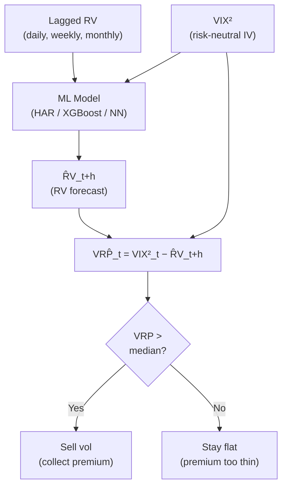

# The Variance Risk Premium

> **Application:** Why This Chapter Matters
>
> The variance risk premium links implied volatility ([Chapter 8](ch08-options-vol-surface.md)) to realized volatility ([Chapter 2](ch02-realized-volatility.md)).
> It predicts equity returns (Bollerslev, Tauchen, and Zhou, 2009), forecasts future realized vol through mean reversion, and is a direct trading signal (Project 5: VRP ML trader).
> VRP features appear in virtually every competitive feature set ([Chapter 10](ch10-feature-engineering.md)).

## What Is the Variance Risk Premium?

[Chapter 8](ch08-options-vol-surface.md) showed that VIX systematically overstates future realized volatility: the options market charges more for volatility exposure than what actually materializes.
This chapter names that gap, measures it, and explains why it exists and what it predicts.

Start with the intuition.
Imagine you own a house and buy fire insurance.
You pay $1{,}200$ per year in premiums, but the expected fire loss (probability of fire times damage) is only $400.
The $800 gap is the insurance premium: compensation the insurer earns for bearing your tail risk.

The variance risk premium is the same concept applied to volatility.
Options sellers are the "insurers" of the stock market.
They sell downside protection (puts) and volatility exposure (straddles) to hedgers and speculators.
In return, they earn a premium: the gap between what the options market prices in and what actually happens.

> **Intuition:** VRP = Volatility Insurance Premium
>
> VRP is the insurance premium the market charges for bearing volatility risk.
> Options sellers earn it; options buyers pay it.
> When VRP is large, the market is charging a steep price for protection, just as hurricane insurance premiums spike during storm season.

> **Prereq:** Risk-Neutral ($\mathbb{Q}$) vs. Physical ($\mathbb{P}$) Probability Measures
>
> Two probability measures appear throughout this chapter:
>
> - The **physical measure** $\mathbb{P}$ describes the actual frequencies of outcomes in the real world. If you simulate the S&P 500 forward under $\mathbb{P}$, your simulated returns match the historical distribution (including its mean, fat tails, and skew).
> - The **risk-neutral measure** $\mathbb{Q}$ is a mathematical reweighting of $\mathbb{P}$ that makes asset pricing consistent with no-arbitrage. Under $\mathbb{Q}$, bad outcomes (crashes, spikes in volatility) receive higher weight than under $\mathbb{P}$ because investors demand compensation for bearing those risks.
>
> Option prices reflect $\mathbb{Q}$-expectations, not $\mathbb{P}$-expectations.
> VIX is a $\mathbb{Q}$-measure of expected variance.
> Realized volatility is observed under $\mathbb{P}$.
> The VRP is the difference between the two.

Now the formal definition.
The variance risk premium at time $t$ is the difference between the risk-neutral expected variance (what the options market prices) and the physical expected variance (what actually tends to happen) over a horizon $h$ (typically 30 calendar days):

> **Definition:** Variance Risk Premium
>
> $$\operatorname{VRP}_t = \mathbb{E}^{\mathbb{Q}}_t\!\left[\operatorname{RV}_{t,t+h}\right] - \mathbb{E}^{\mathbb{P}}_t\!\left[\operatorname{RV}_{t,t+h}\right]$$
>
> - $\operatorname{VRP}_t$: the variance risk premium at time $t$.
> - $\mathbb{E}^{\mathbb{Q}}_t[\cdot]$: the risk-neutral (options-market-implied) expectation, conditional on information at time $t$.
> - $\mathbb{E}^{\mathbb{P}}_t[\cdot]$: the physical (real-world) expectation, conditional on information at time $t$.
> - $\operatorname{RV}_{t,t+h}$: realized variance over the period from $t$ to $t+h$ (defined in [Chapter 2](ch02-realized-volatility.md)).
> - $h$: the forecast horizon, typically 30 calendar days (${\sim}22$ trading days) to match VIX.

> **Project Connection:** Why This Matters
>
> This equation is the foundation of VRP-based trading strategies. If your ML model produces a better forecast of $\mathbb{E}^{\mathbb{P}}_t[\operatorname{RV}_{t,t+h}]$ than backward-looking RV or a simple HAR model, then your VRP estimate is sharper. A sharper VRP estimate means you can identify when the options market is genuinely overpricing protection versus when the premium is fair, which is the core edge in any vol-trading strategy built on your RV forecast.

In practice, neither expectation is directly observed.
You need proxies for each:

> **Definition:** Operationalized VRP
>
> The standard operational measure of VRP is:
>
> $$\widehat{\operatorname{VRP}}_t = \underbrace{\left(\frac{\text{VIX}_t}{100}\right)^2}_{\text{proxy for } \mathbb{E}^{\mathbb{Q}}_t[\operatorname{RV}_{t,t+h}]} - \underbrace{\hat{\operatorname{RV}}^{\mathbb{P}}_{t,t+h}}_{\text{proxy for } \mathbb{E}^{\mathbb{P}}_t[\operatorname{RV}_{t,t+h}]}$$
>
> - $(\text{VIX}_t / 100)^2$: VIX squared (converted from percentage points to decimal), which equals the model-free risk-neutral expected variance over 30 days (Section on VIX in [Chapter 8](ch08-options-vol-surface.md)).
> - $\hat{\operatorname{RV}}^{\mathbb{P}}_{t,t+h}$: a physical-measure forecast of future realized variance. Common choices:
>   - Backward-looking RV: use $\operatorname{RV}_{t-h,t}$ (the past 30 days' realized variance) as a naive forecast.
>   - HAR forecast: use the HAR model ([Chapter 6](ch06-har-model.md)) to produce $\hat{\operatorname{RV}}_{t+h}$, a more sophisticated forecast.
> - $\widehat{\operatorname{VRP}}_t > 0$: implied variance exceeds expected realized variance (normal; VRP is positive on average).
> - $\widehat{\operatorname{VRP}}_t < 0$: rare, but occurs when realized vol spikes above what was priced in (e.g., crash events).

> **Intuition:** In Plain English
>
> This equation says: take what the options market thinks volatility will be (VIX squared), subtract what you think volatility will actually be (your RV forecast), and the gap is the variance risk premium. It is the price tag on fear. The better your RV forecast on the right-hand side, the more accurately you measure how much the market is overpaying for protection.

> **Project Connection:** Why This Matters
>
> This is the equation you will compute every day in a VRP trading strategy. Your ML model replaces the naive backward-looking RV with a more accurate $\hat{\operatorname{RV}}^{\mathbb{P}}_{t+h}$, producing a cleaner VRP signal. A HAR or XGBoost forecast that improves QLIKE by 5--10% does not just make your RV number better in isolation; it sharpens the VRP estimate that drives every downstream trading decision.

> **Warning:** Ex-Ante vs. Ex-Post VRP
>
> Two variants appear in the literature and they measure different things:
>
> - **Ex-ante VRP**: $\text{VIX}^2_t - \hat{\operatorname{RV}}^{\mathbb{P}}_{t,t+h}$, where $\hat{\operatorname{RV}}$ is a *forecast* of future variance (e.g., from HAR). This is available in real time and can be used as a trading signal.
> - **Ex-post VRP**: $\text{VIX}^2_t - \operatorname{RV}_{t,t+h}$, where $\operatorname{RV}_{t,t+h}$ is the *actual* realized variance over the next 30 days. This is only known after the fact and cannot be used for trading.
>
> Bollerslev, Tauchen, and Zhou (2009) use the ex-ante version with backward-looking RV.
> Bekaert and Hoerova (2014) show that the choice of $\mathbb{P}$-measure proxy matters for return predictability.
> Always state which version you are using.

## Why VRP Exists

The previous section showed that VRP is positive on average: VIX-squared systematically exceeds realized variance.
Why?
If markets were risk-neutral (if investors did not care about risk), then $\mathbb{Q} = \mathbb{P}$ and VRP would be zero.
But investors are risk-averse, and that risk aversion creates the premium.

Three forces contribute:

### Risk Aversion and Downside Protection Demand

Risk-averse investors are willing to overpay for insurance against large losses.
Pension funds, endowments, and portfolio managers routinely buy put options and volatility protection even though these instruments lose money on average.
They accept this negative expected return because the protection pays off precisely when their portfolios suffer most.

This is not irrational.
A 40% drawdown can trigger margin calls, force liquidation, or violate regulatory capital requirements.
The cost of ruin is asymmetric: a dollar lost in a crash is more painful than a dollar gained in calm markets.
Paying a small insurance premium to avoid catastrophic outcomes is rational for constrained investors, even if the premium exceeds the actuarial cost.

### The Insurance Analogy, Formalized

Return to the fire insurance example.
The homeowner pays $1{,}200$/year for a policy with an expected loss of $400.
The insurer earns the $800 difference.
But the insurer also bears the risk of correlated claims (a wildfire that burns an entire neighborhood).
The premium compensates for this systematic, non-diversifiable risk.

In the options market:

- Hedgers (pension funds, portfolio managers) are the homeowners buying protection.
- Options sellers (market makers, hedge funds) are the insurers collecting the premium.
- The VRP is the $800 gap: compensation for bearing volatility risk, especially in its most extreme (crash) form.

### Equilibrium Account: Long-Run Risk

Drechsler and Yaron (2011) provide a formal equilibrium explanation.
In their model, the representative agent has *Epstein-Zin preferences* (a generalization of standard utility that separates risk aversion from the willingness to substitute consumption over time).
Uncertainty about future economic growth fluctuates over time: there are periods when the economy's growth rate is predictable and periods when it is not.
This "volatility of volatility" in the real economy generates a variance risk premium in asset markets.

> **Key Idea:** Why VRP Is Positive
>
> VRP exists because:
>
> 1. **Risk aversion**: investors overpay for crash protection relative to its actuarial value.
> 2. **Non-diversifiable risk**: volatility spikes coincide with market crashes, making volatility risk systematic (not diversifiable away).
> 3. **Uncertainty about uncertainty**: in equilibrium models like Drechsler and Yaron (2011), time-varying economic uncertainty generates a positive VRP.
>
> The premium is not a market inefficiency. It is rational compensation for bearing a risk that hurts most when it materializes.

## VRP Predicts Returns

The VRP is not just an insurance premium that options sellers passively collect.
It actively predicts future equity returns.
This is the central empirical finding of Bollerslev, Tauchen, and Zhou (2009).

The logic: when VRP is high, the market is demanding steep compensation for bearing volatility risk.
This signals elevated risk aversion or heightened uncertainty.
Assets priced under high risk aversion offer higher expected returns as compensation.
When VRP is low, the market is complacent, and expected returns are lower.

> **Key Result:** Bollerslev, Tauchen, and Zhou (2009): VRP Predicts Quarterly Equity Returns
>
> Bollerslev, Tauchen, and Zhou (2009) regress future quarterly S&P 500 excess returns on the ex-ante VRP and find:
>
> - The VRP coefficient is positive and statistically significant: higher VRP today predicts higher equity returns over the next quarter.
> - A one-standard-deviation increase in VRP predicts higher quarterly excess returns.
> - Using simple backward-looking RV, the $R^2$ for quarterly return prediction is about 4%; using a HAR-based expected variance proxy, $R^2$ exceeds 15%, substantially exceeding the dividend yield and other popular predictors at the quarterly horizon.
> - The predictability is concentrated at the quarterly (3--6 month) horizon and fades at longer horizons.
>
> They operationalize VRP in two ways: a simple version using $\text{VIX}^2_t - \operatorname{RV}_{t-22,t}$ (backward-looking monthly RV), and an expected variance premium using a HAR-RV forecast as the $\mathbb{P}$-measure proxy.

> **Warning:** VRP Is Not a Timing Tool
>
> VRP predicts returns in a statistical, population-average sense.
> Even the best specification ($R^2 \approx 15\%$) leaves 85% of quarterly return variation unexplained.
> A high VRP does *not* guarantee positive returns in any single quarter.
> Furthermore, VRP is highest during crises, precisely when portfolio constraints and drawdown pain are most severe.
> Trading on VRP requires the ability and willingness to take risk when it feels worst.

## VRP Predicts Future Volatility

VRP is not only a return predictor; it also contains information about future realized volatility.
The mechanism is mean reversion.

When VRP is large (implied far above realized), two things tend to happen:

1. Realized volatility rises toward implied. The options market is pricing in higher future vol for a reason: upcoming risk events, deteriorating conditions, or elevated uncertainty. Realized vol tends to catch up.
2. Implied volatility falls toward realized. As the risk event passes or uncertainty resolves, the fear premium deflates.

The net effect is convergence: the gap closes from both sides, but with realized vol doing more of the adjustment.

> **Key Idea:** VRP as a Dual-Purpose Feature
>
> VRP is a dual-purpose signal:
>
> - As a **return predictor**: high VRP $\Rightarrow$ higher expected future equity returns (Bollerslev, Tauchen, and Zhou, 2009).
> - As a **volatility predictor**: high VRP $\Rightarrow$ realized vol tends to rise toward implied vol (mean reversion of the gap).
>
> This makes VRP a natural feature for both return-forecasting and volatility-forecasting ML models ([Chapter 10](ch10-feature-engineering.md)).

The mean-reversion channel also explains a practical finding from volatility forecasting: including VIX (or VIX-squared) alongside lagged RV in a HAR-type model ([Chapter 6](ch06-har-model.md)) improves out-of-sample forecasts.
VIX carries forward-looking information that backward-looking RV alone does not capture.
The VRP quantifies how much extra forward-looking information VIX contributes beyond what lagged RV already tells you.

## Decomposing VRP

The headline VRP is a single number, but it mixes together different sources of risk.
Two decompositions from the literature isolate the components.

### Uncertainty vs. Risk Aversion

Bekaert and Hoerova (2014) decompose the VIX-squared into two pieces:

$$\text{VIX}^2_t = \underbrace{\mathbb{E}^{\mathbb{P}}_t[\operatorname{RV}_{t,t+h}]}_{\text{expected variance}} + \underbrace{\operatorname{VRP}_t}_{\text{variance risk premium}}$$

This is just a rearrangement of the theoretical VRP definition, but the key insight is in how each component behaves:

- $\mathbb{E}^{\mathbb{P}}_t[\operatorname{RV}_{t,t+h}]$: the **expected variance** component, which captures physical uncertainty about future returns. When economic conditions deteriorate, this rises.
- $\operatorname{VRP}_t$: the **risk premium** component, which captures the market's risk aversion and demand for protection. When fear rises faster than objective uncertainty, this rises.

> **Intuition:** In Plain English
>
> When VIX is high, this decomposition asks: is VIX high because the world is genuinely risky right now (the expected variance piece), or because investors are unusually scared and demanding extra compensation for bearing that risk (the VRP piece)? The same VIX level can mean very different things depending on which component is driving it. Separating the two tells you whether the market is pricing objective danger or subjective fear.

> **Project Connection:** Why This Matters
>
> This decomposition directly affects your feature engineering. If you include raw VIX-squared as a feature in your RV forecasting model, you are mixing two signals: one that reflects genuine future risk (useful for forecasting RV) and one that reflects risk aversion (useful for forecasting returns, not RV). By decomposing VIX-squared using your HAR or ML forecast as the $\mathbb{P}$-measure proxy, you can feed the separated components as distinct features, potentially improving forecast accuracy by letting the model weight objective uncertainty and fear independently.

> **Key Result:** Bekaert and Hoerova (2014): Return Predictability Lives in the VRP Component
>
> Bekaert and Hoerova (2014) find that:
>
> - The VRP component significantly predicts future equity returns (consistent with Bollerslev, Tauchen, and Zhou, 2009).
> - The expected-variance component does *not* predict returns. High objective uncertainty alone does not imply high future returns; it is the risk-aversion markup that carries the signal.
> - The expected-variance component predicts future realized volatility (naturally, since it is a forecast of RV).
> - Different $\mathbb{P}$-measure proxies (backward-looking RV, GARCH forecasts, HAR forecasts) yield materially different VRP estimates and different predictive power. The choice of proxy is not innocuous.

### Normal-Times vs. Jump-Tail VRP

Bollerslev and Todorov (2015) decompose the VRP along a different dimension: the portion attributable to "normal" continuous fluctuations vs. the portion attributable to rare, large jumps (tail events).

> **Definition:** Normal vs. Tail VRP (Bollerslev and Todorov, 2015)
>
> $$\operatorname{VRP}_t = \underbrace{\operatorname{VRP}^{\text{diffusive}}_t}_{\text{normal-times premium}} + \underbrace{\operatorname{VRP}^{\text{tail}}_t}_{\text{jump-tail premium}}$$
>
> - $\operatorname{VRP}^{\text{diffusive}}_t$: the premium for bearing day-to-day, continuous variance risk. This component is relatively stable and modest.
> - $\operatorname{VRP}^{\text{tail}}_t$: the premium for bearing rare, large-jump risk (crashes). This component is highly time-varying and spikes during stress.

Bollerslev and Todorov (2015) find that the tail component drives most of the time-variation in the aggregate VRP.
During calm markets, the tail premium is small and the overall VRP is moderate.
During crises, the tail premium explodes, reflecting the market's intense fear of further crashes.

> **Key Idea:** Most of VRP Is About Crash Fear
>
> The variance risk premium is not primarily about day-to-day fluctuations.
> It is mostly compensation for tail risk: the possibility of rare, catastrophic moves.
> This aligns with the demand-side story: what investors are really willing to overpay for is crash protection, not protection against ordinary volatility.

> **Project Connection:** Why This Matters
>
> This decomposition connects directly to jump detection from [Chapter 4](ch04-jumps-continuous-variation.md). The bipower variation and jump test statistics you computed there separate realized variance into continuous and jump components. The same separation applied to the risk premium side tells you whether the market is overpricing jump risk or diffusive risk. If your ML model can forecast the jump component of RV better than the continuous component (or vice versa), you know which piece of the VRP you are best positioned to harvest. A model that excels at predicting jump arrivals would target the tail VRP; a model that excels at forecasting the smooth diffusive component would target the normal-times VRP.

## The Gamma P&L Formula: From Forecast to Money

> **Prereq:** Required Background
>
> This section requires delta and gamma from [Chapter 8](ch08-options-vol-surface.md) (the Black--Scholes section), variance swap strike mechanics (the variance swap section of this guide), and the VRP definition (the definition section earlier in this chapter).

You have built an ML model that forecasts RV more accurately than the options market implies.
How much money does that improved forecast generate?
This section derives the exact formula linking forecast accuracy to trading profit.

### Setup: Delta-Hedged Option P&L

Consider a trader who buys an option at implied vol $\sigma_i$ and delta-hedges continuously.
Each day, the option's value changes due to two effects: (a) the delta-hedged P&L from the stock's realized move, and (b) time decay (theta).
Because the trader maintains a delta-neutral position, the first-order stock exposure cancels.
What remains is the second-order (gamma) exposure to realized moves versus the cost of carrying that exposure (theta).

### Derivation from the Black--Scholes PDE

The starting point is the Black--Scholes PDE, which describes the equilibrium between time decay and gamma exposure when volatility equals the implied level. This equation governs the "fair cost" of holding a delta-hedged option:

$$\Theta + \frac{1}{2}\Gamma S^2 \sigma_i^2 = rV$$

- $\Theta$: theta, the option's time decay (dollars lost per day from the passage of time).
- $\Gamma$: gamma, the option's second-order sensitivity to the stock price.
- $S$: current stock price.
- $\sigma_i$: implied volatility (the market's priced-in vol).
- $r$: risk-free rate; $V$: option value.

For a delta-hedged book, the stock component nets out, leaving theta as the "cost of gamma."

In reality, the stock moves with realized volatility $\sigma_r$, not implied volatility $\sigma_i$.
The actual P&L per infinitesimal time step for a delta-hedged long option position is:

$$d(\text{P\&L}) = \frac{1}{2}\Gamma S^2 \bigl(r_t^2 - \sigma_i^2\,dt\bigr)$$

- $r_t$: the log-return over the interval $dt$.
- $r_t^2$: the realized variance contribution for that period.
- $\sigma_i^2\,dt$: the implied variance "charged" by the market over the same period.

Over the full life of the option, the cumulative hedging P&L is:

$$\text{Total P\&L} = \sum_{t=1}^{N} \frac{1}{2}\Gamma_t S_t^2 \bigl(\sigma_{r,t}^2 - \sigma_i^2\bigr)\,\Delta t$$

- $N$: total number of hedging intervals over the option's life.
- $\Gamma_t, S_t$: gamma and stock price at each rebalance, which change as the stock moves.
- $\sigma_{r,t}^2$: realized variance in interval $t$; $\sigma_i^2$: the constant implied variance you paid for.

> **Intuition:** In Plain English
>
> The Black--Scholes PDE tells you what an option is "worth" if the stock moves exactly at implied vol. The daily and cumulative P&L equations capture what happens when reality disagrees with the market's assumption. Each day, you earn the difference between what the stock actually did ($r_t^2$) and what the option charged you for ($\sigma_i^2\,dt$), scaled by your gamma exposure. Over the life of the option, these daily differences accumulate. If realized vol consistently exceeds implied, the long-gamma trader profits; if realized vol falls short, the short-gamma trader (vol seller) profits.

> **Project Connection:** Why This Matters
>
> These equations are the direct link between your RV forecast and dollars. If your ML model predicts that realized variance over the next 30 days will be 0.012 while the options market is pricing 0.018 (VIX-squared), the gamma P&L formula tells you exactly how much profit to expect from selling volatility: roughly $\frac{1}{2}\Gamma S^2 (0.018 - 0.012) T$. Every basis point of QLIKE improvement in your forecast translates into a more accurate estimate of this gap, which lets you size positions more precisely and avoid selling vol when the premium is not actually there.

For an at-the-money option where gamma remains roughly constant over the period, this simplifies to:

$$\text{P\&L} \approx \frac{1}{2}\Gamma S^2 \bigl(\text{RV}^2 - \text{IV}^2\bigr)\,T$$

where $\text{RV}^2$ and $\text{IV}^2$ are the annualized realized and implied variances, and $T$ is the time period in years.

> **Key Idea:** The Gamma P&L Formula
>
> The daily hedging P&L for a delta-hedged option position is:
>
> $$\text{Daily Hedging P\&L} = \frac{1}{2}\,\Gamma\,S^2\,\bigl(\sigma_{\text{realized}}^2 - \sigma_{\text{implied}}^2\bigr)\,\Delta t$$
>
> **Positive gamma** (long options) profits when realized vol exceeds implied vol.
> **Negative gamma** (short options) profits when realized vol is below implied vol.
> The VRP (IV $>$ RV on average) means selling gamma is systematically profitable: you collect theta that, on average, exceeds the realized moves you pay out.

*[Figure: Delta-Hedged Long Straddle P&L vs. Realized Vol. P&L is a convex function of realized volatility (in %). Break-even at IV = 18%. Long straddle buyer (solid blue) profits when RV > 18%; short straddle seller (dashed red) profits when RV < 18%. Green shaded region (RV < IV) is the typical VRP regime where the seller has edge. Parameters: $\Gamma = 0.04$, $S = 100$, $T = 30$ days. Since VRP is positive roughly 85% of the time, the seller has a statistical edge.]*

> **Intuition:** Renting a Magnifying Glass
>
> Think of gamma as renting a magnifying glass.
> Each day you earn the difference between what actually happened ($r_t^2$) and what you paid for ($\sigma_i^2\,dt$).
> On average, if your vol forecast is right and the market's is wrong, you accumulate profit proportional to the forecast error times your gamma exposure.
> The magnifying glass is expensive (theta), but on days when the stock moves more than expected, it amplifies your gains.

> **Warning:** Path Dependence: Gamma Is Not Constant
>
> Gamma is *not* constant.
> As the stock moves away from the strike, gamma falls.
> Two stock paths with identical 30-day realized vol can produce very different hedging P&L because gamma was high during the low-vol days and low during the high-vol days.
> This is why forecasting *when* vol occurs (intraday patterns, jump timing) matters, not just the average level.
> A model that predicts the same total RV but correctly identifies which days will be volatile is worth more than a model that gets only the level right.

> **Project Connection:** Why This Matters
>
> For your internship evaluation: a 5% QLIKE improvement in your RV forecast means you can identify days when the market misprices vol by more.
> In a vol-trading context, this translates to approximately 2--5 bps per unit of vega exposure per day (order of magnitude).
> The exact number depends on your gamma profile and hedging frequency.
> The vol-targeting section of [Chapter 17](ch17-applications-projects.md) quantifies this via a simpler mechanism (vol-targeting Sharpe ratio improvement).

## Vol-of-Vol

VIX measures the expected volatility of the S&P 500.
But VIX itself is volatile.
The "volatility of VIX" captures a distinct risk factor: uncertainty about the level of future uncertainty.

### VVIX: The Volatility of VIX

> **Prereq:** VIX as an Underlying
>
> [Chapter 8](ch08-options-vol-surface.md) defined VIX as the model-free implied volatility of the S&P 500 over 30 days.
> VIX itself is a traded index: there are options written on VIX (VIX options, traded at Cboe).
> You can apply the same model-free variance extraction method from [Chapter 8](ch08-options-vol-surface.md) to VIX options to get the implied volatility of VIX.
> This is VVIX.

> **Definition:** VVIX
>
> $\operatorname{VVIX}$ is the model-free implied volatility of VIX, computed from VIX options using the same methodology as VIX itself (Cboe Exchange, 2019).
>
> - VVIX is quoted in annualized percentage points (like VIX).
> - Typical range: 80--120 in calm markets, spiking to 150+ during stress.
> - Interpretation: VVIX = 100 means the options market prices VIX's annualized volatility at 100%.

The definition above says "same methodology as VIX," but what does that mean concretely?
Recall from [Chapter 8](ch08-options-vol-surface.md) that the VIX formula extracts model-free implied variance from a strip of out-of-the-money options.
VVIX applies this identical formula to *VIX options* rather than S&P 500 options.

To compute VVIX, you need two expiries of VIX options that bracket a 30-day horizon.
For each expiry $j \in \{1, 2\}$, compute the single-term implied variance:

$$\sigma_j^2 \;=\; \frac{2}{T_j}\sum_{i}\frac{\Delta K_i}{K_i^2}\,e^{R_j T_j}\,Q_j(K_i) \;-\; \frac{1}{T_j}\!\left(\frac{F_j}{K_{0,j}} - 1\right)^{\!2},$$

where:

- $T_j$: time to expiration of the $j$-th VIX option series (in years).
- $K_i$: strike price of the $i$-th out-of-the-money VIX option (calls for $K_i > K_{0,j}$, puts for $K_i < K_{0,j}$, both at $K_{0,j}$).
- $\Delta K_i$: half the distance between the strikes on either side of $K_i$.
- $Q_j(K_i)$: midpoint of the bid-ask spread of the VIX option at strike $K_i$.
- $F_j$: forward VIX level implied by put-call parity: $F_j = K_{\text{ATM}} + e^{R_j T_j}(C_{\text{ATM}} - P_{\text{ATM}})$.
- $K_{0,j}$: first strike at or below $F_j$.
- $R_j$: risk-free rate to expiry $j$.

Then interpolate to a constant 30-day maturity:

$$\text{VVIX} = 100 \times \sqrt{\left[ T_1\,\sigma_1^2\,\frac{N_{T_2} - N_{30}}{N_{T_2} - N_{T_1}} + T_2\,\sigma_2^2\,\frac{N_{30} - N_{T_1}}{N_{T_2} - N_{T_1}} \right] \times \frac{N_{365}}{N_{30}}},$$

where $N_{T_j}$ is the number of minutes to expiry $j$, $N_{30} = 43{,}200$ (minutes in 30 days), and $N_{365} = 525{,}600$ (minutes in 365 days).

> **Intuition:** In Plain English
>
> The VVIX formula is *exactly* the VIX formula with one substitution: instead of feeding in S&P 500 option prices, you feed in VIX option prices.
> The first term in the single-term formula sums up the prices of all out-of-the-money VIX options, weighted inversely by the square of their strikes, to extract the market's expectation of VIX's variance.
> The subtraction term corrects for the fact that the at-the-money strike $K_{0,j}$ may not exactly equal the forward $F_j$.
> The interpolation blends the near-term and next-term results to produce a constant 30-day measure, ensuring VVIX is always comparable across dates regardless of the options expiry calendar.

> **Project Connection:** Why This Matters
>
> You do not need to compute VVIX yourself -- Cboe publishes it daily.
> But understanding the formula matters because it reveals what VVIX captures: the cost of insuring against VIX moves, aggregated across all strikes.
> When VVIX is high, the market expects VIX to swing violently, which predicts fatter tails in realized volatility changes.
> Include VVIX as a feature column for RV forecasting at horizons of 1--5 days, where its predictive power is strongest.

### Realized Vol-of-Vol

You can also compute a backward-looking measure: the realized volatility of the VIX time series itself.
This is constructed exactly like RV from [Chapter 2](ch02-realized-volatility.md), but applied to VIX returns rather than S&P 500 returns:

$$\operatorname{RV}^{\text{VIX}}_t = \sum_{i=1}^{n} (\Delta \ln \text{VIX}_{t,i})^2$$

- $\Delta \ln \text{VIX}_{t,i}$: the $i$-th intraday log return of VIX on day $t$.
- This measures how much VIX itself fluctuated within the day.

> **Intuition:** In Plain English
>
> This equation applies the same realized variance recipe from [Chapter 2](ch02-realized-volatility.md) but to VIX returns instead of stock returns. It answers the question: how unstable is the market's fear gauge today? A high $\operatorname{RV}^{\text{VIX}}_t$ means the options market's expectations are whipping around within the day, even if the closing VIX level looks calm. Two days with VIX at 20 can feel very different if one had VIX bouncing between 18 and 22 intraday while the other sat still.

> **Project Connection:** Why This Matters
>
> Realized vol-of-vol is a powerful feature for RV forecasting because it captures a dimension that lagged RV alone misses: the stability of the volatility regime. When $\operatorname{RV}^{\text{VIX}}_t$ is high, the market is uncertain about how volatile things will be, which often precedes volatility spikes. Adding vol-of-vol features to your HAR or ML model can improve QLIKE by capturing regime instability that standard lagged-RV features overlook. This connects to the VVIX-based features discussed in [Chapter 10](ch10-feature-engineering.md).

### Jumps in VIX

VIX is known for sudden spikes: it can double in a single day during a market crash.
These VIX jumps represent a distinct risk factor beyond the level of VIX.
A market with VIX at 20 that is stable is very different from a market with VIX at 20 that just fell from 40 (or is about to spike to 40).
The vol-of-vol measures capture this instability.

### Diagram: VIX vs. Realized Vol

*[Figure: VIX (implied) vs. subsequent 30-day realized volatility, 2004--2024 (schematic). Red line is VIX; blue line is realized vol. VIX sits above realized vol nearly everywhere -- the persistent gap is the VRP. The gap widens dramatically during GFC (2008, VIX ~80%, RV ~70%) and COVID (2020, VIX ~82%, RV ~75%). Green shaded region illustrates the VRP during a calm period (~2013, VRP ~4 percentage points). The gap narrows in calm periods but almost never flips negative for extended stretches.]*

The key visual pattern: the red line (VIX) sits above the blue line (realized vol) nearly everywhere.
The gap is the VRP.
It widens dramatically during crises and narrows during calm markets, but it almost never flips negative for extended periods.

Carr and Wu (2009) document that VIX exceeds subsequent realized vol roughly 85% of the time.
The 15% of months where realized vol exceeds VIX are concentrated in sudden-onset crises, when realized vol spikes before the options market fully adjusts.

## ML Approaches to VRP

The traditional VRP literature uses simple proxies (backward-looking RV, GARCH forecasts) for the $\mathbb{P}$-measure expectation.
ML methods can improve this proxy, and the VRP itself can serve as a feature or trading signal in ML pipelines.

### Improved $\mathbb{P}$-Measure Forecasts

Fouhy (2024) proposes a hierarchical XGBoost approach to the VRP pipeline:

1. **Stage 1**: Train an XGBoost model to forecast realized variance $\operatorname{RV}_{t+h}$ using lagged RV, HAR-style features, and additional predictors (macro indicators, sentiment, past VIX). This produces a high-quality $\hat{\operatorname{RV}}^{\mathbb{P}}_{t+h}$.
2. **Stage 2**: Compute VRP as $\text{VIX}^2_t - \hat{\operatorname{RV}}^{\mathbb{P}}_{t+h}$.
3. **Stage 3**: Use the VRP (and its components) as input features for a second-stage model that predicts returns or constructs a trading signal.

> **Key Idea:** The ML Angle on VRP
>
> ML enters the VRP framework in two places:
>
> - **Better $\mathbb{P}$-measure forecasts**: tree ensembles or neural networks can produce more accurate RV forecasts than HAR, yielding a cleaner VRP estimate (Fouhy, 2024).
> - **VRP as a feature**: VRP (and its decompositions) enters the feature set for downstream prediction tasks. [Chapter 10](ch10-feature-engineering.md) details how to engineer VRP-based features, and [Chapter 17](ch17-applications-projects.md) shows how to build a VRP-based trading strategy.

*The VRP trading pipeline. Your ML model forecasts realized variance (left path), which is compared to the options market's implied variance (VIX-squared) to compute the VRP signal. The signal drives the trading decision: sell volatility when the premium is rich, stay flat when it is thin.*

### VRP as a Trading Signal

The most direct use of VRP is as a signal for a delta-hedged volatility strategy.
The idea is simple:

- When VRP is high (implied $\gg$ realized): *sell* volatility (sell options, collect the premium). The options market is overpricing future vol, so you profit as realized vol comes in below implied.
- When VRP is low or negative (implied $\approx$ or $<$ realized): *buy* volatility or stay flat. The premium is thin or inverted, and the risk-reward of selling options is poor.

A concrete implementation: sell a 30-day delta-hedged straddle on the S&P 500 when the ex-ante VRP exceeds its trailing median, and flatten the position otherwise.
Delta-hedging removes directional exposure, so the trade profits or loses based purely on realized vs. implied variance.
This is Project 5 in [Chapter 17](ch17-applications-projects.md).

> **Warning:** Short Volatility Carries Tail Risk
>
> Selling volatility is the most reliable way to harvest the VRP, but it is inherently a strategy with negative skewness: small, frequent gains and rare, large losses.
> VRP harvesting strategies lost 20--40% in the October 2008 crash and the March 2020 COVID sell-off.
> ML-based regime detection ([Chapter 10](ch10-feature-engineering.md)) and position sizing are essential to manage this tail risk.

## Summary

- The **variance risk premium** (VRP) is the difference between risk-neutral expected variance ($\mathbb{Q}$, measured by VIX-squared) and physical expected variance ($\mathbb{P}$, measured by realized variance or a model-based forecast).

- VRP is **positive on average**: VIX overstates subsequent realized vol about 85% of the time (Carr and Wu, 2009). This gap is compensation for bearing volatility risk.

- The standard operational measure is $\widehat{\operatorname{VRP}}_t = (\text{VIX}_t/100)^2 - \hat{\operatorname{RV}}^{\mathbb{P}}_{t,t+h}$, where $\hat{\operatorname{RV}}$ is either backward-looking RV or a model forecast (e.g., HAR).

- **VRP exists** because of risk aversion, demand for crash protection, and equilibrium pricing of uncertainty about future growth (Drechsler and Yaron, 2011).

- **VRP predicts returns**: Bollerslev, Tauchen, and Zhou (2009) show that VRP predicts quarterly equity excess returns with $R^2$ of 4--15% (depending on the $\mathbb{P}$-measure proxy), beating the dividend yield as a return predictor.

- **VRP predicts volatility**: high VRP signals that realized vol will likely rise toward implied vol through mean reversion.

- **Decomposition 1** (Bekaert and Hoerova, 2014): VIX$^2$ = expected variance + VRP. Return predictability lives in the VRP component, not the expected-variance component.

- **Decomposition 2** (Bollerslev and Todorov, 2015): VRP = normal-times premium + jump-tail premium. Most time-variation in VRP comes from the tail component (crash fear).

- **VVIX** measures the implied volatility of VIX itself (vol-of-vol). It captures uncertainty about the future level of uncertainty, a distinct risk factor.

- **Realized vol-of-vol** is computed by applying the RV estimator from [Chapter 2](ch02-realized-volatility.md) to VIX returns. VIX jumps are a distinct risk factor beyond the VIX level.

- The persistent gap between VIX and realized vol is the visual signature of the VRP. It widens in crises and narrows in calm markets but rarely flips negative.

- **ML approaches** (Fouhy, 2024): tree ensembles can improve the $\mathbb{P}$-measure forecast, yielding a cleaner VRP estimate. VRP is also a powerful feature for downstream ML models ([Chapter 10](ch10-feature-engineering.md)).

- **VRP as a trading signal**: sell volatility when VRP is high, flatten when it is low. This is a direct, implementable strategy (Project 5, [Chapter 17](ch17-applications-projects.md)), but it carries significant tail risk.

- Ex-ante VRP (using a forecast for $\mathbb{P}$) is available in real time and can be traded. Ex-post VRP (using actual future RV) is only known after the fact. Always state which version you are using.

- The choice of $\mathbb{P}$-measure proxy (backward-looking RV, GARCH, HAR, XGBoost) materially affects VRP estimates and their predictive power (Bekaert and Hoerova, 2014).

## Key Results

| Paper | Result | Relevance |
|---|---|---|
| Bollerslev, Tauchen, and Zhou (2009) | VRP predicts quarterly equity excess returns with $R^2$ of 4--15% (depending on $\mathbb{P}$-proxy), beating the dividend yield. | Establishes VRP as a top return predictor; motivates its use as an ML feature. |
| Drechsler and Yaron (2011) | Long-run risk model with Epstein-Zin preferences generates a positive VRP in equilibrium through time-varying economic uncertainty. | Provides the theoretical foundation for why VRP exists. |
| Bekaert and Hoerova (2014) | Decompose VIX$^2$ into expected variance and VRP; return predictability resides in the VRP component, not in expected variance. | Clarifies that risk aversion, not objective uncertainty, drives return predictability. |
| Bollerslev and Todorov (2015) | Decompose VRP into normal-times and jump-tail components; the tail premium drives most time-variation. | Most of VRP is crash-fear compensation, not day-to-day variance risk. |
| Carr and Wu (2009) | Document that VIX exceeds subsequent realized vol ~85% of the time; provide a model-free framework for variance risk premia across assets. | Quantifies the frequency and magnitude of the VRP. |
| Fouhy (2024) | Hierarchical XGBoost for VIX-to-RV-to-VRP pipeline; ML-based $\mathbb{P}$-measure forecasts improve VRP estimation. | Connects VRP to ML methods used in [Chapter 10](ch10-feature-engineering.md) through [Chapter 17](ch17-applications-projects.md). |
