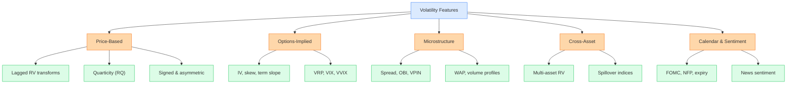
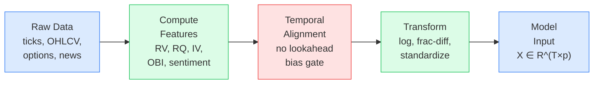

# Feature Engineering for Volatility

> **Application**
> This chapter is the bridge between volatility theory ([Ch1](ch01-returns-variance-volatility.md)--[Ch9](ch09-variance-risk-premium.md)) and ML modeling ([Ch11](ch11-tree-methods-vol.md)--[Ch13](ch13-hybrid-ensemble.md)).
> Every feature described here is a column in the input matrix that tree models, neural networks, and hybrid methods will consume.
> The feature set you choose matters more than the model you choose.
> Projects 1--5 all draw their inputs from this catalog.

We have spent nine chapters building a toolkit of volatility estimators, noise corrections, jump decompositions, parametric models, long-memory specifications, options-implied measures, and risk premia.
Now we pivot from *measuring* volatility to *predicting* it with machine learning.
The raw material for any ML model is its feature matrix $\mathbf{X} \in \mathbb{R}^{T \times p}$, where each row is a date and each column is a predictor.
This chapter catalogs the features that the literature and Kaggle competitions have found useful, organizes them into families, and flags the pitfalls that make or break a forecasting pipeline.

## Feature Taxonomy

Before diving into individual features, it helps to see the full landscape.
The figure below groups every feature family into five branches.
You do not need all of them for every project; the tree is a menu, not a checklist.

*Feature taxonomy for volatility forecasting. Price-based features (left) are available for any asset with intraday data. Options-implied features require a liquid derivatives market. Microstructure features need tick-level LOB data. Cross-asset and calendar/sentiment features supplement any core set.*

The figure below shows how raw market data flows through the feature engineering pipeline into the model.
Every feature must pass through the temporal alignment gate: it can only use data available at or before time $t$ to predict the target at time $t+1$.

*Feature engineering pipeline. Raw market data is processed into features, passed through a temporal alignment gate to prevent lookahead bias, transformed for stationarity, and assembled into the model input matrix $\mathbf{X}$. Features at time $t$ use only data $\leq t$.*

## Triple Expansion: Level, Change, Z-Score

Before cataloging individual features, we introduce a systematic expansion technique that applies to every continuous feature in the catalog.
For any base quantity $x_t$, construct three variants:

> **Definition: Triple Expansion**
>
> Given a continuous feature $x_t$ and a lookback window $w$ (typically 22 trading days), the **triple expansion** produces:
>
> $$x_t^{\text{level}} = x_t,$$
>
> $$x_t^{\text{change}} = x_t - x_{t-k}, \quad k \in \{1, 5\},$$
>
> $$x_t^{\text{z-score}} = \frac{x_t - \bar{x}_{t,w}}{\hat{\sigma}_{x,t,w}},$$
>
> where $\bar{x}_{t,w} = \frac{1}{w}\sum_{i=0}^{w-1} x_{t-i}$ is the trailing mean and $\hat{\sigma}_{x,t,w}$ is the trailing standard deviation over the same window.

- $x_t^{\text{level}}$: the raw value of the feature, capturing the current **state**.
- $x_t^{\text{change}}$: the first difference over $k$ periods, capturing **momentum** (is the feature rising or falling?).
- $x_t^{\text{z-score}}$: the standardized deviation from the recent mean, capturing **anomaly** (is the current value unusual?).

> **Intuition: In Plain English**
>
> Consider the bid-ask spread. Its level tells you how wide the spread is right now. Its change tells you whether the spread is widening (deteriorating liquidity) or narrowing (improving liquidity). Its z-score tells you whether today's spread is abnormally wide relative to its own recent history. A spread of 5 cents means very different things for a stock that typically trades at 3 cents (z-score $\approx 2$, alarm) versus one that typically trades at 6 cents (z-score $\approx -1$, calm). Each variant captures genuinely different information.

**Which features get expanded.**
The triple expansion applies to *continuous* features: RV, RQ, bid-ask spread, OBI, implied volatility, VRP, volume ratios, and any numeric quantity with a meaningful scale.
It does *not* apply to categorical or binary features such as FOMC dummies, day-of-week indicators, or earnings announcement flags.
These are already discrete and cannot be meaningfully z-scored.

**Multicollinearity: a non-issue for trees.**
In a linear regression, including level, change, and z-score of the same base feature would introduce severe multicollinearity (the three are highly correlated).
This would inflate standard errors and produce unstable coefficient estimates.
For tree-based models (random forests, gradient boosting), multicollinearity is harmless: trees select the most informative split at each node and are unaffected by correlated alternatives.
Neural networks are also largely robust to correlated inputs, especially with regularization.
The triple expansion is therefore a "free" way to enrich the feature set for non-linear models.

> **Project Connection: Why This Matters**
>
> Apply the triple expansion systematically to every continuous feature in your pipeline. This multiplies your feature count by roughly $3\times$ but gives tree models three distinct "views" of each quantity. In the vol-project-ref feature composition ([Ch8](ch08-options-vol-surface.md)), the triple expansion is identified as a core engineering principle: it captures state, direction, and unusualness in a single pass, and it is the primary reason feature counts grow from ${\sim}20$ base features to ${\sim}80$ model inputs.

## Lagged RV Transforms

The single most predictive feature for tomorrow's realized volatility is yesterday's realized volatility.
The HAR model ([Ch6](ch06-har-model.md)) already exploits this by using three horizons that smooth RV over different lookback windows:

$$\operatorname{RV}_t^{(d)} = \operatorname{RV}_t,$$

$$\operatorname{RV}_t^{(w)} = \frac{1}{5}\sum_{i=0}^{4} \operatorname{RV}_{t-i},$$

$$\operatorname{RV}_t^{(m)} = \frac{1}{22}\sum_{i=0}^{21} \operatorname{RV}_{t-i}.$$

- $\operatorname{RV}_t^{(d)}$: daily RV, the single most recent observation.
- $\operatorname{RV}_t^{(w)}$: weekly RV, the average of the past 5 trading days.
- $\operatorname{RV}_t^{(m)}$: monthly RV, the average of the past 22 trading days.

> **Intuition: In Plain English**
>
> These three features capture volatility at different "speeds." Daily RV tells you what happened today. Weekly RV smooths out day-to-day noise to reveal the recent trend. Monthly RV captures the slow-moving baseline level. By including all three, you give the model a short-term, medium-term, and long-term view of volatility, which is why HAR works so well despite being a simple linear model.

> **Project Connection: Why This Matters**
>
> These three features are the columns your HAR baseline consumes. Every ML model you build should include $\log \operatorname{RV}_t^{(d)}$, $\log \operatorname{RV}_t^{(w)}$, and $\log \operatorname{RV}_t^{(m)}$ as core inputs. The goal of fancier feature engineering is to add value on top of these, not to replace them. If an ML model cannot beat HAR using only these three features, the extra complexity is not justified.

These three variables alone explain roughly 40--60% of the variation in next-day log-RV for equity indices.
For ML models, you should include all three, but also consider the following transforms.

**Log-RV.** Working with $\log \operatorname{RV}_t$ rather than $\operatorname{RV}_t$ has two benefits:
- It stabilizes the variance of the target (variance of variance is highly skewed).
- It makes the distribution closer to Gaussian, which helps linear baselines and loss-function calibration.

Most HAR papers estimate the model in logs; you should do the same with your feature columns.

**Square-root RV.** An intermediate transform: $\sqrt{\operatorname{RV}_t}$ approximates realized *volatility* (standard deviation), which is more interpretable than variance and less compressed than log.

**Ratio features.** The ratio $\operatorname{RV}_t^{(d)} / \operatorname{RV}_t^{(m)}$ captures how today's volatility compares to its recent average.
Values above 1 indicate a local spike; values well below 1 indicate calm.
This is a simple but effective regime indicator.

## Realized Quarticity and the HARQ Feature

You learned in [Ch2](ch02-realized-volatility.md) that realized variance is a noisy estimator: its sampling error depends on the fourth moment of returns.
The realized quarticity (RQ) quantifies exactly this noise.

> **Definition: Realized Quarticity**
>
> Given $n$ intraday returns $r_{t,i}$ on day $t$,
>
> $$\operatorname{RQ}_t = \frac{n}{3} \sum_{i=1}^{n} r_{t,i}^4.$$
>
> Under standard diffusion assumptions, $\operatorname{RQ}_t \xrightarrow{p} \int_0^1 \sigma_s^4 \, ds$ as $n \to \infty$.

- $n$ is the number of intraday returns (e.g., 78 for 5-minute bars in a 6.5-hour session).
- $r_{t,i}^4$ is the fourth power of each intraday return; this heavily up-weights large moves.
- The factor $n/3$ provides the correct asymptotic scaling.

> **Intuition: In Plain English**
>
> Realized quarticity measures how "wild" the intraday price path was. By raising each return to the fourth power, extreme moves dominate the sum. A day with one large intraday swing followed by calm will have high RQ even if overall RV is moderate. In short, RQ tells you how much you should trust today's RV number: high RQ means the RV estimate is noisy and unreliable.

> **Project Connection: Why This Matters**
>
> Include $\sqrt{\operatorname{RQ}_t}$ as a standalone feature column. It serves double duty: (1) tree models can learn to split on it, effectively down-weighting noisy RV days the way HARQ does analytically, and (2) it provides a data-quality signal that no other feature captures. On days where RQ is elevated, your forecast should lean more on the stable weekly and monthly averages.

**Why RQ matters for feature engineering.**
The asymptotic variance of $\operatorname{RV}_t$ is proportional to $\operatorname{RQ}_t$.
When RQ is high, today's RV number is unreliable.
Bollerslev, Patton, and Quaedvlieg (2016) exploit this insight in the HARQ model: they interact the daily RV component with $\sqrt{\operatorname{RQ}_t}$, allowing the model to down-weight noisy days.

> **Key Idea: The HARQ Feature**
>
> In the HARQ model ([Ch6](ch06-har-model.md)), the coefficient on $\operatorname{RV}_t^{(d)}$ is made state-dependent:
>
> $$\beta_{d,t} = \beta_d + \beta_{dQ} \sqrt{\operatorname{RQ}_t}.$$
>
> The product $\operatorname{RV}_t^{(d)} \cdot \sqrt{\operatorname{RQ}_t}$ is itself a feature.
> When $\operatorname{RQ}_t$ is large, the interaction term pulls the effective weight on daily RV toward zero, letting the more stable weekly and monthly averages dominate the forecast.
> For ML models, include both $\operatorname{RV}_t^{(d)}$ and $\sqrt{\operatorname{RQ}_t}$ as separate columns; the tree or network can learn the interaction without you specifying it.

> **Project Connection: Why This Matters**
>
> The HARQ interaction feature is the single most important extension beyond baseline HAR for your project. Bollerslev, Patton, and Quaedvlieg (2016) show it improves QLIKE by 5--15% across equity indices. For your ML pipeline, you do not need to hard-code the interaction: include $\operatorname{RV}_t^{(d)}$, $\operatorname{RV}_t^{(w)}$, $\operatorname{RV}_t^{(m)}$, and $\sqrt{\operatorname{RQ}_t}$ as four separate columns and let gradient-boosted trees or neural networks discover the interaction automatically.

## Signed and Asymmetric Features

Volatility is not symmetric.
Negative returns drive future volatility up more than positive returns of the same magnitude (the leverage effect you met in [Ch5](ch05-garch-family.md)).
Several features capture this asymmetry directly from high-frequency data.

**Realized semivariances.**
To separate the contribution of upward and downward price moves to total volatility, we split intraday returns by sign:

$$\operatorname{RV}_t^+ = \sum_{i=1}^{n} r_{t,i}^2 \,\mathbf{1}(r_{t,i} > 0),$$

$$\operatorname{RV}_t^- = \sum_{i=1}^{n} r_{t,i}^2 \,\mathbf{1}(r_{t,i} < 0).$$

- $\operatorname{RV}_t^+$: realized semivariance from positive returns ("good volatility").
- $\operatorname{RV}_t^-$: realized semivariance from negative returns ("bad volatility").
- $\mathbf{1}(\cdot)$: indicator function selecting returns of the specified sign.

> **Intuition: In Plain English**
>
> Total RV treats a 2% up-move and a 2% down-move identically. Semivariances break this symmetry. $\operatorname{RV}^-$ isolates the volatility coming from declines, which is the part that matters most for risk management and future vol prediction. $\operatorname{RV}^+$ captures the "calm" upside moves. Keeping them separate lets a model learn that a day dominated by selling pressure has different forecasting implications than a day dominated by buying.

> **Project Connection: Why This Matters**
>
> Include $\operatorname{RV}_t^-$ and $\operatorname{RV}_t^+$ (and their weekly/monthly averages) as separate feature columns. The SHAR baseline already uses them, so your ML model needs them to at least match SHAR performance. Empirically, $\operatorname{RV}_t^-$ carries roughly twice the predictive weight of $\operatorname{RV}_t^+$, so if you must prune features, keep $\operatorname{RV}_t^-$ and drop $\operatorname{RV}_t^+$ before dropping other features.

By construction, $\operatorname{RV}_t = \operatorname{RV}_t^+ + \operatorname{RV}_t^-$ (ignoring zero returns).
The SHAR model in [Ch6](ch06-har-model.md) uses $\operatorname{RV}_t^+$ and $\operatorname{RV}_t^-$ as separate regressors, allowing different persistence for up-moves and down-moves.

> **Key Result: Patton and Sheppard (2015)**
>
> Replacing total RV with the signed pair $(\operatorname{RV}_t^+, \operatorname{RV}_t^-)$ in the HAR framework reduces out-of-sample QLIKE loss by 3--8% for equity index volatility.
> The coefficient on $\operatorname{RV}_t^-$ is roughly twice that on $\operatorname{RV}_t^+$, confirming the leverage effect at intraday frequency.

**Signed jumps.**
From [Ch4](ch04-jumps-continuous-variation.md), the jump component is $J_t = \max(\operatorname{RV}_t - \operatorname{BPV}_t, 0)$.
You can further decompose:

$$J_t^+ = \sum_{i} r_{t,i}^2 \,\mathbf{1}(r_{t,i} > 0,\; |r_{t,i}| > \theta_t), \qquad J_t^- = \sum_{i} r_{t,i}^2 \,\mathbf{1}(r_{t,i} < 0,\; |r_{t,i}| > \theta_t),$$

where $\theta_t$ is an intraday jump threshold (e.g., from Lee-Mykland, [Ch4](ch04-jumps-continuous-variation.md)).

- $J_t^+$: squared returns from large positive moves exceeding the jump threshold.
- $J_t^-$: squared returns from large negative moves exceeding the jump threshold.
- $\theta_t$: intraday threshold distinguishing jumps from continuous price variation.

> **Intuition: In Plain English**
>
> Signed jumps isolate the extreme tail events and ask: did the big intraday moves come from sudden rallies or sudden crashes? A day dominated by negative jumps (a flash crash, a surprise rate hike) behaves very differently from a day dominated by positive jumps (a short squeeze, a surprise earnings beat). Splitting jumps by sign gives the model a finer-grained view of tail risk than total jump variation alone.

> **Project Connection: Why This Matters**
>
> Add $J_t^-$ as a feature column. Negative jumps are substantially more predictive of future volatility than positive jumps. In HAR-CJ extensions, including $J_t^-$ separately improves QLIKE by 1--3%. For your ML model, this asymmetric jump signal complements the semivariance features and is especially valuable during turbulent periods when jump activity clusters.

**Realized semicovariances.**
Bollerslev, Li, Patton, and Quaedvlieg (2020) extend semivariances to the multivariate case, computing covariances conditional on the sign of the market return.
For single-asset forecasting, the key insight is that the downside component of any cross-asset covariance feature ([Ch14](ch14-multivariate-volatility.md)) carries more information than the upside component.

> **Intuition: Why negatives matter more**
>
> When prices fall, leveraged investors face margin calls, hedging demand spikes, and correlations rise.
> The mechanism is mechanical, not behavioral: a short gamma position that loses money forces the holder to sell more, amplifying volatility.
> Features that isolate this downside channel capture a structural driver, not a statistical accident.

> **Project Connection: Why This Matters**
>
> The asymmetry between positive and negative moves is one of the strongest and most robust findings in the volatility literature. For your project, always compute signed versions of your features: $\operatorname{RV}_t^-$ vs. $\operatorname{RV}_t^+$, $J_t^-$ vs. $J_t^+$, and (if using multivariate features) downside semicovariances. This costs you nothing in terms of data requirements but gives tree models a clean split variable to identify leverage-effect regimes.

## Higher Moments

Realized skewness and kurtosis measure the shape of the intraday return distribution. They are computed from higher powers of intraday returns:

$$\operatorname{RSkew}_t = \frac{\frac{1}{n}\sum_{i=1}^{n} r_{t,i}^3}{\left(\frac{1}{n}\sum_{i=1}^{n} r_{t,i}^2\right)^{3/2}},$$

$$\operatorname{RKurt}_t = \frac{\frac{1}{n}\sum_{i=1}^{n} r_{t,i}^4}{\left(\frac{1}{n}\sum_{i=1}^{n} r_{t,i}^2\right)^{2}}.$$

- $\operatorname{RSkew}_t$: realized skewness, measuring asymmetry of intraday returns (negative = more large down-moves).
- $\operatorname{RKurt}_t$: realized kurtosis, measuring tail heaviness (higher = more extreme moves relative to typical).
- Both are normalized by powers of RV so they are scale-free.

> **Intuition: In Plain English**
>
> Realized skewness tells you whether today's intraday price action was lopsided: a very negative value means the big moves were predominantly downward. Realized kurtosis tells you whether the price path had fat tails: a high value means there were extreme intraday swings relative to the typical move size. Together they describe the "shape" of intraday price behavior beyond just its level (RV) and sign (semivariances).

> **Project Connection: Why This Matters**
>
> Include realized skewness and kurtosis in your initial feature set, but expect them to rank low in importance. Their main value is as regime-conditioning variables: when realized skewness is very negative, the model may learn that volatility persistence changes. Tree models can use them as split variables to identify stress regimes even if their linear predictive power is weak.

> **Warning: Modest Predictive Power**
>
> Realized skewness and kurtosis are noisy estimators and have shown only modest incremental forecasting power for next-day RV in most studies.
> Include them in your initial feature set, but do not be surprised if tree-based importance scores rank them low.
> Their main use is as conditioning variables: when skewness is very negative, the volatility process may behave differently (regime-dependent dynamics).

## Microstructure and Limit Order Book Features

If you have tick-level or LOB snapshot data (common in Kaggle competitions like Optiver's Realized Volatility Prediction), you unlock a family of features that daily or 5-minute data cannot provide.

**Bid-ask spread.**
The quoted spread $s_t = p_t^{\text{ask}} - p_t^{\text{bid}}$ is a proxy for liquidity and informed-trading intensity.
Wider spreads predict higher near-term volatility.
Use the time-weighted average spread across the observation window.

**Order book imbalance (OBI).**
The balance of resting orders on each side of the book reveals directional pressure. OBI formalizes this:

$$\text{OBI}_t = \frac{V_t^{\text{bid}} - V_t^{\text{ask}}}{V_t^{\text{bid}} + V_t^{\text{ask}}},$$

- $V_t^{\text{bid}}$: total visible volume resting at the best bid price.
- $V_t^{\text{ask}}$: total visible volume resting at the best ask price.
- OBI ranges from $-1$ (all volume on the ask side) to $+1$ (all on the bid side).

> **Intuition: In Plain English**
>
> OBI measures who is more eager to trade. When there is much more volume resting on the bid side than the ask, buyers are providing liquidity and the price is likely to tick up (or at least not fall). When ask-side volume dominates, sellers are in control. Extreme imbalance in either direction signals one-sided pressure that tends to resolve through a price move, and price moves create volatility.

> **Project Connection: Why This Matters**
>
> If you are working with tick-level data (e.g., Optiver-style competitions or LOB snapshots), OBI is one of the strongest short-horizon features. Compute time-weighted OBI over your observation window and include it as a feature column. The absolute value $|\text{OBI}_t|$ is often more useful than signed OBI for volatility forecasting, since extreme imbalance in either direction predicts elevated vol.

**Weighted average price (WAP) log returns.**
The WAP blends bid and ask prices, weighting each side by the opposite side's depth to reflect where the "true" price likely sits:

$$\text{WAP}_t = \frac{p_t^{\text{bid}} \cdot V_t^{\text{ask}} + p_t^{\text{ask}} \cdot V_t^{\text{bid}}}{V_t^{\text{bid}} + V_t^{\text{ask}}}.$$

- $p_t^{\text{bid}}, p_t^{\text{ask}}$: best bid and ask prices.
- $V_t^{\text{bid}}, V_t^{\text{ask}}$: volume at the best bid and ask.
- The cross-weighting pulls WAP toward the side with less volume (where the next fill is more likely).

> **Intuition: In Plain English**
>
> The simple midprice treats both sides of the book equally, but if there are 10,000 shares on the bid and only 100 on the ask, the next trade is far more likely to happen at the ask. WAP accounts for this asymmetry by weighting each price by the opposite side's volume, pulling the estimated fair value toward the thinner side of the book. Returns computed from WAP are less contaminated by bid-ask bounce.

> **Project Connection: Why This Matters**
>
> When computing RV from LOB data, use WAP-based log returns rather than midprice returns as your raw input. This reduces microstructure noise at the source, before any noise-robust estimator is applied, giving you a cleaner RV target and cleaner lagged-RV features. Top Optiver competition solutions all used WAP returns for exactly this reason.

*[Figure: Limit order book snapshot with feature annotations. The spread is the gap between best bid and best ask. OBI compares bid volume (blue, left) to ask volume (red, right). In this snapshot, OBI is positive (more resting bid volume), suggesting net buying pressure.]*

**Price acceleration.**
Beyond first-order returns, the second difference of log-prices captures changes in momentum within the observation window:

$$a_{t,i} = \Delta \log(\text{WAP}_{t,i}) - \Delta \log(\text{WAP}_{t,i-1}).$$

- $\Delta \log(\text{WAP}_{t,i})$: the log return between consecutive WAP observations at times $i-1$ and $i$.
- $a_{t,i}$: the change in the log return, analogous to acceleration in physics.

> **Intuition: In Plain English**
>
> If the price was falling and then starts falling faster, that is negative acceleration. If the price was falling and then slows down, that is positive acceleration (deceleration). Aggregating the magnitude of these acceleration values over a window captures how "jerky" the price path is. A smooth trending market has low acceleration; a choppy market with rapid reversals has high acceleration. This jerkiness is a leading indicator of near-term volatility.

> **Project Connection: Why This Matters**
>
> For tick-level or LOB-based projects, include the standard deviation or sum of squared accelerations over the observation window as a feature column. This was one of the highest-importance features in top Optiver competition solutions. It captures information orthogonal to RV (which uses only first differences), providing the model with a signal about momentum instability that raw RV misses.

**Volume profiles.**
Aggregate volume into time buckets (e.g., 2-minute bins within a 10-minute window).
The ratio of volume in the last bucket to the first captures whether activity is accelerating or decelerating.
Volume acceleration tends to precede volatility spikes.

### VPIN and Kyle's Lambda

Two microstructure features capture the intensity of *informed trading* rather than just the state of the order book.
Both originate from market microstructure theory and measure how much private information is currently flowing into the market.

**VPIN (Volume-Synchronized Probability of Informed Trading).**
Standard time-based sampling mixes high-activity and low-activity periods.
Easley, Lopez de Prado, and O'Hara (2012) propose an alternative: partition the trading day into **volume buckets**, each containing the same total volume $V_{\text{bucket}}$.
Within each bucket, classify trades as buyer- or seller-initiated (typically using the tick rule or bulk volume classification), and compute the absolute imbalance.

The VPIN algorithm proceeds in three steps.
First, partition trades into $n$ equal-volume buckets, where each bucket contains exactly $V_{\text{bucket}} = V_{\text{day}} / n$ shares:

$$\text{VPIN}_t = \frac{1}{n} \sum_{\tau=1}^{n} \frac{|V_\tau^B - V_\tau^S|}{V_{\text{bucket}}},$$

- $V_\tau^B$: volume classified as buyer-initiated in bucket $\tau$.
- $V_\tau^S$: volume classified as seller-initiated in bucket $\tau$ ($V_\tau^B + V_\tau^S = V_{\text{bucket}}$).
- $n$: number of volume buckets per estimation window (typically 50).
- VPIN ranges from 0 (perfectly balanced flow) to 1 (completely one-sided flow).

> **Intuition: In Plain English**
>
> VPIN asks: "In each chunk of trading volume, how one-sided was the flow?"
> When informed traders are active, they trade aggressively on one side, creating persistent imbalances.
> Uninformed traders, by contrast, are roughly equally likely to buy or sell, so their flow approximately cancels out.
> High VPIN therefore signals that informed traders are dominating the flow, which tends to precede large price moves and elevated volatility.
> The key innovation is measuring in *volume time* rather than clock time: a bucket fills quickly during high-activity periods and slowly during calm periods, automatically adapting the sampling rate to market conditions.

> **Project Connection: Why This Matters**
>
> Include VPIN as a feature column if you have trade-level data with directional classification.
> Use $n = 50$ volume buckets per day as a starting point.
> VPIN is most valuable at the intraday and 1-day horizons, where it captures the arrival of informed order flow before it fully resolves into price moves.
> At longer horizons, VPIN's signal decays because the information has already been incorporated into prices.

**Kyle's lambda ($\lambda$): price impact per unit of order flow.**
Kyle (1985) shows that in a market with a single informed trader and competitive market makers, the equilibrium pricing rule is linear in aggregate order flow.
The slope of this relationship, **Kyle's lambda**, measures the market's **price impact** per unit of signed volume:

$$\Delta p_t = \alpha + \underbrace{\lambda}_{\text{price impact}} \cdot \underbrace{(\text{signed volume})_t}_{\text{buy vol} - \text{sell vol}} + \varepsilon_t.$$

- $\Delta p_t$: change in the midprice over interval $t$.
- $\lambda$: Kyle's lambda, the slope coefficient. A higher $\lambda$ means each unit of net order flow moves the price more (the market is less liquid or more informationally sensitive).
- Signed volume: the difference between buyer-initiated and seller-initiated volume (positive = net buying).

In practice, estimate $\lambda$ by regressing midprice changes on signed volume over a rolling window (e.g., 60 five-minute intervals):

$$\Delta p_{t,i} = \hat{\alpha} + \hat{\lambda}_t \cdot (V_{t,i}^B - V_{t,i}^S) + \hat{\varepsilon}_{t,i}, \qquad i = 1, \ldots, m,$$

where $m$ is the number of intraday intervals in the rolling window.

> **Intuition: In Plain English**
>
> Kyle's lambda answers: "How many basis points does the price move for every million dollars of net order flow?"
> When $\lambda$ is high, even modest buying or selling pressure moves prices substantially -- the market is "thin" or carrying a lot of private information.
> When $\lambda$ is low, the market can absorb large orders without significant price impact -- it is deep and liquid.
> Rising $\lambda$ predicts higher near-term volatility because it signals that order flow is becoming more informative (or the market is becoming less resilient), both of which lead to larger price swings.

> **Project Connection: Why This Matters**
>
> Estimate $\hat{\lambda}_t$ on a rolling 60-interval window using 5-minute data and include it as a feature column.
> $\hat{\lambda}_t$ captures a different dimension of market quality than the bid-ask spread: the spread measures the cost of a small trade, while $\lambda$ measures the cost of a *large* trade.
> During stress periods, $\lambda$ spikes before the spread widens, making it a leading indicator.
> For your project, the triple expansion of Kyle's lambda (level, change, z-score) provides three informative feature columns for tree models.

> **Warning: Microstructure features are asset-specific**
>
> Features like OBI and spread depend heavily on the market's microstructure (tick size, maker/taker fees, minimum lot sizes).
> A feature that works for liquid US equities may be meaningless for an illiquid commodity future.
> Always recalibrate when switching asset classes.

### Amihud Illiquidity Ratio

The features above (OBI, spread, WAP) require tick-level or LOB data.
The **Amihud illiquidity ratio** (Amihud, 2002) provides a liquidity measure that requires only daily returns and dollar volume -- data available for any traded asset.

> **Definition: Amihud Illiquidity**
>
> For stock $i$ on day $d$, the daily illiquidity ratio is the absolute return per dollar of trading volume:
>
> $$\text{ILLIQ}_{i,t} = \frac{1}{D_t}\sum_{d=1}^{D_t} \frac{|r_{i,d}|}{\text{DVOL}_{i,d}} \times 10^5,$$
>
> where:
> - $r_{i,d}$: the return of stock $i$ on day $d$.
> - $\text{DVOL}_{i,d}$: the dollar trading volume on day $d$ (price $\times$ shares traded).
> - $D_t$: the number of trading days in the averaging window (e.g., 22 for monthly).
> - The $10^5$ scaling factor prevents the ratio from being extremely small (returns of order $10^{-2}$ divided by volume of order $10^{6}$--$10^{9}$).

> **Intuition: In Plain English**
>
> The Amihud ratio answers a simple question: "How much does the price move per dollar of trading activity?"
> A liquid stock can absorb millions of dollars in trading with barely a price ripple (low ILLIQ).
> An illiquid stock moves substantially even on modest dollar volume (high ILLIQ).
> This is exactly Kyle's (1985) concept of market depth, but measured with data available for any publicly traded asset -- no tick data, no LOB snapshots, just daily returns and volume.
> When ILLIQ spikes, the market is having trouble absorbing order flow, which reliably precedes periods of elevated realized volatility.

> **Project Connection: Why This Matters**
>
> Include $\log(1 + \text{ILLIQ}_{i,t})$ as a feature column for single-stock vol forecasting.
> The log transform compresses the heavy right tail (ILLIQ is highly skewed).
> For the E-mini, ILLIQ is less informative since the contract is extremely liquid, but for the 30 mega-cap equities in your panel, cross-sectional variation in ILLIQ captures stock-specific liquidity regimes that predict idiosyncratic vol.
> Apply the triple expansion (level, change, z-score) as with any continuous feature.
>
> A rising Amihud ratio (increasing illiquidity) is a leading indicator of higher near-term volatility, especially for mid-cap stocks where liquidity can deteriorate rapidly.

### Microprice and Volume Features

The simple midprice $(P_{\text{bid}} + P_{\text{ask}})/2$ assigns equal weight to both sides of the book regardless of depth.
The **microprice** (Cartea, Jaimungal, and Penalva, 2015) corrects for order-book imbalance by shifting the estimated fair value toward the thinner side of the book:

$$S^*_t = \frac{V_t^{\text{ask}} \cdot P_t^{\text{bid}} + V_t^{\text{bid}} \cdot P_t^{\text{ask}}}{V_t^{\text{bid}} + V_t^{\text{ask}}}.$$

- $P_t^{\text{bid}}, P_t^{\text{ask}}$: best bid and ask prices.
- $V_t^{\text{bid}}, V_t^{\text{ask}}$: total visible volume at the best bid and ask.
- When bid volume dominates, the microprice shifts toward the ask (fair value is higher).

> **Intuition: In Plain English**
>
> The microprice is essentially the same idea as WAP. Both weight the bid price by ask volume and vice versa. The key insight is that the side of the book with more resting volume is "cheaper" to trade against, so the true fair value sits closer to the other side. The microprice is a better estimate of where the next trade will actually occur than the simple midprice.

> **Project Connection: Why This Matters**
>
> For microstructure-level projects, the deviation $|S^* - S_{\text{mid}}|$ between microprice and midprice is itself a useful feature: it measures how asymmetric the book is. Large deviations indicate one-sided pressure that often precedes short-term volatility. Use microprice returns rather than midprice returns as the basis for computing short-horizon RV targets.

**Volume features.**
Daily trading volume is highly correlated with daily volatility.
More usefully for forecasting, volume is *persistent*: high-volume days tend to cluster, just like high-vol days.
This means volume features can serve as leading indicators:
- $\log(\text{volume}/\text{MA}_{20}\text{volume})$: normalized volume; values above zero indicate above-average activity.
- Volume acceleration: change in log-volume over the past 3 days.
- Microprice--midprice deviation: $|S^* - S_{\text{mid}}|$ as a measure of book imbalance pressure.

> **Key Idea: Volume Predicts Vol**
>
> Abnormal volume today predicts elevated RV tomorrow, even after controlling for lagged RV.
> The intuition: volume spikes reflect new information arriving (earnings whispers, large block trades, portfolio rebalancing) that has not yet fully resolved into price moves.
> Include at least one volume feature in any feature set.

> **Project Connection: Why This Matters**
>
> Add $\log(\text{volume}/\text{MA}_{20}\text{volume})$ as a feature column. It is easy to compute, available for any traded asset, and provides incremental predictive power beyond lagged RV. For microstructure-level projects, also include volume acceleration and the microprice-midprice deviation. These volume-based features are most valuable in the 1--2 day forecasting horizon where information arrival is actively resolving into price moves.

### Order Flow Imbalance and Depth Features

The features above (OBI, spread, VPIN) treat the order book as a static snapshot.
**Order flow imbalance (OFI)** (Cont, Kukanov, and Stoikov, 2014) instead tracks how the book *changes* over time, capturing the dynamic pressure of order arrivals and cancellations.

**Event-level contribution.**
Between any two consecutive order book observations $n-1$ and $n$, exactly one thing happens: demand increases, demand decreases, supply increases, or supply decreases.
The contribution of event $n$ to order flow is:

$$e_n = \underbrace{\mathbf{1}_{P_n^B \geq P_{n-1}^B}\,q_n^B - \mathbf{1}_{P_n^B \leq P_{n-1}^B}\,q_{n-1}^B}_{\text{bid-side change}} - \underbrace{\mathbf{1}_{P_n^A \leq P_{n-1}^A}\,q_n^A + \mathbf{1}_{P_n^A \geq P_{n-1}^A}\,q_{n-1}^A}_{\text{ask-side change (negated)}},$$

where:
- $P_n^B, P_n^A$: best bid and ask prices at observation $n$.
- $q_n^B, q_n^A$: queue sizes (shares) at the best bid and ask.
- $\mathbf{1}_{\{\cdot\}}$: indicator function.
- A market sell and a cancel-buy of the same size produce the same $e_n$, because both reduce the bid queue identically.

**Interval-level OFI.**
Aggregate the event contributions over a time interval $[t_{k-1}, t_k]$:

$$\text{OFI}_k = \sum_{n \,\in\, [t_{k-1},\, t_k]} e_n.$$

**The price impact regression.**
Cont, Kukanov, and Stoikov (2014) show that mid-price changes are linear in OFI:

$$\Delta P_k = \beta \cdot \text{OFI}_k + \varepsilon_k,$$

where $\beta$ is the **price impact coefficient** (basis points per unit of order flow) and $\varepsilon_k$ is residual noise from deeper book levels.
Estimated on 10-second intervals for 50 US equities, this simple regression achieves $R^2 \approx 65\%$ -- far higher than trade-based measures ($R^2 \approx 32\%$ for signed trade imbalance).
When both OFI and trade imbalance are included, trade imbalance becomes insignificant: OFI subsumes its information.

> **Intuition: In Plain English**
>
> OBI (above) asks "what does the book look like right now?"
> OFI asks "how is the book changing?"
> The distinction matters: a balanced book that is rapidly losing bid volume (market sells arriving, or limit buys being cancelled) has low OBI but strongly negative OFI.
> OFI captures the *flow* of information into the market, not just the *state* of the book, which is why it explains 65% of short-term price variation.

> **Project Connection: Why This Matters**
>
> For the E-mini L2 data, compute OFI over 10-second or 1-minute intervals and aggregate to your forecasting window (e.g., standard deviation or sum of squared OFI values over the observation window).
> The aggregated OFI variability is a volatility feature: days with large swings in order flow produce higher near-term RV.
> The price impact coefficient $\hat{\beta}$ itself is also a feature -- it is inversely proportional to market depth, so rising $\hat{\beta}$ signals deteriorating liquidity and predicts higher volatility.

**Depth ratio.**
When multi-level LOB data is available (as with E-mini L2), you can look beyond the best quotes.
The **depth ratio** aggregates volume across multiple price levels:

$$\text{DR}_t^{(L)} = \frac{\sum_{\ell=1}^{L} V_t^{\text{bid},\ell}}{\sum_{\ell=1}^{L} V_t^{\text{ask},\ell}},$$

where $V_t^{\text{bid},\ell}$ and $V_t^{\text{ask},\ell}$ are the resting volumes at the $\ell$-th best bid and ask levels, and $L$ is the number of levels included (typically 5 or 10).

Unlike OBI (which uses only the best quote), the depth ratio captures **structural imbalance** deeper in the book.
A depth ratio far from 1 at levels 2--5 can signal informed positioning that has not yet reached the best quote, providing lead time over L1-only features.

**Market urgency.**
The **market urgency** composite combines spread and imbalance into a single feature:

$$\text{Urgency}_t = s_t \times |\text{OBI}_t|,$$

where $s_t$ is the bid-ask spread and $|\text{OBI}_t|$ is the absolute order book imbalance.

> **Intuition: In Plain English**
>
> Market urgency captures when *both* conditions for a large price move are present simultaneously: a wide spread (the market is thin and vulnerable) and a strong imbalance (one side is dominating).
> Either condition alone is weaker: a wide spread with balanced flow just means low liquidity, and strong imbalance with a tight spread means the market can absorb the pressure.
> When both align, the next price move is likely to be large and fast.

> **Project Connection: Why This Matters**
>
> Include all three features -- OFI variability, depth ratio, and market urgency -- in your microstructure feature set.
> OFI captures dynamic flow, the depth ratio captures static structural imbalance, and market urgency captures the interaction of spread and imbalance.
> Together they provide three orthogonal views of market quality.
> For the E-mini L2 data, use $L = 5$ for the depth ratio.
> For the 30 equities (L1 only), you can compute OBI and market urgency but not the multi-level depth ratio.

## Options-Implied Features

Options prices embed the market's forward-looking expectation of volatility ([Ch8](ch08-options-vol-surface.md)) and the variance risk premium the market charges for bearing that risk ([Ch9](ch09-variance-risk-premium.md)).
This makes options-implied quantities natural predictors.

**ATM implied volatility.**
The at-the-money IV for a given maturity is the most direct options-based feature.
For forecasting 1-month RV, use the 30-day ATM IV.
For daily RV, short-dated (weekly) options are more informative.

**Skew (25-delta risk reversal).**
The risk reversal measures the difference in implied volatility between out-of-the-money calls and puts at matched delta:

$$\text{RR}_{25} = \operatorname{IVol}_{25\Delta\text{call}} - \operatorname{IVol}_{25\Delta\text{put}}.$$

- $\operatorname{IVol}_{25\Delta\text{call}}$: implied volatility of the 25-delta call (out-of-the-money upside).
- $\operatorname{IVol}_{25\Delta\text{put}}$: implied volatility of the 25-delta put (out-of-the-money downside).

> **Intuition: In Plain English**
>
> The risk reversal tells you which side of the distribution the options market is more worried about. For equities, puts are almost always more expensive than calls (negative RR), reflecting the market's willingness to pay a premium for downside protection. When the skew becomes more negative than usual, the market is pricing in elevated crash risk. This forward-looking fear signal often precedes actual volatility increases.

> **Project Connection: Why This Matters**
>
> Include $\text{RR}_{25}$ as a feature column whenever options data is available. It captures tail-risk expectations that are invisible in price-based features. For your project, the level of skew and its recent change (5-day difference) are both informative: a sudden steepening of the skew predicts near-term vol spikes even when ATM IV has not yet moved.

**Term structure slope.**
The slope of the IV term structure reveals whether the market expects volatility to increase or decrease over time:

$$\text{TS}_t = \operatorname{IVol}_t^{(3\text{m})} - \operatorname{IVol}_t^{(1\text{m})}.$$

- $\operatorname{IVol}_t^{(3\text{m})}$: 3-month at-the-money implied volatility.
- $\operatorname{IVol}_t^{(1\text{m})}$: 1-month at-the-money implied volatility.

> **Intuition: In Plain English**
>
> Normally, longer-dated options cost more in vol terms because there is more time for uncertainty to accumulate (contango, $\text{TS} > 0$). When the term structure inverts ($\text{TS} < 0$), it means near-term IV exceeds longer-term IV, signaling that the market sees a current crisis that it expects to resolve. An inverted term structure is analogous to an inverted yield curve: it reflects stress in the near term that the market believes is temporary.

> **Project Connection: Why This Matters**
>
> The term structure slope is a powerful regime indicator. Include it as a feature column and also consider its interaction with lagged RV. When TS is negative (backwardation), the market has already priced in a vol spike, so your model should dampen its vol-up forecasts. When TS is positive and rising, the market expects calm to continue. This feature is most useful at the 1-week to 1-month forecasting horizon where options have their largest informational advantage over realized measures.

**VRP proxy.**
The variance risk premium measures the gap between what the options market expects and what actually materializes. From [Ch9](ch09-variance-risk-premium.md):

$$\operatorname{VRP}_t = \frac{\text{VIX}_t^2}{10{,}000} - \mathbb{E}_t[\operatorname{RV}_{t+30}],$$

- $\text{VIX}_t^2 / 10{,}000$: implied variance from VIX, annualized and scaled to match RV units.
- $\mathbb{E}_t[\operatorname{RV}_{t+30}]$: expected realized variance over the next 30 days, approximated by trailing 30-day RV.

> **Intuition: In Plain English**
>
> VRP is the "insurance premium" the market charges for bearing volatility risk. When VRP is high, implied vol far exceeds realized vol, meaning options are expensive relative to what actually happens. This premium tends to mean-revert: when it is abnormally high, future implied vol is likely to fall (or realized vol is likely to rise) to close the gap. VRP captures information that neither lagged RV nor current IV alone provides.

> **Project Connection: Why This Matters**
>
> VRP is one of the strongest features for medium-horizon (1-week to 1-month) vol forecasting. Include it as a feature column using the simple proxy $\text{VIX}_t^2/10{,}000 - \operatorname{RV}_t^{(m)}$. Be careful about temporal alignment: the "expected" component must use only backward-looking data. Using a forward-looking RV estimate in the VRP proxy introduces lookahead bias. For Project 5 (VRP ML trader), this feature becomes the primary signal rather than just an input.

**VIX and VVIX.**
The VIX itself is a feature for equity volatility.
The $\operatorname{VVIX}$ (vol-of-vol, [Ch9](ch09-variance-risk-premium.md)) captures uncertainty about volatility.
High VVIX predicts fatter tails in the distribution of future RV changes.

**VIX futures term structure.**
VIX futures trade at multiple maturities.
The ratio of a far-dated VIX future to spot VIX is a powerful regime indicator:

$$\text{VTS}_t = \frac{F_t^{(3\text{m})}(\text{VIX})}{\text{VIX}_t},$$

where $F_t^{(3\text{m})}(\text{VIX})$ is the 3-month VIX future and $\text{VIX}_t$ is the spot VIX.

When $\text{VTS}_t > 1$ (**contango**), far-dated futures trade above spot VIX.
This is the normal state: volatility mean-reverts, so the market anchors the far future closer to the long-run average than the current (lower) spot level.
When $\text{VTS}_t < 1$ (**backwardation**), spot VIX exceeds the far future.
This signals a crisis: the market has spiked in the near term but expects the spike to be temporary.

The economic mechanism is mean reversion.
As Bennett (2014) documents, the front-month VIX future has roughly 90% sensitivity (delta) to spot VIX, while the 6-month future has only 55%.
When VIX spikes above 40, the 6-month future barely moves because the market does not expect the high-volatility environment to persist that long.

**Forward implied volatility.**
The *additive variance rule* lets you extract the market's expectation for volatility between two future dates.
Given ATM implied volatilities $\sigma_1, \sigma_2$ at maturities $T_1 < T_2$, the **forward volatility** from $T_1$ to $T_2$ is:

$$\sigma_{T_1 \to T_2} = \sqrt{\frac{\sigma_2^2\,T_2 - \sigma_1^2\,T_1}{T_2 - T_1}}.$$

- $\sigma_1, \sigma_2$: ATM implied volatilities for maturities $T_1$ and $T_2$.
- $\sigma_1^2 T_1$ and $\sigma_2^2 T_2$: total implied variances (accumulated variance to each maturity).
- $\sigma_{T_1 \to T_2}$: the implied volatility for the *forward period* between $T_1$ and $T_2$ only.

> **Intuition: In Plain English**
>
> Total implied variance accumulates like distance: the total variance to 6 months equals the variance to 3 months plus the variance from 3 to 6 months.
> The forward vol formula "subtracts out" the near-term variance to isolate what the market expects for the later period.
> If 3-month IV is much higher than forward 3-to-6-month vol, the market is pricing a near-term event (FOMC, earnings) that will resolve before the forward period begins.
> This is a more refined feature than the raw term structure slope because it directly answers: "What does the market expect for each specific future window?"

> **Project Connection: Why This Matters**
>
> Include VTS (the VIX futures ratio) as a regime indicator feature.
> Values below 0.9 strongly predict elevated near-term RV, while values above 1.1 signal calm.
> Also compute forward volatility at matched horizons (e.g., 1-to-3 month forward vol for predicting 1-month-ahead RV) and include it alongside the raw term structure slope.
> Forward vol provides a cleaner signal than the slope because it removes the contaminating effect of near-term event pricing.

> **Key Idea: Options features are forward-looking**
>
> Every price-based feature (RV, RQ, signed jumps) is backward-looking: it summarizes what has already happened.
> Options-implied features are the only family that reflects the market's consensus about the future.
> When both are available, combining them almost always improves forecasts.
> The gains are largest at horizons beyond one week, where the informational advantage of options over recent realized quantities is greatest.

> **Project Connection: Why This Matters**
>
> For your project, the options-implied feature family (ATM IV, RR$_{25}$, TS slope, VRP, VVIX) provides the largest marginal improvement over HAR-family baselines. If you have access to options data, these features should be your first extension beyond the core lagged-RV set. At the 1-day horizon, the gain is modest (1--3% QLIKE). At the 1-week and 1-month horizons, the gain can reach 5--10% because options encode forward-looking information that lagged RV cannot.

## Cross-Asset Features

Volatility does not live in isolation.
A shock in crude oil can spill over to energy equities, then to credit spreads, then to broad equity vol.
Cross-asset features capture these transmission channels.

**Multi-asset RV.**
For an equity single-name model, include sector-level RV and index-level RV as additional features.
For an FX pair, include RV of correlated pairs and interest-rate volatility.

**Spillover indices.**
Diebold and Yilmaz (2012) propose a variance decomposition of a VAR on a panel of volatilities, producing a total spillover index and directional "to" and "from" connectedness for each asset.
A rising spillover index means that shocks are propagating more readily across the system.

> **Definition: Diebold-Yilmaz Spillover Index**
>
> Fit a VAR($p$) to a vector of $N$ volatility series. Compute the $H$-step forecast error variance decomposition $\theta_{ij}^H$, normalized so each row sums to 1.
> The total spillover index is:
>
> $$S^H = \frac{\sum_{i \neq j} \theta_{ij}^H}{\sum_{i,j} \theta_{ij}^H} \times 100.$$
>
> - $\theta_{ij}^H$ is the fraction of the $H$-step forecast error variance of series $i$ attributable to shocks from series $j$.
> - When $i = j$, the contribution is "own"; when $i \neq j$, it is "cross."
> - $S^H$ ranges from 0 (no spillovers) to 100 (all variance driven by cross-shocks).

> **Intuition: In Plain English**
>
> The spillover index answers a simple question: what fraction of each asset's volatility is coming from other assets rather than from its own dynamics? When the index is high, markets are tightly coupled and a shock anywhere propagates everywhere. When the index is low, each asset's volatility is driven mainly by its own news. The index rises during crises (2008, COVID) and falls during calm, asset-specific regimes.

> **Project Connection: Why This Matters**
>
> For Project 3 (Multivariate RC with GNNs), the spillover index is a natural global feature. For single-asset forecasting, include the rolling spillover index and its 5-day change as feature columns. Rising connectedness warns that your single-asset model may face larger forecast errors because external shocks are more likely to contaminate your target asset's volatility. This signal helps a tree model adjust its forecasts during contagion regimes.

In practice, you compute the spillover index on a rolling window (200 trading days is typical) and include its level and change as features.
Rising connectedness forecasts higher broad-market volatility.

> **Warning: Curse of dimensionality**
>
> Adding 20 cross-asset RV features is tempting but dangerous when your sample is 1,000--2,000 daily observations.
> Either use PCA to reduce the cross-asset panel to 3--5 factors, or let a tree model's built-in feature selection handle the pruning.

## Long-Memory Features

Volatility has long memory: the autocorrelation of log-RV decays hyperbolically, not exponentially ([Ch7](ch07-rough-volatility.md)).
Standard differencing ($\Delta^1$) removes long memory but also destroys the very persistence that predicts future levels.
Fractional differencing provides a middle ground.

**Fractional differencing.**
Standard first-differencing ($d=1$) achieves stationarity but destroys the long memory that makes volatility predictable. Fractional differencing lets you dial the differencing order to a non-integer value, preserving some memory while achieving stationarity. Following Lopez de Prado (2018) (Chapter 5), define the fractional difference operator:

$$(1 - L)^d \, x_t = \sum_{k=0}^{\infty} \binom{d}{k} (-1)^k \, x_{t-k},$$

- $L$: the lag operator ($Lx_t = x_{t-1}$).
- $d \in (0,1)$: the fractional differencing order (a continuous knob between "no differencing" and "full differencing").
- $\binom{d}{k}$: generalized binomial coefficients that produce exponentially decaying weights on past values.

> **Intuition: In Plain English**
>
> Fractional differencing is a weighted average of the current value and all past values, where the weights decay slowly for small $d$ and quickly for large $d$. At $d=0$, you keep the raw series (full memory, possibly non-stationary). At $d=1$, you get the standard first difference (stationary but memoryless). The trick is to find the smallest $d$ that makes the series stationary, because that value preserves the maximum amount of predictive long-range dependence while satisfying the stationarity assumptions that many ML models require.

> **Project Connection: Why This Matters**
>
> Apply fractional differencing to $\log \operatorname{RV}_t$ with $d \approx 0.35$--$0.45$ and include the result as a feature column. This is especially important for linear models and neural networks that assume stationary inputs. Tree models are less sensitive to non-stationarity, but fractionally differenced log-RV can still help by making the signal cleaner. Use the grid-search approach described below to find the optimal $d$ for your specific dataset.

The binomial coefficients $\binom{d}{k}$ for non-integer $d$ are:

$$\binom{d}{k} = \frac{d(d-1)(d-2)\cdots(d-k+1)}{k!}.$$

In practice, you truncate the infinite sum at a lag $k^*$ where $|\binom{d}{k^*}|$ falls below a threshold (e.g., $10^{-4}$).

*[Figure: The fractional differencing tradeoff. As $d$ increases from 0 to 1, the series becomes more stationary (ADF rejection rate rises) but loses memory (autocorrelation decays). The sweet spot around $d \in [0.3, 0.5]$ achieves stationarity while preserving enough memory for prediction. Key values: memory preserved $\approx 1 - d^{0.8}$; stationarity achieved (ADF passes) at $d \approx 0.35$--$0.45$.]*

- At $d = 0$: no differencing; the series retains all memory but may be non-stationary.
- At $d = 1$: standard first differencing; stationary but nearly all long-range dependence is destroyed.
- At $d \approx 0.35$--$0.45$: the series passes the ADF test for stationarity while retaining most of its autocorrelation structure.

To find the right $d$ in practice: grid-search over $d \in \{0.05, 0.10, \ldots, 1.00\}$, apply fractional differencing to $\log \operatorname{RV}_t$, and pick the smallest $d$ for which the ADF test rejects at the 5% level.

**Rolling Hurst exponent.**
From [Ch7](ch07-rough-volatility.md), the Hurst exponent $H$ of log-RV can be estimated via the variogram.
A rolling 60-day estimate of $H$ captures time-varying roughness.
When $H$ drops below 0.1, the vol-of-vol process is particularly rough, and mean-reversion is fast.
When $H$ rises toward 0.3--0.4, persistence is higher and trends in volatility last longer.

### Vol-of-Vol and Regime Duration

Fractional differencing captures long memory through the autocorrelation structure of the RV series itself.
Two complementary features capture different aspects of memory: the *stability* of the volatility process and the *time elapsed* since the last regime change.

**Vol-of-vol.**
The **volatility of volatility** measures how much the volatility process itself is fluctuating.
It is computed as the rolling standard deviation of daily RV over a 22-day window:

$$\text{VoV}_t = \sqrt{\frac{1}{21}\sum_{i=0}^{21} \bigl(\operatorname{RV}_{t-i} - \bar{\operatorname{RV}}_{t,22}\bigr)^2},$$

- $\bar{\operatorname{RV}}_{t,22} = \frac{1}{22}\sum_{i=0}^{21} \operatorname{RV}_{t-i}$: the trailing 22-day mean of daily RV.
- $\text{VoV}_t$: standard deviation of daily RV over the past month, capturing how "unstable" the volatility regime is.

> **Intuition: In Plain English**
>
> Vol-of-vol tells you whether volatility has been roughly constant over the past month or swinging wildly.
> During the 2020 COVID crash, both RV and vol-of-vol were extremely high.
> But in some regimes, RV is elevated but stable (a sustained high-vol period like mid-2022), meaning vol-of-vol is moderate even though RV is high.
> The distinction matters for forecasting: when vol-of-vol is high, your model should have wider prediction intervals because the volatility process is itself unpredictable.
> When vol-of-vol is low, volatility is clustered tightly around its current level, and the forecast is more reliable.

> **Project Connection: Why This Matters**
>
> Include $\text{VoV}_t$ as a feature column.
> It complements fractional differencing by capturing the *dispersion* of the vol process rather than its *persistence*.
> Tree models can use VoV as a split variable to identify regimes where the standard HAR-style forecast (based on mean persistence) is less reliable.
> If the VVIX index is available (it is for SPX), it provides a forward-looking analog of VoV; when both are available, include both and let the model choose.

**Regime duration.**
The **regime duration** feature counts the number of trading days since the last "volatility event," defined as a day where RV exceeded its trailing mean by more than 2 standard deviations:

$$D_t = t - \max\bigl\{\tau \leq t : \operatorname{RV}_\tau > \bar{\operatorname{RV}}_{\tau,66} + 2\,\hat{\sigma}_{\operatorname{RV},\tau,66}\bigr\},$$

- $\bar{\operatorname{RV}}_{\tau,66}$: the trailing 66-day (3-month) mean of daily RV at time $\tau$.
- $\hat{\sigma}_{\operatorname{RV},\tau,66}$: the trailing 66-day standard deviation of daily RV.
- $D_t$: number of trading days since the last 2-sigma RV spike.

> **Intuition: In Plain English**
>
> Regime duration acts as a **mean-reversion clock**.
> After a volatility spike, there is typically a decay period where RV gradually returns to its long-run mean.
> The duration feature tells the model how far along this decay process we are.
> When $D_t$ is small (say, 3 days since the last spike), mean reversion is still in progress and the forecast should remain elevated.
> When $D_t$ is large (say, 45 days since the last spike), the market has been calm for a while, and the probability of a new spike is rising (vol clustering means calm periods do not last forever).
> Trees can learn this non-monotonic relationship: short durations predict high vol (mean-reversion tail), and very long durations predict moderately elevated vol (the calm-before-the-storm effect).

> **Project Connection: Why This Matters**
>
> Include $D_t$ and $\log(1 + D_t)$ as feature columns.
> The log transform compresses large duration values, which makes the feature more useful for tree splits at the short end (where the action is).
> Regime duration captures time-varying dynamics that neither fractional differencing nor the rolling Hurst exponent can express: the *position within a volatility cycle* rather than the cycle's statistical properties.
> It is especially valuable at the 1-week horizon, where mean-reversion dynamics are most pronounced.

## Calendar and Event Features

Certain days are systematically different.

**Macro announcements.**
FOMC rate decisions, non-farm payroll (NFP) releases, and CPI prints are associated with elevated realized volatility.
Encode these as binary dummies: $\mathbf{1}(\text{FOMC}_t)$, $\mathbf{1}(\text{NFP}_t)$, $\mathbf{1}(\text{CPI}_t)$.
Also include the day before the event (anticipation effect) and the day after (digestion effect).

**Earnings and corporate events.**
For single-stock volatility, earnings announcement dates dominate all other calendar effects.
A binary earnings dummy plus the number of days until the next earnings date ("earnings countdown") can be powerful.

**Options expiry and quarter-end.**
Monthly options expiry (third Friday) and quarterly triple-witching dates show elevated intraday volume and can distort RV measurements.
Quarter-end rebalancing by institutional investors also creates temporary volatility.

**Day-of-week effects.**
Mondays historically show higher volatility (three calendar days of news compressed into one trading day), but this effect has weakened over time.

> **Warning: Calendar features are supplements, not drivers**
>
> Each individual calendar dummy is weak.
> They rarely rank in the top 10 features by importance in a tree model.
> Their value is incremental: they help the model explain residual variation after the heavy-lifting features (lagged RV, options-implied measures) have done their work.
> Do not build a model primarily on calendar features.

### Event-Driven Volatility: Beyond Binary Dummies

The basic calendar dummies above capture whether an event occurs.
But events affect volatility in richer ways that better feature engineering can exploit.

**Term structure kinks.**
Before a known event (e.g., FOMC on Wednesday), the IV term structure shows a characteristic kink: the option expiring just after the event has elevated IV (it straddles the uncertainty), while the option expiring just before has lower IV (the event is not included).
The magnitude of this kink, the **event-implied vol**, quantifies how much extra vol the market expects from the event.
Extract it as:

$$\sigma_{\text{event}} = \sqrt{\frac{T_2\,\sigma_2^2 - T_1\,\sigma_1^2}{T_2 - T_1}},$$

- $T_1, T_2$: expiry times of two options that bracket the event ($T_1 < t_{\text{event}} < T_2$).
- $\sigma_1, \sigma_2$: ATM implied volatilities for those expiries.
- $\sigma_{\text{event}}$: the implied vol attributable to the event alone.

> **Intuition: In Plain English**
>
> This formula "subtracts out" the normal day-to-day volatility to isolate the extra uncertainty the market assigns to the event itself. The idea is that total implied variance over a period equals the sum of variances from individual days (roughly, under independence). By comparing two options that differ only in whether they include the event day, you can back out how much additional variance the event contributes.

> **Project Connection: Why This Matters**
>
> Event-implied vol is a much richer feature than a binary event dummy. It tells your model not just that an FOMC meeting is happening, but how uncertain the market is about the outcome. Include $\sigma_{\text{event}}$ as a feature column on event days (and zero on non-event days). This feature requires options data but adds significant value for event-day forecasting, where binary dummies alone are too crude.

**Historical event-day RV ratios.**
Compute the ratio $\text{RV}(\text{event day}) / \text{RV}(\text{surrounding days})$ historically for each event type.
FOMC days typically show 1.5--2$\times$ normal RV; NFP days show 1.3--1.5$\times$.
Use these ratios as multiplicative adjustments to your baseline forecast on event days.

**Days-to-next-event features.**
Rather than a binary "is today an event," encode continuous distance: $\text{days\_to\_FOMC}$, $\text{days\_since\_FOMC}$, $\text{days\_to\_earnings}$.
This lets the model learn the anticipation buildup and post-event decay.

### Calendar Proximity Measures

The binary dummies above answer a yes/no question: "Is today an FOMC day?"
But volatility does not jump from zero to one on event day.
It ramps up gradually in the days before and decays gradually in the days after.
**Continuous proximity measures** capture this ramp by encoding the distance to the next event as a real-valued feature.

> **Definition: Calendar Proximity Feature**
>
> For a scheduled event of type $e$ (FOMC, NFP, earnings, options expiry), define the **proximity measure**:
>
> $$\text{prox}_{e,t} = \max\!\bigl(0,\; W_e - |t - t_e^{\text{next}}|\bigr),$$
>
> where $t_e^{\text{next}}$ is the date of the next occurrence of event $e$, and $W_e$ is a window parameter (e.g., $W_e = 5$ trading days for FOMC, $W_e = 3$ for NFP).

- $t_e^{\text{next}}$: the next scheduled occurrence of event $e$ after date $t$.
- $W_e$: the anticipation window in trading days.
- $\text{prox}_{e,t}$: a triangular function that ramps from 0 to $W_e$ as the event approaches and falls back to 0 afterward.

> **Intuition: In Plain English**
>
> A binary dummy says "FOMC is today" or "FOMC is not today."
> A proximity measure says "FOMC is 3 days away" -- and the model can learn that volatility starts compressing 2--3 days before FOMC (the "pre-FOMC drift") and then expands sharply on announcement day.
> This anticipation ramp is invisible to binary dummies: 5 days before FOMC looks identical to 50 days before FOMC in a binary encoding, but the market's behavior is measurably different.
> The continuous encoding lets tree models learn the full shape of the event response, not just the on/off state.

**FOMC compression and expansion.**
Equity index volatility shows a well-documented pattern around FOMC meetings: RV is suppressed 1--3 days before the announcement as traders reduce risk ahead of the decision, then spikes on the announcement day and the following session.
A proximity feature centered on the FOMC date captures both the compression phase (positive proximity, negative vol effect) and the expansion phase (event day, positive vol effect).
Tree models can split on $\text{prox}_{\text{FOMC},t}$ to learn this asymmetric pattern.

**Options expiry and gamma unwind.**
Monthly options expiry (third Friday) and quarterly triple-witching dates create mechanical volatility through **gamma exposure unwind**.
As options approach expiry, delta-hedging activity by market makers intensifies, compressing intraday volatility when gamma is positive and amplifying it when gamma is negative.
The proximity-to-expiry feature lets the model learn that the 2--3 days before expiry have distinct vol dynamics driven by hedging flows rather than information arrival.

**Earnings proximity (single names).**
For individual stocks, earnings announcements dominate all other calendar effects.
The proximity feature $\text{prox}_{\text{earn},t}$ captures the well-known pre-earnings volatility buildup, which begins roughly 5 trading days before the announcement as implied vol rises and option volume spikes.
Post-earnings, the "volatility crush" typically resolves within 1--2 days.

> **Project Connection: Why This Matters**
>
> Replace raw binary event dummies with continuous proximity measures in your feature pipeline.
> For each event type, compute $\text{prox}_{e,t}$ with an appropriate window: $W = 5$ for FOMC, $W = 3$ for NFP/CPI, $W = 5$ for earnings (single names), $W = 3$ for options expiry.
> Also include the raw $\text{days\_to\_event}$ as a separate feature (without the triangular window) so the model can learn longer-range anticipation effects.
> Proximity features provide 1--2% incremental QLIKE improvement over binary dummies alone at the 1-day horizon, with the gain concentrated around event days where the baseline forecast has the largest errors.

*[Figure: Temporal alignment for feature engineering. Features used to predict $\operatorname{RV}_{t+1}$ must be computed from data available at or before time $t-1$ (the close of trading on the day before the forecast is made). Using same-day or future data introduces lookahead bias. The orange dashed line marks the information boundary between "Features known at $t-1$" (safe) and "Using data from $t$ or $t+1$ in features" (lookahead bias).]*

> **Warning: Look-Ahead Risk with Events**
>
> Earnings dates are announced approximately 2--4 weeks before the event.
> FOMC dates are published annually.
> These are safe to use.
> But some events (emergency Fed meetings, unscheduled news) cannot be known in advance.
> Never include an event indicator for a date that was not knowable at time $t-1$.
> For earnings, use the *announced* date, not the ex-post actual date (companies occasionally reschedule).

## Sentiment and Text Features

News and social media sentiment contain forward-looking information that market prices may not yet fully reflect.

Audrino, Sigrist, and Ballinari (2020) construct daily sentiment indices from financial news articles and show that adding a negative-sentiment variable to the HAR model improves volatility forecasts, particularly during crisis periods.
The key finding: negative sentiment matters more than positive sentiment, echoing the asymmetry we saw in signed semivariances above.

Rahimikia, Zohren, and Poon (2021) apply transformer-based NLP models (FinBERT) to extract sentiment from financial text and demonstrate incremental predictive power for equity volatility at daily and weekly horizons.

> **Key Result: Sentiment for Volatility**
>
> Both Audrino, Sigrist, and Ballinari (2020) and Rahimikia, Zohren, and Poon (2021) find that text-derived sentiment adds 1--3% improvement in QLIKE loss over HAR-family baselines, with gains concentrated in high-volatility periods.
> The effect is modest but robust across different text sources and NLP methods.

If you have access to a news or social media feed, construct:
- A daily sentiment score (average polarity of articles mentioning the asset).
- A volume-of-news feature (number of articles; more attention predicts higher vol).
- A disagreement feature (standard deviation of sentiment across articles).

For most academic and internship projects, news data is hard to obtain.
Treat sentiment features as a "nice to have" rather than a core requirement.

## Feature Importance and Selection

With dozens of candidate features, you need a principled way to assess which ones actually help.
This section previews the tools you will use extensively in [Ch11](ch11-tree-methods-vol.md)--[Ch13](ch13-hybrid-ensemble.md).

**Mean Decrease in Accuracy (MDA).**
Permute one feature column at a time and measure how much out-of-sample loss increases.
The feature whose permutation hurts most is the most important.
MDA is model-agnostic and properly accounts for nonlinear interactions.

**Mean Decrease in Impurity (MDI).**
For tree-based models, sum the impurity reduction (e.g., variance reduction for regression trees) across all splits that use a given feature.
MDI is fast but biased: it favors high-cardinality features and features correlated with other important variables.

*[Figure: Illustrative SHAP feature importance ranking for a gradient-boosted tree model forecasting next-day log-RV. Lagged RV features dominate (top values: $\log \operatorname{RV}_t^{(d)}$ = 4.2, $\log \operatorname{RV}_t^{(w)}$ = 3.5, $\log \operatorname{RV}_t^{(m)}$ = 2.4), but noise-awareness ($\sqrt{\operatorname{RQ}_t}$ = 2.8) and asymmetry ($\operatorname{RV}_t^-$ = 2.1) provide substantial incremental value. Options-implied features (ATM IV = 1.7, VRP = 1.4, RR$_{25}$ = 0.8) add forward-looking information. Exact values are dataset-dependent; the ranking pattern is robust.]*

**SHAP (SHapley Additive exPlanations).**
$\operatorname{SHAP}$ values decompose each prediction into additive contributions from each feature, grounded in cooperative game theory.
For a single prediction $\hat{y}_i$, SHAP decomposes it as:

$$\hat{y}_i = \phi_0 + \sum_{j=1}^{p} \phi_j^{(i)},$$

- $\phi_0$: the base value (mean prediction across the training set).
- $\phi_j^{(i)}$: feature $j$'s contribution to prediction $i$ (can be positive or negative).
- The sum of all SHAP values plus the base value exactly equals the model's prediction.

> **Intuition: In Plain English**
>
> SHAP answers the question: "For this particular prediction, how much did each feature push the forecast up or down relative to the average?" It borrows from game theory the idea of fairly splitting credit among players in a cooperative game. Each feature is a "player," the prediction is the "payout," and SHAP computes each feature's fair share by considering all possible orderings in which features could be added to the model.

> **Project Connection: Why This Matters**
>
> Use SHAP values to explain your model's predictions in your internship presentation. A SHAP summary plot showing that $\log \operatorname{RV}_t^{(d)}$ and $\sqrt{\operatorname{RQ}_t}$ are the top two features validates that your ML model has learned economically sensible patterns. SHAP also helps debug: if a calendar dummy ranks in the top 3, something is likely wrong (possible lookahead bias or data leakage). Always compute SHAP across multiple purged CV folds to assess stability.

> **Warning: SHAP instability for correlated features**
>
> When two features are highly correlated (e.g., $\operatorname{RV}_t^{(d)}$ and $\log \operatorname{RV}_t^{(d)}$), SHAP values become unstable: small perturbations in the training data can swap their importance rankings.
> This does not mean the model is wrong; it means the importance is genuinely shared and cannot be cleanly attributed.
> Always check stability by computing SHAP across multiple train/test splits.
> If two features swap ranks across folds, treat them as interchangeable rather than debating which is "truly" more important.

**Accumulated Local Effects (ALE) plots.**
Christensen, Siggaard, and Veliyev (2023) advocate ALE plots over partial dependence plots (PDPs) for volatility models.
ALE plots avoid the extrapolation problem of PDPs by computing effects only within the observed feature distribution.

> **Definition: ALE Plot**
>
> For feature $x_j$, partition its range into $K$ bins.
> In each bin $[z_{k-1}, z_k]$, compute the average change in the model's prediction as $x_j$ moves across the bin, holding other features at their observed values:
>
> $$\widehat{\text{ALE}}_j(x) = \sum_{k=1}^{k_x} \frac{1}{n_k} \sum_{i: x_j^{(i)} \in [z_{k-1}, z_k]} \left[ \hat{f}(z_k, \mathbf{x}_{-j}^{(i)}) - \hat{f}(z_{k-1}, \mathbf{x}_{-j}^{(i)}) \right],$$
>
> where:
> - $k_x$ is the bin containing $x$,
> - $n_k$ is the number of observations in bin $k$,
> - $\hat{f}(z_k, \mathbf{x}_{-j}^{(i)})$ evaluates the model at the bin boundary $z_k$ with all other features at their observed values for observation $i$.

> **Intuition: In Plain English**
>
> ALE plots answer the question: "As this feature increases, does the model's prediction go up, down, or stay flat?" Unlike partial dependence plots, which can be misleading when features are correlated (they evaluate the model at feature combinations that never occur in practice), ALE plots only compute effects within the observed data range. The result is a curve showing the marginal effect of one feature on the prediction, holding everything else at its actual (not hypothetical) value.

> **Project Connection: Why This Matters**
>
> Use ALE plots to sanity-check your trained model. The ALE plot for $\log \operatorname{RV}_t^{(d)}$ should show a roughly increasing, concave relationship: higher lagged RV predicts higher future RV, but with diminishing effect at extreme levels (mean reversion). If the ALE plot shows a non-monotonic or economically implausible pattern, your model may be overfitting noise. Include ALE plots for the top 3--5 features in your internship report as evidence that the model has learned meaningful structure.

ALE plots tell you the *shape* of the relationship: is the effect of lagged RV on predicted volatility linear, concave, or threshold-like?
This is valuable for sanity-checking whether the model has learned economically sensible patterns.

> **Key Idea: Importance Stability Protocol**
>
> Before reporting which features matter, run this checklist:
> 1. Compute MDA importance across 5 purged CV folds ([Ch6](ch06-har-model.md) for purging).
> 2. Check whether the top-5 ranking is consistent across folds.
> 3. For any feature that appears in top-5 for some folds but not others, check its correlation with other top features.
> 4. Report a stability metric: fraction of folds in which a feature appears in the top-$k$.
> 5. Use ALE plots to visualize the functional form of the top-3 features.
>
> Unstable rankings are a warning sign, not a failure: they tell you the signal is shared across correlated features, which is useful information for feature selection and portfolio construction.

> **Project Connection: Why This Matters**
>
> Follow this exact protocol for your internship project. Run MDA across your 5 purged CV folds and report the stability of the top-10 feature rankings. If $\log \operatorname{RV}_t^{(d)}$ and $\sqrt{\operatorname{RQ}_t}$ consistently rank in the top 5, you have confirmation that your ML model has learned the HARQ insight from data. Present the stability table and ALE plots in your final report; they are more convincing evidence of model quality than a single QLIKE number.

## The Diminishing Returns Curve

You have now seen seven layers of features: lagged RV transforms, noise-awareness features (RQ), signed and asymmetric measures, options-implied quantities, microstructure signals, cross-asset spillovers, calendar/event features, and long-memory/regime features.
The natural question is: *How much does each layer actually contribute?*

The answer follows a characteristic **diminishing returns curve**: the first few feature families provide the vast majority of forecasting accuracy, and each subsequent layer adds progressively less.

*[Figure: Diminishing returns staircase for volatility forecasting features. Each bar shows the cumulative QLIKE accuracy (normalized so the full feature set achieves 100%) when adding one more feature layer. Layer values: L0 HAR core = 55%, +L1 RQ/asym. = 70%, +L2 Options = 85%, +L3 Micro. = 90%, +L4 Cross-asset = 95%, +L5 Calendar = 97%, +L6--7 Memory/Sent. = 100%. The first three layers achieve 85% of attainable accuracy with roughly 20 features. The remaining four layers add the final 15% with 60--100 additional features. Exact percentages are illustrative and based on findings in Christensen, Siggaard, and Veliyev (2023) and the vol-project-ref feature composition analysis.]*

**Interpreting the staircase.**
The staircase shows approximate cumulative accuracy contributions, normalized so that the full feature set achieves 100%.

- **Layer 0 (HAR core):** $\operatorname{RV}_t^{(d)}$, $\operatorname{RV}_t^{(w)}$, $\operatorname{RV}_t^{(m)}$ alone achieve roughly 55% of attainable accuracy.
  This is the single most important result in volatility forecasting: three simple features explain more than half the variation.
- **Layer 1 (Noise + Asymmetry):** Adding $\sqrt{\operatorname{RQ}_t}$, $\operatorname{RV}_t^-$, $\operatorname{RV}_t^+$, and jump components pushes accuracy to roughly 70%.
  The HARQ and SHAR improvements are captured here.
- **Layer 2 (Options):** ATM IV, skew, VRP, and term structure slope bring the total to roughly 85%.
  These forward-looking features represent the single largest marginal gain beyond the core RV features.
- **Layers 3--7 (Microstructure, Cross-asset, Calendar, Memory, Sentiment):** The remaining five layers collectively contribute the final 15%, with each individual layer adding 2--5 percentage points.

**The curve shifts with forecast horizon.**
The diminishing returns curve is not fixed; it depends heavily on the forecast horizon.
Table 1 summarizes which features dominate at each horizon.

| **Horizon** | **Dominant features** | **ML vs. linear gap** | **Key insight** |
|---|---|---|---|
| $h = 1$ day | Lagged RV, RQ, $\operatorname{RV}^-$ | Small (${\sim}5\%$) | HARQ nearly optimal |
| $h = 5$ days | Options (VRP, skew) + lagged RV | Moderate (${\sim}10\%$) | VRP begins to matter |
| $h = 22$ days | VRP, term structure, Hurst | Large (${\sim}15\%$) | Options have max advantage |

*Feature dominance by forecast horizon. The "dominant" column lists the feature families that contribute the most marginal accuracy at each horizon. Based on findings in Christensen, Siggaard, and Veliyev (2023) and Bollerslev, Medeiros, Patton, and Quaedvlieg (2024).*

At the 1-day horizon, the HAR core dominates and ML adds relatively little.
Bollerslev, Medeiros, Patton, and Quaedvlieg (2024) demonstrate that a properly fitted HAR model with daily re-estimation and a 630-day training window is "hard to beat" even with gradient-boosted trees and neural networks, when the feature set is restricted to lagged RV and VIX.
The implication is stark: if your ML model does not beat a well-tuned HAR at $h=1$, the issue is likely the baseline, not the model.

At the 1-week and 1-month horizons, the picture changes.
Christensen, Siggaard, and Veliyev (2023) show that ML models gain the most from additional features at longer horizons, where the informational advantage of options-implied and macroeconomic variables over lagged RV is greatest.
At $h = 22$, ML models with the full feature set ($\mathcal{M}_{\text{ALL}}$) consistently outperform all HAR variants, and the Diebold-Mariano test frequently rejects equal predictive accuracy.

> **Key Idea: Perfect L0--L2 Before Chasing Marginal Features**
>
> The diminishing returns curve delivers a clear engineering message: invest your effort in getting Layers 0--2 right before adding Layers 3--7.
> Specifically:
> 1. Get the HAR baseline correct: daily re-estimation, 500--800 day training window, log-RV target (Bollerslev, Medeiros, Patton, and Quaedvlieg, 2024).
> 2. Add $\sqrt{\operatorname{RQ}_t}$, $\operatorname{RV}^-$, $\operatorname{RV}^+$, and jump components. This gives you HARQ/SHAR-level performance.
> 3. Add options features (ATM IV, VRP, skew, term structure slope) if available. This is the largest single-layer gain.
> 4. Only then consider microstructure, cross-asset, calendar proximity, and sentiment features. Each adds 2--5% marginal improvement.
>
> Chasing Layer 5--7 features when your Layer 0 baseline is poorly calibrated (wrong training window, wrong re-estimation frequency, wrong target transform) is optimizing the wrong thing.

> **Project Connection: Why This Matters**
>
> The diminishing returns curve is the punchline of this entire chapter.
> For your internship project, it means:
> (1) your first model should use only Layers 0--2 (${\sim}15$--20 features) and should beat a well-tuned HAR before you declare victory;
> (2) if you have options data, adding VRP and skew should be your first extension, not microstructure features;
> (3) the QLIKE improvement target of 30--80 bps is achievable primarily through Layers 0--2 plus proper model tuning, not through feature quantity.
> Present the diminishing returns curve in your final report to explain why you prioritized feature quality over feature quantity.

## Summary

- **Lagged RV transforms** ($\operatorname{RV}^{(d)}$, $\operatorname{RV}^{(w)}$, $\operatorname{RV}^{(m)}$, log, ratios) are the single strongest feature family, explaining 40--60% of next-day RV variation.

- **Realized quarticity** ($\operatorname{RQ}$) measures the noise in today's RV estimate. The HARQ interaction feature down-weights noisy days (Bollerslev, Patton, and Quaedvlieg, 2016).

- **Signed semivariances** ($\operatorname{RV}^+$, $\operatorname{RV}^-$) capture the leverage effect. The downside component carries roughly twice the predictive weight of the upside component (Patton and Sheppard, 2015).

- **Signed jumps** ($J^+$, $J^-$) from [Ch4](ch04-jumps-continuous-variation.md) provide additional asymmetric information; negative jumps are substantially more informative.

- **Higher moments** (realized skewness, kurtosis) have modest stand-alone power but serve as regime indicators.

- **Microstructure features** (spread, OBI, WAP returns, volume profiles, VPIN) are powerful for short-horizon forecasting with tick data but are asset-specific.

- **Options-implied features** (ATM IV, skew, term structure slope, VRP, VVIX) are uniquely forward-looking and provide the largest gains at horizons beyond one week.

- **Cross-asset features** (multi-asset RV, Diebold-Yilmaz spillover indices) capture contagion channels but require care to avoid curse-of-dimensionality problems (Diebold and Yilmaz, 2012).

- **Fractional differencing** ($(1-L)^d$ with $d \approx 0.35$--$0.45$) preserves long memory while achieving stationarity (Lopez de Prado, 2018).

- **Rolling Hurst exponent** from [Ch7](ch07-rough-volatility.md) captures time-varying roughness of the volatility process.

- **Calendar dummies** (FOMC, NFP, earnings, expiry) are weak individually but provide incremental improvement.

- **Sentiment features** add 1--3% QLIKE improvement, concentrated in crisis periods (Audrino, Sigrist, and Ballinari, 2020; Rahimikia, Zohren, and Poon, 2021).

- **Feature importance tools** (MDA, SHAP, ALE) should be evaluated across multiple CV folds to ensure stability; correlated features naturally produce unstable attribution (Christensen, Siggaard, and Veliyev, 2023).

> **Key Result: Chapter 10 Key Results**
>
> | **Feature Family** | **Key Contribution** | **Best Horizon** |
> |---|---|---|
> | Lagged RV (d/w/m) | Baseline predictive power, 40--60% $R^2$ | 1--5 days |
> | Realized quarticity | Noise-aware weighting (HARQ) | 1 day |
> | Signed semivariances | Leverage effect, $\operatorname{RV}^-$ $\approx$ 2$\times$ weight of $\operatorname{RV}^+$ | 1--5 days |
> | Signed jumps | Asymmetric tail events | 1 day |
> | Higher moments | Regime conditioning | Auxiliary |
> | Microstructure/LOB | High-frequency liquidity signals | Intraday--1 day |
> | Options-implied | Forward-looking; VRP, skew, VVIX | 1 week--1 month |
> | Cross-asset RV | Spillovers, contagion | 1--5 days |
> | Frac. differencing | Stationarity with memory preservation | All |
> | Calendar dummies | Event-day adjustment | Event-specific |
> | Sentiment | Crisis-period improvement | 1 day--1 week |
