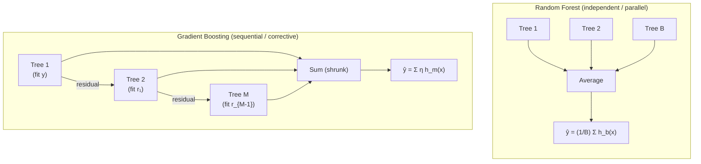
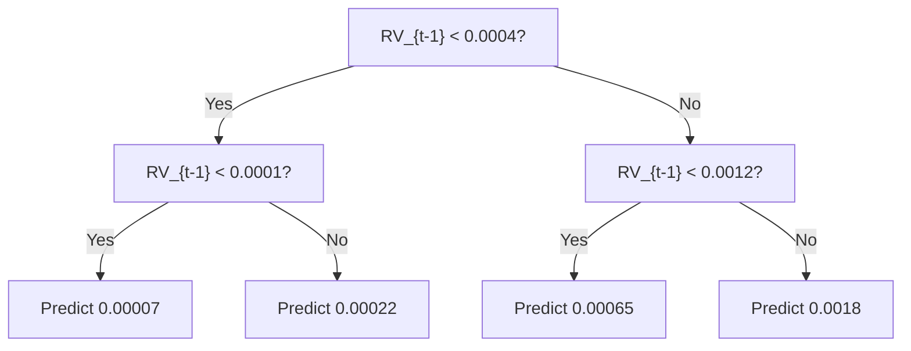
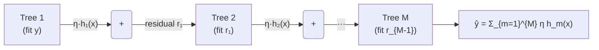
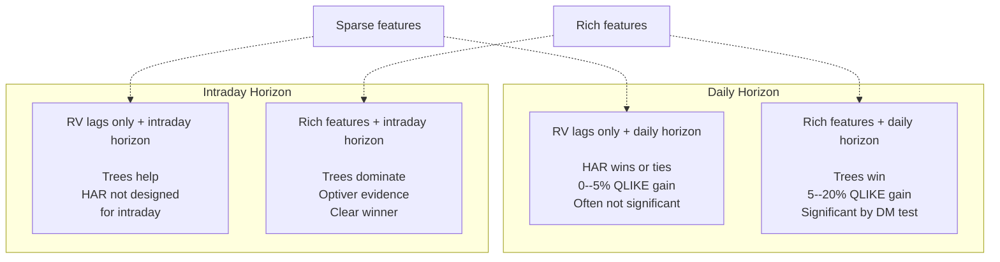

# Tree-Based Methods for Volatility

> **Application: **
> This chapter is where ML meets volatility forecasting for the first time.
> Tree-based methods (LightGBM, XGBoost) are the workhorse models for tabular
> volatility data, just as they dominate Kaggle competitions and quantitative
> finance pipelines. Projects 1, 2, and 5 all use tree ensembles as their
> primary model. The central question: when do trees beat HAR
> ([Chapter 6](ch06-har-model.md)), and when don't they?

## Why Trees for Volatility

[Chapter 10](ch10-feature-engineering.md) built a rich feature matrix: lagged RV transforms,
realized quarticity, signed semivariances, jumps, options-implied measures,
cross-asset signals, and calendar dummies. All of these live in a flat table
where each row is a date and each column is a number. No pixels, no word
tokens, no sequential structure that demands recurrence. This is *tabular
data*, and tree-based ensembles are the best off-the-shelf learners for
tabular data (Gu, Kelly, and Xiu, 2020).

Why? Four reasons, each directly relevant to volatility:

1. **Automatic nonlinear interactions.**
   HAR ([Chapter 6](ch06-har-model.md)) is linear in its three RV averages. If the
   effect of yesterday's RV depends on whether the VIX is above 25, you must
   hand-craft that interaction term for HAR. A tree discovers it
   automatically: one split on VIX, another on lagged RV, and the interaction
   is encoded in the tree structure.

2. **Threshold effects.**
   Volatility regimes change sharply. A tree split at
   $\operatorname{RV}_{t-1} = 0.0004$ captures a regime boundary that a linear model can
   only approximate with polynomial terms.

3. **Fast training.**
   A LightGBM model with 500 trees trains in seconds on 1,250 rows.
   This speed enables hundreds of purged cross-validation iterations
   ([Chapter 16](ch16-forecast-evaluation.md)), which is essential for honest evaluation on
   small samples.

4. **Built-in feature importance.**
   Split-count importance and SHAP values tell you *which* features
   drive predictions. This matters for interpretability, and it connects back
   to the feature selection discussion in [Chapter 10](ch10-feature-engineering.md).

> **Key Idea: Why Trees Win on Tabular Data**
> Trees excel at finding threshold effects and interactions in tabular data.
> Volatility data is tabular. The combination of automatic interaction
> detection, speed, and interpretability makes gradient-boosted trees the
> default first model for any volatility forecasting pipeline built on the
> features from [Chapter 10](ch10-feature-engineering.md).

The diagram below contrasts the two main tree ensemble strategies. A
**random forest** trains many independent trees on bootstrapped samples
and averages their predictions (variance reduction through decorrelation).
**Gradient boosting** trains trees sequentially, each one correcting the
errors of the ensemble so far (bias reduction through iterative refinement).
Both are used in volatility forecasting, but gradient boosting (LightGBM,
XGBoost) typically wins on tabular data.

## LightGBM and XGBoost

This section reviews gradient boosting at a level sufficient for volatility
work. If you want the full algorithmic treatment (histogram binning,
leaf-wise vs. level-wise growth, GOSS sampling), see a dedicated ML
reference. Here we focus on the choices that matter for forecasting $\operatorname{RV}$.

> **Prereq: Gradient Boosting in One Paragraph**
> You start with a constant prediction (the training-set mean of $\operatorname{RV}$).
> You compute the residuals. You fit a shallow decision tree to those
> residuals. You add a shrunken version of that tree's predictions to the
> running forecast. You repeat. Each new tree corrects the mistakes of the
> ensemble so far. The "gradient" part: the residuals are the negative
> gradient of the loss function with respect to the current prediction,
> so this procedure is gradient descent in function space.

### A single tree on lagged RV

Before ensembles, consider one tree. The diagram below shows a depth-2 tree
predicting tomorrow's $\operatorname{RV}$ from yesterday's value.

The tree partitions the feature space into four leaves, each returning a
constant prediction. This is piecewise-constant approximation. A single
shallow tree is a weak learner; boosting combines hundreds of them.

### The boosting ensemble

The diagram below shows how gradient boosting builds its forecast
sequentially. Each tree fits the residual errors of the ensemble so far.

The ensemble prediction is:

$$\hat{y}_t \;=\; \sum_{m=1}^{M} \eta \, h_m(\mathbf{x}_t),$$

where:

- $h_m(\mathbf{x}_t)$ is the prediction of the $m$-th tree given feature
  vector $\mathbf{x}_t$,
- $\eta \in (0,1]$ is the learning rate (shrinkage),
- $M$ is the number of boosting iterations (trees).

> **Intuition: In Plain English**
> The final prediction is a team vote: each tree contributes a small correction,
> and you add up all the corrections. The learning rate $\eta$ shrinks each
> tree's voice so that no single tree dominates. More trees with a smaller
> learning rate generally gives a smoother, more reliable forecast than fewer
> trees with a larger rate.

> **Project Connection: Why This Matters**
> This additive structure is how LightGBM and XGBoost produce your daily
> $\operatorname{RV}$ forecast. Every tree in the ensemble sees the same feature vector
> $\mathbf{x}_t$ (lagged RV, VIX, jumps, etc. from [Chapter 10](ch10-feature-engineering.md))
> and contributes a correction. Tuning $\eta$ and $M$ together (with early
> stopping) is the primary way to control overfitting on 1,250-row
> volatility samples.

### Loss function choice

The standard loss for regression is MSE:
$\mathcal{L}_{\text{MSE}} = \frac{1}{N}\sum_t (\operatorname{RV}_t - \hat{y}_t)^2$.
But [Chapter 16](ch16-forecast-evaluation.md) showed that $\text{QLIKE}$ is the preferred loss
for volatility forecasting (Audrino and Knaus, 2016):

$$\mathcal{L}_{\text{QLIKE}} \;=\; \frac{1}{N}\sum_{t=1}^{N}
\left(\frac{\operatorname{RV}_t}{\hat{y}_t} - \ln\frac{\operatorname{RV}_t}{\hat{y}_t} - 1\right).$$

- $\operatorname{RV}_t$: the realized volatility actually observed on day $t$,
- $\hat{y}_t$: the model's forecast for day $t$,
- the summand equals zero when $\hat{y}_t = \operatorname{RV}_t$ and is strictly
  positive otherwise.

> **Intuition: In Plain English**
> QLIKE penalizes you more harshly for under-predicting volatility than for
> over-predicting it by the same amount. If realized vol is 20% and you
> forecast 10%, the penalty is much larger than if you forecast 30%. This
> asymmetry matches real risk management needs: underestimating volatility is
> more dangerous than overestimating it. MSE, by contrast, penalizes both
> directions equally.

> **Project Connection: Why This Matters**
> QLIKE is the primary evaluation metric for the GS project. Training your
> tree model directly on QLIKE (rather than MSE) aligns the optimization
> objective with the evaluation criterion.
> Audrino and Knaus (2016) show that QLIKE-optimized trees outperform
> MSE-optimized trees for realized volatility, so this custom loss is not
> optional; it is a core part of the pipeline.

Neither LightGBM nor XGBoost provides $\text{QLIKE}$ natively, but both accept
custom objective functions. You supply the gradient and Hessian:

$$g_t = \frac{\partial \mathcal{L}_{\text{QLIKE}}}{\partial \hat{y}_t}
       = -\frac{\operatorname{RV}_t}{\hat{y}_t^2} + \frac{1}{\hat{y}_t},$$

$$h_t = \frac{\partial^2 \mathcal{L}_{\text{QLIKE}}}{\partial \hat{y}_t^2}
       = \frac{2\,\operatorname{RV}_t}{\hat{y}_t^3} - \frac{1}{\hat{y}_t^2}.$$

- $g_t$: the gradient tells each tree which direction to adjust
  predictions,
- $h_t$: the Hessian tells each tree how aggressively to adjust
  (curvature information).

> **Intuition: In Plain English**
> The gradient $g_t$ answers: "for observation $t$, should the next tree push
> the prediction up or down?" The Hessian $h_t$ answers: "how confident
> should that push be?" Together, they let the boosting algorithm do
> Newton-step optimization in function space, which converges faster than
> using the gradient alone.

> **Project Connection: Why This Matters**
> Implementing these two formulas as a custom objective function in LightGBM
> or XGBoost is a 10-line code change, but it is the single most impactful
> modification you can make to the default pipeline. Without it, the tree
> model optimizes MSE, which does not match the QLIKE evaluation metric and
> systematically under-penalizes low forecasts in high-vol regimes.

> **Warning: Enforce Positive Predictions**
> $\text{QLIKE}$ requires $\hat{y}_t > 0$. Clip predictions to a small positive
> floor (e.g., $10^{-8}$) inside the custom objective, or the gradient
> explodes. Also apply the floor when evaluating the metric, not just during
> training.

### Monotone constraints

Finance intuition says "higher recent volatility predicts higher future
volatility." You can encode this as a monotone constraint on lagged-RV
features: the prediction must be non-decreasing in $\operatorname{RV}_{t-1}$. Both
LightGBM and XGBoost support per-feature monotone constraints. Use them
sparingly (only for features where the monotone relationship is
theoretically unambiguous), but when appropriate, they reduce overfitting
and improve interpretability.

## Hyperparameters for Volatility Data

This section is the most practically important in the chapter. Volatility
data has three properties that make default hyperparameters dangerous:

1. **Small samples.**
   Five years of daily data gives you roughly 1,250 observations. This is
   orders of magnitude smaller than the datasets LightGBM and XGBoost were
   optimized for.

2. **High autocorrelation.**
   $\operatorname{RV}$ is strongly persistent ([Chapter 6](ch06-har-model.md)). Nearby observations
   are nearly identical, so effective sample size is smaller than the row
   count suggests.

3. **Heavy tails.**
   Volatility spikes create influential observations. A single crisis week
   can dominate the loss function.

> **Warning: Default Settings Will Overfit**
> Default LightGBM/XGBoost settings (`max_depth`=6+,
> `min_child_samples`=20) were designed for datasets with 100K+ rows.
> With 1,250 daily observations, defaults will memorize noise. The table below
> gives recommended ranges calibrated for volatility forecasting.

| **Parameter** | **Default** | **Vol Range** | **Rationale** |
|---|---|---|---|
| `max_depth` | 6--8 | 3--5 | Shallow trees limit memorization |
| `min_child_samples` | 20 | 50--200 | Forces each leaf to generalize |
| `subsample` | 1.0 | 0.6--0.8 | Row subsampling adds regularization |
| `colsample_bytree` | 1.0 | 0.6--0.8 | Feature subsampling decorrelates trees |
| `learning_rate` | 0.1 | 0.01--0.05 | Slow learning + early stopping |
| `num_iterations` | 100 | 500--2000 | More trees at lower rate; early stop |
| `reg_lambda` | 0 | 1--10 | L2 leaf regularization |

> **Key Idea: Early Stopping on Purged Validation**
> Early stopping is the single most important regularization technique for
> tree ensembles on small volatility data. But the validation set used for
> early stopping must respect the purged CV structure: no overlap between
> training and validation dates, with an embargo gap. If you use a random
> validation split, early stopping will stop too late because the validation
> set is contaminated by lookahead.

## The Christensen--Siggaard--Veliyev Evidence

The most comprehensive academic horse-race of ML methods for realized
volatility forecasting is Christensen, Siggaard, and Veliyev (2023). Their
setup: 29 DJIA stocks, daily, weekly, and monthly RV forecasting, with a
feature set spanning RV lags, implied volatility, VIX, momentum, volume,
earnings announcements, and macroeconomic indicators.

> **Key Result: Christensen, Siggaard, and Veliyev (2023)**
> Gradient-boosted trees are among the top-performing models for
> daily RV forecasting across 29 DJIA stocks. Three findings matter most:
>
> 1. **Rich features amplify the ML advantage.**
>    When the feature set includes only RV lags (what HAR uses), trees offer
>    minimal improvement. When the feature set expands to include implied
>    volatility, VIX, volume, and macroeconomic indicators, trees pull ahead
>    by 4--10% in MSE at the daily horizon, and by substantially more at
>    longer horizons.
>
> 2. **Longer horizons favor ML.**
>    The gap between tree models and HAR is larger for weekly and monthly RV
>    prediction than for daily. At longer horizons, nonlinear feature
>    interactions matter more because the direct autoregressive signal decays.
>
> 3. **Accumulated Local Effects (ALE) plots reveal drivers.**
>    ALE plots (a model-agnostic alternative to partial dependence) show that
>    the tree models primarily exploit the interaction between lagged RV and
>    implied volatility, exactly the HARQ-type interaction from
>    [Chapter 6](ch06-har-model.md), but estimated nonparametrically rather than
>    imposed by hand.

The study uses a static 70/10/20 train-validation-test split for the ML
models, while the non-regularized HAR benchmarks use a rolling-window
scheme. The out-of-sample test period spans several years, covering both
calm and crisis regimes.

## The Optiver Kaggle Evidence

Academic papers evaluate models carefully but on relatively simple feature
sets. The Optiver Realized Volatility Prediction competition (Kaggle, 2021)
provides the complementary experiment: thousands of teams competing to
predict 10-minute-ahead realized volatility from limit order book data
across over 100 stocks.

> **Key Result: Optiver Kaggle Competition (2021)**
> LightGBM ensembles dominated the leaderboard. The top solutions shared
> three characteristics:
>
> 1. **Feature engineering dominated.**
>    WAP (weighted average price) returns, price acceleration, volume
>    imbalance profiles, bid-ask spread dynamics, trade-flow toxicity
>    ([Chapter 10](ch10-feature-engineering.md)). Winners spent 80% of their effort on
>    features and 20% on modeling.
>
> 2. **Trees beat deep learning.**
>    Transformer and LSTM models were tried extensively. They did not
>    beat well-tuned LightGBM on the public or private leaderboard.
>
> 3. **Blending helped, but only modestly.**
>    Top solutions blended 3--5 LightGBM models (different feature subsets or
>    random seeds). Gains from blending were 1--3%, far smaller than gains
>    from better features.

> **Key Idea: Features Over Architecture**
> The Optiver competition reinforces the lesson from [Chapter 10](ch10-feature-engineering.md):
> feature choice matters more than model choice. Trees plus good features
> consistently outperform deep learning plus raw data. If you are deciding
> where to spend your next hour of research time, spend it engineering a new
> feature, not tuning a neural network.

The Optiver setting differs from academic setups in two ways. First, the
prediction horizon is 10 minutes, not one day, so HAR is not a natural
benchmark (it was designed for daily or longer horizons). Second, the
feature space includes tick-level order book data, which is far richer than
what most academic studies use. The lesson about feature engineering
transfers directly to the daily setting, but the absolute performance
numbers do not.

## The Honest Assessment

This is the most important section in the chapter. The evidence above might
suggest that trees always win. They do not. Here is a regime-by-regime
summary of when ML adds value, grounded in the literature.

### Daily horizon, RV-only features: HAR is extremely competitive

When you give a tree ensemble the same three features HAR uses ($\operatorname{RV}_{t-1}$,
$\operatorname{RV}^{(w)}_{t-1}$, $\operatorname{RV}^{(m)}_{t-1}$), the improvement over HAR is 0--5%
in $\text{QLIKE}$, and it is often not statistically significant by the
Diebold--Mariano test ([Chapter 16](ch16-forecast-evaluation.md)). HAR already captures
the dominant autoregressive structure. Trees can only add nonlinear kinks,
which are small and unstable on 1,250 observations.

Bollerslev, Patton, and Quaedvlieg (2024) demonstrate that a rolling-window HAR with properly
selected window length matches or beats off-the-shelf ML models. The key
insight: HAR's advantage comes from its parsimonious structure (3 parameters),
which is well-suited to small, noisy, autocorrelated data.

### Daily horizon, rich features: trees win

When you add the full feature set from [Chapter 10](ch10-feature-engineering.md) (implied
volatility, jumps, signed semivariances, cross-asset, sentiment), trees pull
ahead by 5--20% in $\text{QLIKE}$. The reason: these features contain nonlinear
interactions that HAR cannot exploit without hand-crafting interaction terms.
The tree ensemble discovers these interactions automatically.

Christensen, Siggaard, and Veliyev (2023) confirm this pattern: the ML
advantage grows with feature-set richness.

### Intraday horizons: trees are necessary

HAR was designed for daily (or longer) horizons. For 10-minute or 1-hour
ahead prediction from order book data, HAR has no natural formulation.
Trees operate on any feature matrix, regardless of the time scale, and the
Optiver evidence shows they dominate at short horizons.

### Stress regimes: ML stumbles

Here is the uncomfortable finding. ML models, including trees, tend to
underperform HAR during extreme events (VIX spikes, flash crashes, pandemic
onset). The reason: tree ensembles trained predominantly on calm-regime
data have never seen the patterns that emerge during crises. They
extrapolate poorly because trees are piecewise-constant; predictions in
extreme leaves are based on very few training observations.

Rahimikia and Poon (2020) document this explicitly: their ML model beats HAR
on 90% of out-of-sample days, but fails catastrophically on the remaining
10%, which are precisely the days that matter most for risk management.
The next section addresses this.

### Does anything beat linear models?

Branco, Rubesam, and Zevallos (2024) ask this question directly and find that
the answer is "often no, when the comparison is fair." Their main point:
many published ML-beats-HAR results use default hyperparameters for HAR
(fixed window, OLS) while giving the ML model a full tuning budget. When
both models receive equal care (rolling windows, feature selection, proper
tuning), the gap shrinks or disappears for daily RV with standard features.

> **Key Idea: Where the ML Gains Come From**
> The gains from ML come from richer features and longer horizons, not from
> nonlinear modeling of the same three RV lags that HAR uses. If your tree
> model does not beat HAR on the same features, you have overfit noise
> ([Chapter 6](ch06-har-model.md)). If it does beat HAR, check whether the gain
> survives the Diebold--Mariano test and Deflated Sharpe Ratio
> ([Chapter 16](ch16-forecast-evaluation.md)).

## Ensemble with HAR

The previous section revealed a tension: trees win most days but
fail in stress. HAR is robust in stress but misses nonlinear patterns in
calm periods. The natural solution: combine them.

Rahimikia and Poon (2020) propose exactly this. Their ML model (a
random forest, but the logic extends to any tree ensemble) beats HAR on
roughly 90% of out-of-sample days. On the remaining 10% (concentrated
during stress), HAR wins decisively. The combined forecast outperforms both
standalone models.

### Simple weighted average

The simplest combination:

$$\hat{\sigma}^2_{\text{combo},t}
  = w \cdot \hat{\sigma}^2_{\text{HAR},t}
  + (1-w) \cdot \hat{\sigma}^2_{\text{tree},t},$$

where $w \in [0,1]$ is estimated by minimizing $\text{QLIKE}$ on a purged
validation set. Typical values: $w \in [0.2, 0.4]$, giving the tree model
majority weight but retaining HAR's stabilizing influence.

- $\hat{\sigma}^2_{\text{HAR},t}$ is the HAR forecast from
  [Chapter 6](ch06-har-model.md).
- $\hat{\sigma}^2_{\text{tree},t}$ is the LightGBM or XGBoost
  forecast.
- $w$ is the HAR weight, estimated on the validation set.

> **Intuition: In Plain English**
> This is a weighted average of two forecasts. When $w = 0.3$, the combined
> forecast is 30% HAR and 70% tree. The weight is not a guess; you pick the
> $w$ that minimizes QLIKE on a held-out validation set. The result inherits
> the tree's ability to capture nonlinear patterns while retaining HAR's
> stability during extreme events.

> **Project Connection: Why This Matters**
> The HAR + tree combination is a strong candidate for the final model in the
> GS project. It addresses the key weakness of standalone tree models
> (poor extrapolation in stress regimes) while preserving the QLIKE gains
> that trees deliver in normal markets. Tuning $w$ on a purged validation
> set takes seconds, and the resulting ensemble is simple to explain to
> stakeholders.

### Regime-switching combination

A more sophisticated version: let $w$ depend on the current regime. Define
a "stress indicator" $s_t$ (e.g., $s_t = \mathbf{1}[\text{VIX}_t > 30]$ or
a GMM-based regime probability). Then:

$$\hat{\sigma}^2_{\text{combo},t}
  = w(s_t) \cdot \hat{\sigma}^2_{\text{HAR},t}
  + [1 - w(s_t)] \cdot \hat{\sigma}^2_{\text{tree},t},$$

with $w(s_t)$ increasing during stress (rely more on HAR when volatility is
elevated). This connects directly to the regime overlay in
[Chapter 13](ch13-hybrid-ensemble.md).

> **Intuition: In Plain English**
> Instead of using a fixed blend, the regime-switching version asks: "are
> markets calm or stressed right now?" In calm markets, it trusts the tree
> model more. In stressed markets, it shifts weight toward HAR, which
> extrapolates more reliably when volatility spikes to levels unseen in
> training data. The stress indicator $s_t$ acts as a dial that adjusts the
> blend in real time.

> **Project Connection: Why This Matters**
> The regime-switching combination is the bridge to [Chapter 13](ch13-hybrid-ensemble.md)'s
> full hybrid architecture. If your holdout period includes a volatility
> spike (e.g., a VIX jump above 30), this adaptive weighting can recover
> QLIKE losses that a fixed-weight blend would miss. It also provides a
> natural way to incorporate the VIX regime indicator from
> [Chapter 10](ch10-feature-engineering.md) into the forecast combination step.

> **Intuition: Why Combining Works**
> HAR and tree ensembles make different types of errors. HAR's errors are
> small and unbiased in calm periods, large but mean-reverting in stress.
> Tree errors are small in calm periods but can be persistently biased during
> regimes unseen in training. Averaging diversifies the error, the same
> principle behind portfolio diversification.

## DART: Dropout Regularization for Boosted Trees

The hyperparameters section covered the standard regularization
toolkit for gradient boosting: shallow trees, subsampling, and slow learning
rates. There is one more technique worth understanding, and it addresses a
subtle failure mode that the standard controls do not.

### The over-specialization problem

Recall from the ensemble prediction equation that standard gradient boosting
shrinks every tree's contribution by the same learning rate $\eta$. Early
trees see large residuals (the raw signal), so they learn the dominant
pattern: the strong autoregressive relationship between lagged $\operatorname{RV}$ and
future $\operatorname{RV}$. Later trees see only the leftover residuals after those early
trees have already captured the bulk of the variance. Shrinkage treats every
tree identically, so the early trees permanently dominate the ensemble's
output.

This creates a problem called **over-specialization**: later trees
become highly specialized to the narrow residual signal left by the first
few trees. If those early trees overfit to noise in the training data, every
subsequent tree inherits that bias. The ensemble's predictions become overly
dependent on a small number of early trees.

> **Intuition: In Plain English**
> Imagine a group project where one person does most of the work in the first
> week. Everyone else spends the remaining weeks patching small gaps in that
> person's draft. If the first person made a fundamental error, the entire
> project is built on a flawed foundation, and no amount of patching fixes it.
> Standard shrinkage is like asking everyone to speak more quietly; it does not
> change the fact that the first speaker set the direction.

### Dropout applied to trees

**DART** (Dropouts meet Multiple Additive Regression Trees) solves
over-specialization by borrowing the dropout idea from neural networks
(Vinayak and Gilad-Bachrach, 2015). In each boosting round, instead of computing
residuals from the full ensemble, DART randomly **drops** (removes) a
subset of the previously built trees. The new tree is then trained on the
residuals of the *reduced* ensemble, the one with the dropped trees
removed.

Concretely, let $\mathcal{D} \subset \{1, \ldots, m-1\}$ denote the set of
tree indices dropped at round $m$, chosen by including each tree
independently with **drop rate** $p$. The prediction used to compute
residuals becomes:

$$\hat{y}^{(\text{drop})}_t
  \;=\; \sum_{k \notin \mathcal{D}} h_k(\mathbf{x}_t),$$

where:

- $h_k(\mathbf{x}_t)$ is the prediction of tree $k$ for observation $t$
  (already including its learned weight),
- $\mathcal{D}$ is the random dropout set for this boosting round,
- $\hat{y}^{(\text{drop})}_t$ is the reduced ensemble prediction
  (with dropped trees excluded).

The new tree $h_m$ is fitted to the residuals
$r_t = y_t - \hat{y}^{(\text{drop})}_t$. Because some trees were dropped,
these residuals are larger than they would be under the full ensemble, so the
new tree must learn to compensate for the missing trees. This forces it to
capture general patterns rather than narrow residual corrections.

> **Intuition: In Plain English**
> Dropout randomly benches some of the existing team members during each
> training round. The new recruit (tree) has to pick up their slack, which
> means learning broadly useful patterns rather than hyper-specialized
> corrections. After training, all trees are brought back for the final
> prediction. The result is an ensemble where each tree carries more
> independent information.

### Prediction normalization

After fitting the new tree $h_m$, DART must normalize the ensemble so that
adding the new tree does not inflate predictions. The dropped trees and the
new tree are rescaled so the ensemble stays calibrated:

$$\hat{y}_t
  \;=\; \sum_{k \notin \mathcal{D}} h_k(\mathbf{x}_t)
  \;+\; \frac{|\mathcal{D}|}{|\mathcal{D}| + 1}\,
  \sum_{k \in \mathcal{D}} h_k(\mathbf{x}_t)
  \;+\; \frac{1}{|\mathcal{D}| + 1}\, h_m(\mathbf{x}_t),$$

where:

- $|\mathcal{D}|$ is the number of dropped trees,
- the factor $\frac{|\mathcal{D}|}{|\mathcal{D}|+1}$ rescales the
  dropped trees down to make room for the new tree,
- the factor $\frac{1}{|\mathcal{D}|+1}$ rescales the new tree so it
  contributes an "equal share" alongside the dropped trees.

> **Intuition: In Plain English**
> Without normalization, the new tree would be trained against a gap left by
> the dropped trees (large residuals), so its raw predictions would be too
> large. The normalization splits the "budget" of the dropped trees evenly
> between the returning dropped trees and the new tree. Think of it as
> redistributing playing time: the dropped players come back at slightly
> reduced minutes, and the new player gets a fair share.

### DART versus standard shrinkage

The key difference from the learning rate $\eta$ in standard boosting:

| | **Shrinkage** ($\eta$) | **DART** (drop rate $p$) |
|---|---|---|
| **Mechanism** | Scales *every* tree by the same constant $\eta$ | Randomly removes *entire trees* each round |
| **Effect on early trees** | Reduced proportionally but still dominant | May be dropped, forcing later trees to learn independently |
| **Diversity** | All trees see residuals from the same full ensemble | Each tree sees residuals from a different random subset |
| **Analogy** | Turning down everyone's volume equally | Randomly muting some speakers so others must step up |

Shrinkage and DART are not mutually exclusive. In LightGBM, you can set
`boosting_type='dart'` and still specify a learning rate, though in
practice the learning rate is often set higher with DART (e.g., 0.05--0.1)
because the dropout itself provides regularization.

> **Project Connection: DART for Volatility Forecasting**
> Over-specialization is particularly relevant for $\operatorname{RV}$ forecasting. The
> dominant signal in volatility data is the autoregressive persistence captured
> by HAR's three lagged averages ([Chapter 6](ch06-har-model.md)). In standard
> boosting, the first few trees learn this persistence, and all subsequent
> trees become narrowly specialized to small residual patterns that may not
> generalize. DART forces later trees to occasionally reconstruct the
> autoregressive signal on their own, building redundancy into the ensemble
> and reducing dependence on any single tree's overfitting.
>
> In LightGBM, enable DART by setting `boosting_type='dart'`. The key
> hyperparameter is the drop rate: start with
> `drop_rate` $\in [0.05, 0.15]$ and tune via purged CV
> (see the hyperparameters section above). Higher drop rates increase diversity
> but slow convergence; lower rates approach standard GBDT behavior. Note that
> DART disables early stopping (because the loss is non-monotone due to random
> dropping), so you must set `num_iterations` explicitly rather than
> relying on patience-based stopping.

> **Warning: DART Disables Early Stopping**
> With standard GBDT, you monitor validation loss and stop when it plateaus.
> DART's random dropout makes the validation loss noisy and non-monotone from
> round to round, so early stopping triggers prematurely. When using DART,
> fix the number of boosting rounds via cross-validation rather than relying
> on early stopping. This increases tuning cost, but the regularization
> benefit of dropout often compensates.

## Summary

1. Tree-based ensembles (LightGBM, XGBoost) are the default ML model for
   tabular volatility data because they automatically discover nonlinear
   interactions and threshold effects.

2. Gradient boosting builds the forecast sequentially: each tree corrects
   the residual errors of the ensemble so far.

3. For volatility forecasting, use a custom $\text{QLIKE}$ loss, not the
   default MSE loss.

4. Default hyperparameters overfit on small volatility samples. Use
   shallow trees (`max_depth` 3--5), large minimum leaf sizes
   (50--200), aggressive subsampling (0.6--0.8), and slow learning rates
   (0.01--0.05) with early stopping on a purged validation set.

5. Christensen, Siggaard, and Veliyev (2023): trees are among the best for
   daily RV forecasting, with gains amplified by richer feature sets and
   longer horizons.

6. The Optiver Kaggle competition confirms that feature engineering
   matters far more than model architecture: trees plus good features beat
   deep learning plus raw data.

7. With RV-only features at daily horizons, HAR is extremely competitive.
   Trees offer 0--5% $\text{QLIKE}$ improvement, often not significant.

8. With rich features (implied vol, jumps, cross-asset) at daily
   horizons, trees win by 5--20% in $\text{QLIKE}$.

9. At intraday horizons, trees are clearly necessary; HAR was not
   designed for this regime.

10. During extreme stress, tree models tend to underperform HAR because
    they extrapolate poorly from calm-period training data.

11. Combining HAR and tree forecasts captures the best of both: the tree's
    nonlinear skill in calm markets and HAR's robustness in stress
    (Rahimikia and Poon, 2020).

12. Branco, Rubesam, and Zevallos (2024) and Bollerslev, Patton, and Quaedvlieg (2024) caution
    that many ML-beats-HAR claims reflect unfair comparisons. When both
    models are properly tuned, the gap is smaller than headline numbers
    suggest.

13. DART (Vinayak and Gilad-Bachrach, 2015) applies dropout to boosted trees:
    randomly dropping previous trees during each boosting round prevents
    over-specialization, where later trees become overly dependent on early
    trees that captured the dominant autoregressive signal. Use
    `drop_rate` $\in [0.05, 0.15]$; note that DART disables early
    stopping.

14. The gains from ML come from richer features and longer horizons, not
    from nonlinear modeling of the same three RV lags. [Chapter 12b](ch12b-deep-learning-vol.md)
    explores whether deep learning changes this conclusion.

---

| **Paper** | **Key Result** | **Relevance** |
|---|---|---|
| Christensen, Siggaard, and Veliyev (2023) | Trees among best for daily RV; gains grow with feature richness and horizon length | Primary evidence for the CSV Evidence and Honest Assessment sections |
| Branco, Rubesam, and Zevallos (2024) | Linear models competitive when comparison is fair | Calibrates expectations in the Honest Assessment section |
| Bollerslev, Patton, and Quaedvlieg (2024) | Rolling-window HAR with proper window matches off-the-shelf ML | Strongest HAR defense |
| Rahimikia and Poon (2020) | ML beats HAR 90% of days, fails in stress; ensemble solves it | Motivates the Ensemble with HAR section |
| Audrino and Knaus (2016) | QLIKE-optimized trees outperform MSE-optimized trees for RV | Justifies custom loss in the LightGBM and XGBoost section |
| Gu, Kelly, and Xiu (2020) | Trees and neural nets dominate linear models in cross-sectional return prediction with rich features | Canonical ML horse-race; context for tree methods |
| Vinayak and Gilad-Bachrach (2015) | Dropout for boosted trees reduces over-specialization; each tree learns more independently | Regularization technique in the DART section |
