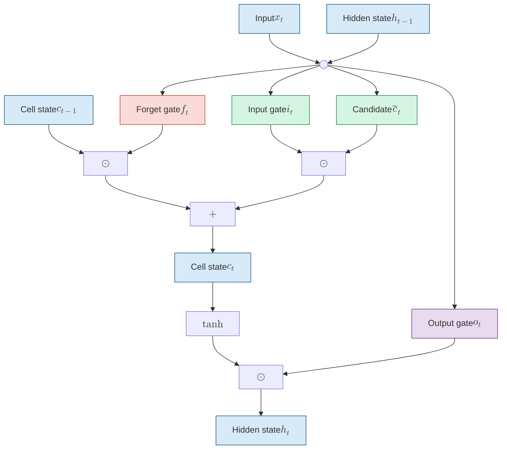
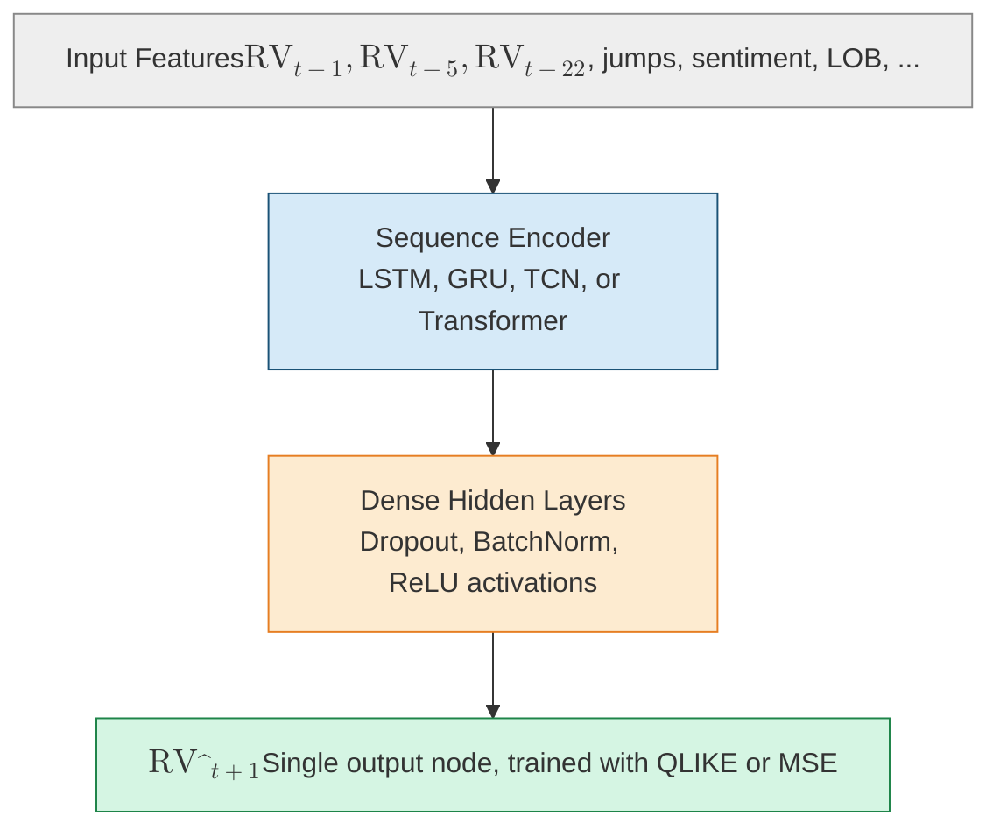
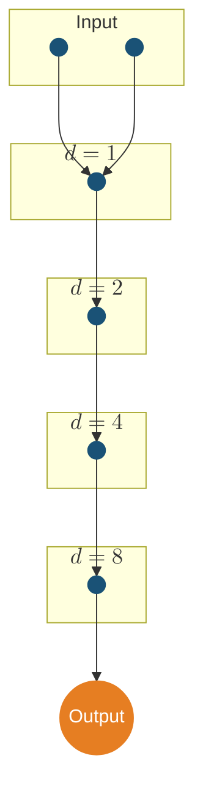
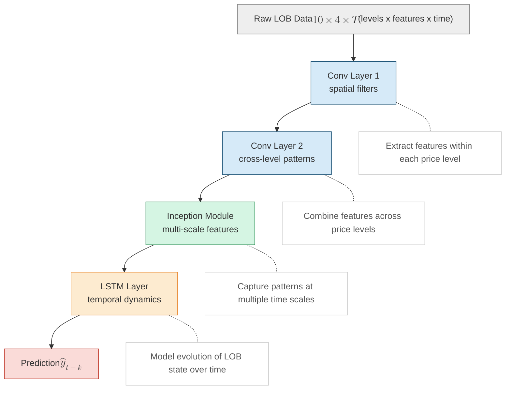
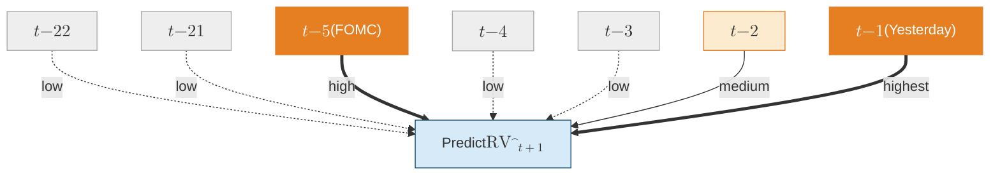
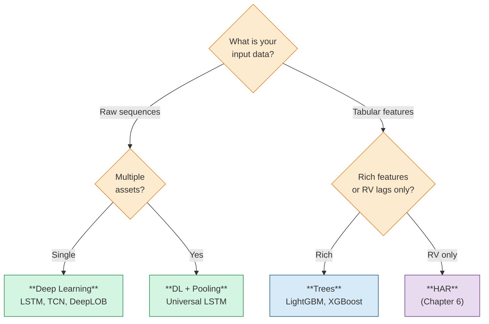

# Deep Learning for Volatility

> **Application: Where This Chapter Fits**
>
> [Chapter 11](ch11-tree-methods-vol.md) showed that tree-based methods are the workhorse for tabular volatility features. This chapter asks: when do neural networks offer something trees cannot? The answer is narrow but real: sequential raw data (LOB, tick streams), cross-asset pooling, and latent factor extraction. Project 2 (Intraday RV from LOB) and Project 4 (Rough Vol vs Deep Learning) use architectures from this chapter.

> **Prereq: What You Need**
>
> - Backpropagation, gradient descent, and the idea of a loss function.
> - Matrix multiplication at the level of $\mathbf{W} \mathbf{x} + \mathbf{b}$.
> - Sigmoid $\sigma(\cdot)$ and $\operatorname{ReLU}(\cdot)$ activations.
> - The HAR model from [Chapter 6](ch06-har-model.md) and the tree methods from [Chapter 11](ch11-tree-methods-vol.md).

## LSTMs and GRUs

[Chapter 11](ch11-tree-methods-vol.md) established that gradient-boosted trees dominate *tabular* volatility forecasting. But volatility data is often sequential: a stream of 5-minute returns, a sequence of LOB snapshots, a panel of daily risk measures across assets. Recurrent neural networks, specifically the Long Short-Term Memory (LSTM) and the Gated Recurrent Unit (GRU), are purpose-built for sequences.

> **Intuition: Why Sequences Need Special Architecture**
>
> A standard feedforward network treats its inputs as an unordered bag of numbers. If you feed it $(\operatorname{RV}_{t-1}, \operatorname{RV}_{t-2}, \ldots, \operatorname{RV}_{t-22})$, it does not know that $\operatorname{RV}_{t-1}$ is yesterday and $\operatorname{RV}_{t-22}$ is a month ago. A recurrent network processes inputs one step at a time, maintaining a hidden state $\mathbf{h}_t$ that summarizes everything it has seen so far. This hidden state is the network's "memory."

### LSTM Cell Architecture

The LSTM cell solves the vanishing gradient problem that cripples simple recurrent networks. It uses three gates (forget, input, output) and a cell state $\mathbf{c}_t$ that acts as a conveyor belt for information.

*Figure: The LSTM cell. The cell state $\mathbf{c}_t$ (top) flows through only a forget multiply and an additive update, while the forget, input, and output gates plus the candidate cell state all read the concatenated input $[\mathbf{h}_{t-1}; \mathbf{x}_t]$.*

> **Definition: LSTM Cell Equations**
>
> At each time step $t$, given input $\mathbf{x}_t$ and previous hidden state $\mathbf{h}_{t-1}$:
>
> $$\mathbf{f}_t = \sigma\!\bigl(\mathbf{W}_f [\mathbf{h}_{t-1}; \mathbf{x}_t] + \mathbf{b}_f\bigr) \quad \text{(forget gate)}$$
>
> $$\mathbf{i}_t = \sigma\!\bigl(\mathbf{W}_i [\mathbf{h}_{t-1}; \mathbf{x}_t] + \mathbf{b}_i\bigr) \quad \text{(input gate)}$$
>
> $$\tilde{\mathbf{c}}_t = \tanh\!\bigl(\mathbf{W}_c [\mathbf{h}_{t-1}; \mathbf{x}_t] + \mathbf{b}_c\bigr) \quad \text{(candidate cell state)}$$
>
> $$\mathbf{c}_t = \mathbf{f}_t \odot \mathbf{c}_{t-1} + \mathbf{i}_t \odot \tilde{\mathbf{c}}_t \quad \text{(cell state update)}$$
>
> $$\mathbf{o}_t = \sigma\!\bigl(\mathbf{W}_o [\mathbf{h}_{t-1}; \mathbf{x}_t] + \mathbf{b}_o\bigr) \quad \text{(output gate)}$$
>
> $$\mathbf{h}_t = \mathbf{o}_t \odot \tanh(\mathbf{c}_t) \quad \text{(hidden state)}$$
>
> where:
>
> - $[\mathbf{h}_{t-1}; \mathbf{x}_t]$ is the concatenation of previous hidden state and current input.
> - $\mathbf{W}_f, \mathbf{W}_i, \mathbf{W}_c, \mathbf{W}_o$ are learned weight matrices.
> - $\mathbf{b}_f, \mathbf{b}_i, \mathbf{b}_c, \mathbf{b}_o$ are bias vectors.
> - $\odot$ denotes element-wise (Hadamard) multiplication.
> - $\sigma(\cdot)$ squashes values to $[0,1]$; each gate is a "soft switch."

> **Intuition: The Three Gates in Plain English**
>
> - **Forget gate** $\mathbf{f}_t$: "How much of the old memory should I keep?" Values near 0 erase; near 1 retain.
> - **Input gate** $\mathbf{i}_t$: "How much of the new candidate should I write to memory?"
> - **Output gate** $\mathbf{o}_t$: "How much of the current memory should I expose as my prediction?"
>
> The cell state $\mathbf{c}_t$ flows through the network with only linear interactions (multiply and add), so gradients flow back through many time steps without vanishing. This is why LSTMs can learn long-range dependencies that simple RNNs cannot.

> **Project Connection: Why This Matters**
>
> For volatility forecasting, the forget gate learns *persistence*: how much of yesterday's volatility regime carries over to today. The input gate learns how much weight to give today's new information (today's realized volatility, jump indicators, or news sentiment). The output gate controls what the model passes forward as its forecast. An LSTM can learn the HAR structure automatically (daily, weekly, monthly lags map to different hidden-state components), but it can also discover more complex nonlinear patterns that HAR misses, such as asymmetric responses to positive and negative shocks. Because neural nets accept arbitrary loss functions, you can train the LSTM directly on QLIKE rather than MSE, which is straightforward in PyTorch or TensorFlow.

The GRU simplifies the LSTM by merging the forget and input gates into a single "update gate" and eliminating the separate cell state. GRUs have fewer parameters and train faster; in practice, performance differences between LSTM and GRU are small for volatility tasks.

### LSTMs for Realized Volatility

Bucci (2020) provides an early comparison. He tests LSTM and NARX (nonlinear autoregressive with exogenous inputs) networks against ARFIMA and other econometric models for monthly $\operatorname{RV}$ forecasting of the S&P 500.

> **Key Result: Bucci (2020): LSTM for Monthly RV**
>
> Recurrent neural networks (LSTM, NARX) outperform traditional long-memory econometric models (ARFIMA, LSTAR) for monthly $\operatorname{RV}$ forecasting, particularly in terms of robust accuracy measures. The LSTM's advantage is clearest during volatile periods (the 2007-2009 crisis subsample), when the relationship between past and future $\operatorname{RV}$ is nonlinear.

This result is consistent with the lesson from [Chapter 11](ch11-tree-methods-vol.md): on daily $\operatorname{RV}$ with only lagged $\operatorname{RV}$ as inputs, simple models are hard to beat. The LSTM becomes genuinely useful when you change what you feed it.

Sirignano and Cont (2019) demonstrate a powerful idea: *pooling* data across assets. Instead of training one LSTM per stock, they train a single "universal" LSTM on all stocks simultaneously.

> **Key Result: Sirignano-Cont (2019): Universal Features via Pooling**
>
> A single LSTM trained on pooled data across 1,000+ stocks learns universal features of price formation. Pooling works because volatility dynamics are similar across assets (the same "rough" kernel from [Chapter 7](ch07-rough-volatility.md)). The pooled model outperforms asset-specific models, especially for assets with short histories.

> **Key Idea: Cross-Asset Pooling**
>
> Trees cannot easily share learned representations across assets; you train one model per asset or flatten everything into rows. Neural networks naturally pool: a single LSTM processes sequences from many assets, learning shared dynamics while allowing asset-specific variation through the hidden state. If volatility dynamics are truly universal (Hurst $H \approx 0.1$ across assets, as [Chapter 7](ch07-rough-volatility.md) showed), pooling should help, and it does.

Rosenbaum and Zhang (2022) connect LSTMs directly to rough volatility. They show that a universal LSTM, trained to forecast volatility, learns a kernel that matches the fractional kernel of the RFSV model from [Chapter 7](ch07-rough-volatility.md).

> **Key Result: Rosenbaum-Zhang (2022): LSTM Rediscovers Roughness**
>
> An LSTM trained on raw volatility data learns the same power-law kernel $K(t) \propto t^{H-1/2}$ with $H \approx 0.1$ that defines the rough fractional stochastic volatility (RFSV) model. The LSTM and the RFSV forecast are nearly identical, suggesting both learn the same underlying structure.

This is a beautiful result. The LSTM was given no prior knowledge of rough volatility, fractional Brownian motion, or Hurst exponents. It discovered roughness from data alone.

Rahimikia and Poon (2020) push the LSTM further by adding LOB features and news sentiment as inputs alongside standard $\operatorname{RV}$ lags.

> **Key Result: Rahimikia-Poon (2020): LSTM with LOB + Sentiment**
>
> An LSTM incorporating limit order book features and news sentiment beats HAR on approximately 90% of trading days. However, the model fails during extreme stress events, precisely when accurate forecasts matter most.

> **Warning: Stress-Period Failure**
>
> Deep learning models trained on normal-regime data can fail catastrophically during crises. The LSTM in Rahimikia and Poon (2020) underperforms HAR during high-volatility episodes because the training data contains few such events. This is not specific to LSTMs; it affects all flexible models. Always evaluate forecast performance conditional on volatility regime (see [Chapter 16](ch16-forecast-evaluation.md)).

> **Key Idea: When LSTMs Beat Trees for Volatility**
>
> LSTMs shine when you feed them *raw sequences* (intraday returns, LOB snapshots, tick data) rather than pre-computed features. On pre-computed tabular features, trees are usually better ([Chapter 11](ch11-tree-methods-vol.md)). The LSTM's value comes from learning feature representations that you did not know to engineer by hand.

*Figure: Neural network pipeline for volatility forecasting. The architecture choice lives in the sequence-encoder stage (LSTM, GRU, TCN, or Transformer); the input, dense-hidden, and output stages are shared across architectures.*

## Temporal Convolutional Networks

LSTMs process sequences one step at a time. This is conceptually clean but creates a computational bottleneck: you cannot parallelize across time steps because each step depends on the previous hidden state. Temporal Convolutional Networks (TCNs) solve this by using *causal convolutions*: filters that only look backward in time, applied in parallel across the entire sequence.

### Dilated Causal Convolutions

The key innovation is *dilation*. A standard 1D convolution with kernel size $k$ looks at $k$ consecutive time steps. A dilated convolution with dilation factor $d$ skips $d-1$ steps between inputs, so a kernel of size $k$ covers a receptive field of $k + (k-1)(d-1)$ steps. By doubling the dilation factor at each layer ($d = 1, 2, 4, 8, \ldots$), the receptive field grows exponentially while the number of parameters grows only linearly.

*Figure: A stack of dilated causal convolutions. Each layer doubles the dilation factor ($d = 1, 2, 4, 8$), so a single output unit at the top draws on a receptive field of 16 input steps while each layer uses a kernel of size 2.*

> **Definition: Dilated Causal Convolution**
>
> For a 1D input sequence $(x_0, x_1, \ldots, x_T)$, a dilated causal convolution with kernel $\mathbf{w} = (w_0, \ldots, w_{k-1})$ and dilation factor $d$ computes:
>
> $$y_t = \sum_{j=0}^{k-1} w_j \cdot x_{t - j \cdot d}$$
>
> where:
>
> - $k$ is the kernel size (typically 2 or 3).
> - $d$ is the dilation factor; layer $\ell$ uses $d = 2^{\ell-1}$.
> - **Causal**: $y_t$ depends only on $x_s$ for $s \le t$. No future information leaks.
> - With $L$ layers and kernel size $k=2$, the receptive field is $2^L$ time steps.

> **Intuition: Why Dilation Works**
>
> Think of each layer as a zoom level. Layer 1 (dilation 1) sees adjacent time steps: tick-by-tick patterns. Layer 2 (dilation 2) sees every other step: short-term trends. Layer 4 (dilation 8) sees steps 8 apart: the overall shape of the day. With just 8 layers and kernel size 2, you cover $2^8 = 256$ time steps. That is an entire trading day of 5-minute bars (78 bars) with room to spare.

> **Project Connection: Why This Matters**
>
> The dilated convolution is the building block of DeepVol, a leading architecture for forecasting daily RV from raw intraday returns. By stacking a handful of layers, the network covers an entire trading day (or week) without hand-engineering the daily, weekly, and monthly windows that HAR uses. This means the model can discover temporal patterns at any scale, not just the three fixed horizons baked into HAR. For the HARQ baseline project, a TCN trained on the same 5-minute return data provides a strong "does deep learning add anything?" comparison.

### DeepVol

Moreno-Pino and Zohren (2022) build **DeepVol**, a TCN that forecasts daily $\operatorname{RV}$ directly from raw intraday returns. Instead of computing $\operatorname{RV}_t$ from 5-minute returns and then modeling $\operatorname{RV}_{t+1}$ as HAR does, DeepVol feeds the raw 5-minute returns into a dilated causal convolution stack and predicts $\operatorname{RV}_{t+1}$ end-to-end.

> **Key Result: DeepVol: TCN for Daily RV from Raw Returns**
>
> DeepVol achieves state-of-the-art daily $\operatorname{RV}$ forecasting by processing raw 5-minute returns directly, bypassing the $\operatorname{RV}$ aggregation step entirely. The dilated causal convolution architecture provides two advantages over LSTMs:
>
> 1. **Parallelizable training**: all time steps are processed simultaneously.
> 2. **Interpretable receptive field**: you know exactly how many past time steps influence each prediction.

> **Key Idea: TCN vs. LSTM for Volatility**
>
> - TCN processes the entire input sequence in one forward pass; LSTM must step through sequentially.
> - TCN's receptive field is explicit ($2^L$ with kernel size 2); LSTM's effective memory is learned and opaque.
> - TCN has no vanishing gradient problem by construction (parallel paths through residual connections).
> - LSTM is more flexible for variable-length sequences; TCN requires fixed-length input (or padding).
> - For fixed-length volatility sequences (e.g., one day of 5-min returns), TCN is generally preferred.

## DeepLOB: Learning from Limit Order Books

The limit order book (LOB) is the richest source of short-horizon information in modern markets. At each moment, the LOB shows the queue of buy and sell orders at every price level. [Chapter 10](ch10-feature-engineering.md) discussed hand-crafted LOB features (order imbalance, depth ratios, spread). Zhang, Zohren, and Roberts (2019) ask: can a neural network learn better features directly from the raw LOB?

### Architecture

DeepLOB combines CNNs (for spatial features across price levels) with LSTMs (for temporal dynamics across snapshots).

*Figure: The DeepLOB architecture. Convolutional layers extract spatial features within and across price levels, an inception module captures multi-scale patterns, and an LSTM models the temporal evolution of the LOB before the prediction head.*

> **Definition: DeepLOB Input Representation**
>
> The input to DeepLOB at time $t$ is a tensor $\mathbf{X}_t \in \mathbb{R}^{T \times 10 \times 4}$:
>
> - **$T$ time steps**: a rolling window of LOB snapshots (e.g., $T = 100$).
> - **10 price levels**: the 5 best bid and 5 best ask levels.
> - **4 features per level**: price, volume, price difference from mid, volume difference from mid (on each side).
>
> The CNN layers convolve across the 10 price levels (spatial dimension), extracting patterns like order imbalance and depth concentration. The LSTM then processes the sequence of CNN-extracted features over time.

> **Key Result: DeepLOB: End-to-End LOB Prediction**
>
> DeepLOB outperforms hand-crafted LOB features for short-horizon ($k = 10, 20, 50$ tick) mid-price movement prediction. The convolutional layers learn features that resemble (but improve upon) classical order imbalance measures. The architecture generalizes across stocks without retraining, consistent with the universal-features finding of Sirignano and Cont (2019).

> **Application: DeepLOB for Volatility**
>
> DeepLOB was designed for mid-price direction prediction, but the same architecture predicts short-horizon $\operatorname{RV}$ from LOB data. Project 2 (Intraday RV from LOB) adapts DeepLOB by replacing the classification output with a regression head predicting $\operatorname{RV}$ over the next $k$ ticks. The key insight: LOB state (depth imbalance, spread dynamics, queue lengths) contains predictive information about short-term volatility that is not captured by price-based features alone.

## Transformers and Attention

Transformers replaced LSTMs as the dominant sequence model in NLP (GPT, BERT) and are now being applied to financial time series. The core mechanism is *self-attention*: instead of processing the sequence step-by-step, the transformer computes a weighted sum over all positions, where the weights are learned from the data.

> **Definition: Scaled Dot-Product Attention**
>
> Given queries $\mathbf{Q}$, keys $\mathbf{K}$, and values $\mathbf{V}$ (all derived from the input via learned linear projections):
>
> $$\text{Attention}(\mathbf{Q}, \mathbf{K}, \mathbf{V}) = \operatorname{softmax}\!\left(\frac{\mathbf{Q}\mathbf{K}^\top}{\sqrt{d_k}}\right) \mathbf{V}$$
>
> where:
>
> - $\mathbf{Q} \in \mathbb{R}^{T \times d_k}$: queries ("what am I looking for?").
> - $\mathbf{K} \in \mathbb{R}^{T \times d_k}$: keys ("what do I contain?").
> - $\mathbf{V} \in \mathbb{R}^{T \times d_v}$: values ("what information do I carry?").
> - $\sqrt{d_k}$: scaling factor to prevent dot products from growing large.
> - The $\operatorname{softmax}$ produces a $T \times T$ attention weight matrix; entry $(i, j)$ is how much position $i$ attends to position $j$.

> **Intuition: Attention for Volatility**
>
> In an LSTM, the influence of a past observation on the current prediction decays as it recedes into the hidden state. With attention, every past observation can directly influence the current prediction with a learned weight. For volatility, this means the model can learn that, say, last Tuesday's intraday pattern is highly relevant to today's forecast (perhaps both are FOMC days) without relying on the hidden state to carry that information across the intervening days.

> **Project Connection: Why This Matters**
>
> Attention lets the vol-forecasting model look back flexibly rather than at fixed windows. HAR hard-codes three lookback horizons (1 day, 5 days, 22 days); an attention layer learns *which* past days matter for each prediction. If FOMC days, triple-witching days, or earnings dates carry outsized information, attention can upweight them automatically. The attention weight matrix also provides interpretability: you can inspect which past days the model attended to and verify that its behavior is economically sensible.

*Figure: Attention over past days when forecasting $\widehat{\operatorname{RV}}_{t+1}$. Arrow thickness equals the attention weight; the model learns which past days matter most, here upweighting yesterday ($t-1$) and an earlier FOMC day ($t-5$).*

### Graph Transformers for Cross-Asset Volatility

Chen and Roberts (2022) extend the transformer with a graph structure over assets. Instead of treating each asset's time series independently, the attention mechanism defines a *learned graph*: the attention weight between asset $i$ and asset $j$ captures how much asset $j$'s history informs the forecast for asset $i$.

> **Key Idea: Attention Weights as a Volatility Network**
>
> The attention weight matrix $\mathbf{A} \in \mathbb{R}^{N \times N}$ across $N$ assets is a learned adjacency matrix. High attention from asset $i$ to asset $j$ means "$j$'s recent volatility is informative for predicting $i$'s volatility." This connects directly to the spillover analysis in [Chapter 15](ch15-spillovers-connectedness.md) and the multivariate models in [Chapter 14](ch14-multivariate-volatility.md), but learns the network structure from data rather than imposing it via a VAR or DCC.

Transformer variants have also been applied to LOB data (TLOB), replacing the LSTM component of DeepLOB with multi-head self-attention. Early results are promising but not yet conclusive.

> **Warning: Transformer Evidence on Volatility Is Thin**
>
> Transformer results on volatility are preliminary. Most published results use short evaluation periods or small asset universes. Be skeptical of claims that lack Diebold-Mariano tests or Model Confidence Set analysis ([Chapter 16](ch16-forecast-evaluation.md)). The core problem: transformers have many parameters and volatility datasets are small. A daily $\operatorname{RV}$ series for one asset gives you $\sim$252 observations per year. Even 20 years is only 5,000 observations, far fewer than the millions of sentences used to train language models. Pooling across assets helps (the LSTMs and GRUs section above), but the evidence base is still thin compared to LSTMs and TCNs.

## Modern Time-Series Architectures

The deep-learning-for-time-series field has produced a rapid succession of architectures: N-BEATS, N-HiTS, TiDE, TSMixer, PatchTST, and others. These were designed for general time-series forecasting (energy demand, weather, retail sales) and tested primarily on benchmarks like M4, M5, and the Monash archive. Their application to realized volatility is limited but worth knowing about.

**N-BEATS** (Neural Basis Expansion Analysis) uses a stack of fully-connected blocks with residual connections. Each block produces a "backcast" (reconstruction of the input) and a "forecast," and the blocks are organized into stacks that can be given interpretable basis functions (trend, seasonality).

**N-HiTS** extends N-BEATS with hierarchical interpolation, allowing different blocks to operate at different temporal resolutions (similar in spirit to the dilated convolutions of TCN).

**PatchTST** (Patch Time Series Transformer) divides the input time series into non-overlapping patches (subsequences) and treats each patch as a token for a transformer. This is conceptually similar to treating multi-day windows of 5-minute returns as input tokens.

**TiDE** (Time-series Dense Encoder) and **TSMixer** use MLP-based architectures that are simpler and faster than transformers while achieving competitive performance on standard benchmarks.

> **Key Idea: Modern Architectures: Solutions Looking for a Problem?**
>
> These architectures are well-engineered for general forecasting, but their evidence on $\operatorname{RV}$ specifically is thin. Most have not been tested with proper volatility evaluation ($\operatorname{QLIKE}$ loss, Diebold-Mariano tests against HAR, Model Confidence Set). PatchTST is the most promising for volatility because its patching mechanism naturally handles the multi-scale structure of intraday data (5-minute patches within daily windows within weekly patterns). Test them if you have the engineering bandwidth, but do not expect them to dominate purpose-built approaches like DeepVol or the well-tuned HAR.

## Generative and Latent-Variable Approaches

The methods above produce point forecasts: a single number $\widehat{\operatorname{RV}}_{t+1}$. Generative models instead learn the *full distribution* of future volatility, or learn compressed representations of complex objects like the implied volatility surface. These are frontier methods with thin evidence, but they represent the direction the field is heading.

### Neural SDEs and CDEs

Kidger (2021) develops the mathematical framework for embedding stochastic differential equations into neural networks. A neural SDE replaces the hand-specified drift and diffusion of classical models (Heston, SABR, rough Bergomi) with neural networks that learn these functions from data:

$$dX_t = f_{\bm{\theta}}(X_t, t)\,dt + g_{\bm{\theta}}(X_t, t)\,dW_t$$

where:

- $f_{\bm{\theta}}(\cdot)$: drift function, parameterized by a neural network with weights $\bm{\theta}$.
- $g_{\bm{\theta}}(\cdot)$: diffusion function, also a neural network.
- $W_t$: standard Brownian motion.

> **Intuition: In Plain English**
>
> A classical stochastic volatility model says "volatility evolves according to this specific formula" (e.g., Heston's square-root process). A neural SDE says "volatility evolves according to *whatever function* a neural network learns from the data." The drift $f_{\bm{\theta}}$ captures the predictable part of how volatility moves (mean reversion, trends), and the diffusion $g_{\bm{\theta}}$ captures the randomness (vol-of-vol, jump intensity). Both are flexible enough to approximate any continuous function, so you are not locked into a particular parametric assumption.

> **Project Connection: Why This Matters**
>
> For the HARQ baseline project, neural SDEs offer a way to move beyond point forecasts to full distributional predictions of future RV. Instead of predicting "tomorrow's RV is 15%," the neural SDE produces a probability distribution: "15% is the median, but there is a 5% chance RV exceeds 30%." This is directly useful for variance risk premium estimation and tail-risk-aware portfolio construction. The controlled differential equation (CDE) variant handles irregularly-spaced tick data naturally, which matters for intraday volatility estimation.

This is appealing for volatility because the ground truth *is* an SDE ([Chapter 2](ch02-realized-volatility.md)). The neural SDE learns the drift and diffusion from data without committing to a specific parametric form (Heston, SABR, rough Bergomi). The controlled differential equation (CDE) variant handles irregularly-spaced observations, which is natural for tick data.

> **Warning: Neural SDEs Are Data-Hungry**
>
> Training neural SDEs requires backpropagation through the SDE solver (adjoint method), which is computationally expensive. The diffusion function $g_{\bm{\theta}}$ is especially hard to learn because it governs the noise, not the signal. With typical volatility dataset sizes (a few thousand daily observations), neural SDEs are prone to overfitting. They are most promising when combined with cross-asset pooling and intraday data, where sample sizes are orders of magnitude larger.

### Autoencoders for the Implied Volatility Surface

The implied volatility (IV) surface from [Chapter 8](ch08-options-vol-surface.md) is high-dimensional: IV values at dozens of strikes and maturities, updated continuously. Ding, Lu, and Cheung (2025) use autoencoders to compress this surface into a low-dimensional latent space.

> **Definition: Autoencoder for IV Surface**
>
> An autoencoder consists of:
>
> - **Encoder** $f_{\bm{\theta}}: \mathbb{R}^{K \times M} \to \mathbb{R}^d$: maps the IV surface ($K$ strikes $\times$ $M$ maturities) to a latent vector $\mathbf{z} \in \mathbb{R}^d$ with $d \ll K \times M$.
> - **Decoder** $g_{\bm{\theta}}: \mathbb{R}^d \to \mathbb{R}^{K \times M}$: reconstructs the surface from the latent vector.
> - **Training objective**: minimize reconstruction error $\|\text{surface} - g_{\bm{\theta}}(f_{\bm{\theta}}(\text{surface}))\|^2$.
>
> The latent vector $\mathbf{z}$ is a compressed summary of the entire IV surface. Typical latent dimensions are $d = 3$ to $8$, meaning the IV surface (perhaps $20 \times 10 = 200$ values) is compressed to fewer than 10 numbers.

> **Application: IV Latent Factors as Volatility Features**
>
> The latent dimensions often correspond to interpretable factors: level (parallel shift in IV), slope (term structure tilt), and smile (convexity across strikes). These latent factors can be used as features for $\operatorname{RV}$ forecasting ([Chapter 10](ch10-feature-engineering.md)). This connects the options-implied information from [Chapter 8](ch08-options-vol-surface.md) to the ML pipeline in a compact, learnable way.

### Deep Stochastic Volatility

Xu and Chen (2021) propose a deep stochastic volatility model that combines the structure of classical stochastic vol (latent variance process driving observed returns) with the flexibility of neural networks. The latent variance follows a neural-network-parameterized transition, and inference uses variational methods (a VAE-like architecture). This produces a full posterior distribution over future volatility, not just a point forecast.

### Normalizing Flows for RV Distribution

Du, Moriyama, Tanaka, and Ishii (2023) use normalizing flows co-trained with a VAE to model the full distribution of future $\operatorname{RV}$.

> **Definition: Normalizing Flow (Sketch)**
>
> A normalizing flow transforms a simple base distribution $\mathbf{z} \sim \mathcal{N}(\mathbf{0}, \mathbf{I})$ through a sequence of invertible, differentiable transformations $T_1, T_2, \ldots, T_K$:
>
> $$\mathbf{x} = T_K \circ T_{K-1} \circ \cdots \circ T_1(\mathbf{z})$$
>
> The log-density of the output is computed via the change-of-variables formula:
>
> $$\log p(\mathbf{x}) = \log p(\mathbf{z}) - \sum_{k=1}^{K} \log \left| \det \frac{\partial T_k}{\partial \mathbf{x}_{k-1}} \right|$$
>
> where:
>
> - Each $T_k$ is designed to be invertible with a tractable Jacobian determinant.
> - The composition of simple transformations can model complex, non-Gaussian distributions.
> - For $\operatorname{RV}$ forecasting, the flow learns to map a Gaussian to the empirical distribution of future $\operatorname{RV}$ conditional on past information.

> **Intuition: In Plain English**
>
> Start with a blob of points drawn from a simple Gaussian (a bell curve). Now warp that blob through a series of smooth, reversible stretches and squishes. After enough transformations, the warped blob can match any complicated distribution you want, such as the right-skewed, heavy-tailed distribution of realized volatility. The forward direction is Gaussian to complex distribution, and the change-of-variables formula tells you how to compute the probability of any point in the output space by tracking how much each transformation stretches or compresses the density. The key constraint is that every transformation must be invertible, so you can always go backward from data to the Gaussian and compute exact likelihoods.

> **Project Connection: Why This Matters**
>
> For realized volatility, normalizing flows produce a full predictive distribution rather than a single point forecast. This is valuable for two reasons: first, the QLIKE loss cares about the ratio $\operatorname{RV} / \widehat{\operatorname{RV}}$, and knowing the full distribution lets you optimize QLIKE-like objectives directly. Second, the variance risk premium (VRP) depends on the expected future distribution of RV, not just its mean, so distributional forecasts feed directly into VRP trading strategies. Compared to quantile regression (which gives you a few percentiles), a normalizing flow gives you the entire density, enabling richer risk analysis.

> **Key Idea: Why Distributional Forecasts Matter for Volatility**
>
> A point forecast $\widehat{\operatorname{RV}}_{t+1} = 15\%$ tells you the expected level. A distributional forecast tells you "15% is the median, but there is a 10% probability that $\operatorname{RV}$ exceeds 30%." This matters for risk management (you care about the tail, not the mean) and for the variance risk premium ([Chapter 9](ch09-variance-risk-premium.md)), where the entire distribution of future $\operatorname{RV}$ determines the fair price of variance swaps. Normalizing flows and VAEs produce these distributional forecasts naturally.

## The Honest Bottom Line

Deep learning is neither a silver bullet nor useless for volatility forecasting. The evidence, taken honestly, points to a clear division of labor.

*Figure: A decision tree for choosing a volatility model. Raw sequential data points to deep learning (with pooling when multiple assets are available); tabular features point to trees when rich, or HAR when only RV lags are available.*

Here is the evidence, scenario by scenario:

1. **Daily horizon, RV lags only.** HAR often matches deep learning (Christensen, Siggaard, and Veliyev, 2023). Trees are slightly better than DL due to less overfitting on small datasets ([Chapter 11](ch11-tree-methods-vol.md)). Do not use a 50,000-parameter LSTM when four parameters suffice.

2. **Daily horizon, rich tabular features.** Trees still usually win. The "tabular data advantage" of gradient-boosted trees over neural networks is well-documented: trees handle heterogeneous features, missing values, and small samples more gracefully.

3. **Raw sequential data (intraday returns, LOB snapshots).** Deep learning wins clearly. DeepVol (Moreno-Pino and Zohren, 2022) beats HAR and trees by processing raw 5-minute returns. DeepLOB (Zhang, Zohren, and Roberts, 2019) beats hand-crafted LOB features. This is where DL adds genuine value: learning representations from raw, high-dimensional, sequential inputs.

4. **Cross-asset pooling.** Deep learning enables pooled training across assets (Sirignano and Cont, 2019). Trees cannot easily share learned representations between assets. If volatility dynamics are universal ([Chapter 7](ch07-rough-volatility.md)), pooling helps, and neural networks make it natural.

5. **Distributional forecasts.** Normalizing flows, VAEs, and neural SDEs produce full predictive distributions. Trees and HAR produce point forecasts (or require separate quantile models). If you need the full distribution (for VRP pricing or tail risk), generative models have an architectural advantage.

6. **Longer horizons (weekly, monthly).** Evidence is mixed. DL can exploit richer temporal patterns at longer horizons, but the sample size shrinks (52 weekly observations per year), which favors simpler models.

> **Key Idea: The Decision Rule**
>
> Use deep learning when your data is sequential and raw, or when you want to pool across assets. Use trees when your data is tabular features. Use HAR when you have nothing but RV lags. If in doubt, start with HAR, add trees if you have features, and only reach for DL if you have raw sequential data or need cross-asset pooling.

> **Warning: Overfitting Is the Central Risk**
>
> Deep learning models have orders of magnitude more parameters than HAR or trees. A 2-layer LSTM with 64 hidden units has $\sim$50,000 parameters. A HAR model has 4. A LightGBM with max_depth=4 and 200 trees has $\sim$3,000 leaf values. On a daily $\operatorname{RV}$ series with 2,500 observations (10 years), the LSTM has 20 parameters per observation. Regularization (dropout, weight decay, early stopping) is not optional; it is survival. Always compare against the HAR baseline on identical data.

## Summary

- LSTMs and GRUs are the default sequential architecture for volatility. They use gates (forget, input, output) and a cell state to maintain long-range memory.

- On monthly S&P 500 $\operatorname{RV}$, LSTMs and NARX networks outperform traditional long-memory models, especially during crises (Bucci, 2020). The value of LSTMs comes from feeding them raw sequences, not pre-computed features.

- Cross-asset pooling is a genuine advantage of neural networks. A universal LSTM trained on many assets outperforms asset-specific models (Sirignano and Cont, 2019) because volatility dynamics are similar across assets.

- LSTMs trained on raw volatility data rediscover the rough-volatility kernel ($H \approx 0.1$) without any prior knowledge of fractional processes (Rosenbaum and Zhang, 2022).

- Temporal Convolutional Networks (TCNs) use dilated causal convolutions to grow the receptive field exponentially while maintaining parallelizable training. DeepVol (Moreno-Pino and Zohren, 2022) achieves state-of-the-art daily $\operatorname{RV}$ forecasting from raw 5-minute returns.

- DeepLOB (Zhang, Zohren, and Roberts, 2019) combines CNNs (spatial features across LOB levels) with LSTMs (temporal dynamics) and outperforms hand-crafted LOB features for short-horizon prediction.

- Transformers and attention mechanisms can capture long-range dependencies and learn cross-asset networks via attention weights (Chen and Roberts, 2022), but evidence on volatility tasks remains thin. Be skeptical of results without proper statistical testing.

- Modern time-series architectures (N-BEATS, PatchTST, TiDE, TSMixer) are well-engineered but have limited evidence on $\operatorname{RV}$. PatchTST is the most promising due to its natural handling of multi-scale temporal structure.

- Generative methods (neural SDEs, autoencoders, normalizing flows) produce distributional forecasts or compressed representations of complex surfaces, but require large datasets and careful regularization.

- **The honest bottom line**: use DL for raw sequential data and cross-asset pooling; use trees for tabular features; use HAR for RV-only lags. Always compare against HAR as a baseline.

- Overfitting is the central risk. A 2-layer LSTM has $\sim$50,000 parameters; HAR has 4. Regularization (dropout, early stopping, weight decay) is mandatory, not optional.

- LSTMs can fail during extreme stress (Rahimikia and Poon, 2020). Always evaluate performance conditional on volatility regime.

| Paper | Architecture | Key Result | Relevance |
|---|---|---|---|
| Bucci (2020) | LSTM, NARX | Outperforms ARFIMA; gains in crises | Monthly RV baseline |
| Sirignano and Cont (2019) | Universal LSTM | Pooling across assets improves forecasts | Cross-asset pooling |
| Rosenbaum and Zhang (2022) | Universal LSTM | Learns rough-vol kernel ($H \approx 0.1$) | Theory validation |
| Rahimikia and Poon (2020) | LSTM + LOB + sentiment | Beats HAR 90% of days; fails in stress | Feature richness |
| Moreno-Pino and Zohren (2022) | TCN (DeepVol) | SOTA daily RV from raw 5-min returns | Raw sequence input |
| Zhang, Zohren, and Roberts (2019) | CNN + LSTM (DeepLOB) | Beats hand-crafted LOB features | LOB prediction |
| Chen and Roberts (2022) | Graph Transformer | Learned cross-asset attention network | Multi-asset vol |
| Kidger (2021) | Neural SDE/CDE | Principled SDE inside neural network | Distributional forecasts |
| Ding, Lu, and Cheung (2025) | Autoencoder | IV surface compressed to $d \le 8$ factors | Feature extraction |
| Xu and Chen (2021) | Deep stochastic vol | Full posterior over future volatility | Uncertainty quantification |
| Du, Moriyama, Tanaka, and Ishii (2023) | Normalizing flow + VAE | Full predictive distribution of RV | Distributional forecasts |

*Next:* [Chapter 13](ch13-hybrid-ensemble.md) combines the strengths of HAR, trees, and deep learning into hybrid and ensemble models.
