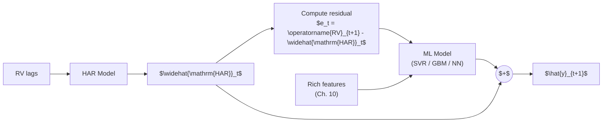
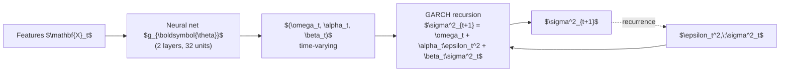
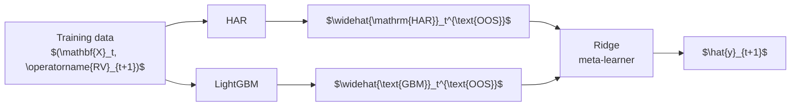
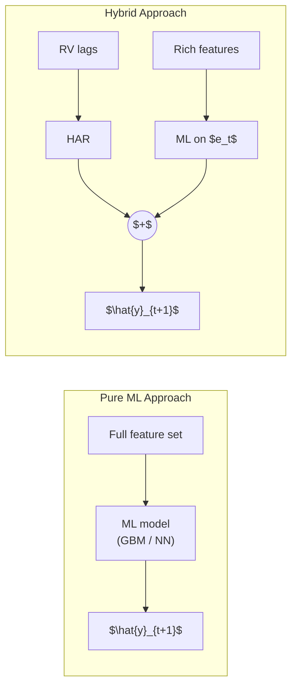

# Hybrid and Ensemble Models

## Why This Chapter Matters

> **Application: From Components to Combinations**
>
> [Ch. 11](ch11-trees-boosting.md) and [Ch. 12b](ch12b-deep-learning-vol.md) showed that ML models
> improve on HAR primarily through richer features and nonlinear interactions,
> not by replacing the linear structure that HAR captures well. This chapter
> asks: why not let HAR handle the linear part and train ML only on the
> residual? Hybrid models do this, and they are the safest bet in the
> volatility forecasting literature (Rahimikia and Poon, 2020). Project 1
> (HARQ-X with ML Residual Augmentation) is a hybrid by design.

You already have two powerful toolkits: the econometric models of
[Ch. 5](ch05-garch-models.md)--[Ch. 7](ch07-har-models.md) and the machine-learning models of
[Ch. 11](ch11-trees-boosting.md)--[Ch. 12b](ch12b-deep-learning-vol.md). Each has blind spots.
HAR is parsimonious but linear; gradient-boosted trees are flexible but
hungry for signal. This chapter shows you how to combine them so that
each component operates where it is strongest.

The core philosophy is simple: *decompose*, then *specialize*.
Let a well-understood econometric model absorb the predictable structure,
then aim the full power of ML at whatever remains. The resulting hybrid
almost always outperforms either component alone, and it does so with
lower variance and greater interpretability than a pure ML
approach (Rahimikia and Poon, 2020).

## Why Hybrids Win

### The Variance Budget Argument

Consider a forecast target $\operatorname{RV}_{t+1}$. A fitted HAR model typically
explains 40--60% of next-day realized-volatility variation with just three
coefficients (Rahimikia and Poon, 2020). That leaves 40--60% in the
residual $e_t = \operatorname{RV}_{t+1} - \widehat{\mathrm{HAR}}_t$. If you train an ML model
directly on $\operatorname{RV}_{t+1}$, it must rediscover the linear structure that HAR
already captures perfectly, wasting model capacity and inviting overfitting.
If instead you train on $e_t$, three things change for the better:

1. **HAR never overfits.** Three coefficients on lagged
   averages cannot memorize noise, so the linear component is
   rock-solid out of sample.
2. **Residual targets have lower variance.** The signal-to-noise
   ratio for the ML component improves because you have removed the
   dominant low-frequency trend.
3. **Ensemble diversification.** Even if the ML model adds only
   modest accuracy, combining two weakly correlated forecasters reduces
   overall forecast variance by the standard diversification
   identity (Rahimikia and Poon, 2020).

> **Key Idea: Let HAR Do the Heavy Lifting**
>
> If HAR explains 60% of next-day $\operatorname{RV}$ with 3 coefficients, let it.
> Train ML on the residual. You get the reliability of HAR plus the
> flexibility of ML, without asking either model to do the other's job.

### Variance Decomposition

The figure below illustrates the variance budget argument visually. The total variance of next-day RV is split into what HAR explains, what ML can capture from the residual, and irreducible noise.

**Figure:** Variance budget for next-day RV forecasting. HAR absorbs the dominant linear signal cheaply; ML targets only the residual variance, where the signal-to-noise ratio is lower but nonlinear patterns exist. Noise is irreducible regardless of model complexity.

### Architecture Diagram

The figure below illustrates the two-stage hybrid pipeline that recurs throughout this chapter. The key insight is that the ML model never sees the raw target; it only sees the residual that HAR could not explain.

**Figure:** Two-stage hybrid pipeline. HAR absorbs the linear trend; ML targets only the residual. The final forecast sums both components.

## HAR-SVR: Support Vector Regression on HAR Residuals

### Intuition

Support vector regression (SVR) is a natural first choice for the residual
stage because its $\varepsilon$-insensitive loss function automatically
ignores small residuals. If the HAR fit is already good for most days,
many residuals will be near zero. SVR treats those as "correct enough"
and focuses capacity on the days where HAR fails most, such as
post-jump or regime-change dates (Rahimikia and Poon, 2020).

> **Intuition: Why SVR Suits Residuals**
>
> SVR's $\varepsilon$-tube acts as a built-in noise filter. Days where HAR
> is close enough (residual inside the tube) contribute zero loss. SVR
> concentrates its support vectors on the hard cases, which is exactly what
> you want when most of the signal has already been removed.

### Procedure

1. Fit HAR on the training set:

   $$\widehat{\mathrm{HAR}}_t = \hat{\beta}_0
     + \hat{\beta}_d\,\operatorname{RV}_{t}
     + \hat{\beta}_w\,\operatorname{RV}_{t}^{(w)}
     + \hat{\beta}_m\,\operatorname{RV}_{t}^{(m)}.$$

2. Compute training residuals:

   $$e_t = \operatorname{RV}_{t+1} - \widehat{\mathrm{HAR}}_t.$$

   > **Intuition: In Plain English**
   >
   > Steps 1--2 are the "let HAR go first" principle in action.
   > You fit a standard HAR model, record its predictions, and then
   > subtract those predictions from the actual realized volatility.
   > The residual $e_t$ is everything HAR could not explain: jump
   > effects, leverage asymmetry, regime shifts, and noise. The ML
   > model in the next step will see only this leftover signal.

   > **Project Connection: Why This Matters**
   >
   > This two-step decomposition is the backbone of Project Direction 1
   > (HARQ-X + ML residual). Because HARQ already adapts its
   > coefficients to measurement-error regimes, its residuals are
   > even cleaner than plain HAR residuals, giving the downstream ML
   > model a higher signal-to-noise starting point.

3. Construct a feature matrix $\mathbf{X}_t$ from the feature engineering
   toolkit of [Ch. 10](ch10-feature-engineering.md) (jump indicators, leverage,
   signed volatility, VIX basis, microstructure noise proxies).

4. Fit SVR with radial basis function (RBF) kernel on $(e_t, \mathbf{X}_t)$:

   $$\min_{w,b}\;\frac{1}{2}\|w\|^2
     + C\sum_{t=1}^{T}\max\!\bigl(0,\,|e_t - f(\mathbf{X}_t)| - \varepsilon\bigr),$$

   where each term is:
   - $\frac{1}{2}\|w\|^2$ -- the regularization penalty that controls model complexity,
   - $C$ -- the trade-off parameter between margin width and training error,
   - $\varepsilon$ -- the tube width; residuals smaller than $\varepsilon$ in absolute value incur zero loss,
   - $f(\mathbf{X}_t) = w^\top \phi(\mathbf{X}_t) + b$ -- the SVR prediction in the kernel-induced feature space.

   > **Intuition: In Plain English**
   >
   > The SVR loss function says: "If my prediction is within
   > $\varepsilon$ of the true residual, call it good enough and move
   > on. Only penalize me for the amount I miss by beyond that
   > tolerance." The regularization term $\frac{1}{2}\|w\|^2$ keeps
   > the model simple, and $C$ controls how aggressively you chase
   > the outlier residuals versus keeping the model smooth.

   > **Project Connection: Why This Matters**
   >
   > In a HARQ-X + ML residual pipeline, most residuals will be small
   > because HARQ already captures the dominant linear dynamics. The
   > $\varepsilon$-tube ensures the SVR does not waste capacity fitting
   > noise on those easy days. Instead, it concentrates support
   > vectors on post-jump and regime-shift days where HARQ
   > underperforms, which is exactly where forecasting gains translate
   > into economic value.

5. Produce the combined forecast:

   $$\hat{y}_{t+1} = \widehat{\mathrm{HAR}}_t + \widehat{\text{SVR}}(\mathbf{X}_t).$$

   > **Intuition: In Plain English**
   >
   > The final forecast is simply the HAR prediction plus the SVR
   > correction. On days where HAR is already accurate, SVR's
   > correction is near zero (inside the $\varepsilon$-tube). On days
   > where HAR struggles, SVR adds a nonlinear adjustment. You never
   > discard the HAR forecast; you only add to it.

   > **Project Connection: Why This Matters**
   >
   > This additive structure means you can always decompose your final
   > forecast into "what HAR said" and "what ML corrected." That
   > decomposition is critical for interpretability at Goldman Sachs:
   > you can explain the linear component with HAR coefficients and
   > use SHAP values to explain the ML correction, giving the desk a
   > complete audit trail.

> **Warning: Tune $\varepsilon$ Carefully**
>
> Setting $\varepsilon$ too large makes the SVR ignore all residuals.
> Setting it too small turns SVR into standard squared-loss regression and
> removes the noise-filtering benefit. Cross-validate $\varepsilon$ on
> $\operatorname{QLIKE}$ or MSE, not on the number of support vectors.

## GARCH-Informed Neural Networks

### Motivation

The models in earlier sections use a two-stage pipeline: fit an econometric model, then correct its errors. GARCH-Informed Neural Networks (GINN) take a different approach. They hard-wire the GARCH recursion directly into the neural network architecture so that the network learns corrections to the GARCH parameters rather than learning the entire volatility dynamics from scratch (Li et al., 2024).

> **Key Idea: GINN = Residual Learning for GARCH**
>
> GINN is to GARCH what a residual network is to a feedforward net.
> Instead of asking the network to learn $\sigma^2_{t+1}$ from raw data,
> you give it the GARCH update equation as a scaffold and let the network
> learn only the deviations. This dramatically reduces the function space
> the network must search.

### Architecture

The standard GARCH(1,1) update is

$$\sigma^2_{t+1} = \omega + \alpha\,\epsilon_t^2 + \beta\,\sigma^2_t.$$

> **Intuition: In Plain English**
>
> Tomorrow's variance equals a long-run average ($\omega$) plus a fraction
> of today's squared shock ($\alpha\,\epsilon_t^2$) plus a fraction of
> today's variance ($\beta\,\sigma^2_t$). The parameters $\alpha$ and
> $\beta$ are fixed for all time, which means the model treats calm
> markets and crisis markets with the same update rule.

GINN replaces the fixed parameters $(\omega, \alpha, \beta)$ with
time-varying outputs of a neural network $g_{\boldsymbol{\theta}}$:

$$\sigma^2_{t+1} = \omega_t + \alpha_t\,\epsilon_t^2
  + \beta_t\,\sigma^2_t,
  \qquad
  (\omega_t, \alpha_t, \beta_t) = g_{\boldsymbol{\theta}}(\mathbf{X}_t),$$

where each term is:
- $g_{\boldsymbol{\theta}}(\mathbf{X}_t)$ -- a small feedforward network (typically 2 hidden layers, 32--64 units each) that maps auxiliary features $\mathbf{X}_t$ to time-varying GARCH parameters,
- $\omega_t, \alpha_t, \beta_t$ -- the GARCH coefficients at time $t$, constrained to satisfy $\omega_t > 0$, $\alpha_t \geq 0$, $\beta_t \geq 0$, and $\alpha_t + \beta_t < 1$ via softmax and sigmoid output activations (Li et al., 2024),
- $\epsilon_t^2$ -- the squared innovation (return shock),
- $\sigma^2_t$ -- the previous conditional variance, fed back recurrently.

> **Intuition: In Plain English**
>
> GINN keeps the GARCH update rule but lets a neural network adjust the
> knobs ($\omega$, $\alpha$, $\beta$) at each time step based on auxiliary
> features. During calm markets the network can set $\beta$ high (strong
> persistence); after a jump it can raise $\alpha$ (more reactive to
> shocks). The GARCH skeleton is never discarded, so the model
> automatically inherits volatility clustering and mean reversion.

> **Project Connection: Why This Matters**
>
> GINN's time-varying parameters are conceptually parallel to HARQ's
> measurement-error-weighted coefficients. Both models ask: "What if
> the parameters themselves depend on the current regime?" If you
> extend HARQ with a neural network that modulates $\beta_d$, $\beta_w$,
> $\beta_m$ based on jump intensity or microstructure noise, you are
> building a HAR analogue of GINN, and the GINN literature provides the
> architectural blueprint.

**Figure:** GINN architecture. A neural network produces time-varying GARCH parameters; the GARCH recursion itself is hard-wired, not learned.

### Why This Works

The key advantage is that GINN preserves the inductive bias of GARCH:
volatility clusters, shocks decay exponentially, and the unconditional
variance is finite. The neural network modulates these dynamics based on
auxiliary information (sentiment, jump indicators, cross-asset signals)
without having to discover the clustering structure itself.
Li et al. (2024) show that GINN matches or outperforms both standard
GARCH and unconstrained LSTMs on equity index volatility, with
substantially fewer parameters than the LSTM.

## NLP-Augmented Volatility Models

### Motivation

News moves volatility, and the effect is asymmetric: negative news
amplifies $\operatorname{RV}$ far more than positive news calms it.
Rahimikia, Zohren, and Poon (2021) ask whether a machine-readable
news signal can improve HAR forecasts. The answer is yes, but modestly
and conditionally.

### The Rahimikia-Zohren-Poon Pipeline

The procedure has three stages:

1. **Text embedding.** Collect financial news headlines
   (e.g., from Dow Jones Newswires) for each trading day. Train
   a Word2Vec skip-gram model on a financial corpus to obtain
   300-dimensional word vectors (*FinText*). Arrange each
   day's tokens into a $500 \times 300$ sentence matrix (padding
   shorter sequences), then feed it through a convolutional neural
   network (CNN) with multiple filter sizes that learns to map
   the text directly to a volatility
   forecast (Rahimikia, Zohren, and Poon, 2021).

2. **Augmented HAR (simplified view).** The simplest way to
   incorporate a text signal is to append a summary sentiment score
   $s_t$ to the standard HAR regression:

   $$\operatorname{RV}_{t+1} = \beta_0 + \beta_d\,\operatorname{RV}_t
     + \beta_w\,\operatorname{RV}_t^{(w)} + \beta_m\,\operatorname{RV}_t^{(m)}
     + \gamma\,s_t + \varepsilon_{t+1},$$

   where:
   - $s_t$ -- the daily text-derived signal (negative values indicate bearish tone),
   - $\gamma$ -- the text loading; if news carries incremental information beyond lagged $\operatorname{RV}$, then $\gamma \neq 0$.

   In practice, Rahimikia, Zohren, and Poon (2021) go further:
   their NLP-ML model feeds the $500 \times 300$ sentence matrix
   directly into the CNN, bypassing the sentiment-score bottleneck.
   The linear augmented-HAR equation above is a useful pedagogical
   simplification that captures the same core idea: text provides
   an exogenous signal beyond lagged $\operatorname{RV}$.

   > **Intuition: In Plain English**
   >
   > The key insight is that news text can carry information about
   > tomorrow's volatility that lagged RV alone does not capture.
   > Whether you inject that signal as a single sentiment score in
   > a linear regression or let a CNN learn a richer representation,
   > the principle is the same: combine text with the HAR baseline.

   > **Project Connection: Why This Matters**
   >
   > At Goldman Sachs you may have access to proprietary news feeds
   > or internal research sentiment. Public NLP signals show modest
   > and conditional improvements -- primarily on volatility jump
   > days -- but a curated internal signal could do better. More
   > importantly, this equation shows the general template for
   > augmenting HAR with any exogenous feature: just add it as an
   > extra regressor and test whether $\gamma \neq 0$.

3. **Evaluation.** Compare $\operatorname{QLIKE}$ loss of HAR vs.
   HAR+NLP across the full sample and conditional on high-volatility
   periods.

### What the Literature Finds

Rahimikia, Zohren, and Poon (2021) find that NLP-ML models
strongly outperform HAR-family models on *volatility jump days*
(roughly the top 10% of RV observations) but underperform on normal
volatility days. During calm markets, the text signal adds
negligible information because lagged $\operatorname{RV}$ already captures the
low-volatility regime; the gains are concentrated in high-volatility
episodes where news carries incremental content.

> **Warning: NLP Gains Are Small and Fragile**
>
> A 1--3% $\operatorname{QLIKE}$ improvement is economically meaningful only if you
> trade on volatility forecasts at scale. The improvement is
> sample-dependent, sensitive to the choice of news source, and does not
> survive aggressive transaction costs in short-horizon
> strategies (Rahimikia, Zohren, and Poon, 2021). Do not overfit to the
> headline number.

Rahimikia and Poon (2020) provide additional evidence that hybrid models
combining econometric baselines with text-derived features outperform
pure text-based approaches, reinforcing the "let the baseline work
first" principle of this chapter.

## Ensemble: HAR + LightGBM

### The Safest Performer

If you must choose one approach from this chapter for a production
volatility forecast, choose a weighted average of HAR and LightGBM.
It is simple, robust, and remarkably hard to beat. Two combination
strategies dominate practice.

#### Strategy A: Fixed Weighted Average

Choose a fixed weight $w \in [0,1]$ and combine:

$$\hat{y}_{t+1} = w\,\widehat{\mathrm{HAR}}_t + (1-w)\,\widehat{\text{GBM}}_t,$$

where:
- $w$ -- the HAR weight, typically calibrated on a validation set or set to $w = 0.7$ as a robust default,
- $\widehat{\mathrm{HAR}}_t$ -- the HAR forecast,
- $\widehat{\text{GBM}}_t$ -- the LightGBM forecast trained on the full feature set of [Ch. 10](ch10-feature-engineering.md).

> **Intuition: In Plain English**
>
> The combined forecast is a simple weighted average of two models. With
> $w = 0.7$, you are saying "I trust HAR for 70% of the forecast and
> let LightGBM contribute the remaining 30%." This is the forecast
> analogue of portfolio diversification: even if LightGBM is noisier than
> HAR, blending the two reduces overall forecast variance as long as their
> errors are not perfectly correlated.

> **Project Connection: Why This Matters**
>
> A fixed 70/30 blend is the simplest credible baseline for the internship
> project. Before investing time in stacking or neural residual models,
> demonstrate that this blend already beats standalone HAR on QLIKE.
> The weight $w$ can be optimized by minimizing QLIKE on a validation set,
> which directly aligns the combination with the project's primary
> evaluation metric.

> **Key Idea: The 70/30 Rule**
>
> A 70/30 HAR/LightGBM blend is remarkably hard to beat. It inherits HAR's
> stability in calm markets and LightGBM's ability to capture nonlinear
> effects during crises. You can optimize $w$ on validation data, but the
> gain over a fixed 70/30 split is usually small.

#### Strategy B: Stacking with Ridge Meta-Learner

Instead of fixing $w$, learn the combination weights via ridge regression
on out-of-sample predictions:

1. Generate OOS predictions from HAR and LightGBM using
   time-series cross-validation (expanding or rolling window).

2. Stack these predictions as features and fit a ridge regression:

   $$\hat{y}_{t+1} = \alpha_0 + \alpha_1\,\widehat{\mathrm{HAR}}_t^{\text{OOS}}
     + \alpha_2\,\widehat{\text{GBM}}_t^{\text{OOS}},$$

   where:
   - $\widehat{\mathrm{HAR}}_t^{\text{OOS}}$ and $\widehat{\text{GBM}}_t^{\text{OOS}}$ are out-of-sample predictions from the base models,
   - $\alpha_0, \alpha_1, \alpha_2$ are learned by ridge regression with penalty $\lambda$ chosen by cross-validation,
   - the ridge penalty prevents the meta-learner from overfitting to the small differences between base models.

   > **Intuition: In Plain English**
   >
   > Instead of fixing the blend weights by hand, you let the data
   > decide. You generate out-of-sample predictions from each base
   > model (so the meta-learner never sees in-sample fits), then run
   > a simple ridge regression that learns how much to trust each
   > model. The intercept $\alpha_0$ corrects any systematic bias,
   > and the ridge penalty prevents the meta-learner from overfitting
   > to noise in the small differences between HAR and LightGBM.

   > **Project Connection: Why This Matters**
   >
   > Stacking is the natural upgrade path from a fixed 70/30 blend.
   > If your project has multiple candidate models (HARQ, HARQ-X,
   > LightGBM, SVR), stacking lets you combine all of them in a
   > principled way. Critically, the meta-learner can be trained by
   > minimizing QLIKE rather than MSE, ensuring the combination
   > weights are aligned with the project's primary loss function.

### Architecture Diagram

**Figure:** Stacking architecture. Base models produce OOS predictions; a ridge meta-learner learns the optimal combination.

## Comparing Ensemble Architectures

So far this chapter has presented two combination strategies for HAR and
LightGBM: a fixed weighted average and a ridge meta-learner on OOS
predictions. Both are instances of a broader design choice: how do you
wire multiple models together? Three architectures dominate the ensemble
literature, and each answers that question differently. Understanding
their tradeoffs is essential before committing to one for a production
volatility pipeline.

### Architecture A: Feature Stacking

**Feature stacking** concatenates the internal representation of one
model with the input features of another, training a single downstream
model on the combined feature set. In the volatility context, this
typically means training an LSTM on intraday sequences (e.g., 5-minute
E-mini bars) to produce a $k$-dimensional **embedding vector**,
then appending that embedding to the tabular feature matrix before
training LightGBM.

The combined feature vector fed to LightGBM becomes:

$$\tilde{\mathbf{X}}_t = \bigl[\,\mathbf{X}_t^{\text{tab}} \;\|\;
  \mathbf{h}_t^{\text{LSTM}}\,\bigr],$$

where each term is:
- $\mathbf{X}_t^{\text{tab}}$ -- the tabular feature matrix (RV lags, jump indicators, leverage, microstructure proxies, cross-asset signals) from [Ch. 10](ch10-feature-engineering.md),
- $\mathbf{h}_t^{\text{LSTM}}$ -- the $k$-dimensional embedding vector extracted from the LSTM's final hidden state after processing the intraday sequence,
- $\|$ -- concatenation along the feature axis.

> **Intuition: In Plain English**
>
> Think of the LSTM as a feature extractor: it reads a day's worth of
> 5-minute bars and compresses them into a short summary vector.
> LightGBM then treats that summary as additional columns alongside the
> usual tabular features. The hope is that the LSTM captures intraday
> dynamics (order flow imbalances, microstructure noise patterns) that
> tabular statistics miss, and the tree can exploit those dynamics
> alongside everything else.

#### The Gradient Isolation Problem

Feature stacking has a fundamental flaw: **gradient isolation**.
LightGBM is a tree-based model, so it cannot compute gradients with
respect to its inputs. This means the LSTM embedding
$\mathbf{h}_t^{\text{LSTM}}$ is never optimized for the tree's $\operatorname{QLIKE}$
objective. The LSTM learns representations that minimize its own loss
function (typically MSE on log-RV), and the tree uses that
representation as-is, whether or not it is what the tree needs.

Contrast this with an end-to-end neural architecture where you could
backpropagate from the final loss through both components. In feature
stacking, the two models live in separate optimization worlds:

1. The LSTM is trained to minimize $\mathcal{L}_{\text{LSTM}}$ on intraday sequences.
2. The embedding $\mathbf{h}_t$ is frozen and appended to $\mathbf{X}_t$.
3. LightGBM is trained to minimize $\mathcal{L}_{\text{GBM}}$ on $\tilde{\mathbf{X}}_t$, treating $\mathbf{h}_t$ as fixed columns.

If the embedding encodes information in a format that tree splits
cannot exploit efficiently (e.g., information spread across multiple
embedding dimensions in a way that requires linear combinations),
LightGBM will underuse it. Worse, you cannot tell from the final
forecast error whether a bad prediction came from a bad embedding or
bad tree splits.

> **Warning: Gradient Isolation Breaks Joint Optimization**
>
> Because LightGBM cannot backpropagate into the LSTM, the embedding is
> optimized for the wrong objective. The LSTM minimizes its own loss;
> the tree minimizes a different loss on fixed embeddings. There is no
> mechanism to align the two. This is not a theoretical concern: it
> means the LSTM may learn to encode information that is useful for its
> own predictions but redundant or inaccessible to the tree.

### Architecture B: Residual Stacking (Three-Stage Pipeline)

The HAR-SVR section introduced the two-stage residual
hybrid: HAR first, then SVR on the residuals. **Residual
stacking** generalizes this to three or more stages, where each model
trains on the residuals left by all prior stages. The canonical
three-stage pipeline for volatility forecasting is:

1. **Stage 1 -- HAR (linear baseline).** Fit HAR on the
   training set. HAR captures the dominant
   multi-scale autoregressive structure of realized volatility.
   Compute residuals: $e_t^{(1)} = \operatorname{RV}_{t+1} -
   \widehat{\mathrm{HAR}}_t$.

2. **Stage 2 -- LightGBM (nonlinear interactions).** Train
   LightGBM on Stage 1 residuals $e_t^{(1)}$ using the full
   tabular feature set. The tree captures nonlinear patterns that
   HAR misses: regime interactions, jump-asymmetry effects,
   cross-asset spillovers. Compute residuals:
   $e_t^{(2)} = e_t^{(1)} - \widehat{\text{GBM}}(e_t^{(1)},
   \mathbf{X}_t)$.

3. **Stage 3 -- LSTM (sequential dynamics).** Train an
   LSTM on Stage 2 residuals $e_t^{(2)}$ using intraday sequences.
   If any temporal structure remains after the tree has operated,
   the recurrent network can capture it. This stage is optional:
   if Stage 2 residuals are indistinguishable from white noise, the
   LSTM adds nothing and should be dropped.

The final forecast sums all stage contributions:

$$\hat{y}_{t+1} = \widehat{\mathrm{HAR}}_t
  + \widehat{\text{GBM}}(\mathbf{X}_t)
  + \widehat{\text{LSTM}}(\mathbf{X}_t^{\text{seq}}),$$

where each term is:
- $\widehat{\mathrm{HAR}}_t$ -- the HAR baseline forecast,
- $\widehat{\text{GBM}}(\mathbf{X}_t)$ -- the LightGBM correction trained on HAR residuals with tabular features,
- $\widehat{\text{LSTM}}(\mathbf{X}_t^{\text{seq}})$ -- the LSTM correction trained on Stage 2 residuals with intraday sequences (set to zero if Stage 3 is dropped).

> **Intuition: In Plain English**
>
> Residual stacking is like a relay race. HAR runs the first leg and
> explains everything it can with three coefficients. LightGBM picks up
> what HAR dropped -- the nonlinear, interaction-driven patterns in the
> leftover signal. If there is still structure remaining (temporal
> dependencies in the second-stage residuals), an LSTM runs the final
> leg. Each runner is specialized by construction: you never ask a model
> to redo work that a prior stage already handled. This is the
> three-stage extension of the HAR-SVR pipeline, replacing SVR with LightGBM and
> adding an optional LSTM stage.

> **Project Connection: Residual Stacking Is Your Default Architecture**
>
> This three-stage pipeline maps directly onto the HARQ-X + ML residual
> direction. HARQ-X replaces plain HAR in Stage 1, giving even cleaner
> residuals because measurement-error adaptation removes a source of
> variation before the tree ever sees the data. Stage 2 (LightGBM on
> residuals) is where most of the incremental $\operatorname{QLIKE}$ improvement will
> come from. Stage 3 (LSTM on intraday sequences) is the optional
> upgrade path: add it only if you have evidence that Stage 2 residuals
> contain exploitable temporal structure.

Why does residual stacking avoid the gradient isolation problem?
Because each model trains directly on a well-defined target (the
residuals from the prior stage), using a loss function that is directly
aligned with that target. There are no frozen embeddings, no
cross-model feature coupling. If Stage 2 performs poorly, you know it
is because LightGBM cannot explain the HAR residuals, not because some
upstream embedding was misaligned.

### Architecture C: Prediction Blending

**Prediction blending** is the simplest ensemble architecture:
train each model independently, then combine their final predictions
with a weighted average. This is what the HAR + LightGBM ensemble section already covers with the fixed 70/30
blend and the ridge meta-learner. The key distinction from the other
architectures is that models never share information during training.
Each model sees the original target $\operatorname{RV}_{t+1}$ (not a residual) and
the features best suited to its architecture.

The general blending formula for $K$ models is:

$$\hat{y}_{t+1} = \sum_{k=1}^{K} w_k\,\hat{y}_{t+1}^{(k)},
  \qquad \sum_{k=1}^{K} w_k = 1,$$

where each term is:
- $\hat{y}_{t+1}^{(k)}$ -- the independent forecast from model $k$,
- $w_k$ -- the blend weight for model $k$, constrained to sum to one (though a ridge meta-learner relaxes this constraint).

> **Intuition: In Plain English**
>
> Prediction blending is forecast-level diversification. Each model
> makes its best guess independently, and you take a weighted average.
> No model sees what the others are doing during training. This is the
> ensemble equivalent of portfolio diversification: even if individual
> forecasters are noisy, their weighted average has lower variance as
> long as errors are imperfectly correlated.

#### Weight Schemes

Two approaches to setting blend weights:

**Static weights.**
Choose weights once on a validation set and hold them fixed. The
simplest principled choice is **inverse-$\operatorname{QLIKE}$ weighting**:

$$w_k = \frac{\operatorname{QLIKE}_k^{-1}}{\sum_{j=1}^{K}\operatorname{QLIKE}_j^{-1}},$$

where each term is:
- $\operatorname{QLIKE}_k$ -- the $\operatorname{QLIKE}$ loss of model $k$ on the validation set,
- $\operatorname{QLIKE}_k^{-1}$ -- the inverse loss; models with lower (better) $\operatorname{QLIKE}$ receive higher weight.

> **Intuition: In Plain English**
>
> Inverse-$\operatorname{QLIKE}$ weighting says: "Trust each model in proportion to
> how well it performed on validation data." A model with half the
> $\operatorname{QLIKE}$ loss of another gets twice the weight. This is a one-line
> formula that requires no optimization and aligns directly with the
> project's primary evaluation metric.

**Regime-dependent weights.**
Use different blend weights in different volatility regimes. For
example, give more weight to LightGBM during high-volatility periods
(where nonlinear effects dominate) and more weight to HAR during calm
periods (where the linear structure is sufficient). The section on static vs. regime-dependent weights below discusses when this helps and when it does not.

#### Competition Evidence

Top-performing solutions in the Optiver Realized Volatility
competition (Optiver, 2021) consistently chose prediction blending
over feature stacking. Winners trained LightGBM and neural network
branches independently, then combined outputs with simple weighted
averages. The rationale: prediction blending is easier to debug
(each branch can be evaluated in isolation), easier to iterate on
(swap one branch without retraining others), and provides a natural
fallback strategy (if one branch degrades, drop it and reweight).

> **Key Idea: Prediction Blending: Simplest and Often Best**
>
> Prediction blending requires no cross-model coupling, no shared
> training, and no sequential dependencies. Each model can be
> developed, validated, and debugged in isolation. Despite its
> simplicity, competition evidence from Optiver (2021)
> shows it matches or outperforms more complex architectures. It should
> be the default ensemble strategy unless you have specific evidence that
> residual stacking improves $\operatorname{QLIKE}$.

### Architecture Comparison

The table below summarizes the tradeoffs across the three architectures on five dimensions that matter for a production volatility pipeline.

**Table: Three-way ensemble architecture comparison for volatility forecasting.**

| Dimension | Feature Stacking | Residual Stacking | Prediction Blending |
|---|---|---|---|
| Complexity | High (joint training, embedding pipeline) | Moderate (sequential stages) | Low (independent models) |
| Gradient flow | Broken (tree cannot backprop into LSTM) | Clean (each stage has its own target) | N/A (no cross-model coupling) |
| Interpretability | Opaque (embedding dimensions lack semantics) | Clear (each stage's contribution is additive and measurable) | Clear (individual model forecasts are directly comparable) |
| Fallback strategy | Must retrain tree without embedding | Drop later stages; keep HAR + LightGBM | Drop one model; reweight the rest |
| Literature support | Weak (no RV paper demonstrates gains) | Strong (HARQ-X residual literature) | Strong (Optiver, 2021); Kaggle competition evidence |

> **Intuition: Reading the Comparison Table**
>
> The table reveals a clear pattern: moving from left to right (feature
> stacking to residual stacking to prediction blending), complexity
> decreases, debuggability increases, and literature support strengthens.
> Feature stacking sounds appealing in theory -- richer input to the
> tree -- but gradient isolation undermines the premise. Residual
> stacking gives each model a distinct role by construction. Prediction
> blending is the simplest and most robust, requiring no architectural
> coupling between models at all.

### Static vs. Regime-Dependent Weights

Static blend weights assume that the relative accuracy of each model is
stable over time. This is often a good approximation for realized
volatility: HAR's linear structure captures most of the signal in calm
and turbulent markets alike. But there are situations where model
performance varies systematically across regimes, and regime-dependent
weights can help.

**Regime-dependent weighting** assigns different blend weights
depending on the current volatility regime:

$$w_k(t) =
  \begin{cases}
    w_k^{\text{low}} & \text{if } \operatorname{RV}_t^{(w)} < \tau, \\
    w_k^{\text{high}} & \text{if } \operatorname{RV}_t^{(w)} \geq \tau,
  \end{cases}$$

where each term is:
- $\operatorname{RV}_t^{(w)}$ -- the weekly realized volatility, used as a regime indicator,
- $\tau$ -- the regime threshold (e.g., the 75th percentile of the training-set $\operatorname{RV}^{(w)}$ distribution),
- $w_k^{\text{low}}, w_k^{\text{high}}$ -- separate blend weights for the low-volatility and high-volatility regimes, each calibrated on the corresponding subset of the validation data.

> **Intuition: In Plain English**
>
> If LightGBM consistently outperforms HAR during high-volatility weeks
> but underperforms during calm weeks, it makes sense to shift weight
> toward LightGBM when volatility is elevated and toward HAR when
> markets are quiet. Regime-dependent weights let you exploit this
> pattern. But the key word is "consistently" -- if the performance
> difference across regimes is noisy or unstable, regime conditioning
> adds complexity without improving accuracy.

> **Warning: Regime Weights Require Stable Performance Differences**
>
> Regime-dependent weights help only when model accuracy varies
> *systematically* across regimes, not just randomly. If the
> performance gap between HAR and LightGBM in high-vol vs. low-vol
> periods is unstable across rolling windows, regime conditioning will
> overfit to historical patterns that do not persist out of sample.
> Test for systematic variation before adding this complexity: compute
> model $\operatorname{QLIKE}$ separately in each regime on multiple validation folds
> and check whether the ranking is consistent.

> **Project Connection: Start Static, Upgrade If Justified**
>
> For the internship project, begin with static inverse-$\operatorname{QLIKE}$
> weights. After establishing the baseline blend performance, split the
> validation set by volatility regime and compare per-regime $\operatorname{QLIKE}$ for
> each model. If you find that LightGBM's advantage over HARQ-X is
> concentrated in high-volatility weeks (as the leverage-effect
> literature suggests it should be), regime-dependent weights are a
> justified upgrade. Document the per-regime performance gap as evidence.

## When to Use Pure ML vs. Hybrid

The table below summarizes the practical decision you face when choosing
a forecasting architecture. The default should be hybrid; deviate only
with good reason.

**Table: Architecture decision guide for volatility forecasting.**

| Architecture | Best When | Feature Set | Typical Setting |
|---|---|---|---|
| Pure HAR / HARQ | Only RV lags available; small sample ($<500$ days) | RV lags only | Quick benchmark; limited data access |
| Hybrid (HAR + ML) | Rich features available; daily or weekly horizon; reliability matters | RV lags + engineered features | Production forecasts; research baseline |
| Pure trees (GBM/XGB) | Rich features; intraday horizons; large sample ($>2000$ days) | Full feature set | High-frequency desks; feature importance studies |
| Pure deep learning | Raw sequential data; cross-asset pooling; very large sample | Raw returns / order flow | Multi-asset platforms; representation learning |

> **Key Idea: Default to Hybrid**
>
> Your default architecture should be hybrid, not pure ML. Start with HAR
> as a backbone and add ML complexity only where the residuals justify it.
> You earn the right to go pure ML only when you have a large sample, rich
> features, and evidence that the linear baseline leaves substantial
> structure in the residuals (Rahimikia and Poon, 2020).

### Practical Checklist

Before committing to an architecture, answer these questions:

1. **How large is your sample?** Below 500 daily observations, pure HAR is hard to beat. ML needs data.
2. **Do you have features beyond RV lags?** If not, a hybrid adds nothing because the ML stage has no new information.
3. **What is your forecast horizon?** At weekly or monthly horizons, HAR's multi-scale structure dominates. ML gains concentrate at the daily horizon.
4. **How much do you value interpretability?** HAR coefficients are directly interpretable. A hybrid with SHAP on the ML component preserves partial interpretability. Pure deep learning sacrifices it.
5. **What is your retraining budget?** Hybrids are cheap: refit HAR monthly, retrain ML weekly. Pure deep learning demands more compute.

### Standalone vs. Hybrid: A Visual Comparison

The figure below contrasts the pure ML approach (left) with the hybrid approach (right). The key difference: in the hybrid, ML operates on a reduced-variance target, which yields lower estimation error and better out-of-sample stability.

**Figure:** Pure ML (left) must rediscover the linear trend that HAR captures for free. The hybrid (right) lets HAR absorb the trend and focuses ML on the residual, reducing both model complexity and overfitting risk.

## Summary

- Hybrid models decompose the forecasting problem into a linear component (HAR, GARCH) and a nonlinear residual component (ML), allowing each method to operate where it is strongest.
- HAR explains 40--60% of next-day RV with three coefficients; training ML on the residual rather than the raw target improves signal-to-noise and prevents the ML model from wasting capacity on structure that a linear model already captures.
- HAR-SVR uses support vector regression with an $\varepsilon$-insensitive loss on HAR residuals, automatically ignoring days where HAR is "close enough" and focusing on the hard cases.
- GINN hard-wires the GARCH recursion into a neural network, letting the network learn time-varying corrections to GARCH parameters rather than learning volatility dynamics from scratch (Li et al., 2024).
- NLP-augmented HAR (Word2Vec sentiment) yields 1--3% $\operatorname{QLIKE}$ improvement concentrated in crisis periods, but gains are fragile and source-dependent (Rahimikia, Zohren, and Poon, 2021).
- A simple 70/30 HAR/LightGBM weighted average is the safest production choice and is remarkably hard to beat with more complex ensembles.
- Stacking via a ridge meta-learner on OOS predictions adapts the combination weights to the data while guarding against overfitting at the meta-level.
- Three ensemble architectures offer increasing simplicity: feature stacking (coupling via embeddings, broken gradient flow), residual stacking (sequential stages with distinct roles), and prediction blending (fully independent models, weighted average).
- Feature stacking suffers from gradient isolation: LightGBM cannot backpropagate into the LSTM, so the embedding is never optimized for the tree's objective.
- Residual stacking (HAR $\to$ LightGBM $\to$ LSTM) gives each model a specialized role by construction and avoids cross-model coupling.
- Prediction blending is the simplest, most debuggable architecture and is supported by Optiver competition evidence (Optiver, 2021).
- Static blend weights (e.g., inverse-$\operatorname{QLIKE}$ weighting) are the default; regime-dependent weights help only when model performance varies systematically across volatility regimes.
- Pure ML (trees or deep learning) earns its place only when you have large samples, rich features, and evidence that the linear baseline leaves exploitable structure in residuals.
- Your default architecture should be hybrid: let HAR do the heavy lifting, then train ML on what remains.
- When evaluating hybrids, always report the base model's standalone performance alongside the hybrid, so the reader can judge the marginal contribution of the ML component.
- Ensemble diversification provides error reduction even when the ML component is only modestly accurate, as long as its errors are weakly correlated with the base model's errors.
- All combination weights and meta-learner parameters must be tuned on out-of-sample data to avoid inflating the apparent benefit of the hybrid.

> **Key Result: Chapter 13 Takeaways**
>
> | Concept | Key Result |
> |---|---|
> | Hybrid principle | Decompose into linear (HAR/GARCH) + nonlinear (ML) components |
> | HAR-SVR | $\varepsilon$-insensitive loss filters small residuals automatically |
> | GINN | Hard-wired GARCH recursion with NN-learned time-varying parameters (Li et al., 2024) |
> | NLP + HAR | 1--3% $\operatorname{QLIKE}$ gain, concentrated in crises (Rahimikia, Zohren, and Poon, 2021) |
> | 70/30 blend | HAR/LightGBM weighted average: simple, robust, hard to beat |
> | Stacking | Ridge meta-learner on OOS predictions adapts weights safely |
> | Architecture comparison | Feature stacking $<$ residual stacking $<$ prediction blending in simplicity and debuggability |
> | Regime weights | Upgrade from static only with evidence of systematic per-regime performance differences |
> | Default rule | Start hybrid; earn the right to go pure ML with evidence |
