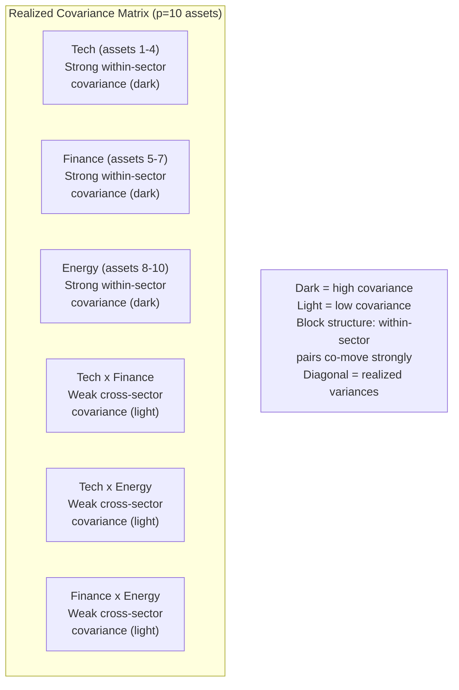
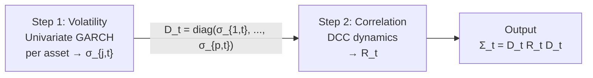
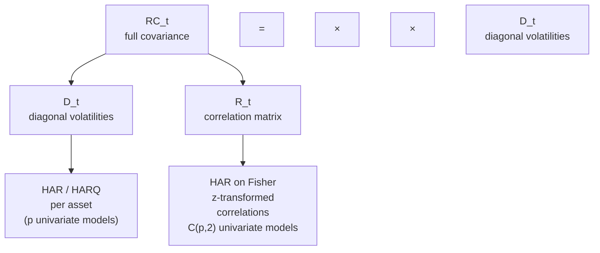
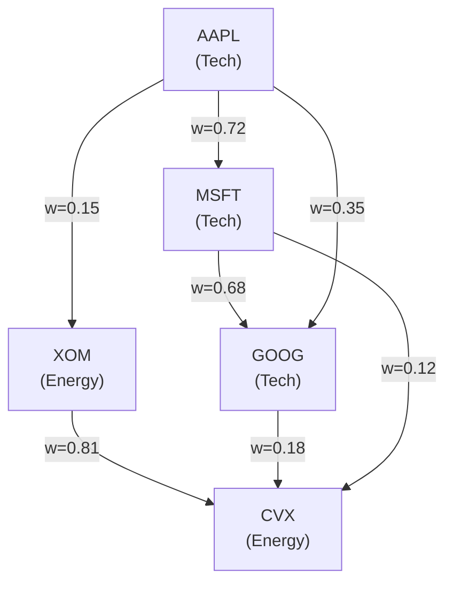
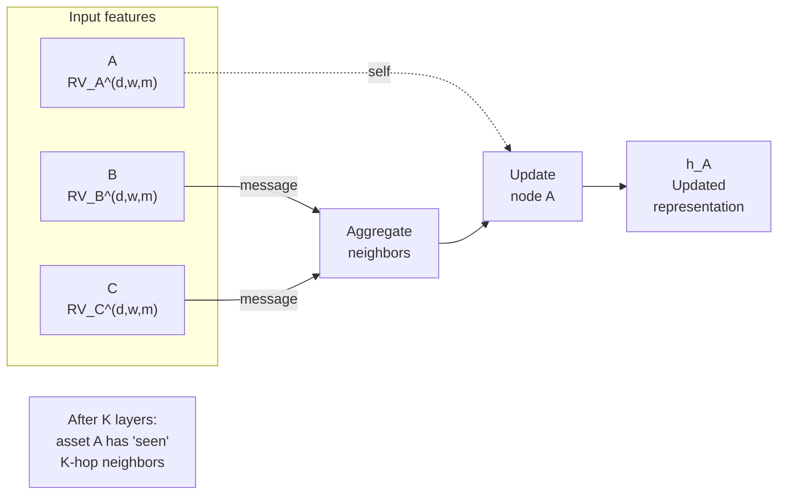
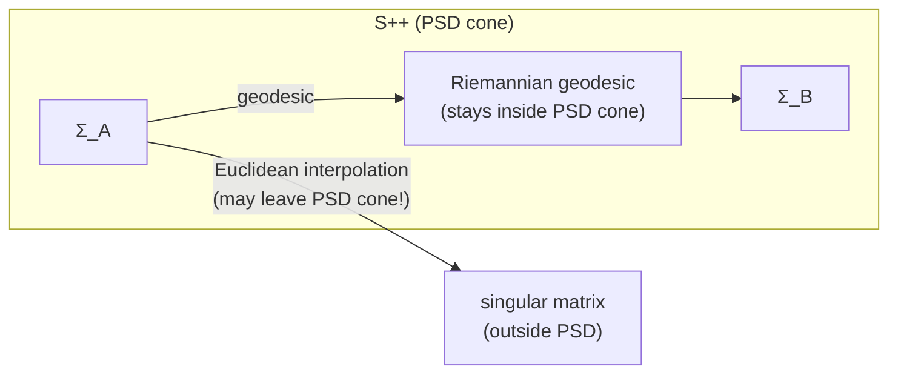

# Realized Covariance and Multivariate Forecasting

> **Application: From One Asset to Many**
>
> Chapters [1](ch01-returns-variance-volatility.md)--[13](ch13-variance-risk-premium.md) focused on the volatility of a single asset.
> In practice, portfolios hold many assets, and the _covariance structure_ matters as
> much as individual volatilities. Minimum-variance portfolios, risk parity, hedging, and
> option pricing on baskets all require a full covariance matrix, not just a list of
> variances. This chapter extends realized volatility to the multivariate setting:
> estimating, modeling, and forecasting entire covariance matrices. Project 3
> (Multivariate RC with GNNs) builds directly on this material.

## Realized Covariance

**Where we are.** You know how to build realized variance for one asset
([Chapter 3](ch03-realized-variance.md)). The natural multivariate extension replaces squared returns
with outer products.

> **Intuition: From Variance to Covariance**
>
> Realized variance sums squared intraday returns: $\operatorname{RV}_t = \sum_i r_{t,i}^2$.
> If you have a $p$-vector of returns (one entry per asset), the analogous
> quantity is the outer product $\mathbf{r}_{t,i}\,\mathbf{r}_{t,i}^\top$,
> a $p \times p$ matrix. Summing these outer products over intraday intervals
> gives you a realized covariance matrix.

> **Definition: Realized Covariance Matrix**
>
> Let $\mathbf{r}_{t,i} \in \mathbb{R}^p$ be the $i$-th intraday return vector on day $t$,
> for $i = 1, \ldots, M$. The **realized covariance** (RC) matrix is
>
> $$\mathbf{RC}_t \;=\; \sum_{i=1}^{M} \mathbf{r}_{t,i}\,\mathbf{r}_{t,i}^\top \;\in\; \mathbb{R}^{p \times p}.$$
>
> - $\mathbf{r}_{t,i} \in \mathbb{R}^p$: intraday return vector for $p$ assets at interval $i$.
> - $M$: number of intraday intervals (e.g., 78 for 5-minute sampling of a 6.5-hour trading day).
> - Diagonal entries $[\mathbf{RC}_t]_{jj}$: realized variances of each asset (as in [Chapter 3](ch03-realized-variance.md)).
> - Off-diagonal entries $[\mathbf{RC}_t]_{jk}$: realized covariances between assets $j$ and $k$.
>
> Under no noise and synchronous trading, $\mathbf{RC}_t$ converges to the
> integrated covariance matrix as $M \to \infty$ (Barndorff-Nielsen, Hansen, Lunde, and Shephard, 2011).

> **Project Connection: Why This Matters**
>
> You are not just forecasting one stock's volatility. Portfolio construction,
> hedging, and risk management all require the full covariance matrix. Realized
> covariance extends your RV pipeline ([Chapter 3](ch03-realized-variance.md)) from a single number
> per day to a $p \times p$ matrix per day, with $p(p+1)/2$ unique entries. For
> $p = 50$ assets, that is 1,275 quantities to estimate and forecast daily.
> This is the starting point for Project Direction 3 (Multivariate RC with GNNs).

_Figure: Schematic of a realized covariance matrix with $p = 10$ assets sorted
by sector. The block-diagonal structure (strong within-sector covariance, weak
cross-sector) is a key pattern that CNNs and factor models exploit. The diagonal
entries are the realized variances from [Chapter 3](ch03-realized-variance.md)._

### The Synchronicity Problem

In theory, you form each $\mathbf{r}_{t,i}$ by observing all $p$ assets at the
same timestamps. In practice, different assets trade at different times. A
thinly traded stock might have no trade in a given 5-minute window. If you
simply ignore missing observations, you bias realized covariance toward zero
(the "Epps effect").

```mermaid
gantt
    title Non-Synchronous Trading: Asset A (blue) and Asset B (red)
    dateFormat X
    axisFormat %s

    section Asset A trades
    t=0.5  :a1, 0, 1
    t=2.0  :a2, 2, 1
    t=3.8  :a3, 4, 1
    t=5.5  :a4, 5, 1
    t=7.0  :a5, 7, 1
    t=8.2  :a6, 8, 1
    t=10.0 :a7, 10, 1
    t=11.0 :a8, 11, 1

    section Asset B trades
    t=1.0  :b1, 1, 1
    t=1.8  :b2, 2, 1
    t=4.2  :b3, 4, 1
    t=6.0  :b4, 6, 1
    t=6.8  :b5, 7, 1
    t=9.5  :b6, 9, 1
    t=10.5 :b7, 10, 1
```

_Figure: Non-synchronous trading. Asset A and Asset B trade at different times.
Refresh times mark points where both assets have at least one new observation
since the last refresh time._

### Refresh-Time Sampling

The simplest fix: wait until _all_ $p$ assets have traded at least once,
then record a synchronized return vector. These "refresh times" are defined
formally as $\tau_0 = 0$ and

$$\tau_k \;=\; \max_{j=1,\ldots,p}\; \min\bigl\{t_{j,n} : t_{j,n} > \tau_{k-1}\bigr\},$$

where $t_{j,n}$ is the $n$-th trade time for asset $j$. You compute returns at
refresh times and plug them into the RC formula. The cost: you lose observations,
sometimes dramatically for illiquid assets.

### Hayashi--Yoshida Estimator

Hayashi and Yoshida (2005) proposed a more efficient solution. Instead of aligning
timestamps, you sum the products of all _overlapping_ returns.

> **Definition: Hayashi--Yoshida Estimator**
>
> For two assets with (possibly different) trade times, let $r_{t,i}^{(A)}$ denote
> asset A's return over interval $[t_{i-1}^A, t_i^A)$ and similarly for B. The
> Hayashi--Yoshida realized covariance is
>
> $$\widehat{\sigma}_{AB,t}^{\mathrm{HY}} \;=\; \sum_{i}\sum_{j}\; r_{t,i}^{(A)}\, r_{t,j}^{(B)}\; \mathbf{1}\!\Bigl\{ [t_{i-1}^A, t_i^A) \cap [t_{j-1}^B, t_j^B) \neq \emptyset \Bigr\}.$$
>
> - Sum over all pairs of intervals that overlap in time.
> - No data is discarded; every trade contributes.
> - Unbiased and consistent for the integrated covariance under mild conditions.
> - Not guaranteed positive semi-definite (PSD) for $p > 2$.

> **Intuition: In Plain English**
>
> The Hayashi--Yoshida estimator says: if two assets' return intervals overlap in
> time at all, their returns carry information about comovement. Instead of
> forcing both assets onto a common clock (which throws away data), HY simply
> multiplies every pair of returns whose time intervals share any overlap and sums
> the products. It is like computing a dot product, but one that uses every
> available trade rather than only the synchronized ones.

> **Project Connection: Why This Matters**
>
> Real equity data is messy: liquid large-caps trade every second while
> small-caps may go minutes between prints. If your project universe mixes
> liquid and illiquid names, naive RC biases covariances toward zero (the Epps
> effect), understating diversification benefits. The Hayashi--Yoshida estimator
> is the go-to fix for building an unbiased daily covariance matrix from raw
> trade data before feeding it into HAR-DRD or a GNN forecaster.

> **Warning: PSD is Not Guaranteed**
>
> For $p = 2$, the Hayashi--Yoshida estimator is always PSD (it is a scalar
> covariance). For $p \geq 3$, the matrix assembled from pairwise HY estimates
> can have negative eigenvalues. You may need to project the result onto the
> PSD cone (e.g., by zeroing out negative eigenvalues), which introduces bias.
> The PSD Constraint section below discusses this systematically.

## Multivariate Realized Kernel

**Where we are.** You have two problems: non-synchronous trading
(previous section) and microstructure noise
([Chapter 8](ch08-microstructure-noise.md)). The multivariate realized kernel handles both
simultaneously.

> **Intuition: Extending the Realized Kernel**
>
> In [Chapter 8](ch08-microstructure-noise.md), the univariate realized kernel applied a weighting
> function to autocovariances of returns at different lags, suppressing noise
> while remaining consistent. The multivariate version does exactly the same
> thing, but with cross-autocovariance matrices instead of scalar autocovariances.

> **Definition: Multivariate Realized Kernel**
>
> Barndorff-Nielsen, Hansen, Lunde, and Shephard (2011) define the multivariate
> realized kernel as
>
> $$\mathbf{K}_t \;=\; \sum_{h=-H}^{H} k\!\left(\frac{h}{H+1}\right) \;\bm{\Gamma}_h,$$
>
> where
>
> - $\bm{\Gamma}_h = \sum_{i} \mathbf{r}_{t,i}\,\mathbf{r}_{t,i+h}^\top$ is the $h$-th cross-autocovariance matrix of intraday returns.
> - $k(\cdot)$: a kernel function satisfying $k(0) = 1$, $k(1) = 0$ (e.g., Parzen kernel). Same options as the univariate case in [Chapter 8](ch08-microstructure-noise.md).
> - $H$: bandwidth, controlling how many lags to include.

> **Key Result: PSD Guarantee Under Noise**
>
> The multivariate realized kernel with a non-negative kernel function (e.g.,
> Parzen) is guaranteed PSD by construction, even with non-synchronous trading
> and microstructure noise (Barndorff-Nielsen, Hansen, Lunde, and Shephard, 2011). This
> is a major advantage over refresh-time RC and the Hayashi--Yoshida estimator.
> The rate of convergence is $M^{-1/5}$ (slower than the noise-free $M^{-1/2}$),
> the same price paid in the univariate case.

> **Project Connection: Why This Matters**
>
> If your project uses high-frequency data to build daily covariance matrices,
> the multivariate realized kernel is the "gold standard" estimator: it handles
> both microstructure noise and non-synchronous trading while guaranteeing that
> the output is a valid (PSD) covariance matrix. This means you can feed $\mathbf{K}_t$
> directly into a portfolio optimizer or a downstream forecasting model (HAR-DRD,
> GNN) without worrying about negative eigenvalues.

## DCC-GARCH

**Where we are.** You can now _estimate_ a daily covariance matrix
using high-frequency data. Next, you need to _forecast_ tomorrow's
covariance matrix. DCC-GARCH is the multivariate analog of GARCH
([Chapter 5](ch05-garch.md)): a parametric, easy-to-estimate baseline.

_Figure: DCC-GARCH decomposes the covariance matrix into volatilities (modeled
separately per asset) and a dynamic correlation matrix._

> **Key Idea: DCC-GARCH -- Engle (2002)**
>
> The Dynamic Conditional Correlation (DCC) model has two steps:
>
> **Step 1 (volatilities).** Fit a univariate GARCH(1,1) (or any variant)
> to each asset's return series separately, producing conditional standard
> deviations $\sigma_{j,t}$ for $j = 1, \ldots, p$. Stack them into a diagonal
> matrix:
>
> $$D_t = \operatorname{diag}(\sigma_{1,t}, \sigma_{2,t}, \ldots, \sigma_{p,t}).$$
>
> **Step 2 (correlations).** Compute standardized residuals
> $\mathbf{z}_t = D_t^{-1}\,\mathbf{r}_t$ and model their quasi-correlation:
>
> $$Q_t \;=\; (1 - \alpha - \beta)\,\bar{Q} \;+\; \alpha\,\mathbf{z}_{t-1}\,\mathbf{z}_{t-1}^\top \;+\; \beta\, Q_{t-1},$$
>
> where
>
> - $\bar{Q}$: unconditional covariance of $\mathbf{z}_t$ (estimated from the full sample).
> - $\alpha > 0$: weight on yesterday's innovation (analogous to ARCH coefficient).
> - $\beta > 0$: persistence (analogous to GARCH coefficient).
> - $\alpha + \beta < 1$: stationarity condition.
>
> Then rescale to a proper correlation matrix:
>
> $$R_t = \operatorname{diag}(Q_t)^{-1/2}\; Q_t\; \operatorname{diag}(Q_t)^{-1/2}.$$
>
> The conditional covariance matrix is $\Sigma_t = D_t\, R_t\, D_t$.

> **Intuition: Why DCC is the "HAR of Multivariate Vol"**
>
> DCC is to multivariate volatility what HAR ([Chapter 6](ch06-har.md)) is to
> univariate: not the most accurate model, but easy to estimate, hard to beat
> consistently, and the first thing you should try. It scales well to large $p$
> because Step 1 is embarrassingly parallel (one GARCH per asset) and Step 2 has
> only two free parameters ($\alpha$, $\beta$) regardless of dimension.

> **Warning: DCC Limitations**
>
> - Correlations follow a single $(\alpha, \beta)$ dynamic for all pairs. In reality, the IBM--MSFT correlation may move differently from the IBM--gold correlation.
> - DCC uses daily returns, not intraday data. It ignores the richer information in realized covariance.
> - The two-step estimation is not fully efficient (but it is consistent).

> **Project Connection: Why This Matters**
>
> DCC-GARCH is the parametric baseline you should beat. It plays the same role
> in multivariate vol forecasting that plain GARCH plays in univariate: simple,
> well-understood, and surprisingly competitive. In a Diebold-Mariano test
> comparing your ML covariance forecasts against DCC, a statistically significant
> QLIKE improvement is the clearest evidence that high-frequency data and
> nonlinear models add value beyond what a two-parameter correlation dynamic
> can capture.

## Wishart Autoregressive (WAR) Model

**Where we are.** DCC models correlations parametrically using daily
returns. Can you instead build a direct time-series model for the realized
covariance matrix, analogous to HAR for realized variance?

> **Key Idea: Wishart Autoregressive Model**
>
> The WAR model treats the sequence of realized covariance matrices as a
> matrix-variate time series. In its simplest form:
>
> $$\mathbf{RC}_{t+1} \;=\; C + A\,\mathbf{RC}_t\,A^\top + E_{t+1},$$
>
> where
>
> - $C \in \mathbb{R}^{p \times p}$: intercept matrix (symmetric, PSD).
> - $A \in \mathbb{R}^{p \times p}$: autoregressive coefficient matrix.
> - $E_{t+1}$: innovation matrix (Wishart-distributed).
> - The Wishart distribution is the matrix generalization of the chi-squared distribution and is the natural distribution for covariance matrices.
>
> Higher-order and HAR-style variants (daily, weekly, monthly lags) follow
> naturally:
>
> $$\mathbf{RC}_{t+1} = C + A_d\,\mathbf{RC}_t\, A_d^\top + A_w\,\overline{\mathbf{RC}}_t^{(w)}\, A_w^\top + A_m\,\overline{\mathbf{RC}}_t^{(m)}\, A_m^\top + E_{t+1},$$
>
> where $\overline{\mathbf{RC}}_t^{(w)}$ and $\overline{\mathbf{RC}}_t^{(m)}$
> are averages over the past 5 and 22 trading days.

> **Intuition: In Plain English**
>
> The WAR model is the matrix version of an AR(1) for time series. Instead of
> saying "tomorrow's variance equals a constant plus a fraction of today's
> variance," it says "tomorrow's covariance _matrix_ equals an intercept
> matrix plus a transformation of today's covariance matrix." The sandwich
> form $A\,\mathbf{RC}_t\,A^\top$ ensures the output remains symmetric (just as
> $\mathbf{RC}_t$ is), and the Wishart distribution is the natural error
> distribution for random matrices that must be positive semi-definite.

> **Project Connection: Why This Matters**
>
> WAR is conceptually the cleanest multivariate extension of HAR: model the
> whole matrix as one object. In practice, the curse of dimensionality kills it.
> With $p = 50$ assets, the coefficient matrix $A$ alone has 2,500 parameters,
> far exceeding typical sample sizes. This motivates the decomposition strategies
> (DRD, Cholesky) and graph-based approaches you would actually use in a GS
> project, where $p$ could easily be 50--500.

> **Warning: Parameter Explosion**
>
> Each coefficient matrix $A$ has $p^2$ free parameters. For $p = 50$ assets,
> $A$ alone has 2,500 parameters. With daily, weekly, and monthly lags, that
> is 7,500 parameters plus the intercept. The sample sizes available
> (typically 1,000--3,000 trading days) are far too small. WAR is practical
> only for small $p$ (say, $p \leq 5$) unless you impose strong structure
> (diagonal $A$, block-diagonal, etc.).

## HAR-DRD and Multivariate HARQ

**Where we are.** WAR is theoretically clean but does not scale. The next
idea: decompose the covariance matrix into pieces that are easier to model
separately.

> **Key Idea: DRD Decomposition -- Bollerslev, Patton, and Quaedvlieg (2018)**
>
> Write the realized covariance matrix as
>
> $$\mathbf{RC}_t \;=\; D_t\; R_t\; D_t,$$
>
> where
>
> - $D_t = \operatorname{diag}\!\bigl(\sqrt{[\mathbf{RC}_t]_{11}}, \ldots, \sqrt{[\mathbf{RC}_t]_{pp}}\bigr)$: diagonal matrix of realized standard deviations.
> - $R_t = D_t^{-1}\,\mathbf{RC}_t\, D_t^{-1}$: realized correlation matrix (unit diagonal).
>
> Then model $D_t$ and $R_t$ separately:
>
> - **Variances:** fit a univariate HAR (or HARQ, from [Chapter 6](ch06-har.md)) to each diagonal element $[\mathbf{RC}_t]_{jj}$.
> - **Correlations:** fit a univariate HAR to each unique off-diagonal element of $R_t$, using Fisher $z$-transform to map $[-1,1]$ to $(-\infty, \infty)$.
>
> Reassemble: $\widehat{\mathbf{RC}}_{t+1} = \hat{D}_{t+1}\,\hat{R}_{t+1}\,\hat{D}_{t+1}$.

> **Intuition: In Plain English**
>
> DRD says: instead of trying to forecast all $p(p+1)/2$ entries of a covariance
> matrix at once, split the problem into two simpler pieces. First, forecast how
> volatile each asset will be tomorrow (the diagonal, which you already know how
> to do with HAR/HARQ). Second, forecast how correlated each pair will be (the
> off-diagonal, after normalizing). Then multiply them back together. This
> "divide and conquer" approach lets you reuse your best univariate tools on
> each piece.

_Figure: The DRD decomposition separates the covariance matrix into volatilities
(modeled individually with HAR/HARQ) and correlations (modeled with HAR on
Fisher $z$-transforms). Each piece is forecast with simple univariate models,
then reassembled._

> **Project Connection: Why This Matters**
>
> HAR-DRD is arguably the strongest conventional baseline for multivariate vol
> forecasting. It directly extends the HARQ framework your project builds on:
> you can apply the $\sqrt{\operatorname{RQ}}$ measurement-error correction from
> [Chapter 6](ch06-har.md) to each variance element, improving forecasts on noisy
> days. If Project Direction 3 (GNN) is to justify its complexity, it must beat
> HAR-DRD on QLIKE across the full covariance matrix, not just on individual
> variances.

> **Key Result: Separate Modeling Beats Joint**
>
> Bollerslev, Patton, and Quaedvlieg (2018) show that the HARQ-DRD model, where
> variances and correlations are modeled with separate HAR regressions and
> measurement-error attenuation, significantly outperforms the direct vech-HAR
> on all elements jointly. The HARQ variant (adding $\sqrt{\operatorname{RQ}}$
> interactions from [Chapter 6](ch06-har.md)) further improves the variance
> forecasts, especially on high-noise days.

> **Warning: PSD Not Guaranteed**
>
> The separately forecasted $\hat{R}_{t+1}$ is not guaranteed to be a valid
> correlation matrix (it may have eigenvalues outside $[0,1]$ or a diagonal
> different from 1). In practice, you project onto the nearest correlation
> matrix, e.g., via the alternating projections algorithm of Higham (2002).

## Cholesky-HAR

**Where we are.** HAR-DRD decomposes the matrix into variances and
correlations. Cholesky-HAR takes a different decomposition that guarantees PSD
by construction.

> **Key Idea: Cholesky-HAR -- Chiriac and Voev (2011)**
>
> Every PSD matrix $\mathbf{RC}_t$ has a unique Cholesky decomposition:
>
> $$\mathbf{RC}_t = L_t\, L_t^\top,$$
>
> where $L_t$ is lower triangular with positive diagonal entries. The idea:
>
> 1. Compute $L_t$ for each day.
> 2. Take the log of diagonal elements (to ensure positivity upon exponentiation).
> 3. Stack all $p(p+1)/2$ unique elements of the modified $L_t$ into a vector.
> 4. Fit a separate HAR model to each element.
> 5. Forecast, exponentiate diagonals, unstack into $\hat{L}_{t+1}$, and reassemble: $\widehat{\mathbf{RC}}_{t+1} = \hat{L}_{t+1}\,\hat{L}_{t+1}^\top$.
>
> Since any lower triangular matrix with positive diagonal gives a valid PSD
> matrix via $LL^\top$, the forecast is PSD by construction.

## Graph-Based Methods

**Where we are.** All methods so far treat each element (or factor) of
the covariance matrix independently. Graph-based methods exploit the fact that
assets are _connected_: if asset A's volatility spills over to asset B
([Chapter 15](ch15-volatility-spillovers.md) formalizes this), modeling them jointly through
a graph should help.

_Figure: Assets as nodes in a graph with edge weights derived from realized
correlations. Within-sector edges (tech, energy) are strong; cross-sector edges
are weak. Graph-based models exploit this structure._

> **Key Idea: Graph-HAR -- Zhang, Pu, Cucuringu, and Dong (2024)**
>
> Graph-HAR augments the standard HAR model with graph-based features. The
> adjacency matrix $W$ is constructed from realized correlations (or partial
> correlations). For each asset $j$:
>
> $$\operatorname{RV}_{j,t+1} \;=\; \beta_0 + \beta_d\,\operatorname{RV}_{j,t} + \beta_w\,\operatorname{RV}_{j,t}^{(w)} + \beta_m\,\operatorname{RV}_{j,t}^{(m)} + \gamma\, \sum_{k \neq j} W_{jk}\,\operatorname{RV}_{k,t} + \varepsilon_{j,t+1},$$
>
> where
>
> - The first three terms are the standard HAR ([Chapter 6](ch06-har.md)).
> - $\sum_{k \neq j} W_{jk}\,\operatorname{RV}_{k,t}$: a graph-weighted average of neighbors' volatilities. This is exactly one step of graph diffusion.
> - $\gamma$: spillover coefficient. If $\gamma > 0$, high volatility in neighbors predicts higher volatility for asset $j$.
> - $W$: adjacency matrix, typically from thresholded correlation or LASSO partial correlation.

> **Intuition: In Plain English**
>
> Graph-HAR says: an asset's future volatility depends not only on its own past
> (the standard HAR terms) but also on what is happening to its neighbors. The
> "neighborhood" is defined by the graph: assets that are highly correlated form
> a cluster, and when one member's volatility spikes, the others tend to follow.
> The extra term $\gamma \sum_k W_{jk}\,\operatorname{RV}_{k,t}$ is simply a weighted average
> of yesterday's volatility across connected assets, capturing spillover effects
> that a univariate model would miss entirely.

> **Project Connection: Why This Matters**
>
> This is the linear foundation for Project Direction 3 (GNNs). Graph-HAR adds
> one cross-asset spillover term and already improves on standard HAR. The GNN
> extension (below) replaces this linear weighted average with learnable nonlinear
> message passing, potentially capturing richer interaction patterns. Your project
> contribution: show whether the nonlinear GNN spillover term yields statistically
> significant QLIKE gains over the linear Graph-HAR spillover on real equity data.

> **Key Idea: GNN for Covariance -- Zhang, Cucuringu, and Dong (2023)**
>
> Going further, Graph Neural Networks (GNNs) replace the linear spillover term
> with learnable message-passing layers:
>
> 1. **Node features:** each asset's HAR-style inputs (daily, weekly, monthly RV, plus optional firm characteristics).
> 2. **Graph structure:** adjacency from realized correlation, GICS sector membership, or learned adaptively.
> 3. **Message passing:** each node aggregates features from its neighbors through learned weight matrices (as in [Chapter 11](ch11-deep-learning.md)).
> 4. **Output:** node-level volatility forecasts or, with a symmetric readout layer, full covariance matrix forecasts.
>
> The advantage over Graph-HAR: nonlinear aggregation and multi-hop
> information flow (asset A learns from asset C through intermediary B).

_Figure: GNN message passing for one node. Asset A aggregates volatility
features from its graph neighbors (B and C), then updates its own
representation. After $K$ message-passing layers, each node has information
from all assets within $K$ hops, capturing multi-step spillover effects._

## CNN-RCOV

**Where we are.** Graph methods treat assets as nodes. An alternative:
treat the realized covariance matrix itself as an image.

> **Key Idea: Covariance Matrices as Images**
>
> A $p \times p$ realized covariance matrix is a symmetric, real-valued "image."
> If you sort assets by sector (tech, energy, financials, ...), block structure
> emerges: within-sector blocks have high covariance, cross-sector blocks have
> low covariance. Convolutional neural networks (CNNs, [Chapter 11](ch11-deep-learning.md))
> are designed to detect such local spatial patterns.
>
> **Architecture.** Stack $T$ past covariance matrices as "channels"
> (like RGB channels in image classification) and use 2D convolutions to
> extract temporal and cross-sectional patterns:
>
> 1. Input: $\mathbf{RC}_{t}, \mathbf{RC}_{t-1}, \ldots, \mathbf{RC}_{t-T+1}$ $\in \mathbb{R}^{T \times p \times p}$.
> 2. 2D convolutional layers detect local block patterns.
> 3. Fully connected layers map to the $p(p+1)/2$ unique elements of $\widehat{\mathbf{RC}}_{t+1}$.

> **Warning: CNN-RCOV Caveats**
>
> - The literature is thin; this is more "conceptually appealing" than empirically proven at scale.
> - Ordering assets by sector is a design choice. Different orderings yield different spatial patterns, and CNNs are not permutation-invariant. GNNs (previous section) handle this more naturally.
> - The output is not guaranteed PSD; post-hoc projection is required.
> - For large $p$, the output layer has $O(p^2)$ parameters, which grows fast.

## Geometric Deep Learning on the SPD Manifold

**Where we are.** Every method so far either ignores the PSD constraint
or enforces it with post-hoc projection. SPDNet takes a fundamentally different
approach: work directly on the manifold where covariance matrices live.

> **Prereq: What is a Manifold?**
>
> A manifold is a curved space that locally looks like Euclidean space, much like
> the surface of a sphere locally looks flat. The set of $p \times p$ symmetric
> positive definite matrices (denoted $\mathcal{S}_{++}^p$) forms a smooth
> manifold. It is _not_ a flat (Euclidean) space: the straight line
> between two PSD matrices can pass through matrices with zero or negative
> eigenvalues, leaving the PSD cone.

_Figure: The SPD manifold. A straight (Euclidean) line between two PSD matrices
$\Sigma_A$ and $\Sigma_B$ can pass through singular matrices. The
Riemannian geodesic (blue curve) stays inside the PSD cone by definition._

> **Definition: Affine-Invariant Riemannian Metric on $\mathcal{S}_{++}^p$**
>
> The standard Riemannian metric on $\mathcal{S}_{++}^p$ is
>
> $$d(\Sigma_A, \Sigma_B) \;=\; \bigl\|\log\bigl(\Sigma_A^{-1/2}\,\Sigma_B\,\Sigma_A^{-1/2}\bigr)\bigr\|_F,$$
>
> where $\log$ is the matrix logarithm and $\|\cdot\|_F$ is the Frobenius norm.
> This distance is affine-invariant: $d(A\Sigma_A A^\top, A\Sigma_B A^\top) = d(\Sigma_A, \Sigma_B)$ for any invertible $A$.

> **Key Idea: SPDNet**
>
> SPDNet replaces standard neural network operations with Riemannian analogs that
> preserve positive definiteness:
>
> 1. **BiMap layer** (analog of linear layer): $\Sigma \mapsto W\,\Sigma\, W^\top$, where $W$ is a learnable $d \times p$ matrix with $d \leq p$. If $\Sigma \succ 0$ and $W$ has full row rank, then $W\Sigma W^\top \succ 0$. This also reduces dimension from $p$ to $d$.
> 2. **ReEig layer** (analog of ReLU): eigendecompose $\Sigma = U\Lambda U^\top$, then $\Sigma \mapsto U\,\max(\Lambda, \epsilon I)\, U^\top$. Clips small eigenvalues to $\epsilon > 0$, keeping the matrix strictly PSD.
> 3. **LogEig layer** (analog of final feature extraction): $\Sigma \mapsto U\,\log(\Lambda)\,U^\top$. Maps from the SPD manifold to the tangent space (symmetric matrices), where standard Euclidean operations apply.
>
> The output of LogEig lives in a flat space, so you can apply a standard linear
> classifier or regressor on top.

> **Key Result: SPDNet: PSD by Design**
>
> Because every layer in SPDNet maps PSD inputs to PSD outputs, intermediate
> representations are always valid covariance matrices. No post-hoc projection
> is needed. This is the only deep learning architecture for covariance
> forecasting with a built-in PSD guarantee.

## The PSD Constraint

**Where we are.** Every multivariate volatility model must produce a
valid (positive semi-definite) covariance matrix. Some methods guarantee this;
others require fixing after the fact. This section provides a systematic
comparison.

> **Intuition: Why PSD Matters**
>
> A covariance matrix that is not PSD implies negative variance for some portfolio.
> Specifically, if $\Sigma$ has a negative eigenvalue with eigenvector
> $\mathbf{v}$, then the portfolio $\mathbf{v}$ has predicted variance
> $\mathbf{v}^\top \Sigma\, \mathbf{v} < 0$. This is nonsensical and causes
> optimizers to blow up (infinite leverage on the "negative variance" direction).

**Table: PSD guarantees across multivariate volatility methods.**

| **Method** | **PSD Guarantee** | **Mechanism** |
|---|---|---|
| DCC-GARCH | Yes | By construction ($D_t R_t D_t$, $R_t$ from rescaling) |
| WAR | No | Post-hoc projection needed |
| HAR-DRD | No | Post-hoc projection on $\hat{R}_{t+1}$ |
| Cholesky-HAR | Yes | $\hat{L}\hat{L}^\top$ is PSD by construction |
| Graph-HAR | No | Post-hoc projection needed |
| CNN-RCOV | No | Post-hoc projection needed |
| SPDNet | Yes | Riemannian operations preserve PSD |

> **Key Idea: Post-Hoc PSD Projection**
>
> When a method does not guarantee PSD, the standard fix is eigenvalue clipping:
>
> 1. Eigendecompose: $\hat{\Sigma} = U\Lambda U^\top$.
> 2. Set $\tilde{\Lambda} = \max(\Lambda, 0)$ (zero out negative eigenvalues).
> 3. Reconstruct: $\tilde{\Sigma} = U\tilde{\Lambda} U^\top$.
>
> This gives the nearest PSD matrix in Frobenius norm. The cost: it introduces
> bias, and the projected matrix no longer minimizes whatever loss function the
> model was trained on. For correlation matrices, the Higham (2002) alternating
> projection algorithm additionally enforces unit diagonal.

> **Warning: PSD Violations in Practice**
>
> For small $p$ (2--5 assets), PSD violations are rare and small. For large $p$
> (50--500), they are common and can be severe, especially with element-wise
> models (HAR-DRD, Graph-HAR) that do not enforce cross-element consistency.
> If PSD is critical for your application (portfolio optimization, risk
> management), prefer methods with built-in guarantees: DCC, Cholesky-HAR, or
> SPDNet.

## Summary

Key takeaways from this chapter:

- Realized covariance (RC) extends realized variance to matrices via outer products of intraday return vectors.
- Non-synchronous trading biases RC toward zero (Epps effect). Refresh-time sampling and the Hayashi--Yoshida estimator address this, with HY being more data-efficient.
- The multivariate realized kernel handles both noise and non-synchronicity while guaranteeing PSD (Barndorff-Nielsen, Hansen, Lunde, and Shephard, 2011).
- DCC-GARCH (Engle, 2002) is the standard parametric baseline: easy to estimate, scales to large $p$, but uses only daily data and imposes a single correlation dynamic.
- WAR models RC directly as a matrix time series, but suffers from parameter explosion for $p > 5$.
- HAR-DRD (Bollerslev, Patton, and Quaedvlieg, 2018) decomposes RC into variances and correlations, models each with HAR, and outperforms both joint modeling and DCC.
- Cholesky-HAR (Chiriac and Voev, 2011) models Cholesky factors with HAR, guaranteeing PSD by construction.
- Graph-HAR (Zhang, Pu, Cucuringu, and Dong, 2024) and GNN methods (Zhang, Cucuringu, and Dong, 2023) model volatility spillovers through asset graphs, capturing network effects that element-wise models miss.
- CNN-RCOV treats RC matrices as images; conceptually appealing but empirically limited and not permutation-invariant.
- SPDNet operates on the Riemannian manifold of PSD matrices, the only deep learning approach with a built-in PSD guarantee.
- Methods either guarantee PSD (DCC, Cholesky-HAR, SPDNet) or require post-hoc eigenvalue projection, which introduces bias.
- For most applications, start with HAR-DRD (best accuracy in large-scale comparisons) or Cholesky-HAR (if PSD is essential). Use DCC-GARCH as the parametric baseline. Graph and manifold methods are promising but still maturing.

**Table: Key results: multivariate volatility methods.**

| **Method** | **Data Input** | **Key Advantage** | **Key Limitation** |
|---|---|---|---|
| DCC-GARCH | Daily returns | Scales to large $p$; PSD guaranteed | Single correlation dynamic; ignores HF data |
| WAR | Realized covariance | Theoretically clean matrix AR | $O(p^2)$ parameters |
| HAR-DRD | Realized covariance | Best accuracy (BPQ 2018); flexible | PSD not guaranteed |
| Cholesky-HAR | Realized covariance | PSD by construction | Cholesky ordering arbitrary |
| Graph-HAR / GNN | RV + graph | Models spillovers | Graph construction is a design choice |
| CNN-RCOV | RC as image | Detects block structure | Not permutation-invariant |
| SPDNet | RC on manifold | PSD by design; principled geometry | Complex; limited empirical evidence |

**Next.** [Chapter 15](ch15-volatility-spillovers.md) formalizes the volatility
spillovers that Graph-HAR exploits, using the Diebold--Yilmaz connectedness
framework and network topology.
