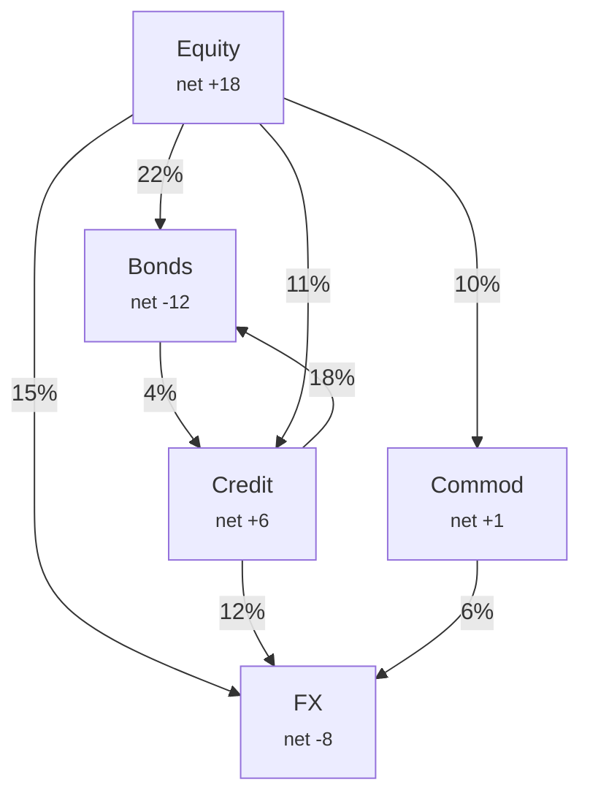
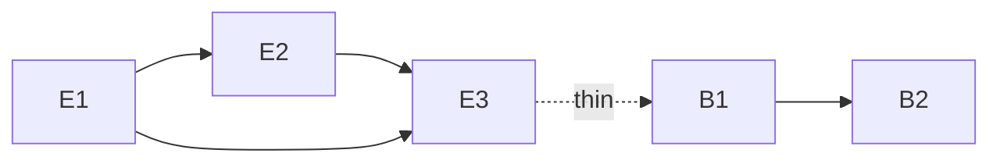
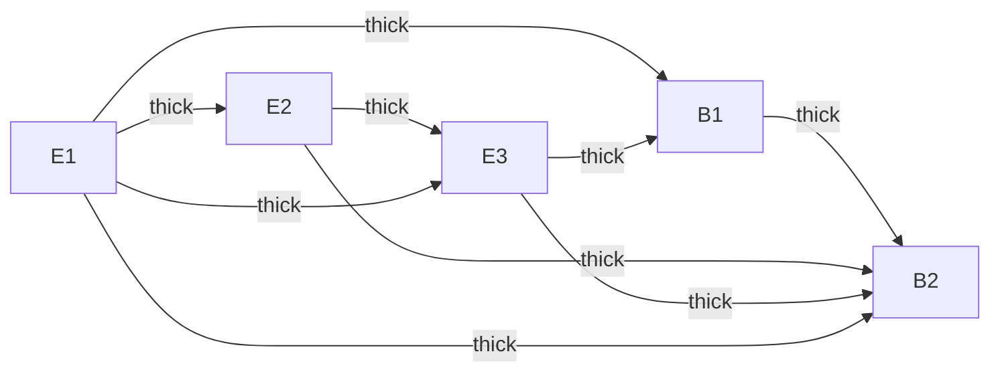

# Volatility Spillovers and Connectedness

> **Application:**
> [Chapter 14](ch14-multivariate-rv.md) built tools for forecasting the full covariance matrix.
> This chapter focuses on a specific question: how does volatility transmit from one
> asset (or market) to another? Spillover indices and connectedness measures are both
> diagnostic tools (understanding contagion) and predictive features
> ([Chapter 7](ch07-feature-engineering.md)). Project 3 relies heavily on this framework.

## Diebold--Yilmaz Spillover Indices

In [Chapter 14](ch14-multivariate-rv.md) you learned to model the joint dynamics of multiple
assets. Now we zoom in on a sharper question: when one asset's volatility jumps,
how much of that shock spills over into other assets?

> **Intuition: Volatility as a contagious shock**
>
> Think of volatility shocks as ripples in a pond. A stone dropped on the equity
> side sends waves that reach bonds, commodities, and currencies. The Diebold--Yilmaz
> (DY) framework measures the size and direction of those ripples using standard
> vector autoregression (VAR) machinery.

### Setup: VAR on Realized Volatilities

Stack the realized volatilities of $N$ assets into a vector
$\mathbf{y}_t = (\operatorname{RV}_{1,t}, \ldots, \operatorname{RV}_{N,t})'$ and fit a VAR($p$):

$$\mathbf{y}_t = \mathbf{c} + \sum_{\ell=1}^{p} \mathbf{A}_\ell \, \mathbf{y}_{t-\ell} + \mathbf{u}_t, \qquad \mathbf{u}_t \sim (0, \mathbf{\Sigma}),$$

> **Intuition: In Plain English**
>
> Today's vector of realized volatilities across all assets is a linear combination of
> the past $p$ days' volatility vectors, plus a surprise term. Each coefficient matrix
> $\mathbf{A}_\ell$ captures how yesterday's (or day-before's) vol in *every* asset
> feeds into today's vol for *every* asset. This is the multivariate extension
> of the HAR idea: past vol predicts future vol, but now cross-asset effects are
> explicitly modeled.

> **Project Connection: Why This Matters**
>
> The VAR on RVs is the backbone of the Diebold-Yilmaz framework. For your project,
> the off-diagonal entries of $\mathbf{A}_\ell$ are cross-asset predictive features: they
> tell you how much of asset $j$'s vol is predictable from asset $k$'s recent vol.
> This directly extends the univariate HAR baseline with cross-asset lags.

where:

- $\mathbf{y}_t \in \mathbb{R}^N$: vector of realized volatilities on day $t$,
- $\mathbf{c} \in \mathbb{R}^N$: intercept vector,
- $\mathbf{A}_\ell \in \mathbb{R}^{N \times N}$: coefficient matrix at lag $\ell$,
- $\mathbf{u}_t$: reduced-form innovation vector with covariance $\mathbf{\Sigma}$.

The key output is the *moving-average representation* obtained by inverting the
VAR:

$$\mathbf{y}_t = \mathbf{\mu} + \sum_{h=0}^{\infty} \mathbf{\Phi}_h \, \mathbf{u}_{t-h},$$

> **Intuition: In Plain English**
>
> This rewrites the system so that today's volatility is expressed as a sum of all past
> shocks, weighted by how much each shock persists over time. The matrix $\mathbf{\Phi}_h$
> is the "memory kernel": entry $(j,k)$ tells you how much a surprise in asset $k$'s
> vol $h$ days ago still echoes in asset $j$'s vol today. It is the multivariate
> impulse-response function.

> **Project Connection: Why This Matters**
>
> The MA representation is what lets you decompose forecast errors into contributions
> from each asset. In your project, the impulse-response matrices $\mathbf{\Phi}_h$
> underpin the Diebold-Yilmaz spillover index that enters Layer 4 of your feature
> pipeline. The total spillover index $S^{(H)}_t$ becomes a scalar regime indicator
> for LightGBM, while directional spillovers identify which assets are currently
> transmitting or receiving volatility shocks.

where the $N \times N$ matrices $\mathbf{\Phi}_h$ are the impulse-response coefficients
at horizon $h$. Entry $(\mathbf{\Phi}_h)_{jk}$ tells you how a unit shock to asset $k$
today affects asset $j$ at horizon $h$.

### Generalized Forecast Error Variance Decomposition

The next step decomposes the $H$-step forecast error variance of each asset into
contributions from every shock. The generalized variant (GFEVD), introduced by
Pesaran and Shin (1998) and adopted by Diebold and Yilmaz (2012), does not depend
on variable ordering (unlike Cholesky decompositions).

> **Definition: Generalized Forecast Error Variance Decomposition**
>
> The fraction of asset $j$'s $H$-step forecast-error variance attributable to
> shocks originating in asset $k$ is:
>
> $$\theta_{jk}^{(H)} = \frac{\sigma_{kk}^{-1} \sum_{h=0}^{H-1} \bigl(\mathbf{e}_j' \, \mathbf{\Phi}_h \, \mathbf{\Sigma} \, \mathbf{e}_k \bigr)^2}{\sum_{h=0}^{H-1} \mathbf{e}_j' \, \mathbf{\Phi}_h \, \mathbf{\Sigma} \, \mathbf{\Phi}_h' \, \mathbf{e}_j},$$
>
> where:
>
> - $\sigma_{kk}$: the $(k,k)$ entry of $\mathbf{\Sigma}$ (variance of shock $k$),
> - $\mathbf{e}_j$: the $j$-th column of the $N \times N$ identity matrix,
> - $\mathbf{\Phi}_h$: the impulse-response matrix at horizon $h$,
> - $H$: forecast horizon (typically 10 days).

> **Intuition: In Plain English**
>
> This formula answers a simple question: of all the uncertainty in asset $j$'s
> volatility forecast $H$ days ahead, what fraction was caused by a shock to asset $k$?
> The numerator isolates the contribution of shock $k$ (scaled by its own variance),
> and the denominator is the total forecast uncertainty for asset $j$. When $j = k$,
> you get the "own" contribution; when $j \neq k$, you get the spillover from $k$
> to $j$.

> **Project Connection: Why This Matters**
>
> The GFEVD is the core building block for spillover features. Each off-diagonal
> entry $\theta_{jk}^{(H)}$ is a direct measure of cross-asset vol predictability:
> it tells you how much of asset $j$'s vol surprise came from asset $k$. These
> entries feed the Diebold-Yilmaz decomposition that produces your Layer 4
> spillover features for LightGBM.

Because GFEVD rows do not sum to one in general, normalize each row:

$$\widetilde{\theta}_{jk}^{(H)} = \frac{\theta_{jk}^{(H)}}{\sum_{k=1}^{N} \theta_{jk}^{(H)}}, \qquad \text{so that } \sum_{k=1}^{N} \widetilde{\theta}_{jk}^{(H)} = 1.$$

> **Intuition: In Plain English**
>
> The raw GFEVD fractions for a given asset do not necessarily add up to 100% because
> the generalized approach allows shocks to be correlated. This normalization simply
> rescales each row so that the contributions from all assets (including itself) sum to
> one. After normalization, you can read each entry as a percentage: "$X$% of asset
> $j$'s vol forecast error is attributable to shocks from asset $k$."

> **Project Connection: Why This Matters**
>
> Normalized entries are directly interpretable as edge weights in the spillover
> network. For your feature matrix, these percentages can be used as-is: the
> "directional FROM" feature for each asset is just the sum of its off-diagonal
> row entries.

### Spillover Measures

From the normalized decomposition table $\widetilde{\mathbf{\Theta}}^{(H)}$, three
spillover measures follow immediately.

> **Key Idea: Diebold--Yilmaz Spillover Decomposition**
>
> **Total spillover index.** The fraction of total forecast-error variance due
> to cross-asset shocks:
>
> $$S^{(H)} = \frac{1}{N} \sum_{\substack{j,k=1 \\ j \neq k}}^{N} \widetilde{\theta}_{jk}^{(H)} \times 100.$$
>
> **Directional FROM.** How much volatility asset $j$ *receives* from all
> others:
>
> $$S_{j \leftarrow \bullet}^{(H)} = \frac{1}{N} \sum_{\substack{k=1 \\ k \neq j}}^{N} \widetilde{\theta}_{jk}^{(H)} \times 100.$$
>
> **Directional TO.** How much volatility asset $j$ *transmits* to all
> others:
>
> $$S_{j \rightarrow \bullet}^{(H)} = \frac{1}{N} \sum_{\substack{k=1 \\ k \neq j}}^{N} \widetilde{\theta}_{kj}^{(H)} \times 100.$$
>
> **Net spillover.** Transmitters minus receivers:
>
> $$S_j^{\text{net},(H)} = S_{j \rightarrow \bullet}^{(H)} - S_{j \leftarrow \bullet}^{(H)}.$$
>
> A positive net spillover means asset $j$ is a *net transmitter* of volatility;
> negative means *net receiver*.

> **Project Connection: Why This Matters**
>
> These four measures are the feature engineering payoff of the DY framework. Total
> spillover $S^{(H)}_t$ is a regime indicator (high = crisis = different vol dynamics).
> Directional FROM measures how "vulnerable" an asset is to imported vol. Net
> spillover identifies transmitters vs. receivers. All three become columns in your
> Layer 4 feature matrix, entering LightGBM as scalar cross-asset signals. Their
> value is concentrated in regime transitions---precisely the forecasts where
> single-asset features alone break down.

The framework evolved across three papers:
Diebold and Yilmaz (2009) introduced the total index using a Cholesky decomposition,
Diebold and Yilmaz (2012) added directional measures and switched to GFEVD,
and Diebold and Yilmaz (2014) refined the generalized VAR approach and applied it
to a broader set of markets.

### Spillover Network Diagram

The variance decomposition table maps directly onto a weighted directed graph:
each asset is a node, and the edge from $k$ to $j$ carries weight
$\widetilde{\theta}_{jk}^{(H)}$.

*Spillover network for five asset classes. Edge labels show the percentage of $j$'s forecast-error variance explained by shocks from $k$. Node color indicates net transmitter (red) vs. net receiver (blue). Data are illustrative.*

## Time-Varying Spillovers

The static spillover table in the previous section gives you a single snapshot.
In practice, connectedness changes dramatically over time: calm markets have low
spillovers, crises have high ones. This section covers two methods to capture the
dynamics.

### Rolling-Window Approach

The simplest method: re-estimate the VAR and GFEVD on a rolling window of
$w$ days (typically $w = 200$) and plot $S^{(H)}_t$ over time.

> **Key Idea: Rolling-Window Spillover**
>
> For each day $t$, estimate the VAR on $\{t - w + 1, \ldots, t\}$, compute the GFEVD,
> and record $S^{(H)}_t$. The resulting time series reveals spillover regimes:
>
> - Calm periods: $S^{(H)}_t \approx 30$--$40\%$,
> - Crises (2008 GFC, 2020 COVID): $S^{(H)}_t$ spikes to 70--$85\%$.

> **Warning: Window-length sensitivity**
>
> The rolling-window approach introduces a hyperparameter $w$ that affects both level
> and smoothness. Too short ($w < 100$): noisy, unstable VAR estimates.
> Too long ($w > 300$): sluggish, crises get averaged out. Always report results for
> at least two window lengths to check robustness (Diebold and Yilmaz, 2012).

**Figure: Total spillover index over time (stylized).** A time series plot spanning 2005--2024 shows the 200-day rolling-window total spillover index (in %) across five major asset classes. The series fluctuates between roughly 33--40% during tranquil periods and spikes sharply during three crisis episodes: the Lehman Brothers collapse (September 2008) drives the index to approximately 83%, the European sovereign debt crisis (2011) pushes it to around 62%, and the COVID-19 market selloff (March 2020) sends it to approximately 82%. Outside these crises the index drifts gradually between 33% and 55%, illustrating that cross-asset connectedness is elevated but not extreme during ordinary stress periods such as the 2018 volatility spike and the 2022 rate-shock episode.

### TVP-VAR Connectedness

Antonakakis, Chatziantoniou, and Gabauer (2020) replace the rolling-window VAR with a
*time-varying parameter VAR* (TVP-VAR) estimated via the Kalman filter. This
eliminates the window-length hyperparameter entirely.

The TVP-VAR model allows coefficients to drift:

$$\mathbf{y}_t = \mathbf{c}_t + \sum_{\ell=1}^{p} \mathbf{A}_{\ell,t} \, \mathbf{y}_{t-\ell} + \mathbf{u}_t, \qquad \operatorname{vec}(\mathbf{A}_t) = \operatorname{vec}(\mathbf{A}_{t-1}) + \mathbf{\eta}_t,$$

> **Intuition: In Plain English**
>
> This is the same VAR as before, but now the coefficient matrices $\mathbf{A}_{\ell,t}$
> are allowed to change every day. The second equation says that today's coefficients
> equal yesterday's plus a small random drift $\mathbf{\eta}_t$. The Kalman filter
> estimates the evolving coefficients without needing a rolling window, so the spillover
> index updates smoothly each day rather than jumping when observations enter or leave
> a fixed window.

> **Project Connection: Why This Matters**
>
> TVP-VAR connectedness responds faster to regime changes than rolling-window estimates,
> making it a better real-time feature for your ML model. When the connectedness index
> spikes, your model knows that vol dynamics have shifted to "crisis mode" with higher
> persistence and stronger cross-asset effects. This is a natural conditioning variable
> for the HAR baseline: interact HAR lags with a high-connectedness indicator to let the
> model adapt its decay structure in real time.

where:

- $\mathbf{A}_{\ell,t}$: time-varying coefficient matrix at lag $\ell$ and time $t$,
- $\mathbf{\eta}_t \sim (0, \mathbf{Q})$: state innovation with covariance $\mathbf{Q}$
  governing the speed of parameter drift.

At each $t$, the Kalman filter produces updated coefficient estimates, and you
compute the GFEVD exactly as before to get $S^{(H)}_t$.

> **Key Result: TVP-VAR vs. Rolling Window**
>
> Antonakakis, Chatziantoniou, and Gabauer (2020) show that TVP-VAR connectedness is
> smoother than rolling-window estimates, avoids the abrupt "entry/exit" artifacts
> when extreme observations enter or leave the window, and responds faster to genuine
> structural breaks. Both methods agree on the broad pattern: spillovers spike during
> crises and monetary-policy surprises, but the TVP-VAR resolves timing more sharply.

## Network Visualization and Interpretation

The GFEVD table is a matrix of numbers. Networks make that matrix readable at a
glance. This section covers the visual conventions and the patterns you should look
for.

### Visual Encoding

Four encoding rules produce an interpretable graph:

1. **Node size** proportional to total connectedness
   ($S_{j \rightarrow \bullet} + S_{j \leftarrow \bullet}$).
   Large nodes are "systemically important" regardless of sign.
2. **Edge thickness** proportional to pairwise spillover
   $\widetilde{\theta}_{jk}^{(H)}$. Only draw edges above a threshold
   (e.g., 5%) to avoid clutter.
3. **Edge direction** from shock source $k$ to shock recipient $j$
   (arrow points toward the asset whose variance is explained).
4. **Node color** by net spillover sign: red for net transmitters,
   blue for net receivers. Alternatively, color by sector or asset class.

### Calm vs. Crisis Networks

The most striking pattern in spillover networks is the structural shift between
tranquil and stressed markets (Demirer, Diebold, Liu, and Yilmaz, 2018).

**Calm period network:**

**Crisis period network:**

*Spillover networks during calm (left) and crisis (right) periods. In calm markets, connectedness is largely within-sector (equity-to-equity, bond-to-bond), with sparse cross-sector links. During crises, cross-sector edges thicken and multiply: everything becomes connected to everything. After Demirer, Diebold, Liu, and Yilmaz (2018).*

> **Key Idea: Calm-Crisis Network Transition**
>
> Three stylized facts from the DY network literature:
>
> 1. **Calm periods**: within-sector connectedness dominates. Equity shocks
>    stay in equities; bond shocks stay in bonds. Total spillover index is low
>    (30--40%).
> 2. **Crises**: cross-sector connectedness surges. The network topology
>    shifts from clustered to nearly fully connected. Total spillover jumps to
>    70--85%.
> 3. **Net transmitter identity shifts**: in calm markets, commodity shocks
>    are often isolated; during crises, equity and credit become dominant
>    transmitters (Diebold and Yilmaz, 2014).

## Cross-Asset Universality

The high cross-sector connectedness during crises hints at something deeper: maybe
volatility dynamics are not just correlated but fundamentally *similar* across
asset classes. Two recent papers make this case precisely.

Sirignano and Cont (2019) train a single deep network (LSTM layers followed by a
fully-connected layer) to predict the direction of the next price move by pooling
high-frequency data across hundreds of US equities.
The pooled ("universal") model outperforms individual asset-specific
models, implying that the features driving price formation are largely shared.

> **Key Result: Universal Price Formation Features**
>
> Sirignano and Cont (2019) show that a model trained on pooled equity data generalizes
> to out-of-sample stocks not seen during training. This "universality" holds for
> features based on order-flow history (queue imbalances, trade arrivals). The implication:
> spillover networks may reflect common factor exposures rather than direct causal
> transmission.

Rosenbaum and Zhang (2022) push universality further by training a universal LSTM
on pooled data from hundreds of liquid stocks to forecast daily realized volatility.
Their key finding: the LSTM's predictions are matched by a parsimonious rough
volatility model with $H \approx 0.1$, consistent with the rough volatility theory
from [Chapter 12](ch12-rough-volatility.md).

> **Intuition: Why universality matters for spillovers**
>
> If volatility dynamics really are "universal" (same roughness, same feature
> importance across assets), then the strong cross-asset connectedness you see during
> crises may not require a contagion story. Instead, a single common factor (e.g.,
> dealer risk capacity, funding liquidity) could drive all assets simultaneously.
> This does not diminish the usefulness of spillover indices as diagnostic tools,
> but it changes how you interpret them: high spillover may reflect common-factor
> exposure rather than sequential transmission from one asset to the next.

> **Project Connection: Why This Matters**
>
> Universality has a direct architectural implication for your project. If vol dynamics
> are truly shared across assets, you can train a single model on pooled data (all
> assets stacked) rather than fitting $N$ separate models. This dramatically increases
> your effective sample size and reduces overfitting. Even for a univariate HAR-based
> forecast, pooling across assets with shared features (same lags, same jump indicators)
> can improve out-of-sample QLIKE.

## Spillover Indices as Predictive Features

The previous sections treated spillover indices as descriptive diagnostics.
This section flips the lens: can you use them as *inputs* to the forecasting
models from [Chapter 8](ch08-tree-based-models.md)--[Chapter 11](ch11-hybrid-models.md)? The answer is a qualified
yes, with important caveats.

### Three Feature Families

> **Key Idea: Spillover-Based Features for ML**
>
> 1. **Total spillover as regime indicator.**
>    High $S^{(H)}_t$ signals "crisis mode" where correlations are elevated and
>    volatility persistence is stronger. Use it as a conditioning variable: for
>    example, a LightGBM model can split on $S^{(H)}_t > 60$ to activate
>    crisis-specific trees.
>
> 2. **Directional FROM as vulnerability measure.**
>    An asset with a high and rising $S_{j \leftarrow \bullet}$ is absorbing
>    shocks from many sources. This predicts higher future volatility for asset
>    $j$, especially in the 5--20 day horizon. See [Chapter 7](ch07-feature-engineering.md)
>    for how to z-score and lag these features.
>
> 3. **Net spillover as contrarian signal.**
>    Extreme net receivers ($S_j^{\text{net}} \ll 0$) tend to mean-revert:
>    assets that have absorbed large cross-market shocks often see volatility
>    revert to lower levels once the contagion subsides. This generates a
>    medium-horizon (1--3 month) signal for volatility forecasting.

### Practical Considerations

> **Warning: Spillover features are slow-moving**
>
> Spillover indices computed from a 200-day rolling window update slowly. For
> short-horizon forecasts (1--5 days), they may add little predictive power beyond
> the VIX or a simple HAR model. Their value is highest for medium-to-long horizons
> (1 week to 3 months) and for regime-conditional models.
>
> Additionally, the TVP-VAR variant from Antonakakis, Chatziantoniou, and Gabauer (2020)
> responds faster than rolling-window estimates, making it more suitable as an ML
> input if you need timelier signals.

A practical recipe for incorporating spillover features:

1. Compute the DY spillover index and directional measures using a 200-day
   rolling window (or TVP-VAR).
2. Construct three features per asset: total spillover $S^{(H)}_t$, directional
   FROM $S_{j \leftarrow \bullet}^{(H)}$, and net spillover
   $S_j^{\text{net},(H)}$.
3. Z-score each feature using a 252-day trailing window.
4. Include as additional columns in the feature matrix from
   [Chapter 7](ch07-feature-engineering.md), alongside HAR lags, VRP, and other predictors.
5. Check $\text{SHAP}$ importance: if spillover features rank below the top 10 in a
   LightGBM model, they likely add noise rather than signal for your target
   horizon.

## Summary

- The Diebold--Yilmaz framework measures volatility spillovers using a VAR
  on realized volatilities and generalized forecast error variance
  decomposition (GFEVD).

- The **total spillover index** $S^{(H)}$ captures the fraction of
  forecast-error variance explained by cross-asset shocks; typical values are
  30--40% in calm markets, 70--85% during crises.

- **Directional spillovers** (FROM, TO, net) identify which assets
  transmit and which receive volatility shocks; equity and credit tend to be
  net transmitters during stress.

- Rolling-window estimation (200-day window) is simple but introduces a
  window-length hyperparameter; the TVP-VAR approach of
  Antonakakis, Chatziantoniou, and Gabauer (2020) eliminates this choice.

- Network visualization reveals that calm-period connectedness is within-sector
  (clustered), while crisis-period connectedness is cross-sector (dense, nearly
  fully connected).

- Demirer, Diebold, Liu, and Yilmaz (2018) applied the DY framework to a global
  network of banks and sovereigns, confirming the calm-to-crisis structural
  shift at institution level.

- Sirignano and Cont (2019) demonstrate "universal" price formation features:
  a pooled deep learning model trained across US equities outperforms
  asset-specific models, suggesting common underlying dynamics.

- Rosenbaum and Zhang (2022) train a universal LSTM on pooled equity data
  whose predictions are matched by a rough volatility model with
  $H \approx 0.1$, connecting spillover phenomena to rough volatility
  theory ([Chapter 12](ch12-rough-volatility.md)).

- Spillover indices are useful as ML features for medium-horizon forecasting:
  total spillover as a regime indicator, directional FROM as a vulnerability
  measure, and net spillover as a contrarian signal.

- Spillover features are slow-moving (200-day window) and may add limited value
  for short-horizon forecasts; always verify with $\text{SHAP}$ importance analysis.

- The GFEVD approach generalizes the Cholesky decomposition and does not depend
  on variable ordering, making it suitable for large cross-sections.

- High cross-asset spillovers during crises may reflect common-factor exposure
  (funding liquidity, dealer balance sheets) rather than sequential causal
  contagion.

| Concept | Key Result |
|---|---|
| Total spillover index | 30--40% calm, 70--85% crisis; captures system-wide connectedness |
| Directional (FROM/TO/net) | Identifies transmitters (equity, credit) vs. receivers (bonds, FX) |
| Rolling window vs. TVP-VAR | TVP-VAR avoids window-length choice; sharper crisis timing |
| Network topology shift | Within-sector to cross-sector during stress |
| Universality | Common features and $H \approx 0.1$ across asset classes |
| Spillover as ML feature | Best for medium horizon; z-score and verify with SHAP |
