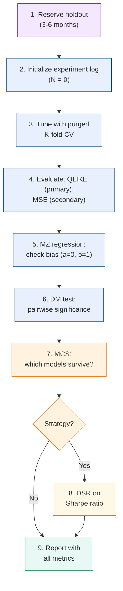

# Forecast Evaluation

> **Application: Why This Chapter Is Non-Negotiable**
>
> This chapter teaches the evaluation methodology used across all project directions.
> Every volatility forecast you produce must be evaluated with $\operatorname{QLIKE}$ (not MSE),
> compared with the Diebold--Mariano test, and placed in a Model Confidence Set.
> If you use cross-validation, it must be purged.
> If you report Sharpe ratios, they must be deflated.
> These are not optional extras; they are the minimum standard for credible work.
> Skip this chapter and your results mean nothing.

A good forecast is useless if you cannot prove it is good.
This chapter gives you the statistical machinery to distinguish genuine forecasting ability from noise, luck, and overfitting.
We cover the right loss function ($\operatorname{QLIKE}$), the right comparison test (Diebold--Mariano), the right multi-model framework (Model Confidence Set), the right cross-validation (purged K-fold with embargo), and the right Sharpe ratio adjustment (Deflated Sharpe Ratio).

## Why Evaluation Methodology Matters

Before diving into specific tools, consider two scenarios that illustrate why evaluation methodology *is* the credibility of your results.

**Scenario 1.**
You build a LightGBM volatility forecast that achieves 5% lower $\operatorname{QLIKE}$ than the HAR benchmark ([Chapter 6](ch06-har-model.md)).
Your manager asks: "Is that improvement statistically significant, or would it vanish on a different sample?"
Without a Diebold--Mariano test, you cannot answer.

**Scenario 2.**
You try 30 different feature sets, pick the best one, and report a backtest Sharpe ratio of 1.5.
A colleague asks: "What's the probability that at least one of 30 random strategies would have produced a Sharpe that high?"
Without the Deflated Sharpe Ratio, you cannot answer.

> **Warning: The Two Failure Modes**
>
> Evaluation errors come in two flavors:
>
> 1. **Declaring a winner that isn't one.** A 5% improvement in $\operatorname{QLIKE}$ that is not statistically significant is noise, not signal.
> 2. **Reporting a Sharpe ratio inflated by multiple testing.** A Sharpe of 1.5 from 30 experiments may be pure luck (Bailey and Lopez de Prado, 2014).

The evaluation framework is not a final step you tack on after research.
It is the infrastructure you build *first*, so that every experiment you run produces honest, comparable numbers from day one.

> **Key Idea: Seven Tools, Seven Questions**
>
> This chapter introduces seven evaluation tools.
> Each answers one question:
>
> 1. **QLIKE**: which model has lower loss? (Primary metric.)
> 2. **MSE**: does the ranking hold under a different loss? (Secondary check.)
> 3. **MZ regression**: is my forecast biased or too smooth? (Diagnostic.)
> 4. **DM test**: is the loss difference between two models statistically significant? (Pairwise test.)
> 5. **MCS**: given all candidate models, which ones survive? (Multi-model filter.)
> 6. **Purged CV**: how do I tune hyperparameters without leaking future data? (Training procedure.)
> 7. **DSR**: is my backtest Sharpe real after accounting for all experiments? (Multiple-testing correction.)
>
> You will use all seven, in roughly this order.

## MSE and Its Limitations for Volatility

We start with the loss function you already know, then explain why it is not enough for volatility forecasting.

> **Prereq: Loss Functions**
>
> A **loss function** $L(\sigma^2_t, h_t)$ measures how far a forecast $h_t$ is from the truth $\sigma^2_t$.
> Lower loss means a better forecast.
> You have used mean squared error (MSE) in regression problems; it is the default in most ML pipelines.

### The MSE Formula

The mean squared error between a sequence of forecasts $\{h_t\}$ and realized values $\{\sigma^2_t\}$ is:

$$
\text{MSE} = \frac{1}{T}\sum_{t=1}^{T} \bigl(\sigma^2_t - h_t\bigr)^2
$$

where:

- $\sigma^2_t$ is the true (unobservable) variance on day $t$,
- $h_t$ is the forecast variance for day $t$, produced before day $t$,
- $T$ is the number of forecast evaluation days.

> **Intuition: In Plain English**
>
> MSE measures the average squared gap between what you predicted and what actually happened.
> Squaring means big misses count disproportionately: a forecast that is off by 2 units contributes 4 to the loss, while being off by 4 units contributes 16.
> It treats over-prediction and under-prediction identically.

### The Proxy Problem

We never observe true variance $\sigma^2_t$.
Instead, we use a proxy: realized variance $\operatorname{RV}_t$ ([Chapter 2](ch02-realized-volatility.md)).
This proxy is noisy because $\operatorname{RV}_t = \sigma^2_t + \eta_t$, where $\eta_t$ is measurement error from finite sampling, microstructure noise ([Chapter 3](ch03-microstructure-noise.md)), and jumps ([Chapter 4](ch04-jumps-continuous-variation.md)).

The good news: MSE produces correct model *rankings* even when using a noisy proxy, as long as the noise is independent of the forecast (Patton, 2011).
If model A has lower MSE than model B when evaluated against $\operatorname{RV}_t$, the same ranking holds against true $\sigma^2_t$.
This property is called **robustness to noise in the proxy**.

### Why MSE Is Still Not Enough

MSE has a deeper problem: it is symmetric and heavily penalizes extreme values.

> **Intuition: MSE Penalizes Outliers Disproportionately**
>
> Suppose your forecast is $h_t = 1.0$ (in annualized variance units) for every day.
> On 249 normal days, true variance is 1.0 and MSE contribution is 0.
> On one crisis day, true variance spikes to 10.0, and MSE contribution is $(10 - 1)^2 = 81$.
> That single day dominates the entire loss.
> This means MSE-optimal forecasts chase outliers: they overweight extreme days at the expense of forecasting accuracy during normal times, which is the opposite of what most applications need.

> **Key Idea: MSE Is Necessary but Not Sufficient**
>
> MSE is proxy-robust, which is valuable.
> But its sensitivity to extreme realized variance values makes it a poor primary metric for volatility.
> Report it as a secondary check alongside $\operatorname{QLIKE}$.

> **Project Connection: Why This Matters**
>
> In your HAR vs. ML comparison, MSE will be dominated by a handful of crisis days (e.g., COVID March 2020, VIX spikes).
> A model that slightly better predicts those extremes will look dramatically better under MSE, even if it performs worse on the 95% of normal days that matter for daily risk management.
> Always report MSE as a secondary metric, but never let it drive model selection.

## QLIKE: The Preferred Loss Function

Having seen why MSE over-penalizes extreme days, we now introduce the loss function that the volatility forecasting literature has converged on as the primary metric.

### Intuition

$\operatorname{QLIKE}$ (quasi-likelihood loss) comes from the negative log-likelihood of a Gaussian distribution with variance $h_t$.
Think of it this way: if returns were exactly normal with variance $h_t$, the best forecast would minimize $\operatorname{QLIKE}$.
Even when returns are not normal (and they never are), $\operatorname{QLIKE}$ retains two critical properties that MSE shares one of and lacks the other.

### The QLIKE Formula

$$
\operatorname{QLIKE} = \frac{1}{T}\sum_{t=1}^{T} \left(\ln h_t + \frac{\sigma^2_t}{h_t}\right)
$$

where:

- $h_t$ is the forecast variance for day $t$,
- $\sigma^2_t$ is the true variance on day $t$ (in practice, $\operatorname{RV}_t$),
- $\ln h_t$ penalizes forecasts that are too large (over-prediction),
- $\sigma^2_t / h_t$ penalizes forecasts that are too small (under-prediction),
- $T$ is the number of evaluation days.

> **Intuition: In Plain English**
>
> QLIKE has two parts pulling in opposite directions.
> The $\ln h_t$ term punishes you for forecasting too high (wasting capital on unnecessary hedges), while the $\sigma^2_t / h_t$ term punishes you for forecasting too low (holding unrecognized risk).
> Critically, the under-prediction penalty ($\sigma^2_t / h_t$) explodes as $h_t \to 0$, so QLIKE is far harsher on dangerous under-estimates than on conservative over-estimates.
> This asymmetry matches real-world priorities: underestimating volatility gets you fired; overestimating it merely costs some opportunity.
> This does not mean the optimal forecast is biased upward.
> It means that among two equally wrong forecasts, the one that errs low is more costly.
> The target is still the true variance.

> **Intuition: QLIKE Is Still Minimized at the True Value**
>
> A common misreading of the asymmetric penalty is: "If under-prediction is punished more, shouldn't I forecast a bit high to be safe?"
> No.
> Take the derivative of a single day's QLIKE contribution with respect to the forecast $h_t$:
>
> $$
> \frac{\partial}{\partial h_t}\left(\ln h_t + \frac{\sigma^2_t}{h_t}\right) = \frac{1}{h_t} - \frac{\sigma^2_t}{h_t^2} = 0 \quad \Longrightarrow \quad h_t = \sigma^2_t.
> $$
>
> The minimum is at $h_t = \sigma^2_t$ exactly.
> The asymmetry shapes the penalty *curve*, not the penalty *minimum*.
> Think of a speed limit: the best speed is exactly the limit.
> Getting caught going 20 over is worse than going 20 under, but that does not make 20-under the target.
> QLIKE works the same way: the best forecast is the true variance, but being wrong on the low side hurts more than being wrong on the high side by the same amount.

> **Intuition: Why QLIKE Is Less Sensitive to Outliers**
>
> When true variance spikes to $\sigma^2_t = 10$ and your forecast is $h_t = 1$, the QLIKE contribution is $\ln(1) + 10/1 = 10$.
> Under MSE, the same day contributes $(10 - 1)^2 = 81$.
> QLIKE penalizes the error linearly (through the ratio $\sigma^2_t / h_t$) rather than quadratically.
> Extreme days still matter, but they do not dominate.

> **Key Result: Patton (2011): QLIKE and MSE Are the Only Robust Losses**
>
> Patton (2011) proves that QLIKE and MSE are the *only* two members of the standard loss function family that produce correct model rankings even when the volatility proxy is noisy.
> Other common losses (MAE, HMSE, heteroskedasticity-adjusted MSE) can reverse the true ranking when evaluated against $\operatorname{RV}_t$ instead of $\sigma^2_t$.
> Of the two robust losses, QLIKE is less sensitive to extreme $\operatorname{RV}$ days and is therefore preferred as the primary evaluation metric.

> **Key Idea: Always Report QLIKE as Primary**
>
> Use $\operatorname{QLIKE}$ as your primary loss function for volatility forecast evaluation.
> Report MSE as a secondary check.
> If the two metrics disagree on model rankings, the QLIKE ranking is more reliable for practical forecasting because it is less distorted by a few extreme days.

> **Project Connection: Why This Matters**
>
> QLIKE is THE primary evaluation metric for your project.
> When you report that your ML model beats HAR, the headline number is the percentage reduction in QLIKE.
> The asymmetry is critical: QLIKE penalizes you more for underestimating vol than overestimating it (through the $\sigma^2_t / h_t$ ratio), which aligns with risk management priorities where underestimating vol means holding too much risk.
> Target a 30--80 bps $\operatorname{QLIKE}$ improvement over HAR to claim a meaningful result.
> Report the percentage reduction to two decimal places in your results table, and always pair it with a DM test $p$-value (Section 16.4).

### Retransformation Bias

Many volatility models forecast in log space because $\log \operatorname{RV}_t$ is more Gaussian, more homoskedastic, and better behaved for regression than raw $\operatorname{RV}_t$.
The HAR-log model, for example, regresses $\log \operatorname{RV}_{t+1}$ on lagged log realized variances.
But when you need a level-space forecast (e.g., for portfolio variance targeting or VaR computation), you must exponentiate the log forecast back to levels.
This innocent-looking step introduces a systematic downward bias known as **retransformation bias**.

#### The Problem: Jensen's Inequality

The root cause is **Jensen's inequality**: for any convex function $g$ and non-degenerate random variable $X$,

$$
\mathbb{E}\bigl[g(X)\bigr] > g\bigl(\mathbb{E}[X]\bigr).
$$

The exponential function is convex, so $\mathbb{E}[\exp(X)] > \exp(\mathbb{E}[X])$.

Suppose your log-space model produces a point forecast $\widehat{\log \operatorname{RV}}_{t+1}$.
The naive level-space forecast is:

$$
\widehat{\operatorname{RV}}^{\text{naive}}_{t+1} = \exp\!\bigl(\widehat{\log \operatorname{RV}}_{t+1}\bigr).
$$

But because the log-space forecast has estimation error, the true conditional expectation of $\operatorname{RV}_{t+1}$ is *larger* than this.
Exponentiating the conditional mean of the log gives you something systematically below the conditional mean of the level.
Every single forecast is biased low.

> **Intuition: In Plain English**
>
> Think of it this way.
> Your log-space model says "the average of $\log \operatorname{RV}$ tomorrow is 0.5."
> But the average of $\operatorname{RV}$ tomorrow is not $\exp(0.5) = 1.65$.
> It is higher, because the distribution of $\log \operatorname{RV}$ has spread around 0.5, and the exponential function amplifies high values more than it shrinks low values.
> The more uncertain your log-space forecast (wider error distribution), the larger the gap between $\exp(\mathbb{E}[\log \operatorname{RV}])$ and $\mathbb{E}[\operatorname{RV}]$.

#### The Correction Formula

If log-space forecast errors are approximately Gaussian with variance $\hat{\sigma}^2_\varepsilon$, the bias-corrected level-space forecast is:

$$
\widehat{\operatorname{RV}}_{t+1} = \exp\!\left(\widehat{\log \operatorname{RV}}_{t+1} + \frac{\hat{\sigma}^2_\varepsilon}{2}\right)
$$

where:

- $\widehat{\log \operatorname{RV}}_{t+1}$ is the log-space point forecast,
- $\hat{\sigma}^2_\varepsilon$ is the estimated variance of the log-space forecast errors $\varepsilon_t = \log \operatorname{RV}_t - \widehat{\log \operatorname{RV}}_t$,
- the $\hat{\sigma}^2_\varepsilon / 2$ term is the correction that offsets Jensen's inequality.

This formula comes from the moment generating function of a Gaussian: if $\varepsilon \sim \mathcal{N}(0, \sigma^2_\varepsilon)$, then $\mathbb{E}[\exp(\varepsilon)] = \exp(\sigma^2_\varepsilon / 2)$.
The corrected forecast multiplies the naive exponential by this factor.

> **Intuition: In Plain English**
>
> The correction adds half the forecast error variance back before exponentiating.
> It says: "My best guess for $\log \operatorname{RV}$ is $\hat{y}$, but there is uncertainty of $\hat{\sigma}^2_\varepsilon$ around that guess.
> Because exponentiation amplifies upside errors more than downside errors, I need to nudge my forecast upward by $\hat{\sigma}^2_\varepsilon / 2$ to get the right average in level space."
> When forecast errors are small ($\hat{\sigma}^2_\varepsilon \approx 0$), the correction is negligible.
> When they are large, as in long-horizon forecasts or during volatile regimes, it can be substantial.

> **Warning: Without Correction, Every Forecast Is Biased Low**
>
> If you forecast in log space and naively exponentiate, your Mincer--Zarnowitz regression (Section 16.3) will show $a > 0$ (systematic under-prediction) and the bias grows with forecast uncertainty.
> During high-volatility regimes, when $\hat{\sigma}^2_\varepsilon$ is largest, the bias is at its worst, precisely when accurate forecasts matter most for risk management.

> **Key Idea: Estimating the Correction Variance**
>
> The correction requires $\hat{\sigma}^2_\varepsilon$, the variance of log-space forecast errors.
> In practice, estimate this from the training sample or from a rolling window of recent out-of-sample errors.
> Using a rolling window (e.g., the trailing 60 trading days) allows the correction to adapt to regime changes: during calm markets $\hat{\sigma}^2_\varepsilon$ is small and the correction is minor; during crises it grows, appropriately increasing the level-space forecast.

> **Project Connection: Why This Matters**
>
> Your project forecasts $\log \operatorname{RV}_{t+1}$ (because log realized variance is better behaved for HAR and LightGBM regressions), but $\operatorname{QLIKE}$ evaluation and downstream applications (volatility targeting, VaR) require level-space forecasts.
> Apply the retransformation correction whenever you convert back to levels.
> Without it, you introduce a systematic negative bias that inflates $\operatorname{QLIKE}$ loss and makes your MZ regression show $a > 0$.
> The correction is trivially cheap to compute, so there is no reason to skip it (Patton, 2011).

*[Figure: QLIKE vs. MSE penalty as a function of the forecast ratio $h_t / \sigma^2_t$. Both losses are minimized at the perfect forecast ($h_t = \sigma^2_t$, ratio $= 1$). MSE (blue curve) penalizes over- and under-prediction symmetrically, forming a parabola centered at ratio $= 1$. QLIKE (red curve) penalizes under-prediction (ratio $< 1$) much more harshly than over-prediction (ratio $> 1$): as the ratio drops toward zero, the QLIKE penalty rises steeply through the $\sigma^2_t / h_t$ term, while for ratios above 1 the penalty rises gently through $\ln h_t$. Despite this asymmetry, both losses are minimized at ratio $= 1$ (the true variance); the asymmetry shapes the penalty curve, not the optimal forecast.]*

## Mincer--Zarnowitz Regressions

$\operatorname{QLIKE}$ tells you which model has lower average loss, but it does not tell you *why* a forecast is bad.
Think of $\operatorname{QLIKE}$ as the scoreboard and the Mincer--Zarnowitz regression as the film review: $\operatorname{QLIKE}$ tells you who won; MZ tells you what to fix.
The MZ regression is a simple diagnostic that decomposes forecast errors into bias and inefficiency.

### The Regression

Regress realized variance on the forecast:

$$
\sigma^2_t = a + b \cdot h_t + \varepsilon_t
$$

where:

- $\sigma^2_t$ is realized variance (left-hand side),
- $h_t$ is the forecast (right-hand side),
- $a$ is the intercept (bias term),
- $b$ is the slope (efficiency term),
- $\varepsilon_t$ is the residual.

> **Intuition: In Plain English**
>
> The Mincer--Zarnowitz regression asks: "If I plot realized variance against my forecast, do the points lie along the 45-degree line?"
> A perfect forecast gives intercept $a = 0$ (no constant bias) and slope $b = 1$ (every unit increase in the forecast corresponds to exactly one unit increase in reality).
> If $b < 1$, your forecast is too timid; if $b > 1$, it overreacts.

> **Project Connection: Why This Matters**
>
> After fitting your ML model, run the MZ regression before anything else.
> HAR models typically show $b$ slightly below 1 (they smooth too much in high-vol regimes), and your ML extension should fix this.
> If your HARQ-ML model still shows $b = 0.85$, you know the improvement needs to come from making the forecast more reactive to recent variance spikes, not from reducing average bias.

> **Definition: Unbiased and Efficient Forecast**
>
> A forecast is **unbiased** if $a = 0$ (no systematic over- or under-prediction) and **efficient** if $b = 1$ (the forecast captures the full scale of variance movements).
> Test the joint hypothesis $H_0: a = 0, \, b = 1$ with a standard F-test (Mincer and Zarnowitz, 1969).

### Interpreting Deviations

- $a > 0$, $b \approx 1$: the forecast systematically under-predicts by a constant.
- $a \approx 0$, $b < 1$: the forecast under-reacts to variance movements (too smooth).
- $a \approx 0$, $b > 1$: the forecast over-reacts (too volatile).
- $R^2$: the fraction of realized variance variation explained by the forecast. Higher is better.

> **Intuition: Mincer--Zarnowitz as a Diagnostic**
>
> Think of the MZ regression as a "bias and calibration check."
> $\operatorname{QLIKE}$ tells you the overall score; MZ tells you what to fix.
> If $b = 0.7$, your forecast is too smooth: it needs to react more aggressively to recent information.
> If $a = 0.003$, your forecast systematically under-predicts by about 0.3 variance points.

> **Key Idea: What to Fix Based on MZ Results**
>
> The MZ regression is only useful if you act on the diagnosis:
>
> - **$b < 1$ (forecast too smooth):** your model over-relies on long-horizon averages. Try adding shorter-lag features (e.g., 1-day lagged $\operatorname{RV}$), reducing regularization strength, or increasing model capacity.
> - **$b > 1$ (forecast too reactive):** your model is chasing noise. Try increasing regularization, using a longer lookback window, or smoothing the forecast with an exponential moving average.
> - **$a > 0$ (systematic under-prediction):** check for retransformation bias first if you forecast in log space (Section 16.2.1 above). If that is not the issue, add a bias correction term or recalibrate the intercept.
> - **$a < 0$ (systematic over-prediction):** less common in volatility forecasting, but check whether your features include stale high-vol observations that inflate the forecast.

> **Warning: Use HAC Standard Errors**
>
> Volatility forecast errors are serially correlated (today's error predicts tomorrow's error) because volatility clusters ([Chapter 5](ch05-garch-family.md)).
> Use Newey--West (HAC) standard errors in the MZ regression.
> OLS standard errors will be too small, leading you to reject $H_0$ too often.

## The Diebold--Mariano Test

You now have a loss function ($\operatorname{QLIKE}$) and a diagnostic (MZ regression).
The next question is: given two models, is the difference in loss *statistically significant*, or could it be sampling noise?

### Setup

Suppose you have two volatility forecasts, $h^A_t$ and $h^B_t$, and a loss function $L$ (use $\operatorname{QLIKE}$).
Define the **loss differential**:

$$
d_t = L(\sigma^2_t, h^A_t) - L(\sigma^2_t, h^B_t)
$$

where:

- $d_t$ is the difference in loss on day $t$,
- $L(\sigma^2_t, h^A_t)$ is the loss of model A on day $t$,
- $L(\sigma^2_t, h^B_t)$ is the loss of model B on day $t$.

If $d_t > 0$ on average, model B has lower loss (model B wins).
The question is whether $\bar{d}$ is significantly different from zero.

> **Intuition: In Plain English**
>
> The loss differential $d_t$ is simply the daily scorecard: on each day, which model had a worse QLIKE score?
> Some days model A wins, some days model B wins.
> You are asking whether model B wins often enough, by enough, that it cannot be explained by random chance.

### The Test Statistic

$$
\text{DM} = \frac{\bar{d}}{\sqrt{\widehat{\text{Var}}(\bar{d})}}
$$

where:

- $\bar{d} = \frac{1}{T}\sum_{t=1}^T d_t$ is the mean loss differential,
- $\widehat{\text{Var}}(\bar{d})$ is estimated using HAC (Newey--West) standard errors to account for serial correlation in $d_t$,
- Under $H_0: \mathbb{E}[d_t] = 0$, the DM statistic is asymptotically standard normal (Diebold and Mariano, 1995).

> **Intuition: In Plain English**
>
> The DM statistic is a t-test on the average loss difference.
> The numerator is "how much better is model B on average?" and the denominator is "how uncertain are we about that average, given that consecutive days are correlated?"
> If the ratio exceeds roughly 2, you have a statistically significant winner at the 5% level.

> **Project Connection: Why This Matters**
>
> The DM test is the formal statistical test you need to claim "my ML model significantly beats HAR."
> Without it, a reviewer can dismiss any QLIKE improvement as sampling noise.
> When you report results, the DM $p$-value goes right next to the QLIKE numbers.
> If $p > 0.05$, your improvement is not credible regardless of how good the point estimate looks.

> **Prereq: HAC Standard Errors**
>
> When observations are serially correlated, the usual variance estimator $\widehat{\text{Var}}(\bar{d}) = s^2_d / T$ is biased downward.
> **Heteroskedasticity and Autocorrelation Consistent (HAC)** estimators, such as Newey--West, correct for this by including autocovariances up to some lag $\ell$.
> A common rule of thumb is $\ell = \lfloor T^{1/3} \rfloor$.
> For $T = 1{,}000$ days, this gives $\ell = 10$.

> **Warning: Small-Sample Correction**
>
> Diebold and Mariano (1995) derived the test for large samples.
> With fewer than 100 observations, use the modified DM statistic from Harvey, Leybourne, and Newbold (1997), which uses a $t$-distribution with $T-1$ degrees of freedom and applies a finite-sample correction factor.

## The Model Confidence Set

The Diebold--Mariano test compares models in pairs.
Use it when you have a specific pairwise claim to make ("my ML model beats HAR").
With $M$ models, you would need $\binom{M}{2}$ pairwise tests, and the more tests you run, the more likely you are to find a "significant" difference by chance.
The Model Confidence Set solves this by comparing all models simultaneously.
Use it when you have a model zoo and need to know which ones to keep and which to discard.
DM is your scalpel for targeted claims; MCS is your filter for the full candidate set.

### Intuition

> **Intuition: The Model Confidence Set as a Tournament**
>
> Imagine a round-robin tournament.
> Instead of declaring a single winner, the MCS procedure eliminates models that are *significantly worse* than the others and returns the set of survivors.
> The survivors are statistically indistinguishable from each other at the chosen confidence level.

### The Procedure

The MCS algorithm of Hansen, Lunde, and Nason (2011) works as follows:

1. Start with the full set of $M$ models: $\mathcal{M}_0 = \{1, 2, \ldots, M\}$.
2. Test the null hypothesis $H_0$: all models in the current set have equal expected loss.
3. If $H_0$ is rejected at significance level $\alpha$, identify and remove the worst model (the one with the highest average loss).
4. Repeat steps 2--3 on the reduced set until $H_0$ is not rejected.
5. The surviving set $\widehat{\mathcal{M}}^*_\alpha$ is the **Model Confidence Set** at level $\alpha$.

> **Definition: Model Confidence Set**
>
> The Model Confidence Set $\widehat{\mathcal{M}}^*_\alpha$ at significance level $\alpha$ contains all models whose forecasting performance is not significantly worse than the best model.
> Formally, it satisfies:
>
> $$
> \Pr\left(\mathcal{M}^* \subseteq \widehat{\mathcal{M}}^*_\alpha\right) \geq 1 - \alpha
> $$
>
> where $\mathcal{M}^*$ is the (unknown) set of truly best models.

> **Key Result: Hansen, Lunde, and Nason (2011): The Gold Standard for Multi-Model Comparison**
>
> Hansen, Lunde, and Nason (2011) show that the MCS controls the familywise error rate: the probability of incorrectly excluding any truly best model is at most $\alpha$.
> The MCS produces a *set*, not a ranking.
> Reporting "these 4 models are in the 90% MCS" is more honest than reporting "model X has the lowest QLIKE" when differences are small.

*[Figure: The Model Confidence Set. An outer rectangle represents all candidate models $\mathcal{M}_0$. Inside, a green-shaded region labeled "MCS 90%" contains four models (LightGBM, HAR, GARCH, Random Forest) that are statistically indistinguishable at the 90% confidence level. Outside the green region, two models (LSTM and Historical average) are shown in red, connected by dashed elimination arrows. The surviving models cannot be ranked among themselves with statistical confidence.]*

### Practical Use

Report which models survive at both $\alpha = 0.10$ and $\alpha = 0.05$:

| Model | QLIKE | MCS $p$-value | In MCS$_{90\%}$? |
|-------|-------|---------------|-------------------|
| LightGBM + HAR features | 1.423 | 1.000 | Yes |
| HAR (daily, weekly, monthly) | 1.441 | 0.482 | Yes |
| GARCH(1,1) | 1.467 | 0.312 | Yes |
| Random Forest | 1.439 | 0.551 | Yes |
| LSTM | 1.502 | 0.043 | No |
| Historical average | 1.589 | 0.001 | No |

The MCS $p$-value for each model is the smallest $\alpha$ at which that model would be excluded.
A model with MCS $p$-value $> 0.10$ survives in the 90% MCS.
In this example, four models are statistically indistinguishable at the 90% level; the LSTM and historical average are significantly worse.

> **Key Idea: MCS as a Humility Device**
>
> The MCS often reveals an uncomfortable truth: many models that look different in QLIKE are statistically indistinguishable.
> A 2% QLIKE improvement is rarely significant with 3--5 years of daily data.
> If your fancy model is in the same MCS as HAR, be honest about it.

> **Key Idea: What to Do When Multiple Models Survive**
>
> When four models survive the MCS, you cannot rank among them statistically.
> Choose among survivors using secondary criteria: simplicity (HAR is easier to explain to a portfolio manager than LightGBM), computational cost (GARCH fits in seconds versus minutes), interpretability (can you explain why the forecast changed?), or economic value in a downstream application ([Chapter 17](ch17-applications-projects.md)).
> The MCS does not pick your model; it eliminates the ones you should not pick.
>
> The MCS $p$-values for surviving models (1.000, 0.482, 0.312, 0.551 in the table above) are *not* a ranking.
> They indicate how far each model is from elimination: a $p$-value of 0.312 means GARCH would be eliminated at $\alpha = 0.30$ but survives at $\alpha = 0.10$.
> Do not treat these as confidence scores or use them to rank survivors.

> **Project Connection: Why This Matters**
>
> Your model needs to be IN the Model Confidence Set, and ideally, simpler baselines like raw HAR should be excluded.
> If your LightGBM model and plain HAR both survive in the 90% MCS, you cannot honestly claim superiority; report them as statistically equivalent and justify your model choice on secondary criteria (interpretability, computational cost, economic value).
> The MCS is also your defense: if a reviewer asks "why not use an LSTM?", you can show it was eliminated from the MCS.
> Use the `MCS` package in R or the `arch` library in Python to compute MCS $p$-values.

## Purged K-Fold Cross-Validation with Embargo

The tests above (DM, MCS) evaluate forecasts on a held-out sample.
But how do you *select* the model and tune hyperparameters in the first place?
Standard K-fold cross-validation fails catastrophically on time series data.
This section explains why and introduces the fix.

### Why Standard K-Fold Fails

> **Prereq: K-Fold Cross-Validation**
>
> In standard K-fold CV, you split data into $K$ equally sized folds, train on $K-1$ folds, test on the remaining fold, and rotate.
> This works when observations are independent (e.g., images, text documents).
> It does *not* work when observations are serially dependent.

Consider 5-fold CV on 1,250 trading days (5 years).
Fold 1 = days 1--250, fold 2 = days 251--500, and so on.
When testing on fold 2 (days 251--500), you train on folds 1, 3, 4, 5 (days 1--250 *and* 501--1250).

The problem: volatility on day 501 is highly correlated with volatility on day 500 (the last day of the test set).
Training on day 501 while testing on day 500 is using the future to predict the past.
Worse, if your labels use multi-day returns (e.g., 5-day forward realized variance), then the label for day 498 overlaps with the label for day 502; the training and test sets share information through the label construction.

*[Figure: Purged K-fold CV with embargo ($K=5$, $T=1{,}250$, embargo $= 2\%$). Two rows of a timeline from day 0 to day 1250. **Top row** (standard fold assignment): Fold 1 (days 1--250, blue), Test fold 2 (days 251--500, red), Fold 3 (days 501--750, blue), Fold 4 (days 751--1000, blue), Fold 5 (days 1001--1250, blue). **Bottom row** (after purging and embargo): Train (days 1--245, blue), purge zone (days 246--250, red dashed, 25 days removed), Test (days 251--500, red), embargo zone (days 501--525, purple dashed, 25 days removed), Train (days 526--750, blue), Train (days 751--1000, blue), Train (days 1001--1250, blue). The purge zone before the test set prevents label overlap; the embargo zone after the test set prevents information leakage from serial correlation.]*

### The Fix: Purging and Embargo

Lopez de Prado (2018) introduces two modifications to standard K-fold CV:

> **Definition: Purging**
>
> **Purging** removes from the training set any observations whose label windows overlap with the test period.
> If labels are constructed from $\tau$-day forward returns, remove training observations within $\tau$ days before the start of the test fold.

> **Definition: Embargo**
>
> **Embargo** removes an additional buffer of training observations *after* the end of the test fold.
> This guards against serial correlation in features: day $t+1$ features are correlated with day $t$ features, so training on day $t+1$ while testing on day $t$ leaks information.
> A typical embargo is 1--2% of total sample size.
> The embargo length should cover the autocorrelation decay of your features.
> For HAR features (which use lags up to 22 days), the serial correlation in $\operatorname{RV}$ drops below 0.05 within about 5--10 days, so 1--2% of a typical 1,000--2,500 day sample (10--50 days) is conservative.
> If you use features with longer memory (e.g., monthly moving averages or regime indicators), increase the embargo accordingly.

> **Project Connection: Why This Matters**
>
> Your vol forecasting labels use multi-day forward realized variance (typically 1-day or 5-day), which means label windows overlap across consecutive observations.
> Standard K-fold would train on day 502 (whose label includes returns from days 502--506) while testing on day 500 (whose label includes days 500--504).
> The overlapping days 502--504 leak test information into training.
> Purging removes this overlap; embargo handles the residual serial correlation in features like lagged RV.
> Use `sklearn.model_selection.TimeSeriesSplit` as a starting point, then add purging and embargo manually or use the `purged_cv` implementation from Lopez de Prado (2018).

> **Warning: Random K-Fold on Time Series Is Catastrophic**
>
> Random K-fold on time series data (shuffling observations before splitting) is the single most common evaluation error in ML-for-finance papers.
> A model trained on January and March, tested on February, has literally seen the future.
> Reported accuracy will be dramatically inflated; out-of-sample performance will collapse.
> Always use purged CV, expanding-window, or walk-forward evaluation for time series.

## The Deflated Sharpe Ratio

Everything above evaluates *forecasts* of volatility.
But volatility forecasts are often embedded in trading strategies (volatility targeting, variance risk premium trading; see [Chapter 9](ch09-variance-risk-premium.md) and [Chapter 17](ch17-applications-projects.md)).
The standard performance metric for strategies is the Sharpe ratio.
This section explains why raw Sharpe ratios are misleading when you have tried multiple strategies, and how to correct them.

### The Multiple Testing Problem

> **Intuition: Sharpe Ratios and Coin Flips**
>
> Suppose you flip 30 fair coins 250 times each and report only the coin with the most heads.
> That coin will show a "success rate" well above 50%, but it has no skill; you simply selected the luckiest coin.
> The same logic applies to Sharpe ratios: if you try 30 feature sets and report the best one, the expected maximum Sharpe ratio under the null (no skill) is not zero.

Bailey and Lopez de Prado (2014) derive the expected maximum Sharpe ratio under the null when $N$ independent strategies are tested:

$$
\mathbb{E}\bigl[\max_{i=1,\ldots,N} \operatorname{SR}_i\bigr] \approx \sqrt{2 \ln N}
$$

where:

- $N$ is the number of independent strategies (or feature sets, or hyperparameter combinations) tested,
- $\operatorname{SR}_i$ is the Sharpe ratio of strategy $i$ under the null (all strategies have true $\operatorname{SR} = 0$),
- The approximation comes from extreme value theory for Gaussian maxima.

For $N = 30$, this gives $\mathbb{E}[\max \operatorname{SR}] \approx \sqrt{2 \ln 30} \approx 2.61$.
A reported Sharpe of 1.5 after 30 trials is *below* what you would expect from pure luck.

> **Intuition: In Plain English**
>
> This formula says: the more strategies you try, the higher the Sharpe ratio you should expect from the luckiest one, even if none of them have any real skill.
> It grows slowly (as $\sqrt{\ln N}$), but 30 trials already pushes the luck threshold to a Sharpe of 2.6.
> Your observed Sharpe must exceed this threshold to be credible.

> **Project Connection: Why This Matters**
>
> If you test 20 hyperparameter configurations for your vol-timing strategy, the expected maximum Sharpe under pure luck is $\sqrt{2 \ln 20} \approx 2.45$.
> Any backtest Sharpe below this number is entirely consistent with having no skill.
> This is why you must log every experiment from the start: $N$ only grows, and forgetting trials inflates your apparent performance.

### The DSR Formula

The Deflated Sharpe Ratio adjusts the observed Sharpe ratio for the number of trials:

$$
\operatorname{DSR} = \Phi\!\left(\frac{(\widehat{\operatorname{SR}} - \operatorname{SR}_0)\sqrt{T-1}}{\sqrt{1 - \hat{\gamma}_3 \widehat{\operatorname{SR}} + \frac{\hat{\gamma}_4 - 1}{4}\widehat{\operatorname{SR}}^2}}\right)
$$

where:

- $\operatorname{DSR} \in [0, 1]$ is the probability that the observed Sharpe exceeds the multiple-testing threshold (higher is better),
- $\widehat{\operatorname{SR}}$ is the observed (annualized) Sharpe ratio of the best strategy,
- $\operatorname{SR}_0 = \sqrt{2 \ln N}$ is the expected maximum Sharpe under the null, with $N =$ number of trials,
- $T$ is the number of return observations,
- $\hat{\gamma}_3$ is the sample skewness of returns,
- $\hat{\gamma}_4$ is the sample kurtosis of returns,
- $\Phi(\cdot)$ is the standard normal CDF.

> **Intuition: In Plain English**
>
> The DSR converts your observed Sharpe ratio into a probability: "What is the chance that this Sharpe is real, given how many strategies I tried?"
> It subtracts the luck threshold ($\operatorname{SR}_0$) from your observed Sharpe, scales by sample size, and adjusts for skewness and fat tails in your returns.
> A DSR near 1 means your Sharpe is almost certainly genuine; a DSR near 0 means it is probably luck.

> **Project Connection: Why This Matters**
>
> If your vol-forecasting project includes a variance risk premium trading strategy ([Chapter 9](ch09-variance-risk-premium.md)), you will need to report DSR alongside the raw Sharpe.
> With the typical 10--30 experiments you will run during hyperparameter tuning, even a Sharpe of 1.5 can be entirely consistent with luck.
> DSR $> 0.95$ is the bar for a credible backtest result.
> If DSR $< 0.95$, do not claim the strategy has skill; report the DSR value and the number of trials $N$ alongside the raw Sharpe so readers can judge for themselves.

> **Key Result: Bailey and Lopez de Prado (2014): The Deflated Sharpe Ratio**
>
> Bailey and Lopez de Prado (2014) show that ignoring the number of trials leads to systematic over-reporting of Sharpe ratios in backtested strategies.
> The DSR corrects for this by benchmarking the observed Sharpe against the expected maximum under the null.
> A DSR above 0.95 provides evidence that the strategy's Sharpe ratio is unlikely to have arisen from multiple testing alone.

> **Key Idea: Every Experiment Counts as a Trial**
>
> The DSR requires you to know $N$, the total number of strategies tested.
> This includes every feature set, every hyperparameter grid point, every "quick look" that influenced your final choice.
> If you do not log experiments, you cannot compute an honest DSR.
> This is why the experiment tracker (logging every trial) is infrastructure you build *before* you start modeling.

> **Warning: The Haircut Sharpe Ratio**
>
> Harvey and Liu (2015) propose a complementary correction.
> Rather than computing a probability, they "haircut" the Sharpe ratio by the amount attributable to multiple testing.
> The haircut depends on the number of trials and the correlation among strategies.
> Both DSR and Haircut Sharpe tell the same story: raw Sharpe ratios from backtests are systematically inflated.
> Report both if possible.

## What Doesn't Work

You now have the full evaluation toolkit: a loss function ($\operatorname{QLIKE}$), a diagnostic (MZ), a pairwise test (DM), a multi-model filter (MCS), a leakage-proof CV procedure, and a multiple-testing correction (DSR).
This section catalogs the mistakes these tools are designed to prevent, so you can recognize them in other people's work and avoid them in your own.

> **Warning: Evaluation Pitfalls**
>
> 1. **Random K-fold on time series.**
>    Shuffling observations before splitting destroys temporal structure.
>    Reported accuracy is inflated; real performance collapses.
>    Always use purged CV or walk-forward (Section 16.6 above).
>
> 2. **Naive out-of-sample $R^2$ without statistical tests.**
>    "Our model achieves OOS $R^2 = 3.2\%$ versus the benchmark's 2.8%."
>    Without a DM test (Section 16.4) or MCS (Section 16.5), you do not know whether 0.4 percentage points is signal or noise.
>
> 3. **Training on one regime, testing on another.**
>    Training on 2015--2019 (low volatility) and testing on 2020 (COVID) is not a fair evaluation; it is a regime-change stress test.
>    Useful, but do not confuse it with a general OOS evaluation.
>
> 4. **Look-ahead in feature construction.**
>    Using day-$t$ VIX close to predict day-$t$ realized variance is look-ahead bias: VIX is not known until 4:15 PM, while RV accumulates throughout the day.
>    All features must be known *before* the forecast is made.
>
> 5. **Reporting tiny improvements without economic significance.**
>    Beating HAR by 0.5% in QLIKE is unlikely to translate to meaningful PnL after transaction costs.
>    Always pair statistical significance (DM test) with economic significance (cost-aware backtest; [Chapter 17](ch17-applications-projects.md)).
>
> 6. **Ignoring forecast variance.**
>    A model that is right on average but has high forecast variance is dangerous for volatility targeting.
>    Two models with identical QLIKE can differ dramatically in how "jumpy" their forecasts are.
>    Report forecast autocorrelation and turnover alongside loss metrics.

### Lookahead Bias: A Taxonomy of Four Sources

Item 4 in the list above (look-ahead in feature construction) deserves a full subsection because lookahead bias is the single most destructive error in financial ML.
A contaminated model shows excellent in-sample performance that vanishes out of sample, wasting weeks of development time before the bug is identified.

Lookahead bias occurs whenever a feature used at prediction time contains information that would not have been available at the moment the forecast was made.
In volatility forecasting, there are four distinct sources, each with its own failure mode.
Understanding them concretely, with specific examples of how each one can leak future information into your features, is essential for building a trustworthy pipeline.

#### Source 1: Realized Measures

**Realized variance** ([Chapter 2](ch02-realized-volatility.md)) is computed from intraday returns over a trading day.
The danger is that the boundary between "today" and "tomorrow" is not always clean.

> **Warning: Realized Measure Leakage**
>
> Suppose you forecast $\operatorname{RV}_{t+1}$ (tomorrow's realized variance) using features that include $\operatorname{RV}_t$ (today's realized variance).
> If you compute $\operatorname{RV}_t$ using returns from 9:30 AM to 4:00 PM, but the last intraday return spans 3:55--4:00 PM, that return reflects information that overlaps with the overnight period leading into day $t+1$.
> In tick-level data, the problem is worse: the last trade might occur at 4:00:02 PM, technically after the close.
> Even a few seconds of overlap contaminates the feature with forward-looking information.

> **Key Idea: Prevention: Strict Temporal Cutoff**
>
> All features for forecasting $\operatorname{RV}_{t+1}$ must use data from day $t$ or earlier.
> Define $\operatorname{RV}_t$ using a fixed, consistent intraday window (e.g., 9:30 AM to 3:59 PM) and apply this cutoff uniformly across all realized measures: $\operatorname{RV}$, realized quarticity (RQ), bipower variation (BV), and signed components ($\operatorname{RV}^+$, $\operatorname{RV}^-$).
> Timestamp every data point and assert programmatically that no feature for $\operatorname{RV}_{t+1}$ uses data with timestamp $> t$ close.
> When in doubt, lag by one full day.

#### Source 2: Microstructure Features

**Microstructure features** ([Chapter 3](ch03-microstructure-noise.md)) are derived from limit order book (LOB) data, trade-and-quote streams, and intraday volume profiles.
They are particularly vulnerable to lookahead because they are computed over intraday windows whose boundaries must be carefully aligned with the forecast target.

> **Warning: LOB Feature Leakage**
>
> Suppose you compute the **Volume-Synchronized Probability of Informed Trading (VPIN)** over the full trading day from 9:30 AM to 4:00 PM and use it as a feature for forecasting $\operatorname{RV}_{t+1}$.
> The last hour of VPIN reflects order flow patterns driven by information that will affect the overnight return and the opening of day $t+1$.
> For example, a large informed seller at 3:45 PM depresses the close and widens the spread; this information is not "known" to a forecaster who must act at 3:00 PM.
> Full-day microstructure features effectively let you "see" information that accumulates between your forecast time and the close.

> **Key Idea: Prevention: Truncate LOB Features Before Close**
>
> Truncate all intraday microstructure features at a fixed cutoff before the market close.
> A common choice is 3:00 PM (one hour before close) or even 2:00 PM for conservative pipelines.
> Apply this cutoff uniformly to VPIN, Kyle's lambda, Amihud illiquidity, bid-ask spread averages, and depth imbalance measures.
> Document the cutoff time as a pipeline parameter, not a magic number buried in preprocessing code.

#### Source 3: Options Surface

**Implied volatility** from the options surface ([Chapter 5](ch05-garch-family.md) and [Chapter 17](ch17-applications-projects.md)) is a forward-looking feature by design: it encodes the market's expectation of future volatility.
This makes it powerful but also dangerous, because the surface updates throughout the day in response to new information.

> **Warning: Implied Volatility Leakage**
>
> Suppose you use the 3:30 PM VIX level as a feature for forecasting next-day $\operatorname{RV}$.
> If a company announces earnings at 4:05 PM, the options market will begin pricing in the expected earnings move before the announcement: implied volatility rises during the last hour of trading.
> The 3:30 PM VIX already reflects this anticipation.
> A forecaster using this feature has access to information about the expected earnings-day volatility spike that is not "available" in the sense of a genuine real-time forecast made at, say, the previous close.
> More subtly, the SPX implied volatility surface at 3:30 PM reflects the full day's information flow, including any macro data releases, Fed communications, or geopolitical events that occurred during the day.

> **Key Idea: Prevention: Use Previous-Day Close or Morning Snapshot**
>
> Use the end-of-day implied volatility surface from day $t-1$ (the previous close) or a fixed morning snapshot (e.g., 10:00 AM) as features for forecasting $\operatorname{RV}_{t+1}$.
> Never use same-day afternoon implied volatility for next-day forecasts.
> For VIX and VIX term structure features, the same rule applies: use the previous close, not the intraday value.
> If you need intraday IV features for same-day forecasting (e.g., predicting afternoon $\operatorname{RV}$ from morning data), use a morning-only window and document it explicitly.

#### Source 4: Cross-Asset Features

**Cross-asset features** ([Chapter 17](ch17-applications-projects.md)) use data from other markets (e.g., European equities, commodities, currencies, Treasuries) to predict volatility in the target asset (e.g., SPX).
The complication is that these markets operate on different schedules, creating timestamp misalignment that can hide lookahead bias.

> **Warning: Cross-Asset Timing Leakage**
>
> Suppose you use the EURO STOXX 50 realized variance as a feature for predicting SPX $\operatorname{RV}_{t+1}$.
> European markets close at 4:30 PM CET (10:30 AM ET).
> If you label the European close as "day $t$" data, it is available before the US close on day $t$ at 4:00 PM ET, which is fine.
> But if the European data is labeled "day $t$" and the US target is also "day $t$," you may inadvertently use European close data that overlaps with the US target window.
> Worse, some cross-asset data sources (e.g., Asian markets) close well before the US open; using "day $t$" Asian close data for a US "day $t+1$" forecast is correct, but using it for a US "day $t$" forecast means the Asian data is stale and the time alignment is ambiguous.

> **Key Idea: Prevention: Align to a Single Information Cutoff**
>
> Define a single, global **information cutoff time** for each forecast date (e.g., previous-day US close at 4:00 PM ET).
> All cross-asset features must use data from before this cutoff.
> For European data, this means using the European close from the same calendar day (since it precedes the US close).
> For Asian data, use the Asian close from the same calendar day (which precedes the US open).
> Build an explicit timezone-aware timestamp column for every data source and assert that all feature timestamps precede the cutoff.

#### Summary

The table below collects all four sources with their specific pitfalls and prevention rules.

| Source | Pitfall | Prevention Rule |
|--------|---------|-----------------|
| Realized measures | Target-day intraday returns leak into features via boundary overlap | Features use data only up to day $t$ close; enforce with programmatic timestamp assertions |
| Microstructure | Full-day LOB features (VPIN, spreads) include close-period information | Truncate all LOB features at a fixed cutoff (e.g., 3:00 PM) before close |
| Options surface | Intraday IV changes reflect target-day information (e.g., earnings anticipation) | Use previous-day close IV or a fixed morning snapshot only |
| Cross-asset | Mixed frequencies and timezone misalignment hide temporal overlap | Align all cross-asset features to a single information cutoff (previous-day US close) |

> **Project Connection: Why This Matters**
>
> Your pipeline ingests data from at least four different source types (tick data, LOB depth, options surface, cross-asset indices), each with its own timestamp conventions.
> Build the lookahead prevention into your data pipeline as hard constraints, not as documentation that you hope developers will follow.
> Specifically:
> (1) add a `max_timestamp` column to every feature table and assert it precedes the forecast cutoff;
> (2) run a nightly integration test that checks no feature for $\operatorname{RV}_{t+1}$ uses data with timestamp $> t$ close;
> (3) when adding new features, require the contributor to specify the information cutoff in the feature registry.
> A single lookahead bug can invalidate months of work and is almost impossible to detect from $\operatorname{QLIKE}$ numbers alone: the contaminated model simply looks "better than it should."

## Putting It All Together: An Evaluation Workflow

You now have all the individual tools. This section assembles them into a practical workflow you should follow for every volatility forecasting experiment.

*Figure: Evaluation workflow for volatility forecasting. Reserve the holdout first; log every experiment; use purged CV for tuning; evaluate with QLIKE and MZ; compare with DM and MCS; deflate the Sharpe if the forecast feeds a strategy. Every experiment increments $N$. Log feature set, hyperparameters, and QLIKE.*

> **Key Idea: The Workflow Is the Standard**
>
> Following this workflow does not guarantee you will find a good forecast.
> It guarantees that if you *do* find one, the evidence will survive scrutiny.
> Skip any step and a careful reader can dismiss your results.

## Summary

- **MSE is proxy-robust** but over-penalizes extreme variance days, making it a poor primary metric for volatility.

- **QLIKE is the preferred primary loss** for volatility forecast evaluation. It is proxy-robust *and* less sensitive to outliers than MSE (Patton, 2011).

- **QLIKE and MSE are the only two robust losses.** Other common losses (MAE, HMSE) can reverse model rankings when the volatility proxy is noisy.

- **Retransformation bias** arises when exponentiating log-space forecasts back to levels. Apply the correction $\exp(\hat{y} + \hat{\sigma}^2_\varepsilon/2)$ to avoid systematic under-prediction that grows with forecast uncertainty (Patton, 2011).

- **Mincer--Zarnowitz regressions** diagnose bias ($a \neq 0$) and inefficiency ($b \neq 1$) in forecasts. Use HAC standard errors.

- **The Diebold--Mariano test** determines whether the difference in loss between two models is statistically significant, accounting for serial correlation via HAC standard errors (Diebold and Mariano, 1995).

- **The Model Confidence Set** compares all models simultaneously, returning the set of models that are statistically indistinguishable from the best. It controls familywise error (Hansen, Lunde, and Nason, 2011).

- **Purged K-fold CV with embargo** prevents information leakage in time series cross-validation by removing overlapping labels (purge) and serial-correlation buffers (embargo) (Lopez de Prado, 2018).

- **Random K-fold on time series is catastrophic.** It inflates reported accuracy by training on future data.

- **The Deflated Sharpe Ratio** corrects backtested Sharpe ratios for the number of strategies tested. Every experiment counts as a trial (Bailey and Lopez de Prado, 2014).

- **Log every experiment.** You cannot compute an honest DSR without knowing $N$.

- **Statistical significance is necessary but not sufficient.** Pair DM tests with economic significance: does the improvement survive transaction costs?

- **Lookahead bias has four sources** in volatility pipelines: realized measures, microstructure features, options surface, and cross-asset data. Each requires a specific prevention rule; build these as hard constraints in your pipeline, not as documentation.

- **Follow the full workflow** (the evaluation workflow diagram above): reserve holdout, log experiments, purged CV, QLIKE, MZ, DM, MCS, DSR.

### Key Results Recap

| Tool | What It Does | Key Reference |
|------|-------------|---------------|
| QLIKE loss | Primary loss function; proxy-robust, outlier-resistant | Patton (2011) |
| MSE loss | Secondary loss; proxy-robust but outlier-sensitive | Patton (2011) |
| Mincer--Zarnowitz | Diagnoses forecast bias and inefficiency | Mincer and Zarnowitz (1969) |
| Diebold--Mariano | Pairwise statistical test of loss difference | Diebold and Mariano (1995) |
| Model Confidence Set | Multi-model comparison; returns surviving set | Hansen, Lunde, and Nason (2011) |
| Purged K-fold CV | Time-series CV without look-ahead | Lopez de Prado (2018) |
| Deflated Sharpe Ratio | Corrects Sharpe for multiple testing | Bailey and Lopez de Prado (2014) |
| Haircut Sharpe | Alternative multiple-testing correction | Harvey and Liu (2015) |
