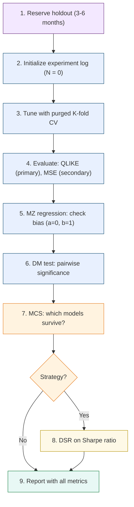

# Forecast Evaluation

> **Application: Why This Chapter Is Non-Negotiable**
>
> This chapter teaches the evaluation methodology used across all project directions.
> Every volatility forecast you produce must be evaluated with $\operatorname{QLIKE}$ (not MSE),
> compared with the Diebold--Mariano test, and placed in a Model Confidence Set.
> If you use cross-validation, it must be purged.
> If you report Sharpe ratios, they must be deflated.
> These are not optional extras; they are the minimum standard for credible work.
> Skip this chapter and your results mean nothing.

A good forecast is useless if you cannot prove it is good.
This chapter gives you the statistical machinery to distinguish genuine forecasting ability from noise, luck, and overfitting.
We cover the right loss function ($\operatorname{QLIKE}$), the right comparison test (Diebold--Mariano), the right multi-model framework (Model Confidence Set), the right cross-validation (purged K-fold with embargo), and the right Sharpe ratio adjustment (Deflated Sharpe Ratio).

## Why Evaluation Methodology Matters

Before diving into specific tools, consider two scenarios that illustrate why evaluation methodology *is* the credibility of your results.

**Scenario 1.**
You build a LightGBM volatility forecast that achieves 5% lower $\operatorname{QLIKE}$ than the HAR benchmark ([Chapter 6](ch06-har-model.md)).
Your manager asks: "Is that improvement statistically significant, or would it vanish on a different sample?"
Without a Diebold--Mariano test, you cannot answer.

**Scenario 2.**
You try 30 different feature sets, pick the best one, and report a backtest Sharpe ratio of 1.5.
A colleague asks: "What's the probability that at least one of 30 random strategies would have produced a Sharpe that high?"
Without the Deflated Sharpe Ratio, you cannot answer.

> **Warning: The Two Failure Modes**
>
> Evaluation errors come in two flavors:
>
> 1. **Declaring a winner that isn't one.** A 5% improvement in $\operatorname{QLIKE}$ that is not statistically significant is noise, not signal.
> 2. **Reporting a Sharpe ratio inflated by multiple testing.** A Sharpe of 1.5 from 30 experiments may be pure luck (Bailey and Lopez de Prado, 2014).

The evaluation framework is not a final step you tack on after research.
It is the infrastructure you build *first*, so that every experiment you run produces honest, comparable numbers from day one.

> **Key Idea: Seven Tools, Seven Questions**
>
> This chapter introduces seven evaluation tools.
> Each answers one question:
>
> 1. **QLIKE**: which model has lower loss? (Primary metric.)
> 2. **MSE**: does the ranking hold under a different loss? (Secondary check.)
> 3. **MZ regression**: is my forecast biased or too smooth? (Diagnostic.)
> 4. **DM test**: is the loss difference between two models statistically significant? (Pairwise test.)
> 5. **MCS**: given all candidate models, which ones survive? (Multi-model filter.)
> 6. **Purged CV**: how do I tune hyperparameters without leaking future data? (Training procedure.)
> 7. **DSR**: is my backtest Sharpe real after accounting for all experiments? (Multiple-testing correction.)
>
> You will use all seven, in roughly this order.

## MSE and Its Limitations for Volatility

We start with the loss function you already know, then explain why it is not enough for volatility forecasting.

> **Prereq: Loss Functions**
>
> A **loss function** $L(\sigma^2_t, h_t)$ measures how far a forecast $h_t$ is from the truth $\sigma^2_t$.
> Lower loss means a better forecast.
> You have used mean squared error (MSE) in regression problems; it is the default in most ML pipelines.

### The MSE Formula

The mean squared error between a sequence of forecasts $\{h_t\}$ and realized values $\{\sigma^2_t\}$ is:

$$
\text{MSE} = \frac{1}{T}\sum_{t=1}^{T} \bigl(\sigma^2_t - h_t\bigr)^2
$$

where:

- $\sigma^2_t$ is the true (unobservable) variance on day $t$,
- $h_t$ is the forecast variance for day $t$, produced before day $t$,
- $T$ is the number of forecast evaluation days.

> **Intuition: In Plain English**
>
> MSE measures the average squared gap between what you predicted and what actually happened.
> Squaring means big misses count disproportionately: a forecast that is off by 2 units contributes 4 to the loss, while being off by 4 units contributes 16.
> It treats over-prediction and under-prediction identically.

### The Proxy Problem

We never observe true variance $\sigma^2_t$.
Instead, we use a proxy: realized variance $\operatorname{RV}_t$ ([Chapter 2](ch02-realized-volatility.md)).
This proxy is noisy because $\operatorname{RV}_t = \sigma^2_t + \eta_t$, where $\eta_t$ is measurement error from finite sampling, microstructure noise ([Chapter 3](ch03-microstructure-noise.md)), and jumps ([Chapter 4](ch04-jumps-continuous-variation.md)).

The good news: MSE produces correct model *rankings* even when using a noisy proxy, as long as the noise is independent of the forecast (Patton, 2011).
If model A has lower MSE than model B when evaluated against $\operatorname{RV}_t$, the same ranking holds against true $\sigma^2_t$.
This property is called **robustness to noise in the proxy**.

### Why MSE Is Still Not Enough

MSE has a deeper problem: it is symmetric and heavily penalizes extreme values.

> **Intuition: MSE Penalizes Outliers Disproportionately**
>
> Suppose your forecast is $h_t = 1.0$ (in annualized variance units) for every day.
> On 249 normal days, true variance is 1.0 and MSE contribution is 0.
> On one crisis day, true variance spikes to 10.0, and MSE contribution is $(10 - 1)^2 = 81$.
> That single day dominates the entire loss.
> This means MSE-optimal forecasts chase outliers: they overweight extreme days at the expense of forecasting accuracy during normal times, which is the opposite of what most applications need.

> **Key Idea: MSE Is Necessary but Not Sufficient**
>
> MSE is proxy-robust, which is valuable.
> But its sensitivity to extreme realized variance values makes it a poor primary metric for volatility.
> Report it as a secondary check alongside $\operatorname{QLIKE}$.

> **Project Connection: Why This Matters**
>
> In your HAR vs. ML comparison, MSE will be dominated by a handful of crisis days (e.g., COVID March 2020, VIX spikes).
> A model that slightly better predicts those extremes will look dramatically better under MSE, even if it performs worse on the 95% of normal days that matter for daily risk management.
> Always report MSE as a secondary metric, but never let it drive model selection.

## QLIKE: The Preferred Loss Function

Having seen why MSE over-penalizes extreme days, we now introduce the loss function that the volatility forecasting literature has converged on as the primary metric.

### Intuition

$\operatorname{QLIKE}$ (quasi-likelihood loss) comes from the negative log-likelihood of a Gaussian distribution with variance $h_t$.
Think of it this way: if returns were exactly normal with variance $h_t$, the best forecast would minimize $\operatorname{QLIKE}$.
Even when returns are not normal (and they never are), $\operatorname{QLIKE}$ retains two critical properties that MSE shares one of and lacks the other.

### The QLIKE Formula

$$
\operatorname{QLIKE} = \frac{1}{T}\sum_{t=1}^{T} \left(\ln h_t + \frac{\sigma^2_t}{h_t}\right)
$$

where:

- $h_t$ is the forecast variance for day $t$,
- $\sigma^2_t$ is the true variance on day $t$ (in practice, $\operatorname{RV}_t$),
- $\ln h_t$ penalizes forecasts that are too large (over-prediction),
- $\sigma^2_t / h_t$ penalizes forecasts that are too small (under-prediction),
- $T$ is the number of evaluation days.

> **Intuition: In Plain English**
>
> QLIKE has two parts pulling in opposite directions.
> The $\ln h_t$ term punishes you for forecasting too high (wasting capital on unnecessary hedges), while the $\sigma^2_t / h_t$ term punishes you for forecasting too low (holding unrecognized risk).
> Critically, the under-prediction penalty ($\sigma^2_t / h_t$) explodes as $h_t \to 0$, so QLIKE is far harsher on dangerous under-estimates than on conservative over-estimates.
> This asymmetry matches real-world priorities: underestimating volatility gets you fired; overestimating it merely costs some opportunity.
> This does not mean the optimal forecast is biased upward.
> It means that among two equally wrong forecasts, the one that errs low is more costly.
> The target is still the true variance.

> **Intuition: QLIKE Is Still Minimized at the True Value**
>
> A common misreading of the asymmetric penalty is: "If under-prediction is punished more, shouldn't I forecast a bit high to be safe?"
> No.
> Take the derivative of a single day's QLIKE contribution with respect to the forecast $h_t$:
>
> $$
> \frac{\partial}{\partial h_t}\left(\ln h_t + \frac{\sigma^2_t}{h_t}\right) = \frac{1}{h_t} - \frac{\sigma^2_t}{h_t^2} = 0 \quad \Longrightarrow \quad h_t = \sigma^2_t.
> $$
>
> The minimum is at $h_t = \sigma^2_t$ exactly.
> The asymmetry shapes the penalty *curve*, not the penalty *minimum*.
> Think of a speed limit: the best speed is exactly the limit.
> Getting caught going 20 over is worse than going 20 under, but that does not make 20-under the target.
> QLIKE works the same way: the best forecast is the true variance, but being wrong on the low side hurts more than being wrong on the high side by the same amount.

> **Intuition: Why QLIKE Is Less Sensitive to Outliers**
>
> When true variance spikes to $\sigma^2_t = 10$ and your forecast is $h_t = 1$, the QLIKE contribution is $\ln(1) + 10/1 = 10$.
> Under MSE, the same day contributes $(10 - 1)^2 = 81$.
> QLIKE penalizes the error linearly (through the ratio $\sigma^2_t / h_t$) rather than quadratically.
> Extreme days still matter, but they do not dominate.

> **Key Result: Patton (2011): QLIKE and MSE Are the Only Robust Losses**
>
> Patton (2011) proves that QLIKE and MSE are the *only* two members of the standard loss function family that produce correct model rankings even when the volatility proxy is noisy.
> Other common losses (MAE, HMSE, heteroskedasticity-adjusted MSE) can reverse the true ranking when evaluated against $\operatorname{RV}_t$ instead of $\sigma^2_t$.
> Of the two robust losses, QLIKE is less sensitive to extreme $\operatorname{RV}$ days and is therefore preferred as the primary evaluation metric.

> **Key Idea: Always Report QLIKE as Primary**
>
> Use $\operatorname{QLIKE}$ as your primary loss function for volatility forecast evaluation.
> Report MSE as a secondary check.
> If the two metrics disagree on model rankings, the QLIKE ranking is more reliable for practical forecasting because it is less distorted by a few extreme days.

> **Project Connection: Why This Matters**
>
> QLIKE is THE primary evaluation metric for your project.
> When you report that your ML model beats HAR, the headline number is the percentage reduction in QLIKE.
> The asymmetry is critical: QLIKE penalizes you more for underestimating vol than overestimating it (through the $\sigma^2_t / h_t$ ratio), which aligns with risk management priorities where underestimating vol means holding too much risk.
> Target a 30--80 bps $\operatorname{QLIKE}$ improvement over HAR to claim a meaningful result.
> Report the percentage reduction to two decimal places in your results table, and always pair it with a DM test $p$-value (Section "The Diebold--Mariano Test").

### Retransformation Bias

Many volatility models forecast in log space because $\log \operatorname{RV}_t$ is more Gaussian, more homoskedastic, and better behaved for regression than raw $\operatorname{RV}_t$.
The HAR-log model, for example, regresses $\log \operatorname{RV}_{t+1}$ on lagged log realized variances.
But when you need a level-space forecast (e.g., for portfolio variance targeting or VaR computation), you must exponentiate the log forecast back to levels.
This innocent-looking step introduces a systematic downward bias known as **retransformation bias**.

#### The Problem: Jensen's Inequality

The root cause is **Jensen's inequality**: for any convex function $g$ and non-degenerate random variable $X$,

$$
\mathbb{E}\bigl[g(X)\bigr] > g\bigl(\mathbb{E}[X]\bigr).
$$

The exponential function is convex, so $\mathbb{E}[\exp(X)] > \exp(\mathbb{E}[X])$.

Suppose your log-space model produces a point forecast $\widehat{\log \operatorname{RV}}_{t+1}$.
The naive level-space forecast is:

$$
\widehat{\operatorname{RV}}^{\text{naive}}_{t+1} = \exp\!\bigl(\widehat{\log \operatorname{RV}}_{t+1}\bigr).
$$

But because the log-space forecast has estimation error, the true conditional expectation of $\operatorname{RV}_{t+1}$ is *larger* than this.
Exponentiating the conditional mean of the log gives you something systematically below the conditional mean of the level.
Every single forecast is biased low.

> **Intuition: In Plain English**
>
> Think of it this way.
> Your log-space model says "the average of $\log \operatorname{RV}$ tomorrow is 0.5."
> But the average of $\operatorname{RV}$ tomorrow is not $\exp(0.5) = 1.65$.
> It is higher, because the distribution of $\log \operatorname{RV}$ has spread around 0.5, and the exponential function amplifies high values more than it shrinks low values.
> The more uncertain your log-space forecast (wider error distribution), the larger the gap between $\exp(\mathbb{E}[\log \operatorname{RV}])$ and $\mathbb{E}[\operatorname{RV}]$.

#### The Correction Formula

If log-space forecast errors are approximately Gaussian with variance $\hat{\sigma}^2_\varepsilon$, the bias-corrected level-space forecast is:

$$
\widehat{\operatorname{RV}}_{t+1} = \exp\!\left(\widehat{\log \operatorname{RV}}_{t+1} + \frac{\hat{\sigma}^2_\varepsilon}{2}\right)
$$

where:

- $\widehat{\log \operatorname{RV}}_{t+1}$ is the log-space point forecast,
- $\hat{\sigma}^2_\varepsilon$ is the estimated variance of the log-space forecast errors $\varepsilon_t = \log \operatorname{RV}_t - \widehat{\log \operatorname{RV}}_t$,
- the $\hat{\sigma}^2_\varepsilon / 2$ term is the correction that offsets Jensen's inequality.

This formula comes from the moment generating function of a Gaussian: if $\varepsilon \sim \mathcal{N}(0, \sigma^2_\varepsilon)$, then $\mathbb{E}[\exp(\varepsilon)] = \exp(\sigma^2_\varepsilon / 2)$.
The corrected forecast multiplies the naive exponential by this factor.

> **Intuition: In Plain English**
>
> The correction adds half the forecast error variance back before exponentiating.
> It says: "My best guess for $\log \operatorname{RV}$ is $\hat{y}$, but there is uncertainty of $\hat{\sigma}^2_\varepsilon$ around that guess.
> Because exponentiation amplifies upside errors more than downside errors, I need to nudge my forecast upward by $\hat{\sigma}^2_\varepsilon / 2$ to get the right average in level space."
> When forecast errors are small ($\hat{\sigma}^2_\varepsilon \approx 0$), the correction is negligible.
> When they are large, as in long-horizon forecasts or during volatile regimes, it can be substantial.

#### How Large Is the Bias?

> **Warning: Without Correction, Every Forecast Is Biased Low**
>
> If you forecast in log space and naively exponentiate, your Mincer--Zarnowitz regression (Section "Mincer--Zarnowitz Regressions") will show $a > 0$ (systematic under-prediction) and the bias grows with forecast uncertainty.
> During high-volatility regimes, when $\hat{\sigma}^2_\varepsilon$ is largest, the bias is at its worst, precisely when accurate forecasts matter most for risk management.

> **Key Idea: Estimating the Correction Variance**
>
> The correction requires $\hat{\sigma}^2_\varepsilon$, the variance of log-space forecast errors.
> In practice, estimate this from the training sample or from a rolling window of recent out-of-sample errors.
> Using a rolling window (e.g., the trailing 60 trading days) allows the correction to adapt to regime changes: during calm markets $\hat{\sigma}^2_\varepsilon$ is small and the correction is minor; during crises it grows, appropriately increasing the level-space forecast.

> **Project Connection: Why This Matters**
>
> Your project forecasts $\log \operatorname{RV}_{t+1}$ (because log realized variance is better behaved for HAR and LightGBM regressions), but $\operatorname{QLIKE}$ evaluation and downstream applications (volatility targeting, VaR) require level-space forecasts.
> Apply the retransformation correction from the correction formula above whenever you convert back to levels.
> Without it, you introduce a systematic negative bias that inflates $\operatorname{QLIKE}$ loss and makes your MZ regression show $a > 0$.
> The correction is trivially cheap to compute, so there is no reason to skip it (Patton, 2011).

*[Figure: QLIKE vs. MSE penalty as a function of the forecast ratio $h_t / \sigma^2_t$. Both losses are minimized at the perfect forecast ($h_t = \sigma^2_t$, ratio $= 1$). MSE (blue curve, plotted as $(1 - h_t/\sigma^2_t)^2$) penalizes over- and under-prediction symmetrically, forming a parabola centered at ratio $= 1$. QLIKE (red curve, plotted as $\ln(h_t/\sigma^2_t) + \sigma^2_t/h_t - 1$, shifted so its minimum is 0) penalizes under-prediction (ratio $< 1$) much more harshly than over-prediction (ratio $> 1$): as the ratio drops toward zero, the QLIKE penalty rises steeply through the $\sigma^2_t / h_t$ term, while for ratios above 1 the penalty rises gently through $\ln h_t$. This matches the asymmetric risk preferences in volatility forecasting: underestimating vol means holding too much risk. Despite this asymmetry, both losses are minimized at ratio $= 1$ (the true variance); the asymmetry shapes the penalty curve, not the optimal forecast.]*

## Mincer--Zarnowitz Regressions

$\operatorname{QLIKE}$ tells you which model has lower average loss, but it does not tell you *why* a forecast is bad.
Think of $\operatorname{QLIKE}$ as the scoreboard and the Mincer--Zarnowitz regression as the film review: $\operatorname{QLIKE}$ tells you who won; MZ tells you what to fix.
The MZ regression is a simple diagnostic that decomposes forecast errors into bias and inefficiency.

### The Regression

Regress realized variance on the forecast:

$$
\sigma^2_t = a + b \cdot h_t + \varepsilon_t
$$

where:

- $\sigma^2_t$ is realized variance (left-hand side),
- $h_t$ is the forecast (right-hand side),
- $a$ is the intercept (bias term),
- $b$ is the slope (efficiency term),
- $\varepsilon_t$ is the residual.

> **Intuition: In Plain English**
>
> The Mincer--Zarnowitz regression asks: "If I plot realized variance against my forecast, do the points lie along the 45-degree line?"
> A perfect forecast gives intercept $a = 0$ (no constant bias) and slope $b = 1$ (every unit increase in the forecast corresponds to exactly one unit increase in reality).
> If $b < 1$, your forecast is too timid; if $b > 1$, it overreacts.

> **Project Connection: Why This Matters**
>
> After fitting your ML model, run the MZ regression before anything else.
> HAR models typically show $b$ slightly below 1 (they smooth too much in high-vol regimes), and your ML extension should fix this.
> If your HARQ-ML model still shows $b = 0.85$, you know the improvement needs to come from making the forecast more reactive to recent variance spikes, not from reducing average bias.

> **Definition: Unbiased and Efficient Forecast**
>
> A forecast is **unbiased** if $a = 0$ (no systematic over- or under-prediction) and **efficient** if $b = 1$ (the forecast captures the full scale of variance movements).
> Test the joint hypothesis $H_0: a = 0, \, b = 1$ with a standard F-test (Mincer and Zarnowitz, 1969).

### Interpreting Deviations

- $a > 0$, $b \approx 1$: the forecast systematically under-predicts by a constant.
- $a \approx 0$, $b < 1$: the forecast under-reacts to variance movements (too smooth).
- $a \approx 0$, $b > 1$: the forecast over-reacts (too volatile).
- $R^2$: the fraction of realized variance variation explained by the forecast. Higher is better.

> **Intuition: Mincer--Zarnowitz as a Diagnostic**
>
> Think of the MZ regression as a "bias and calibration check."
> $\operatorname{QLIKE}$ tells you the overall score; MZ tells you what to fix.
> If $b = 0.7$, your forecast is too smooth: it needs to react more aggressively to recent information.
> If $a = 0.003$, your forecast systematically under-predicts by about 0.3 variance points.

> **Key Idea: What to Fix Based on MZ Results**
>
> The MZ regression is only useful if you act on the diagnosis:
>
> - **$b < 1$ (forecast too smooth):** your model over-relies on long-horizon averages. Try adding shorter-lag features (e.g., 1-day lagged $\operatorname{RV}$), reducing regularization strength, or increasing model capacity.
> - **$b > 1$ (forecast too reactive):** your model is chasing noise. Try increasing regularization, using a longer lookback window, or smoothing the forecast with an exponential moving average.
> - **$a > 0$ (systematic under-prediction):** check for retransformation bias first if you forecast in log space (Section "Retransformation Bias" above). If that is not the issue, add a bias correction term or recalibrate the intercept.
> - **$a < 0$ (systematic over-prediction):** less common in volatility forecasting, but check whether your features include stale high-vol observations that inflate the forecast.

> **Warning: Use HAC Standard Errors**
>
> Volatility forecast errors are serially correlated (today's error predicts tomorrow's error) because volatility clusters ([Chapter 5](ch05-garch-family.md)).
> Use Newey--West (HAC) standard errors in the MZ regression.
> OLS standard errors will be too small, leading you to reject $H_0$ too often.

## The Diebold--Mariano Test

You now have a loss function ($\operatorname{QLIKE}$) and a diagnostic (MZ regression).
The next question is: given two models, is the difference in loss *statistically significant*, or could it be sampling noise?

### Setup

Suppose you have two volatility forecasts, $h^A_t$ and $h^B_t$, and a loss function $L$ (use $\operatorname{QLIKE}$).
Define the **loss differential**:

$$
d_t = L(\sigma^2_t, h^A_t) - L(\sigma^2_t, h^B_t)
$$

where:

- $d_t$ is the difference in loss on day $t$,
- $L(\sigma^2_t, h^A_t)$ is the loss of model A on day $t$,
- $L(\sigma^2_t, h^B_t)$ is the loss of model B on day $t$.

If $d_t > 0$ on average, model B has lower loss (model B wins).
The question is whether $\bar{d}$ is significantly different from zero.

> **Intuition: In Plain English**
>
> The loss differential $d_t$ is simply the daily scorecard: on each day, which model had a worse QLIKE score?
> Some days model A wins, some days model B wins.
> You are asking whether model B wins often enough, by enough, that it cannot be explained by random chance.

### The Test Statistic

$$
\text{DM} = \frac{\bar{d}}{\sqrt{\widehat{\text{Var}}(\bar{d})}}
$$

where:

- $\bar{d} = \frac{1}{T}\sum_{t=1}^T d_t$ is the mean loss differential,
- $\widehat{\text{Var}}(\bar{d})$ is estimated using HAC (Newey--West) standard errors to account for serial correlation in $d_t$,
- Under $H_0: \mathbb{E}[d_t] = 0$, the DM statistic is asymptotically standard normal (Diebold and Mariano, 1995).

> **Intuition: In Plain English**
>
> The DM statistic is a t-test on the average loss difference.
> The numerator is "how much better is model B on average?" and the denominator is "how uncertain are we about that average, given that consecutive days are correlated?"
> If the ratio exceeds roughly 2, you have a statistically significant winner at the 5% level.

> **Project Connection: Why This Matters**
>
> The DM test is the formal statistical test you need to claim "my ML model significantly beats HAR."
> Without it, a reviewer can dismiss any QLIKE improvement as sampling noise.
> When you report results, the DM $p$-value goes right next to the QLIKE numbers.
> If $p > 0.05$, your improvement is not credible regardless of how good the point estimate looks.

> **Prereq: HAC Standard Errors**
>
> When observations are serially correlated, the usual variance estimator $\widehat{\text{Var}}(\bar{d}) = s^2_d / T$ is biased downward.
> **Heteroskedasticity and Autocorrelation Consistent (HAC)** estimators, such as Newey--West, correct for this by including autocovariances up to some lag $\ell$.
> A common rule of thumb is $\ell = \lfloor T^{1/3} \rfloor$.
> For $T = 1{,}000$ days, this gives $\ell = 10$.

> **Warning: Small-Sample Correction**
>
> Diebold and Mariano (1995) derived the test for large samples.
> With fewer than 100 observations, use the modified DM statistic from Harvey, Leybourne, and Newbold (1997), which uses a $t$-distribution with $T-1$ degrees of freedom and applies a finite-sample correction factor.

## The Model Confidence Set

The Diebold--Mariano test compares models in pairs.
Use it when you have a specific pairwise claim to make ("my ML model beats HAR").
With $M$ models, you would need $\binom{M}{2}$ pairwise tests, and the more tests you run, the more likely you are to find a "significant" difference by chance.
The Model Confidence Set solves this by comparing all models simultaneously.
Use it when you have a model zoo and need to know which ones to keep and which to discard.
DM is your scalpel for targeted claims; MCS is your filter for the full candidate set.

### Intuition

> **Intuition: The Model Confidence Set as a Tournament**
>
> Imagine a round-robin tournament.
> Instead of declaring a single winner, the MCS procedure eliminates models that are *significantly worse* than the others and returns the set of survivors.
> The survivors are statistically indistinguishable from each other at the chosen confidence level.

### The Procedure

The MCS algorithm of Hansen, Lunde, and Nason (2011) works as follows:

1. Start with the full set of $M$ models: $\mathcal{M}_0 = \{1, 2, \ldots, M\}$.
2. Test the null hypothesis $H_0$: all models in the current set have equal expected loss.
3. If $H_0$ is rejected at significance level $\alpha$, identify and remove the worst model (the one with the highest average loss).
4. Repeat steps 2--3 on the reduced set until $H_0$ is not rejected.
5. The surviving set $\widehat{\mathcal{M}}^*_\alpha$ is the **Model Confidence Set** at level $\alpha$.

> **Definition: Model Confidence Set**
>
> The Model Confidence Set $\widehat{\mathcal{M}}^*_\alpha$ at significance level $\alpha$ contains all models whose forecasting performance is not significantly worse than the best model.
> Formally, it satisfies:
>
> $$
> \Pr\left(\mathcal{M}^* \subseteq \widehat{\mathcal{M}}^*_\alpha\right) \geq 1 - \alpha
> $$
>
> where $\mathcal{M}^*$ is the (unknown) set of truly best models.

> **Key Result: Hansen, Lunde, and Nason (2011): The Gold Standard for Multi-Model Comparison**
>
> Hansen, Lunde, and Nason (2011) show that the MCS controls the familywise error rate: the probability of incorrectly excluding any truly best model is at most $\alpha$.
> The MCS produces a *set*, not a ranking.
> Reporting "these 4 models are in the 90% MCS" is more honest than reporting "model X has the lowest QLIKE" when differences are small.

*[Figure: The Model Confidence Set. An outer rectangle represents all candidate models $\mathcal{M}_0$. Inside, a green-shaded region labeled "MCS 90%" contains four models (LightGBM, HAR, GARCH, Random Forest) that are statistically indistinguishable at the 90% confidence level. Outside the green region, two models (LSTM and Historical average) are shown in red, connected by dashed elimination arrows. The surviving models cannot be ranked among themselves with statistical confidence.]*

### Practical Use

Report which models survive at both $\alpha = 0.10$ and $\alpha = 0.05$:

| Model | QLIKE | MCS $p$-value | In MCS$_{90\%}$? |
|-------|-------|---------------|-------------------|
| LightGBM + HAR features | 1.423 | 1.000 | Yes |
| HAR (daily, weekly, monthly) | 1.441 | 0.482 | Yes |
| GARCH(1,1) | 1.467 | 0.312 | Yes |
| Random Forest | 1.439 | 0.551 | Yes |
| LSTM | 1.502 | 0.043 | No |
| Historical average | 1.589 | 0.001 | No |

The MCS $p$-value for each model is the smallest $\alpha$ at which that model would be excluded.
A model with MCS $p$-value $> 0.10$ survives in the 90% MCS.
In this example, four models are statistically indistinguishable at the 90% level; the LSTM and historical average are significantly worse.

> **Key Idea: MCS as a Humility Device**
>
> The MCS often reveals an uncomfortable truth: many models that look different in QLIKE are statistically indistinguishable.
> A 2% QLIKE improvement is rarely significant with 3--5 years of daily data.
> If your fancy model is in the same MCS as HAR, be honest about it.

> **Key Idea: What to Do When Multiple Models Survive**
>
> When four models survive the MCS, you cannot rank among them statistically.
> Choose among survivors using secondary criteria: simplicity (HAR is easier to explain to a portfolio manager than LightGBM), computational cost (GARCH fits in seconds versus minutes), interpretability (can you explain why the forecast changed?), or economic value in a downstream application ([Chapter 17](ch17-applications-projects.md)).
> The MCS does not pick your model; it eliminates the ones you should not pick.
>
> The MCS $p$-values for surviving models (1.000, 0.482, 0.312, 0.551 in the table above) are *not* a ranking.
> They indicate how far each model is from elimination: a $p$-value of 0.312 means GARCH would be eliminated at $\alpha = 0.30$ but survives at $\alpha = 0.10$.
> Do not treat these as confidence scores or use them to rank survivors.

> **Project Connection: Why This Matters**
>
> Your model needs to be IN the Model Confidence Set, and ideally, simpler baselines like raw HAR should be excluded.
> If your LightGBM model and plain HAR both survive in the 90% MCS, you cannot honestly claim superiority; report them as statistically equivalent and justify your model choice on secondary criteria (interpretability, computational cost, economic value).
> The MCS is also your defense: if a reviewer asks "why not use an LSTM?", you can show it was eliminated from the MCS.
> Use the `MCS` package in R or the `arch` library in Python to compute MCS $p$-values.

## Purged K-Fold Cross-Validation with Embargo

The tests above (DM, MCS) evaluate forecasts on a held-out sample.
But how do you *select* the model and tune hyperparameters in the first place?
Standard K-fold cross-validation fails catastrophically on time series data.
This section explains why and introduces the fix.

### Why Standard K-Fold Fails

> **Prereq: K-Fold Cross-Validation**
>
> In standard K-fold CV, you split data into $K$ equally sized folds, train on $K-1$ folds, test on the remaining fold, and rotate.
> This works when observations are independent (e.g., images, text documents).
> It does *not* work when observations are serially dependent.

Consider 5-fold CV on 1,250 trading days (5 years).
Fold 1 = days 1--250, fold 2 = days 251--500, and so on.
When testing on fold 2 (days 251--500), you train on folds 1, 3, 4, 5 (days 1--250 *and* 501--1250).

The problem: volatility on day 501 is highly correlated with volatility on day 500 (the last day of the test set).
Training on day 501 while testing on day 500 is using the future to predict the past.
Worse, if your labels use multi-day returns (e.g., 5-day forward realized variance), then the label for day 498 overlaps with the label for day 502; the training and test sets share information through the label construction.

*[Figure: Purged K-fold CV with embargo ($K=5$, $T=1{,}250$, embargo $= 2\%$). Two rows of a timeline from day 0 to day 1250 (axis labeled "Trading days"). **Top row** (standard fold assignment): Fold 1 (days 1--250, blue), Test fold 2 (days 251--500, red), Fold 3 (days 501--750, blue), Fold 4 (days 751--1000, blue), Fold 5 (days 1001--1250, blue). **Bottom row** (after purging and embargo): Train (days 1--245, blue), purge zone (days 246--250, red dashed, 25 days removed), Test (days 251--500, red), embargo zone (days 501--525, purple dashed, 25 days removed), Train (days 526--750, blue), Train (days 751--1000, blue), Train (days 1001--1250, blue). The 25 days before the test set (purge zone) are removed from training to prevent label overlap; the 25 days after the test set (embargo zone) are removed to prevent information leakage from serial correlation. Training uses only the remaining blue regions.]*

### The Fix: Purging and Embargo

Lopez de Prado (2018) introduces two modifications to standard K-fold CV:

> **Definition: Purging**
>
> **Purging** removes from the training set any observations whose label windows overlap with the test period.
> If labels are constructed from $\tau$-day forward returns, remove training observations within $\tau$ days before the start of the test fold.

> **Definition: Embargo**
>
> **Embargo** removes an additional buffer of training observations *after* the end of the test fold.
> This guards against serial correlation in features: day $t+1$ features are correlated with day $t$ features, so training on day $t+1$ while testing on day $t$ leaks information.
> A typical embargo is 1--2% of total sample size.
> The embargo length should cover the autocorrelation decay of your features.
> For HAR features (which use lags up to 22 days), the serial correlation in $\operatorname{RV}$ drops below 0.05 within about 5--10 days, so 1--2% of a typical 1,000--2,500 day sample (10--50 days) is conservative.
> If you use features with longer memory (e.g., monthly moving averages or regime indicators), increase the embargo accordingly.

> **Project Connection: Why This Matters**
>
> Your vol forecasting labels use multi-day forward realized variance (typically 1-day or 5-day), which means label windows overlap across consecutive observations.
> Standard K-fold would train on day 502 (whose label includes returns from days 502--506) while testing on day 500 (whose label includes days 500--504).
> The overlapping days 502--504 leak test information into training.
> Purging removes this overlap; embargo handles the residual serial correlation in features like lagged RV.
> Use `sklearn.model_selection.TimeSeriesSplit` as a starting point, then add purging and embargo manually or use the `purged_cv` implementation from Lopez de Prado (2018).

> **Warning: Random K-Fold on Time Series Is Catastrophic**
>
> Random K-fold on time series data (shuffling observations before splitting) is the single most common evaluation error in ML-for-finance papers.
> A model trained on January and March, tested on February, has literally seen the future.
> Reported accuracy will be dramatically inflated; out-of-sample performance will collapse.
> Always use purged CV, expanding-window, or walk-forward evaluation for time series.

### Cross-Sectional Leakage When Pooling Assets

The purging and embargo machinery above protects you when you forecast *one* series at a time (e.g., SPX realized variance).
But the moment you **pool** several instruments into a single panel (stacking, say, SPX, Nasdaq-100, the Russell 2000, and a basket of single names into one training matrix to give your ML model more rows) a second, sneakier form of leakage appears.

The concrete question: *if I shuffle my pooled panel and split it row-by-row, what exactly leaks?*

> **Prereq: Pooled Panel of Realized Variances**
>
> A **pooled panel** stacks observations indexed by both an instrument $i$ and a date $t$.
> Each row is a $(\text{date } t, \text{instrument } i)$ pair: the features are that instrument's HAR components on day $t$ (daily, weekly, monthly lagged $\operatorname{RV}$, jumps, implied volatility $\operatorname{IV}$), and the label is its forward realized variance $\operatorname{RV}_{i,t+1}$.
> These are just the model's input columns from earlier chapters; you do not need their details here, only that each row is one asset on one day.
> Pooling is attractive because a single ML model trained on $N_{\text{assets}} \times T$ rows sees far more data than $T$ rows from one asset, and it can borrow strength across instruments that share volatility dynamics.

**Same-date observations are cross-sectionally correlated.**
On any given day, equity-index realized variances move together: a macro shock (a Fed surprise, a CPI print, the COVID crash of March 2020) lifts $\operatorname{RV}$ for *every* index on the *same* date.
This is the cross-sectional analogue of volatility clustering, not "today's $\operatorname{RV}$ predicts tomorrow's" but "SPX's $\operatorname{RV}$ today is correlated with Nasdaq's $\operatorname{RV}$ today."
The day-to-day surprises in each asset's $\operatorname{RV}_{i,t}$ share a single market-wide shock $f_t$ (a common factor; think: the size of that day's macro surprise) that pushes every asset's $\operatorname{RV}$ in the same direction.

Now suppose you split this pooled panel with random $K$-fold, putting individual *rows* into folds. The SPX row for 16 March 2020 lands in the training fold; the Nasdaq row for the *same* 16 March 2020 lands in the test fold. Because both rows are driven by the same crisis-day common factor $f_t$, the model has effectively seen the test day's volatility shock through a different instrument's window. Your forecast of Nasdaq $\operatorname{RV}$ on that date is no longer a genuine out-of-sample prediction; the answer leaked in sideways, across the cross-section, on the same calendar date.

> **Intuition: In Plain English**
>
> Purging and embargo (Section "Purged K-Fold Cross-Validation with Embargo") plug the leak *through time*, yesterday bleeding into today.
> Cross-sectional leakage is a leak *through the cross-section*, one asset's value on a date bleeding into another asset's value on the *same* date.
> A random row split looks innocent (no single asset appears in both train and test for the same date), but because all assets share the day's shock, splitting by row still hands the model the answer.
> The fix is blunt and absolute: an entire *date* is either a training date or a test date, never both.

> **Key Idea: Grouped Purged CV by Date**
>
> When pooling instruments, do not cross-validate on rows.
> Cross-validate on **dates**: assign each calendar date wholesale to train or to test, so all instruments observed on a given date go to the same side of the split.
> Then apply purging and embargo *on the date axis* exactly as in Section "Purged K-Fold Cross-Validation with Embargo": purge the dates whose forward-$\operatorname{RV}$ label windows overlap the test block, and embargo the dates immediately after it.
> In `scikit-learn` this is the role of `GroupKFold` / `StratifiedGroupKFold` with the date as the group key, layered on top of a time-ordered (not shuffled) split, with purge and embargo added manually.
> This is the panel-econometrics discipline of Lopez de Prado (2018): entire dates go into train or test, never split across folds.

> **Warning: Two Leaks, Not One, in a Pooled Panel**
>
> A pooled realized-variance panel can leak in *two* independent ways, and you must block both:
>
> 1. **Temporal leakage** (Section "Purged K-Fold Cross-Validation with Embargo"): day $t{+}1$ in train while day $t$ is in test, or overlapping multi-day labels. Blocked by purging and embargo.
> 2. **Cross-sectional leakage** (this subsection): SPX on date $t$ in train while Nasdaq on the same date $t$ is in test. Blocked by grouping the split by date.
>
> Using `TimeSeriesSplit` on a pooled panel without grouping by date stops the first leak but *not* the second if rows are interleaved by instrument. Always group by date first, then order and purge in time.

> **Project Connection: Why This Matters**
>
> If you pool SPX, Nasdaq-100, and a handful of liquid single names to fatten your training set (a tempting move when one index gives you only ${\sim}1{,}250$ usable daily rows over five years) a row-wise CV split will report a $\operatorname{QLIKE}$ improvement over HAR that simply does not exist out of sample.
> The leaked common factor $f_t$ makes the model look like it forecasts crisis days well when it has merely memorised them through a sibling instrument.
> Group your purged folds by date, and your cross-validated $\operatorname{QLIKE}$ will finally track the held-out $\operatorname{QLIKE}$ you report in Section "The Diebold--Mariano Test".
> The cross-sectional pooling design itself (which instruments to stack, and how to weight them) is developed in [Chapter 17](ch17-applications-projects.md); this subsection is the validation guardrail that design must respect (see Section "Cross-Sectional Leakage When Pooling Assets").

### The One-Standard-Error Rule for Hyperparameter Selection

Purged CV gives you, for each candidate hyperparameter (the ridge penalty $\lambda$, the LightGBM tree depth, the number of HAR lags), a cross-validated $\operatorname{QLIKE}$ estimate.
The obvious rule, pick the value with the lowest CV $\operatorname{QLIKE}$, slightly over-fits.

The CV $\operatorname{QLIKE}$ at each $\lambda$ is itself an *estimate*, averaged over a handful of purged folds, and it carries a standard error.
The value that happens to minimise the average may be only a noise-width below several nearby, simpler (more regularised) candidates.
The **one-standard-error rule** formalises "do not chase a difference smaller than your uncertainty."

> **Key Idea: The One-Standard-Error Rule**
>
> Let $\overline{\operatorname{QLIKE}}(\lambda)$ be the mean cross-validated $\operatorname{QLIKE}$ across the purged folds for penalty $\lambda$, and let $\mathrm{SE}(\lambda)$ be the standard error of that mean across folds.
> Let $\lambda_{\min}$ be the value that minimises $\overline{\operatorname{QLIKE}}$.
> Instead of selecting $\lambda_{\min}$, select the *most regularised* (simplest) model whose CV loss is still within one standard error of the minimum:
>
> $$
> \lambda_{\text{1SE}} = \max\Bigl\{\,\lambda \;:\; \overline{\operatorname{QLIKE}}(\lambda) \;\leq\; \overline{\operatorname{QLIKE}}(\lambda_{\min}) + \mathrm{SE}(\lambda_{\min}) \,\Bigr\}
> $$
>
> (the bracketed quantity $\overline{\operatorname{QLIKE}}(\lambda_{\min}) + \mathrm{SE}(\lambda_{\min})$ is "within one SE of the best")
>
> where:
>
> - $\lambda$ indexes the regularisation strength (larger $\lambda$ $=$ simpler, more shrunk model),
> - $\overline{\operatorname{QLIKE}}(\lambda)$ is the mean purged-CV $\operatorname{QLIKE}$ at $\lambda$,
> - $\mathrm{SE}(\lambda_{\min})$ is the across-fold standard error of the CV $\operatorname{QLIKE}$ at the minimiser,
> - $\lambda_{\text{1SE}}$ is the largest (simplest) $\lambda$ whose CV loss is statistically indistinguishable from the best.
>
> In words: the notation $\{\lambda : \ldots\}$ reads "the set of all $\lambda$ such that ...", and $\max$ picks the largest element of that set. So the equation says: look at every $\lambda$ whose average CV loss is no more than one standard error above the very best; among those, keep the largest $\lambda$, the simplest, most-shrunk model.
> The **standard error** here is how much the average CV loss would wobble if you reran the folds, your measurement noise on that average (the standard deviation of the per-fold losses divided by $\sqrt{\text{number of folds}}$).
> This "yields a simpler (more regularised) model that performs nearly as well" (Lopez de Prado, 2018; the one-standard-error rule predates this source, originating with Breiman et al. (CART, 1984) and Hastie, Tibshirani and Friedman, ESL, but Lopez de Prado applies it in the purged-CV setting).

> **Intuition: In Plain English**
>
> The one-standard-error rule says: "among all the hyperparameter settings that are tied with the best one to within measurement noise, take the simplest."
> If $\lambda_{\min}$ and a much larger $\lambda$ produce CV $\operatorname{QLIKE}$ values that differ by less than one standard error, you cannot tell them apart, so you should prefer the simpler model; it has fewer effective degrees of freedom, is less likely to be fitting fold-specific noise, and tends to generalise better to the held-out period.
> It is the hyperparameter-selection cousin of the Model Confidence Set's humility (Section "The Model Confidence Set"): when differences are inside the error bars, do not pretend you can rank them.

> **Project Connection: Why This Matters**
>
> When you tune the ridge-HAR penalty $\lambda$ or the LightGBM depth by purged CV, picking $\lambda_{\min}$ on five-fold data routinely lands you on a setting that is barely better in CV but more reactive, and that extra reactivity is the first thing to evaporate out of sample, showing up as $b > 1$ (over-reaction) in your Mincer--Zarnowitz regression (Section "Mincer--Zarnowitz Regressions").
> The one-standard-error rule pushes you toward a smoother HAR-like forecast that holds up on the holdout.
> It also shrinks your trial count: by collapsing a band of indistinguishable settings to a single principled choice, you make fewer real decisions, which directly lowers $N$ in the Deflated Sharpe Ratio (Section "The Deflated Sharpe Ratio") and the Probability of Backtest Overfitting (Section "Probability of Backtest Overfitting (PBO)").

## Combinatorial Purged CV and the Distribution of OOS Performance

Purged $K$-fold CV (Section "Purged K-Fold Cross-Validation with Embargo") hands you one number per fold.
With $K = 5$ folds you get five cross-validated $\operatorname{QLIKE}$ estimates, and walk-forward evaluation gives you a single out-of-sample path, a thin basis for a claim as strong as "my LightGBM forecast robustly beats HAR."
The natural question: *how would my model have performed across many different out-of-sample histories drawn from the same five years of data, not just one?*

> **Prereq: Combinatorics: $N$ Choose $k$**
>
> The **binomial coefficient** $\binom{N}{k} = \frac{N!}{k!\,(N-k)!}$ counts the number of ways to choose $k$ items from $N$ without regard to order, where $N!$ ("$N$ factorial") means $N \times (N-1) \times \cdots \times 1$.
> For example, $\binom{6}{2} = 15$: there are 15 distinct pairs you can pick from six groups.

**Combinatorial Purged Cross-Validation** (CPCV), introduced by Lopez de Prado (2018), turns the thin distribution into a rich one.
Instead of designating one test fold at a time, it partitions the sample into $N$ contiguous groups and uses *every* combination of $k$ of them as the test set, training (with purging and embargo) on the remaining $N-k$.
Stitching these test segments together produces many full-length out-of-sample paths rather than one.

### The Two Counting Formulas

The first formula counts how many train--test splits you fit.

$$
\text{Number of splits} = \binom{N}{k}
$$

where:

- $N$ is the number of contiguous, non-overlapping time groups the sample is partitioned into,
- $k$ is the number of groups held out as the test set in each split,
- $\binom{N}{k}$ is the total number of distinct ways to choose the test groups, hence the number of models you train.

The second formula counts how many complete out-of-sample *paths* those splits assemble into.
Because each group is held out in several different splits, the test segments can be recombined into multiple non-overlapping sequences that each span the full history.

$$
\varphi(N, k) = \frac{k}{N}\, \binom{N}{k}
$$

(the factor $\frac{k}{N}$ is the fraction of the sample tested per split)

where:

- $\varphi(N,k)$ is the number of distinct backtest paths, each covering the entire time span exactly once,
- $k/N$ is the fraction of the data that serves as test in any single split,
- $\binom{N}{k}$ is the split count from the first formula above.

> **Intuition: In Plain English**
>
> The split-count formula asks "how many models do I fit?" and the path-count formula asks "how many complete alternative histories can I reconstruct from their out-of-sample pieces?"
> Here is why the path count is $(k/N)\binom{N}{k}$, derived from scratch.
> Each split tests a fraction $k/N$ of the data (it holds out $k$ of the $N$ groups).
> To cover the whole history exactly once you therefore need $N/k$ splits stitched edge-to-edge, that is one path.
> You fit $\binom{N}{k}$ splits in total, so the total test coverage is $\binom{N}{k}$ splits $\times\ k/N$ of the data each $=\ \frac{k}{N}\binom{N}{k}$ complete passes over the data, and one complete pass *is* one path.
> Because every group is held out in the same number of splits, those passes line up cleanly: the per-group test results tile into $\varphi(N,k)$ full-length paths with nothing left over.
> The payoff: instead of one out-of-sample $\operatorname{QLIKE}$ number, you get a whole *distribution* of out-of-sample $\operatorname{QLIKE}$ numbers, all extracted from the same five years of data, a far stronger basis for judging whether an edge is real or an artifact of the one path you happened to walk.

*[Figure: CPCV split-to-path map with $N=6$, $k=2$. A grid with rows labeled Path 1--5 and columns labeled G1--G6 (the six contiguous time groups). Every cell is a test cell (each path tests all 6 groups exactly once), so each path scores the model on the full 1,250-day history. Within a path the six test cells split into three pairs, marked with superscripts $a$, $b$, $c$, and each pair is one train--test split (the two groups in the pair are tested while the other four train). The five paths and their constituent test pairs are: Path 1 $= \{1,2\}^a\,\{3,4\}^b\,\{5,6\}^c$; Path 2 $= \{1,3\}^a\,\{2,5\}^b\,\{4,6\}^c$; Path 3 $= \{1,4\}^a\,\{2,6\}^b\,\{3,5\}^c$; Path 4 $= \{1,5\}^a\,\{2,4\}^b\,\{3,6\}^c$; Path 5 $= \{1,6\}^a\,\{2,3\}^b\,\{4,5\}^c$. CPCV reassembles the $\binom{6}{2}=15$ test-group pairs into $\varphi(6,2)=5$ non-overlapping backtest paths. Five paths give a distribution of full-sample $\operatorname{QLIKE}$ values instead of the single estimate a walk-forward provides.]*

Scaling up: with $N=10$, $k=2$ you get $\binom{10}{2}=45$ splits and $\varphi(10,2)=9$ paths; with $N=12$, $k=2$, 66 splits and 11 paths.
More groups buy a richer distribution at the cost of smaller test sets and more purging overhead.
For daily volatility data, $N=6$ to $N=10$ with $k=2$ is a sensible range (Lopez de Prado, 2018).

> **Key Idea: CPCV Gives You a Distribution, Not a Point Estimate**
>
> Standard purged CV gives you one average performance number.
> CPCV gives you a *distribution* of out-of-sample $\operatorname{QLIKE}$ values (one per path) from a single history.
> If the distribution of "ML minus HAR" $\operatorname{QLIKE}$ differences is tight and sits below zero on every path, the edge is robust.
> If it is wide and straddles zero, you are likely fitting noise on the one path a walk-forward happened to show you.
> This path distribution is also the raw material for the Probability of Backtest Overfitting (Section "Probability of Backtest Overfitting (PBO)").

> **Project Connection: Why This Matters**
>
> With only five years of daily data, a single walk-forward split can make or break your headline "$X$ bps $\operatorname{QLIKE}$ improvement over HAR" on the luck of where the 2020 crash and the 2022 rate shock happen to fall.
> Run CPCV with $N=6$, $k=2$ and report the *distribution* of the per-path $\operatorname{QLIKE}$ reduction: its median is your headline number, and the spread across the 5 paths is your honesty check.
> A reviewer who sees "$48$ bps median, range $31$--$63$ bps across 5 CPCV paths, all favouring the ML model" will trust you far more than one who sees a single $48$ bps point estimate.
> Pair this with the Diebold--Mariano test (Section "The Diebold--Mariano Test") on the pooled path residuals for a significance statement.

## Probability of Backtest Overfitting (PBO)

CPCV gives you a distribution of out-of-sample performance.
The next question is sharper and more uncomfortable: *when I pick the configuration that looks best in-sample (the feature set, the lag count, the hyperparameters) how often does that very choice turn out to be below-average out-of-sample?*
If the answer is "most of the time," your selection procedure is manufacturing overfit, not discovering signal.
The **Probability of Backtest Overfitting** (PBO) measures exactly this, and it does so without assuming any model for returns (Bailey et al., 2014).

> **Prereq: Logit of a Rank**
>
> The **logit** of a probability $\omega \in (0,1)$ is $\ln\!\bigl(\omega/(1-\omega)\bigr)$.
> It maps the midpoint $\omega = 0.5$ to $0$, values above the midpoint to positive numbers, and values below to negative numbers.
> Here $\omega$ will be a *relative rank*: the fraction of the other configurations a chosen model beats out-of-sample. For example, if your chosen model beats 7 of 9 others out-of-sample, $\omega = 7/9 \approx 0.78$, above the midpoint, so its logit is positive.
> A negative logit ($\text{logit}(\omega) < 0$) therefore means the chosen model landed in the bottom half out-of-sample.
> (Note: the symbol $\lambda_c$ used below for the logit is unrelated to the ridge penalty $\lambda$ from the one-standard-error rule earlier.)

### Combinatorially Symmetric Cross-Validation (CSCV)

PBO is computed by **Combinatorially Symmetric Cross-Validation** (CSCV).
The input is a $T \times N$ matrix of per-period performance, where $T$ is the number of time periods and $N$ is the number of configurations you tested.
For volatility forecasting, the natural per-period entry is the (negative) $\operatorname{QLIKE}$ of each configuration's forecast on each block of days, so that "higher is better" and the best-in-sample configuration is the one with the lowest in-sample $\operatorname{QLIKE}$.

> **Definition: CSCV and PBO**
>
> **Step 1.** Partition the $T$ time periods into $S$ non-overlapping, contiguous blocks of roughly equal size ($S$ even).
>
> **Step 2.** Form all $\binom{S}{S/2}$ ways to split the blocks into an in-sample (IS) half and an out-of-sample (OOS) half. For each combination $c$:
>
> 1. the chosen $S/2$ blocks form the IS set, the rest form the OOS set;
> 2. compute each configuration's IS and OOS performance (here, $-\operatorname{QLIKE}$);
> 3. let $n^*_c$ be the configuration with the best IS performance (lowest IS $\operatorname{QLIKE}$);
> 4. compute its OOS **relative rank** $\omega_c \in (0,1)$, the fraction of the $N$ configurations it beats out-of-sample ($\omega_c = 1$ is best, $0$ is worst).
>
> **Step 3.** Take the logit of that rank:
>
> $$
> \lambda_c = \ln\!\left(\frac{\omega_c}{1 - \omega_c}\right)
> $$
>
> **Step 4.** The Probability of Backtest Overfitting is the fraction of partitions in which the in-sample winner fell into the bottom half out-of-sample:
>
> $$
> \text{PBO} = \Pr(\lambda_c < 0) = \frac{\#\{c : \lambda_c < 0\}}{\binom{S}{S/2}}
> $$
>
> where:
>
> - $S$ is the number of contiguous time blocks (typically 8--16; must be even),
> - $\binom{S}{S/2}$ is the number of IS/OOS partitions (for $S=10$, $\binom{10}{5}=252$),
> - $n^*_c$ is the configuration that minimises in-sample $\operatorname{QLIKE}$ in partition $c$,
> - $\omega_c$ is the OOS relative rank of $n^*_c$ (fraction of configurations it beats out-of-sample); $\omega_c$, and hence $\lambda_c$, is the OOS rank *of* $n^*_c$, the single in-sample winner whose out-of-sample fate is the only one we track in partition $c$,
> - $\lambda_c < 0 \iff \omega_c < 0.5$, i.e. the IS winner ranked below the OOS median.

> **Intuition: In Plain English**
>
> PBO answers one blunt question: "If I keep the model that looks best on the data I tuned on, how often does it actually rank below the median on fresh data?"
> A PBO of $0.60$ means that 60% of the time, the configuration you would have selected by backtesting goes on to underperform half the alternatives out-of-sample.
> That is not signal selection, it is noise selection.
> Low PBO means your in-sample winners tend to stay winners; high PBO means your tuning procedure is fooling you.

> **Key Idea: PBO Thresholds**
>
> Use PBO as a go/no-go diagnostic on your *selection process*, not on any single model:
>
> - $\text{PBO} < 0.30$: encouraging, in-sample winners usually survive out-of-sample.
> - $0.30 \le \text{PBO} \le 0.50$: caution, treat your selected configuration sceptically and widen the holdout.
> - $\text{PBO} > 0.50$: red flag, the in-sample winner is more likely to underperform than outperform; your selection is overfit.
> - $\text{PBO} > 0.70$: your strategy selection is almost certainly overfit. Do not proceed; cut the number of configurations or get more data (Bailey et al., 2014).
>
> With $S = 10$ blocks the 252 IS/OOS partitions are enough to estimate PBO reliably.

> **Project Connection: Why This Matters**
>
> PBO is the right diagnostic for the central decision of this project: HAR versus an ML alternative, and *which* features and hyperparameters to give that ML model.
> Build the $T \times N$ matrix where the $N$ columns are your candidate configurations (HAR, HAR-J, HARQ, ridge-HAR at several $\lambda$, LightGBM at several depths, each fed different feature subsets: jumps, signed $\operatorname{RV}$, $\operatorname{IV}$/$\operatorname{VRP}$) and each entry is that configuration's $-\operatorname{QLIKE}$ on a block of days.
> If PBO comes back above $0.50$, the apparent superiority of your favourite ML configuration is an artifact of having tried many; the honest move is to shrink the candidate set (often back toward plain HAR) or extend the sample.
> A PBO below $0.30$ is exactly the evidence you want next to your headline $\operatorname{QLIKE}$ reduction: it says the configuration you picked is not just the luckiest of many.

## The Deflated Sharpe Ratio

Everything above evaluates *forecasts* of volatility.
But volatility forecasts are often embedded in trading strategies (volatility targeting, variance risk premium trading; see [Chapter 9](ch09-variance-risk-premium.md) and [Chapter 17](ch17-applications-projects.md)).
The standard performance metric for strategies is the Sharpe ratio.
This section explains why raw Sharpe ratios are misleading when you have tried multiple strategies, and how to correct them.

### The Multiple Testing Problem

> **Intuition: Sharpe Ratios and Coin Flips**
>
> Suppose you flip 30 fair coins 250 times each and report only the coin with the most heads.
> That coin will show a "success rate" well above 50%, but it has no skill; you simply selected the luckiest coin.
> The same logic applies to Sharpe ratios: if you try 30 feature sets and report the best one, the expected maximum Sharpe ratio under the null (no skill) is not zero.

Bailey and Lopez de Prado (2014) derive the expected maximum Sharpe ratio under the null when $N$ independent strategies are tested:

$$
\mathbb{E}\bigl[\max_{i=1,\ldots,N} \operatorname{SR}_i\bigr] \approx \sqrt{2 \ln N}
$$

where:

- $N$ is the number of independent strategies (or feature sets, or hyperparameter combinations) tested,
- $\operatorname{SR}_i$ is the Sharpe ratio of strategy $i$ under the null (all strategies have true $\operatorname{SR} = 0$),
- The approximation comes from extreme value theory for Gaussian maxima.

For $N = 30$, this gives $\mathbb{E}[\max \operatorname{SR}] \approx \sqrt{2 \ln 30} \approx 2.61$.
A reported Sharpe of 1.5 after 30 trials is *below* what you would expect from pure luck.

> **Intuition: In Plain English**
>
> This formula says: the more strategies you try, the higher the Sharpe ratio you should expect from the luckiest one, even if none of them have any real skill.
> It grows slowly (as $\sqrt{\ln N}$), but 30 trials already pushes the luck threshold to a Sharpe of 2.6.
> Your observed Sharpe must exceed this threshold to be credible.

> **Project Connection: Why This Matters**
>
> If you test 20 hyperparameter configurations for your vol-timing strategy, the expected maximum Sharpe under pure luck is $\sqrt{2 \ln 20} \approx 2.45$.
> Any backtest Sharpe below this number is entirely consistent with having no skill.
> This is why you must log every experiment from the start: $N$ only grows, and forgetting trials inflates your apparent performance.

### The DSR Formula

The Deflated Sharpe Ratio adjusts the observed Sharpe ratio for the number of trials:

$$
\operatorname{DSR} = \Phi\!\left(\frac{(\widehat{\operatorname{SR}} - \operatorname{SR}_0)\sqrt{T-1}}{\sqrt{1 - \hat{\gamma}_3 \widehat{\operatorname{SR}} + \frac{\hat{\gamma}_4 - 1}{4}\widehat{\operatorname{SR}}^2}}\right)
$$

where:

- $\operatorname{DSR} \in [0, 1]$ is the probability that the observed Sharpe exceeds the multiple-testing threshold (higher is better),
- $\widehat{\operatorname{SR}}$ is the observed (annualized) Sharpe ratio of the best strategy,
- $\operatorname{SR}_0 = \sqrt{2 \ln N}$ is the expected maximum Sharpe under the null, with $N =$ number of trials,
- $T$ is the number of return observations,
- $\hat{\gamma}_3$ is the sample skewness of returns,
- $\hat{\gamma}_4$ is the sample kurtosis of returns,
- $\Phi(\cdot)$ is the standard normal CDF.

> **Intuition: In Plain English**
>
> The DSR converts your observed Sharpe ratio into a probability: "What is the chance that this Sharpe is real, given how many strategies I tried?"
> It subtracts the luck threshold ($\operatorname{SR}_0$) from your observed Sharpe, scales by sample size, and adjusts for skewness and fat tails in your returns.
> A DSR near 1 means your Sharpe is almost certainly genuine; a DSR near 0 means it is probably luck.

> **Project Connection: Why This Matters**
>
> If your vol-forecasting project includes a variance risk premium trading strategy ([Chapter 9](ch09-variance-risk-premium.md)), you will need to report DSR alongside the raw Sharpe.
> With the typical 10--30 experiments you will run during hyperparameter tuning, even a Sharpe of 1.5 can be entirely consistent with luck.
> DSR $> 0.95$ is the bar for a credible backtest result.
> If DSR $< 0.95$, do not claim the strategy has skill; report the DSR value and the number of trials $N$ alongside the raw Sharpe so readers can judge for themselves.

> **Key Result: Bailey and Lopez de Prado (2014): The Deflated Sharpe Ratio**
>
> Bailey and Lopez de Prado (2014) show that ignoring the number of trials leads to systematic over-reporting of Sharpe ratios in backtested strategies.
> The DSR corrects for this by benchmarking the observed Sharpe against the expected maximum under the null.
> A DSR above 0.95 provides evidence that the strategy's Sharpe ratio is unlikely to have arisen from multiple testing alone.

> **Key Idea: What Counts as a New Trial, and Why the Budget Is Tiny**
>
> Every configuration that *influenced your final choice* increments $N$, even the ones you discarded. Concretely, a new trial is created by each of:
>
> 1. a different **feature set** (adding jumps, signed $\operatorname{RV}^{+}/\operatorname{RV}^{-}$, realized quarticity, $\operatorname{IV}$/$\operatorname{VRP}$, or cross-asset features);
> 2. a different **label / target** (1-day vs. 5-day vs. 22-day forward $\operatorname{RV}$; level vs. log $\operatorname{RV}$);
> 3. a different **model family** (HAR, HAR-J, HARQ, ridge-HAR, LightGBM, LSTM);
> 4. a different **hyperparameter** grid point (each $\lambda$, each tree depth, each lag count is its own trial);
> 5. a different **preprocessing** choice (winsorisation threshold, log transform, standardisation window);
> 6. a different **evaluation window** or holdout split that you peeked at before deciding;
> 7. every informal "quick look" whose result steered a later decision.
>
> These multiply: $5$ feature sets $\times$ $4$ targets $\times$ $3$ model families is $N = 60$ trials, not $3$.
> Now weigh that against your data budget. Five years of daily observations is only about $1{,}250$ rows (the $T$ used in the DSR and Haircut examples above), and the held-out portion is a fraction of that.
> The False Strategy Theorem (Section "The Deflated Sharpe Ratio") captures the squeeze: your ability to detect a real edge improves only as fast as $\sqrt{T}$ (more days $=$ sharper evidence, since the noise in an average return shrinks like $1/\sqrt{T}$), but the bar luck sets rises as $\sqrt{2\ln N}$ (more trials $=$ a higher fluke to beat).
> With $T$ frozen at $\approx 1{,}250$ days, every extra trial raises the bar you must clear without giving you any more evidence to clear it, so the honest trial budget is small, and the one-standard-error rule (Section "The One-Standard-Error Rule for Hyperparameter Selection") and a tight CPCV/PBO loop (Sections "Combinatorial Purged CV and the Distribution of OOS Performance" and "Probability of Backtest Overfitting (PBO)") exist precisely to keep $N$ down.
> If you do not log every experiment, you cannot compute an honest DSR, which is why the experiment tracker is infrastructure you build *before* you start modeling.

### The Haircut Sharpe Ratio in Detail

The DSR converts "how many strategies did I try?" into a single probability.
The **Haircut Sharpe Ratio** of Harvey and Liu (2015) answers a complementary question that desks often find more concrete: *by how much should I shave my reported Sharpe to account for multiple testing?*
Instead of a probability it returns an adjusted Sharpe and a percentage haircut, by routing through familiar $p$-value corrections.

> **Prereq: $p$-Values and Multiple Testing**
>
> A **$p$-value** is the probability of observing a statistic at least as extreme as the one obtained, assuming the null (no effect) is true.
> When you run many tests, the chance that *at least one* returns a small $p$-value by luck grows fast.
> A **multiple-testing correction** inflates each $p$-value to compensate.
> Two families matter here: **family-wise error rate (FWER)** corrections control the probability of *even one* false positive, while **false discovery rate (FDR)** corrections control the *expected fraction* of false positives among rejections, a looser, more powerful target.

#### From Sharpe to a $t$-Statistic

The bridge between a Sharpe ratio and a hypothesis test is one line.
Testing whether a Sharpe ratio differs from zero is the same as testing whether the mean excess return differs from zero, a $t$-test.

$$
t = \operatorname{SR} \times \sqrt{T}
$$

where:

- $\operatorname{SR}$ is the *non-annualised* (per-period) Sharpe ratio of the strategy,
- $T$ is the number of return observations,
- $t$ is the $t$-statistic for the null $H_0: \text{true Sharpe} = 0$.

> **Intuition: In Plain English**
>
> The Sharpe-to-$t$ equation says a Sharpe ratio is just a $t$-statistic in disguise: scale the per-period Sharpe by $\sqrt{T}$ and you have the very quantity a $t$-test produces.
> That means every tool statisticians built for "did I find a real effect among many tests?" (Bonferroni, Holm, BHY) applies directly to backtested Sharpe ratios.
> The longer your sample $T$, the larger the $t$ for the same Sharpe, so the same edge becomes easier to defend with more data.

> **Project Connection: Why This Matters**
>
> If your vol-targeting overlay ([Chapter 17](ch17-applications-projects.md)) earns an annualised Sharpe of $1.5$ on five years of daily data, first de-annualise it: Sharpe ratios are quoted annualised, and Sharpe scales with the square root of the number of periods, so to get the per-day Sharpe that the Sharpe-to-$t$ equation needs you divide by $\sqrt{252}$ (there are ${\sim}252$ trading days a year). That gives $\operatorname{SR}_{\text{daily}} = 1.5/\sqrt{252} \approx 0.0945$, and the equation gives $t = 0.0945\sqrt{1{,}250} \approx 3.34$.
> That is the single-test $t$ *before* any multiple-testing penalty, the starting point for every correction below.
> Keep $T$ honest: it is your number of return observations, not your number of forecasts.

#### Three Corrections, From Strictest to Loosest

Harvey and Liu (2015) apply three progressively less conservative corrections to the $M$ tests you ran.

> **Definition: Bonferroni (FWER)**
>
> Given $M$ tests with $p$-values $p_1,\ldots,p_M$, the Bonferroni-adjusted value is
>
> $$
> p_i^{\text{Bonf}} = \min(M \cdot p_i,\; 1).
> $$
>
> Every $p$-value is multiplied by the number of tests. This controls the family-wise error rate and is the most conservative correction.

> **Definition: Holm Step-Down (FWER)**
>
> Sort the $p$-values ascending, $p_{(1)} \le \cdots \le p_{(M)}$. The adjusted values are
>
> $$
> p_{(i)}^{\text{Holm}} = \min\!\left(\max_{j \le i}\bigl[(M - j + 1)\,p_{(j)}\bigr],\; 1\right).
> $$
>
> Holm multiplies the smallest $p$-value by $M$ (matching Bonferroni), the next by $M-1$, and so on down. It also controls FWER but is uniformly more powerful, it never rejects fewer hypotheses than Bonferroni.
>
> In words: multiply the smallest $p$-value by $M$, the next-smallest by $M-1$, and so on; then sweep left-to-right taking a running maximum ($\max_{j\le i}$ means "the largest value seen so far") so the adjusted values never decrease, and cap each at $1$. The running maximum is just bookkeeping that keeps the adjusted sequence sorted.

> **Definition: Benjamini--Hochberg--Yekutieli (FDR)**
>
> Sort the $p$-values descending, $p_{(M)} \ge \cdots \ge p_{(1)}$. The adjusted values are
>
> $$
> p_{(i)}^{\text{BHY}} = \min\!\left(\frac{M \cdot c(M)}{i}\,p_{(i)},\; 1\right), \qquad c(M) = \sum_{j=1}^{M}\frac{1}{j}
> $$
>
> where $c(M)$ is the $M$-th harmonic number (for $M=20$, $c(20)\approx 3.60$).
> BHY walks the $p$-values from largest to smallest, the opposite order to Holm, because FDR control compares each $p$-value against a threshold that loosens as the rank increases.
> BHY controls the false discovery rate rather than the stricter FWER, making it the least conservative of the three.

> **Intuition: In Plain English**
>
> The three corrections trade strictness for power.
> Bonferroni is the bouncer who treats every test as a fresh chance to be fooled and so penalises all of them by the full count $M$, safe but harsh.
> Holm is the same bouncer with a memory: once a test clears the strictest bar, the next one faces a slightly easier bar ($M-1$, then $M-2$, ...), so it rejects at least as much as Bonferroni and often more.
> BHY changes the goal entirely: rather than "allow essentially no false positives," it accepts a controlled *fraction* of false discoveries, which is the right stance when you expect several genuine winners among many candidates.

#### Computing the Haircut

The haircut is the percentage by which the correction shrinks your Sharpe.

$$
\text{Haircut \%} = \frac{\operatorname{SR}_{\text{reported}} - \operatorname{SR}_{\text{adjusted}}}{\operatorname{SR}_{\text{reported}}} \times 100
$$

where:

- $\operatorname{SR}_{\text{reported}}$ is the raw (annualised) Sharpe of the strategy,
- $\operatorname{SR}_{\text{adjusted}}$ is the Sharpe implied by the *corrected* $p$-value, convert the adjusted $p$ back to a $t$ via $\Phi^{-1}(1 - p^{\text{adj}}/2)$, then invert the Sharpe-to-$t$ equation. Here $\Phi^{-1}$ is the inverse of the normal CDF (given a probability it returns the matching $z$-score, `scipy.stats.norm.ppf`) and the $1 - p/2$ reflects a two-sided test, splitting the probability between both tails,
- if the adjusted $p$-value is no longer significant at level $\alpha$, the adjusted Sharpe is effectively zero and the haircut is $100\%$.

> **Intuition: In Plain English**
>
> The haircut translates a $p$-value penalty back into the unit a portfolio manager cares about.
> "Your Sharpe is $1.5$, but after admitting you tried 20 strategies, the defensible Sharpe is $1.07$, a $28.5\%$ haircut" is a sentence a desk head understands instantly, where a probability might wash over them.
> A $100\%$ haircut is the bluntest possible verdict: once corrected, the edge is statistically indistinguishable from zero.

> **Key Result: Harvey, Liu, and Zhu (2016): The $t > 3.0$ Hurdle**
>
> Cataloguing hundreds of factors from the literature, Harvey, Liu, and Zhu (2016) show that the appropriate $t$-statistic hurdle for a newly proposed factor, after multiple-testing correction, is $t > 3.0$, not the conventional $1.96$.
> Under that bar only a handful of the catalogued return predictors survive.
> For your project the analogue is direct: a vol-timing Sharpe of $1.0$ on five years of daily data gives $t = (1.0/\sqrt{252})\sqrt{1{,}250} \approx 2.23$, comfortably below $3.0$.
> Most "edges" you find by searching feature sets will not clear the hurdle, which is the honest default expectation.

> **Key Idea: DSR and Haircut Sharpe Are Complementary**
>
> DSR (Section "The Deflated Sharpe Ratio") and Haircut Sharpe attack the same multiple-testing problem from opposite ends: DSR returns a probability that your Sharpe beats the luck threshold, while Haircut Sharpe returns the Sharpe that remains after the penalty.
> Report both.
> A result is defensible when DSR $> 0.95$ *and* the haircutted Sharpe is still economically meaningful (say, above $0.5$ annualised after transaction costs).
> Both depend on an honest $M$, which is why the experiment log (Section "The Deflated Sharpe Ratio") is infrastructure, not bookkeeping.

## What Doesn't Work

You now have the full evaluation toolkit: a loss function ($\operatorname{QLIKE}$), a diagnostic (MZ), a pairwise test (DM), a multi-model filter (MCS), a leakage-proof CV procedure, and a multiple-testing correction (DSR).
This section catalogs the mistakes these tools are designed to prevent, so you can recognize them in other people's work and avoid them in your own.

> **Warning: Evaluation Pitfalls**
>
> 1. **Random K-fold on time series.**
>    Shuffling observations before splitting destroys temporal structure.
>    Reported accuracy is inflated; real performance collapses.
>    Always use purged CV or walk-forward (Section "Purged K-Fold Cross-Validation with Embargo").
>
> 2. **Naive out-of-sample $R^2$ without statistical tests.**
>    "Our model achieves OOS $R^2 = 3.2\%$ versus the benchmark's 2.8%."
>    Without a DM test (Section "The Diebold--Mariano Test") or MCS (Section "The Model Confidence Set"), you do not know whether 0.4 percentage points is signal or noise.
>
> 3. **Training on one regime, testing on another.**
>    Training on 2015--2019 (low volatility) and testing on 2020 (COVID) is not a fair evaluation; it is a regime-change stress test.
>    Useful, but do not confuse it with a general OOS evaluation.
>
> 4. **Look-ahead in feature construction.**
>    Using day-$t$ VIX close to predict day-$t$ realized variance is look-ahead bias: VIX is not known until 4:15 PM, while RV accumulates throughout the day.
>    All features must be known *before* the forecast is made.
>
> 5. **Reporting tiny improvements without economic significance.**
>    Beating HAR by 0.5% in QLIKE is unlikely to translate to meaningful PnL after transaction costs.
>    Always pair statistical significance (DM test) with economic significance (cost-aware backtest; [Chapter 17](ch17-applications-projects.md)).
>
> 6. **Ignoring forecast variance.**
>    A model that is right on average but has high forecast variance is dangerous for volatility targeting.
>    Two models with identical QLIKE can differ dramatically in how "jumpy" their forecasts are.
>    Report forecast autocorrelation and turnover alongside loss metrics.

> **Warning: Survivorship Bias in the Instrument Universe**
>
> A seventh pitfall, distinct from the six above because it corrupts the data *before* any model sees it: **survivorship bias**.
> If your universe contains only instruments that *still trade today* (indices and tickers that survived the sample) you have silently dropped every name that was delisted, merged, or blew up.
> Those vanished instruments are disproportionately the ones that experienced the most extreme volatility, defaults, and crashes, so a survivorship-filtered panel systematically *understates* tail volatility and makes any forecaster look better-calibrated on crisis days than it would have been in real time, exactly where forecasting matters most.
> When pooling assets (Section "Cross-Sectional Leakage When Pooling Assets"), assemble the universe from a *point-in-time* constituent list (the instruments tradeable *as of* each historical date), e.g. include Lehman Brothers or Wachovia as they existed pre-2008, not just the banks still listed today, since the failures are exactly the high-volatility names you must not erase, not from today's survivors. If a fully point-in-time universe is not available, note the limitation explicitly and do not overstate how well your forecaster would have handled the names that did not survive (Lopez de Prado, 2018).

### Lookahead Bias: A Taxonomy of Four Sources

Item 4 in the list above (look-ahead in feature construction) deserves a full subsection because lookahead bias is the single most destructive error in financial ML.
A contaminated model shows excellent in-sample performance that vanishes out of sample, wasting weeks of development time before the bug is identified.

Lookahead bias occurs whenever a feature used at prediction time contains information that would not have been available at the moment the forecast was made.
In volatility forecasting, there are four distinct sources, each with its own failure mode.
Understanding them concretely, with specific examples of how each one can leak future information into your features, is essential for building a trustworthy pipeline.

#### Source 1: Realized Measures

**Realized variance** ([Chapter 2](ch02-realized-volatility.md)) is computed from intraday returns over a trading day.
The danger is that the boundary between "today" and "tomorrow" is not always clean.

> **Warning: Realized Measure Leakage**
>
> Suppose you forecast $\operatorname{RV}_{t+1}$ (tomorrow's realized variance) using features that include $\operatorname{RV}_t$ (today's realized variance).
> If you compute $\operatorname{RV}_t$ using returns from 9:30 AM to 4:00 PM, but the last intraday return spans 3:55--4:00 PM, that return reflects information that overlaps with the overnight period leading into day $t+1$.
> In tick-level data, the problem is worse: the last trade might occur at 4:00:02 PM, technically after the close.
> Even a few seconds of overlap contaminates the feature with forward-looking information.

> **Key Idea: Prevention: Strict Temporal Cutoff**
>
> All features for forecasting $\operatorname{RV}_{t+1}$ must use data from day $t$ or earlier.
> Define $\operatorname{RV}_t$ using a fixed, consistent intraday window (e.g., 9:30 AM to 3:59 PM) and apply this cutoff uniformly across all realized measures: $\operatorname{RV}$, realized quarticity (RQ), bipower variation (BV), and signed components ($\operatorname{RV}^+$, $\operatorname{RV}^-$).
> Timestamp every data point and assert programmatically that no feature for $\operatorname{RV}_{t+1}$ uses data with timestamp $> t$ close.
> When in doubt, lag by one full day.

#### Source 2: Microstructure Features

**Microstructure features** ([Chapter 3](ch03-microstructure-noise.md)) are derived from limit order book (LOB) data, trade-and-quote streams, and intraday volume profiles.
They are particularly vulnerable to lookahead because they are computed over intraday windows whose boundaries must be carefully aligned with the forecast target.

> **Warning: LOB Feature Leakage**
>
> Suppose you compute the **Volume-Synchronized Probability of Informed Trading (VPIN)** over the full trading day from 9:30 AM to 4:00 PM and use it as a feature for forecasting $\operatorname{RV}_{t+1}$.
> The last hour of VPIN reflects order flow patterns driven by information that will affect the overnight return and the opening of day $t+1$.
> For example, a large informed seller at 3:45 PM depresses the close and widens the spread; this information is not "known" to a forecaster who must act at 3:00 PM.
> Full-day microstructure features effectively let you "see" information that accumulates between your forecast time and the close.

> **Key Idea: Prevention: Truncate LOB Features Before Close**
>
> Truncate all intraday microstructure features at a fixed cutoff before the market close.
> A common choice is 3:00 PM (one hour before close) or even 2:00 PM for conservative pipelines.
> Apply this cutoff uniformly to VPIN, Kyle's lambda, Amihud illiquidity, bid-ask spread averages, and depth imbalance measures.
> Document the cutoff time as a pipeline parameter, not a magic number buried in preprocessing code.

#### Source 3: Options Surface

**Implied volatility** from the options surface ([Chapter 5](ch05-garch-family.md) and [Chapter 17](ch17-applications-projects.md)) is a forward-looking feature by design: it encodes the market's expectation of future volatility.
This makes it powerful but also dangerous, because the surface updates throughout the day in response to new information.

> **Warning: Implied Volatility Leakage**
>
> Suppose you use the 3:30 PM VIX level as a feature for forecasting next-day $\operatorname{RV}$.
> If a company announces earnings at 4:05 PM, the options market will begin pricing in the expected earnings move before the announcement: implied volatility rises during the last hour of trading.
> The 3:30 PM VIX already reflects this anticipation.
> A forecaster using this feature has access to information about the expected earnings-day volatility spike that is not "available" in the sense of a genuine real-time forecast made at, say, the previous close.
> More subtly, the SPX implied volatility surface at 3:30 PM reflects the full day's information flow, including any macro data releases, Fed communications, or geopolitical events that occurred during the day.

> **Key Idea: Prevention: Use Previous-Day Close or Morning Snapshot**
>
> Use the end-of-day implied volatility surface from day $t-1$ (the previous close) or a fixed morning snapshot (e.g., 10:00 AM) as features for forecasting $\operatorname{RV}_{t+1}$.
> Never use same-day afternoon implied volatility for next-day forecasts.
> For VIX and VIX term structure features, the same rule applies: use the previous close, not the intraday value.
> If you need intraday IV features for same-day forecasting (e.g., predicting afternoon $\operatorname{RV}$ from morning data), use a morning-only window and document it explicitly.

#### Source 4: Cross-Asset Features

**Cross-asset features** ([Chapter 17](ch17-applications-projects.md)) use data from other markets (e.g., European equities, commodities, currencies, Treasuries) to predict volatility in the target asset (e.g., SPX).
The complication is that these markets operate on different schedules, creating timestamp misalignment that can hide lookahead bias.

> **Warning: Cross-Asset Timing Leakage**
>
> Suppose you use the EURO STOXX 50 realized variance as a feature for predicting SPX $\operatorname{RV}_{t+1}$.
> European markets close at 4:30 PM CET (10:30 AM ET).
> If you label the European close as "day $t$" data, it is available before the US close on day $t$ at 4:00 PM ET, which is fine.
> But if the European data is labeled "day $t$" and the US target is also "day $t$," you may inadvertently use European close data that overlaps with the US target window.
> Worse, some cross-asset data sources (e.g., Asian markets) close well before the US open; using "day $t$" Asian close data for a US "day $t{+}1$" forecast is correct, but using it for a US "day $t$" forecast means the Asian data is stale and the time alignment is ambiguous.

> **Key Idea: Prevention: Align to a Single Information Cutoff**
>
> Define a single, global **information cutoff time** for each forecast date (e.g., previous-day US close at 4:00 PM ET).
> All cross-asset features must use data from before this cutoff.
> For European data, this means using the European close from the same calendar day (since it precedes the US close).
> For Asian data, use the Asian close from the same calendar day (which precedes the US open).
> Build an explicit timezone-aware timestamp column for every data source and assert that all feature timestamps precede the cutoff.

#### Summary

The table below collects all four sources with their specific pitfalls and prevention rules.

| Source | Pitfall | Prevention Rule |
|--------|---------|-----------------|
| Realized measures | Target-day intraday returns leak into features via boundary overlap | Features use data only up to day $t$ close; enforce with programmatic timestamp assertions |
| Microstructure | Full-day LOB features (VPIN, spreads) include close-period information | Truncate all LOB features at a fixed cutoff (e.g., 3:00 PM) before close |
| Options surface | Intraday IV changes reflect target-day information (e.g., earnings anticipation) | Use previous-day close IV or a fixed morning snapshot only |
| Cross-asset | Mixed frequencies and timezone misalignment hide temporal overlap | Align all cross-asset features to a single information cutoff (previous-day US close) |

> **Project Connection: Why This Matters**
>
> Your pipeline ingests data from at least four different source types (tick data, LOB depth, options surface, cross-asset indices), each with its own timestamp conventions.
> Build the lookahead prevention into your data pipeline as hard constraints, not as documentation that you hope developers will follow.
> Specifically:
> (1) add a `max_timestamp` column to every feature table and assert it precedes the forecast cutoff;
> (2) run a nightly integration test that checks no feature for $\operatorname{RV}_{t+1}$ uses data with timestamp $> t$ close;
> (3) when adding new features, require the contributor to specify the information cutoff in the feature registry.
> A single lookahead bug can invalidate months of work and is almost impossible to detect from $\operatorname{QLIKE}$ numbers alone: the contaminated model simply looks "better than it should."

## Putting It All Together: An Evaluation Workflow

You now have all the individual tools. This section assembles them into a practical workflow you should follow for every volatility forecasting experiment.

*Figure: Evaluation workflow for volatility forecasting. Reserve the holdout first; log every experiment; use purged CV for tuning; evaluate with QLIKE and MZ; compare with DM and MCS; deflate the Sharpe if the forecast feeds a strategy. Every experiment increments $N$. Log feature set, hyperparameters, and QLIKE.*

> **Key Idea: The Workflow Is the Standard**
>
> Following this workflow does not guarantee you will find a good forecast.
> It guarantees that if you *do* find one, the evidence will survive scrutiny.
> Skip any step and a careful reader can dismiss your results.

> **Key Idea: Adding CPCV and PBO to the Workflow**
>
> The nine-step flow in the evaluation workflow diagram above is the backbone; the overfitting diagnostics from this chapter slot in around the tuning and model-selection steps:
>
> - **Upgrade step 3 (tuning).** Replace plain purged $K$-fold with **CPCV** ($N=6$, $k=2$): instead of one cross-validated $\operatorname{QLIKE}$ you obtain a *distribution* across 5 backtest paths (Section "Combinatorial Purged CV and the Distribution of OOS Performance"). When pooling instruments, group the folds by date (Section "Cross-Sectional Leakage When Pooling Assets"); select hyperparameters with the one-standard-error rule (Section "The One-Standard-Error Rule for Hyperparameter Selection").
> - **Insert a new check after step 7 (MCS).** Compute **PBO** on the $T \times N$ matrix of per-block $-\operatorname{QLIKE}$ (negated so that, like a return, higher is better) across all configurations you tried (Section "Probability of Backtest Overfitting (PBO)"). Gate: proceed only if $\text{PBO} < 0.50$ (ideally $< 0.30$).
> - **Augment step 8 (DSR).** On the strategy branch, report the **Haircut Sharpe** (Bonferroni, Holm, BHY) alongside the DSR (Section "The Haircut Sharpe Ratio in Detail"); require DSR $> 0.95$ and a haircutted Sharpe still above $0.5$ after costs.
>
> The extended order is therefore: reserve holdout $\rightarrow$ log experiments $\rightarrow$ CPCV tuning (grouped by date, 1-SE selection) $\rightarrow$ $\operatorname{QLIKE}$/MSE $\rightarrow$ MZ $\rightarrow$ DM $\rightarrow$ MCS $\rightarrow$ **PBO gate** $\rightarrow$ DSR & Haircut (if a strategy) $\rightarrow$ report. The two new diagnostics are not optional polish: CPCV tells you whether the edge is stable across histories, and PBO tells you whether your *selection process* itself is honest.

## Summary

- **MSE is proxy-robust** but over-penalizes extreme variance days, making it a poor primary metric for volatility (Section "MSE and Its Limitations for Volatility").

- **QLIKE is the preferred primary loss** for volatility forecast evaluation. It is proxy-robust *and* less sensitive to outliers than MSE (Patton, 2011) (Section "QLIKE: The Preferred Loss Function").

- **QLIKE and MSE are the only two robust losses.** Other common losses (MAE, HMSE) can reverse model rankings when the volatility proxy is noisy (Section "QLIKE: The Preferred Loss Function").

- **Retransformation bias** arises when exponentiating log-space forecasts back to levels. Apply the correction $\exp(\hat{y} + \hat{\sigma}^2_\varepsilon/2)$ to avoid systematic under-prediction that grows with forecast uncertainty (Patton, 2011) (Section "Retransformation Bias").

- **Mincer--Zarnowitz regressions** diagnose bias ($a \neq 0$) and inefficiency ($b \neq 1$) in forecasts. Use HAC standard errors (Section "Mincer--Zarnowitz Regressions").

- **The Diebold--Mariano test** determines whether the difference in loss between two models is statistically significant, accounting for serial correlation via HAC standard errors (Diebold and Mariano, 1995) (Section "The Diebold--Mariano Test").

- **The Model Confidence Set** compares all models simultaneously, returning the set of models that are statistically indistinguishable from the best. It controls familywise error (Hansen, Lunde, and Nason, 2011) (Section "The Model Confidence Set").

- **Purged K-fold CV with embargo** prevents information leakage in time series cross-validation by removing overlapping labels (purge) and serial-correlation buffers (embargo) (Lopez de Prado, 2018) (Section "Purged K-Fold Cross-Validation with Embargo").

- **Random K-fold on time series is catastrophic.** It inflates reported accuracy by training on future data (Section "Purged K-Fold Cross-Validation with Embargo").

- **The Deflated Sharpe Ratio** corrects backtested Sharpe ratios for the number of strategies tested. Every experiment counts as a trial (Bailey and Lopez de Prado, 2014) (Section "The Deflated Sharpe Ratio").

- **Log every experiment.** You cannot compute an honest DSR without knowing $N$ (Section "The Deflated Sharpe Ratio").

- **Statistical significance is necessary but not sufficient.** Pair DM tests with economic significance: does the improvement survive transaction costs? (Section "What Doesn't Work").

- **Lookahead bias has four sources** in volatility pipelines: realized measures, microstructure features, options surface, and cross-asset data. Each requires a specific prevention rule; build these as hard constraints in your pipeline, not as documentation (Section "Lookahead Bias: A Taxonomy of Four Sources").

- **Follow the full workflow** (the evaluation workflow diagram above): reserve holdout, log experiments, purged CV, QLIKE, MZ, DM, MCS, DSR.

### Key Results Recap

| Tool | What It Does | Key Reference |
|------|-------------|---------------|
| QLIKE loss | Primary loss function; proxy-robust, outlier-resistant | Patton (2011) |
| MSE loss | Secondary loss; proxy-robust but outlier-sensitive | Patton (2011) |
| Mincer--Zarnowitz | Diagnoses forecast bias and inefficiency | Mincer and Zarnowitz (1969) |
| Diebold--Mariano | Pairwise statistical test of loss difference | Diebold and Mariano (1995) |
| Model Confidence Set | Multi-model comparison; returns surviving set | Hansen, Lunde, and Nason (2011) |
| Purged K-fold CV | Time-series CV without look-ahead | Lopez de Prado (2018) |
| Deflated Sharpe Ratio | Corrects Sharpe for multiple testing | Bailey and Lopez de Prado (2014) |
| Haircut Sharpe | Alternative multiple-testing correction | Harvey and Liu (2015) |
